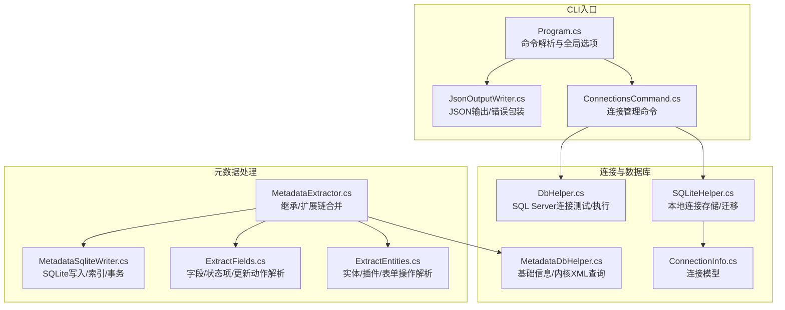
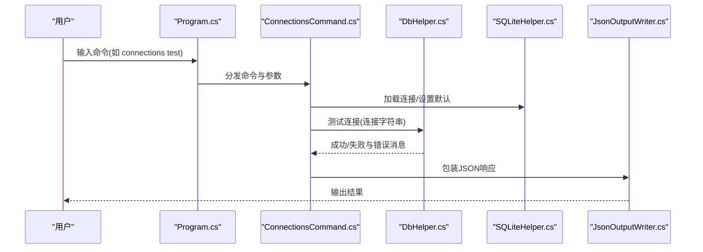
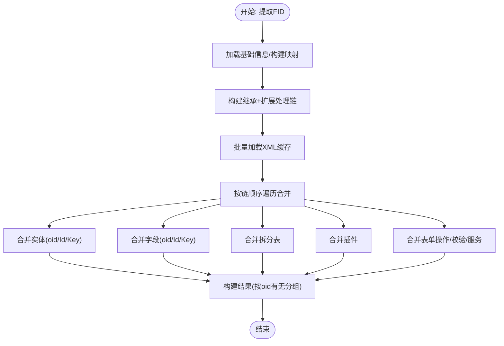
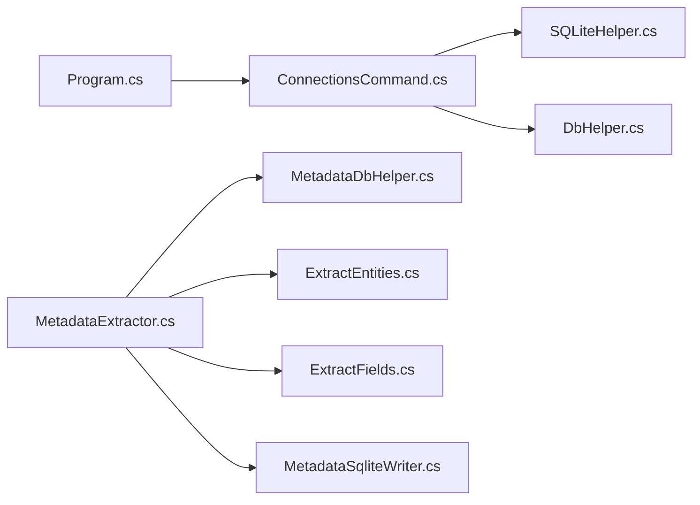

# 故障排除与常见问题

<cite>
**本文引用的文件**
- [Program.cs](file://K3CloudDataDictionary.Cli/Program.cs)
- [DbHelper.cs](file://Helpers/DbHelper.cs)
- [SQLiteHelper.cs](file://Helpers/SQLiteHelper.cs)
- [ConnectionsCommand.cs](file://K3CloudDataDictionary.Cli/Commands/ConnectionsCommand.cs)
- [JsonOutputWriter.cs](file://K3CloudDataDictionary.Cli/Services/JsonOutputWriter.cs)
- [MetadataExtractor.cs](file://Views/MetadataExtractor.cs)
- [MetadataDbHelper.cs](file://Views/MetadataDbHelper.cs)
- [MetadataSqliteWriter.cs](file://Views/MetadataSqliteWriter.cs)
- [ConnectionInfo.cs](file://Models/ConnectionInfo.cs)
- [ExtractEntities.cs](file://Views/ExtractEntities.cs)
- [ExtractFields.cs](file://Views/ExtractFields.cs)
</cite>

## 目录
1. [简介](#简介)
2. [项目结构](#项目结构)
3. [核心组件](#核心组件)
4. [架构总览](#架构总览)
5. [详细组件分析](#详细组件分析)
6. [依赖关系分析](#依赖关系分析)
7. [性能考虑](#性能考虑)
8. [故障排除指南](#故障排除指南)
9. [结论](#结论)
10. [附录](#附录)

## 简介
本文件面向金蝶K3 Cloud数据字典系统的使用者与维护者，提供系统性故障排除与常见问题解答。内容涵盖连接问题（数据库连接失败、认证错误、网络问题）、性能问题（查询缓慢、内存占用高）、数据不一致问题（继承/扩展合并异常、本地SQLite数据缺失或错配）、日志与调试技巧，以及错误处理最佳实践与预防措施。

## 项目结构
系统采用CLI与WPF双入口设计，核心功能围绕“连接管理—元数据抽取—本地SQLite落库”展开，并提供JSON输出与统一错误处理。

**图表来源**
- [Program.cs:14-69](file://K3CloudDataDictionary.Cli/Program.cs#L14-L69)
- [ConnectionsCommand.cs:15-43](file://K3CloudDataDictionary.Cli/Commands/ConnectionsCommand.cs#L15-L43)
- [JsonOutputWriter.cs:11-37](file://K3CloudDataDictionary.Cli/Services/JsonOutputWriter.cs#L11-L37)
- [ConnectionInfo.cs:6-104](file://Models/ConnectionInfo.cs#L6-L104)
- [SQLiteHelper.cs:10-53](file://Helpers/SQLiteHelper.cs#L10-L53)
- [DbHelper.cs:7-25](file://Helpers/DbHelper.cs#L7-L25)
- [MetadataDbHelper.cs:36-79](file://Views/MetadataDbHelper.cs#L36-L79)
- [MetadataExtractor.cs:289-360](file://Views/MetadataExtractor.cs#L289-L360)
- [MetadataSqliteWriter.cs:9-50](file://Views/MetadataSqliteWriter.cs#L9-L50)
- [ExtractEntities.cs:47-139](file://Views/ExtractEntities.cs#L47-L139)
- [ExtractFields.cs:70-164](file://Views/ExtractFields.cs#L70-L164)

**章节来源**
- [Program.cs:14-69](file://K3CloudDataDictionary.Cli/Program.cs#L14-L69)
- [ConnectionsCommand.cs:15-43](file://K3CloudDataDictionary.Cli/Commands/ConnectionsCommand.cs#L15-L43)

## 核心组件
- CLI命令与全局选项：负责解析命令、参数与全局选项（连接ID、JSON美化），并进行统一错误捕获与JSON输出。
- 连接管理：提供连接列表、新增、设置默认、测试连接等功能，连接信息持久化于SQLite。
- 数据库访问：提供SQL Server连接测试与通用查询/标量执行能力，内置超时控制。
- 元数据抽取：基于继承链与扩展链构建处理序列，合并实体、字段、拆分表、插件、表单操作等。
- SQLite写入：创建/重建表结构，批量写入并维护自增ID，支持按表单标识删除与增量写入。
- JSON输出：统一成功/错误响应格式，支持缩进输出便于调试。

**章节来源**
- [Program.cs:74-97](file://K3CloudDataDictionary.Cli/Program.cs#L74-L97)
- [ConnectionsCommand.cs:15-43](file://K3CloudDataDictionary.Cli/Commands/ConnectionsCommand.cs#L15-L43)
- [DbHelper.cs:9-25](file://Helpers/DbHelper.cs#L9-L25)
- [MetadataExtractor.cs:289-360](file://Views/MetadataExtractor.cs#L289-L360)
- [MetadataSqliteWriter.cs:79-283](file://Views/MetadataSqliteWriter.cs#L79-L283)
- [JsonOutputWriter.cs:26-70](file://K3CloudDataDictionary.Cli/Services/JsonOutputWriter.cs#L26-L70)

## 架构总览
系统运行流程概览如下：

**图表来源**
- [Program.cs:34-62](file://K3CloudDataDictionary.Cli/Program.cs#L34-L62)
- [ConnectionsCommand.cs:173-228](file://K3CloudDataDictionary.Cli/Commands/ConnectionsCommand.cs#L173-L228)
- [DbHelper.cs:9-25](file://Helpers/DbHelper.cs#L9-L25)
- [SQLiteHelper.cs:85-112](file://Helpers/SQLiteHelper.cs#L85-L112)
- [JsonOutputWriter.cs:58-70](file://K3CloudDataDictionary.Cli/Services/JsonOutputWriter.cs#L58-L70)

## 详细组件分析

### CLI与命令分发
- 全局选项解析：支持连接ID选择与JSON美化开关。
- 命令路由：根据首参数分发至各命令模块；未知命令输出帮助。
- 错误处理：顶层try/catch捕获异常，统一以JSON错误输出。

**章节来源**
- [Program.cs:74-97](file://K3CloudDataDictionary.Cli/Program.cs#L74-L97)
- [Program.cs:34-62](file://K3CloudDataDictionary.Cli/Program.cs#L34-L62)

### 连接管理命令
- list：列出所有连接及其默认标记。
- add：新增连接，支持设置默认连接。
- test：按ID加载连接并测试SQL Server连接。
- set-default：设置默认连接，自动清理其他默认标记。

**章节来源**
- [ConnectionsCommand.cs:45-74](file://K3CloudDataDictionary.Cli/Commands/ConnectionsCommand.cs#L45-L74)
- [ConnectionsCommand.cs:76-131](file://K3CloudDataDictionary.Cli/Commands/ConnectionsCommand.cs#L76-L131)
- [ConnectionsCommand.cs:133-171](file://K3CloudDataDictionary.Cli/Commands/ConnectionsCommand.cs#L133-L171)
- [ConnectionsCommand.cs:173-228](file://K3CloudDataDictionary.Cli/Commands/ConnectionsCommand.cs#L173-L228)

### 数据库连接与测试
- 连接测试：打开SqlConnection并立即关闭，捕获异常消息。
- 查询执行：设置CommandTimeout，避免长时间阻塞。
- 标量查询：同上，带超时控制。

**章节来源**
- [DbHelper.cs:9-25](file://Helpers/DbHelper.cs#L9-L25)
- [DbHelper.cs:27-54](file://Helpers/DbHelper.cs#L27-L54)
- [DbHelper.cs:56-67](file://Helpers/DbHelper.cs#L56-L67)

### 元数据抽取与合并
- 上下文构建：一次性加载基础信息，构建继承链与扩展映射，支持按批收集所需FID。
- 处理链：从继承路径反转到当前对象，再追加每层的扩展FID，保证合并顺序正确。
- 合并策略：实体/字段按oid匹配覆盖或删除；无oid按Id/Key新增；拆分表、插件、表单操作、业务服务均按oid或Id粒度合并。
- 线程安全：上下文只读，XML缓存按线程局部变量使用，XML在返回后交由GC回收。

**图表来源**
- [MetadataExtractor.cs:102-181](file://Views/MetadataExtractor.cs#L102-L181)
- [MetadataExtractor.cs:299-311](file://Views/MetadataExtractor.cs#L299-L311)
- [MetadataExtractor.cs:322-360](file://Views/MetadataExtractor.cs#L322-L360)
- [MetadataExtractor.cs:616-690](file://Views/MetadataExtractor.cs#L616-L690)

**章节来源**
- [MetadataExtractor.cs:102-181](file://Views/MetadataExtractor.cs#L102-L181)
- [MetadataExtractor.cs:299-360](file://Views/MetadataExtractor.cs#L299-L360)
- [MetadataExtractor.cs:616-690](file://Views/MetadataExtractor.cs#L616-L690)

### SQLite写入与表结构
- 表结构：包含表单、实体、拆分表、字段、枚举、插件、业务服务、表单操作、校验、查找类、单据类型、辅助数据等。
- 写入策略：全量写入时重建表并创建索引；增量写入时复用最大ID并开启事务。
- 删除策略：按表单标识级联删除，随后重置ID计数器。

**章节来源**
- [MetadataSqliteWriter.cs:79-283](file://Views/MetadataSqliteWriter.cs#L79-L283)
- [MetadataSqliteWriter.cs:306-353](file://Views/MetadataSqliteWriter.cs#L306-L353)

### XML解析与数据模型
- 实体解析：提取实体属性、服务规则及当真/当假业务服务。
- 字段解析：提取字段属性、更新动作、状态项。
- 插件与表单操作：提取三类插件容器与表单操作的校验、服务插件、应用业务服务。

**章节来源**
- [ExtractEntities.cs:47-139](file://Views/ExtractEntities.cs#L47-L139)
- [ExtractEntities.cs:144-177](file://Views/ExtractEntities.cs#L144-L177)
- [ExtractEntities.cs:182-274](file://Views/ExtractEntities.cs#L182-L274)
- [ExtractFields.cs:70-164](file://Views/ExtractFields.cs#L70-L164)

## 依赖关系分析
- CLI依赖命令模块与输出模块；命令模块依赖SQLite与数据库助手。
- 元数据抽取依赖数据库助手加载基础信息与内核XML，解析模块依赖XML解析库。
- 写入模块依赖SQLite连接与事务，确保一致性与性能。

**图表来源**
- [Program.cs:3-6](file://K3CloudDataDictionary.Cli/Program.cs#L3-L6)
- [ConnectionsCommand.cs:1-7](file://K3CloudDataDictionary.Cli/Commands/ConnectionsCommand.cs#L1-L7)
- [SQLiteHelper.cs:1-7](file://Helpers/SQLiteHelper.cs#L1-L7)
- [DbHelper.cs:1-4](file://Helpers/DbHelper.cs#L1-L4)
- [MetadataExtractor.cs:1-7](file://Views/MetadataExtractor.cs#L1-L7)
- [MetadataDbHelper.cs:1-7](file://Views/MetadataDbHelper.cs#L1-L7)
- [ExtractEntities.cs:1-6](file://Views/ExtractEntities.cs#L1-L6)
- [ExtractFields.cs:1-6](file://Views/ExtractFields.cs#L1-L6)
- [MetadataSqliteWriter.cs:1-8](file://Views/MetadataSqliteWriter.cs#L1-L8)

**章节来源**
- [Program.cs:3-6](file://K3CloudDataDictionary.Cli/Program.cs#L3-L6)
- [ConnectionsCommand.cs:1-7](file://K3CloudDataDictionary.Cli/Commands/ConnectionsCommand.cs#L1-L7)
- [MetadataExtractor.cs:1-7](file://Views/MetadataExtractor.cs#L1-L7)

## 性能考虑
- 连接超时：查询与标量执行默认CommandTimeout为60秒，避免长时间阻塞；部分服务内部使用更短超时（如30秒）。
- 批量加载：一次性批量加载所需FID的内核XML，减少多次往返。
- 索引与事务：写入阶段重建必要索引，批量写入使用事务提升吞吐。
- 内存与并发：上下文构建只读，XML按线程局部缓存，避免共享状态带来的锁竞争。

**章节来源**
- [DbHelper.cs:36-64](file://Helpers/DbHelper.cs#L36-L64)
- [MetadataExtractor.cs:299-311](file://Views/MetadataExtractor.cs#L299-L311)
- [MetadataSqliteWriter.cs:79-283](file://Views/MetadataSqliteWriter.cs#L79-L283)

## 故障排除指南

### 一、连接问题

1) 数据库连接失败
- 现象：connections test返回失败，message为具体异常信息。
- 排查要点：
  - 检查连接字符串（服务器IP、端口、数据库、用户名、密码）是否正确。
  - 确认SQL Server实例允许远程连接，防火墙放行端口。
  - 使用DbHelper.TestConnection进行最小化验证。
- 处理建议：
  - 重新add连接并设置默认，或使用--connection指定连接ID。
  - 如为默认连接缺失，先配置默认连接再执行其他命令。

2) 认证错误
- 现象：登录失败或权限不足。
- 排查要点：
  - 确认用户名/密码正确，数据库用户存在且启用。
  - 若使用Windows身份验证，请确认客户端域/本地账户权限。
- 处理建议：
  - 在UI或CLI中更新连接信息后再次测试。

3) 网络问题
- 现象：超时或无法连通。
- 排查要点：
  - 使用ping/tracert检查网络连通性。
  - 检查代理/VPN是否影响连接。
- 处理建议：
  - 优化网络路径，必要时调整超时参数（谨慎）。

4) 连接ID无效
- 现象：提示未找到指定ID的连接。
- 排查要点：
  - 使用connections list查看可用ID。
  - 确认--connection参数值与实际ID一致。
- 处理建议：
  - 重新add并记录ID，或使用--connection指定有效ID。

**章节来源**
- [ConnectionsCommand.cs:173-228](file://K3CloudDataDictionary.Cli/Commands/ConnectionsCommand.cs#L173-L228)
- [DbHelper.cs:9-25](file://Helpers/DbHelper.cs#L9-L25)
- [Program.cs:129-151](file://K3CloudDataDictionary.Cli/Program.cs#L129-L151)

### 二、性能问题

1) 查询缓慢
- 现象：fields/search/form等命令耗时较长。
- 排查要点：
  - 检查SQL Server负载与网络延迟。
  - 确认MetadataDbHelper.LoadKernelXmlBatch是否命中索引（数据库侧）。
- 优化建议：
  - 减少一次性处理的FID数量，分批执行。
  - 使用--connection选择更快的数据库实例或网络路径。
  - 适当提高CommandTimeout（谨慎）。

2) 内存占用高
- 现象：大批量抽取时内存飙升。
- 排查要点：
  - 上下文构建与XML缓存会占用内存。
- 优化建议：
  - 控制批大小，及时释放中间结果。
  - 使用增量写入（recreateTables=false）减少重复建表开销。

**章节来源**
- [DbHelper.cs:36-64](file://Helpers/DbHelper.cs#L36-L64)
- [MetadataExtractor.cs:299-311](file://Views/MetadataExtractor.cs#L299-L311)
- [MetadataExtractor.cs:292-294](file://Views/MetadataExtractor.cs#L292-L294)

### 三、数据不一致问题

1) 继承/扩展合并异常
- 现象：实体/字段在合并后出现属性缺失或重复。
- 排查要点：
  - 检查继承链解析（FINHERITPATH）与扩展映射（FDEVTYPE=2）。
  - 确认oid/Id匹配键是否正确（oid优先）。
- 处理建议：
  - 重新执行抽取，确保按完整处理链顺序合并。
  - 对比withoutOid与withOid分组，确认覆盖/删除逻辑生效。

2) 本地SQLite数据缺失或错配
- 现象：本地.db文件缺少表/索引或与期望不符。
- 排查要点：
  - 全量写入会重建表与索引；增量写入复用ID并保持原表结构。
  - 检查connections.db与数据文件命名是否冲突。
- 处理建议：
  - 需要全新环境时使用全量写入；日常维护使用增量写入。
  - 如需按表单标识删除，使用DeleteFormsByIdentifiers清理后再写入。

**章节来源**
- [MetadataExtractor.cs:158-181](file://Views/MetadataExtractor.cs#L158-L181)
- [MetadataExtractor.cs:616-690](file://Views/MetadataExtractor.cs#L616-L690)
- [MetadataSqliteWriter.cs:79-283](file://Views/MetadataSqliteWriter.cs#L79-L283)
- [MetadataSqliteWriter.cs:306-353](file://Views/MetadataSqliteWriter.cs#L306-L353)
- [SQLiteHelper.cs:218-254](file://Helpers/SQLiteHelper.cs#L218-L254)

### 四、日志与调试技巧

- JSON输出：统一success/error结构，错误信息通过Console.Error输出；可使用--pretty美化输出便于阅读。
- CLI帮助：commands/help显示可用命令与参数；connections子命令提供详细帮助。
- 异常捕获：顶层try/catch将异常包装为JSON错误，便于脚本化处理。

**章节来源**
- [JsonOutputWriter.cs:26-70](file://K3CloudDataDictionary.Cli/Services/JsonOutputWriter.cs#L26-L70)
- [Program.cs:53-57](file://K3CloudDataDictionary.Cli/Program.cs#L53-L57)
- [ConnectionsCommand.cs:20-24](file://K3CloudDataDictionary.Cli/Commands/ConnectionsCommand.cs#L20-L24)

### 五、错误处理最佳实践与预防措施

- 预防措施：
  - 始终先connections test，确认连接可用后再执行其他命令。
  - 使用--connection明确指定连接ID，避免默认连接缺失导致的异常。
  - 对大批次抽取设置合理超时与分批策略。
  - 定期备份本地.db文件，避免误删或覆盖。
- 最佳实践：
  - 使用--pretty输出便于人工排查；在自动化场景下关闭美化以减少体积。
  - 对关键命令（如fields/form）增加幂等保护（例如先按标识删除再写入）。
  - 对异常进行分类记录（连接失败/认证错误/超时/数据不一致），便于快速定位。

**章节来源**
- [Program.cs:129-151](file://K3CloudDataDictionary.Cli/Program.cs#L129-L151)
- [ConnectionsCommand.cs:173-228](file://K3CloudDataDictionary.Cli/Commands/ConnectionsCommand.cs#L173-L228)
- [JsonOutputWriter.cs:58-70](file://K3CloudDataDictionary.Cli/Services/JsonOutputWriter.cs#L58-L70)

## 结论
本系统通过CLI命令、连接管理、数据库访问、元数据抽取与SQLite写入形成闭环，具备良好的可维护性与可观测性。针对连接、性能与数据一致性问题，建议遵循“先验证连接—再分批处理—最后落库”的流程，并结合JSON输出与超时控制提升稳定性与可诊断性。

## 附录

### 常见命令与参数速查
- connections list：列出所有连接。
- connections add：新增连接（--server/--port/--db/--user[--password][--name][--default]）。
- connections test：测试指定ID连接（--id）。
- connections set-default：设置默认连接（--id）。
- fields/search/form/billtype/billstatus/assistantdata/enum/resolve：按需执行，支持--connection与--pretty。

**章节来源**
- [ConnectionsCommand.cs:30-42](file://K3CloudDataDictionary.Cli/Commands/ConnectionsCommand.cs#L30-L42)
- [Program.cs:25-26](file://K3CloudDataDictionary.Cli/Program.cs#L25-L26)
- [Program.cs:82-93](file://K3CloudDataDictionary.Cli/Program.cs#L82-L93)