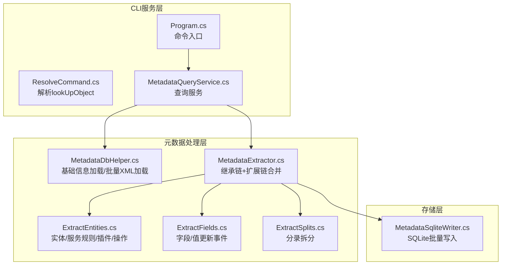
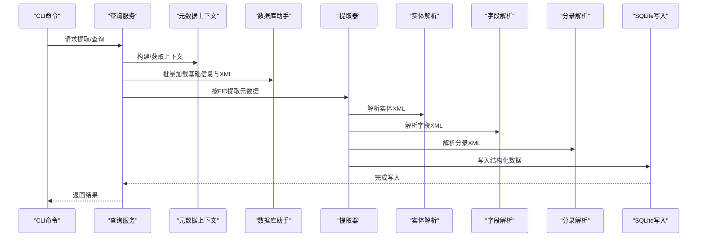
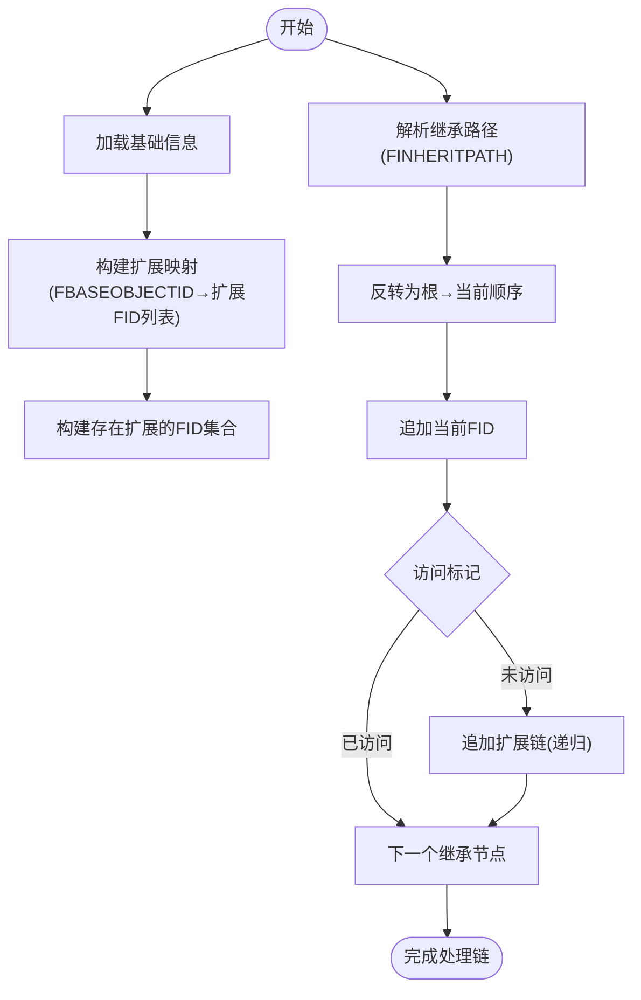
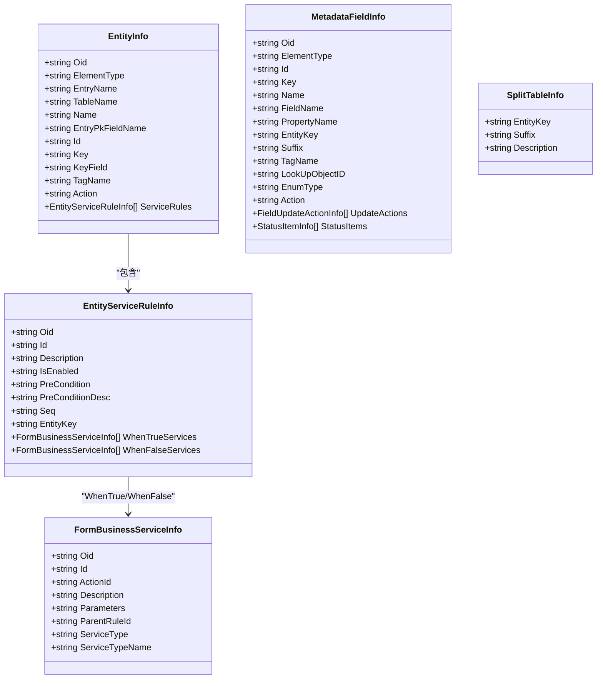
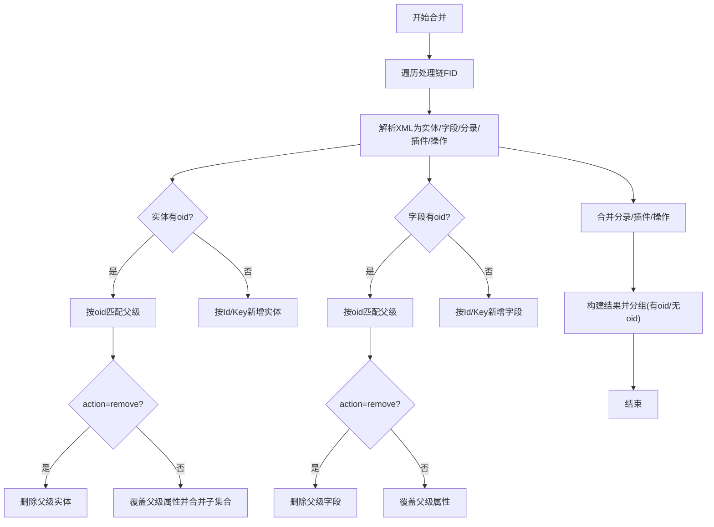
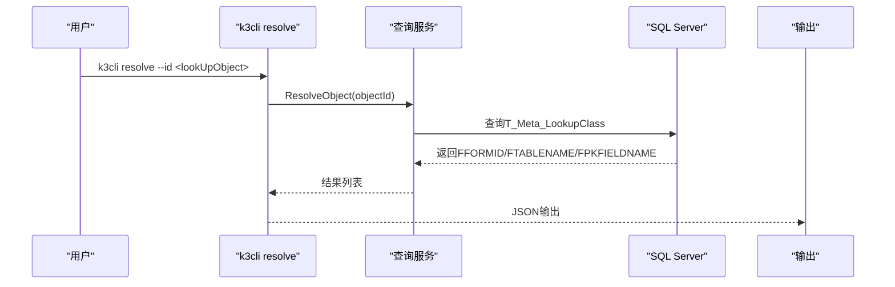
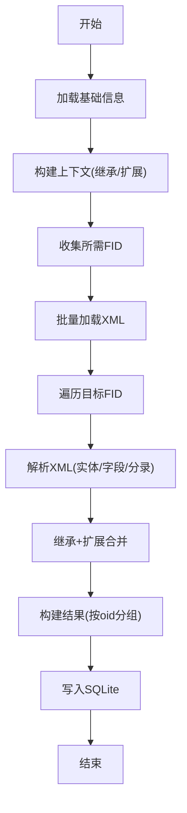
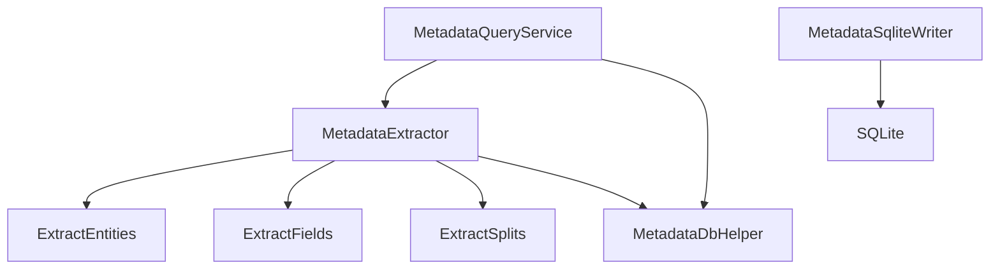

# 元数据提取流程

<cite>
**本文档引用的文件**
- [MetadataExtractor.cs](file://Views/MetadataExtractor.cs)
- [ExtractEntities.cs](file://Views/ExtractEntities.cs)
- [ExtractFields.cs](file://Views/ExtractFields.cs)
- [ExtractSplits.cs](file://Views/ExtractSplits.cs)
- [MetadataDbHelper.cs](file://Views/MetadataDbHelper.cs)
- [MetadataSqliteWriter.cs](file://Views/MetadataSqliteWriter.cs)
- [MetadataQueryService.cs](file://K3CloudDataDictionary.Cli/Services/MetadataQueryService.cs)
- [ResolveCommand.cs](file://K3CloudDataDictionary.Cli/Commands/ResolveCommand.cs)
- [Program.cs](file://K3CloudDataDictionary.Cli/Program.cs)
- [usage-examples.md](file://docs/usage-examples.md)
- [README.md](file://README.md)
</cite>

## 目录
1. [简介](#简介)
2. [项目结构](#项目结构)
3. [核心组件](#核心组件)
4. [架构总览](#架构总览)
5. [详细组件分析](#详细组件分析)
6. [依赖关系分析](#依赖关系分析)
7. [性能考虑](#性能考虑)
8. [故障排除指南](#故障排除指南)
9. [结论](#结论)
10. [附录](#附录)

## 简介
本文件面向金蝶K3 Cloud数据字典系统的元数据提取流程，系统性阐述从原始XML元数据到结构化数据的完整转换过程。重点包括：
- XML元数据解析机制：实体提取、字段提取、分录拆分
- 继承链处理算法与扩展数据合并策略
- lookUpObject解析机制与跨表单关联查询
- 元数据提取的完整流程与数据流图
- 提取效率优化策略与错误处理机制

## 项目结构
项目采用分层架构，核心位于Views目录的元数据提取与解析模块，CLI服务层负责对外查询与命令执行，Models与ViewModels提供UI展示的数据模型。

**图表来源**
- [Program.cs:14-69](file://K3CloudDataDictionary.Cli/Program.cs#L14-L69)
- [MetadataQueryService.cs:12-37](file://K3CloudDataDictionary.Cli/Services/MetadataQueryService.cs#L12-L37)
- [MetadataDbHelper.cs:36-79](file://Views/MetadataDbHelper.cs#L36-L79)
- [MetadataExtractor.cs:289-360](file://Views/MetadataExtractor.cs#L289-L360)
- [ExtractEntities.cs:47-58](file://Views/ExtractEntities.cs#L47-L58)
- [ExtractFields.cs:70-81](file://Views/ExtractFields.cs#L70-L81)
- [ExtractSplits.cs:28-36](file://Views/ExtractSplits.cs#L28-L36)
- [MetadataSqliteWriter.cs:560-598](file://Views/MetadataSqliteWriter.cs#L560-L598)

**章节来源**
- [README.md:36-83](file://README.md#L36-L83)

## 核心组件
- 元数据上下文（MetadataContext）：一次性加载基础信息，构建继承链与扩展链映射，供提取器按需使用
- 元数据提取器（MetadataExtractor）：按继承链+扩展链顺序合并实体、字段、分录、插件、操作事件等
- XML解析器（ExtractEntities/ExtractFields/ExtractSplits）：从XML中抽取实体、字段、分录等结构化信息
- 数据库助手（MetadataDbHelper）：从SQL Server加载基础信息与批量XML
- SQLite写入器（MetadataSqliteWriter）：将结构化数据批量写入本地SQLite
- 查询服务（MetadataQueryService）：提供CLI查询能力，支持lookUpObject解析

**章节来源**
- [MetadataExtractor.cs:102-284](file://Views/MetadataExtractor.cs#L102-L284)
- [ExtractEntities.cs:47-177](file://Views/ExtractEntities.cs#L47-L177)
- [ExtractFields.cs:70-164](file://Views/ExtractFields.cs#L70-L164)
- [ExtractSplits.cs:28-56](file://Views/ExtractSplits.cs#L28-L56)
- [MetadataDbHelper.cs:36-127](file://Views/MetadataDbHelper.cs#L36-L127)
- [MetadataSqliteWriter.cs:560-800](file://Views/MetadataSqliteWriter.cs#L560-L800)
- [MetadataQueryService.cs:12-839](file://K3CloudDataDictionary.Cli/Services/MetadataQueryService.cs#L12-L839)

## 架构总览
元数据提取流程分为“加载→解析→合并→写入”四个阶段，支持继承链与扩展链的递归合并，确保最终结构化数据反映真实业务形态。

**图表来源**
- [MetadataQueryService.cs:12-37](file://K3CloudDataDictionary.Cli/Services/MetadataQueryService.cs#L12-L37)
- [MetadataExtractor.cs:299-360](file://Views/MetadataExtractor.cs#L299-L360)
- [MetadataDbHelper.cs:87-127](file://Views/MetadataDbHelper.cs#L87-L127)
- [MetadataSqliteWriter.cs:560-800](file://Views/MetadataSqliteWriter.cs#L560-L800)

## 详细组件分析

### 继承链与扩展链处理算法
- 继承链构建：基于对象基础信息中的继承路径（FINHERITPATH），解析为从根到当前对象的链路，并反转为“根→当前”的处理顺序
- 扩展链构建：基于扩展对象（FDEVTYPE=2）的基对象ID（FBASEOBJECTID）建立映射，递归追加扩展FID
- 处理顺序：对每个目标FID，先处理继承链，再在每个继承节点后追加其扩展链，形成“继承链+扩展链”的完整处理序列

**图表来源**
- [MetadataExtractor.cs:158-181](file://Views/MetadataExtractor.cs#L158-L181)
- [MetadataExtractor.cs:204-263](file://Views/MetadataExtractor.cs#L204-L263)
- [MetadataExtractor.cs:268-283](file://Views/MetadataExtractor.cs#L268-L283)

**章节来源**
- [MetadataExtractor.cs:102-284](file://Views/MetadataExtractor.cs#L102-L284)

### XML元数据解析机制
- 实体提取（ExtractEntities）
  - 从XML中抽取实体节点，区分带oid（可继承合并）与无oid（新增实体）
  - 提取实体服务规则（EntityServiceRule），并解析WhenTrue/WhenFalse中的业务服务
  - 提取插件（FormPlugins/ListPlugins/WebFormBuilderPlugins）
  - 提取表单操作（FormOperations）及其子集合（Validations/ServicePlugins/AppBusinessServices）
- 字段提取（ExtractFields）
  - 从XML中抽取字段节点，区分带oid与无oid
  - 提取值更新事件（FieldUpdateAction）与单据状态项（StatusItems）
- 分录拆分（ExtractSplits）
  - 从XML中抽取SplitTable节点，结合父实体Key生成实体拆分表信息

**图表来源**
- [ExtractEntities.cs:7-45](file://Views/ExtractEntities.cs#L7-L45)
- [ExtractFields.cs:7-51](file://Views/ExtractFields.cs#L7-L51)
- [ExtractSplits.cs:6-26](file://Views/ExtractSplits.cs#L6-L26)

**章节来源**
- [ExtractEntities.cs:47-291](file://Views/ExtractEntities.cs#L47-L291)
- [ExtractFields.cs:70-167](file://Views/ExtractFields.cs#L70-L167)
- [ExtractSplits.cs:28-60](file://Views/ExtractSplits.cs#L28-L60)

### 扩展数据合并策略
- 实体合并（MergeEntities）
  - 有oid实体：按oid匹配父级，action=remove删除，action=edit覆盖属性
  - 无oid实体：按Id或Key作为字典键新增
- 字段合并（MergeFields）
  - 有oid字段：按oid匹配父级，action=remove删除，action=edit覆盖属性
  - 无oid字段：按Id或Key作为字典键新增
- 分录合并（MergeSplits）
  - 按EntityKey+Suffix匹配：已存在则覆盖Description，不存在则新增
- 插件合并（MergePlugins）
  - 匹配键：oid优先（扩展），否则ClassName（基础）
  - action=remove删除，已存在则覆盖属性，不存在则新增
- 表单操作合并（MergeFormOperations）
  - 匹配键：oid优先（扩展），否则Id（基础）
  - action=remove删除，已存在则覆盖属性并合并子集合

**图表来源**
- [MetadataExtractor.cs:322-360](file://Views/MetadataExtractor.cs#L322-L360)
- [MetadataExtractor.cs:404-451](file://Views/MetadataExtractor.cs#L404-L451)
- [MetadataExtractor.cs:466-507](file://Views/MetadataExtractor.cs#L466-L507)
- [MetadataExtractor.cs:616-690](file://Views/MetadataExtractor.cs#L616-L690)

**章节来源**
- [MetadataExtractor.cs:399-807](file://Views/MetadataExtractor.cs#L399-L807)

### lookUpObject解析机制
- 解析流程：通过字段的lookUpObject值，查询T_Meta_LookupClass获取目标表单标识（FFORMID）、表名（FTABLENAME）、主键字段（FPKFIELDNAME）等
- CLI命令：resolve命令接收--id参数，调用查询服务执行解析并输出JSON结果
- 使用场景：elementType=13（基础资料）与elementType=30（辅助资料）字段的关联查询

**图表来源**
- [ResolveCommand.cs:13-60](file://K3CloudDataDictionary.Cli/Commands/ResolveCommand.cs#L13-L60)
- [MetadataQueryService.cs:83-122](file://K3CloudDataDictionary.Cli/Services/MetadataQueryService.cs#L83-L122)

**章节来源**
- [ResolveCommand.cs:13-60](file://K3CloudDataDictionary.Cli/Commands/ResolveCommand.cs#L13-L60)
- [MetadataQueryService.cs:83-122](file://K3CloudDataDictionary.Cli/Services/MetadataQueryService.cs#L83-L122)
- [usage-examples.md:3-150](file://docs/usage-examples.md#L3-L150)

### 元数据提取完整流程
- 加载基础信息：从T_META_OBJECTTYPE与多语言表加载对象基础信息
- 构建上下文：解析继承路径，构建扩展映射与存在扩展的FID集合
- 批量加载XML：按需收集处理链中涉及的FID，一次性批量查询XML
- 逐层解析与合并：按继承链+扩展链顺序解析XML，合并实体、字段、分录、插件、操作事件
- 写入本地：将结构化数据批量写入SQLite，支持事务与增量更新

**图表来源**
- [MetadataDbHelper.cs:44-79](file://Views/MetadataDbHelper.cs#L44-L79)
- [MetadataExtractor.cs:299-360](file://Views/MetadataExtractor.cs#L299-L360)
- [MetadataSqliteWriter.cs:560-800](file://Views/MetadataSqliteWriter.cs#L560-L800)

**章节来源**
- [MetadataExtractor.cs:299-360](file://Views/MetadataExtractor.cs#L299-L360)
- [MetadataDbHelper.cs:87-127](file://Views/MetadataDbHelper.cs#L87-L127)
- [MetadataSqliteWriter.cs:560-800](file://Views/MetadataSqliteWriter.cs#L560-L800)

## 依赖关系分析
- 组件耦合
  - MetadataExtractor依赖ExtractEntities/ExtractFields/ExtractSplits进行XML解析
  - MetadataExtractor依赖MetadataDbHelper进行基础信息与XML加载
  - MetadataQueryService依赖MetadataExtractor与MetadataDbHelper提供查询能力
  - MetadataSqliteWriter依赖SQLite连接与事务，负责批量写入
- 外部依赖
  - SQL Server：读取基础信息与XML
  - System.Data.SQLite：本地数据存储
  - System.Xml.Linq：XML解析

**图表来源**
- [MetadataExtractor.cs:299-360](file://Views/MetadataExtractor.cs#L299-L360)
- [MetadataDbHelper.cs:36-127](file://Views/MetadataDbHelper.cs#L36-L127)
- [MetadataSqliteWriter.cs:9-50](file://Views/MetadataSqliteWriter.cs#L9-L50)

**章节来源**
- [MetadataExtractor.cs:299-360](file://Views/MetadataExtractor.cs#L299-L360)
- [MetadataDbHelper.cs:36-127](file://Views/MetadataDbHelper.cs#L36-L127)
- [MetadataSqliteWriter.cs:9-50](file://Views/MetadataSqliteWriter.cs#L9-L50)

## 性能考虑
- 批量加载XML：通过CollectNeededFids收集处理链中所有FID，一次性批量查询XML，减少数据库往返
- 线程安全：MetadataContext为只读，提取过程中XML缓存为线程局部变量，避免共享状态带来的锁竞争
- 内存优化：提取器在方法返回后自动释放XML缓存，降低内存占用
- 写入优化：使用SQLite事务批量写入，显著提升写入性能
- 增量更新：支持仅刷新存在扩展的元数据，减少全量刷新开销

**章节来源**
- [MetadataExtractor.cs:299-311](file://Views/MetadataExtractor.cs#L299-L311)
- [MetadataExtractor.cs:322-360](file://Views/MetadataExtractor.cs#L322-L360)
- [MetadataSqliteWriter.cs:49-50](file://Views/MetadataSqliteWriter.cs#L49-L50)
- [README.md:22-23](file://README.md#L22-L23)

## 故障排除指南
- 连接问题
  - 确认连接字符串正确，可通过--connection参数指定连接ID或设置默认连接
  - 使用connections命令管理连接，测试连接可用性
- 提取失败
  - 检查目标FID是否存在扩展，必要时使用GetTargetFidsWithExtensions获取需要扩展合并的FID列表
  - 确认XML加载成功，检查xmlCache中对应FID的XML内容
- 解析异常
  - lookUpObject解析失败时，确认T_Meta_LookupClass中是否存在对应记录
  - 字段关键字搜索无结果时，尝试exact模式或调整关键词
- 写入异常
  - 检查SQLite数据库路径与权限，确保写入表结构已创建
  - 如需增量更新，使用DeleteFormsByIdentifiers清理后再写入

**章节来源**
- [Program.cs:129-151](file://K3CloudDataDictionary.Cli/Program.cs#L129-L151)
- [MetadataExtractor.cs:127-138](file://Views/MetadataExtractor.cs#L127-L138)
- [MetadataQueryService.cs:83-122](file://K3CloudDataDictionary.Cli/Services/MetadataQueryService.cs#L83-L122)
- [MetadataSqliteWriter.cs:306-353](file://Views/MetadataSqliteWriter.cs#L306-L353)

## 结论
本系统通过“上下文构建→批量加载→逐层合并→批量写入”的流水线式设计，实现了对金蝶K3 Cloud元数据的高效提取与转换。继承链与扩展链的递归合并保证了元数据的完整性与一致性，而lookUpObject解析机制则打通了跨表单的关联查询路径。配合SQLite本地存储与CLI查询服务，用户可以便捷地浏览、搜索与分析元数据。

## 附录
- 常用命令参考
  - fields：查询表单字段（支持按表单、实体、关键词过滤）
  - search：搜索表单或字段
  - resolve：解析lookUpObject对应表单
  - billtype/billstatus/enum/assistantdata：查询单据类型、单据状态、枚举、辅助资料
  - connections：管理数据库连接

**章节来源**
- [usage-examples.md:515-542](file://docs/usage-examples.md#L515-L542)
- [README.md:183-216](file://README.md#L183-L216)