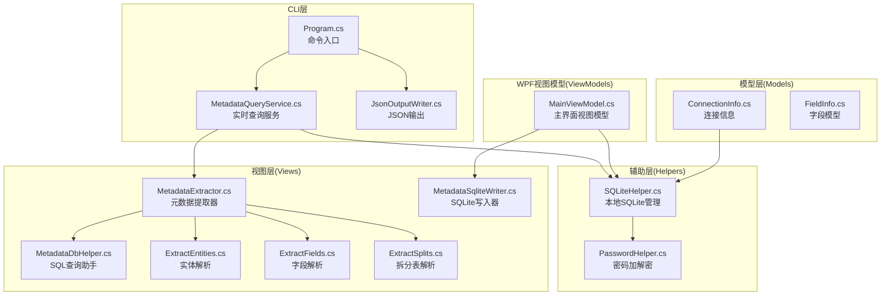
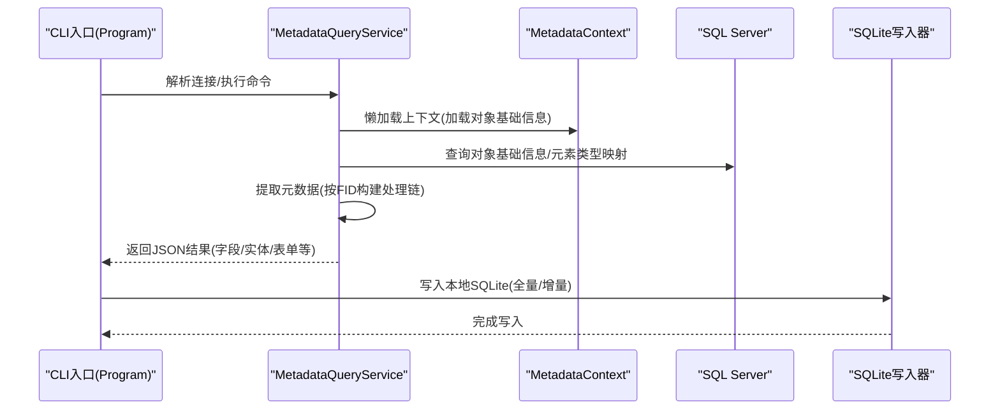
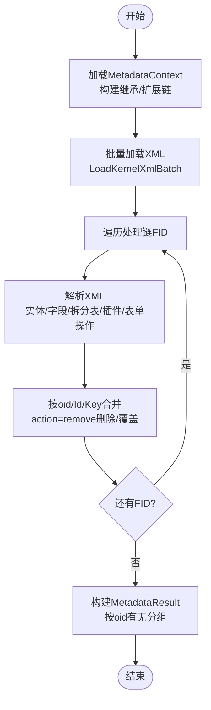
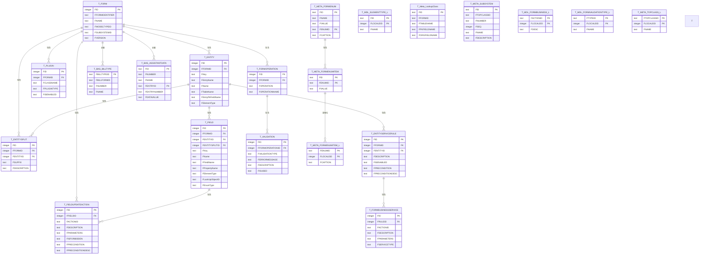
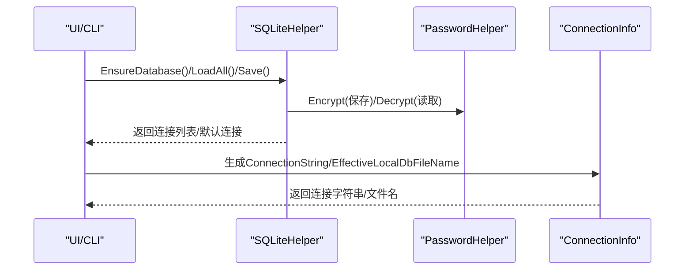
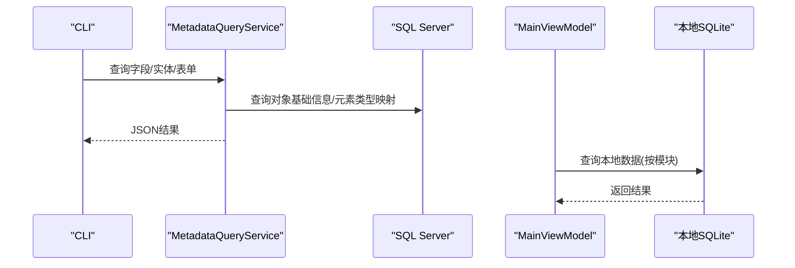
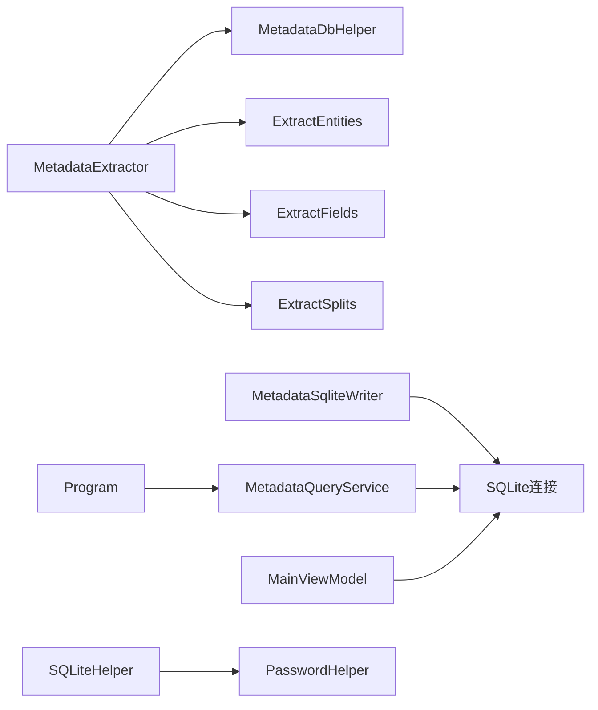

# 数据处理与缓存

<cite>
**本文档引用的文件**
- [MetadataExtractor.cs](file://Views/MetadataExtractor.cs)
- [MetadataSqliteWriter.cs](file://Views/MetadataSqliteWriter.cs)
- [MetadataDbHelper.cs](file://Views/MetadataDbHelper.cs)
- [ExtractEntities.cs](file://Views/ExtractEntities.cs)
- [ExtractFields.cs](file://Views/ExtractFields.cs)
- [ExtractSplits.cs](file://Views/ExtractSplits.cs)
- [SQLiteHelper.cs](file://Helpers/SQLiteHelper.cs)
- [PasswordHelper.cs](file://Helpers/PasswordHelper.cs)
- [ConnectionInfo.cs](file://Models/ConnectionInfo.cs)
- [FieldInfo.cs](file://Models/FieldInfo.cs)
- [Program.cs](file://K3CloudDataDictionary.Cli/Program.cs)
- [MetadataQueryService.cs](file://K3CloudDataDictionary.Cli/Services/MetadataQueryService.cs)
- [JsonOutputWriter.cs](file://K3CloudDataDictionary.Cli/Services/JsonOutputWriter.cs)
- [MainViewModel.cs](file://ViewModels/MainViewModel.cs)
</cite>

## 目录
1. [简介](#简介)
2. [项目结构](#项目结构)
3. [核心组件](#核心组件)
4. [架构总览](#架构总览)
5. [详细组件分析](#详细组件分析)
6. [依赖关系分析](#依赖关系分析)
7. [性能考虑](#性能考虑)
8. [故障排查指南](#故障排查指南)
9. [结论](#结论)
10. [附录](#附录)

## 简介
本文件面向金蝶K3 Cloud数据字典系统的数据处理与缓存机制，围绕以下目标展开：
- 元数据提取流程：XML元数据解析、继承链处理、扩展数据合并等复杂逻辑
- 本地数据存储机制：SQLite数据库设计、数据同步策略、性能优化技巧
- 数据库连接管理、密码处理、数据安全
- 运维指导：数据迁移、备份恢复、性能调优
- 数据流图与处理流程图，帮助理解数据在系统中的流转过程

## 项目结构
项目采用分层与职责分离的设计：
- 视图层（Views）：负责元数据抽取、合并、SQLite写入、实体/字段/XML解析
- 辅助层（Helpers）：SQLite连接与本地数据管理、密码加密解密
- 模型层（Models）：数据传输与UI绑定模型
- CLI服务层（K3CloudDataDictionary.Cli.Services）：命令行工具与实时查询服务
- WPF视图模型（ViewModels）：桌面端UI交互与本地SQLite查询

图表来源
- [Program.cs:14-70](file://K3CloudDataDictionary.Cli/Program.cs#L14-L70)
- [MetadataQueryService.cs:12-37](file://K3CloudDataDictionary.Cli/Services/MetadataQueryService.cs#L12-L37)
- [MetadataExtractor.cs:289-360](file://Views/MetadataExtractor.cs#L289-L360)
- [MetadataDbHelper.cs:36-79](file://Views/MetadataDbHelper.cs#L36-L79)
- [ExtractEntities.cs:47-139](file://Views/ExtractEntities.cs#L47-L139)
- [ExtractFields.cs:70-164](file://Views/ExtractFields.cs#L70-L164)
- [ExtractSplits.cs:28-56](file://Views/ExtractSplits.cs#L28-L56)
- [MetadataSqliteWriter.cs:9-50](file://Views/MetadataSqliteWriter.cs#L9-L50)
- [SQLiteHelper.cs:10-53](file://Helpers/SQLiteHelper.cs#L10-L53)
- [PasswordHelper.cs:7-44](file://Helpers/PasswordHelper.cs#L7-L44)
- [ConnectionInfo.cs:6-144](file://Models/ConnectionInfo.cs#L6-L144)
- [FieldInfo.cs:6-110](file://Models/FieldInfo.cs#L6-L110)
- [MainViewModel.cs:18-120](file://ViewModels/MainViewModel.cs#L18-L120)

章节来源
- [Program.cs:14-70](file://K3CloudDataDictionary.Cli/Program.cs#L14-L70)
- [MetadataExtractor.cs:289-360](file://Views/MetadataExtractor.cs#L289-L360)
- [MetadataSqliteWriter.cs:9-50](file://Views/MetadataSqliteWriter.cs#L9-L50)
- [SQLiteHelper.cs:10-53](file://Helpers/SQLiteHelper.cs#L10-L53)

## 核心组件
- 元数据提取器（MetadataExtractor）：负责构建继承链与扩展链、批量加载XML、按层级合并实体/字段/拆分表/插件/表单操作等
- 元数据数据库助手（MetadataDbHelper）：一次性加载对象基础信息，批量查询内核XML
- XML解析器（ExtractEntities/ExtractFields/ExtractSplits）：从XML中抽取实体、字段、拆分表等结构化数据
- SQLite写入器（MetadataSqliteWriter）：创建/重建表结构、写入元数据、增量删除与ID计数器管理
- 本地SQLite管理（SQLiteHelper）：连接配置存储、默认连接、本地数据文件扫描/导入/重命名/迁移
- 密码处理（PasswordHelper）：基于Windows DPAPI的本地加密存储
- 连接信息（ConnectionInfo）：连接字符串生成、显示名、本地数据库文件名推导
- 字段模型（FieldInfo）：字段属性与UI绑定
- CLI查询服务（MetadataQueryService）：实时查询SQL Server，按需提取元数据并统计插件/服务规则/值更新等
- JSON输出（JsonOutputWriter）：统一的命令行JSON输出格式
- 主视图模型（MainViewModel）：WPF端本地SQLite查询、标签页管理、双击跳转等

章节来源
- [MetadataExtractor.cs:289-360](file://Views/MetadataExtractor.cs#L289-L360)
- [MetadataDbHelper.cs:36-79](file://Views/MetadataDbHelper.cs#L36-L79)
- [ExtractEntities.cs:47-139](file://Views/ExtractEntities.cs#L47-L139)
- [ExtractFields.cs:70-164](file://Views/ExtractFields.cs#L70-L164)
- [ExtractSplits.cs:28-56](file://Views/ExtractSplits.cs#L28-L56)
- [MetadataSqliteWriter.cs:9-50](file://Views/MetadataSqliteWriter.cs#L9-L50)
- [SQLiteHelper.cs:10-53](file://Helpers/SQLiteHelper.cs#L10-L53)
- [PasswordHelper.cs:7-44](file://Helpers/PasswordHelper.cs#L7-L44)
- [ConnectionInfo.cs:6-144](file://Models/ConnectionInfo.cs#L6-L144)
- [FieldInfo.cs:6-110](file://Models/FieldInfo.cs#L6-L110)
- [MetadataQueryService.cs:12-37](file://K3CloudDataDictionary.Cli/Services/MetadataQueryService.cs#L12-L37)
- [JsonOutputWriter.cs:11-91](file://K3CloudDataDictionary.Cli/Services/JsonOutputWriter.cs#L11-L91)
- [MainViewModel.cs:18-120](file://ViewModels/MainViewModel.cs#L18-L120)

## 架构总览
系统分为“离线元数据提取”和“在线实时查询”两条主线：
- 离线提取：通过MetadataContext构建继承/扩展链，批量加载XML，合并实体/字段/拆分表/插件/表单操作，最终写入SQLite
- 在线查询：CLI直接连接SQL Server查询，或WPF通过本地SQLite查询

图表来源
- [Program.cs:14-70](file://K3CloudDataDictionary.Cli/Program.cs#L14-L70)
- [MetadataQueryService.cs:27-37](file://K3CloudDataDictionary.Cli/Services/MetadataQueryService.cs#L27-L37)
- [MetadataExtractor.cs:322-360](file://Views/MetadataExtractor.cs#L322-L360)
- [MetadataSqliteWriter.cs:560-800](file://Views/MetadataSqliteWriter.cs#L560-L800)

## 详细组件分析

### 元数据提取与合并流程
- 继承链与扩展链构建：基于FInheritPath与FDevType=2的扩展对象，构建从根到当前的继承链，并递归附加扩展FID
- 批量XML加载：一次性查询多个FID的内核XML，避免多次往返
- 分层合并策略：
  - 实体/字段：按oid匹配父级，action=remove删除，action=edit覆盖属性；无oid按Id/Key新增
  - 拆分表：按EntityKey+Suffix匹配，存在则覆盖描述，不存在则新增
  - 插件/表单操作/验证/业务服务：按oid优先匹配，action=remove删除，已存在则覆盖属性并递归合并子集合

图表来源
- [MetadataExtractor.cs:158-181](file://Views/MetadataExtractor.cs#L158-L181)
- [MetadataExtractor.cs:322-360](file://Views/MetadataExtractor.cs#L322-L360)
- [MetadataExtractor.cs:404-451](file://Views/MetadataExtractor.cs#L404-L451)
- [MetadataExtractor.cs:616-690](file://Views/MetadataExtractor.cs#L616-L690)

章节来源
- [MetadataExtractor.cs:158-181](file://Views/MetadataExtractor.cs#L158-L181)
- [MetadataExtractor.cs:322-360](file://Views/MetadataExtractor.cs#L322-L360)
- [MetadataExtractor.cs:404-451](file://Views/MetadataExtractor.cs#L404-L451)
- [MetadataExtractor.cs:616-690](file://Views/MetadataExtractor.cs#L616-L690)

### SQLite数据库设计与写入策略
- 表结构概览：包含表单(T_FORM)、实体(T_ENTITY)、拆分表(T_ENTITYSPLIT)、字段(T_FIELD)、字段值更新(T_FIELDUPDATEACTION)、实体服务规则(T_ENTITYSERVICERULE)、业务服务(T_FORMBUSINESSSERVICE)、插件(T_PLUGIN)、表单操作(T_FORMOPERATION)、验证(T_VALIDATION)、单据类型(T_BAS_BILLTYPE)、辅助资料(T_BAS_ASSISTANTDATA)、枚举(T_META_FORMENUM)等
- 写入策略：
  - 全量写入：重建表结构，插入基础语言表与LookupClass等静态数据
  - 增量写入：复用ID计数器，避免重复ID；支持按表单标识删除（级联删除）
- 性能优化：
  - 使用事务批量写入
  - 多处建立索引（如T_FIELD的FKEY、T_ENTITY的FTABLENAME等）

图表来源
- [MetadataSqliteWriter.cs:103-283](file://Views/MetadataSqliteWriter.cs#L103-L283)

章节来源
- [MetadataSqliteWriter.cs:79-283](file://Views/MetadataSqliteWriter.cs#L79-L283)
- [MetadataSqliteWriter.cs:560-800](file://Views/MetadataSqliteWriter.cs#L560-L800)

### 连接管理与密码处理
- 连接配置存储：SQLite存储连接信息（名称、服务器IP、端口、用户名、加密密码、数据库、默认标记、本地数据库文件名）
- 默认连接选择：支持设置/切换默认连接
- 密码处理：使用DPAPI对密码进行本地加密存储，读取时解密
- 本地数据库文件管理：扫描data目录下.db文件，导入/重命名/删除；迁移旧版metadata.db到按连接命名的新文件

图表来源
- [SQLiteHelper.cs:17-53](file://Helpers/SQLiteHelper.cs#L17-L53)
- [SQLiteHelper.cs:55-112](file://Helpers/SQLiteHelper.cs#L55-L112)
- [PasswordHelper.cs:11-43](file://Helpers/PasswordHelper.cs#L11-L43)
- [ConnectionInfo.cs:86-104](file://Models/ConnectionInfo.cs#L86-L104)

章节来源
- [SQLiteHelper.cs:17-53](file://Helpers/SQLiteHelper.cs#L17-L53)
- [SQLiteHelper.cs:55-112](file://Helpers/SQLiteHelper.cs#L55-L112)
- [PasswordHelper.cs:11-43](file://Helpers/PasswordHelper.cs#L11-L43)
- [ConnectionInfo.cs:86-104](file://Models/ConnectionInfo.cs#L86-L104)

### 实时查询与本地查询
- CLI实时查询：MetadataQueryService直接连接SQL Server，按需提取元数据并统计插件/服务规则/值更新等
- 本地查询：MainViewModel通过本地SQLite连接查询，支持双击跳转、按表单/实体/字段/枚举/单据类型等模块化浏览

图表来源
- [MetadataQueryService.cs:172-230](file://K3CloudDataDictionary.Cli/Services/MetadataQueryService.cs#L172-L230)
- [MainViewModel.cs:292-321](file://ViewModels/MainViewModel.cs#L292-L321)

章节来源
- [MetadataQueryService.cs:172-230](file://K3CloudDataDictionary.Cli/Services/MetadataQueryService.cs#L172-L230)
- [MainViewModel.cs:292-321](file://ViewModels/MainViewModel.cs#L292-L321)

## 依赖关系分析
- MetadataExtractor依赖MetadataDbHelper（加载对象基础信息与XML）、ExtractEntities/ExtractFields/ExtractSplits（XML解析）
- MetadataSqliteWriter依赖SQLite连接与事务，写入多表并维护ID计数器
- CLI与WPF均依赖SQLiteHelper进行连接管理与本地数据文件管理
- PasswordHelper被SQLiteHelper用于密码加解密

图表来源
- [MetadataExtractor.cs:299-311](file://Views/MetadataExtractor.cs#L299-L311)
- [MetadataDbHelper.cs:87-127](file://Views/MetadataDbHelper.cs#L87-L127)
- [MetadataSqliteWriter.cs:39-49](file://Views/MetadataSqliteWriter.cs#L39-L49)
- [Program.cs:14-70](file://K3CloudDataDictionary.Cli/Program.cs#L14-L70)
- [MetadataQueryService.cs:19-22](file://K3CloudDataDictionary.Cli/Services/MetadataQueryService.cs#L19-L22)
- [SQLiteHelper.cs:15-15](file://Helpers/SQLiteHelper.cs#L15-L15)
- [PasswordHelper.cs:9-9](file://Helpers/PasswordHelper.cs#L9-L9)

章节来源
- [MetadataExtractor.cs:299-311](file://Views/MetadataExtractor.cs#L299-L311)
- [MetadataSqliteWriter.cs:39-49](file://Views/MetadataSqliteWriter.cs#L39-L49)
- [Program.cs:14-70](file://K3CloudDataDictionary.Cli/Program.cs#L14-L70)
- [MetadataQueryService.cs:19-22](file://K3CloudDataDictionary.Cli/Services/MetadataQueryService.cs#L19-L22)
- [SQLiteHelper.cs:15-15](file://Helpers/SQLiteHelper.cs#L15-L15)

## 性能考虑
- 批量加载XML：一次性查询多个FID的内核XML，减少网络往返
- 内存构建继承链：仅在内存中构建映射与链路，避免重复I/O
- SQLite事务：写入时使用事务，显著提升批量写入性能
- 索引优化：在常用查询字段上建立索引（如T_FIELD.FKEY、T_ENTITY.FTABLENAME等）
- 懒加载上下文：MetadataQueryService按需加载对象基础信息与元素类型映射
- 结果集限制：搜索接口限制返回条目数量，避免过大结果集影响响应

## 故障排查指南
- 连接失败
  - 检查默认连接是否存在，或使用--connection指定连接ID
  - 确认服务器IP/端口/数据库/用户名/密码正确
- 本地数据缺失
  - 确认本地数据库文件路径有效（根据连接的EffectiveLocalDbFileName推导）
  - 若首次使用，需先执行元数据刷新/写入
- 密码相关问题
  - 密码采用DPAPI加密存储，若系统环境变化可能导致解密失败，需重新添加连接
- 查询异常
  - CLI查询超时：适当增加CommandTimeout或检查网络延迟
  - 搜索结果为空：确认关键词大小写/精确匹配设置

章节来源
- [Program.cs:129-151](file://K3CloudDataDictionary.Cli/Program.cs#L129-L151)
- [SQLiteHelper.cs:17-53](file://Helpers/SQLiteHelper.cs#L17-L53)
- [MainViewModel.cs:256-267](file://ViewModels/MainViewModel.cs#L256-L267)
- [MetadataQueryService.cs:42-68](file://K3CloudDataDictionary.Cli/Services/MetadataQueryService.cs#L42-L68)

## 结论
本系统通过“离线提取+在线查询”的双通道设计，既满足了离线本地化浏览的需求，又保留了实时查询的能力。元数据提取器实现了复杂的继承与扩展合并逻辑，SQLite写入器提供了完善的表结构与索引设计，配合本地连接管理与密码保护，形成了安全、高效、可运维的数据字典体系。

## 附录
- 数据迁移
  - 旧版metadata.db迁移：仅在无其他数据文件时迁移至按连接命名的新文件
  - 多连接场景：每个连接可拥有独立的本地数据库文件
- 备份与恢复
  - 本地.db文件即备份文件，可直接复制
  - 恢复：将备份文件放入data目录，或通过导入功能
- 性能调优建议
  - 批量写入时保持事务开启
  - 合理使用索引，避免全表扫描
  - 控制搜索结果集大小，必要时启用精确匹配

章节来源
- [SQLiteHelper.cs:345-367](file://Helpers/SQLiteHelper.cs#L345-L367)
- [MetadataSqliteWriter.cs:79-283](file://Views/MetadataSqliteWriter.cs#L79-L283)
- [MetadataQueryService.cs:42-68](file://K3CloudDataDictionary.Cli/Services/MetadataQueryService.cs#L42-L68)