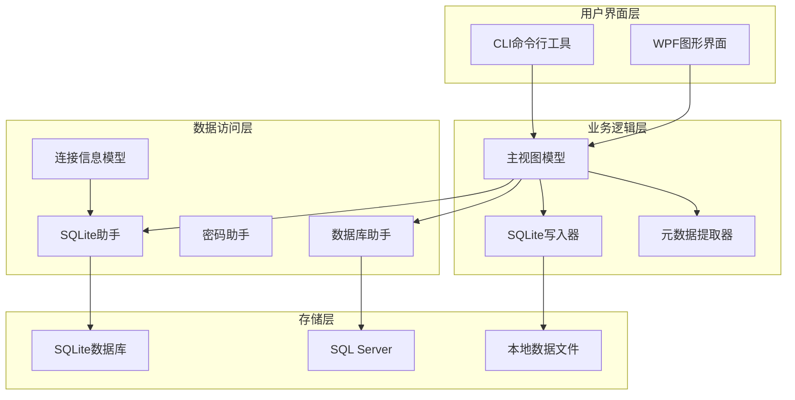
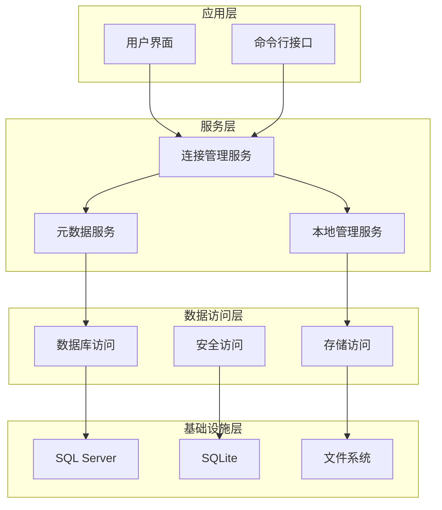
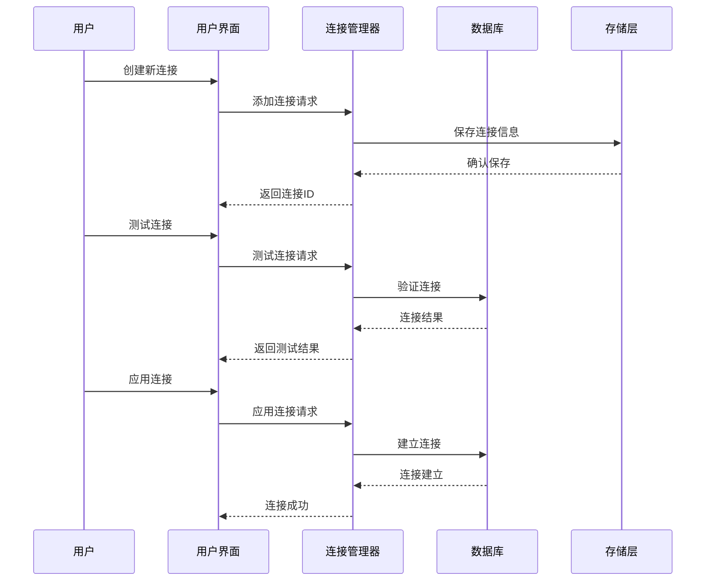
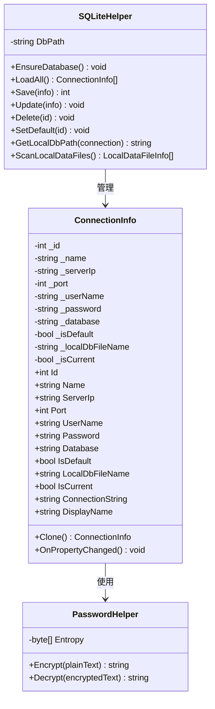
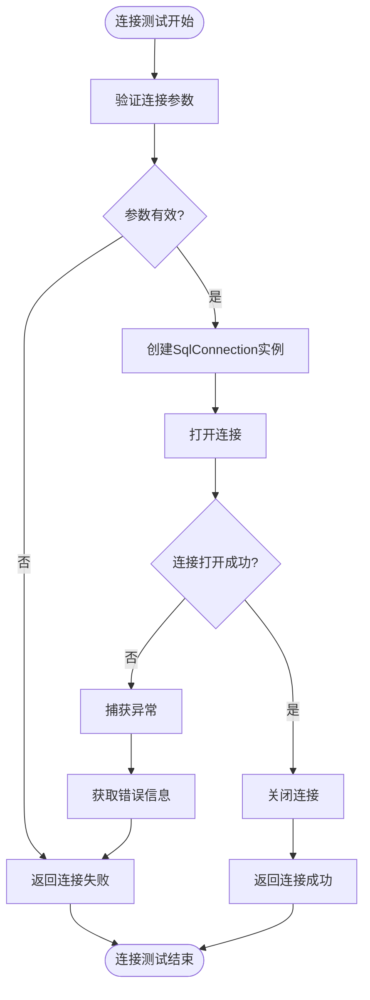
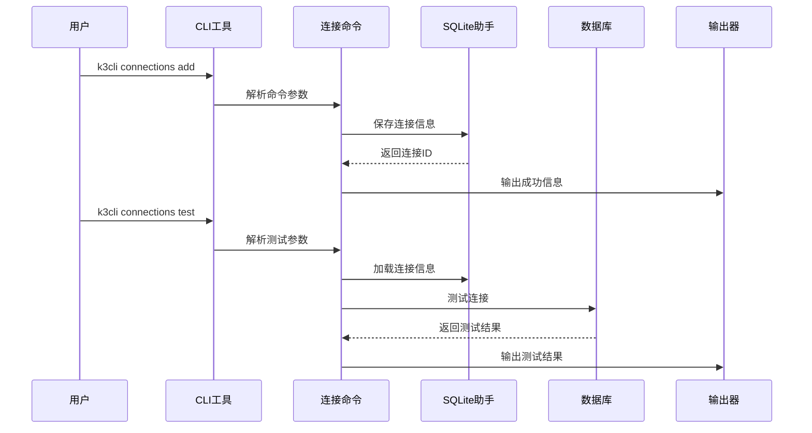
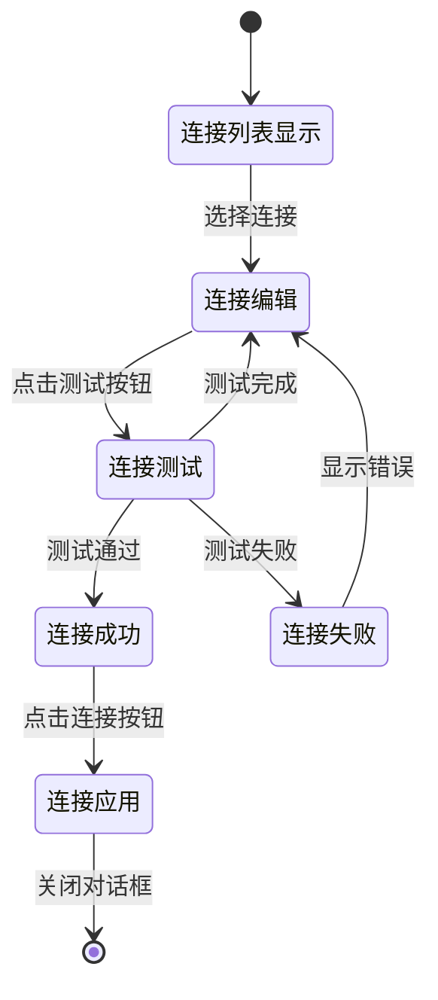
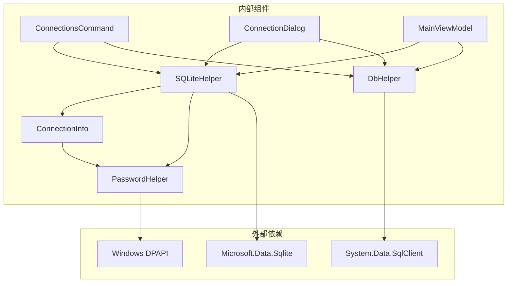

# 数据库连接管理

<cite>
**本文档引用的文件**
- [DbHelper.cs](file://Helpers/DbHelper.cs)
- [PasswordHelper.cs](file://Helpers/PasswordHelper.cs)
- [SQLiteHelper.cs](file://Helpers/SQLiteHelper.cs)
- [ConnectionInfo.cs](file://Models/ConnectionInfo.cs)
- [MetadataDbHelper.cs](file://Views/MetadataDbHelper.cs)
- [ConnectionsCommand.cs](file://K3CloudDataDictionary.Cli/Commands/ConnectionsCommand.cs)
- [Program.cs](file://K3CloudDataDictionary.Cli/Program.cs)
- [ConnectionDialog.xaml.cs](file://ConnectionDialog.xaml.cs)
- [MainWindow.xaml.cs](file://MainWindow.xaml.cs)
- [MainViewModel.cs](file://ViewModels/MainViewModel.cs)
- [MetadataExtractor.cs](file://Views/MetadataExtractor.cs)
- [MetadataSqliteWriter.cs](file://Views/MetadataSqliteWriter.cs)
</cite>

## 目录
1. [简介](#简介)
2. [项目结构](#项目结构)
3. [核心组件](#核心组件)
4. [架构概览](#架构概览)
5. [详细组件分析](#详细组件分析)
6. [依赖关系分析](#依赖关系分析)
7. [性能考虑](#性能考虑)
8. [故障排除指南](#故障排除指南)
9. [结论](#结论)

## 简介

金蝶K3 Cloud数据字典系统的数据库连接管理机制是一个完整的解决方案，专门设计用于管理SQL Server数据库连接。该系统提供了安全的连接信息存储、灵活的连接配置管理、可靠的连接测试功能，以及完整的元数据提取和本地缓存机制。

系统采用多层架构设计，包括CLI工具接口、WPF图形界面、SQLite本地存储、以及SQL Server连接管理等多个层次。整个架构确保了连接管理的安全性、可靠性和易用性。

## 项目结构

该项目采用清晰的分层架构组织，主要分为以下几个核心模块：

**图表来源**
- [Program.cs:14-69](file://K3CloudDataDictionary.Cli/Program.cs#L14-L69)
- [MainViewModel.cs:18-215](file://ViewModels/MainViewModel.cs#L18-L215)

**章节来源**
- [Program.cs:14-69](file://K3CloudDataDictionary.Cli/Program.cs#L14-L69)
- [MainViewModel.cs:18-215](file://ViewModels/MainViewModel.cs#L18-L215)

## 核心组件

### 连接信息管理

连接信息管理是整个系统的核心组件，负责存储和管理所有数据库连接配置。系统支持多连接配置，每个连接都包含完整的连接参数和安全设置。

**连接信息模型特性：**
- 完整的SQL Server连接参数（服务器IP、端口、用户名、密码、数据库）
- 默认连接标记功能
- 本地数据库文件名配置
- 动态连接字符串生成
- 属性变更通知机制

### 密码安全处理

系统实现了多层次的密码安全保护机制，确保敏感信息的安全存储和传输。

**安全特性：**
- Windows DPAPI加密存储
- 用户作用域的加密范围
- 自动解密验证机制
- 安全的密码传输流程

### 连接测试与验证

系统提供了完善的连接测试功能，确保数据库连接的可靠性和可用性。

**测试功能：**
- 即时连接验证
- 错误信息详细反馈
- 连接超时处理
- 异常情况优雅降级

**章节来源**
- [ConnectionInfo.cs:6-144](file://Models/ConnectionInfo.cs#L6-L144)
- [PasswordHelper.cs:7-46](file://Helpers/PasswordHelper.cs#L7-L46)
- [DbHelper.cs:7-70](file://Helpers/DbHelper.cs#L7-L70)

## 架构概览

系统采用分层架构设计，每层都有明确的职责分工和接口定义。

**图表来源**
- [SQLiteHelper.cs:10-370](file://Helpers/SQLiteHelper.cs#L10-L370)
- [ConnectionsCommand.cs:13-231](file://K3CloudDataDictionary.Cli/Commands/ConnectionsCommand.cs#L13-L231)

### 连接生命周期管理

系统实现了完整的连接生命周期管理，从连接创建到销毁都有严格的控制机制。

**图表来源**
- [ConnectionsCommand.cs:76-131](file://K3CloudDataDictionary.Cli/Commands/ConnectionsCommand.cs#L76-L131)
- [ConnectionDialog.xaml.cs:135-200](file://ConnectionDialog.xaml.cs#L135-L200)

## 详细组件分析

### 连接信息模型分析

连接信息模型是系统的核心数据结构，负责封装所有连接相关的属性和行为。

**图表来源**
- [ConnectionInfo.cs:6-144](file://Models/ConnectionInfo.cs#L6-L144)
- [PasswordHelper.cs:7-46](file://Helpers/PasswordHelper.cs#L7-L46)
- [SQLiteHelper.cs:10-370](file://Helpers/SQLiteHelper.cs#L10-L370)

**章节来源**
- [ConnectionInfo.cs:6-144](file://Models/ConnectionInfo.cs#L6-L144)
- [PasswordHelper.cs:7-46](file://Helpers/PasswordHelper.cs#L7-L46)
- [SQLiteHelper.cs:10-370](file://Helpers/SQLiteHelper.cs#L10-L370)

### 数据库连接助手分析

数据库连接助手提供了统一的SQL Server连接管理接口，封装了连接创建、测试和查询执行的复杂逻辑。

**图表来源**
- [DbHelper.cs:9-25](file://Helpers/DbHelper.cs#L9-L25)

**章节来源**
- [DbHelper.cs:9-25](file://Helpers/DbHelper.cs#L9-L25)

### CLI连接管理分析

CLI工具提供了完整的连接管理命令行接口，支持连接的增删改查、测试和默认连接设置。

**图表来源**
- [ConnectionsCommand.cs:15-43](file://K3CloudDataDictionary.Cli/Commands/ConnectionsCommand.cs#L15-L43)
- [Program.cs:14-69](file://K3CloudDataDictionary.Cli/Program.cs#L14-L69)

**章节来源**
- [ConnectionsCommand.cs:15-43](file://K3CloudDataDictionary.Cli/Commands/ConnectionsCommand.cs#L15-L43)
- [Program.cs:14-69](file://K3CloudDataDictionary.Cli/Program.cs#L14-L69)

### 图形界面连接管理分析

图形界面提供了直观的连接管理体验，支持连接的可视化编辑、测试和切换。

**图表来源**
- [ConnectionDialog.xaml.cs:135-200](file://ConnectionDialog.xaml.cs#L135-L200)

**章节来源**
- [ConnectionDialog.xaml.cs:135-200](file://ConnectionDialog.xaml.cs#L135-L200)

## 依赖关系分析

系统采用了清晰的依赖关系设计，确保各组件之间的松耦合和高内聚。

**图表来源**
- [PasswordHelper.cs:16-37](file://Helpers/PasswordHelper.cs#L16-L37)
- [SQLiteHelper.cs:12-13](file://Helpers/SQLiteHelper.cs#L12-L13)

### 组件耦合度分析

系统在设计时充分考虑了组件间的耦合度控制：

**低耦合特性：**
- 模型层与业务逻辑层分离
- 数据访问层独立于UI层
- 加密处理独立于连接管理
- CLI与GUI共享相同的业务逻辑

**高内聚特性：**
- 连接信息模型集中管理所有连接参数
- 密码助手专注于安全处理
- SQLite助手统一管理本地存储
- 数据库助手封装SQL Server操作

**章节来源**
- [PasswordHelper.cs:16-37](file://Helpers/PasswordHelper.cs#L16-L37)
- [SQLiteHelper.cs:12-13](file://Helpers/SQLiteHelper.cs#L12-L13)

## 性能考虑

系统在设计时充分考虑了性能优化，特别是在连接管理和数据处理方面。

### 连接性能优化

**连接池管理：**
- 使用.NET框架内置的连接池机制
- 合理设置连接超时时间
- 及时释放连接资源
- 避免长时间保持连接

**查询性能优化：**
- 批量查询减少网络往返
- 参数化查询提高执行效率
- 适当的索引使用
- 查询结果缓存机制

### 内存管理优化

**对象生命周期管理：**
- 使用using语句确保资源及时释放
- 避免内存泄漏
- 合理的垃圾回收策略
- 大对象的特殊处理

**数据结构优化：**
- 使用合适的数据结构
- 减少不必要的对象创建
- 字符串拼接的优化
- 集合操作的高效实现

## 故障排除指南

### 常见连接问题

**连接超时问题：**
- 检查网络连通性
- 验证SQL Server服务状态
- 调整连接超时参数
- 检查防火墙设置

**认证失败问题：**
- 验证用户名密码正确性
- 检查SQL Server认证模式
- 确认数据库用户权限
- 验证域名和工作组设置

**连接字符串问题：**
- 检查服务器地址格式
- 验证端口号正确性
- 确认数据库名称
- 检查连接参数完整性

### 调试和诊断

**日志记录：**
- 记录连接尝试过程
- 捕获详细的错误信息
- 记录性能指标
- 提供诊断信息

**监控指标：**
- 连接成功率统计
- 平均响应时间
- 错误类型分类
- 性能瓶颈识别

**章节来源**
- [DbHelper.cs:9-25](file://Helpers/DbHelper.cs#L9-L25)
- [ConnectionsCommand.cs:173-228](file://K3CloudDataDictionary.Cli/Commands/ConnectionsCommand.cs#L173-L228)

## 结论

金蝶K3 Cloud数据字典系统的数据库连接管理机制展现了优秀的软件架构设计。系统通过分层架构、安全加密、完善的错误处理和性能优化，为用户提供了一个可靠、安全、易用的数据库连接管理解决方案。

**主要优势：**
- **安全性**：采用Windows DPAPI进行密码加密，确保敏感信息的安全存储
- **可靠性**：完善的连接测试和错误处理机制，保证连接的稳定性
- **易用性**：提供CLI和GUI两种操作界面，满足不同用户需求
- **可维护性**：清晰的代码结构和模块化设计，便于后续维护和扩展

**技术亮点：**
- 多连接配置管理
- 自动化的连接测试
- 本地数据缓存机制
- 完善的异常处理体系

该系统为金蝶K3 Cloud平台的数据字典管理提供了坚实的技术基础，能够有效支撑企业级的数据管理需求。