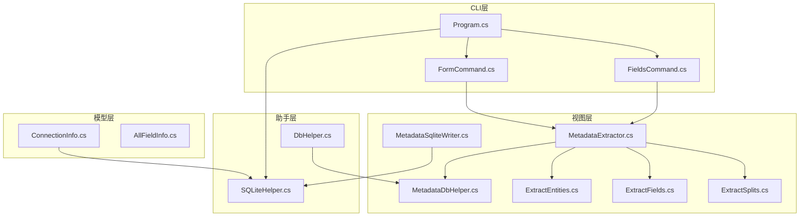
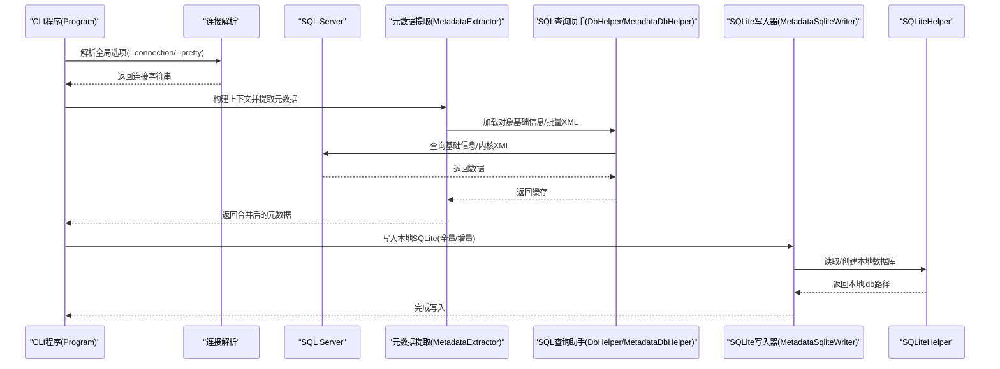
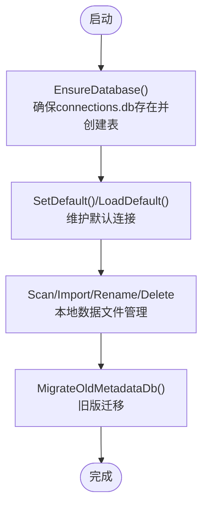
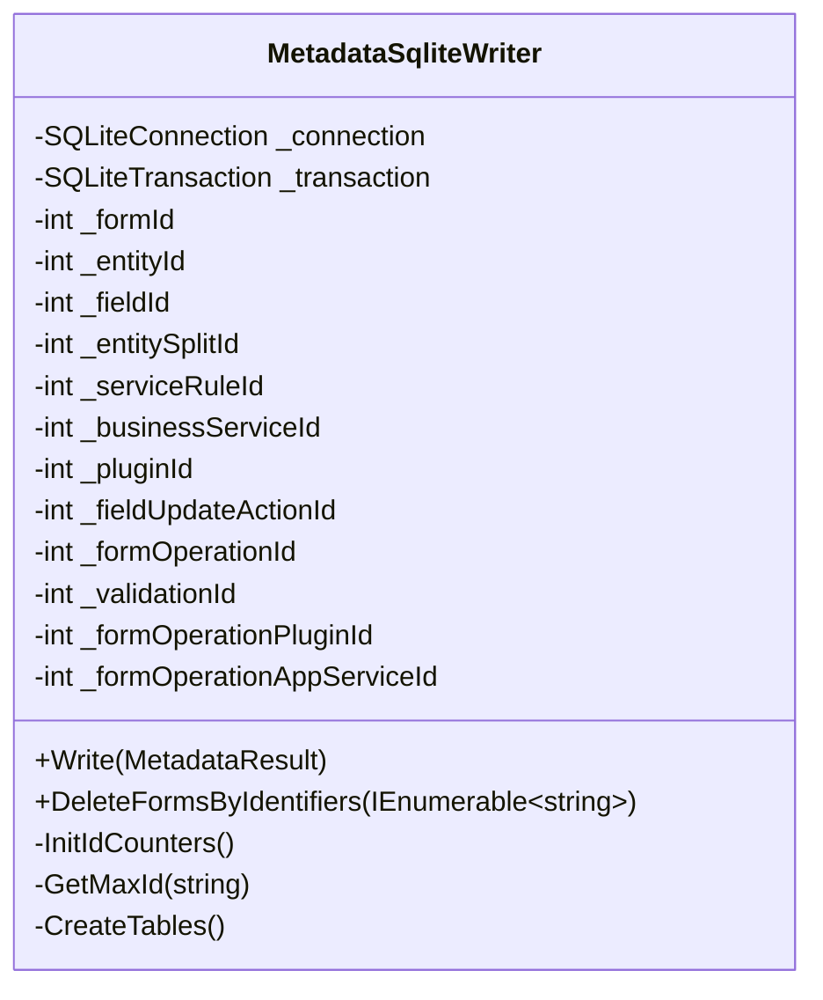
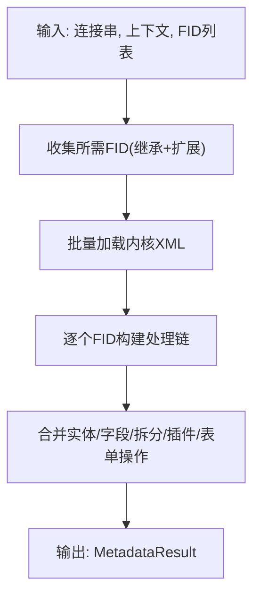
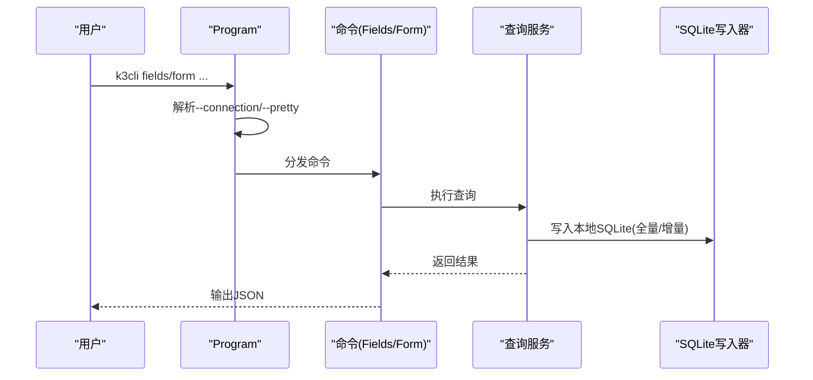
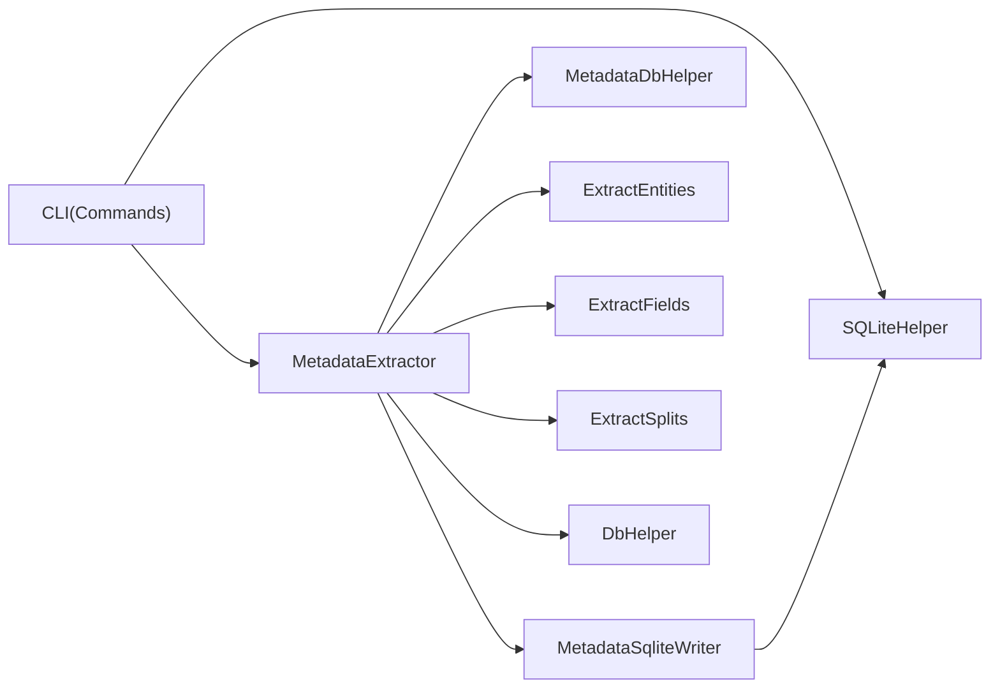
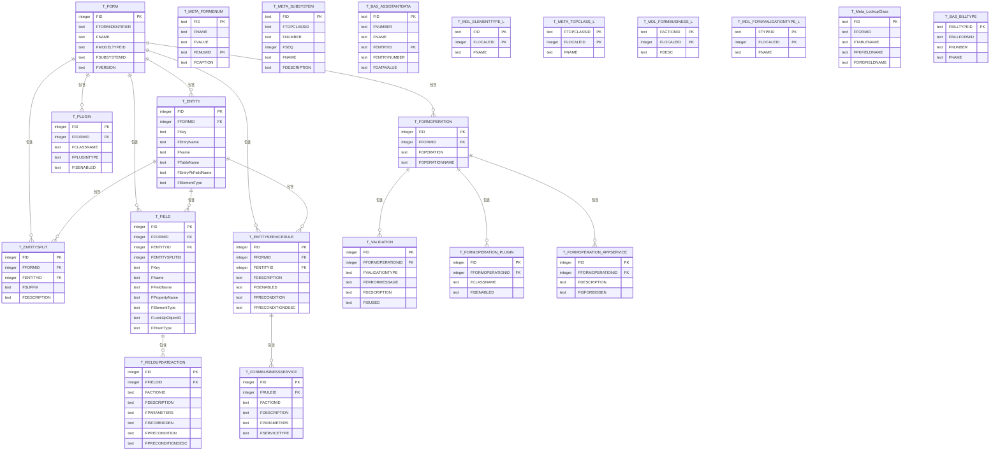
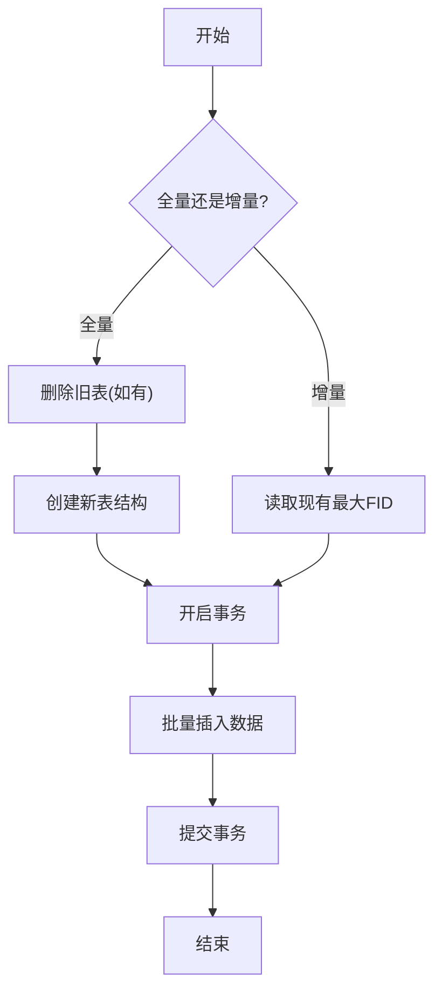

# 本地数据存储

<cite>
**本文引用的文件**   
- [SQLiteHelper.cs](file://Helpers/SQLiteHelper.cs)
- [MetadataSqliteWriter.cs](file://Views/MetadataSqliteWriter.cs)
- [MetadataDbHelper.cs](file://Views/MetadataDbHelper.cs)
- [DbHelper.cs](file://Helpers/DbHelper.cs)
- [ConnectionInfo.cs](file://Models/ConnectionInfo.cs)
- [Program.cs](file://K3CloudDataDictionary.Cli/Program.cs)
- [FieldsCommand.cs](file://K3CloudDataDictionary.Cli/Commands/FieldsCommand.cs)
- [FormCommand.cs](file://K3CloudDataDictionary.Cli/Commands/FormCommand.cs)
- [MetadataExtractor.cs](file://Views/MetadataExtractor.cs)
- [ExtractEntities.cs](file://Views/ExtractEntities.cs)
- [ExtractFields.cs](file://Views/ExtractFields.cs)
- [ExtractSplits.cs](file://Views/ExtractSplits.cs)
- [AllFieldInfo.cs](file://Models/AllFieldInfo.cs)
- [K3CloudDataDictionary.csproj](file://K3CloudDataDictionary.csproj)
</cite>

## 目录
1. [简介](#简介)
2. [项目结构](#项目结构)
3. [核心组件](#核心组件)
4. [架构总览](#架构总览)
5. [详细组件分析](#详细组件分析)
6. [依赖分析](#依赖分析)
7. [性能考虑](#性能考虑)
8. [故障排查指南](#故障排查指南)
9. [结论](#结论)
10. [附录](#附录)

## 简介
本文件面向金蝶K3 Cloud数据字典系统的本地数据存储机制，围绕SQLite数据库设计与使用进行系统化说明。重点涵盖：
- SQLite数据库设计：表结构、索引策略、约束关系
- 数据写入流程：批量插入、事务处理、增量更新
- 数据同步策略：全量刷新、增量更新、数据清理
- 性能优化建议：查询优化、索引使用、内存管理
- 数据库设计图与数据流图，帮助理解数据存储与访问模式

## 项目结构
项目采用分层与功能模块结合的方式组织代码：
- Helpers：通用数据访问与加密辅助（SQLiteHelper、DbHelper）
- Views：元数据抽取、写入与查询辅助（MetadataSqliteWriter、MetadataDbHelper、MetadataExtractor、ExtractEntities、ExtractFields、ExtractSplits）
- Models：领域模型（ConnectionInfo、AllFieldInfo等）
- K3CloudDataDictionary.Cli：CLI入口与命令实现（Program、FieldsCommand、FormCommand等）

**图表来源**
- [Program.cs:1-166](file://K3CloudDataDictionary.Cli/Program.cs#L1-L166)
- [FieldsCommand.cs:1-88](file://K3CloudDataDictionary.Cli/Commands/FieldsCommand.cs#L1-L88)
- [FormCommand.cs:1-93](file://K3CloudDataDictionary.Cli/Commands/FormCommand.cs#L1-L93)
- [MetadataExtractor.cs:1-880](file://Views/MetadataExtractor.cs#L1-L880)
- [MetadataDbHelper.cs:1-131](file://Views/MetadataDbHelper.cs#L1-L131)
- [MetadataSqliteWriter.cs:1-846](file://Views/MetadataSqliteWriter.cs#L1-L846)
- [ExtractEntities.cs:1-293](file://Views/ExtractEntities.cs#L1-L293)
- [ExtractFields.cs:1-167](file://Views/ExtractFields.cs#L1-L167)
- [ExtractSplits.cs:1-60](file://Views/ExtractSplits.cs#L1-L60)
- [SQLiteHelper.cs:1-370](file://Helpers/SQLiteHelper.cs#L1-L370)
- [DbHelper.cs:1-70](file://Helpers/DbHelper.cs#L1-L70)
- [ConnectionInfo.cs:1-144](file://Models/ConnectionInfo.cs#L1-L144)
- [AllFieldInfo.cs:1-50](file://Models/AllFieldInfo.cs#L1-L50)

**章节来源**
- [K3CloudDataDictionary.csproj:1-21](file://K3CloudDataDictionary.csproj#L1-L21)

## 核心组件
- SQLiteHelper：负责连接配置存储（Connections表）、本地数据文件扫描与导入、默认连接设置等
- MetadataSqliteWriter：负责本地元数据SQLite数据库的表创建、批量写入、事务控制、增量更新与删除
- MetadataDbHelper：负责从SQL Server查询对象基础信息与内核XML，供内存合并使用
- DbHelper：通用SQL Server查询执行器
- ConnectionInfo：连接配置模型，包含本地数据库文件名推导逻辑
- CLI命令：Program解析全局选项，FieldsCommand/FormCommand调用查询服务输出JSON

**章节来源**
- [SQLiteHelper.cs:1-370](file://Helpers/SQLiteHelper.cs#L1-L370)
- [MetadataSqliteWriter.cs:1-846](file://Views/MetadataSqliteWriter.cs#L1-L846)
- [MetadataDbHelper.cs:1-131](file://Views/MetadataDbHelper.cs#L1-L131)
- [DbHelper.cs:1-70](file://Helpers/DbHelper.cs#L1-L70)
- [ConnectionInfo.cs:1-144](file://Models/ConnectionInfo.cs#L1-L144)
- [Program.cs:1-166](file://K3CloudDataDictionary.Cli/Program.cs#L1-L166)
- [FieldsCommand.cs:1-88](file://K3CloudDataDictionary.Cli/Commands/FieldsCommand.cs#L1-L88)
- [FormCommand.cs:1-93](file://K3CloudDataDictionary.Cli/Commands/FormCommand.cs#L1-L93)

## 架构总览
本地数据存储的整体流程如下：
- CLI入口解析连接参数，选择默认或指定连接
- 从SQL Server拉取对象基础信息与内核XML，构建继承/扩展链
- 将抽取的元数据写入本地SQLite数据库（全量或增量）
- 提供查询接口输出JSON结果

**图表来源**
- [Program.cs:129-151](file://K3CloudDataDictionary.Cli/Program.cs#L129-L151)
- [MetadataExtractor.cs:299-311](file://Views/MetadataExtractor.cs#L299-L311)
- [MetadataDbHelper.cs:44-79](file://Views/MetadataDbHelper.cs#L44-L79)
- [DbHelper.cs:27-54](file://Helpers/DbHelper.cs#L27-L54)
- [MetadataSqliteWriter.cs:285-301](file://Views/MetadataSqliteWriter.cs#L285-L301)
- [SQLiteHelper.cs:17-53](file://Helpers/SQLiteHelper.cs#L17-L53)

## 详细组件分析

### SQLiteHelper：连接配置与本地数据文件管理
- 功能要点
  - 确保存在本地SQLite数据库（data/connections.db），并创建Connections表
  - 支持默认连接标记（IsDefault）的维护与切换
  - 本地数据文件扫描、导入、重命名、删除
  - 旧版metadata.db迁移至按连接命名的新文件
- 表结构与约束
  - Connections表：主键自增、名称/服务器/IP/端口/用户名/密码/数据库/默认标记/本地文件名
  - 索引：无显式索引（可通过后续优化增加）
- 安全性
  - 密码采用加密存储，读取时解密
- 本地文件管理
  - data目录下除connections.db外均为本地数据文件
  - 导入时避免与连接预期文件名冲突

**图表来源**
- [SQLiteHelper.cs:17-53](file://Helpers/SQLiteHelper.cs#L17-L53)
- [SQLiteHelper.cs:176-188](file://Helpers/SQLiteHelper.cs#L176-L188)
- [SQLiteHelper.cs:218-254](file://Helpers/SQLiteHelper.cs#L218-L254)
- [SQLiteHelper.cs:260-303](file://Helpers/SQLiteHelper.cs#L260-L303)
- [SQLiteHelper.cs:345-367](file://Helpers/SQLiteHelper.cs#L345-L367)

**章节来源**
- [SQLiteHelper.cs:17-370](file://Helpers/SQLiteHelper.cs#L17-L370)
- [ConnectionInfo.cs:86-96](file://Models/ConnectionInfo.cs#L86-L96)

### MetadataSqliteWriter：本地元数据SQLite写入器
- 功能要点
  - 全量写入：重建表结构并批量插入
  - 增量更新：基于现有表最大FID生成新ID，避免冲突
  - 事务控制：单次写入在一个事务中提交
  - 删除支持：按表单标识删除（级联删除相关表）
- 表结构与索引
  - 主表：T_FORM、T_ENTITY、T_ENTITYSPLIT、T_FIELD
  - 辅助表：枚举、字典、业务规则、插件、表单操作、校验等
  - 索引：针对常用查询列建立索引（如T_FORM的FFORMIDENTIFIER、T_ENTITY的FFORMID/FTABLENAME等）
- 写入流程
  - 生成自增FID（从现有最大值+1开始）
  - 插入表单、实体、拆分、字段、字段更新动作、实体服务规则、业务服务、插件、表单操作、校验等
  - 事务提交

**图表来源**
- [MetadataSqliteWriter.cs:9-50](file://Views/MetadataSqliteWriter.cs#L9-L50)
- [MetadataSqliteWriter.cs:55-77](file://Views/MetadataSqliteWriter.cs#L55-L77)
- [MetadataSqliteWriter.cs:79-283](file://Views/MetadataSqliteWriter.cs#L79-L283)

**章节来源**
- [MetadataSqliteWriter.cs:1-846](file://Views/MetadataSqliteWriter.cs#L1-L846)

### 元数据抽取与合并：MetadataExtractor
- 功能要点
  - 构建对象基础信息字典（不含XML），用于继承/扩展链
  - 批量加载内核XML，按继承链与扩展链合并实体、字段、拆分表、插件、表单操作等
  - 支持action=remove/edit等语义，保证覆盖与删除逻辑正确
- 处理流程
  - 收集目标FID及其完整处理链
  - 逐层合并，最终生成MetadataResult

**图表来源**
- [MetadataExtractor.cs:299-311](file://Views/MetadataExtractor.cs#L299-L311)
- [MetadataExtractor.cs:322-360](file://Views/MetadataExtractor.cs#L322-L360)
- [MetadataDbHelper.cs:44-79](file://Views/MetadataDbHelper.cs#L44-L79)

**章节来源**
- [MetadataExtractor.cs:1-880](file://Views/MetadataExtractor.cs#L1-L880)
- [MetadataDbHelper.cs:1-131](file://Views/MetadataDbHelper.cs#L1-L131)

### CLI命令与查询服务集成
- Program：解析全局选项，解析连接参数，选择默认或指定连接
- FieldsCommand/FormCommand：构造查询参数，调用MetadataQueryService，输出JSON

**图表来源**
- [Program.cs:14-69](file://K3CloudDataDictionary.Cli/Program.cs#L14-L69)
- [FieldsCommand.cs:13-85](file://K3CloudDataDictionary.Cli/Commands/FieldsCommand.cs#L13-L85)
- [FormCommand.cs:13-90](file://K3CloudDataDictionary.Cli/Commands/FormCommand.cs#L13-L90)

**章节来源**
- [Program.cs:1-166](file://K3CloudDataDictionary.Cli/Program.cs#L1-L166)
- [FieldsCommand.cs:1-88](file://K3CloudDataDictionary.Cli/Commands/FieldsCommand.cs#L1-L88)
- [FormCommand.cs:1-93](file://K3CloudDataDictionary.Cli/Commands/FormCommand.cs#L1-L93)

## 依赖分析
- 外部依赖
  - System.Data.SQLite.Core：SQLite访问
  - System.Data.SqlClient：SQL Server访问
- 内部依赖
  - CLI层依赖SQLiteHelper与命令实现
  - 视图层依赖DbHelper/MetadataDbHelper进行SQL Server查询
  - 写入器依赖SQLiteHelper进行本地数据库路径解析

**图表来源**
- [K3CloudDataDictionary.csproj:12-16](file://K3CloudDataDictionary.csproj#L12-L16)
- [Program.cs:1-166](file://K3CloudDataDictionary.Cli/Program.cs#L1-L166)
- [MetadataExtractor.cs:1-880](file://Views/MetadataExtractor.cs#L1-L880)
- [MetadataDbHelper.cs:1-131](file://Views/MetadataDbHelper.cs#L1-L131)
- [DbHelper.cs:1-70](file://Helpers/DbHelper.cs#L1-L70)
- [MetadataSqliteWriter.cs:1-846](file://Views/MetadataSqliteWriter.cs#L1-L846)
- [SQLiteHelper.cs:1-370](file://Helpers/SQLiteHelper.cs#L1-L370)

**章节来源**
- [K3CloudDataDictionary.csproj:1-21](file://K3CloudDataDictionary.csproj#L1-L21)

## 性能考虑
- 查询优化
  - 在频繁过滤/连接的列上建立索引（如T_FORM的FFORMIDENTIFIER、T_ENTITY的FFORMID/FTABLENAME、T_FIELD的FFORMID/FENTITYID/FKEY等）
  - 对枚举/字典类表（T_META_FORMENUM、T_META_SUBSYSTEM等）建立复合主键或唯一索引
- 写入优化
  - 使用事务批量提交，减少磁盘写入次数
  - 增量更新时复用现有最大FID，避免重复扫描
- 内存管理
  - 元数据抽取阶段使用字典与集合进行去重与快速查找
  - 批量加载XML后及时释放，避免长时间占用内存
- I/O优化
  - 本地数据文件统一存放于data目录，便于管理与备份
  - 导入/重命名时避免与连接预期文件名冲突，减少误识别

[本节为通用指导，无需特定文件引用]

## 故障排查指南
- 连接问题
  - 使用DbHelper.TestConnection验证SQL Server连接
  - 检查Program.ResolveConnectionString是否正确解析默认或指定连接
- 写入失败
  - 确认SQLiteHelper.EnsureDatabase已执行
  - 检查MetadataSqliteWriter事务是否正常提交
- 数据不一致
  - 全量刷新前确认是否需要删除旧数据（DeleteFormsByIdentifiers）
  - 增量更新时检查InitIdCounters是否正确初始化
- 本地文件异常
  - 使用SQLiteHelper.ScanLocalDataFiles检查data目录
  - 导入/重命名时注意保留扩展名与避免冲突

**章节来源**
- [DbHelper.cs:9-25](file://Helpers/DbHelper.cs#L9-L25)
- [Program.cs:129-151](file://K3CloudDataDictionary.Cli/Program.cs#L129-L151)
- [SQLiteHelper.cs:17-53](file://Helpers/SQLiteHelper.cs#L17-L53)
- [MetadataSqliteWriter.cs:285-301](file://Views/MetadataSqliteWriter.cs#L285-L301)
- [MetadataSqliteWriter.cs:306-353](file://Views/MetadataSqliteWriter.cs#L306-L353)

## 结论
本系统通过SQLite实现本地元数据的高效存储与管理，配合SQL Server的元数据抽取能力，形成“远程抽取—本地持久化—快速查询”的完整闭环。通过事务化写入、索引优化与内存合并策略，能够在保证一致性的同时提升性能与可用性。

[本节为总结，无需特定文件引用]

## 附录

### 数据库设计图（概念）

[此图为概念性设计图，展示各表之间的关系与主键/外键约束，不直接映射具体源文件]

### 数据写入流程（全量/增量）

**图表来源**
- [MetadataSqliteWriter.cs:41-49](file://Views/MetadataSqliteWriter.cs#L41-L49)
- [MetadataSqliteWriter.cs:79-283](file://Views/MetadataSqliteWriter.cs#L79-L283)
- [MetadataSqliteWriter.cs:55-69](file://Views/MetadataSqliteWriter.cs#L55-L69)

### 数据同步策略
- 全量刷新：重建表结构并重新写入
- 增量更新：基于现有最大FID生成新ID，避免冲突
- 数据清理：按表单标识删除（级联删除相关表），随后重新初始化ID计数器

**章节来源**
- [MetadataSqliteWriter.cs:306-353](file://Views/MetadataSqliteWriter.cs#L306-L353)