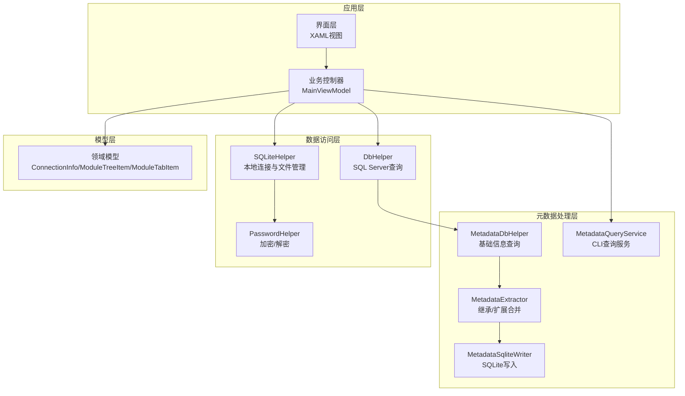
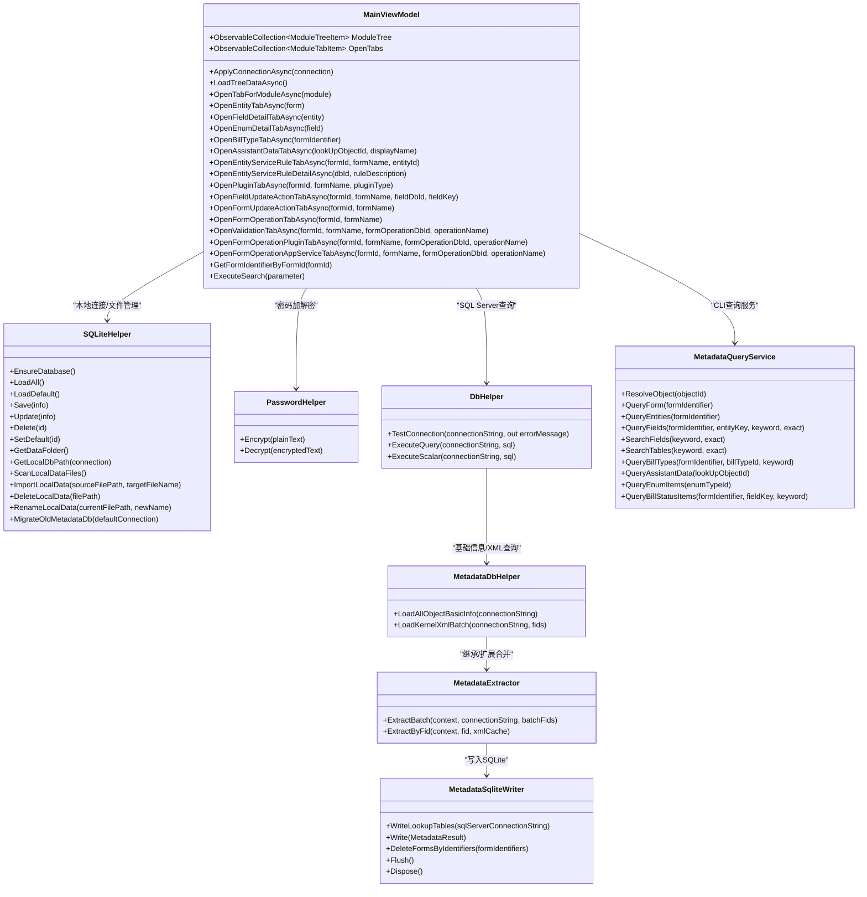
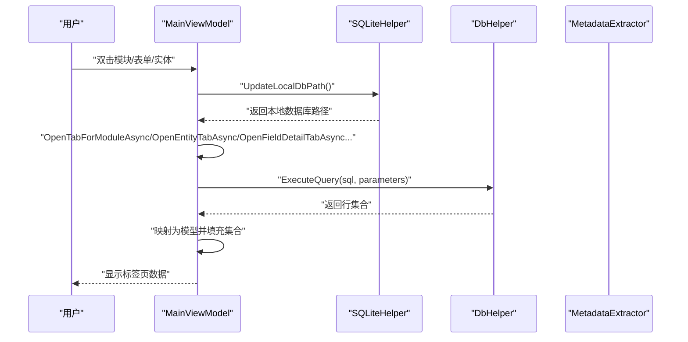
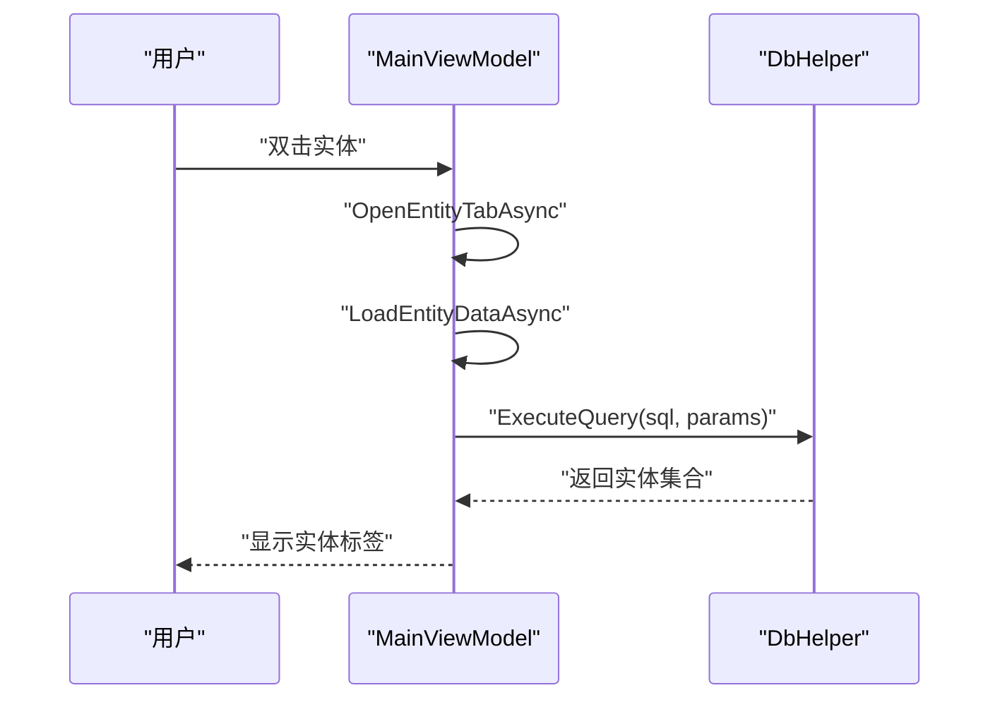
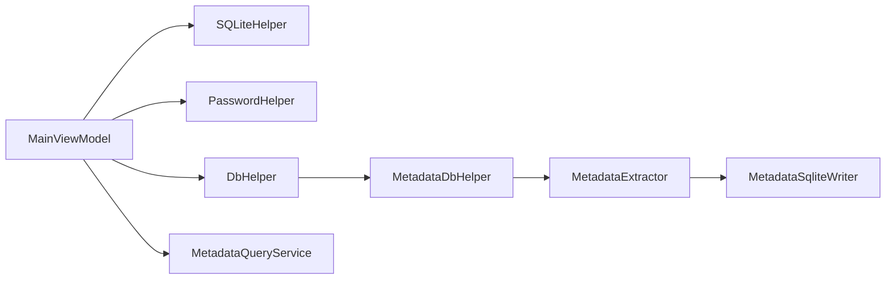

# 业务逻辑处理

<cite>
**本文档引用的文件**
- [MainViewModel.cs](file://ViewModels/MainViewModel.cs)
- [DbHelper.cs](file://Helpers/DbHelper.cs)
- [SQLiteHelper.cs](file://Helpers/SQLiteHelper.cs)
- [PasswordHelper.cs](file://Helpers/PasswordHelper.cs)
- [ConnectionInfo.cs](file://Models/ConnectionInfo.cs)
- [ModuleTreeItem.cs](file://Models/ModuleTreeItem.cs)
- [ModuleTabItem.cs](file://Models/ModuleTabItem.cs)
- [MetadataDbHelper.cs](file://Views/MetadataDbHelper.cs)
- [MetadataExtractor.cs](file://Views/MetadataExtractor.cs)
- [MetadataSqliteWriter.cs](file://Views/MetadataSqliteWriter.cs)
- [MetadataQueryService.cs](file://K3CloudDataDictionary.Cli/Services/MetadataQueryService.cs)
- [ResolveCommand.cs](file://K3CloudDataDictionary.Cli/Commands/ResolveCommand.cs)
</cite>

## 目录
1. [简介](#简介)
2. [项目结构](#项目结构)
3. [核心组件](#核心组件)
4. [架构总览](#架构总览)
5. [详细组件分析](#详细组件分析)
6. [依赖关系分析](#依赖关系分析)
7. [性能考虑](#性能考虑)
8. [故障排查指南](#故障排查指南)
9. [结论](#结论)
10. [附录](#附录)

## 简介
本文件围绕金蝶K3 Cloud数据字典系统，聚焦于业务控制器MainViewModel的职责与实现，系统性梳理其在数据管理、界面交互、业务规则处理等方面的逻辑，并结合数据库访问层（DbHelper、SQLiteHelper）、密码处理（PasswordHelper）及元数据抽取与查询（MetadataExtractor、MetadataQueryService）的整体设计，形成完整的业务逻辑处理说明。文档同时提供调用关系图与数据流向图，辅以具体业务场景示例与错误处理策略，帮助开发者快速理解并扩展系统。

## 项目结构
项目采用MVVM架构与模块化组织，主要目录与职责如下：
- Helpers：通用工具层，负责数据库连接、SQLite本地数据管理与密码保护
- Models：领域模型与UI绑定模型，承载树形模块、标签页数据结构
- Views：元数据抽取、SQL写入、数据库查询辅助等
- K3CloudDataDictionary.Cli：命令行工具，提供实时查询与解析能力
- ViewModels：业务控制器MainViewModel，协调数据加载、界面状态与用户交互
- Views/XAML：界面模板与业务视图

**图表来源**
- [MainViewModel.cs](file://ViewModels/MainViewModel.cs)
- [DbHelper.cs](file://Helpers/DbHelper.cs)
- [SQLiteHelper.cs](file://Helpers/SQLiteHelper.cs)
- [PasswordHelper.cs](file://Helpers/PasswordHelper.cs)
- [MetadataDbHelper.cs](file://Views/MetadataDbHelper.cs)
- [MetadataExtractor.cs](file://Views/MetadataExtractor.cs)
- [MetadataSqliteWriter.cs](file://Views/MetadataSqliteWriter.cs)
- [MetadataQueryService.cs](file://K3CloudDataDictionary.Cli/Services/MetadataQueryService.cs)

**章节来源**
- [MainViewModel.cs](file://ViewModels/MainViewModel.cs)
- [SQLiteHelper.cs](file://Helpers/SQLiteHelper.cs)
- [DbHelper.cs](file://Helpers/DbHelper.cs)
- [MetadataDbHelper.cs](file://Views/MetadataDbHelper.cs)
- [MetadataExtractor.cs](file://Views/MetadataExtractor.cs)
- [MetadataSqliteWriter.cs](file://Views/MetadataSqliteWriter.cs)
- [MetadataQueryService.cs](file://K3CloudDataDictionary.Cli/Services/MetadataQueryService.cs)

## 核心组件
- MainViewModel：业务控制器，负责连接管理、树形模块加载、标签页数据加载、搜索筛选、状态更新与UI交互
- SQLiteHelper：本地SQLite连接与文件管理，含连接信息存储、本地数据文件扫描与导入/重命名/删除
- DbHelper：SQL Server连接测试与查询执行
- PasswordHelper：基于DPAPI的密码加解密
- 元数据处理：MetadataDbHelper（基础信息查询）、MetadataExtractor（继承/扩展合并）、MetadataSqliteWriter（SQLite写入）
- CLI查询服务：MetadataQueryService（实时查询）、ResolveCommand（对象ID反查）

**章节来源**
- [MainViewModel.cs](file://ViewModels/MainViewModel.cs)
- [SQLiteHelper.cs](file://Helpers/SQLiteHelper.cs)
- [DbHelper.cs](file://Helpers/DbHelper.cs)
- [PasswordHelper.cs](file://Helpers/PasswordHelper.cs)
- [MetadataDbHelper.cs](file://Views/MetadataDbHelper.cs)
- [MetadataExtractor.cs](file://Views/MetadataExtractor.cs)
- [MetadataSqliteWriter.cs](file://Views/MetadataSqliteWriter.cs)
- [MetadataQueryService.cs](file://K3CloudDataDictionary.Cli/Services/MetadataQueryService.cs)
- [ResolveCommand.cs](file://K3CloudDataDictionary.Cli/Commands/ResolveCommand.cs)

## 架构总览
下图展示MainViewModel在系统中的位置及其与各层的交互关系：

**图表来源**
- [MainViewModel.cs](file://ViewModels/MainViewModel.cs)
- [SQLiteHelper.cs](file://Helpers/SQLiteHelper.cs)
- [PasswordHelper.cs](file://Helpers/PasswordHelper.cs)
- [DbHelper.cs](file://Helpers/DbHelper.cs)
- [MetadataDbHelper.cs](file://Views/MetadataDbHelper.cs)
- [MetadataExtractor.cs](file://Views/MetadataExtractor.cs)
- [MetadataSqliteWriter.cs](file://Views/MetadataSqliteWriter.cs)
- [MetadataQueryService.cs](file://K3CloudDataDictionary.Cli/Services/MetadataQueryService.cs)

## 详细组件分析

### MainViewModel：业务控制器
- 角色定位
  - 连接管理：保存/加载默认连接、切换连接时清理旧数据、更新本地数据库路径
  - 树形模块：按层级加载模块树（顶级分类、子系统、表单），支持展开与选择
  - 标签页数据：按模块/表单/实体/字段/枚举/单据类型/辅助资料/服务规则/插件/值更新/表单操作等维度加载数据
  - 搜索与筛选：支持多种运算符（等于/包含/左包含/右包含）对表单进行搜索与筛选
  - 状态更新：根据打开的标签页动态更新状态栏文本
  - 本地数据查询：通过SQLiteHelper提供的本地数据库路径执行SQL查询，封装为ExecuteQuery方法

- 关键流程
  - 连接应用：ApplyConnectionAsync设置当前连接、清空旧数据、更新本地路径、按需加载树
  - 模块选择：OnModuleSelected触发OpenTabForModuleAsync，避免重复打开同模块标签
  - 实体/字段/枚举/单据类型/辅助资料/服务规则/插件/值更新/表单操作：均有独立异步方法，统一通过ExecuteQuery执行SQL并填充对应集合
  - 搜索：ExecuteSearch根据运算符构建SQL并执行，支持新建搜索标签或在当前表单标签内筛选

- 错误处理
  - 模块加载失败、各类查询异常均捕获并设置状态文本提示
  - 标签页关闭时避免跨线程操作，使用Dispatcher延后恢复状态

- 性能要点
  - 大多数查询使用Task.Run在后台线程执行，避免阻塞UI
  - 使用SQLiteParameter防止SQL注入
  - 标签页去重与复用，减少重复查询

**图表来源**
- [MainViewModel.cs](file://ViewModels/MainViewModel.cs)
- [SQLiteHelper.cs](file://Helpers/SQLiteHelper.cs)
- [DbHelper.cs](file://Helpers/DbHelper.cs)
- [MetadataExtractor.cs](file://Views/MetadataExtractor.cs)

**章节来源**
- [MainViewModel.cs](file://ViewModels/MainViewModel.cs)

### 数据库访问层设计

#### DbHelper：SQL Server查询
- 功能
  - 连接测试：TestConnection
  - 查询执行：ExecuteQuery（返回行集合）
  - 标量查询：ExecuteScalar
- 设计特点
  - 使用SqlConnection/SqlCommand/SqlDataReader
  - 设置CommandTimeout避免长时间阻塞
  - 字段名大小写不敏感映射为字典键

**章节来源**
- [DbHelper.cs](file://Helpers/DbHelper.cs)

#### SQLiteHelper：本地数据管理
- 功能
  - 连接信息存储：EnsureDatabase创建connections.db与Connections表，支持迁移旧列
  - 连接管理：LoadAll/LoadDefault/Save/Update/Delete/SetDefault
  - 本地文件管理：GetDataFolder/GetLocalDbPath/ScanLocalDataFiles/ImportLocalData/DeleteLocalData/RenameLocalData
  - 兼容迁移：MigrateOldMetadataDb将旧版metadata.db迁移到按连接命名的新文件
- 安全
  - 密码字段通过PasswordHelper加密存储
- 设计特点
  - 使用System.Data.SQLite
  - 参数化查询，避免拼接SQL
  - 文件名冲突检测与自动重命名

**章节来源**
- [SQLiteHelper.cs](file://Helpers/SQLiteHelper.cs)
- [PasswordHelper.cs](file://Helpers/PasswordHelper.cs)

### 密码处理安全机制（PasswordHelper）
- 机制
  - 基于Windows DPAPI（DataProtectionScope.CurrentUser）
  - 使用固定熵（Entropy）增强安全性
  - 异常回退：失败时返回原文
- 应用点
  - SQLiteHelper保存/更新连接信息时加密存储
  - SQLiteHelper读取连接信息时解密显示

**章节来源**
- [PasswordHelper.cs](file://Helpers/PasswordHelper.cs)
- [SQLiteHelper.cs](file://Helpers/SQLiteHelper.cs)

### 元数据抽取与查询

#### MetadataDbHelper：基础信息与XML查询
- 基础信息：LoadAllObjectBasicInfo（模型类型限定为400/100）
- XML批查询：LoadKernelXmlBatch（一次性获取多个FID的XML）

**章节来源**
- [MetadataDbHelper.cs](file://Views/MetadataDbHelper.cs)

#### MetadataExtractor：继承/扩展合并
- 上下文构建：MetadataContext（构建扩展映射、继承链、目标FID集合）
- 合并策略：实体/字段/拆分表/插件/表单操作/验证/服务插件/应用服务等的合并与覆盖
- 线程安全：上下文只读，XML缓存线程局部

**章节来源**
- [MetadataExtractor.cs](file://Views/MetadataExtractor.cs)

#### MetadataSqliteWriter：SQLite写入
- 表结构：创建并维护大量业务表（T_FORM/T_ENTITY/T_FIELD/T_ENTITYSPLIT/T_PLUGIN/T_FORMBUSINESSSERVICE/T_FIELDUPDATEACTION/T_FORMOPERATION/T_VALIDATION/T_FORMOPERATION_PLUGIN/T_FORMOPERATION_APPSERVICE等）
- 写入流程：按继承链与扩展链合并后的结果写入，支持级联删除与增量写入
- 事务：使用SQLiteTransaction提升写入性能与一致性

**章节来源**
- [MetadataSqliteWriter.cs](file://Views/MetadataSqliteWriter.cs)

#### CLI查询服务（MetadataQueryService）
- 实时查询：ResolveObject、QueryForm、QueryEntities、QueryFields、SearchFields、SearchTables、QueryBillTypes、QueryAssistantData、QueryEnumItems、QueryBillStatusItems
- 上下文：MetadataContext懒加载，减少首次开销
- 输出：统一返回字典列表，便于JSON输出

**章节来源**
- [MetadataQueryService.cs](file://K3CloudDataDictionary.Cli/Services/MetadataQueryService.cs)

### 业务场景示例与调用关系

#### 场景一：查看表单实体与字段
- 步骤
  - 选择模块 → 打开表单标签
  - 双击实体 → 打开实体标签
  - 双击字段 → 打开字段详情标签
- 关系
  - MainViewModel.OpenEntityTabAsync → MainViewModel.LoadEntityDataAsync → ExecuteQuery
  - MainViewModel.OpenFieldDetailTabAsync → MainViewModel.LoadFieldDataAsync → ExecuteQuery

**图表来源**
- [MainViewModel.cs](file://ViewModels/MainViewModel.cs)
- [DbHelper.cs](file://Helpers/DbHelper.cs)

#### 场景二：查看枚举项
- 步骤
  - 字段类型为枚举 → 双击枚举类型列 → 打开枚举标签
- 关系
  - MainViewModel.OpenEnumDetailTabAsync → ExecuteQuery → 填充枚举项集合

**章节来源**
- [MainViewModel.cs](file://ViewModels/MainViewModel.cs)

#### 场景三：查看单据类型
- 步骤
  - 通过表单标识 → 打开单据类型标签
- 关系
  - MainViewModel.OpenBillTypeTabAsync → ExecuteQuery → 填充单据类型集合

**章节来源**
- [MainViewModel.cs](file://ViewModels/MainViewModel.cs)

#### 场景四：查看辅助资料
- 步骤
  - 字段为单选辅助资料 → 双击LookUpObjectID → 打开辅助资料标签
- 关系
  - MainViewModel.OpenAssistantDataTabAsync → ExecuteQuery → 填充辅助资料项集合

**章节来源**
- [MainViewModel.cs](file://ViewModels/MainViewModel.cs)

#### 场景五：查看服务规则与服务
- 步骤
  - 双击实体行 → 打开服务规则标签
  - 双击规则行 → 打开规则详情标签（WhenTrue/WhenFalse）
- 关系
  - MainViewModel.OpenEntityServiceRuleTabAsync → ExecuteQuery
  - MainViewModel.OpenEntityServiceRuleDetailAsync → ExecuteQuery

**章节来源**
- [MainViewModel.cs](file://ViewModels/MainViewModel.cs)

#### 场景六：查看值更新事件
- 步骤
  - 字段/表单/实体 → 打开值更新标签
- 关系
  - MainViewModel.OpenFieldUpdateActionTabAsync/OpenFormUpdateActionTabAsync/OpenEntityUpdateActionTabAsync → ExecuteQuery

**章节来源**
- [MainViewModel.cs](file://ViewModels/MainViewModel.cs)

#### 场景七：查看表单操作、校验规则、服务插件与应用服务
- 步骤
  - 打开表单操作标签 → 可进一步查看校验规则、服务插件、应用服务
- 关系
  - MainViewModel.OpenFormOperationTabAsync → OpenValidationTabAsync/OpenFormOperationPluginTabAsync/OpenFormOperationAppServiceTabAsync → ExecuteQuery

**章节来源**
- [MainViewModel.cs](file://ViewModels/MainViewModel.cs)

#### 场景八：CLI解析LookUpObject
- 步骤
  - resolve命令 → MetadataQueryService.ResolveObject → 查询T_Meta_LookupClass
- 关系
  - ResolveCommand → MetadataQueryService → DbHelper

**章节来源**
- [ResolveCommand.cs](file://K3CloudDataDictionary.Cli/Commands/ResolveCommand.cs)
- [MetadataQueryService.cs](file://K3CloudDataDictionary.Cli/Services/MetadataQueryService.cs)
- [DbHelper.cs](file://Helpers/DbHelper.cs)

## 依赖关系分析
- MainViewModel依赖SQLiteHelper（本地连接/文件管理）、PasswordHelper（密码加解密）、DbHelper（SQL Server查询）
- DbHelper依赖MetadataDbHelper（基础信息/XML查询）
- MetadataDbHelper与MetadataExtractor协作完成继承/扩展合并
- MetadataExtractor与MetadataSqliteWriter协作完成SQLite写入
- CLI查询服务（MetadataQueryService）直接依赖DbHelper与MetadataDbHelper

**图表来源**
- [MainViewModel.cs](file://ViewModels/MainViewModel.cs)
- [SQLiteHelper.cs](file://Helpers/SQLiteHelper.cs)
- [PasswordHelper.cs](file://Helpers/PasswordHelper.cs)
- [DbHelper.cs](file://Helpers/DbHelper.cs)
- [MetadataDbHelper.cs](file://Views/MetadataDbHelper.cs)
- [MetadataExtractor.cs](file://Views/MetadataExtractor.cs)
- [MetadataSqliteWriter.cs](file://Views/MetadataSqliteWriter.cs)
- [MetadataQueryService.cs](file://K3CloudDataDictionary.Cli/Services/MetadataQueryService.cs)

**章节来源**
- [MainViewModel.cs](file://ViewModels/MainViewModel.cs)
- [DbHelper.cs](file://Helpers/DbHelper.cs)
- [SQLiteHelper.cs](file://Helpers/SQLiteHelper.cs)
- [PasswordHelper.cs](file://Helpers/PasswordHelper.cs)
- [MetadataDbHelper.cs](file://Views/MetadataDbHelper.cs)
- [MetadataExtractor.cs](file://Views/MetadataExtractor.cs)
- [MetadataSqliteWriter.cs](file://Views/MetadataSqliteWriter.cs)
- [MetadataQueryService.cs](file://K3CloudDataDictionary.Cli/Services/MetadataQueryService.cs)

## 性能考虑
- 异步与后台执行：大多数查询使用Task.Run在后台线程执行，避免UI阻塞
- 参数化SQL：统一使用SQLiteParameter/SqlParameter，提升性能与安全性
- 事务写入：MetadataSqliteWriter使用事务批量提交，减少磁盘I/O
- 标签页去重：避免重复打开相同模块/实体/字段标签，减少重复查询
- 上下文懒加载：CLI查询服务的MetadataContext按需初始化，降低启动成本

## 故障排查指南
- 连接失败
  - 使用DbHelper.TestConnection检查连接字符串与网络连通性
  - 检查SQLiteHelper的连接信息是否正确（用户名/密码已加密存储）
- 查询异常
  - 捕获异常并设置状态文本，定位具体异常信息
  - 检查SQL语句与参数是否正确（运算符/关键字）
- 本地数据缺失
  - 确认SQLiteHelper.GetLocalDbPath返回有效路径
  - 使用ScanLocalDataFiles确认数据文件是否存在
- CLI解析失败
  - 确认resolve命令参数id有效
  - 检查MetadataQueryService.ResolveObject返回结果

**章节来源**
- [DbHelper.cs](file://Helpers/DbHelper.cs)
- [SQLiteHelper.cs](file://Helpers/SQLiteHelper.cs)
- [MainViewModel.cs](file://ViewModels/MainViewModel.cs)
- [MetadataQueryService.cs](file://K3CloudDataDictionary.Cli/Services/MetadataQueryService.cs)
- [ResolveCommand.cs](file://K3CloudDataDictionary.Cli/Commands/ResolveCommand.cs)

## 结论
MainViewModel作为业务控制器，承担了连接管理、树形模块与标签页数据加载、搜索筛选与状态更新等核心职责。通过DbHelper与SQLiteHelper实现了对SQL Server与本地SQLite的统一访问，配合PasswordHelper确保密码安全存储。元数据处理链路（MetadataDbHelper → MetadataExtractor → MetadataSqliteWriter）提供了强大的继承/扩展合并与SQLite写入能力。CLI查询服务（MetadataQueryService）则为实时查询与解析提供了便捷入口。整体架构清晰、职责分离明确，具备良好的扩展性与可维护性。

## 附录
- 模型定义参考
  - [ConnectionInfo.cs](file://Models/ConnectionInfo.cs)
  - [ModuleTreeItem.cs](file://Models/ModuleTreeItem.cs)
  - [ModuleTabItem.cs](file://Models/ModuleTabItem.cs)

**章节来源**
- [ConnectionInfo.cs](file://Models/ConnectionInfo.cs)
- [ModuleTreeItem.cs](file://Models/ModuleTreeItem.cs)
- [ModuleTabItem.cs](file://Models/ModuleTabItem.cs)