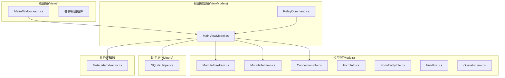
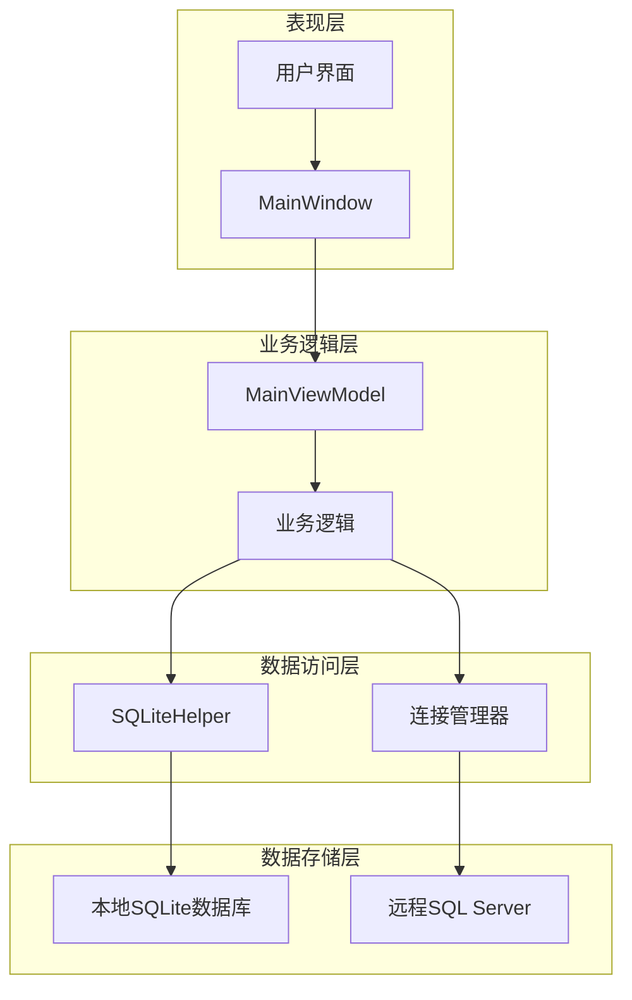
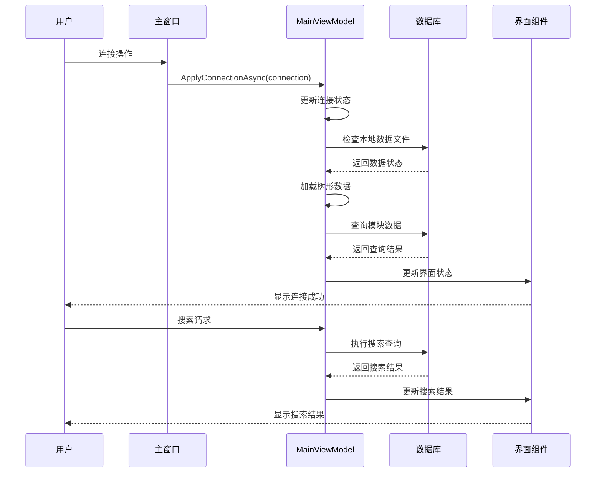
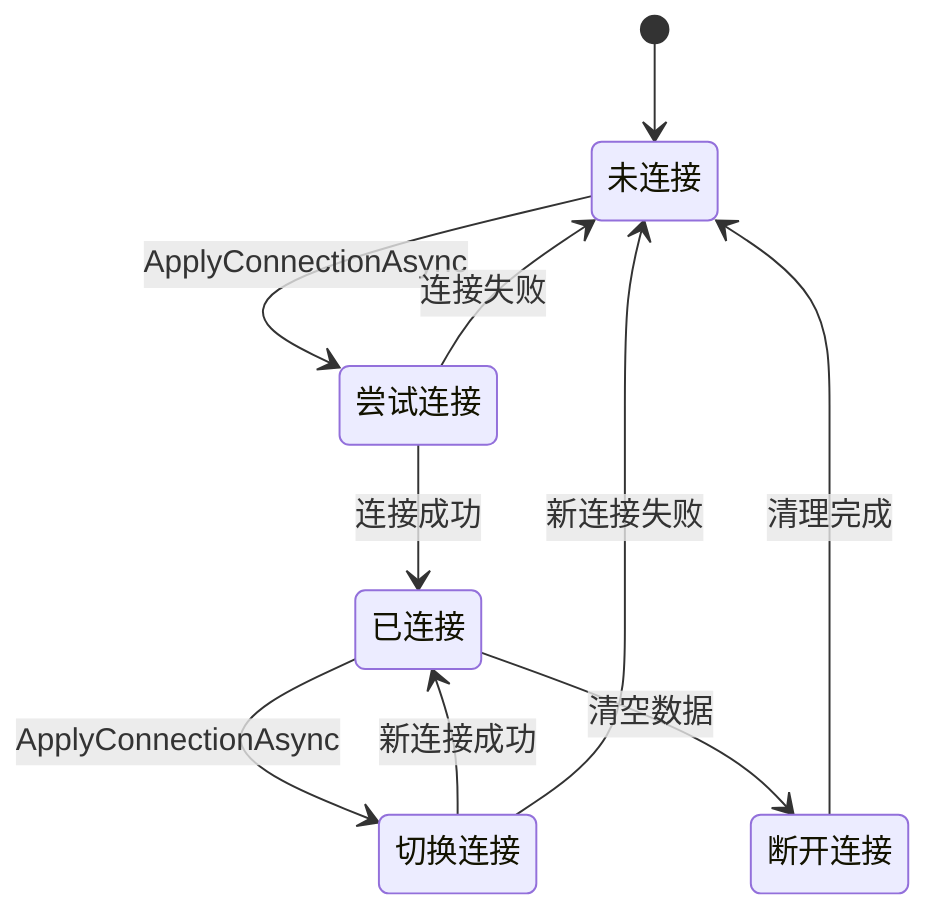
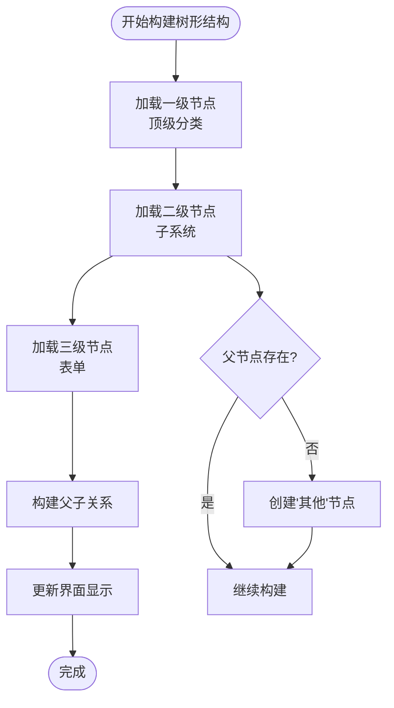
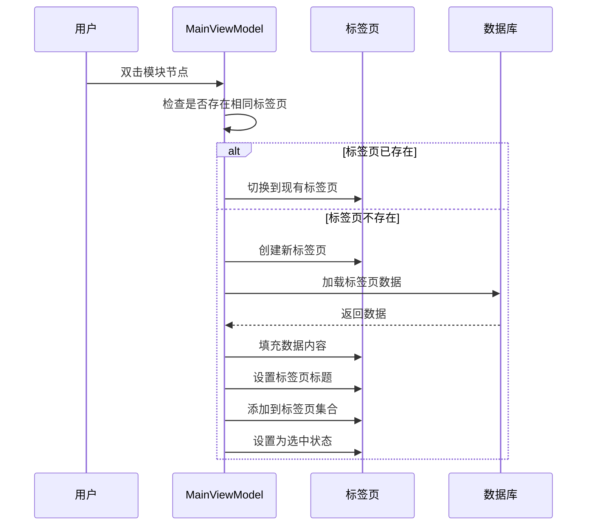
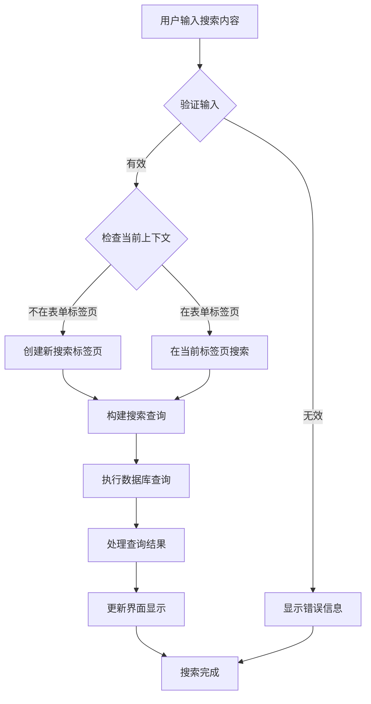
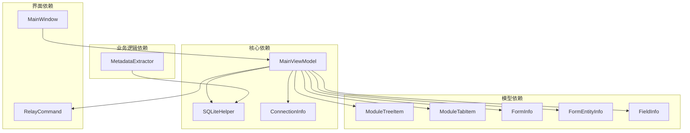

# 主控制器 - MainViewModel

<cite>
**本文档引用的文件**
- [MainViewModel.cs](file://ViewModels/MainViewModel.cs)
- [RelayCommand.cs](file://ViewModels/RelayCommand.cs)
- [MainWindow.xaml.cs](file://MainWindow.xaml.cs)
- [ModuleTreeItem.cs](file://Models/ModuleTreeItem.cs)
- [ModuleTabItem.cs](file://Models/ModuleTabItem.cs)
- [ConnectionInfo.cs](file://Models/ConnectionInfo.cs)
- [SQLiteHelper.cs](file://Helpers/SQLiteHelper.cs)
- [FormInfo.cs](file://Models/FormInfo.cs)
- [FormEntityInfo.cs](file://Models/FormEntityInfo.cs)
- [FieldInfo.cs](file://Models/FieldInfo.cs)
- [OperatorItem.cs](file://Models/OperatorItem.cs)
- [MetadataExtractor.cs](file://Views/MetadataExtractor.cs)
</cite>

## 目录
1. [简介](#简介)
2. [项目结构](#项目结构)
3. [核心组件](#核心组件)
4. [架构概览](#架构概览)
5. [详细组件分析](#详细组件分析)
6. [依赖关系分析](#依赖关系分析)
7. [性能考虑](#性能考虑)
8. [故障排除指南](#故障排除指南)
9. [结论](#结论)

## 简介

MainViewModel是K3Cloud数据字典工具的核心业务控制器，采用MVVM架构模式设计。作为应用程序的中央协调者，它负责管理连接状态、模块树导航、标签页控制、数据查询和界面交互等功能。该控制器实现了INotifyPropertyChanged接口，提供完整的数据绑定支持，并通过命令模式处理用户交互。

该控制器主要功能包括：
- 连接管理：支持远程数据库连接和本地数据文件管理
- 模块树管理：动态构建和显示系统模块层次结构
- 标签页控制：多标签页浏览和管理不同类型的元数据视图
- 搜索功能：支持多种搜索条件和操作符的智能搜索
- 异步数据加载：基于SQLite的高性能数据查询和缓存
- 错误处理：完善的异常捕获和用户友好的错误提示

## 项目结构

该项目采用标准的MVVM架构，主要分为以下几个层次：

**图表来源**
- [MainViewModel.cs:18-198](file://ViewModels/MainViewModel.cs#L18-L198)
- [MainWindow.xaml.cs:30-86](file://MainWindow.xaml.cs#L30-L86)

**章节来源**
- [MainViewModel.cs:1-215](file://ViewModels/MainViewModel.cs#L1-L215)
- [MainWindow.xaml.cs:1-86](file://MainWindow.xaml.cs#L1-L86)

## 核心组件

### 主控制器架构

MainViewModel作为核心控制器，实现了以下关键特性：

#### INotifyPropertyChanged接口实现
- 完整的属性变更通知机制
- 支持UI自动更新和数据绑定
- 使用CallerMemberName特性简化实现

#### 依赖属性管理系统
- 模块树节点管理：ObservableCollection<ModuleTreeItem>
- 标签页集合管理：ObservableCollection<ModuleTabItem>
- 连接信息管理：ConnectionInfo对象
- 操作符选择器：ObservableCollection<OperatorItem>

#### 命令模式应用
- RelayCommand类实现ICommand接口
- 支持参数化执行和条件执行
- 自动触发CanExecuteChanged事件

**章节来源**
- [MainViewModel.cs:18-127](file://ViewModels/MainViewModel.cs#L18-L127)
- [RelayCommand.cs:6-26](file://ViewModels/RelayCommand.cs#L6-L26)

### 数据模型体系

#### 模块树项模型
ModuleTreeItem提供层次化的模块导航结构：
- 层次关系：顶级分类、子系统、具体表单
- 展开/折叠状态管理
- 选择状态跟踪

#### 标签页项模型
ModuleTabItem支持多种数据视图：
- 表单视图：Form
- 实体视图：Entity  
- 字段视图：Field
- 枚举视图：Enum
- 扩展视图：AllFields、BillType、AssistantData等

**章节来源**
- [ModuleTreeItem.cs:7-58](file://Models/ModuleTreeItem.cs#L7-L58)
- [ModuleTabItem.cs:7-194](file://Models/ModuleTabItem.cs#L7-L194)

## 架构概览

MainViewModel采用分层架构设计，各层职责明确：

**图表来源**
- [MainViewModel.cs:246-275](file://ViewModels/MainViewModel.cs#L246-L275)
- [SQLiteHelper.cs:10-53](file://Helpers/SQLiteHelper.cs#L10-L53)

### 控制流架构

**图表来源**
- [MainViewModel.cs:246-275](file://ViewModels/MainViewModel.cs#L246-L275)
- [MainWindow.xaml.cs:373-423](file://MainWindow.xaml.cs#L373-L423)

## 详细组件分析

### 连接管理模块

#### 连接状态管理
MainViewModel实现了完整的连接生命周期管理：

**图表来源**
- [MainViewModel.cs:246-275](file://ViewModels/MainViewModel.cs#L246-L275)
- [MainViewModel.cs:235-244](file://ViewModels/MainViewModel.cs#L235-L244)

#### 本地数据文件管理
通过SQLiteHelper实现本地数据文件的统一管理：
- 自动生成按连接命名的数据文件
- 支持数据文件导入、导出和重命名
- 提供数据文件扫描和验证功能

**章节来源**
- [MainViewModel.cs:246-290](file://ViewModels/MainViewModel.cs#L246-L290)
- [SQLiteHelper.cs:209-254](file://Helpers/SQLiteHelper.cs#L209-L254)

### 模块树管理

#### 树形结构构建
模块树采用三级层次结构：
- 一级节点：顶级分类(T_前缀)
- 二级节点：子系统(S_前缀)  
- 三级节点：具体表单(表单标识符)

**图表来源**
- [MainViewModel.cs:1421-1530](file://ViewModels/MainViewModel.cs#L1421-L1530)

#### 动态节点展开
支持节点的动态展开和折叠：
- 异步加载子节点数据
- 缓存已加载的节点
- 支持嵌套层级的无限展开

**章节来源**
- [MainViewModel.cs:323-335](file://ViewModels/MainViewModel.cs#L323-L335)
- [MainViewModel.cs:1470-1530](file://ViewModels/MainViewModel.cs#L1470-L1530)

### 标签页控制系统

#### 标签页生命周期
每个标签页都有完整的生命周期管理：

**图表来源**
- [MainViewModel.cs:337-357](file://ViewModels/MainViewModel.cs#L337-L357)
- [MainViewModel.cs:359-382](file://ViewModels/MainViewModel.cs#L359-L382)

#### 标签页类型系统
支持多种标签页类型，每种类型对应不同的数据视图：

| 标签页类型 | 数据源 | 主要用途 |
|------------|--------|----------|
| Form | T_FORM表 | 显示表单基本信息 |
| Entity | T_ENTITY表 | 显示实体结构 |
| Field | T_FIELD表 | 显示字段详情 |
| Enum | T_META_FORMENUM表 | 显示枚举值 |
| AllFields | 联合查询 | 显示所有字段 |
| BillType | T_BAS_BILLTYPE表 | 显示单据类型 |
| AssistantData | T_BAS_ASSISTANTDATA表 | 显示辅助资料 |
| EntityServiceRule | T_ENTITYSERVICERULE表 | 显示服务规则 |
| Plugin | T_PLUGIN表 | 显示插件信息 |
| FieldUpdateAction | T_FIELDUPDATEACTION表 | 显示值更新 |

**章节来源**
- [ModuleTabItem.cs:7-194](file://Models/ModuleTabItem.cs#L7-L194)
- [MainViewModel.cs:359-851](file://ViewModels/MainViewModel.cs#L359-L851)

### 搜索功能实现

#### 智能搜索引擎
搜索功能支持多种搜索条件和操作符：

**图表来源**
- [MainViewModel.cs:1782-1873](file://ViewModels/MainViewModel.cs#L1782-L1873)

#### 搜索操作符支持
支持多种搜索操作符：
- 等于(=)：精确匹配
- 包含(LIKE)：模糊匹配
- 左包含(LIKE_START)：前缀匹配
- 右包含(LIKE_END)：后缀匹配

**章节来源**
- [MainViewModel.cs:1782-1873](file://ViewModels/MainViewModel.cs#L1782-L1873)
- [OperatorItem.cs:3-7](file://Models/OperatorItem.cs#L3-L7)

### 异步数据加载机制

#### 并发数据加载
采用Task.Run实现异步数据加载：
- 避免阻塞UI线程
- 支持并发查询执行
- 提供进度反馈机制

#### 数据缓存策略
- 按标签页键值缓存查询结果
- 避免重复查询相同数据
- 支持缓存失效和更新

**章节来源**
- [MainViewModel.cs:292-321](file://ViewModels/MainViewModel.cs#L292-L321)
- [MainViewModel.cs:1782-1873](file://ViewModels/MainViewModel.cs#L1782-L1873)

### 错误处理策略

#### 分层错误处理
- 数据访问层：SQLite查询异常捕获
- 业务逻辑层：操作异常处理和用户提示
- 界面层：友好的错误消息显示

#### 状态管理
- StatusText属性提供实时状态反馈
- 连接状态可视化显示
- 操作进度指示器

**章节来源**
- [MainViewModel.cs:331-335](file://ViewModels/MainViewModel.cs#L331-L335)
- [MainViewModel.cs:1829-1833](file://ViewModels/MainViewModel.cs#L1829-L1833)

## 依赖关系分析

### 组件耦合度分析

**图表来源**
- [MainViewModel.cs:18-198](file://ViewModels/MainViewModel.cs#L18-L198)
- [MainWindow.xaml.cs:36-86](file://MainWindow.xaml.cs#L36-L86)

### 关键依赖关系

#### 数据访问依赖
MainViewModel对SQLiteHelper的依赖确保了：
- 统一的数据库连接管理
- 本地数据文件的生命周期管理
- 连接信息的安全存储

#### 模型依赖
各模型类之间的依赖关系体现了清晰的职责分离：
- ModuleTreeItem和ModuleTabItem作为容器模型
- FormInfo、FormEntityInfo、FieldInfo作为数据传输对象
- ConnectionInfo封装连接配置信息

**章节来源**
- [MainViewModel.cs:13-14](file://ViewModels/MainViewModel.cs#L13-L14)
- [SQLiteHelper.cs:10-53](file://Helpers/SQLiteHelper.cs#L10-L53)

## 性能考虑

### 查询优化策略

#### SQL查询优化
- 使用参数化查询防止SQL注入
- 采用JOIN查询减少数据库往返
- 实现适当的索引利用策略

#### 内存管理
- ObservableCollection的延迟加载
- 大数据集的分批处理
- 及时释放数据库连接资源

### 并发处理

#### 异步编程模式
- 使用async/await避免阻塞UI线程
- Task.Run实现后台数据加载
- Dispatcher.Invoke确保UI线程安全

**章节来源**
- [MainViewModel.cs:292-321](file://ViewModels/MainViewModel.cs#L292-L321)
- [MainViewModel.cs:1421-1456](file://ViewModels/MainViewModel.cs#L1421-L1456)

## 故障排除指南

### 常见问题诊断

#### 连接问题
- 检查网络连通性和服务器状态
- 验证数据库凭据的正确性
- 确认防火墙设置允许连接

#### 数据加载问题
- 检查本地数据文件完整性
- 验证SQLite数据库版本兼容性
- 确认查询权限和表结构

#### 性能问题
- 监控数据库查询执行时间
- 检查内存使用情况
- 优化复杂查询的索引使用

### 调试技巧

#### 日志记录
- 记录关键操作的时间戳
- 捕获异常堆栈信息
- 监控数据库连接状态

#### 性能监控
- 使用性能计数器监控查询性能
- 分析内存使用模式
- 识别潜在的内存泄漏

**章节来源**
- [MainViewModel.cs:331-335](file://ViewModels/MainViewModel.cs#L331-L335)
- [MainWindow.xaml.cs:520-537](file://MainWindow.xaml.cs#L520-L537)

## 结论

MainViewModel作为K3Cloud数据字典工具的核心控制器，展现了优秀的MVVM架构设计和企业级应用开发实践。其主要优势包括：

### 设计优势
- **清晰的职责分离**：各组件职责明确，便于维护和扩展
- **强大的数据绑定**：完整的INotifyPropertyChanged实现提供流畅的用户体验
- **灵活的命令模式**：支持复杂的用户交互和业务逻辑

### 技术特色
- **异步数据加载**：避免UI阻塞，提升应用响应性
- **智能缓存机制**：减少重复查询，提高性能
- **完善的错误处理**：提供友好的用户反馈和恢复机制

### 扩展性考虑
- **模块化设计**：易于添加新的数据视图和功能模块
- **配置驱动**：支持通过配置文件定制行为
- **插件架构**：为未来功能扩展预留空间

该控制器为类似的企业级数据管理应用提供了优秀的参考实现，其架构设计和最佳实践值得在其他项目中借鉴和应用。