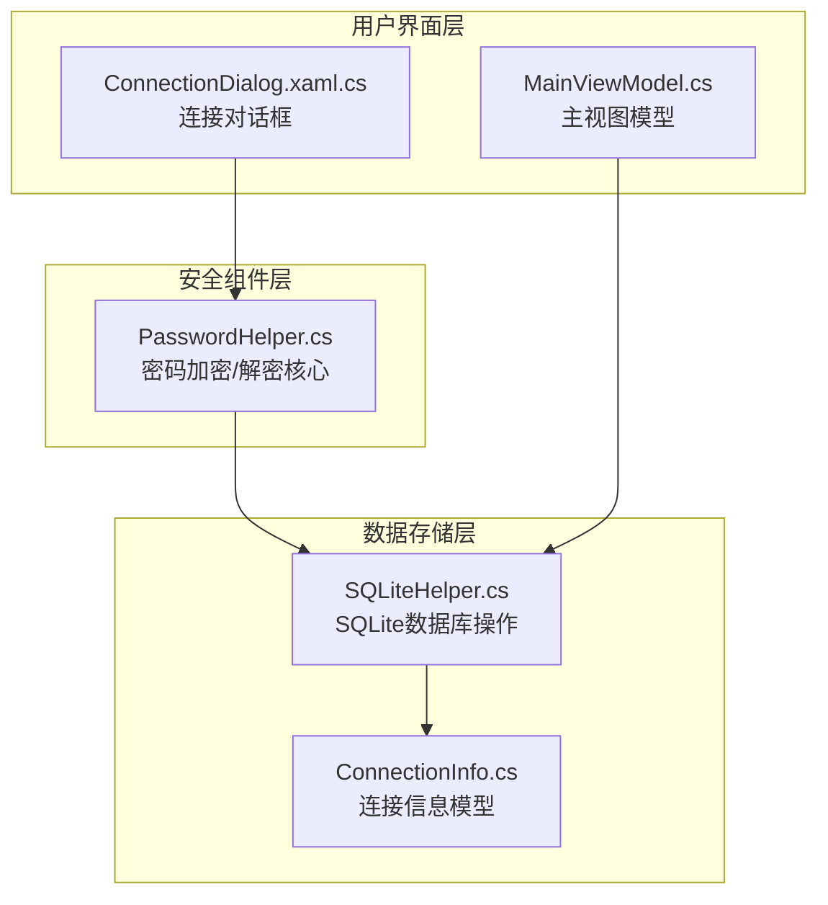
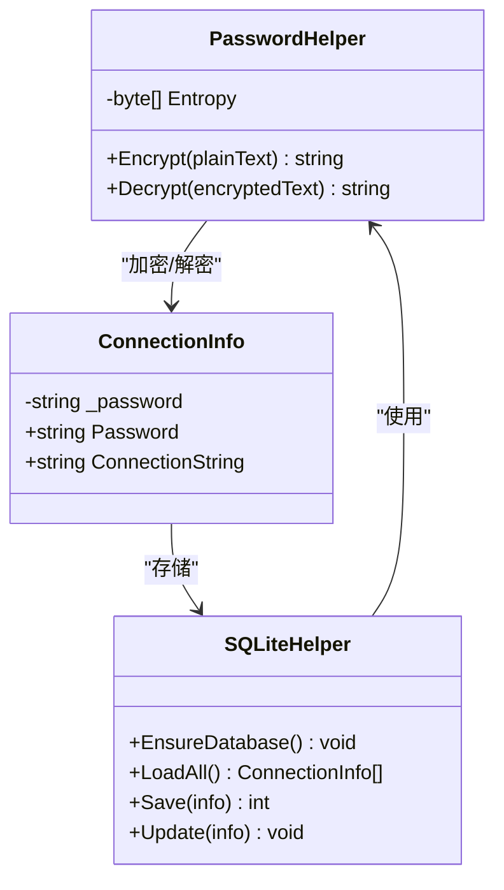
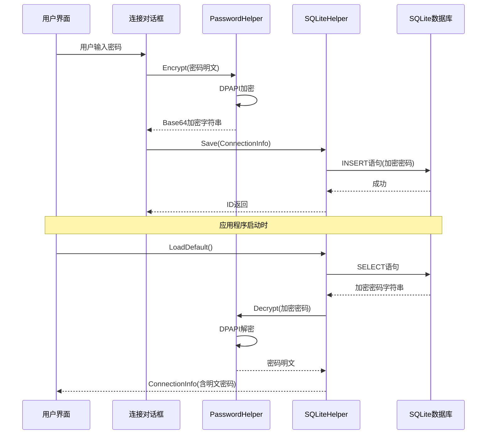
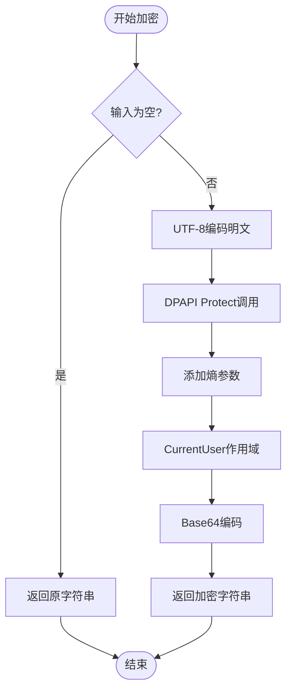
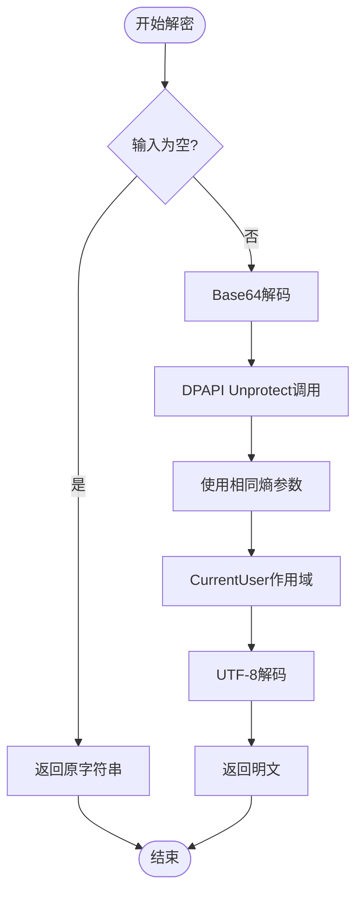
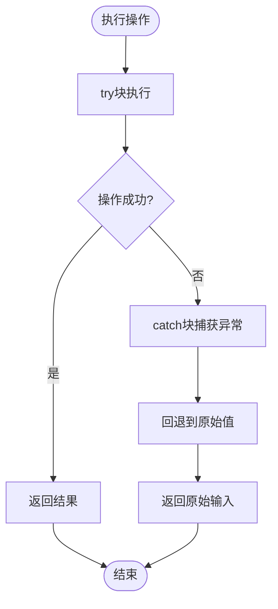
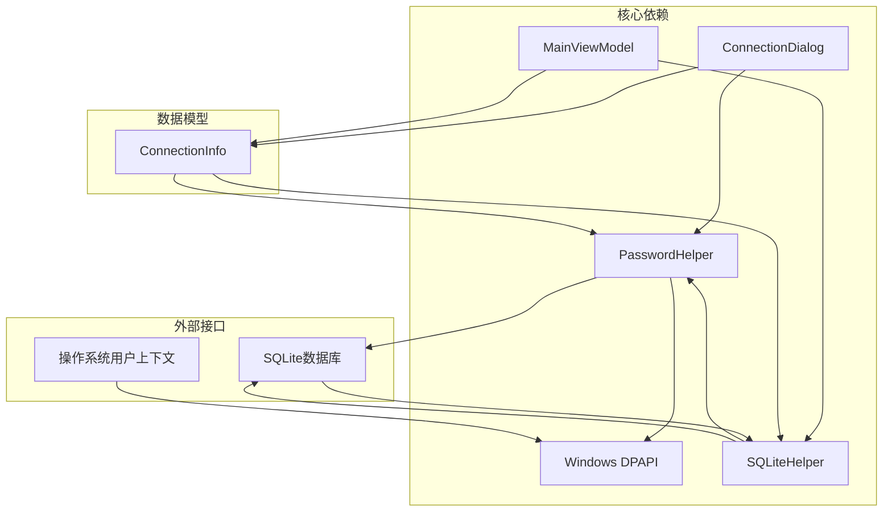

# 安全处理 - PasswordHelper

<cite>
**本文档引用的文件**
- [PasswordHelper.cs](file://Helpers/PasswordHelper.cs)
- [SQLiteHelper.cs](file://Helpers/SQLiteHelper.cs)
- [ConnectionInfo.cs](file://Models/ConnectionInfo.cs)
- [ConnectionDialog.xaml.cs](file://ConnectionDialog.xaml.cs)
- [MainViewModel.cs](file://ViewModels/MainViewModel.cs)
</cite>

## 目录
1. [简介](#简介)
2. [项目结构](#项目结构)
3. [核心组件](#核心组件)
4. [架构概览](#架构概览)
5. [详细组件分析](#详细组件分析)
6. [依赖关系分析](#依赖关系分析)
7. [性能考虑](#性能考虑)
8. [故障排除指南](#故障排除指南)
9. [结论](#结论)

## 简介

PasswordHelper是金蝶K3 Cloud数据字典系统中的核心安全组件，专门负责密码的加密存储和解密访问。该组件采用Windows Data Protection API (DPAPI)实现，为应用程序提供了强大的本地数据保护功能，确保敏感的数据库凭据在存储和传输过程中的安全性。

该组件在整个系统中扮演着关键角色：
- **本地存储保护**：通过DPAPI加密存储数据库连接密码
- **透明解密**：在运行时自动解密已保存的密码
- **跨进程保护**：利用CurrentUser作用域确保密码只能在同一用户会话下访问
- **异常容错**：提供完善的错误处理机制，确保系统稳定性

## 项目结构

PasswordHelper组件在项目中的位置和组织方式如下：

**图表来源**
- [PasswordHelper.cs:1-46](file://Helpers/PasswordHelper.cs#L1-L46)
- [SQLiteHelper.cs:1-370](file://Helpers/SQLiteHelper.cs#L1-L370)
- [ConnectionInfo.cs:1-144](file://Models/ConnectionInfo.cs#L1-L144)

**章节来源**
- [PasswordHelper.cs:1-46](file://Helpers/PasswordHelper.cs#L1-L46)
- [SQLiteHelper.cs:17-53](file://Helpers/SQLiteHelper.cs#L17-L53)

## 核心组件

### PasswordHelper类设计

PasswordHelper是一个静态工具类，提供了简洁而强大的密码安全功能：

**图表来源**
- [PasswordHelper.cs:7-44](file://Helpers/PasswordHelper.cs#L7-L44)
- [ConnectionInfo.cs:48-52](file://Models/ConnectionInfo.cs#L48-L52)
- [SQLiteHelper.cs:55-161](file://Helpers/SQLiteHelper.cs#L55-L161)

### 加密算法实现

PasswordHelper采用Windows Data Protection API (DPAPI)实现，具体特性包括：

- **算法类型**：AES-256-CBC
- **密钥派生**：基于用户账户的安全上下文
- **熵参数**：固定字符串"K3CloudDataDictionary_Pwd_Protection_v1"
- **作用域**：CurrentUser（仅当前用户会话可用）
- **编码格式**：Base64字符串存储

**章节来源**
- [PasswordHelper.cs:9](file://Helpers/PasswordHelper.cs#L9)
- [PasswordHelper.cs:16-19](file://Helpers/PasswordHelper.cs#L16-L19)

## 架构概览

PasswordHelper在整个系统中的工作流程如下：

**图表来源**
- [ConnectionDialog.xaml.cs:106-133](file://ConnectionDialog.xaml.cs#L106-L133)
- [SQLiteHelper.cs:114-138](file://Helpers/SQLiteHelper.cs#L114-L138)
- [SQLiteHelper.cs:85-112](file://Helpers/SQLiteHelper.cs#L85-L112)

## 详细组件分析

### PasswordHelper加密机制

#### 加密流程分析

**图表来源**
- [PasswordHelper.cs:11-26](file://Helpers/PasswordHelper.cs#L11-L26)

#### 解密流程分析

**图表来源**
- [PasswordHelper.cs:28-43](file://Helpers/PasswordHelper.cs#L28-L43)

### 数据存储策略

#### SQLite数据库设计

PasswordHelper与SQLiteHelper协同工作，实现安全的密码存储：

| 字段名 | 数据类型 | 描述 | 安全考虑 |
|--------|----------|------|----------|
| Id | INTEGER | 主键，自增 | 唯一标识符 |
| Name | TEXT | 连接名称 | 明文存储 |
| ServerIp | TEXT | 服务器地址 | 明文存储 |
| Port | INTEGER | 端口号 | 明文存储 |
| UserName | TEXT | 用户名 | 明文存储 |
| Password | TEXT | 密码 | **加密存储** |
| Database | TEXT | 数据库名 | 明文存储 |
| IsDefault | INTEGER | 默认连接标志 | 明文存储 |
| LocalDbFileName | TEXT | 本地数据库文件名 | 明文存储 |

**章节来源**
- [SQLiteHelper.cs:28-37](file://Helpers/SQLiteHelper.cs#L28-L37)
- [SQLiteHelper.cs:74](file://Helpers/SQLiteHelper.cs#L74)
- [SQLiteHelper.cs:103](file://Helpers/SQLiteHelper.cs#L103)

### 错误处理机制

PasswordHelper实现了完善的异常处理策略：

**图表来源**
- [PasswordHelper.cs:14-25](file://Helpers/PasswordHelper.cs#L14-L25)
- [PasswordHelper.cs:39-42](file://Helpers/PasswordHelper.cs#L39-L42)

**章节来源**
- [PasswordHelper.cs:14-25](file://Helpers/PasswordHelper.cs#L14-L25)
- [PasswordHelper.cs:39-42](file://Helpers/PasswordHelper.cs#L39-L42)

## 依赖关系分析

### 组件间依赖关系

**图表来源**
- [PasswordHelper.cs:1-3](file://Helpers/PasswordHelper.cs#L1-L3)
- [SQLiteHelper.cs:1-7](file://Helpers/SQLiteHelper.cs#L1-L7)
- [ConnectionDialog.xaml.cs:1-8](file://ConnectionDialog.xaml.cs#L1-L8)

### 使用场景分析

PasswordHelper在系统中的主要使用场景：

1. **连接信息保存**：在SQLite数据库中存储加密的密码
2. **连接信息加载**：从数据库中读取并解密密码
3. **用户界面交互**：在连接对话框中处理密码输入和显示
4. **自动连接**：应用程序启动时自动加载默认连接

**章节来源**
- [SQLiteHelper.cs:114-138](file://Helpers/SQLiteHelper.cs#L114-L138)
- [SQLiteHelper.cs:55-83](file://Helpers/SQLiteHelper.cs#L55-L83)
- [ConnectionDialog.xaml.cs:106-133](file://ConnectionDialog.xaml.cs#L106-L133)

## 性能考虑

### 加密性能特征

PasswordHelper的性能特点：

- **加密开销**：每次加密/解密操作约需几毫秒
- **内存使用**：临时分配UTF-8字节数组和Base64字符串
- **CPU消耗**：AES-256加密算法，CPU开销极小
- **I/O影响**：主要受SQLite数据库访问影响

### 优化建议

1. **批量操作**：对于大量连接信息的处理，考虑批处理优化
2. **缓存策略**：对于频繁访问的连接，可以考虑内存缓存
3. **异步处理**：在UI线程中避免长时间阻塞

## 故障排除指南

### 常见问题及解决方案

#### 问题1：密码解密失败
**症状**：从数据库读取的密码无法正确解密
**原因**：可能由于用户上下文变化或数据损坏
**解决方案**：
- 重新保存连接信息
- 检查用户账户权限
- 验证数据库完整性

#### 问题2：加密字符串格式错误
**症状**：Base64解码异常
**原因**：存储的数据格式不正确
**解决方案**：
- 清理数据库中的无效数据
- 重新输入密码并保存

#### 问题3：跨用户访问失败
**症状**：不同用户无法访问彼此的密码
**原因**：DPAPI的CurrentUser作用域限制
**解决方案**：
- 确保同一用户会话
- 避免在不同用户间共享配置文件

**章节来源**
- [PasswordHelper.cs:22-25](file://Helpers/PasswordHelper.cs#L22-L25)
- [PasswordHelper.cs:40-42](file://Helpers/PasswordHelper.cs#L40-L42)

## 结论

PasswordHelper作为金蝶K3 Cloud数据字典系统的核心安全组件，通过以下关键特性确保了系统的安全性：

### 安全优势
- **强加密算法**：采用AES-256-CBC加密标准
- **系统级保护**：利用Windows DPAPI提供系统级安全保护
- **用户隔离**：CurrentUser作用域确保跨用户隔离
- **透明使用**：对上层应用完全透明，无需额外复杂性

### 技术特色
- **简单易用**：静态方法设计，使用便捷
- **异常容错**：完善的错误处理机制
- **性能高效**：极低的CPU和内存开销
- **兼容性强**：与.NET Framework完全兼容

### 最佳实践建议
1. **定期备份**：确保数据库备份，防止数据丢失
2. **权限控制**：合理设置文件系统权限
3. **监控告警**：建立异常检测机制
4. **定期审计**：定期检查安全日志

PasswordHelper为金蝶K3 Cloud系统提供了坚实的安全基础，有效保护了用户的数据库凭据安全，是系统整体安全架构的重要组成部分。