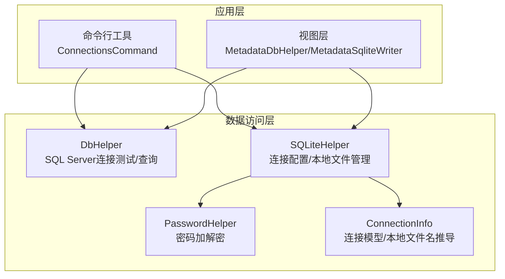
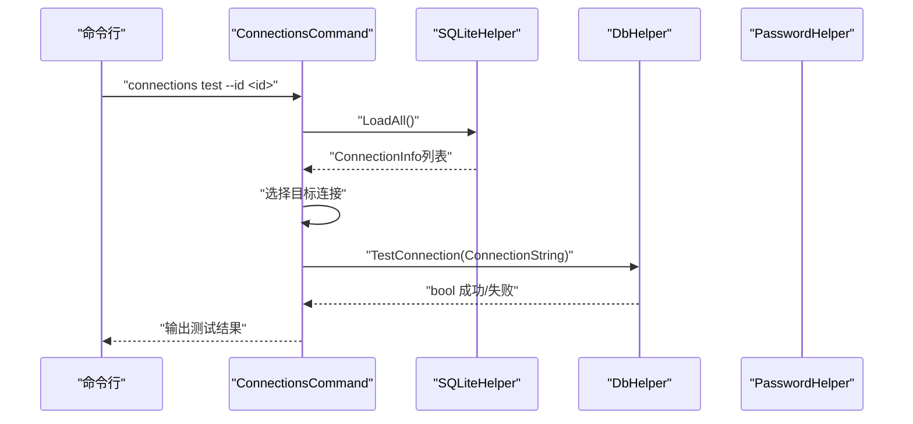
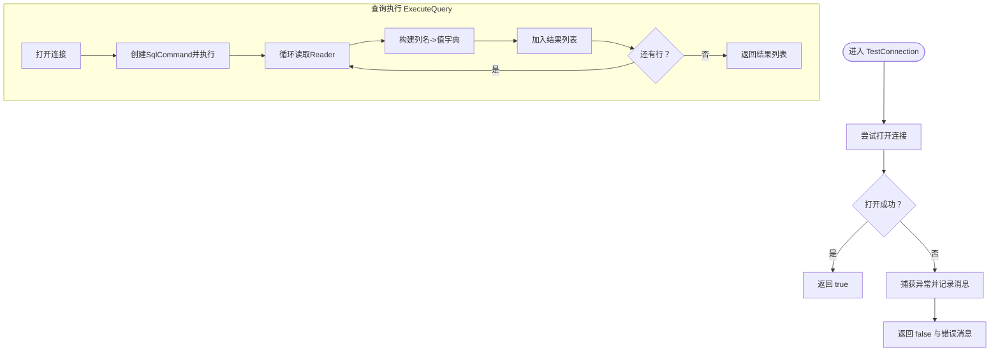
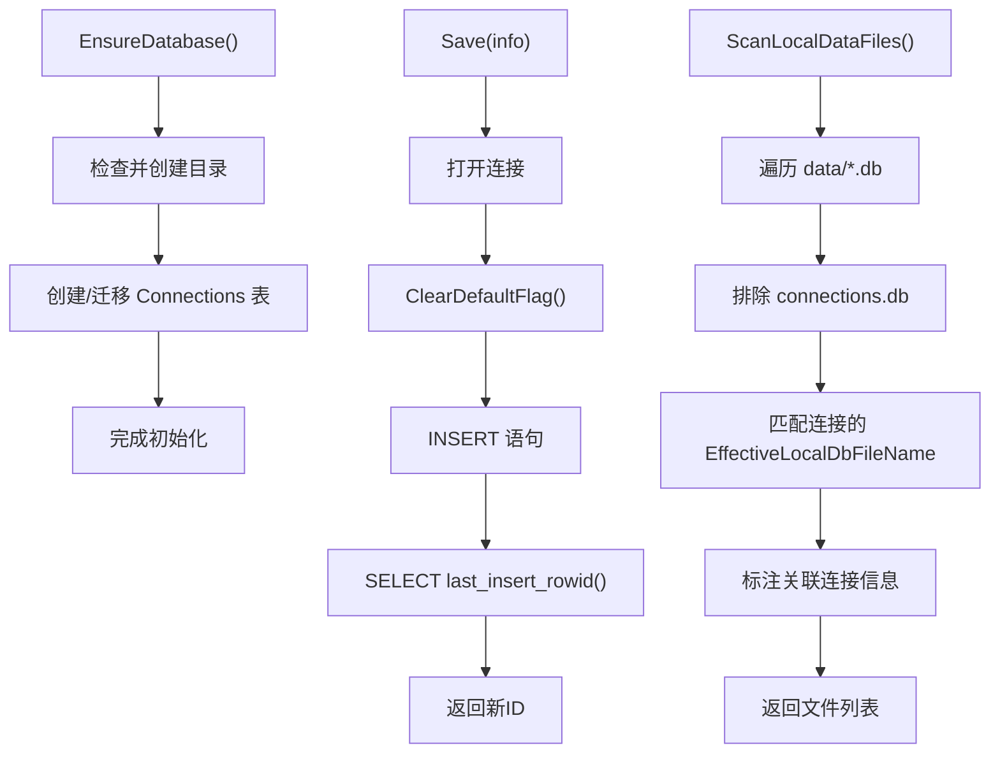
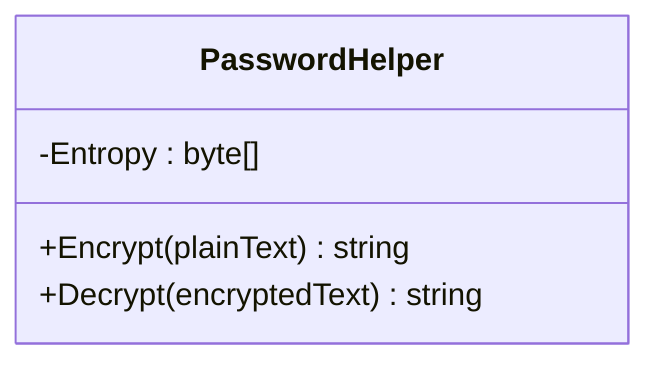
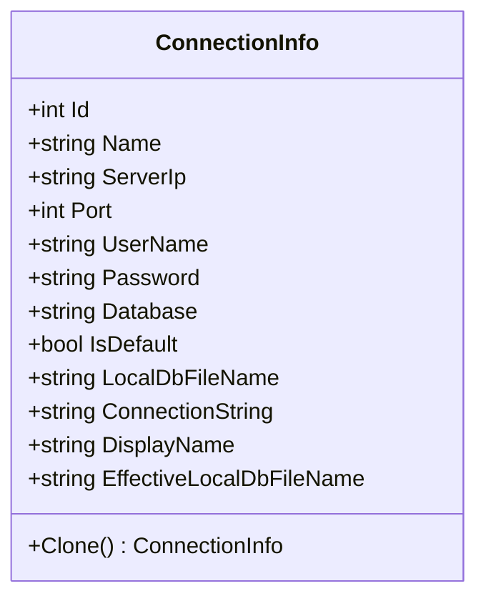
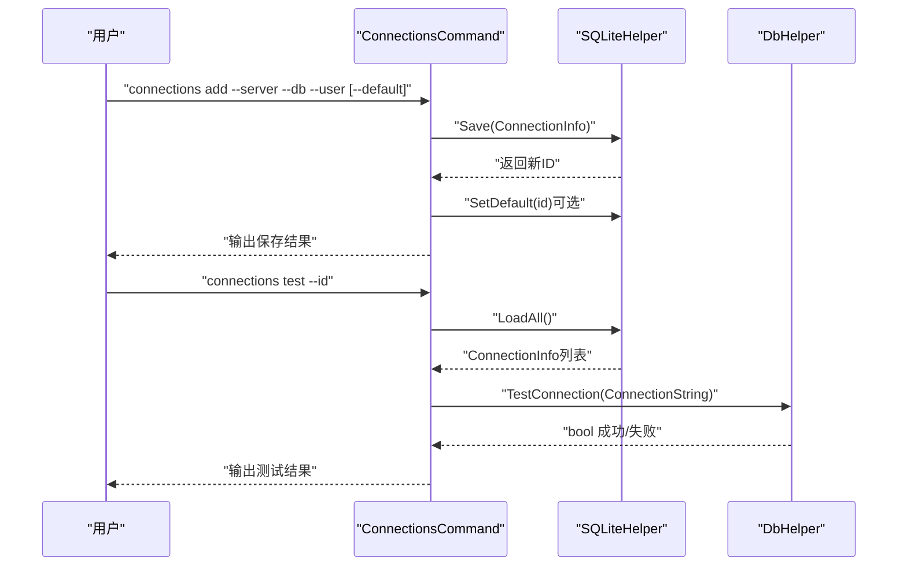
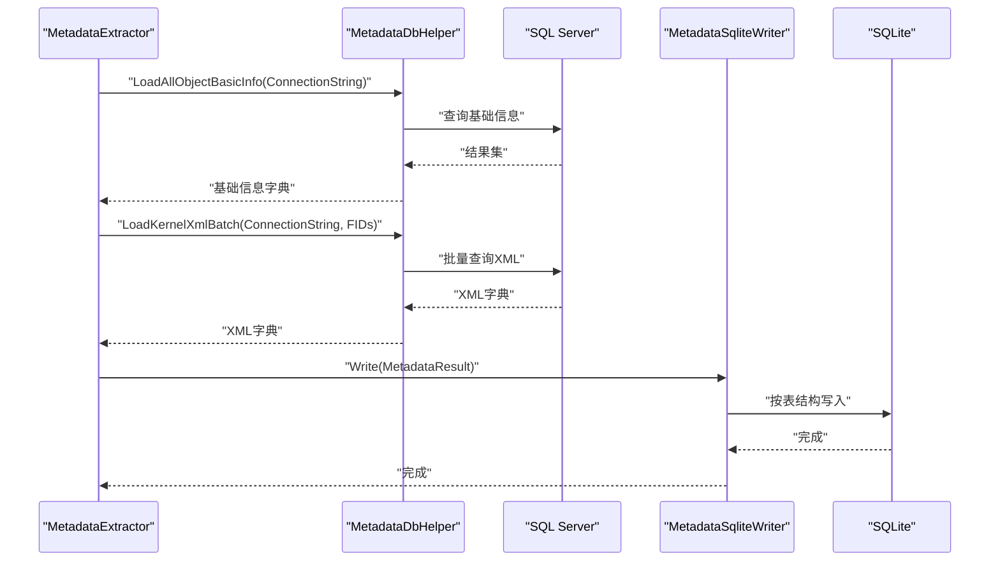
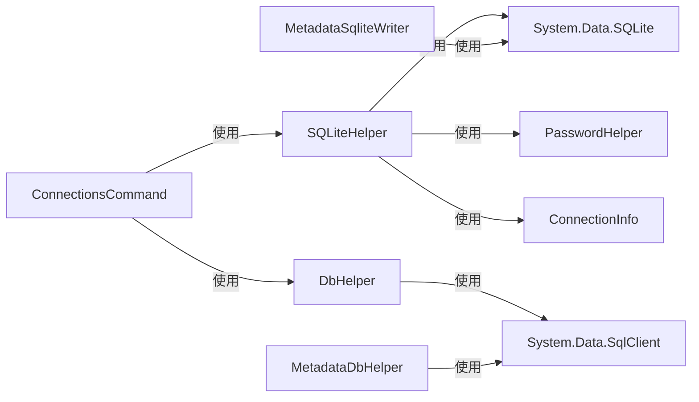

# 数据库访问层

<cite>
**本文引用的文件**
- [DbHelper.cs](file://Helpers/DbHelper.cs)
- [SQLiteHelper.cs](file://Helpers/SQLiteHelper.cs)
- [PasswordHelper.cs](file://Helpers/PasswordHelper.cs)
- [ConnectionInfo.cs](file://Models/ConnectionInfo.cs)
- [LocalDataFileInfo.cs](file://Models/LocalDataFileInfo.cs)
- [ConnectionsCommand.cs](file://K3CloudDataDictionary.Cli/Commands/ConnectionsCommand.cs)
- [MetadataDbHelper.cs](file://Views/MetadataDbHelper.cs)
- [MetadataSqliteWriter.cs](file://Views/MetadataSqliteWriter.cs)
- [usage-examples.md](file://docs/usage-examples.md)
</cite>

## 目录
1. [简介](#简介)
2. [项目结构](#项目结构)
3. [核心组件](#核心组件)
4. [架构总览](#架构总览)
5. [详细组件分析](#详细组件分析)
6. [依赖关系分析](#依赖关系分析)
7. [性能考量](#性能考量)
8. [故障排查指南](#故障排查指南)
9. [结论](#结论)
10. [附录](#附录)

## 简介
本文件面向数据库访问层，系统性梳理并解读以下能力：
- DbHelper：SQL Server连接测试与通用查询/标量执行
- SQLiteHelper：本地连接配置与本地数据文件管理
- PasswordHelper：密码加密/解密（与SQLiteHelper配合）
- ConnectionInfo：连接信息模型及本地文件名推导
- 与命令行工具的协作：ConnectionsCommand通过SQLiteHelper管理连接，DbHelper进行连接测试
- 与元数据抽取/写入的协作：MetadataDbHelper负责SQL Server侧元数据查询，MetadataSqliteWriter负责SQLite侧写入

目标是帮助读者理解连接管理、本地数据文件生命周期、异常处理、安全与性能优化策略，并提供可复用的最佳实践。

## 项目结构
数据库访问层主要位于 Helpers 与 Models 目录，命令行工具通过 Commands 调用 SQLiteHelper，视图层通过 MetadataDbHelper 与 MetadataSqliteWriter 访问 SQL Server 与 SQLite。

图表来源
- [ConnectionsCommand.cs](file://K3CloudDataDictionary.Cli/Commands/ConnectionsCommand.cs)
- [DbHelper.cs](file://Helpers/DbHelper.cs)
- [SQLiteHelper.cs](file://Helpers/SQLiteHelper.cs)
- [PasswordHelper.cs](file://Helpers/PasswordHelper.cs)
- [ConnectionInfo.cs](file://Models/ConnectionInfo.cs)
- [MetadataDbHelper.cs](file://Views/MetadataDbHelper.cs)
- [MetadataSqliteWriter.cs](file://Views/MetadataSqliteWriter.cs)

章节来源
- [DbHelper.cs:1-70](file://Helpers/DbHelper.cs#L1-L70)
- [SQLiteHelper.cs:1-370](file://Helpers/SQLiteHelper.cs#L1-L370)
- [PasswordHelper.cs:1-46](file://Helpers/PasswordHelper.cs#L1-L46)
- [ConnectionInfo.cs:1-144](file://Models/ConnectionInfo.cs#L1-L144)
- [ConnectionsCommand.cs:1-231](file://K3CloudDataDictionary.Cli/Commands/ConnectionsCommand.cs#L1-L231)
- [MetadataDbHelper.cs:1-131](file://Views/MetadataDbHelper.cs#L1-L131)
- [MetadataSqliteWriter.cs:1-846](file://Views/MetadataSqliteWriter.cs#L1-L846)

## 核心组件
- DbHelper：提供连接测试、查询执行、标量执行，统一超时设置，返回行集合
- SQLiteHelper：确保本地数据库存在、维护连接配置表、CRUD连接记录、默认连接标记、扫描/导入/重命名/删除本地数据文件、迁移旧版元数据文件
- PasswordHelper：基于DPAPI的用户范围加解密，用于保护敏感字段
- ConnectionInfo：连接信息模型，提供连接字符串、显示名、有效本地文件名推导
- 命令行集成：ConnectionsCommand通过SQLiteHelper增删改查连接，并调用DbHelper测试连接
- 视图层集成：MetadataDbHelper从SQL Server读取元数据，MetadataSqliteWriter将元数据写入SQLite

章节来源
- [DbHelper.cs:9-67](file://Helpers/DbHelper.cs#L9-L67)
- [SQLiteHelper.cs:17-196](file://Helpers/SQLiteHelper.cs#L17-L196)
- [PasswordHelper.cs:11-43](file://Helpers/PasswordHelper.cs#L11-L43)
- [ConnectionInfo.cs:86-118](file://Models/ConnectionInfo.cs#L86-L118)
- [ConnectionsCommand.cs:45-228](file://K3CloudDataDictionary.Cli/Commands/ConnectionsCommand.cs#L45-L228)
- [MetadataDbHelper.cs:44-127](file://Views/MetadataDbHelper.cs#L44-L127)
- [MetadataSqliteWriter.cs:29-50](file://Views/MetadataSqliteWriter.cs#L29-L50)

## 架构总览
数据库访问层采用“职责分离”设计：
- DbHelper专注SQL Server连接与查询执行
- SQLiteHelper专注本地连接配置与本地数据文件生命周期
- PasswordHelper专注敏感信息保护
- ConnectionInfo提供连接模型与本地文件名推导
- 命令行与视图层通过上述组件完成端到端工作流

图表来源
- [ConnectionsCommand.cs:173-228](file://K3CloudDataDictionary.Cli/Commands/ConnectionsCommand.cs#L173-L228)
- [DbHelper.cs:9-25](file://Helpers/DbHelper.cs#L9-L25)
- [SQLiteHelper.cs:55-83](file://Helpers/SQLiteHelper.cs#L55-L83)

## 详细组件分析

### DbHelper：SQL Server连接与查询执行
- 连接测试：接收连接字符串，尝试打开连接，捕获异常并返回错误消息
- 查询执行：打开连接，执行SQL，读取Reader，构建大小写不敏感的列名字典，逐行收集结果
- 标量执行：打开连接，执行SQL，返回ExecuteScalar结果
- 超时控制：命令超时统一设置为60秒

图表来源
- [DbHelper.cs:9-67](file://Helpers/DbHelper.cs#L9-L67)

章节来源
- [DbHelper.cs:9-67](file://Helpers/DbHelper.cs#L9-L67)

### SQLiteHelper：本地连接与本地数据文件管理
- 数据库初始化：确保目录存在，创建连接配置表（含迁移逻辑）
- 连接配置CRUD：加载全部/默认连接、保存/更新/删除连接、设置默认连接
- 默认连接一致性：更新前清零旧默认标记
- 本地数据文件管理：
  - 获取数据目录与指定连接的本地文件路径
  - 扫描data目录，排除connections.db，识别自动生成文件并标注关联连接
  - 导入文件：避免与连接预期文件名冲突，必要时重命名
  - 删除/重命名本地数据文件
  - 旧版迁移：将单一metadata.db迁移到按连接命名的新文件

图表来源
- [SQLiteHelper.cs:17-138](file://Helpers/SQLiteHelper.cs#L17-L138)
- [SQLiteHelper.cs:218-367](file://Helpers/SQLiteHelper.cs#L218-L367)

章节来源
- [SQLiteHelper.cs:17-196](file://Helpers/SQLiteHelper.cs#L17-L196)
- [SQLiteHelper.cs:218-367](file://Helpers/SQLiteHelper.cs#L218-L367)

### PasswordHelper：密码加解密
- 加密：对明文进行DPAPI加密，失败回退原值
- 解密：对密文进行DPAPI解密，失败回退原值
- 作用域：CurrentUser，保证同一用户环境下的机密性

图表来源
- [PasswordHelper.cs:11-43](file://Helpers/PasswordHelper.cs#L11-L43)

章节来源
- [PasswordHelper.cs:11-43](file://Helpers/PasswordHelper.cs#L11-L43)

### ConnectionInfo：连接模型与本地文件名推导
- 连接字符串：拼接Server、Port、Database、UserId、Password
- 显示名：优先Name+Database，其次Server,Port+Database，最后仅Server,Port
- 有效本地文件名：优先LocalDbFileName，否则Database+".db"，否则"default.db"

图表来源
- [ConnectionInfo.cs:86-118](file://Models/ConnectionInfo.cs#L86-L118)

章节来源
- [ConnectionInfo.cs:86-118](file://Models/ConnectionInfo.cs#L86-L118)

### 命令行集成：ConnectionsCommand
- list：读取所有连接并输出
- add：构造ConnectionInfo，调用SQLiteHelper保存，必要时设置默认连接
- test：根据ID加载连接，调用DbHelper测试，输出结果
- set-default：设置默认连接并更新标记

图表来源
- [ConnectionsCommand.cs:45-228](file://K3CloudDataDictionary.Cli/Commands/ConnectionsCommand.cs#L45-L228)
- [SQLiteHelper.cs:55-138](file://Helpers/SQLiteHelper.cs#L55-L138)
- [DbHelper.cs:9-25](file://Helpers/DbHelper.cs#L9-L25)

章节来源
- [ConnectionsCommand.cs:45-228](file://K3CloudDataDictionary.Cli/Commands/ConnectionsCommand.cs#L45-L228)

### 视图层集成：元数据查询与写入
- 元数据查询：一次性加载对象基础信息，批量加载内核XML，构建处理链并合并
- 元数据写入：按表结构写入SQLite，支持全量重建与增量更新，支持按表单标识删除

图表来源
- [MetadataDbHelper.cs:44-127](file://Views/MetadataDbHelper.cs#L44-L127)
- [MetadataSqliteWriter.cs:29-50](file://Views/MetadataSqliteWriter.cs#L29-L50)
- [MetadataSqliteWriter.cs:560-800](file://Views/MetadataSqliteWriter.cs#L560-L800)

章节来源
- [MetadataDbHelper.cs:44-127](file://Views/MetadataDbHelper.cs#L44-L127)
- [MetadataSqliteWriter.cs:29-50](file://Views/MetadataSqliteWriter.cs#L29-L50)
- [MetadataSqliteWriter.cs:560-800](file://Views/MetadataSqliteWriter.cs#L560-L800)

## 依赖关系分析
- DbHelper依赖System.Data.SqlClient，提供连接测试与查询执行
- SQLiteHelper依赖System.Data.SQLite，依赖PasswordHelper进行密码保护，依赖ConnectionInfo进行本地文件名推导
- ConnectionsCommand依赖SQLiteHelper进行连接管理，依赖DbHelper进行连接测试
- MetadataDbHelper依赖SqlConnection进行SQL Server查询
- MetadataSqliteWriter依赖SQLiteConnection进行SQLite写入

图表来源
- [DbHelper.cs:1-70](file://Helpers/DbHelper.cs#L1-L70)
- [SQLiteHelper.cs:1-370](file://Helpers/SQLiteHelper.cs#L1-L370)
- [ConnectionsCommand.cs:1-231](file://K3CloudDataDictionary.Cli/Commands/ConnectionsCommand.cs#L1-L231)
- [MetadataDbHelper.cs:1-131](file://Views/MetadataDbHelper.cs#L1-L131)
- [MetadataSqliteWriter.cs:1-846](file://Views/MetadataSqliteWriter.cs#L1-L846)

章节来源
- [DbHelper.cs:1-70](file://Helpers/DbHelper.cs#L1-L70)
- [SQLiteHelper.cs:1-370](file://Helpers/SQLiteHelper.cs#L1-L370)
- [ConnectionsCommand.cs:1-231](file://K3CloudDataDictionary.Cli/Commands/ConnectionsCommand.cs#L1-L231)
- [MetadataDbHelper.cs:1-131](file://Views/MetadataDbHelper.cs#L1-L131)
- [MetadataSqliteWriter.cs:1-846](file://Views/MetadataSqliteWriter.cs#L1-L846)

## 性能考量
- 连接测试与查询：DbHelper统一设置CommandTimeout=60秒，避免长时间阻塞
- 查询批量化：MetadataDbHelper的LoadKernelXmlBatch通过参数化IN子句批量获取XML，减少往返
- 事务与批量写入：MetadataSqliteWriter在构造函数中开启事务，减少磁盘写入开销
- 增量写入：MetadataSqliteWriter支持InitIdCounters与DeleteFormsByIdentifiers，避免全量重建
- 本地文件扫描：SQLiteHelper的ScanLocalDataFiles按需遍历data目录，避免不必要的IO

章节来源
- [DbHelper.cs:36](file://Helpers/DbHelper.cs#L36)
- [MetadataDbHelper.cs:94-126](file://Views/MetadataDbHelper.cs#L94-L126)
- [MetadataSqliteWriter.cs:49](file://Views/MetadataSqliteWriter.cs#L49)
- [MetadataSqliteWriter.cs:55-69](file://Views/MetadataSqliteWriter.cs#L55-L69)
- [SQLiteHelper.cs:218-254](file://Helpers/SQLiteHelper.cs#L218-L254)

## 故障排查指南
- 连接测试失败
  - 检查连接字符串拼接是否正确（ConnectionInfo.ConnectionString）
  - 使用DbHelper.TestConnection获取具体错误消息
  - 确认网络连通性与SQL Server实例状态
- 本地数据文件导入冲突
  - SQLiteHelper.ImportLocalData会检测连接的预期文件名并自动重命名，避免冲突
  - 若目标文件已存在且不同源，会追加序号重命名
- 默认连接设置异常
  - SQLiteHelper.SetDefault会先清零旧默认标记，再设置新默认
  - 如出现多个默认标记，检查ClearDefaultFlag执行情况
- 元数据写入失败
  - 确认SQLite表结构已创建（CreateTables）或增量模式下InitIdCounters正确
  - 检查事务是否提交（Flush）

章节来源
- [DbHelper.cs:9-25](file://Helpers/DbHelper.cs#L9-L25)
- [ConnectionInfo.cs:98-104](file://Models/ConnectionInfo.cs#L98-L104)
- [SQLiteHelper.cs:176-188](file://Helpers/SQLiteHelper.cs#L176-L188)
- [SQLiteHelper.cs:260-303](file://Helpers/SQLiteHelper.cs#L260-L303)
- [MetadataSqliteWriter.cs:29-50](file://Views/MetadataSqliteWriter.cs#L29-L50)

## 结论
数据库访问层通过DbHelper与SQLiteHelper实现了SQL Server与SQLite的协同工作：
- DbHelper提供稳定的连接测试与查询执行
- SQLiteHelper提供连接配置与本地数据文件生命周期管理
- PasswordHelper保障敏感信息的安全
- 命令行与视图层通过这些组件实现端到端的连接管理与元数据处理

建议在生产环境中：
- 使用事务批量写入
- 控制查询超时与批量化
- 严格管理默认连接标记
- 对敏感信息进行加密存储

## 附录

### 使用示例与最佳实践
- 连接测试
  - 通过ConnectionsCommand test --id验证连接有效性
  - 参考：[ConnectionsCommand.cs:173-228](file://K3CloudDataDictionary.Cli/Commands/ConnectionsCommand.cs#L173-L228)
- 保存连接并设置默认
  - 通过ConnectionsCommand add --server --db --user [--default]保存连接
  - 参考：[ConnectionsCommand.cs:76-131](file://K3CloudDataDictionary.Cli/Commands/ConnectionsCommand.cs#L76-L131)
- 本地数据文件管理
  - 导入：SQLiteHelper.ImportLocalData(sourcePath, targetName?)
  - 重命名：SQLiteHelper.RenameLocalData(currentPath, newName)
  - 删除：SQLiteHelper.DeleteLocalData(filePath)
  - 扫描：SQLiteHelper.ScanLocalDataFiles()
  - 参考：[SQLiteHelper.cs:260-313](file://Helpers/SQLiteHelper.cs#L260-L313)
- 元数据写入
  - 全量写入：MetadataSqliteWriter(dbPath, recreateTables=true)
  - 增量写入：MetadataSqliteWriter(dbPath, recreateTables=false)，随后InitIdCounters
  - 按表单删除：DeleteFormsByIdentifiers(formIdentifiers)
  - 参考：[MetadataSqliteWriter.cs:29-50](file://Views/MetadataSqliteWriter.cs#L29-L50)

### 安全与合规建议
- 密码存储：使用PasswordHelper进行加密存储，避免明文
- 连接字符串：避免硬编码，优先通过配置或命令行参数传递
- 默认连接：确保同一时刻仅有一个默认连接，避免歧义
- 本地文件：导入时避免与连接预期文件名冲突，保持一致性

章节来源
- [ConnectionsCommand.cs:173-228](file://K3CloudDataDictionary.Cli/Commands/ConnectionsCommand.cs#L173-L228)
- [SQLiteHelper.cs:260-313](file://Helpers/SQLiteHelper.cs#L260-L313)
- [MetadataSqliteWriter.cs:29-50](file://Views/MetadataSqliteWriter.cs#L29-L50)