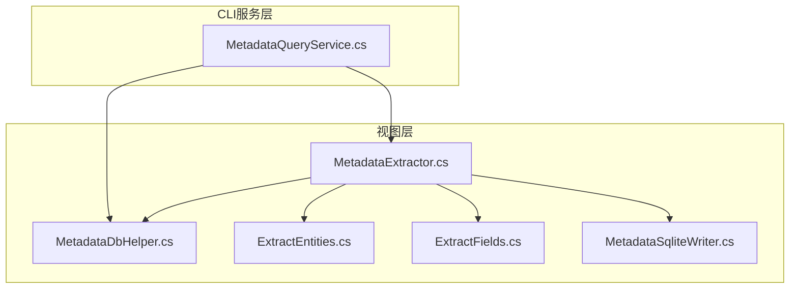
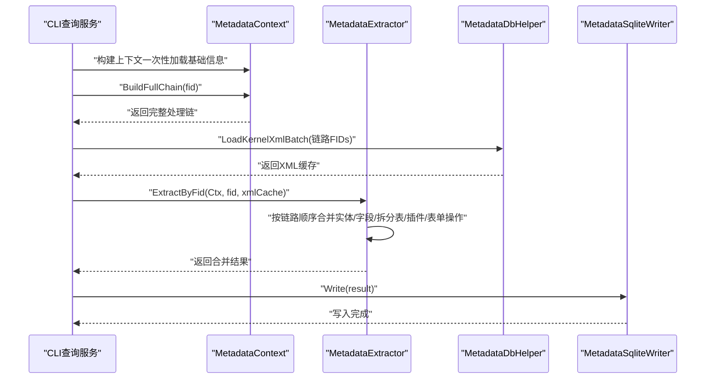
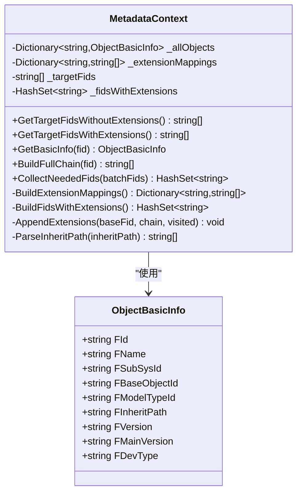
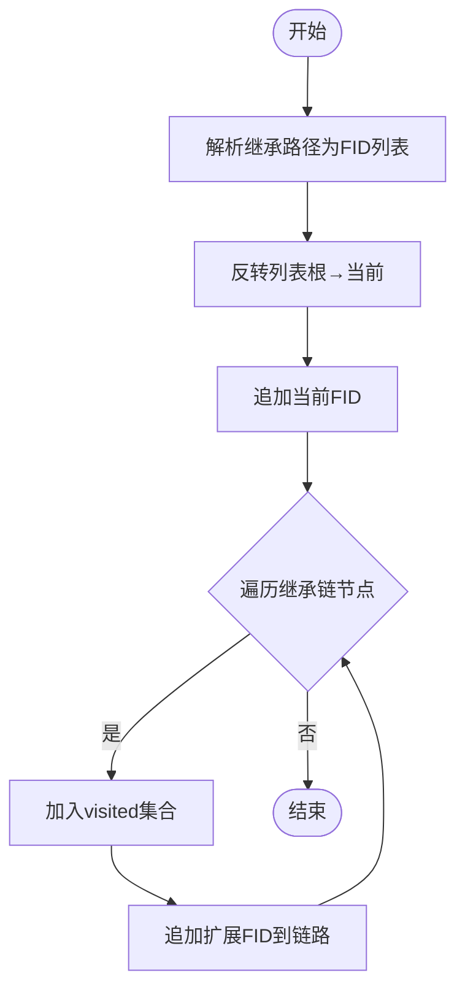
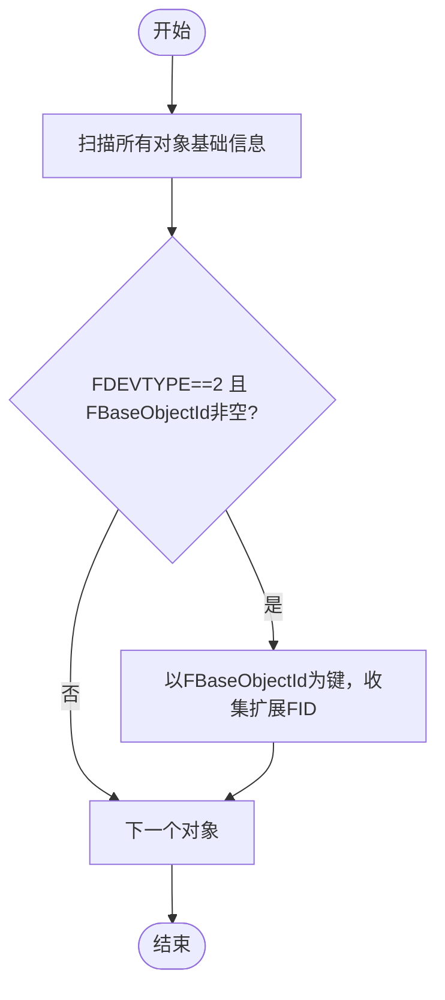
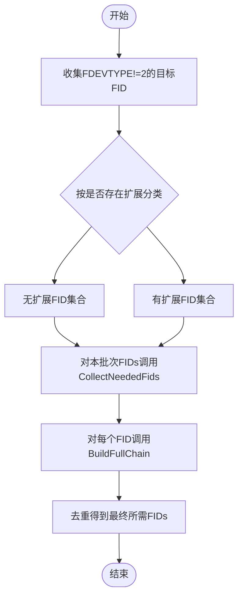
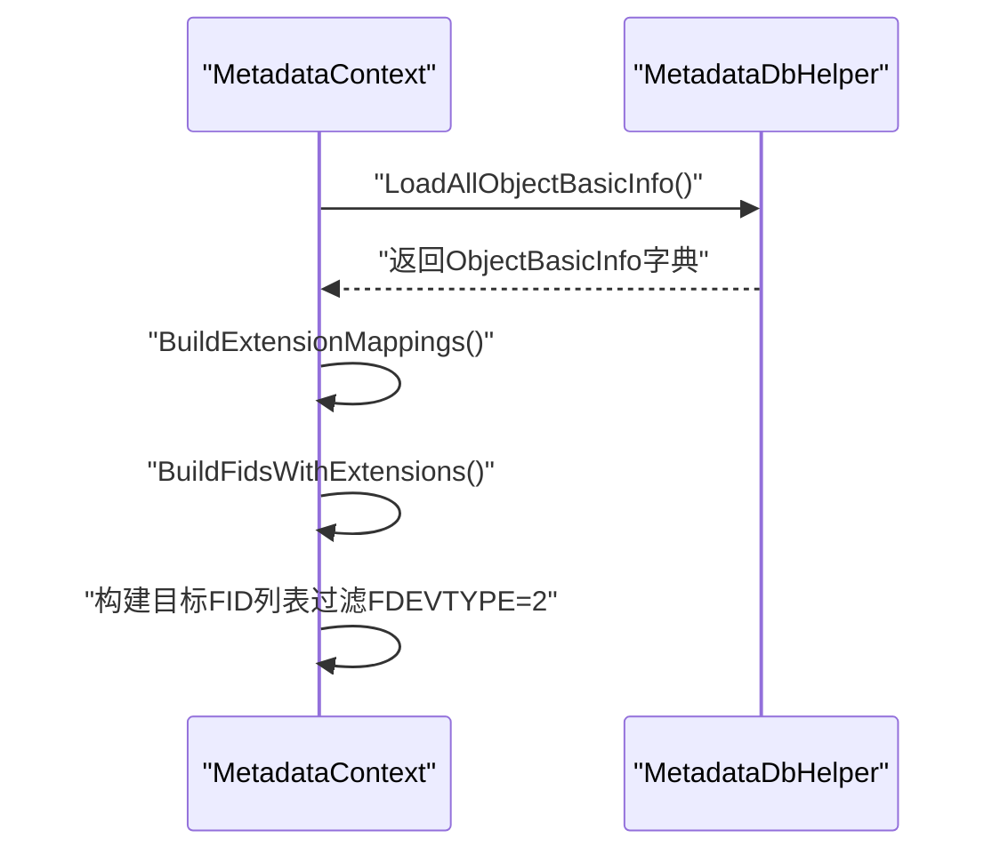
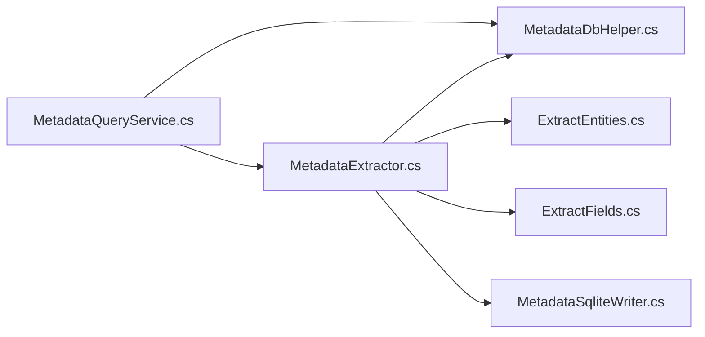

# 元数据上下文

<cite>
**本文引用的文件**
- [MetadataExtractor.cs](file://Views/MetadataExtractor.cs)
- [MetadataDbHelper.cs](file://Views/MetadataDbHelper.cs)
- [MetadataSqliteWriter.cs](file://Views/MetadataSqliteWriter.cs)
- [MetadataQueryService.cs](file://K3CloudDataDictionary.Cli/Services/MetadataQueryService.cs)
- [ExtractEntities.cs](file://Views/ExtractEntities.cs)
- [ExtractFields.cs](file://Views/ExtractFields.cs)
</cite>

## 目录
1. [简介](#简介)
2. [项目结构](#项目结构)
3. [核心组件](#核心组件)
4. [架构总览](#架构总览)
5. [详细组件分析](#详细组件分析)
6. [依赖关系分析](#依赖关系分析)
7. [性能考量](#性能考量)
8. [故障排查指南](#故障排查指南)
9. [结论](#结论)
10. [附录](#附录)

## 简介
本文围绕元数据上下文类 MetadataContext 的设计理念与实现架构展开，重点说明其只读设计原则、线程安全保证、内存优化策略，并深入剖析继承链构建算法、扩展映射构建、目标FID收集等关键技术。同时，结合上下文初始化流程、数据结构设计与性能优化技巧，给出使用示例与最佳实践，帮助读者高效完成元数据提取任务。

## 项目结构
本项目采用“视图层 + 服务层”的分层组织方式：
- 视图层（Views）：负责元数据抽取、XML解析、SQLite写入等核心业务逻辑
- CLI服务层（K3CloudDataDictionary.Cli.Services）：提供命令行查询与批处理能力，复用上下文与抽取器

图表来源
- [MetadataExtractor.cs:102-284](file://Views/MetadataExtractor.cs#L102-L284)
- [MetadataDbHelper.cs:35-131](file://Views/MetadataDbHelper.cs#L35-L131)
- [MetadataQueryService.cs:12-839](file://K3CloudDataDictionary.Cli/Services/MetadataQueryService.cs#L12-L839)
- [ExtractEntities.cs:47-293](file://Views/ExtractEntities.cs#L47-L293)
- [ExtractFields.cs:70-167](file://Views/ExtractFields.cs#L70-L167)
- [MetadataSqliteWriter.cs:9-846](file://Views/MetadataSqliteWriter.cs#L9-L846)

章节来源
- [MetadataExtractor.cs:102-284](file://Views/MetadataExtractor.cs#L102-L284)
- [MetadataDbHelper.cs:35-131](file://Views/MetadataDbHelper.cs#L35-L131)
- [MetadataQueryService.cs:12-839](file://K3CloudDataDictionary.Cli/Services/MetadataQueryService.cs#L12-L839)

## 核心组件
- 元数据上下文（MetadataContext）
  - 一次性加载基础信息（不含XML），内存构建扩展映射与目标FID集合
  - 提供只读接口：获取基础信息、构建完整处理链、收集所需FID集合
- 元数据抽取器（MetadataExtractor）
  - 批量提取：收集所需FID → 批量加载XML → 逐个提取并合并
  - 严格线程安全：上下文只读，XML缓存为线程局部变量
- 数据库助手（MetadataDbHelper）
  - 一次性查询所有对象基础信息
  - 批量查询内核XML内容
- 实体/字段抽取器（ExtractEntities/ExtractFields）
  - 从XML解析实体、字段、插件、表单操作等结构化数据
- CLI查询服务（MetadataQueryService）
  - 懒加载上下文，提供表单、实体、字段、单据类型等查询能力
- SQLite写入器（MetadataSqliteWriter）
  - 将提取结果持久化至SQLite，支持全量重建与增量写入

章节来源
- [MetadataExtractor.cs:102-284](file://Views/MetadataExtractor.cs#L102-L284)
- [MetadataDbHelper.cs:35-131](file://Views/MetadataDbHelper.cs#L35-L131)
- [ExtractEntities.cs:47-293](file://Views/ExtractEntities.cs#L47-L293)
- [ExtractFields.cs:70-167](file://Views/ExtractFields.cs#L70-L167)
- [MetadataQueryService.cs:12-839](file://K3CloudDataDictionary.Cli/Services/MetadataQueryService.cs#L12-L839)
- [MetadataSqliteWriter.cs:9-846](file://Views/MetadataSqliteWriter.cs#L9-L846)

## 架构总览
下图展示了从CLI查询服务到上下文、抽取器、数据库助手与SQLite写入器的整体调用关系：

图表来源
- [MetadataQueryService.cs:27-839](file://K3CloudDataDictionary.Cli/Services/MetadataQueryService.cs#L27-L839)
- [MetadataExtractor.cs:158-360](file://Views/MetadataExtractor.cs#L158-L360)
- [MetadataDbHelper.cs:87-127](file://Views/MetadataDbHelper.cs#L87-L127)
- [MetadataSqliteWriter.cs:560-846](file://Views/MetadataSqliteWriter.cs#L560-L846)

## 详细组件分析

### MetadataContext 设计与实现
- 只读设计原则
  - 所有内部状态均为私有字段，构造完成后不可变
  - 仅暴露只读访问方法，避免并发修改
- 线程安全保证
  - 字段为不可变引用类型，读取时不持有锁
  - 外部通过上下文只读接口访问，内部方法不修改状态
- 内存优化策略
  - 一次性加载基础信息，避免重复IO
  - 使用HashSet去重，减少链路遍历成本
  - 仅在必要时构建扩展映射，降低空间占用
- 关键算法
  - 继承链构建：解析逗号分隔的继承路径，反转后与当前FID拼接
  - 扩展映射构建：基于FDEVTYPE=2的对象，建立基础对象到扩展FID的映射
  - 目标FID收集：筛选FDEVTYPE≠2的对象作为目标，按需区分是否存在扩展
  - 完整链路生成：遍历继承链，对每个节点递归追加扩展链，使用visited去重

图表来源
- [MetadataExtractor.cs:102-284](file://Views/MetadataExtractor.cs#L102-L284)
- [MetadataDbHelper.cs:11-31](file://Views/MetadataDbHelper.cs#L11-L31)

章节来源
- [MetadataExtractor.cs:102-284](file://Views/MetadataExtractor.cs#L102-L284)
- [MetadataDbHelper.cs:11-31](file://Views/MetadataDbHelper.cs#L11-L31)

### 继承链构建算法
- 输入：对象基础信息中的继承路径字符串（逗号分隔的FID序列）
- 步骤：
  1) 解析路径为FID列表
  2) 反转列表，形成从根到当前对象的顺序
  3) 追加当前FID
  4) 对每个节点，递归追加其扩展FID（通过扩展映射）
- 输出：按处理顺序排列的FID列表，去重

图表来源
- [MetadataExtractor.cs:158-181](file://Views/MetadataExtractor.cs#L158-L181)
- [MetadataExtractor.cs:249-263](file://Views/MetadataExtractor.cs#L249-L263)
- [MetadataExtractor.cs:268-283](file://Views/MetadataExtractor.cs#L268-L283)

章节来源
- [MetadataExtractor.cs:158-181](file://Views/MetadataExtractor.cs#L158-L181)
- [MetadataExtractor.cs:249-263](file://Views/MetadataExtractor.cs#L249-L263)
- [MetadataExtractor.cs:268-283](file://Views/MetadataExtractor.cs#L268-L283)

### 扩展映射构建
- 条件：FDEVTYPE=2 且 FBaseObjectId 非空
- 映射：基础对象FID → 扩展对象FID列表
- 用途：在继承链节点后追加其扩展链，实现“继承+扩展”的合并

图表来源
- [MetadataExtractor.cs:204-220](file://Views/MetadataExtractor.cs#L204-L220)
- [MetadataExtractor.cs:226-244](file://Views/MetadataExtractor.cs#L226-L244)

章节来源
- [MetadataExtractor.cs:204-220](file://Views/MetadataExtractor.cs#L204-L220)
- [MetadataExtractor.cs:226-244](file://Views/MetadataExtractor.cs#L226-L244)

### 目标FID收集
- 目标FID：FDEVTYPE≠2 的对象（不含扩展）
- 两类集合：
  - 无扩展：直接从目标FID列表过滤
  - 有扩展：从扩展对象的继承路径提取根FID集合
- 批量场景：根据一批目标FID，收集其完整链路涉及的所有FID，去重后用于批量加载XML

图表来源
- [MetadataExtractor.cs:118-138](file://Views/MetadataExtractor.cs#L118-L138)
- [MetadataExtractor.cs:188-199](file://Views/MetadataExtractor.cs#L188-L199)
- [MetadataExtractor.cs:158-181](file://Views/MetadataExtractor.cs#L158-L181)

章节来源
- [MetadataExtractor.cs:118-138](file://Views/MetadataExtractor.cs#L118-L138)
- [MetadataExtractor.cs:188-199](file://Views/MetadataExtractor.cs#L188-L199)
- [MetadataExtractor.cs:158-181](file://Views/MetadataExtractor.cs#L158-L181)

### 上下文初始化流程
- 从数据库一次性加载所有对象基础信息
- 构建扩展映射：FBaseObjectId → [extFid...]
- 构建存在扩展的根FID集合：从扩展对象的继承路径提取根FID
- 构建目标FID列表：排除扩展对象（FDEVTYPE=2）

图表来源
- [MetadataExtractor.cs:113-122](file://Views/MetadataExtractor.cs#L113-L122)
- [MetadataDbHelper.cs:44-79](file://Views/MetadataDbHelper.cs#L44-L79)
- [MetadataExtractor.cs:204-244](file://Views/MetadataExtractor.cs#L204-L244)

章节来源
- [MetadataExtractor.cs:113-122](file://Views/MetadataExtractor.cs#L113-L122)
- [MetadataDbHelper.cs:44-79](file://Views/MetadataDbHelper.cs#L44-L79)
- [MetadataExtractor.cs:204-244](file://Views/MetadataExtractor.cs#L204-L244)

### 数据结构设计
- ObjectBasicInfo：承载对象基础信息（不含XML），用于构建继承/扩展链
- MetadataContext：
  - _allObjects：FID → ObjectBasicInfo
  - _extensionMappings：基础FID → 扩展FID列表
  - _fidsWithExtensions：存在扩展的根FID集合
  - _targetFids：目标FID列表（不含扩展）
- MetadataExtractor：
  - 通过上下文提供的链路，按序合并实体、字段、拆分表、插件、表单操作等
  - 使用字典按oid/Id/Key进行覆盖与删除逻辑

章节来源
- [MetadataDbHelper.cs:11-31](file://Views/MetadataDbHelper.cs#L11-L31)
- [MetadataExtractor.cs:104-107](file://Views/MetadataExtractor.cs#L104-L107)
- [ExtractEntities.cs:7-45](file://Views/ExtractEntities.cs#L7-L45)
- [ExtractFields.cs:7-51](file://Views/ExtractFields.cs#L7-L51)

### 性能优化技巧
- 批量加载XML：先收集完整链路所需FID，再一次性批量查询，减少数据库往返
- 内存去重：使用HashSet避免重复加载同一FID的XML
- 只读上下文：避免并发写入带来的同步开销
- 选择性处理：区分“无扩展”和“有扩展”两类目标，按需遍历扩展链
- 字典合并：以oid/Id/Key为键进行合并，避免重复扫描

章节来源
- [MetadataExtractor.cs:299-311](file://Views/MetadataExtractor.cs#L299-L311)
- [MetadataExtractor.cs:188-199](file://Views/MetadataExtractor.cs#L188-L199)
- [MetadataDbHelper.cs:87-127](file://Views/MetadataDbHelper.cs#L87-L127)

### 使用示例与最佳实践
- 基本使用
  - 通过CLI查询服务获取上下文与结果，内部会调用上下文构建完整链路并批量加载XML
  - 示例路径参考：[MetadataQueryService.cs:27-839](file://K3CloudDataDictionary.Cli/Services/MetadataQueryService.cs#L27-L839)
- 上下文配置
  - 传入数据库连接字符串，一次性加载基础信息并构建扩展映射
  - 参考：[MetadataExtractor.cs:113-122](file://Views/MetadataExtractor.cs#L113-L122)
- 批处理优化
  - 先调用 CollectNeededFids 收集所需FID，再调用 LoadKernelXmlBatch 批量加载XML
  - 参考：[MetadataExtractor.cs:188-199](file://Views/MetadataExtractor.cs#L188-L199)、[MetadataDbHelper.cs:87-127](file://Views/MetadataDbHelper.cs#L87-L127)
- 错误处理
  - CLI查询服务对提取过程捕获异常并输出错误日志
  - 参考：[MetadataQueryService.cs:221-224](file://K3CloudDataDictionary.Cli/Services/MetadataQueryService.cs#L221-L224)

章节来源
- [MetadataQueryService.cs:27-839](file://K3CloudDataDictionary.Cli/Services/MetadataQueryService.cs#L27-L839)
- [MetadataExtractor.cs:113-122](file://Views/MetadataExtractor.cs#L113-L122)
- [MetadataExtractor.cs:188-199](file://Views/MetadataExtractor.cs#L188-L199)
- [MetadataDbHelper.cs:87-127](file://Views/MetadataDbHelper.cs#L87-L127)

## 依赖关系分析
- MetadataContext 依赖 MetadataDbHelper 提供基础信息与XML批量查询
- MetadataExtractor 依赖上下文生成的处理链，依赖 ExtractEntities/ExtractFields 解析XML
- CLI查询服务依赖上下文与抽取器，提供用户友好的查询接口
- MetadataSqliteWriter 依赖抽取结果进行持久化

图表来源
- [MetadataQueryService.cs:12-839](file://K3CloudDataDictionary.Cli/Services/MetadataQueryService.cs#L12-L839)
- [MetadataExtractor.cs:102-284](file://Views/MetadataExtractor.cs#L102-L284)
- [MetadataDbHelper.cs:35-131](file://Views/MetadataDbHelper.cs#L35-L131)
- [ExtractEntities.cs:47-293](file://Views/ExtractEntities.cs#L47-L293)
- [ExtractFields.cs:70-167](file://Views/ExtractFields.cs#L70-L167)
- [MetadataSqliteWriter.cs:9-846](file://Views/MetadataSqliteWriter.cs#L9-L846)

章节来源
- [MetadataQueryService.cs:12-839](file://K3CloudDataDictionary.Cli/Services/MetadataQueryService.cs#L12-L839)
- [MetadataExtractor.cs:102-284](file://Views/MetadataExtractor.cs#L102-L284)
- [MetadataDbHelper.cs:35-131](file://Views/MetadataDbHelper.cs#L35-L131)
- [ExtractEntities.cs:47-293](file://Views/ExtractEntities.cs#L47-L293)
- [ExtractFields.cs:70-167](file://Views/ExtractFields.cs#L70-L167)
- [MetadataSqliteWriter.cs:9-846](file://Views/MetadataSqliteWriter.cs#L9-L846)

## 性能考量
- IO优化
  - 一次性加载所有对象基础信息，避免多次查询
  - 批量加载XML，减少数据库往返次数
- 内存优化
  - 使用只读字典与HashSet，避免不必要的拷贝
  - 合并阶段使用字典键快速定位父级，减少线性查找
- 并发与线程安全
  - 上下文为只读，抽取器内部使用线程局部XML缓存，避免共享状态
- 可扩展性
  - 通过扩展映射实现“继承+扩展”的灵活合并，便于后续扩展对象的接入

## 故障排查指南
- 上下文未正确加载
  - 确认连接字符串有效，检查基础信息查询SQL执行情况
  - 参考：[MetadataDbHelper.cs:44-79](file://Views/MetadataDbHelper.cs#L44-L79)
- 继承链为空
  - 检查对象基础信息中的继承路径是否为空或格式异常
  - 参考：[MetadataExtractor.cs:166-168](file://Views/MetadataExtractor.cs#L166-L168)
- 扩展链未生效
  - 确认扩展对象的FDEVTYPE=2且FBaseObjectId非空
  - 参考：[MetadataExtractor.cs:209-217](file://Views/MetadataExtractor.cs#L209-L217)
- XML缺失导致提取失败
  - 检查CollectNeededFids是否正确收集了完整链路所需FID
  - 参考：[MetadataExtractor.cs:188-199](file://Views/MetadataExtractor.cs#L188-L199)、[MetadataDbHelper.cs:87-127](file://Views/MetadataDbHelper.cs#L87-L127)
- CLI查询异常
  - 查看错误日志输出，定位具体异常位置
  - 参考：[MetadataQueryService.cs:221-224](file://K3CloudDataDictionary.Cli/Services/MetadataQueryService.cs#L221-L224)

章节来源
- [MetadataDbHelper.cs:44-79](file://Views/MetadataDbHelper.cs#L44-L79)
- [MetadataExtractor.cs:166-168](file://Views/MetadataExtractor.cs#L166-L168)
- [MetadataExtractor.cs:209-217](file://Views/MetadataExtractor.cs#L209-L217)
- [MetadataExtractor.cs:188-199](file://Views/MetadataExtractor.cs#L188-L199)
- [MetadataDbHelper.cs:87-127](file://Views/MetadataDbHelper.cs#L87-L127)
- [MetadataQueryService.cs:221-224](file://K3CloudDataDictionary.Cli/Services/MetadataQueryService.cs#L221-L224)

## 结论
MetadataContext 通过“只读+内存构建+批处理加载”的设计，在保证线程安全的前提下显著提升了元数据提取的性能与可维护性。其继承链与扩展链的组合机制，使得复杂对象模型能够被稳定地合并与呈现。配合CLI查询服务与SQLite写入器，可满足从查询到落地的完整元数据管理需求。

## 附录
- 关键API路径参考
  - 上下文初始化：[MetadataExtractor.cs:113-122](file://Views/MetadataExtractor.cs#L113-L122)
  - 构建完整链路：[MetadataExtractor.cs:158-181](file://Views/MetadataExtractor.cs#L158-L181)
  - 收集所需FID：[MetadataExtractor.cs:188-199](file://Views/MetadataExtractor.cs#L188-L199)
  - 批量加载XML：[MetadataDbHelper.cs:87-127](file://Views/MetadataDbHelper.cs#L87-L127)
  - 提取并合并：[MetadataExtractor.cs:299-360](file://Views/MetadataExtractor.cs#L299-L360)
  - CLI查询入口：[MetadataQueryService.cs:172-230](file://K3CloudDataDictionary.Cli/Services/MetadataQueryService.cs#L172-L230)
  - SQLite写入：[MetadataSqliteWriter.cs:560-846](file://Views/MetadataSqliteWriter.cs#L560-L846)