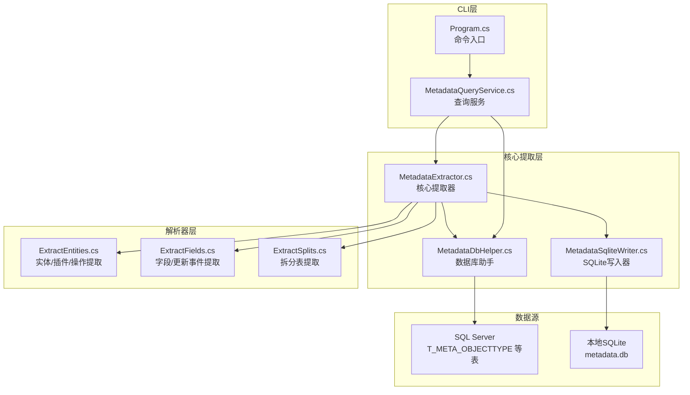
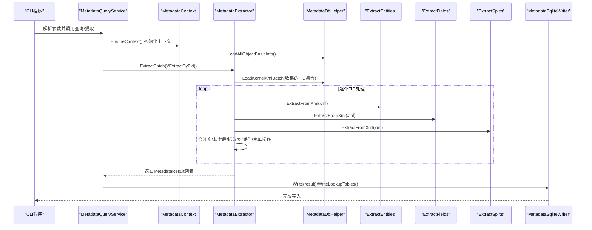
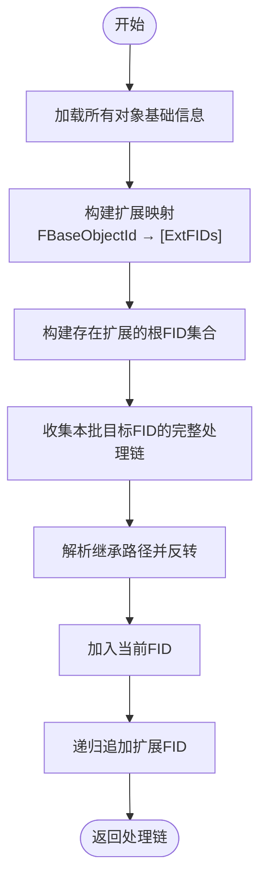
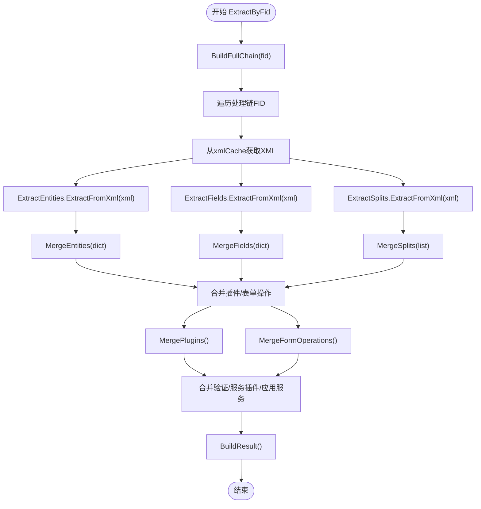
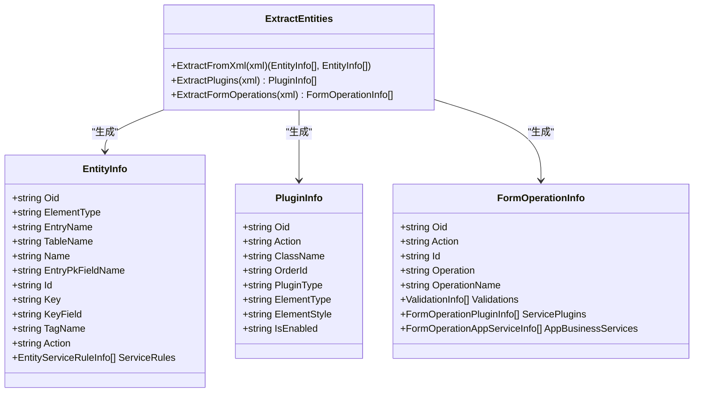
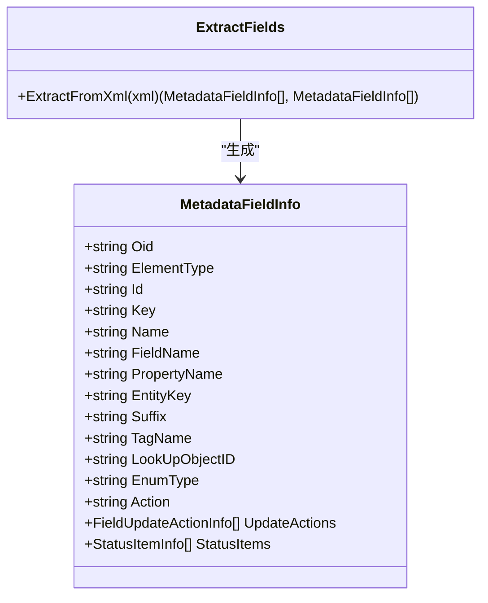
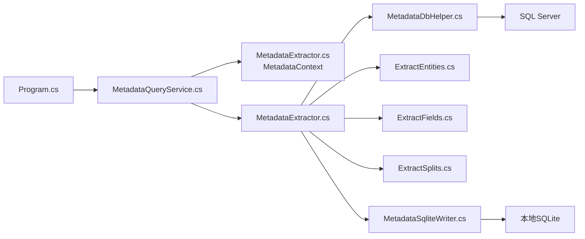

# 元数据提取机制

<cite>
**本文档引用的文件**
- [MetadataExtractor.cs](file://Views/MetadataExtractor.cs)
- [ExtractEntities.cs](file://Views/ExtractEntities.cs)
- [ExtractFields.cs](file://Views/ExtractFields.cs)
- [ExtractSplits.cs](file://Views/ExtractSplits.cs)
- [MetadataDbHelper.cs](file://Views/MetadataDbHelper.cs)
- [MetadataSqliteWriter.cs](file://Views/MetadataSqliteWriter.cs)
- [MetadataQueryService.cs](file://K3CloudDataDictionary.Cli/Services/MetadataQueryService.cs)
- [Program.cs](file://K3CloudDataDictionary.Cli/Program.cs)
- [README.md](file://README.md)
- [usage-examples.md](file://docs/usage-examples.md)
</cite>

## 目录
1. [简介](#简介)
2. [项目结构](#项目结构)
3. [核心组件](#核心组件)
4. [架构总览](#架构总览)
5. [详细组件分析](#详细组件分析)
6. [依赖关系分析](#依赖关系分析)
7. [性能考虑](#性能考虑)
8. [故障排除指南](#故障排除指南)
9. [结论](#结论)
10. [附录](#附录)

## 简介
本文件系统性阐述金蝶K3 Cloud元数据提取机制，重点围绕MetadataExtractor核心提取器的工作原理，涵盖XML元数据解析、继承链处理、扩展数据合并等关键技术。文档还深入分析了ExtractEntities实体提取、ExtractFields字段提取、ExtractSplits分割字段提取的具体实现逻辑，并梳理了从K3 Cloud数据库获取XML数据到本地SQLite缓存的完整流程。最后提供性能优化建议与扩展方法，帮助开发者快速理解并高效使用该机制。

## 项目结构
项目采用分层与职责分离的设计：UI层（WPF）负责交互与展示；CLI层提供命令行工具；核心提取与写入位于Views目录；查询服务位于K3CloudDataDictionary.Cli.Services；模型与视图模型分别在Models与ViewModels目录。

**图表来源**
- [Program.cs:14-69](file://K3CloudDataDictionary.Cli/Program.cs#L14-L69)
- [MetadataQueryService.cs:12-37](file://K3CloudDataDictionary.Cli/Services/MetadataQueryService.cs#L12-L37)
- [MetadataExtractor.cs:289-360](file://Views/MetadataExtractor.cs#L289-L360)
- [MetadataDbHelper.cs:36-79](file://Views/MetadataDbHelper.cs#L36-L79)
- [MetadataSqliteWriter.cs:9-50](file://Views/MetadataSqliteWriter.cs#L9-L50)

**章节来源**
- [README.md:36-83](file://README.md#L36-L83)

## 核心组件
- MetadataContext：一次性加载所有对象基础信息，构建继承链与扩展链映射，提供线程安全的处理链生成能力。
- MetadataExtractor：核心提取器，负责按继承链+扩展链顺序合并实体、字段、拆分表、插件、表单操作等元数据。
- ExtractEntities/ExtractFields/ExtractSplits：针对XML中不同节点类型的解析器，分别提取实体、字段、拆分表信息。
- MetadataDbHelper：负责从SQL Server批量读取对象基础信息与内核XML。
- MetadataSqliteWriter：将提取结果写入本地SQLite数据库，支持事务与增量更新。
- MetadataQueryService：CLI查询服务，封装上下文初始化、元素类型名称映射与各类查询接口。

**章节来源**
- [MetadataExtractor.cs:102-284](file://Views/MetadataExtractor.cs#L102-L284)
- [ExtractEntities.cs:47-293](file://Views/ExtractEntities.cs#L47-L293)
- [ExtractFields.cs:70-167](file://Views/ExtractFields.cs#L70-L167)
- [ExtractSplits.cs:28-60](file://Views/ExtractSplits.cs#L28-L60)
- [MetadataDbHelper.cs:36-131](file://Views/MetadataDbHelper.cs#L36-L131)
- [MetadataSqliteWriter.cs:9-80](file://Views/MetadataSqliteWriter.cs#L9-L80)
- [MetadataQueryService.cs:12-68](file://K3CloudDataDictionary.Cli/Services/MetadataQueryService.cs#L12-L68)

## 架构总览
元数据提取的整体流程如下：

**图表来源**
- [MetadataQueryService.cs:27-37](file://K3CloudDataDictionary.Cli/Services/MetadataQueryService.cs#L27-L37)
- [MetadataExtractor.cs:299-360](file://Views/MetadataExtractor.cs#L299-L360)
- [MetadataDbHelper.cs:87-127](file://Views/MetadataDbHelper.cs#L87-L127)
- [MetadataSqliteWriter.cs:560-800](file://Views/MetadataSqliteWriter.cs#L560-L800)

## 详细组件分析

### MetadataContext：继承链与扩展链构建
- 作用：仅加载基础信息（不含XML），在内存中构建扩展映射与目标FID集合，提供BuildFullChain按继承链+扩展链生成处理顺序。
- 关键点：
  - BuildExtensionMappings：基于FDEVTYPE=2的对象，按FBASEOBJECTID建立“基础对象→扩展对象列表”的映射。
  - BuildFidsWithExtensions：从FDEVTYPE=2对象的FINHERITPATH提取根FID，标记需要额外处理扩展链的基对象。
  - BuildFullChain：解析继承路径，反转后加入当前FID，再递归追加扩展链，保证处理顺序正确。
  - CollectNeededFids：收集一批目标FID的完整处理链中涉及的所有FID，用于批量加载XML。

**图表来源**
- [MetadataExtractor.cs:204-284](file://Views/MetadataExtractor.cs#L204-L284)

**章节来源**
- [MetadataExtractor.cs:102-284](file://Views/MetadataExtractor.cs#L102-L284)

### MetadataExtractor：继承链合并与扩展递归合并
- ExtractBatch：收集所需FID→批量加载XML→逐个提取→返回结果列表，线程安全。
- ExtractByFid：获取完整处理链→按顺序逐层合并Entity/Field/Split/Plugins/FormOperations→构建MetadataResult。
- 合并策略：
  - 实体/字段：有oid通过oid匹配父级，action=remove则删除，action=edit则覆盖属性；无oid通过Id/Key新增。
  - 拆分表：按EntityKey+Suffix匹配，存在则覆盖Description，不存在则新增。
  - 插件/表单操作/验证/业务服务：按oid优先（扩展）或Id（基础）匹配，action=remove删除，已存在覆盖属性，不存在新增。
- 服务规则合并：EntityServiceRule按oid/Id匹配，WhenTrue/WhenFalse中的FormBusinessService也按oid粒度合并。

**图表来源**
- [MetadataExtractor.cs:322-397](file://Views/MetadataExtractor.cs#L322-L397)
- [MetadataExtractor.cs:616-718](file://Views/MetadataExtractor.cs#L616-L718)
- [MetadataExtractor.cs:726-759](file://Views/MetadataExtractor.cs#L726-L759)

**章节来源**
- [MetadataExtractor.cs:299-397](file://Views/MetadataExtractor.cs#L299-L397)
- [MetadataExtractor.cs:616-806](file://Views/MetadataExtractor.cs#L616-L806)

### ExtractEntities：实体、服务规则、插件、表单操作提取
- 实体提取：解析以Entity结尾但非LinkEntitys的节点，提取Tag、oid、ElementType、Action、EntryName、TableName、Name、EntryPkFieldName、Id、Key、KeyField等；同时提取EntityServiceRules及其WhenTrue/WhenFalse中的FormBusinessService。
- 插件提取：从FormPlugins、ListPlugins、WebFormBuilderPlugins容器中提取PlugIn节点，包含oid、action、ClassName、OrderId、PluginType、ElementType、ElementStyle、IsEnabled。
- 表单操作提取：从FormOperations容器提取FormOperation节点，包含Id、Operation、OperationName；并提取Validations、ServicePlugins、AppBusinessService（忽略action=setnull）。

**图表来源**
- [ExtractEntities.cs:7-45](file://Views/ExtractEntities.cs#L7-L45)
- [ExtractEntities.cs:144-274](file://Views/ExtractEntities.cs#L144-L274)

**章节来源**
- [ExtractEntities.cs:47-293](file://Views/ExtractEntities.cs#L47-L293)

### ExtractFields：字段、值更新事件、状态项提取
- 字段提取：解析以Field结尾且ElementType!=0、非嵌套在其他Field内的节点，提取Tag、oid、ElementType、Action、Id、Key、Name、FieldName、PropertyName、EntityKey、Suffix、LookUpObjectID、EnumType等。
- 值更新事件：提取UpdateActions子节点，包含ServiceTypeName、Oid、Action、Id、ActionId、Description、Parameters、Seq、IsForbidden、PreCondition、PreConditionDesc。
- 状态项：ElementType=40时提取StatusItems子节点，包含Id、StatusName、StatusValue。

**图表来源**
- [ExtractFields.cs:7-51](file://Views/ExtractFields.cs#L7-L51)

**章节来源**
- [ExtractFields.cs:70-167](file://Views/ExtractFields.cs#L70-L167)

### ExtractSplits：拆分表提取
- 从XML中提取SplitTable节点，获取父级实体的Key作为EntityKey，提取Suffix与Description。

**章节来源**
- [ExtractSplits.cs:28-60](file://Views/ExtractSplits.cs#L28-L60)

### MetadataDbHelper：基础信息与XML批量读取
- LoadAllObjectBasicInfo：一次性查询所有对象基础信息（不含XML），用于构建继承链与扩展链。
- LoadKernelXmlBatch：按FID列表批量查询FKERNELXML，返回FID→XML字符串字典，避免多次往返。

**章节来源**
- [MetadataDbHelper.cs:44-127](file://Views/MetadataDbHelper.cs#L44-L127)

### MetadataSqliteWriter：本地SQLite写入
- 支持全量建表与增量初始化，写入表单、实体、拆分表、字段、服务规则、业务服务、插件、值更新事件、表单操作、校验规则、操作插件、操作服务等。
- 提供DeleteFormsByIdentifiers按表单标识级联删除，支持按需重建表结构。

**章节来源**
- [MetadataSqliteWriter.cs:79-283](file://Views/MetadataSqliteWriter.cs#L79-L283)
- [MetadataSqliteWriter.cs:306-353](file://Views/MetadataSqliteWriter.cs#L306-L353)
- [MetadataSqliteWriter.cs:560-800](file://Views/MetadataSqliteWriter.cs#L560-L800)

### MetadataQueryService：CLI查询服务
- EnsureContext：懒加载上下文，初始化MetadataContext与元素类型名称映射。
- ResolveObject：根据lookUpObject反查目标表单信息。
- QueryForm/QueryEntities/QueryFields/SearchFields/SearchTables/QueryBillTypes/QueryAssistantData/QueryEnumItems/QueryBillStatusItems：提供丰富的查询接口，内部调用ExtractMetadata完成元数据提取与统计。

**章节来源**
- [MetadataQueryService.cs:27-68](file://K3CloudDataDictionary.Cli/Services/MetadataQueryService.cs#L27-L68)
- [MetadataQueryService.cs:83-122](file://K3CloudDataDictionary.Cli/Services/MetadataQueryService.cs#L83-L122)
- [MetadataQueryService.cs:172-800](file://K3CloudDataDictionary.Cli/Services/MetadataQueryService.cs#L172-L800)

## 依赖关系分析

**图表来源**
- [Program.cs:14-69](file://K3CloudDataDictionary.Cli/Program.cs#L14-L69)
- [MetadataQueryService.cs:19-37](file://K3CloudDataDictionary.Cli/Services/MetadataQueryService.cs#L19-L37)
- [MetadataExtractor.cs:299-360](file://Views/MetadataExtractor.cs#L299-L360)
- [MetadataDbHelper.cs:44-127](file://Views/MetadataDbHelper.cs#L44-L127)
- [MetadataSqliteWriter.cs:9-50](file://Views/MetadataSqliteWriter.cs#L9-L50)

**章节来源**
- [Program.cs:14-69](file://K3CloudDataDictionary.Cli/Program.cs#L14-L69)
- [MetadataQueryService.cs:19-37](file://K3CloudDataDictionary.Cli/Services/MetadataQueryService.cs#L19-L37)

## 性能考虑
- 批量加载XML：通过CollectNeededFids收集完整处理链涉及的FID，统一调用LoadKernelXmlBatch一次性获取，减少数据库往返次数。
- 线程安全与内存复用：MetadataContext为只读，ExtractBatch中各线程独立加载XML，方法返回后自动GC回收，降低内存压力。
- 字典合并策略：使用Dictionary按oid/Id/Key快速定位父级，避免重复扫描；拆分表与插件/表单操作采用按继承键匹配，提升合并效率。
- SQLite写入优化：使用事务（BeginTransaction）批量插入，显著提升写入吞吐；全量/增量模式分别处理，避免不必要的DDL变更。
- 查询优化：CLI查询服务对常用查询（如元素类型名称映射）进行缓存，减少重复查询。

[本节为通用性能指导，不直接分析具体文件，故无“章节来源”]

## 故障排除指南
- 连接失败或超时：检查连接字符串与网络连通性；CLI层通过Program.ResolveConnectionString解析连接，若无默认连接会抛出异常提示。
- 元数据为空：确认目标FID存在于基础信息表中，且FINHERITPATH/FDEVTYPE配置正确；检查ExtractByFid中xmlCache是否命中。
- 合并冲突：关注action=remove导致的删除逻辑；确保oid/Id匹配键设置正确（oid优先于Id/ClassName）。
- 写入异常：检查SQLite路径权限与磁盘空间；必要时使用DeleteFormsByIdentifiers清理后再重试。

**章节来源**
- [Program.cs:129-151](file://K3CloudDataDictionary.Cli/Program.cs#L129-L151)
- [MetadataExtractor.cs:616-648](file://Views/MetadataExtractor.cs#L616-L648)
- [MetadataSqliteWriter.cs:306-353](file://Views/MetadataSqliteWriter.cs#L306-L353)

## 结论
本文档系统梳理了金蝶K3 Cloud元数据提取机制，从MetadataContext的继承与扩展链构建，到MetadataExtractor的逐层合并策略，再到ExtractEntities/ExtractFields/ExtractSplits的XML解析实现，以及从SQL Server到本地SQLite的完整流程。通过批量加载XML、字典合并与事务写入等优化手段，该机制在保证准确性的同时兼顾了性能与可维护性。开发者可据此快速扩展新的解析器或查询接口，满足更复杂的业务需求。

[本节为总结性内容，不直接分析具体文件，故无“章节来源”]

## 附录

### 元数据提取流程要点
- 基础信息加载：一次性读取对象基础信息，构建继承与扩展映射。
- 处理链生成：按继承路径解析并反转，加入当前FID，递归追加扩展FID。
- XML批量获取：根据处理链收集FID，一次性批量查询内核XML。
- 逐层合并：实体/字段按oid匹配父级，action控制增删改；拆分表/插件/表单操作按继承键合并。
- 本地写入：事务批量写入，支持全量重建与增量更新。

**章节来源**
- [README.md:244-252](file://README.md#L244-L252)

### CLI使用示例（参考）
- 通过lookUpObject解析关联表单：fields → resolve → fields
- 查询单据类型/辅助资料/枚举/单据状态：billtype/assistantdata/enum/billstatus
- 搜索表单与实体字段：search → fields

**章节来源**
- [usage-examples.md:1-542](file://docs/usage-examples.md#L1-L542)