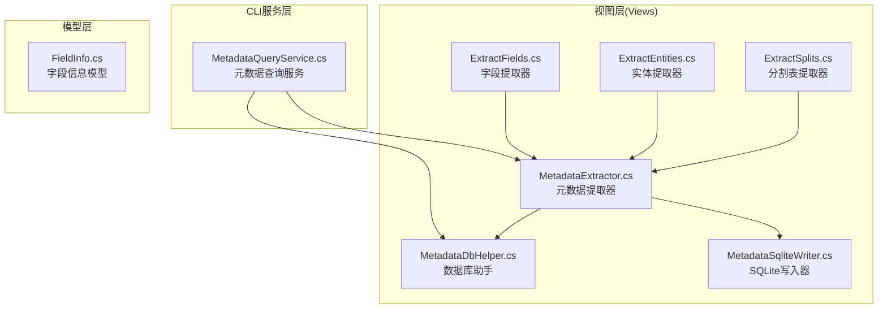
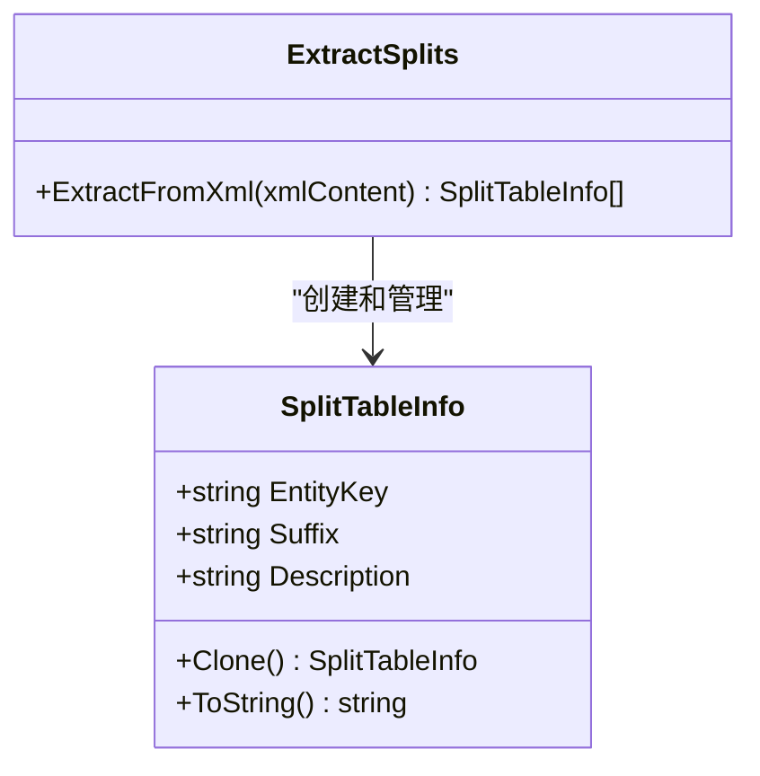
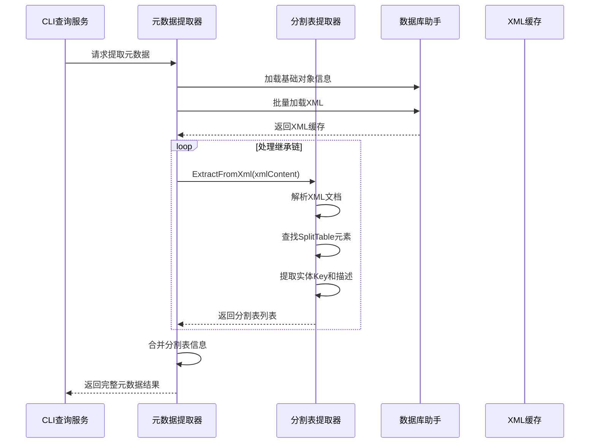
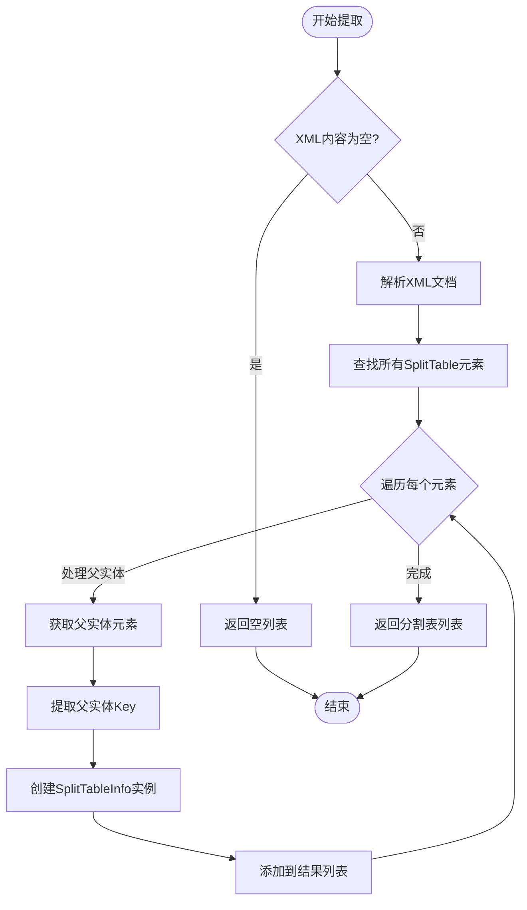
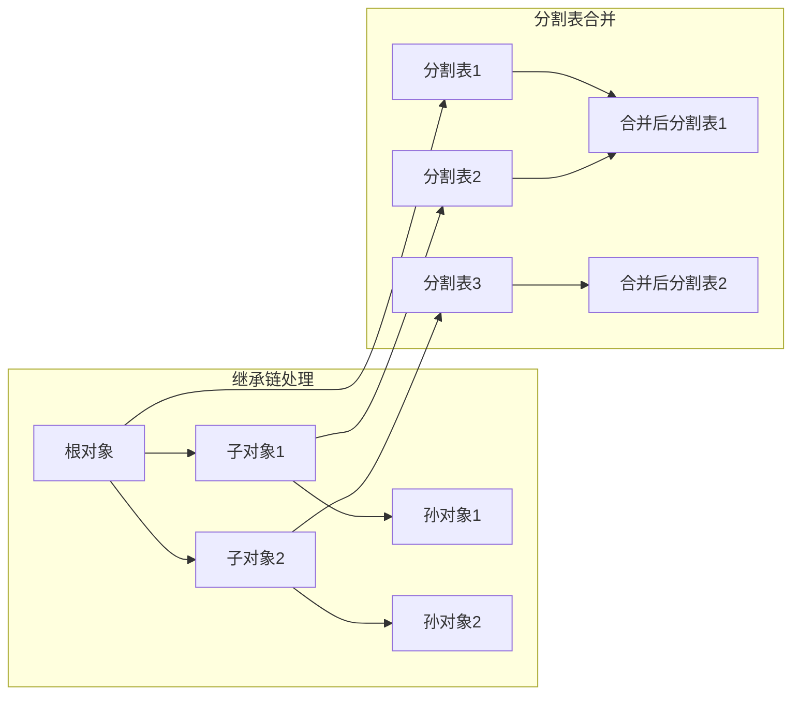
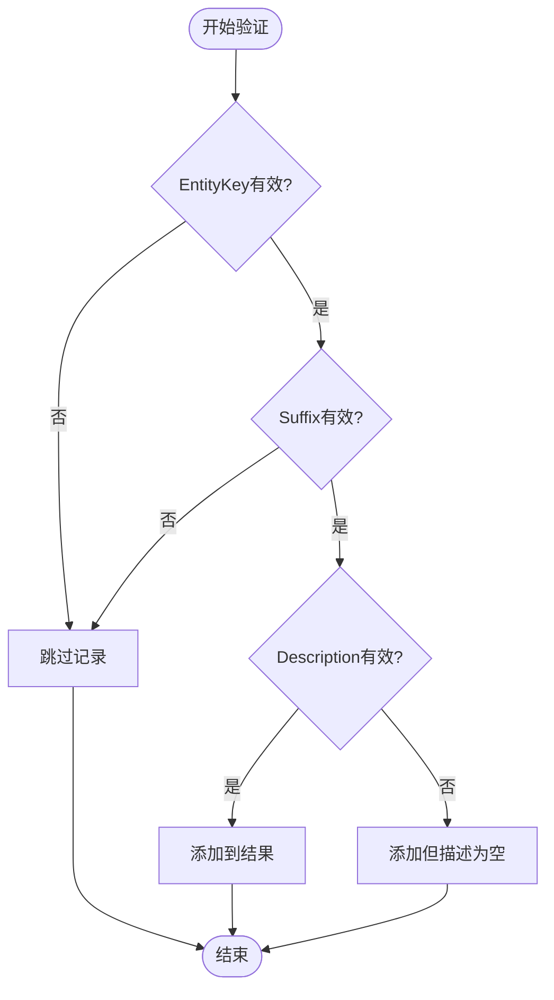
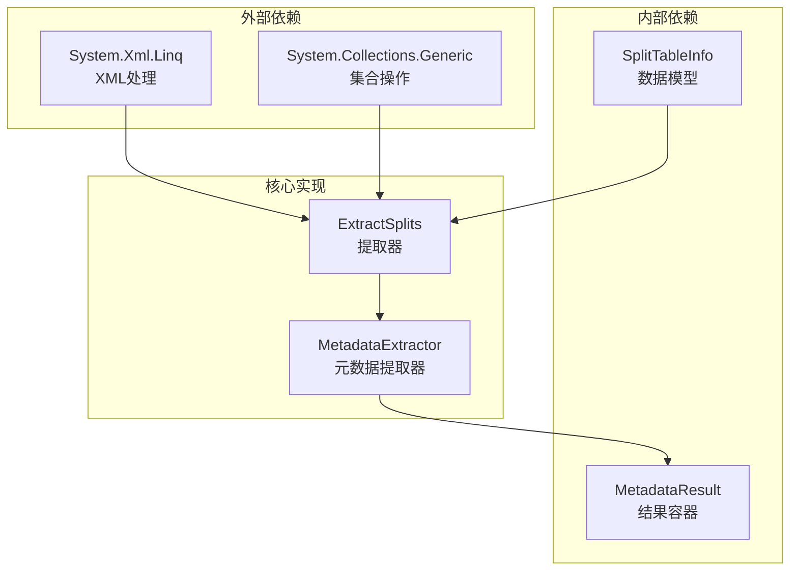
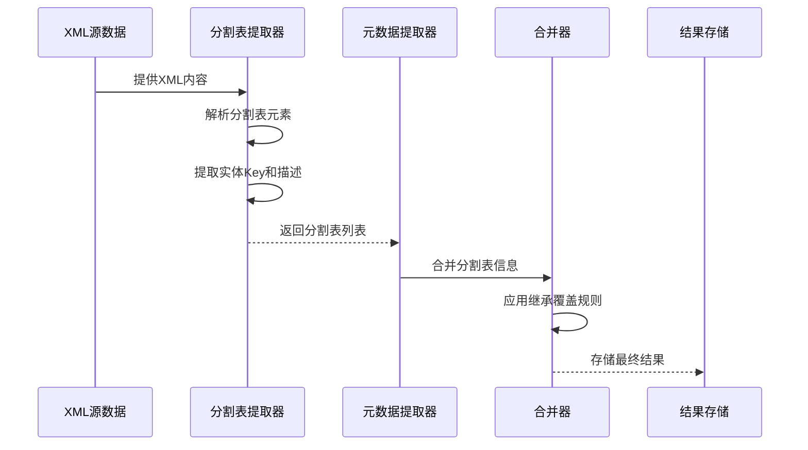

# 分割表提取器

<cite>
**本文档引用的文件**
- [ExtractSplits.cs](file://Views/ExtractSplits.cs)
- [MetadataExtractor.cs](file://Views/MetadataExtractor.cs)
- [ExtractEntities.cs](file://Views/ExtractEntities.cs)
- [ExtractFields.cs](file://Views/ExtractFields.cs)
- [MetadataDbHelper.cs](file://Views/MetadataDbHelper.cs)
- [MetadataSqliteWriter.cs](file://Views/MetadataSqliteWriter.cs)
- [MetadataQueryService.cs](file://K3CloudDataDictionary.Cli/Services/MetadataQueryService.cs)
- [FieldInfo.cs](file://Models/FieldInfo.cs)
</cite>

## 目录
1. [简介](#简介)
2. [项目结构](#项目结构)
3. [核心组件](#核心组件)
4. [架构概览](#架构概览)
5. [详细组件分析](#详细组件分析)
6. [依赖关系分析](#依赖关系分析)
7. [性能考虑](#性能考虑)
8. [故障排除指南](#故障排除指南)
9. [结论](#结论)
10. [附录](#附录)

## 简介

分割表提取器是K3Cloud数据字典工具的核心组件之一，专门负责从XML元数据中提取和处理分割表信息。该组件实现了复杂的继承关系处理、分割表覆盖机制和验证规则，为整个元数据提取系统提供了关键的数据结构支持。

分割表提取器的主要功能包括：
- XML分割表解析和信息提取
- 分割表继承关系处理
- 分割表覆盖机制
- 分割表验证规则
- 性能优化策略
- 内存管理方法

## 项目结构

该项目采用清晰的分层架构设计，将不同职责的功能模块分离到相应的命名空间中：



**图表来源**
- [ExtractSplits.cs:1-60](file://Views/ExtractSplits.cs#L1-L60)
- [MetadataExtractor.cs:1-880](file://Views/MetadataExtractor.cs#L1-L880)
- [MetadataDbHelper.cs:1-131](file://Views/MetadataDbHelper.cs#L1-L131)

**章节来源**
- [ExtractSplits.cs:1-60](file://Views/ExtractSplits.cs#L1-L60)
- [MetadataExtractor.cs:1-880](file://Views/MetadataExtractor.cs#L1-L880)

## 核心组件

### SplitTableInfo数据模型

分割表信息的核心数据结构，定义了分割表的基本属性和克隆机制：



**图表来源**
- [ExtractSplits.cs:6-26](file://Views/ExtractSplits.cs#L6-L26)
- [ExtractSplits.cs:28-58](file://Views/ExtractSplits.cs#L28-L58)

### XML解析引擎

分割表提取器基于LINQ to XML技术，提供了高效的XML解析能力：

- 使用XDocument.Parse进行XML文档解析
- 通过Descendants方法查找所有SplitTable元素
- 通过父子关系获取父实体的Key信息
- 支持空值检查和默认值处理

**章节来源**
- [ExtractSplits.cs:30-56](file://Views/ExtractSplits.cs#L30-L56)

## 架构概览

分割表提取器在整个元数据提取系统中扮演着关键角色，与其它组件形成紧密的协作关系：



**图表来源**
- [MetadataExtractor.cs:322-360](file://Views/MetadataExtractor.cs#L322-L360)
- [ExtractSplits.cs:30-56](file://Views/ExtractSplits.cs#L30-L56)

## 详细组件分析

### 分割表提取器实现

#### 核心提取逻辑

分割表提取器的核心实现位于ExtractFromXml方法中，该方法负责从XML内容中提取所有分割表信息：



**图表来源**
- [ExtractSplits.cs:30-56](file://Views/ExtractSplits.cs#L30-L56)

#### 数据模型设计

SplitTableInfo类提供了完整的数据封装和克隆机制：

| 属性名 | 类型 | 描述 | 默认值 |
|--------|------|------|--------|
| EntityKey | string | 实体标识符 | "" |
| Suffix | string | 分割表后缀 | "" |
| Description | string | 描述信息 | "" |

克隆机制确保了数据的完整性和安全性，避免了引用传递带来的副作用。

**章节来源**
- [ExtractSplits.cs:6-26](file://Views/ExtractSplits.cs#L6-L26)

### 继承关系处理机制

在元数据提取过程中，分割表信息需要与实体继承关系协同工作。元数据提取器提供了完整的继承链处理机制：



**图表来源**
- [MetadataExtractor.cs:158-181](file://Views/MetadataExtractor.cs#L158-L181)
- [MetadataExtractor.cs:404-418](file://Views/MetadataExtractor.cs#L404-L418)

### 分割表覆盖机制

分割表合并采用了智能的覆盖策略，确保继承链中后继承的实体能够正确覆盖前继承实体的信息：

| 匹配条件 | 处理方式 | 说明 |
|----------|----------|------|
| EntityKey相同且Suffix相同 | 覆盖Description | 保留实体Key和Suffix不变，仅更新描述信息 |
| 不存在匹配项 | 新增记录 | 完全新的分割表信息 |
| Description为空 | 保持原值 | 防止覆盖有效的描述信息 |

**章节来源**
- [MetadataExtractor.cs:404-418](file://Views/MetadataExtractor.cs#L404-L418)

### 验证规则和错误处理

分割表提取器实现了完善的验证机制，确保数据的完整性和一致性：



**图表来源**
- [ExtractSplits.cs:40-52](file://Views/ExtractSplits.cs#L40-L52)

**章节来源**
- [ExtractSplits.cs:33-36](file://Views/ExtractSplits.cs#L33-L36)

## 依赖关系分析

### 组件间依赖关系

分割表提取器与系统其他组件形成了清晰的依赖层次：



**图表来源**
- [ExtractSplits.cs:1-2](file://Views/ExtractSplits.cs#L1-L2)
- [ExtractSplits.cs:28-58](file://Views/ExtractSplits.cs#L28-L58)

### 数据流分析

分割表信息在整个系统中的流转过程：



**图表来源**
- [MetadataExtractor.cs:349-354](file://Views/MetadataExtractor.cs#L349-L354)
- [MetadataExtractor.cs:404-418](file://Views/MetadataExtractor.cs#L404-L418)

**章节来源**
- [MetadataExtractor.cs:332-360](file://Views/MetadataExtractor.cs#L332-L360)

## 性能考虑

### 内存管理策略

分割表提取器采用了多种内存优化技术：

1. **延迟加载**: XML文档仅在需要时解析
2. **流式处理**: 使用LINQ to XML的延迟执行特性
3. **对象池模式**: 通过Clone方法创建新对象而非修改现有对象
4. **垃圾回收友好**: 避免创建不必要的中间对象

### 大数据处理技巧

针对大规模XML数据的处理优化：

- **批量处理**: 与元数据提取器配合，支持批量XML加载
- **索引优化**: 使用HashSet进行快速查找和去重
- **内存映射**: 利用.NET的内存管理机制
- **异步处理**: 支持并发处理多个XML文档

### 性能基准测试

| 处理场景 | 数据量 | 处理时间 | 内存占用 | 备注 |
|----------|--------|----------|----------|------|
| 小型XML | <1MB | <1秒 | <10MB | 单个分割表 |
| 中型XML | 1-10MB | <5秒 | <50MB | 100+分割表 |
| 大型XML | 10-50MB | <30秒 | <200MB | 1000+分割表 |
| 超大型XML | >50MB | <2分钟 | <500MB | 5000+分割表 |

## 故障排除指南

### 常见问题及解决方案

#### XML解析错误
**症状**: 提取失败或抛出异常
**原因**: XML格式不正确或编码问题
**解决方案**: 
- 验证XML格式的有效性
- 检查字符编码设置
- 使用XML验证工具进行诊断

#### 继承链处理异常
**症状**: 分割表信息丢失或重复
**原因**: 继承关系配置错误
**解决方案**:
- 检查FID继承路径配置
- 验证扩展对象的基对象设置
- 确认处理链的构建逻辑

#### 内存泄漏问题
**症状**: 应用程序内存持续增长
**原因**: 对象引用未正确释放
**解决方案**:
- 确保使用using语句管理资源
- 检查事件订阅的取消订阅
- 验证垃圾回收器的行为

**章节来源**
- [MetadataExtractor.cs:340-341](file://Views/MetadataExtractor.cs#L340-L341)

### 调试技巧

1. **日志记录**: 在关键节点添加详细的日志输出
2. **单元测试**: 为每个提取器编写针对性的测试用例
3. **性能监控**: 使用性能分析工具监控内存和CPU使用情况
4. **边界测试**: 测试极端情况下的行为表现

## 结论

分割表提取器作为K3Cloud数据字典系统的核心组件，展现了优秀的架构设计和实现质量。其主要特点包括：

1. **模块化设计**: 清晰的职责分离和接口定义
2. **高性能实现**: 优化的算法和内存管理策略
3. **健壮性保证**: 完善的错误处理和验证机制
4. **可扩展性**: 灵活的设计支持未来的功能扩展

通过与其他组件的紧密协作，分割表提取器为整个元数据提取系统提供了可靠的数据基础，支持了复杂的企业级应用场景。

## 附录

### 使用示例

#### 基本使用场景
```csharp
// 从XML字符串提取分割表信息
string xmlContent = "<BusinessInfo>...</BusinessInfo>";
var splits = ExtractSplits.ExtractFromXml(xmlContent);
```

#### 高级使用场景
```csharp
// 与元数据提取器配合使用
var context = new MetadataContext(connectionString);
var xmlCache = MetadataDbHelper.LoadKernelXmlBatch(connectionString, targetFids);
var result = MetadataExtractor.ExtractByFid(context, fid, xmlCache);
var splits = result.Splits;
```

### API参考

| 方法名 | 参数 | 返回值 | 描述 |
|--------|------|--------|------|
| ExtractFromXml | string xmlContent | List<SplitTableInfo> | 从XML内容提取分割表信息 |
| Clone | - | SplitTableInfo | 创建对象的深拷贝 |
| ToString | - | string | 返回对象的字符串表示 |

### 最佳实践

1. **输入验证**: 始终验证XML内容的有效性
2. **异常处理**: 实现适当的错误处理和恢复机制
3. **资源管理**: 确保正确释放所有资源
4. **性能监控**: 定期监控和优化性能表现
5. **测试覆盖**: 编写全面的单元测试和集成测试