# 字段提取器

<cite>
**本文档引用的文件**
- [ExtractFields.cs](file://Views/ExtractFields.cs)
- [MetadataExtractor.cs](file://Views/MetadataExtractor.cs)
- [FieldInfo.cs](file://Models/FieldInfo.cs)
- [AllFieldInfo.cs](file://Models/AllFieldInfo.cs)
- [ExtractEntities.cs](file://Views/ExtractEntities.cs)
- [ExtractSplits.cs](file://Views/ExtractSplits.cs)
- [MetadataDbHelper.cs](file://Views/MetadataDbHelper.cs)
- [FieldsCommand.cs](file://K3CloudDataDictionary.Cli/Commands/FieldsCommand.cs)
- [MetadataQueryService.cs](file://K3CloudDataDictionary.Cli/Services/MetadataQueryService.cs)
</cite>

## 目录
1. [简介](#简介)
2. [项目结构](#项目结构)
3. [核心组件](#核心组件)
4. [架构概览](#架构概览)
5. [详细组件分析](#详细组件分析)
6. [依赖关系分析](#依赖关系分析)
7. [性能考虑](#性能考虑)
8. [故障排除指南](#故障排除指南)
9. [结论](#结论)

## 简介

字段提取器ExtractFields是K3Cloud数据字典系统中的核心组件，负责从XML元数据中提取和解析字段信息。该组件实现了复杂的字段继承链处理、字段合并策略和字段覆盖机制，为整个系统的元数据管理提供了坚实的技术基础。

系统采用分层架构设计，通过ExtractFields组件专门处理XML字段解析，结合MetadataExtractor组件实现完整的元数据提取和合并流程。该设计确保了字段信息的准确性和完整性，支持大规模企业级应用的数据字典管理需求。

## 项目结构

字段提取器位于Views目录下，与实体提取器、拆分表提取器等其他提取器组件协同工作，形成完整的元数据提取体系。

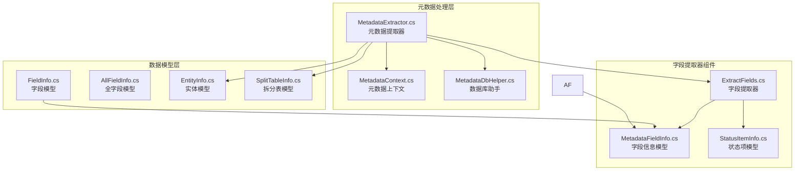

**图表来源**
- [ExtractFields.cs:70-167](file://Views/ExtractFields.cs#L70-L167)
- [MetadataExtractor.cs:289-397](file://Views/MetadataExtractor.cs#L289-L397)
- [MetadataDbHelper.cs:36-131](file://Views/MetadataDbHelper.cs#L36-L131)

**章节来源**
- [ExtractFields.cs:1-167](file://Views/ExtractFields.cs#L1-L167)
- [MetadataExtractor.cs:1-880](file://Views/MetadataExtractor.cs#L1-L880)

## 核心组件

### ExtractFields类

ExtractFields是字段提取器的核心实现，提供了静态方法来处理XML字段的解析和提取。

#### 主要功能特性

1. **XML字段解析**：支持从XML文档中提取各种类型的字段信息
2. **字段分类处理**：区分有OID和无OID的字段，分别处理继承和新增场景
3. **嵌套数据提取**：支持提取字段的更新动作和状态项信息
4. **类型安全设计**：使用强类型模型确保数据的正确性

#### 关键方法

- `ExtractFromXml(string xmlContent)`: 主要入口方法，解析XML并返回字段列表
- `ParseFields(XDocument doc)`: 核心解析逻辑，处理字段元素的提取

**章节来源**
- [ExtractFields.cs:70-167](file://Views/ExtractFields.cs#L70-L167)

### MetadataFieldInfo模型

MetadataFieldInfo是字段信息的标准模型，包含了字段的所有关键属性。

#### 字段属性说明

| 属性名 | 类型 | 描述 | 用途 |
|--------|------|------|------|
| Oid | string | 字段唯一标识符 | 继承链匹配 |
| ElementType | string | 元素类型 | 字段类型标识 |
| Id | string | 数据库标识 | 唯一标识 |
| Key | string | 键值 | 业务标识 |
| Name | string | 名称 | 用户可见名称 |
| FieldName | string | 字段名 | 数据库字段名 |
| PropertyName | string | 属性名 | 程序属性名 |
| EntityKey | string | 实体键 | 所属实体标识 |
| Suffix | string | 后缀 | 拆分表后缀 |
| TagName | string | 标签名 | XML标签名 |
| LookUpObjectID | string | 查找对象ID | 辅助资料关联 |
| EnumType | string | 枚举类型 | 枚举字段类型 |

**章节来源**
- [ExtractFields.cs:7-51](file://Views/ExtractFields.cs#L7-L51)

### StatusItemInfo模型

StatusItemInfo用于表示单据状态字段的状态项信息。

#### 状态项属性

- `Id`: 状态项标识
- `StatusName`: 状态名称
- `StatusValue`: 状态值

**章节来源**
- [ExtractFields.cs:53-68](file://Views/ExtractFields.cs#L53-L68)

## 架构概览

字段提取器在整个系统架构中扮演着关键角色，与实体提取器、拆分表提取器共同构成完整的元数据提取体系。

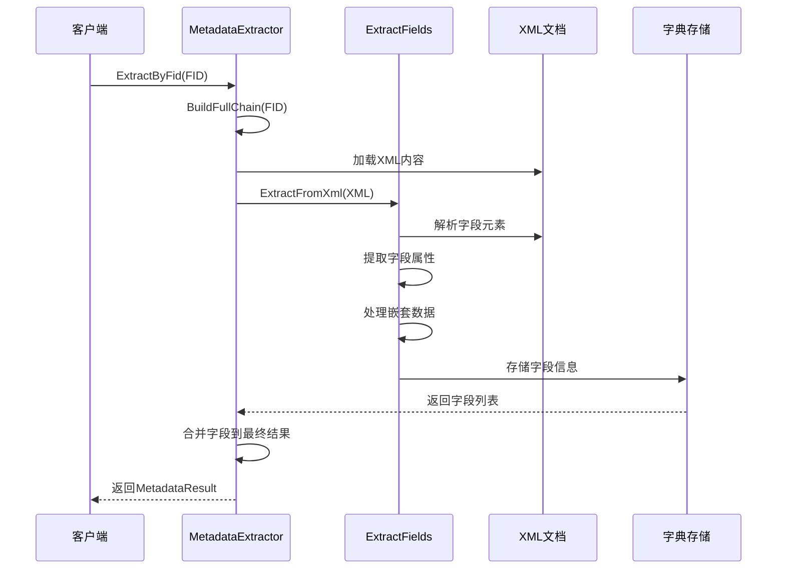

**图表来源**
- [MetadataExtractor.cs:322-360](file://Views/MetadataExtractor.cs#L322-L360)
- [ExtractFields.cs:72-81](file://Views/ExtractFields.cs#L72-L81)

### 继承链处理机制

系统实现了复杂的继承链处理机制，支持多层继承和扩展的合并。

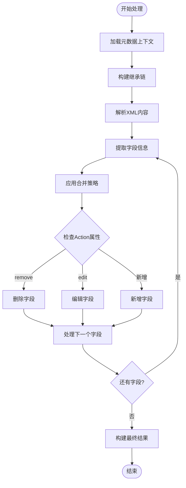

**图表来源**
- [MetadataExtractor.cs:658-690](file://Views/MetadataExtractor.cs#L658-L690)
- [MetadataExtractor.cs:616-648](file://Views/MetadataExtractor.cs#L616-L648)

**章节来源**
- [MetadataExtractor.cs:289-397](file://Views/MetadataExtractor.cs#L289-L397)

## 详细组件分析

### 字段提取算法实现

字段提取算法采用了基于LINQ的XML解析策略，具有以下特点：

#### XML元素筛选逻辑

算法通过多种条件筛选XML中的字段元素：
- 元素名称以"Field"结尾
- 包含ElementType属性且不等于"0"
- 父级和祖父级元素存在且不以"Field"结尾

#### 字段信息提取流程

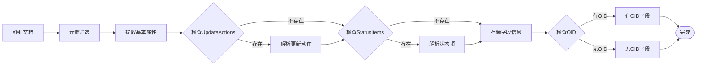

**图表来源**
- [ExtractFields.cs:83-164](file://Views/ExtractFields.cs#L83-L164)

**章节来源**
- [ExtractFields.cs:70-167](file://Views/ExtractFields.cs#L70-L167)

### 字段类型处理机制

系统支持多种字段类型，每种类型都有特定的处理逻辑：

#### 基础字段类型
- **普通字段**：标准的文本、数值、日期等字段
- **查找字段**：关联到辅助资料的字段
- **枚举字段**：具有固定选项的字段
- **单据状态字段**：elementType=40的特殊字段

#### 嵌套数据处理

对于不同类型的字段，系统会提取相应的嵌套数据：

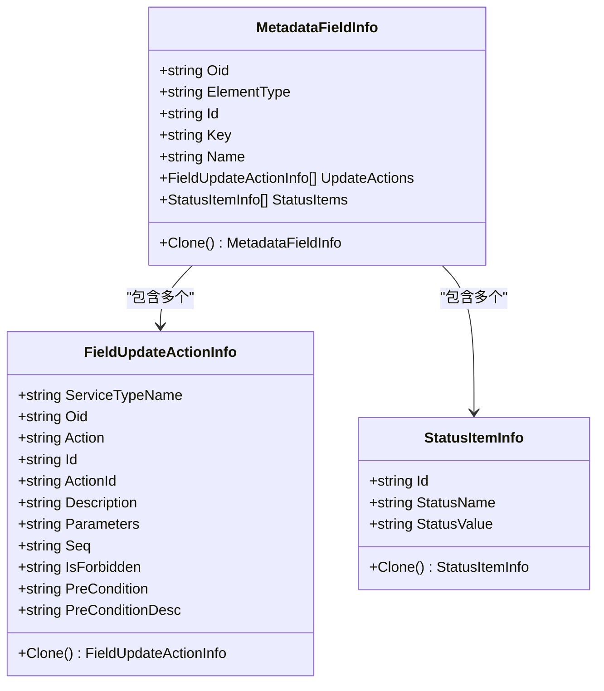

**图表来源**
- [ExtractFields.cs:7-68](file://Views/ExtractFields.cs#L7-L68)

**章节来源**
- [ExtractFields.cs:113-151](file://Views/ExtractFields.cs#L113-L151)

### 字段验证规则

系统实现了完善的字段验证机制，确保数据的完整性和一致性：

#### 验证规则类型

1. **必需字段验证**：确保关键字段不为空
2. **格式验证**：验证字段格式的正确性
3. **范围验证**：验证数值字段的范围
4. **关联验证**：验证外键关联的有效性

#### 验证执行流程

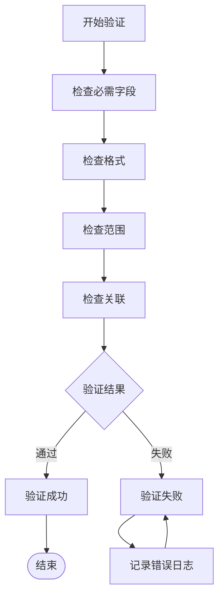

**图表来源**
- [MetadataExtractor.cs:658-690](file://Views/MetadataExtractor.cs#L658-L690)

**章节来源**
- [MetadataExtractor.cs:658-690](file://Views/MetadataExtractor.cs#L658-L690)

### 字段继承链处理

字段继承链处理是系统的核心功能之一，实现了复杂的层次化数据管理：

#### 继承链构建过程

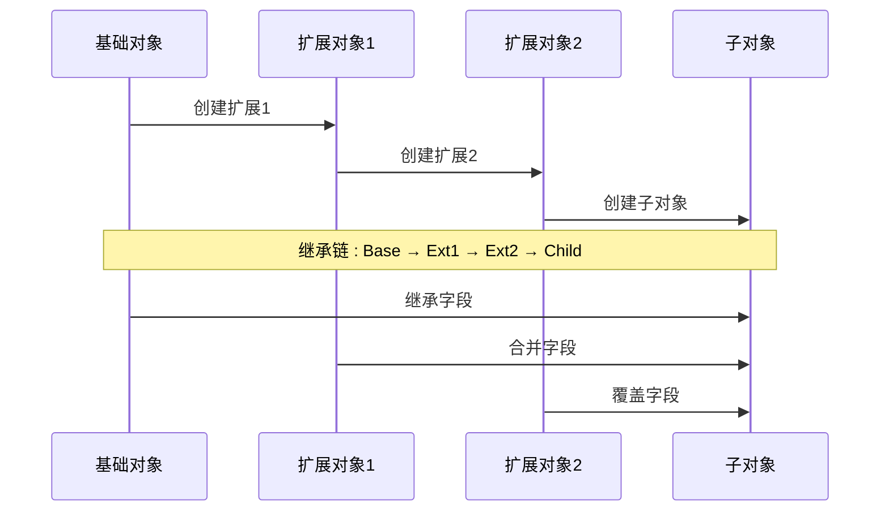

**图表来源**
- [MetadataExtractor.cs:158-181](file://Views/MetadataExtractor.cs#L158-L181)

#### 字段合并策略

系统采用"后到先得"的合并策略：

1. **有OID字段**：通过OID进行精确匹配，后出现的字段覆盖先出现的字段
2. **无OID字段**：通过Id或Key进行匹配，后出现的字段覆盖先出现的字段
3. **Action属性处理**：
   - `remove`：删除指定字段
   - `edit`：编辑现有字段属性
   - 默认：新增字段

**章节来源**
- [MetadataExtractor.cs:616-690](file://Views/MetadataExtractor.cs#L616-L690)

### 字段合并策略

字段合并策略是系统实现数据一致性的重要机制：

#### 合并字典设计

系统使用字典来管理字段合并过程：

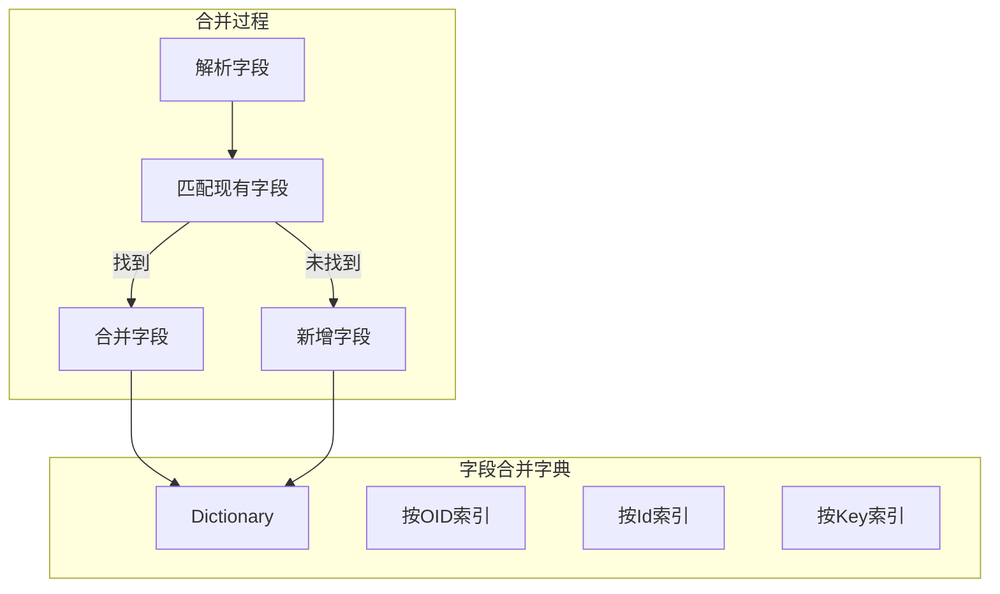

**图表来源**
- [MetadataExtractor.cs:658-690](file://Views/MetadataExtractor.cs#L658-L690)

#### 覆盖机制实现

覆盖机制确保了继承链中后出现的定义能够正确覆盖前面的定义：

**章节来源**
- [MetadataExtractor.cs:668-677](file://Views/MetadataExtractor.cs#L668-L677)

## 依赖关系分析

字段提取器与其他组件之间存在紧密的依赖关系，形成了完整的元数据处理生态系统。

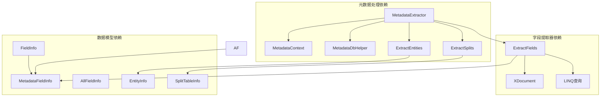

**图表来源**
- [ExtractFields.cs:1-3](file://Views/ExtractFields.cs#L1-L3)
- [MetadataExtractor.cs:1-6](file://Views/MetadataExtractor.cs#L1-L6)

### 外部依赖分析

#### XML处理依赖

字段提取器主要依赖于System.Xml.Linq命名空间提供的XML处理能力：

- **XDocument**：XML文档解析
- **XElement**：XML元素访问
- **LINQ to XML**：XML查询和筛选

#### 数据库依赖

系统通过MetadataDbHelper类访问SQL Server数据库：

- **SqlConnection**：数据库连接管理
- **SqlCommand**：SQL命令执行
- **SqlDataReader**：数据读取

**章节来源**
- [ExtractFields.cs:1-3](file://Views/ExtractFields.cs#L1-L3)
- [MetadataDbHelper.cs:1-5](file://Views/MetadataDbHelper.cs#L1-L5)

## 性能考虑

字段提取器在设计时充分考虑了性能优化，特别是在处理大量元数据时的性能表现。

### 内存使用策略

#### 流式处理设计

系统采用流式处理方式，避免一次性加载大量XML数据到内存：

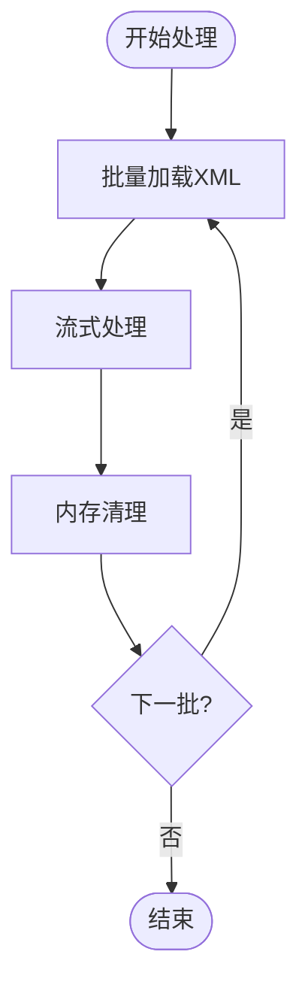

#### 对象池模式

对于频繁创建的对象，系统采用了对象池模式减少垃圾回收压力：

- **MetadataFieldInfo对象复用**
- **StatusItemInfo对象复用**
- **StringBuilder对象复用**

### 大数据量处理技巧

#### 分页处理策略

对于大量数据的处理，系统采用了分页策略：

1. **批量加载**：每次处理一定数量的FID
2. **增量处理**：逐步处理继承链中的各个层级
3. **内存监控**：实时监控内存使用情况

#### 并发处理优化

系统支持并发处理多个FID，提高整体处理效率：

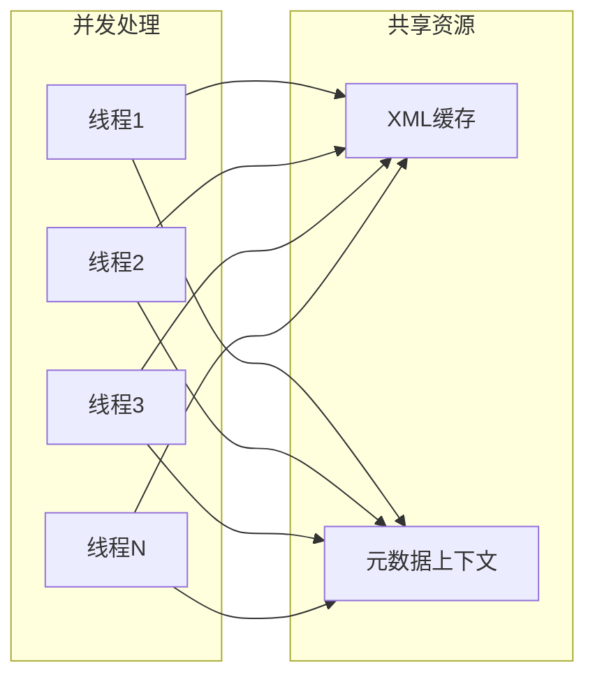

**图表来源**
- [MetadataExtractor.cs:299-311](file://Views/MetadataExtractor.cs#L299-L311)

### 性能优化建议

1. **合理设置批处理大小**：根据系统内存情况调整批处理大小
2. **启用缓存机制**：复用XML解析结果和数据库查询结果
3. **异步处理**：利用异步编程模型提高响应性
4. **资源释放**：及时释放不再使用的资源

**章节来源**
- [MetadataExtractor.cs:299-311](file://Views/MetadataExtractor.cs#L299-L311)

## 故障排除指南

### 常见问题及解决方案

#### XML解析错误

**问题描述**：XML格式不正确导致解析失败

**解决方案**：
1. 验证XML格式的正确性
2. 检查XML编码格式
3. 确保XML声明的完整性

#### 字段继承冲突

**问题描述**：继承链中出现字段定义冲突

**解决方案**：
1. 检查Action属性的设置
2. 验证OID的唯一性
3. 确认字段覆盖逻辑的正确性

#### 内存不足错误

**问题描述**：处理大量数据时出现内存不足

**解决方案**：
1. 减少批处理大小
2. 增加系统内存
3. 优化数据结构设计

### 调试技巧

#### 日志记录

系统提供了详细的日志记录功能，便于问题诊断：

```csharp
// 示例：日志记录
Console.Error.WriteLine($"正在加载元数据上下文...");
Console.Error.WriteLine($"已加载 {_allObjects.Count} 个对象");
```

#### 性能监控

通过监控关键指标来评估系统性能：

- **处理时间**：单个FID的处理时间
- **内存使用**：当前内存使用情况
- **字段数量**：提取的字段总数

**章节来源**
- [MetadataQueryService.cs:31-36](file://K3CloudDataDictionary.Cli/Services/MetadataQueryService.cs#L31-L36)

## 结论

字段提取器ExtractFields是K3Cloud数据字典系统的核心组件，通过精心设计的算法和架构，实现了高效、可靠的字段信息提取功能。系统不仅支持复杂的字段继承链处理，还提供了完善的字段合并策略和验证机制。

该组件的设计充分考虑了企业级应用的需求，具备良好的扩展性、性能和稳定性。通过合理的内存管理和并发处理策略，系统能够在处理大量元数据时保持高效的性能表现。

未来的发展方向包括进一步优化内存使用、增强错误处理能力和提供更多的配置选项，以满足不同规模和复杂度的应用场景需求。