# 实体提取器

<cite>
**本文档引用的文件**
- [ExtractEntities.cs](file://Views/ExtractEntities.cs)
- [MetadataExtractor.cs](file://Views/MetadataExtractor.cs)
- [ExtractFields.cs](file://Views/ExtractFields.cs)
- [ExtractSplits.cs](file://Views/ExtractSplits.cs)
- [MetadataDbHelper.cs](file://Views/MetadataDbHelper.cs)
- [MetadataSqliteWriter.cs](file://Views/MetadataSqliteWriter.cs)
- [EntityServiceRuleInfo.cs](file://Views/EntityServiceRuleInfo.cs)
- [FormOperationInfo.cs](file://Views/FormOperationInfo.cs)
- [PluginInfo.cs](file://Views/PluginInfo.cs)
- [FormEntityInfo.cs](file://Models/FormEntityInfo.cs)
- [FieldInfo.cs](file://Models/FieldInfo.cs)
- [PluginDisplayItem.cs](file://Models/PluginDisplayItem.cs)
</cite>

## 目录
1. [简介](#简介)
2. [项目结构](#项目结构)
3. [核心组件](#核心组件)
4. [架构概览](#架构概览)
5. [详细组件分析](#详细组件分析)
6. [依赖分析](#依赖分析)
7. [性能考虑](#性能考虑)
8. [故障排除指南](#故障排除指南)
9. [结论](#结论)
10. [附录](#附录)

## 简介
本文档详细介绍实体提取器ExtractEntities的综合技术文档，涵盖实体提取的核心算法和实现机制。该系统负责从K3 Cloud的XML元数据中提取实体信息、字段信息、插件信息和表单操作信息，并实现复杂的继承关系处理、实体合并策略和验证规则。系统采用分层架构设计，支持高性能的批处理提取和内存优化的数据合并策略。

## 项目结构
项目采用清晰的分层架构，主要包含以下模块：

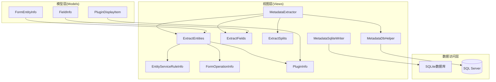

**图表来源**
- [ExtractEntities.cs:47-292](file://Views/ExtractEntities.cs#L47-L292)
- [MetadataExtractor.cs:289-397](file://Views/MetadataExtractor.cs#L289-L397)
- [MetadataDbHelper.cs:36-131](file://Views/MetadataDbHelper.cs#L36-L131)

**章节来源**
- [ExtractEntities.cs:1-293](file://Views/ExtractEntities.cs#L1-L293)
- [MetadataExtractor.cs:1-880](file://Views/MetadataExtractor.cs#L1-L880)

## 核心组件
实体提取器系统包含多个核心组件，每个组件负责特定的提取和处理功能：

### 实体提取器 ExtractEntities
这是系统的核心组件，专门负责从XML中提取实体相关信息。它实现了以下关键功能：
- XML实体解析和信息提取
- 实体服务规则的深度解析
- 插件信息提取（表单插件、列表插件、Web表单构建插件）
- 表单操作信息提取和验证规则处理

### 元数据提取器 MetadataExtractor
负责协调整个元数据提取流程，实现复杂的继承链合并和扩展链处理：
- 处理对象继承关系（从基础对象到扩展对象的完整链路）
- 实现多层级继承的合并策略
- 管理批处理提取流程
- 实现线程安全的数据合并机制

### 字段提取器 ExtractFields
专门处理字段元数据的提取和解析，支持复杂的状态项和更新动作信息提取。

### 分割表提取器 ExtractSplits
负责从XML中提取分割表信息，支持实体键和后缀的匹配机制。

**章节来源**
- [ExtractEntities.cs:47-292](file://Views/ExtractEntities.cs#L47-L292)
- [MetadataExtractor.cs:289-397](file://Views/MetadataExtractor.cs#L289-L397)
- [ExtractFields.cs:70-167](file://Views/ExtractFields.cs#L70-L167)
- [ExtractSplits.cs:28-60](file://Views/ExtractSplits.cs#L28-L60)

## 架构概览
系统采用分层架构设计，实现了高度模块化的组件分离：

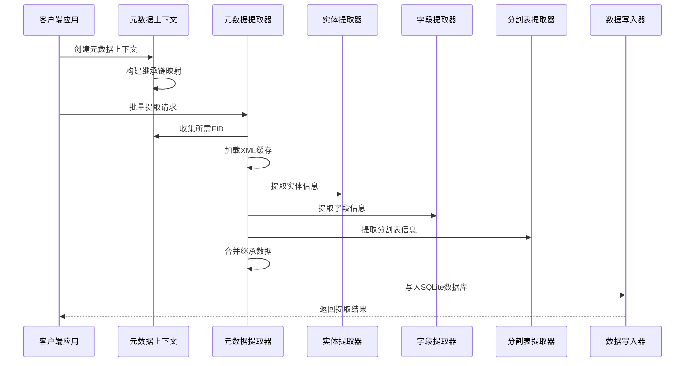

**图表来源**
- [MetadataExtractor.cs:299-360](file://Views/MetadataExtractor.cs#L299-L360)
- [MetadataDbHelper.cs:87-127](file://Views/MetadataDbHelper.cs#L87-L127)

## 详细组件分析

### 实体提取器 ExtractEntities 详细分析

#### 核心数据结构
实体提取器定义了多个关键的数据传输对象：

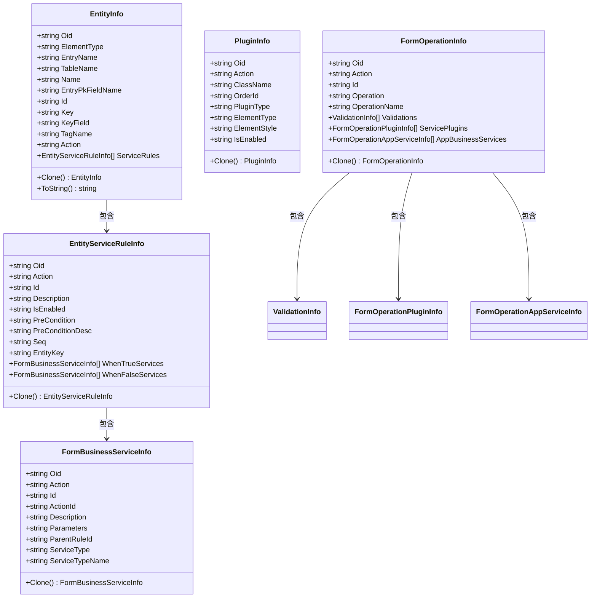

**图表来源**
- [ExtractEntities.cs:7-45](file://Views/ExtractEntities.cs#L7-L45)
- [EntityServiceRuleInfo.cs:5-67](file://Views/EntityServiceRuleInfo.cs#L5-L67)
- [FormOperationInfo.cs:9-120](file://Views/FormOperationInfo.cs#L9-L120)
- [PluginInfo.cs:3-30](file://Views/PluginInfo.cs#L3-L30)

#### XML实体解析算法
实体提取器采用基于LINQ to XML的解析策略，实现了高效的XML树遍历和数据提取：

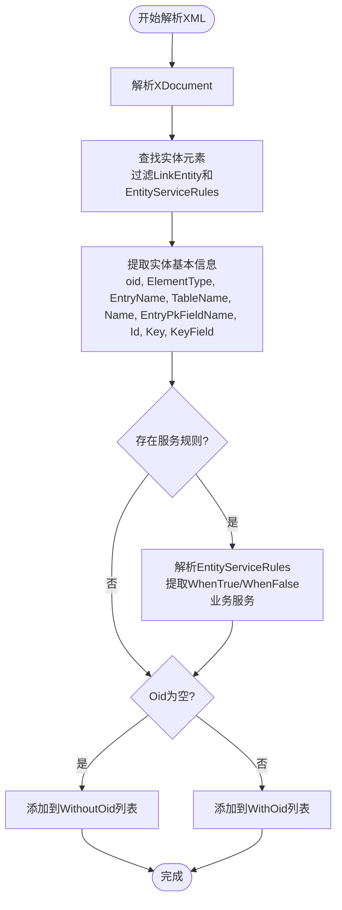

**图表来源**
- [ExtractEntities.cs:49-139](file://Views/ExtractEntities.cs#L49-L139)

#### 插件信息提取机制
系统支持三种类型的插件提取，每种插件都有特定的容器结构：

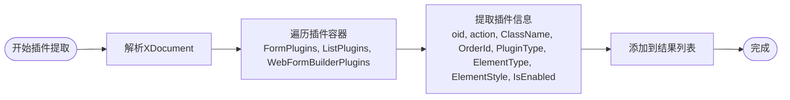

**图表来源**
- [ExtractEntities.cs:144-177](file://Views/ExtractEntities.cs#L144-L177)

#### 表单操作提取算法
表单操作提取是最复杂的部分，需要处理多层次的嵌套结构：

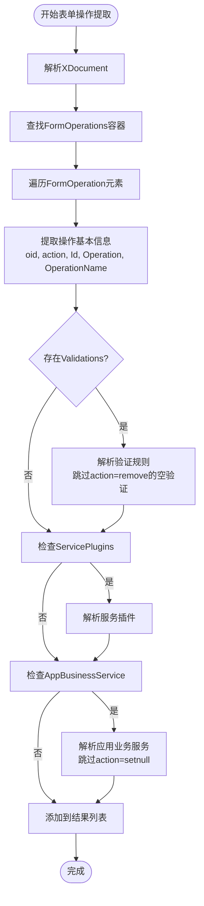

**图表来源**
- [ExtractEntities.cs:182-274](file://Views/ExtractEntities.cs#L182-L274)

**章节来源**
- [ExtractEntities.cs:47-292](file://Views/ExtractEntities.cs#L47-L292)

### 元数据提取器 MetadataExtractor 详细分析

#### 继承链构建机制
元数据提取器实现了复杂的继承链构建和处理机制：

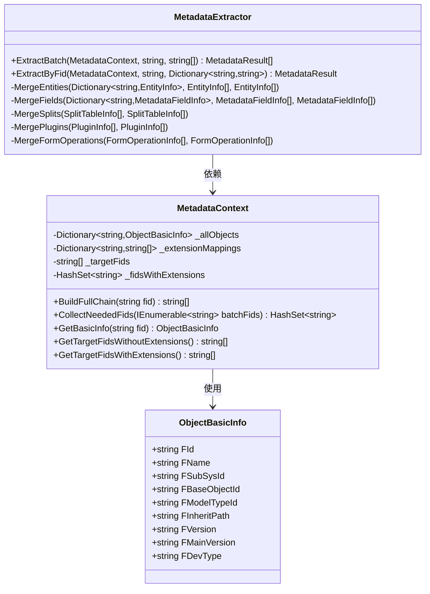

**图表来源**
- [MetadataExtractor.cs:102-284](file://Views/MetadataExtractor.cs#L102-L284)
- [MetadataDbHelper.cs:11-31](file://Views/MetadataDbHelper.cs#L11-L31)

#### 数据合并策略
系统实现了多种数据合并策略，确保继承链中的数据正确合并：

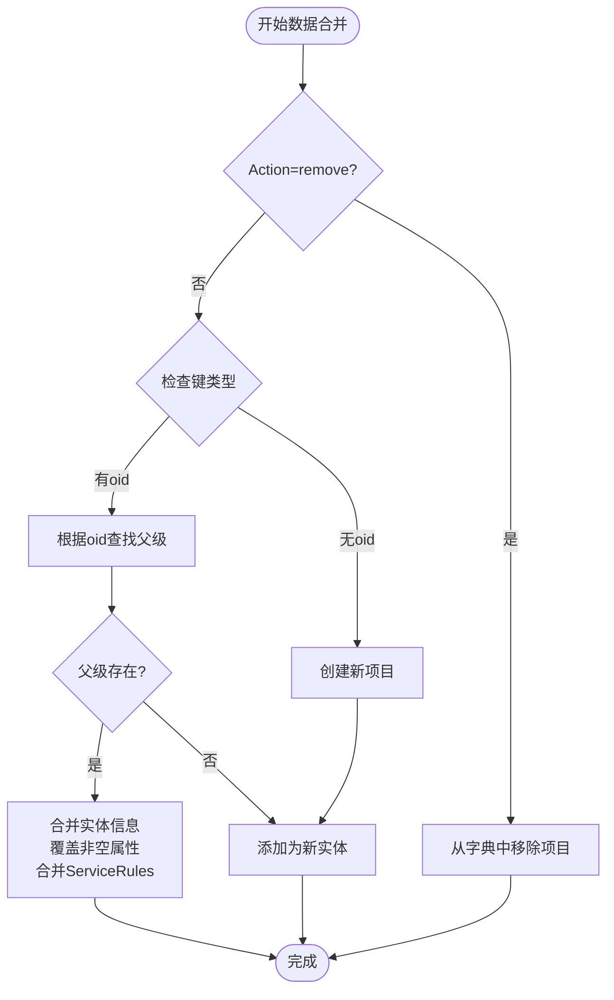

**图表来源**
- [MetadataExtractor.cs:616-648](file://Views/MetadataExtractor.cs#L616-L648)

#### 线程安全设计
元数据提取器采用了线程安全的设计模式：

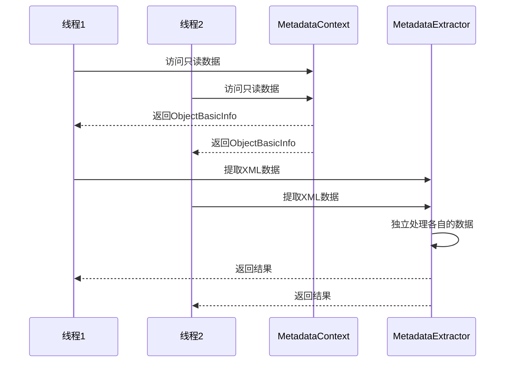

**图表来源**
- [MetadataExtractor.cs:299-360](file://Views/MetadataExtractor.cs#L299-L360)

**章节来源**
- [MetadataExtractor.cs:289-880](file://Views/MetadataExtractor.cs#L289-L880)
- [MetadataDbHelper.cs:36-131](file://Views/MetadataDbHelper.cs#L36-L131)

### 字段提取器 ExtractFields 详细分析

#### 字段状态项处理
字段提取器支持复杂的状态项处理机制：

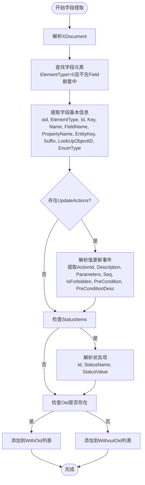

**图表来源**
- [ExtractFields.cs:83-164](file://Views/ExtractFields.cs#L83-L164)

**章节来源**
- [ExtractFields.cs:70-167](file://Views/ExtractFields.cs#L70-L167)

### 数据写入器 MetadataSqliteWriter 详细分析

#### 数据库表结构设计
数据写入器实现了完整的数据库表结构设计，支持复杂的关系映射：

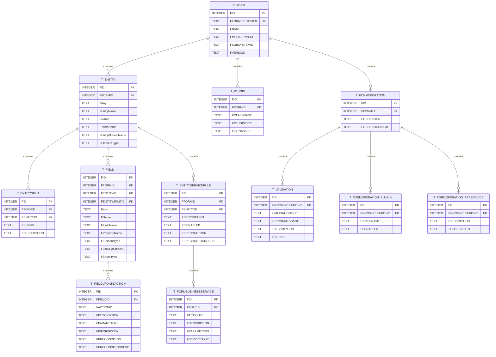

**图表来源**
- [MetadataSqliteWriter.cs:103-283](file://Views/MetadataSqliteWriter.cs#L103-L283)

**章节来源**
- [MetadataSqliteWriter.cs:9-846](file://Views/MetadataSqliteWriter.cs#L9-L846)

## 依赖分析

### 组件间依赖关系
系统中的组件依赖关系如下：

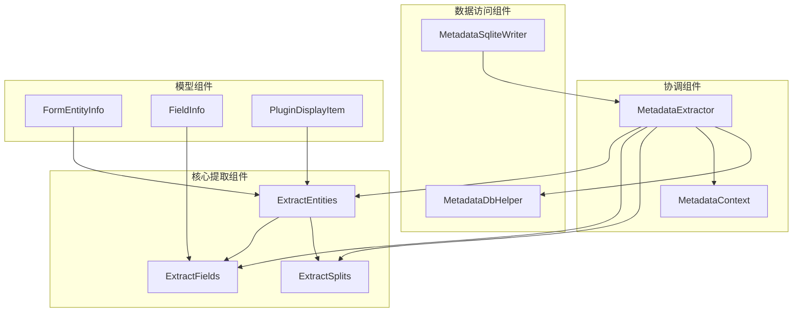

**图表来源**
- [ExtractEntities.cs:47-292](file://Views/ExtractEntities.cs#L47-L292)
- [MetadataExtractor.cs:289-397](file://Views/MetadataExtractor.cs#L289-L397)
- [MetadataDbHelper.cs:36-131](file://Views/MetadataDbHelper.cs#L36-L131)

### 外部依赖
系统主要依赖以下外部组件：
- **System.Xml.Linq**: LINQ to XML查询和解析
- **System.Data.SQLite**: SQLite数据库操作
- **System.Data.SqlClient**: SQL Server数据库连接
- **System.ComponentModel**: 数据绑定支持

**章节来源**
- [ExtractEntities.cs:1-5](file://Views/ExtractEntities.cs#L1-L5)
- [MetadataExtractor.cs:1-6](file://Views/MetadataExtractor.cs#L1-L6)

## 性能考虑

### 内存管理策略
系统采用了多种内存管理优化策略：

1. **延迟加载**: 元数据上下文仅加载基础信息，XML数据按需加载
2. **字典缓存**: 使用字典进行快速查找和去重
3. **流式处理**: 大型XML文档采用流式解析减少内存占用
4. **对象池**: 频繁创建的对象使用Clone()方法避免重复分配

### 批处理优化
系统实现了高效的批处理机制：

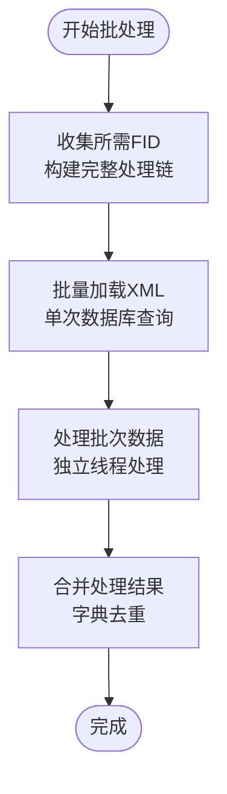

**图表来源**
- [MetadataExtractor.cs:299-311](file://Views/MetadataExtractor.cs#L299-L311)

### 并发处理
系统支持多线程并发处理：
- **MetadataContext**: 线程安全的只读数据访问
- **独立XML处理**: 每个线程独立处理XML数据
- **事务隔离**: SQLite写入使用事务确保数据一致性

## 故障排除指南

### 常见问题及解决方案

#### XML解析错误
**问题**: XML格式不正确导致解析失败
**解决方案**: 
- 检查XML编码格式
- 验证XML结构完整性
- 使用异常处理捕获解析错误

#### 继承链合并冲突
**问题**: 继承链中的数据合并产生冲突
**解决方案**:
- 检查Action属性值（remove/edit）
- 验证oid和Id的唯一性
- 确认继承关系的正确性

#### 数据库连接问题
**问题**: SQLite或SQL Server连接失败
**解决方案**:
- 验证连接字符串配置
- 检查数据库文件权限
- 确认网络连接状态

**章节来源**
- [MetadataExtractor.cs:322-359](file://Views/MetadataExtractor.cs#L322-L359)
- [MetadataSqliteWriter.cs:39-50](file://Views/MetadataSqliteWriter.cs#L39-L50)

## 结论
实体提取器ExtractEntities是一个功能强大、设计精良的元数据提取系统。它成功实现了以下关键特性：

1. **全面的XML解析能力**: 支持复杂的XML结构解析和数据提取
2. **智能的继承关系处理**: 实现了多层级继承链的正确合并
3. **高效的性能优化**: 采用批处理、缓存和并发处理提升性能
4. **健壮的错误处理**: 提供完善的异常处理和故障恢复机制
5. **灵活的扩展性**: 支持自定义提取规则和扩展信息

该系统为K3 Cloud的元数据管理提供了坚实的技术基础，能够高效处理大规模的元数据提取和管理需求。

## 附录

### 使用示例
以下是一些常见的使用场景和示例：

#### 自定义实体提取规则
```csharp
// 示例：自定义实体过滤规则
var customFilter = new Func<XElement, bool>(element =>
    element.Name.LocalName.EndsWith("Entity") &&
    element.Attribute("ElementType")?.Value != "0" &&
    !element.Name.LocalName.Equals("LinkEntity"));
```

#### 扩展实体信息
```csharp
// 示例：添加自定义实体属性
public class ExtendedEntityInfo : EntityInfo
{
    public string CustomProperty { get; set; }
    public DateTime CreatedTime { get; set; }
}
```

#### 错误处理最佳实践
```csharp
try
{
    var result = ExtractEntities.ExtractFromXml(xmlContent);
}
catch (Exception ex)
{
    // 记录详细的错误信息
    Logger.LogError($"XML解析失败: {ex.Message}");
    throw;
}
```