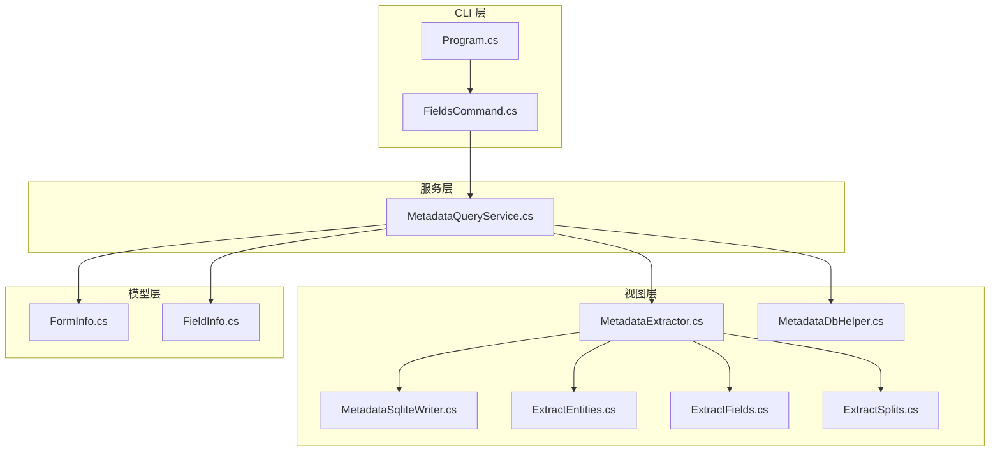
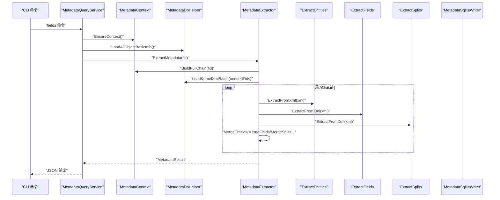
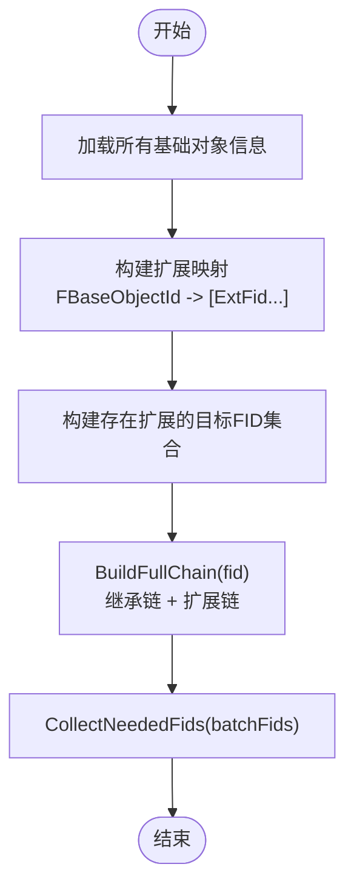
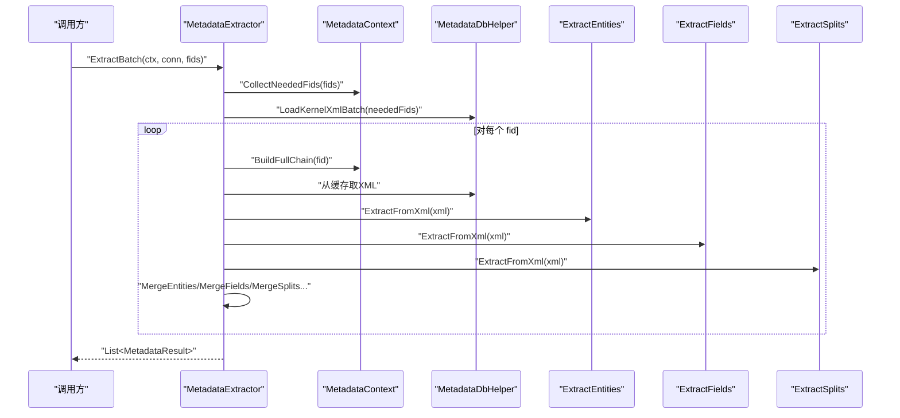
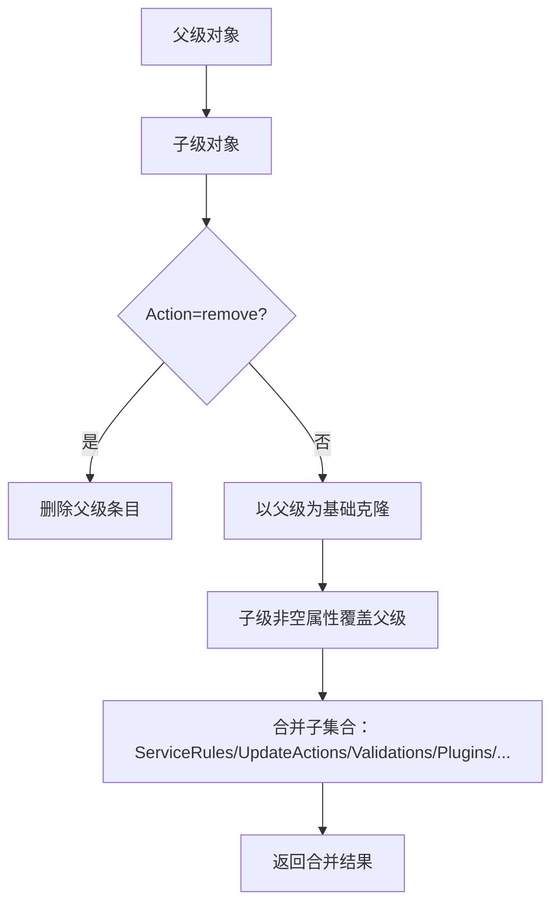
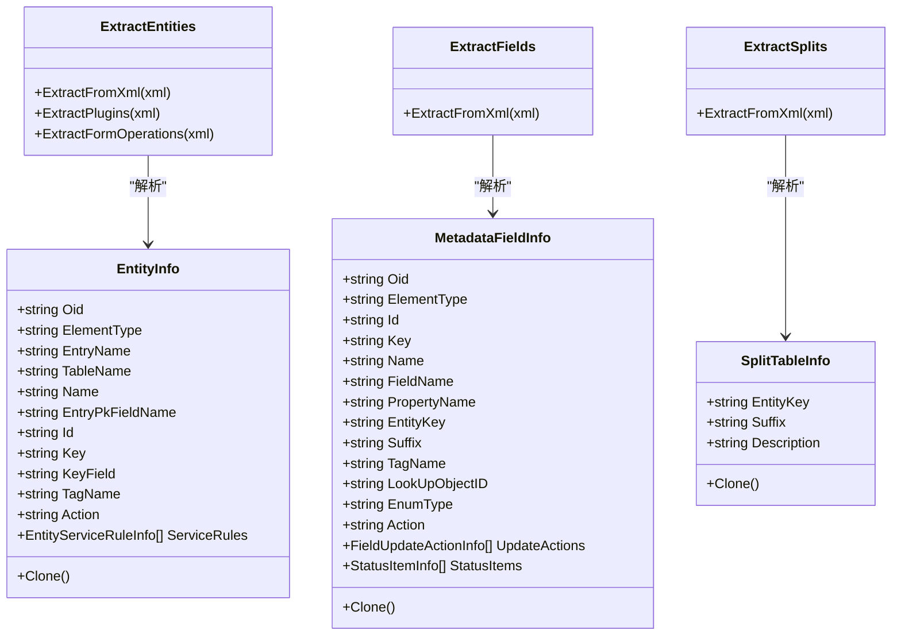
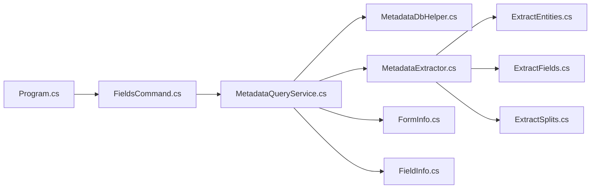

# 核心提取器

<cite>
**本文引用的文件**
- [MetadataExtractor.cs](file://Views/MetadataExtractor.cs)
- [MetadataDbHelper.cs](file://Views/MetadataDbHelper.cs)
- [MetadataSqliteWriter.cs](file://Views/MetadataSqliteWriter.cs)
- [MetadataQueryService.cs](file://K3CloudDataDictionary.Cli/Services/MetadataQueryService.cs)
- [ExtractEntities.cs](file://Views/ExtractEntities.cs)
- [ExtractFields.cs](file://Views/ExtractFields.cs)
- [ExtractSplits.cs](file://Views/ExtractSplits.cs)
- [Program.cs](file://K3CloudDataDictionary.Cli/Program.cs)
- [FieldsCommand.cs](file://K3CloudDataDictionary.Cli/Commands/FieldsCommand.cs)
</cite>

## 目录
1. [简介](#简介)
2. [项目结构](#项目结构)
3. [核心组件](#核心组件)
4. [架构总览](#架构总览)
5. [详细组件分析](#详细组件分析)
6. [依赖关系分析](#依赖关系分析)
7. [性能考量](#性能考量)
8. [故障排查指南](#故障排查指南)
9. [结论](#结论)
10. [附录](#附录)

## 简介
本文档围绕核心提取器 MetadataExtractor 的设计与实现展开，系统性阐述其继承链合并机制、扩展链递归合并策略、XML 缓存管理、线程安全设计、内存优化策略与性能考量，并提供使用示例与错误处理建议。读者可据此快速掌握如何基于该提取器进行元数据提取与输出。

## 项目结构
本项目采用“视图层 + 模型层 + CLI 命令层”的分层组织方式：
- 视图层（Views）：包含元数据提取、XML 解析、SQLite 写入等核心功能模块
- 模型层（Models）：提供 UI 绑定的领域模型
- CLI 层（K3CloudDataDictionary.Cli）：提供命令行接口，调用查询服务与提取器

图表来源
- [Program.cs:1-166](file://K3CloudDataDictionary.Cli/Program.cs#L1-L166)
- [FieldsCommand.cs:1-88](file://K3CloudDataDictionary.Cli/Commands/FieldsCommand.cs#L1-L88)
- [MetadataQueryService.cs:1-839](file://K3CloudDataDictionary.Cli/Services/MetadataQueryService.cs#L1-L839)
- [MetadataExtractor.cs:1-880](file://Views/MetadataExtractor.cs#L1-L880)
- [MetadataDbHelper.cs:1-131](file://Views/MetadataDbHelper.cs#L1-L131)
- [MetadataSqliteWriter.cs:1-846](file://Views/MetadataSqliteWriter.cs#L1-L846)
- [ExtractEntities.cs:1-293](file://Views/ExtractEntities.cs#L1-L293)
- [ExtractFields.cs:1-167](file://Views/ExtractFields.cs#L1-L167)
- [ExtractSplits.cs:1-60](file://Views/ExtractSplits.cs#L1-L60)
- [FormInfo.cs:1-101](file://Models/FormInfo.cs#L1-L101)
- [FieldInfo.cs:1-110](file://Models/FieldInfo.cs#L1-L110)

章节来源
- [Program.cs:1-166](file://K3CloudDataDictionary.Cli/Program.cs#L1-L166)
- [FieldsCommand.cs:1-88](file://K3CloudDataDictionary.Cli/Commands/FieldsCommand.cs#L1-L88)
- [MetadataQueryService.cs:1-839](file://K3CloudDataDictionary.Cli/Services/MetadataQueryService.cs#L1-L839)

## 核心组件
- MetadataContext：一次性加载基础对象信息，构建继承链与扩展链映射，提供线程安全的只读访问与链路生成能力
- MetadataExtractor：静态工具类，负责批量提取与单个 FID 提取，执行继承链与扩展链的逐层合并
- MetadataDbHelper：数据库访问工具，负责一次性加载所有基础信息与批量加载内核 XML
- ExtractEntities/ExtractFields/ExtractSplits：XML 解析器，分别提取实体、字段、拆分表信息
- MetadataSqliteWriter：SQLite 写入器，负责将提取结果持久化到本地数据库
- MetadataQueryService：CLI 查询服务，封装实时查询与统计逻辑，内部复用提取器能力

章节来源
- [MetadataExtractor.cs:102-284](file://Views/MetadataExtractor.cs#L102-L284)
- [MetadataExtractor.cs:289-360](file://Views/MetadataExtractor.cs#L289-L360)
- [MetadataDbHelper.cs:36-131](file://Views/MetadataDbHelper.cs#L36-L131)
- [ExtractEntities.cs:47-293](file://Views/ExtractEntities.cs#L47-L293)
- [ExtractFields.cs:70-167](file://Views/ExtractFields.cs#L70-L167)
- [ExtractSplits.cs:28-60](file://Views/ExtractSplits.cs#L28-L60)
- [MetadataSqliteWriter.cs:9-846](file://Views/MetadataSqliteWriter.cs#L9-L846)
- [MetadataQueryService.cs:12-839](file://K3CloudDataDictionary.Cli/Services/MetadataQueryService.cs#L12-L839)

## 架构总览
下图展示了从 CLI 到数据库、再到提取器与解析器的整体流程，以及关键对象之间的交互关系。

图表来源
- [FieldsCommand.cs:1-88](file://K3CloudDataDictionary.Cli/Commands/FieldsCommand.cs#L1-L88)
- [MetadataQueryService.cs:169-230](file://K3CloudDataDictionary.Cli/Services/MetadataQueryService.cs#L169-L230)
- [MetadataExtractor.cs:299-360](file://Views/MetadataExtractor.cs#L299-L360)
- [MetadataDbHelper.cs:87-127](file://Views/MetadataDbHelper.cs#L87-L127)
- [ExtractEntities.cs:49-139](file://Views/ExtractEntities.cs#L49-L139)
- [ExtractFields.cs:72-164](file://Views/ExtractFields.cs#L72-L164)
- [ExtractSplits.cs:30-56](file://Views/ExtractSplits.cs#L30-L56)

## 详细组件分析

### MetadataContext：继承链与扩展链构建
- 作用：一次性加载所有基础对象信息，构建扩展映射与目标 FID 列表；提供 BuildFullChain 生成完整处理链
- 关键点：
  - 仅加载基础信息（不含 XML），避免重复 IO
  - BuildExtensionMappings：将扩展对象（FDEVTYPE=2）映射到其基础对象（FBASEOBJECTID）
  - BuildFidsWithExtensions：从扩展对象的继承路径中提取根 FID，标记需要扩展链合并的目标
  - BuildFullChain：解析继承路径，反转后追加每层节点的扩展 FID，保证处理顺序
  - CollectNeededFids：收集批处理所需的全部 FID，去重后供批量 XML 加载

图表来源
- [MetadataExtractor.cs:102-284](file://Views/MetadataExtractor.cs#L102-L284)

章节来源
- [MetadataExtractor.cs:102-284](file://Views/MetadataExtractor.cs#L102-L284)

### MetadataExtractor：批量提取与单个提取
- ExtractBatch：
  - 输入：MetadataContext、连接串、批处理 FID 列表
  - 步骤：CollectNeededFids → LoadKernelXmlBatch → 逐个 ExtractByFid → 返回结果列表
  - 特点：每线程独立加载 XML，互不干扰；XML 在方法返回后交由 GC 回收
- ExtractByFid：
  - 输入：MetadataContext、单个 FID、XML 缓存
  - 步骤：获取基础信息 → BuildFullChain → 逐层提取实体/字段/拆分表/插件/表单操作 → 合并 → 构建结果
  - 特点：线程安全，上下文只读，xmlCache 为线程局部变量

图表来源
- [MetadataExtractor.cs:299-360](file://Views/MetadataExtractor.cs#L299-L360)
- [MetadataExtractor.cs:322-360](file://Views/MetadataExtractor.cs#L322-L360)
- [MetadataDbHelper.cs:87-127](file://Views/MetadataDbHelper.cs#L87-L127)
- [ExtractEntities.cs:49-139](file://Views/ExtractEntities.cs#L49-L139)
- [ExtractFields.cs:72-164](file://Views/ExtractFields.cs#L72-L164)
- [ExtractSplits.cs:30-56](file://Views/ExtractSplits.cs#L30-L56)

章节来源
- [MetadataExtractor.cs:299-360](file://Views/MetadataExtractor.cs#L299-L360)
- [MetadataExtractor.cs:322-360](file://Views/MetadataExtractor.cs#L322-L360)

### 继承链合并与扩展链递归合并
- 继承链合并：
  - 以父级为基础，子级非空属性覆盖父级对应属性
  - 实体 ServiceRules 与字段 UpdateActions 分别按 Id/Oid 匹配，支持 remove/edit 操作
- 扩展链递归合并：
  - 从根对象出发，递归追加扩展对象（oid 优先匹配），确保扩展层级完整
  - 插件、表单操作、验证、业务服务等均按继承键（oid 优先，否则 Id/ClassName）匹配

图表来源
- [MetadataExtractor.cs:695-718](file://Views/MetadataExtractor.cs#L695-L718)
- [MetadataExtractor.cs:825-845](file://Views/MetadataExtractor.cs#L825-L845)
- [MetadataExtractor.cs:726-759](file://Views/MetadataExtractor.cs#L726-L759)
- [MetadataExtractor.cs:850-877](file://Views/MetadataExtractor.cs#L850-L877)

章节来源
- [MetadataExtractor.cs:616-648](file://Views/MetadataExtractor.cs#L616-L648)
- [MetadataExtractor.cs:658-690](file://Views/MetadataExtractor.cs#L658-L690)
- [MetadataExtractor.cs:726-759](file://Views/MetadataExtractor.cs#L726-L759)
- [MetadataExtractor.cs:850-877](file://Views/MetadataExtractor.cs#L850-L877)

### XML 缓存管理
- 一次性批量加载：LoadKernelXmlBatch 通过参数化 IN 子句一次性查询多个 FID 的 XML，减少往返开销
- 线程局部缓存：ExtractBatch 为每个线程构建独立 xmlCache，避免并发冲突
- 生命周期：方法返回后 XML 字符串进入 GC 回收，降低内存峰值

章节来源
- [MetadataDbHelper.cs:87-127](file://Views/MetadataDbHelper.cs#L87-L127)
- [MetadataExtractor.cs:299-311](file://Views/MetadataExtractor.cs#L299-L311)

### 线程安全设计
- MetadataContext 为只读结构：所有字段均为私有只读，BuildFullChain 使用临时集合，不修改共享状态
- ExtractBatch 为静态方法：输入参数为不可变对象，xmlCache 为线程局部变量
- 合并过程使用字典与列表的本地副本，避免跨线程共享可变状态

章节来源
- [MetadataExtractor.cs:102-181](file://Views/MetadataExtractor.cs#L102-L181)
- [MetadataExtractor.cs:299-311](file://Views/MetadataExtractor.cs#L299-L311)

### 内存优化策略
- 延迟加载：仅加载基础信息，XML 由外部按需批量加载
- 去重收集：CollectNeededFids 对批处理涉及的 FID 去重，减少重复加载
- 逐层合并：按继承链顺序合并，避免大对象复制与深拷贝
- 短生命周期：XML 字符串在方法返回后立即释放，降低峰值内存占用

章节来源
- [MetadataExtractor.cs:188-199](file://Views/MetadataExtractor.cs#L188-L199)
- [MetadataExtractor.cs:299-311](file://Views/MetadataExtractor.cs#L299-L311)

### 数据模型与解析器
- 实体解析（ExtractEntities）：提取实体、服务规则、插件、表单操作及其子集合
- 字段解析（ExtractFields）：提取字段、值更新事件、状态项
- 拆分表解析（ExtractSplits）：提取实体拆分表描述

图表来源
- [ExtractEntities.cs:7-45](file://Views/ExtractEntities.cs#L7-L45)
- [ExtractFields.cs:7-51](file://Views/ExtractFields.cs#L7-L51)
- [ExtractSplits.cs:6-26](file://Views/ExtractSplits.cs#L6-L26)
- [ExtractEntities.cs:49-139](file://Views/ExtractEntities.cs#L49-L139)
- [ExtractFields.cs:72-164](file://Views/ExtractFields.cs#L72-L164)
- [ExtractSplits.cs:30-56](file://Views/ExtractSplits.cs#L30-L56)

章节来源
- [ExtractEntities.cs:47-293](file://Views/ExtractEntities.cs#L47-L293)
- [ExtractFields.cs:70-167](file://Views/ExtractFields.cs#L70-L167)
- [ExtractSplits.cs:28-60](file://Views/ExtractSplits.cs#L28-L60)

### SQLite 写入与数据持久化
- MetadataSqliteWriter：负责创建表结构、写入提取结果、维护自增 ID 计数器、支持增量更新与删除
- 写入流程：按实体/字段/拆分表/服务规则/插件/表单操作等维度依次插入，建立外键关联

章节来源
- [MetadataSqliteWriter.cs:9-846](file://Views/MetadataSqliteWriter.cs#L9-L846)

## 依赖关系分析
- MetadataExtractor 依赖 MetadataContext（只读）、MetadataDbHelper（批量 XML 加载）、各 Extract* 解析器
- MetadataQueryService 依赖 MetadataContext 与 MetadataExtractor，用于 CLI 查询场景
- CLI 命令通过 Program 解析连接串，调用命令处理器

图表来源
- [Program.cs:1-166](file://K3CloudDataDictionary.Cli/Program.cs#L1-L166)
- [FieldsCommand.cs:1-88](file://K3CloudDataDictionary.Cli/Commands/FieldsCommand.cs#L1-L88)
- [MetadataQueryService.cs:1-839](file://K3CloudDataDictionary.Cli/Services/MetadataQueryService.cs#L1-L839)
- [MetadataExtractor.cs:1-880](file://Views/MetadataExtractor.cs#L1-L880)
- [MetadataDbHelper.cs:1-131](file://Views/MetadataDbHelper.cs#L1-L131)
- [ExtractEntities.cs:1-293](file://Views/ExtractEntities.cs#L1-L293)
- [ExtractFields.cs:1-167](file://Views/ExtractFields.cs#L1-L167)
- [ExtractSplits.cs:1-60](file://Views/ExtractSplits.cs#L1-L60)
- [FormInfo.cs:1-101](file://Models/FormInfo.cs#L1-L101)
- [FieldInfo.cs:1-110](file://Models/FieldInfo.cs#L1-L110)

章节来源
- [Program.cs:1-166](file://K3CloudDataDictionary.Cli/Program.cs#L1-L166)
- [FieldsCommand.cs:1-88](file://K3CloudDataDictionary.Cli/Commands/FieldsCommand.cs#L1-L88)
- [MetadataQueryService.cs:1-839](file://K3CloudDataDictionary.Cli/Services/MetadataQueryService.cs#L1-L839)

## 性能考量
- 批量加载：LoadKernelXmlBatch 使用参数化 IN 子句，减少网络往返与编译开销
- 去重收集：CollectNeededFids 避免重复加载相同 FID 的 XML
- 逐层合并：按继承链顺序合并，避免大规模对象复制
- 线程局部缓存：每线程独立 xmlCache，避免锁竞争
- 内存回收：方法返回后 XML 字符串进入 GC，降低峰值内存

章节来源
- [MetadataDbHelper.cs:87-127](file://Views/MetadataDbHelper.cs#L87-L127)
- [MetadataExtractor.cs:188-199](file://Views/MetadataExtractor.cs#L188-L199)
- [MetadataExtractor.cs:299-311](file://Views/MetadataExtractor.cs#L299-L311)

## 故障排查指南
- 基础信息缺失：若 BuildFullChain 返回空链，检查 FID 是否存在于基础信息中
- XML 加载失败：确认连接串正确，LoadKernelXmlBatch 返回的字典应包含所需 FID
- 合并异常：检查 action=remove 的标签是否正确传递，确保继承键（oid/Id/ClassName）匹配
- 写入异常：确认 SQLite 数据库路径有效，表结构已创建或设置为重建模式

章节来源
- [MetadataExtractor.cs:322-360](file://Views/MetadataExtractor.cs#L322-L360)
- [MetadataDbHelper.cs:87-127](file://Views/MetadataDbHelper.cs#L87-L127)
- [MetadataSqliteWriter.cs:27-50](file://Views/MetadataSqliteWriter.cs#L27-L50)

## 结论
MetadataExtractor 通过“上下文只读 + 批量 XML 缓存 + 逐层合并”的设计，在保证线程安全的同时实现了高性能的元数据提取。其继承链与扩展链合并策略清晰、可维护性强，适合在大型系统中进行元数据采集与持久化。

## 附录

### 使用示例（基于 CLI）
以下示例展示如何通过 CLI 查询字段信息，内部会调用 MetadataQueryService 并复用提取器能力。

- 基本字段查询
  - k3cli fields --form <identifier>
- 指定实体与关键词
  - k3cli fields --form <identifier> --entity <key> --keyword <term>
- 精确匹配
  - k3cli fields --form <identifier> --exact

章节来源
- [FieldsCommand.cs:1-88](file://K3CloudDataDictionary.Cli/Commands/FieldsCommand.cs#L1-L88)
- [Program.cs:129-151](file://K3CloudDataDictionary.Cli/Program.cs#L129-L151)

### 错误处理与异常情况
- 连接串解析失败：当未配置默认连接或指定连接不存在时抛出异常
- 查询超时：SQL 查询设置 CommandTimeout，避免长时间阻塞
- 提取异常：捕获异常并输出错误信息，不影响其他对象的处理

章节来源
- [Program.cs:129-151](file://K3CloudDataDictionary.Cli/Program.cs#L129-L151)
- [MetadataQueryService.cs:42-68](file://K3CloudDataDictionary.Cli/Services/MetadataQueryService.cs#L42-L68)
- [MetadataQueryService.cs:221-224](file://K3CloudDataDictionary.Cli/Services/MetadataQueryService.cs#L221-L224)