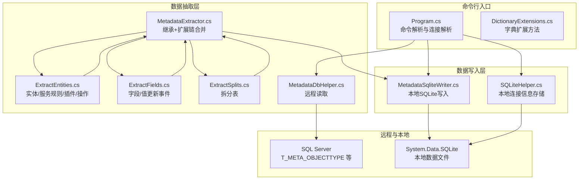
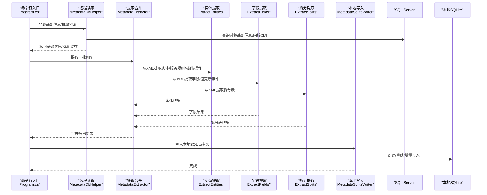
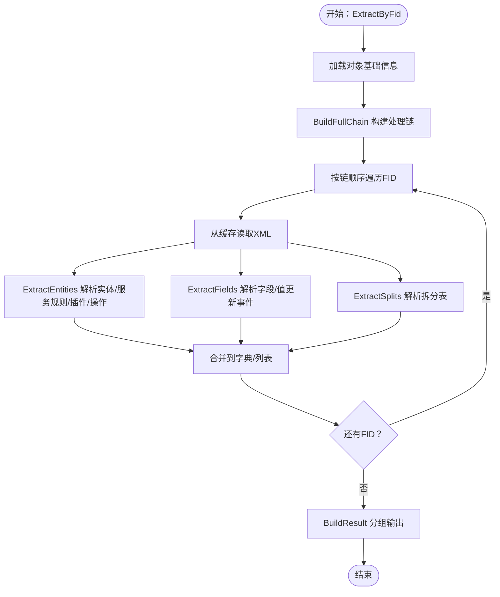
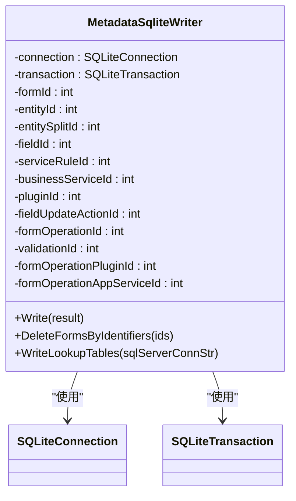
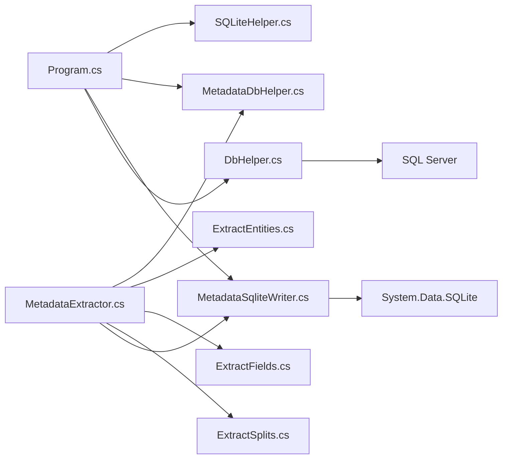

# 数据处理流程

<cite>
**本文档引用的文件**
- [MetadataExtractor.cs](file://Views/MetadataExtractor.cs)
- [MetadataSqliteWriter.cs](file://Views/MetadataSqliteWriter.cs)
- [MetadataDbHelper.cs](file://Views/MetadataDbHelper.cs)
- [ExtractEntities.cs](file://Views/ExtractEntities.cs)
- [ExtractFields.cs](file://Views/ExtractFields.cs)
- [ExtractSplits.cs](file://Views/ExtractSplits.cs)
- [DictionaryExtensions.cs](file://K3CloudDataDictionary.Cli/DictionaryExtensions.cs)
- [Program.cs](file://K3CloudDataDictionary.Cli/Program.cs)
- [SQLiteHelper.cs](file://Helpers/SQLiteHelper.cs)
- [DbHelper.cs](file://Helpers/DbHelper.cs)
- [README.md](file://README.md)
- [usage-examples.md](file://docs/usage-examples.md)
</cite>

## 目录
1. [简介](#简介)
2. [项目结构](#项目结构)
3. [核心组件](#核心组件)
4. [架构总览](#架构总览)
5. [详细组件分析](#详细组件分析)
6. [依赖关系分析](#依赖关系分析)
7. [性能考虑](#性能考虑)
8. [故障排查指南](#故障排查指南)
9. [结论](#结论)
10. [附录](#附录)

## 简介
本文件面向金蝶K3 Cloud数据字典系统，聚焦“元数据从提取到存储”的完整处理流程，系统性阐述以下主题：
- 元数据提取：基于继承链与扩展链的合并策略
- 数据库操作：远程SQL Server读取与本地SQLite写入
- 扩展方法：DictionaryExtensions在CLI中的应用
- 性能优化：批量化查询、事务写入、索引设计
- 并发控制与错误恢复：线程安全、事务回滚、连接测试
- 流程图与状态转换：端到端数据流与关键状态
- 监控与运维：连接管理、本地数据扫描与迁移

## 项目结构
项目采用分层与职责分离的组织方式：
- Views：数据抽取与写入的核心逻辑（提取器、写入器、数据库助手）
- Helpers：通用数据库与本地SQLite辅助（连接测试、SQL执行、连接信息存储）
- K3CloudDataDictionary.Cli：命令行入口与扩展方法
- Models/ViewModels/Views（UI侧）：与本文无关，略
- docs：使用示例与命令参考

图表来源
- [Program.cs:14-166](file://K3CloudDataDictionary.Cli/Program.cs#L14-L166)
- [MetadataExtractor.cs:289-360](file://Views/MetadataExtractor.cs#L289-L360)
- [ExtractEntities.cs:47-292](file://Views/ExtractEntities.cs#L47-L292)
- [ExtractFields.cs:70-167](file://Views/ExtractFields.cs#L70-L167)
- [ExtractSplits.cs:28-60](file://Views/ExtractSplits.cs#L28-L60)
- [MetadataDbHelper.cs:36-131](file://Views/MetadataDbHelper.cs#L36-L131)
- [MetadataSqliteWriter.cs:9-846](file://Views/MetadataSqliteWriter.cs#L9-L846)
- [SQLiteHelper.cs:10-370](file://Helpers/SQLiteHelper.cs#L10-L370)

章节来源
- [README.md:36-83](file://README.md#L36-L83)

## 核心组件
- 元数据提取器（MetadataExtractor）：负责构建继承链与扩展链，按顺序合并实体、字段、拆分表、插件、操作事件等
- 元数据数据库助手（MetadataDbHelper）：一次性加载基础信息，批量读取内核XML
- 元数据SQLite写入器（MetadataSqliteWriter）：本地SQLite批量写入，支持事务、增量写入与级联删除
- 实体/字段/拆分提取器：从XML中抽取实体、字段、拆分表等结构化数据
- CLI扩展方法（DictionaryExtensions）：提供线程安全的字典取值扩展
- CLI入口（Program）：命令解析、连接解析、异常统一处理
- 本地SQLite助手（SQLiteHelper）：连接信息存储、本地数据文件管理
- 远程数据库助手（DbHelper）：连接测试与通用SQL执行

章节来源
- [MetadataExtractor.cs:289-360](file://Views/MetadataExtractor.cs#L289-L360)
- [MetadataDbHelper.cs:36-131](file://Views/MetadataDbHelper.cs#L36-L131)
- [MetadataSqliteWriter.cs:9-846](file://Views/MetadataSqliteWriter.cs#L9-L846)
- [ExtractEntities.cs:47-292](file://Views/ExtractEntities.cs#L47-L292)
- [ExtractFields.cs:70-167](file://Views/ExtractFields.cs#L70-L167)
- [ExtractSplits.cs:28-60](file://Views/ExtractSplits.cs#L28-L60)
- [DictionaryExtensions.cs:8-23](file://K3CloudDataDictionary.Cli/DictionaryExtensions.cs#L8-L23)
- [Program.cs:14-166](file://K3CloudDataDictionary.Cli/Program.cs#L14-L166)
- [SQLiteHelper.cs:10-370](file://Helpers/SQLiteHelper.cs#L10-L370)
- [DbHelper.cs:7-70](file://Helpers/DbHelper.cs#L7-L70)

## 架构总览
端到端数据流从远程SQL Server读取元数据，经提取与合并后写入本地SQLite，支持增量更新与级联删除。

图表来源
- [Program.cs:14-166](file://K3CloudDataDictionary.Cli/Program.cs#L14-L166)
- [MetadataDbHelper.cs:44-127](file://Views/MetadataDbHelper.cs#L44-L127)
- [MetadataExtractor.cs:299-360](file://Views/MetadataExtractor.cs#L299-L360)
- [ExtractEntities.cs:49-292](file://Views/ExtractEntities.cs#L49-L292)
- [ExtractFields.cs:72-167](file://Views/ExtractFields.cs#L72-L167)
- [ExtractSplits.cs:30-60](file://Views/ExtractSplits.cs#L30-L60)
- [MetadataSqliteWriter.cs:560-846](file://Views/MetadataSqliteWriter.cs#L560-L846)

## 详细组件分析

### 元数据提取器（MetadataExtractor）
- 设计要点
  - MetadataContext：一次性加载基础信息，构建扩展映射与目标FID集合，线程安全、只读
  - BuildFullChain：解析继承路径，反转后追加每层扩展FID，形成处理链
  - ExtractBatch/ExtractByFid：收集所需FID→批量加载XML→逐个提取→合并结果
  - 合并策略：按oid匹配父级，action=remove删除，action=edit覆盖属性；无oid按Id/Key新增
- 关键算法
  - 继承链解析与扩展链递归追加
  - 多层级集合合并（实体、字段、拆分表、插件、操作事件及其子集合）

图表来源
- [MetadataExtractor.cs:322-360](file://Views/MetadataExtractor.cs#L322-L360)
- [MetadataExtractor.cs:158-181](file://Views/MetadataExtractor.cs#L158-L181)
- [MetadataExtractor.cs:365-397](file://Views/MetadataExtractor.cs#L365-L397)

章节来源
- [MetadataExtractor.cs:102-284](file://Views/MetadataExtractor.cs#L102-L284)
- [MetadataExtractor.cs:299-360](file://Views/MetadataExtractor.cs#L299-L360)
- [MetadataExtractor.cs:404-606](file://Views/MetadataExtractor.cs#L404-L606)

### 元数据数据库助手（MetadataDbHelper）
- 职责
  - LoadAllObjectBasicInfo：一次性加载所有对象基础信息（不含XML），用于构建继承/扩展链
  - LoadKernelXmlBatch：按FID列表批量查询内核XML，减少连接次数
- 性能特征
  - 批量参数化查询，避免多次往返
  - 仅读取FKERNELXML片段，降低传输与解析成本

章节来源
- [MetadataDbHelper.cs:44-79](file://Views/MetadataDbHelper.cs#L44-L79)
- [MetadataDbHelper.cs:87-127](file://Views/MetadataDbHelper.cs#L87-L127)

### 元数据SQLite写入器（MetadataSqliteWriter）
- 设计要点
  - 事务写入：构造函数开启事务，保证原子性
  - 表重建/增量写入：recreateTables控制全量或增量
  - ID计数器：各表独立自增ID，支持从现有最大值续写
  - 级联删除：按表依赖顺序删除，确保外键约束一致性
  - 写入流程：表单→实体→拆分表→字段→值更新事件→服务规则→业务服务→插件→操作事件→校验/插件/服务
- 表结构与索引
  - T_FORM/T_ENTITY/T_ENTITYSPLIT/T_FIELD/T_ENTITYSERVICERULE/T_FORMBUSINESSSERVICE/T_FIELDUPDATEACTION/T_FORMOPERATION/T_VALIDATION/T_FORMOPERATION_PLUGIN/T_FORMOPERATION_APPSERVICE/T_PLUGIN
  - 多处唯一/普通索引，提升查询效率

图表来源
- [MetadataSqliteWriter.cs:9-846](file://Views/MetadataSqliteWriter.cs#L9-L846)

章节来源
- [MetadataSqliteWriter.cs:27-77](file://Views/MetadataSqliteWriter.cs#L27-L77)
- [MetadataSqliteWriter.cs:560-846](file://Views/MetadataSqliteWriter.cs#L560-L846)

### 实体/字段/拆分提取器
- ExtractEntities：抽取实体、服务规则、插件、操作事件及子集合
- ExtractFields：抽取字段、值更新事件、状态项
- ExtractSplits：抽取拆分表（实体Key+后缀）

章节来源
- [ExtractEntities.cs:49-292](file://Views/ExtractEntities.cs#L49-L292)
- [ExtractFields.cs:72-167](file://Views/ExtractFields.cs#L72-L167)
- [ExtractSplits.cs:30-60](file://Views/ExtractSplits.cs#L30-L60)

### CLI扩展方法（DictionaryExtensions）
- GetValueOrDefault：线程安全地从字典取值，避免KeyNotFoundException
- 应用场景：CLI参数解析与默认值处理

章节来源
- [DictionaryExtensions.cs:13-20](file://K3CloudDataDictionary.Cli/DictionaryExtensions.cs#L13-L20)

### CLI入口（Program）
- 命令解析：fields/search/form/billtype/billstatus/assistantdata/enum/resolve/connections/help
- 连接解析：ResolveConnectionString优先使用指定连接，否则使用默认连接
- 异常处理：统一捕获并输出JSON错误

章节来源
- [Program.cs:14-166](file://K3CloudDataDictionary.Cli/Program.cs#L14-L166)

### 本地SQLite助手（SQLiteHelper）
- 连接信息存储：Connections表，DPAPI加密存储密码
- 本地数据文件管理：扫描、导入、重命名、删除
- 迁移：旧版metadata.db按连接命名迁移

章节来源
- [SQLiteHelper.cs:17-53](file://Helpers/SQLiteHelper.cs#L17-L53)
- [SQLiteHelper.cs:218-339](file://Helpers/SQLiteHelper.cs#L218-L339)
- [SQLiteHelper.cs:345-367](file://Helpers/SQLiteHelper.cs#L345-L367)

### 远程数据库助手（DbHelper）
- TestConnection：连接可用性测试
- ExecuteQuery/ExecuteScalar：通用SQL执行与结果读取

章节来源
- [DbHelper.cs:9-25](file://Helpers/DbHelper.cs#L9-L25)
- [DbHelper.cs:27-67](file://Helpers/DbHelper.cs#L27-L67)

## 依赖关系分析
- Views层内部依赖
  - MetadataExtractor依赖MetadataDbHelper、ExtractEntities、ExtractFields、ExtractSplits
  - MetadataSqliteWriter依赖SQLite
- CLI层依赖
  - Program依赖SQLiteHelper进行连接解析
  - CLI命令通过DbHelper/SQLiteHelper间接访问远程与本地资源
- 外部依赖
  - System.Data.SqlClient（远程SQL Server）
  - System.Data.SQLite（本地SQLite）

图表来源
- [Program.cs:14-166](file://K3CloudDataDictionary.Cli/Program.cs#L14-L166)
- [MetadataExtractor.cs:289-360](file://Views/MetadataExtractor.cs#L289-L360)
- [MetadataSqliteWriter.cs:9-846](file://Views/MetadataSqliteWriter.cs#L9-L846)
- [DbHelper.cs:7-70](file://Helpers/DbHelper.cs#L7-L70)
- [SQLiteHelper.cs:10-370](file://Helpers/SQLiteHelper.cs#L10-L370)

## 性能考虑
- 批量化查询
  - MetadataDbHelper.LoadKernelXmlBatch使用参数化IN子句，减少网络往返
- 事务写入
  - MetadataSqliteWriter在构造函数开启事务，批量提交，显著提升吞吐
- 索引优化
  - 写入器创建多处索引（如T_FIELD的FKEY、T_ENTITY的FTABLENAME等），加速查询
- 内存合并
  - MetadataExtractor在内存中构建字典与列表，避免重复IO
- 增量更新
  - InitIdCounters从现有最大FID续写，避免ID冲突与重复写入

章节来源
- [MetadataDbHelper.cs:87-127](file://Views/MetadataDbHelper.cs#L87-L127)
- [MetadataSqliteWriter.cs:49-77](file://Views/MetadataSqliteWriter.cs#L49-L77)
- [MetadataSqliteWriter.cs:103-283](file://Views/MetadataSqliteWriter.cs#L103-L283)

## 故障排查指南
- 连接失败
  - 使用DbHelper.TestConnection检查SQL Server连通性
  - 使用Program.ResolveConnectionString确认连接ID与默认连接
- 写入异常
  - MetadataSqliteWriter在构造函数开启事务，若中途异常需重新实例化或回滚
  - 检查表结构与索引是否存在（CreateTables/InitIdCounters）
- 数据不一致
  - 使用DeleteFormsByIdentifiers按表单标识级联删除，再重新写入
- CLI错误
  - Program统一捕获异常并输出JSON错误，便于自动化脚本处理

章节来源
- [DbHelper.cs:9-25](file://Helpers/DbHelper.cs#L9-L25)
- [Program.cs:64-69](file://K3CloudDataDictionary.Cli/Program.cs#L64-L69)
- [MetadataSqliteWriter.cs:306-353](file://Views/MetadataSqliteWriter.cs#L306-L353)

## 结论
本系统通过“远程批量读取 + 内存合并 + 本地事务写入”的架构，实现了高可靠、高性能的元数据处理流水线。MetadataExtractor负责复杂继承与扩展链的合并，MetadataSqliteWriter提供稳健的本地存储能力，CLI层提供便捷的命令行接口与连接管理。配合索引与事务策略，满足生产环境对稳定性与性能的要求。

## 附录
- 使用示例（CLI）
  - 字段查询、lookUpObject解析、单据类型/状态/枚举/辅助资料查询等
- 本地数据管理
  - 连接信息存储于data/connections.db，元数据存储于按连接命名的本地SQLite文件

章节来源
- [usage-examples.md:1-542](file://docs/usage-examples.md#L1-L542)
- [README.md:211-243](file://README.md#L211-L243)