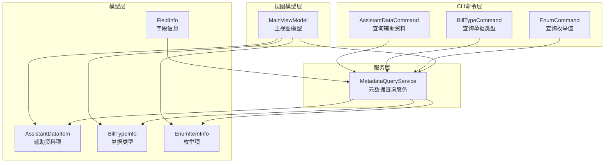
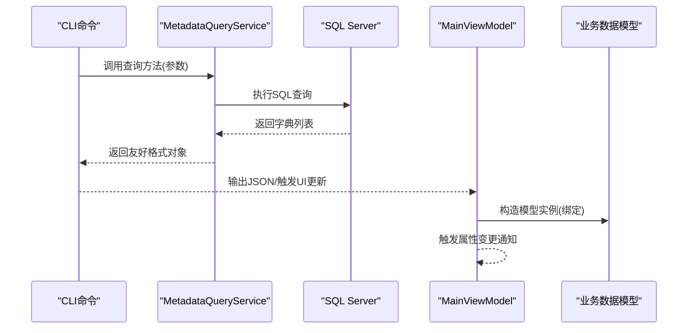
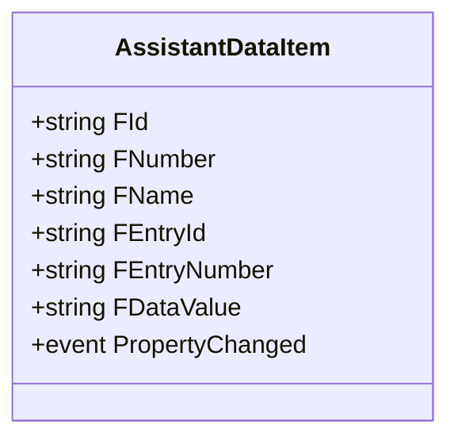
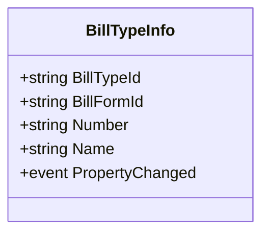
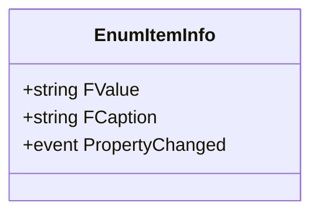
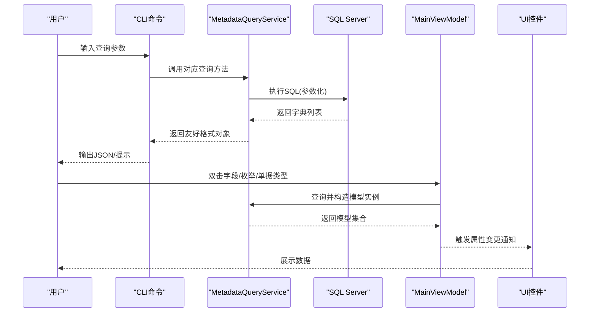
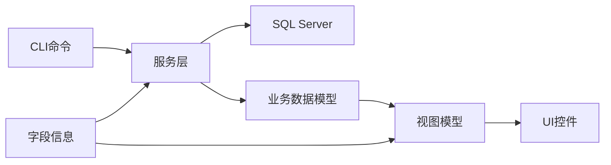

# 业务数据模型

<cite>
**本文档引用的文件**
- [AssistantDataItem.cs](file://Models/AssistantDataItem.cs)
- [BillTypeInfo.cs](file://Models/BillTypeInfo.cs)
- [EnumItemInfo.cs](file://Models/EnumItemInfo.cs)
- [usage-examples.md](file://docs/usage-examples.md)
- [AssistantDataCommand.cs](file://K3CloudDataDictionary.Cli/Commands/AssistantDataCommand.cs)
- [BillTypeCommand.cs](file://K3CloudDataDictionary.Cli/Commands/BillTypeCommand.cs)
- [EnumCommand.cs](file://K3CloudDataDictionary.Cli/Commands/EnumCommand.cs)
- [MetadataQueryService.cs](file://K3CloudDataDictionary.Cli/Services/MetadataQueryService.cs)
- [MainViewModel.cs](file://ViewModels/MainViewModel.cs)
- [FieldInfo.cs](file://Models/FieldInfo.cs)
</cite>

## 目录
1. [简介](#简介)
2. [项目结构](#项目结构)
3. [核心组件](#核心组件)
4. [架构总览](#架构总览)
5. [详细组件分析](#详细组件分析)
6. [依赖关系分析](#依赖关系分析)
7. [性能考量](#性能考量)
8. [故障排查指南](#故障排查指南)
9. [结论](#结论)
10. [附录](#附录)

## 简介
本文件聚焦于业务数据模型，系统性阐述三类核心模型：
- 辅助资料模型：AssistantDataItem，用于描述辅助资料的选项列表与条目关系。
- 单据类型模型：BillTypeInfo，用于描述单据类型的编码、名称及所属表单。
- 枚举值模型：EnumItemInfo，用于描述下拉列表枚举项的值域与显示文本。

同时，结合仓库中的CLI命令与服务层实现，解释这些模型在实际查询、筛选与展示中的使用方式，并给出数据绑定与界面呈现的实践建议。

## 项目结构
围绕业务数据模型，项目采用“模型-命令-服务-视图”的分层组织：
- Models：定义业务数据模型（AssistantDataItem、BillTypeInfo、EnumItemInfo）。
- K3CloudDataDictionary.Cli/Commands：封装CLI命令入口，负责参数解析与调用服务层。
- K3CloudDataDictionary.Cli/Services：提供实时SQL查询能力，支撑单据类型、辅助资料、枚举值等查询。
- ViewModels：提供WPF视图模型，承载数据绑定与UI交互，支持本地SQLite缓存与远程SQL Server查询两种模式。
- docs：包含使用示例文档，覆盖字段、表单、单据类型、辅助资料、枚举值等查询场景。

图表来源
- [AssistantDataItem.cs:1-58](file://Models/AssistantDataItem.cs#L1-L58)
- [BillTypeInfo.cs:1-45](file://Models/BillTypeInfo.cs#L1-L45)
- [EnumItemInfo.cs:1-31](file://Models/EnumItemInfo.cs#L1-L31)
- [AssistantDataCommand.cs:1-65](file://K3CloudDataDictionary.Cli/Commands/AssistantDataCommand.cs#L1-L65)
- [BillTypeCommand.cs:1-66](file://K3CloudDataDictionary.Cli/Commands/BillTypeCommand.cs#L1-L66)
- [EnumCommand.cs:1-64](file://K3CloudDataDictionary.Cli/Commands/EnumCommand.cs#L1-L64)
- [MetadataQueryService.cs:1-839](file://K3CloudDataDictionary.Cli/Services/MetadataQueryService.cs#L1-L839)
- [MainViewModel.cs:1-800](file://ViewModels/MainViewModel.cs#L1-L800)

章节来源
- [AssistantDataItem.cs:1-58](file://Models/AssistantDataItem.cs#L1-L58)
- [BillTypeInfo.cs:1-45](file://Models/BillTypeInfo.cs#L1-L45)
- [EnumItemInfo.cs:1-31](file://Models/EnumItemInfo.cs#L1-L31)
- [usage-examples.md:1-542](file://docs/usage-examples.md#L1-L542)

## 核心组件
本节对三个业务数据模型进行逐项剖析，涵盖属性定义、数据结构设计、复杂度与性能影响、以及在查询与展示中的典型用法。

- AssistantDataItem（辅助资料项）
  - 属性要点：标识、编码、名称、条目标识、条目编码、数据值。
  - 设计意图：描述辅助资料的“主表-条目-本地化”三层结构，便于在UI中展示层级关系与多语言显示。
  - 数据绑定：可直接绑定到列表控件，支持按条目编码排序与筛选。
  - 性能考量：查询时按条目编码排序，避免重复扫描；在本地缓存中可按主表ID聚合展示。

- BillTypeInfo（单据类型）
  - 属性要点：类型标识、表单标识、类型编码、类型名称。
  - 设计意图：统一描述单据类型的核心元信息，支持按表单维度聚合与按关键字检索。
  - 性能考量：查询时支持按表单ID、ID、关键字三种模式，SQL具备参数化，避免全表扫描。
  - 状态管理：模型本身不包含状态字段，状态值通常由字段级的BillStatusField提供。

- EnumItemInfo（枚举项）
  - 属性要点：值域、显示文本。
  - 设计意图：描述下拉列表的值域范围与显示文本，支持排序与筛选。
  - 性能考量：查询时按值域排序，保证UI下拉框的稳定展示顺序。

章节来源
- [AssistantDataItem.cs:15-50](file://Models/AssistantDataItem.cs#L15-L50)
- [BillTypeInfo.cs:13-35](file://Models/BillTypeInfo.cs#L13-L35)
- [EnumItemInfo.cs:11-21](file://Models/EnumItemInfo.cs#L11-L21)

## 架构总览
业务数据模型贯穿CLI命令、服务层查询与视图模型绑定，形成“命令-服务-模型-视图”的闭环。

图表来源
- [AssistantDataCommand.cs:33-56](file://K3CloudDataDictionary.Cli/Commands/AssistantDataCommand.cs#L33-L56)
- [BillTypeCommand.cs:36-57](file://K3CloudDataDictionary.Cli/Commands/BillTypeCommand.cs#L36-L57)
- [EnumCommand.cs:33-56](file://K3CloudDataDictionary.Cli/Commands/EnumCommand.cs#L33-L56)
- [MetadataQueryService.cs:569-630](file://K3CloudDataDictionary.Cli/Services/MetadataQueryService.cs#L569-L630)
- [MetadataQueryService.cs:636-679](file://K3CloudDataDictionary.Cli/Services/MetadataQueryService.cs#L636-L679)
- [MetadataQueryService.cs:685-727](file://K3CloudDataDictionary.Cli/Services/MetadataQueryService.cs#L685-L727)

## 详细组件分析

### AssistantDataItem（辅助资料模型）
- 数据结构设计
  - 主键与标识：FId、FEntryId、FEntryNumber。
  - 显示与本地化：FNumber、FName、FDataValue。
  - 属性变更通知：实现INotifyPropertyChanged，支持WPF双向绑定。
- 选项列表与关联关系
  - 通过LookUpObjectID关联到辅助资料主表，条目表与本地化表构成三层结构。
  - 查询时按条目编码排序，确保UI展示顺序稳定。
- 显示规则
  - 建议在UI中优先展示条目编码与数据值，必要时叠加主表名称作为上下文。
- 使用示例
  - CLI：assistantdata --id <lookUpObjectId>，返回主表、条目、本地化的组合数据。
  - 视图模型：双击辅助资料字段时，按ID查询并构造多个AssistantDataItem实例绑定到列表。

图表来源
- [AssistantDataItem.cs:6-56](file://Models/AssistantDataItem.cs#L6-L56)

章节来源
- [AssistantDataItem.cs:15-50](file://Models/AssistantDataItem.cs#L15-L50)
- [usage-examples.md:234-275](file://docs/usage-examples.md#L234-L275)
- [AssistantDataCommand.cs:33-56](file://K3CloudDataDictionary.Cli/Commands/AssistantDataCommand.cs#L33-L56)
- [MetadataQueryService.cs:636-679](file://K3CloudDataDictionary.Cli/Services/MetadataQueryService.cs#L636-L679)
- [MainViewModel.cs:604-654](file://ViewModels/MainViewModel.cs#L604-L654)

### BillTypeInfo（单据类型模型）
- 数据结构设计
  - 类型标识：BillTypeId。
  - 关联表单：BillFormId。
  - 编码与名称：Number、Name。
- 业务规则与状态管理
  - 模型本身不包含状态字段，状态值通常由字段级的BillStatusField提供。
  - 支持按表单查询列表、按ID查询详情、按关键字模糊搜索。
- 使用示例
  - CLI：billtype --form/--id/--keyword，返回类型列表或详情。
  - 视图模型：双击元素类型=单据类型时，按表单标识查询并绑定到列表。

图表来源
- [BillTypeInfo.cs:6-43](file://Models/BillTypeInfo.cs#L6-L43)

章节来源
- [BillTypeInfo.cs:13-35](file://Models/BillTypeInfo.cs#L13-L35)
- [usage-examples.md:161-232](file://docs/usage-examples.md#L161-L232)
- [BillTypeCommand.cs:36-57](file://K3CloudDataDictionary.Cli/Commands/BillTypeCommand.cs#L36-L57)
- [MetadataQueryService.cs:569-630](file://K3CloudDataDictionary.Cli/Services/MetadataQueryService.cs#L569-L630)
- [MainViewModel.cs:523-557](file://ViewModels/MainViewModel.cs#L523-L557)

### EnumItemInfo（枚举值模型）
- 数据结构设计
  - 值域：FValue。
  - 显示文本：FCaption。
- 值域范围与排序规则
  - 值域通常为数值或字符串，查询时按值域排序，保证UI一致性。
- 使用示例
  - CLI：enum --id <enumTypeId>，返回枚举类型及其所有枚举项。
  - 视图模型：双击枚举类型列时，按ID查询并绑定到列表。

图表来源
- [EnumItemInfo.cs:6-29](file://Models/EnumItemInfo.cs#L6-L29)

章节来源
- [EnumItemInfo.cs:11-21](file://Models/EnumItemInfo.cs#L11-L21)
- [usage-examples.md:278-325](file://docs/usage-examples.md#L278-L325)
- [EnumCommand.cs:33-56](file://K3CloudDataDictionary.Cli/Commands/EnumCommand.cs#L33-L56)
- [MetadataQueryService.cs:685-727](file://K3CloudDataDictionary.Cli/Services/MetadataQueryService.cs#L685-L727)
- [MainViewModel.cs:456-490](file://ViewModels/MainViewModel.cs#L456-L490)

### 查询、筛选与展示流程
- 辅助资料查询流程
  - CLI：assistantdata --id <lookUpObjectId> → 服务层按主表ID查询 → 返回主表、条目、本地化组合数据 → CLI输出友好格式。
  - 视图模型：双击辅助资料字段 → 按ID查询 → 构造多个AssistantDataItem实例 → 绑定到列表控件。
- 单据类型查询流程
  - CLI：billtype --form/--id/--keyword → 服务层按条件拼接SQL → 返回类型列表或详情 → CLI输出友好格式。
  - 视图模型：双击元素类型=单据类型 → 按表单标识查询 → 构造多个BillTypeInfo实例 → 绑定到列表控件。
- 枚举值查询流程
  - CLI：enum --id <enumTypeId> → 服务层按枚举类型ID查询 → 返回枚举项列表 → CLI输出友好格式。
  - 视图模型：双击枚举类型列 → 按ID查询 → 构造多个EnumItemInfo实例 → 绑定到下拉框控件。

图表来源
- [AssistantDataCommand.cs:33-56](file://K3CloudDataDictionary.Cli/Commands/AssistantDataCommand.cs#L33-L56)
- [BillTypeCommand.cs:36-57](file://K3CloudDataDictionary.Cli/Commands/BillTypeCommand.cs#L36-L57)
- [EnumCommand.cs:33-56](file://K3CloudDataDictionary.Cli/Commands/EnumCommand.cs#L33-L56)
- [MetadataQueryService.cs:569-630](file://K3CloudDataDictionary.Cli/Services/MetadataQueryService.cs#L569-L630)
- [MetadataQueryService.cs:636-679](file://K3CloudDataDictionary.Cli/Services/MetadataQueryService.cs#L636-L679)
- [MetadataQueryService.cs:685-727](file://K3CloudDataDictionary.Cli/Services/MetadataQueryService.cs#L685-L727)
- [MainViewModel.cs:456-490](file://ViewModels/MainViewModel.cs#L456-L490)
- [MainViewModel.cs:523-557](file://ViewModels/MainViewModel.cs#L523-L557)
- [MainViewModel.cs:604-654](file://ViewModels/MainViewModel.cs#L604-L654)

章节来源
- [usage-examples.md:161-325](file://docs/usage-examples.md#L161-L325)
- [AssistantDataCommand.cs:13-62](file://K3CloudDataDictionary.Cli/Commands/AssistantDataCommand.cs#L13-L62)
- [BillTypeCommand.cs:13-63](file://K3CloudDataDictionary.Cli/Commands/BillTypeCommand.cs#L13-L63)
- [EnumCommand.cs:13-61](file://K3CloudDataDictionary.Cli/Commands/EnumCommand.cs#L13-L61)
- [MetadataQueryService.cs:569-727](file://K3CloudDataDictionary.Cli/Services/MetadataQueryService.cs#L569-L727)
- [MainViewModel.cs:456-654](file://ViewModels/MainViewModel.cs#L456-L654)

## 依赖关系分析
- 模型与命令
  - CLI命令通过参数解析调用服务层查询方法，服务层返回字典列表，CLI再转换为更友好的对象结构。
- 模型与服务
  - 服务层基于SQL Server执行查询，返回标准化字典，供CLI与视图模型消费。
- 模型与视图模型
  - 视图模型在本地SQLite与远程SQL Server之间切换，统一构造业务数据模型实例并绑定到UI。
- 字段信息与业务模型
  - FieldInfo提供字段级的elementType、lookUpObject、enumType等关键属性，驱动业务模型的查询与展示。

图表来源
- [FieldInfo.cs:6-108](file://Models/FieldInfo.cs#L6-L108)
- [MetadataQueryService.cs:1-839](file://K3CloudDataDictionary.Cli/Services/MetadataQueryService.cs#L1-L839)
- [MainViewModel.cs:1-800](file://ViewModels/MainViewModel.cs#L1-L800)

章节来源
- [FieldInfo.cs:6-108](file://Models/FieldInfo.cs#L6-L108)
- [MetadataQueryService.cs:1-839](file://K3CloudDataDictionary.Cli/Services/MetadataQueryService.cs#L1-L839)
- [MainViewModel.cs:1-800](file://ViewModels/MainViewModel.cs#L1-L800)

## 性能考量
- SQL参数化
  - 单据类型、辅助资料、枚举值查询均采用参数化SQL，有效防止注入并提升缓存命中率。
- 排序与索引
  - 辅助资料按条目编码排序，枚举值按值域排序，有利于UI稳定展示与快速定位。
- 连接超时与批处理
  - 服务层设置合理的CommandTimeout，避免长时间阻塞；对批量加载XML采用批处理策略，减少多次往返。
- 本地缓存与远程查询
  - 视图模型支持本地SQLite缓存与远程SQL Server查询，可根据网络状况选择最优路径。

[本节为通用性能指导，不直接分析具体文件]

## 故障排查指南
- 参数缺失
  - CLI命令需满足必填参数要求（如assistantdata需要--id，enum需要--id，billtype至少需要--form/--id/--keyword之一）。
- 连接问题
  - 确认连接字符串正确，服务层初始化上下文时会输出加载进度与对象数量。
- 查询异常
  - 服务层捕获异常并输出错误信息，CLI命令层统一包装错误响应。
- UI无数据
  - 检查视图模型是否成功构造业务数据模型实例并触发属性变更通知；确认本地数据库路径与连接状态。

章节来源
- [AssistantDataCommand.cs:24-31](file://K3CloudDataDictionary.Cli/Commands/AssistantDataCommand.cs#L24-L31)
- [BillTypeCommand.cs:29-34](file://K3CloudDataDictionary.Cli/Commands/BillTypeCommand.cs#L29-L34)
- [EnumCommand.cs:25-31](file://K3CloudDataDictionary.Cli/Commands/EnumCommand.cs#L25-L31)
- [MetadataQueryService.cs:27-37](file://K3CloudDataDictionary.Cli/Services/MetadataQueryService.cs#L27-L37)

## 结论
本文档系统梳理了辅助资料、单据类型与枚举值三类业务数据模型的设计与实现，明确了它们在CLI命令、服务层查询与视图模型绑定中的角色与协作关系。通过参数化SQL、排序优化与本地缓存策略，项目在功能完整性与性能稳定性之间取得平衡。建议在实际应用中遵循本文档的查询与展示规范，确保数据绑定的一致性与用户体验的流畅性。

[本节为总结性内容，不直接分析具体文件]

## 附录
- 使用示例参考
  - 辅助资料查询：参见使用示例文档中的“查询辅助资料列表”案例。
  - 单据类型查询：参见使用示例文档中的“查询单据类型”案例。
  - 枚举值查询：参见使用示例文档中的“查询下拉列表枚举值”案例。
- 相关命令速查
  - assistantdata、billtype、enum命令的参数与用途详见使用示例文档的命令速查表。

章节来源
- [usage-examples.md:161-325](file://docs/usage-examples.md#L161-L325)