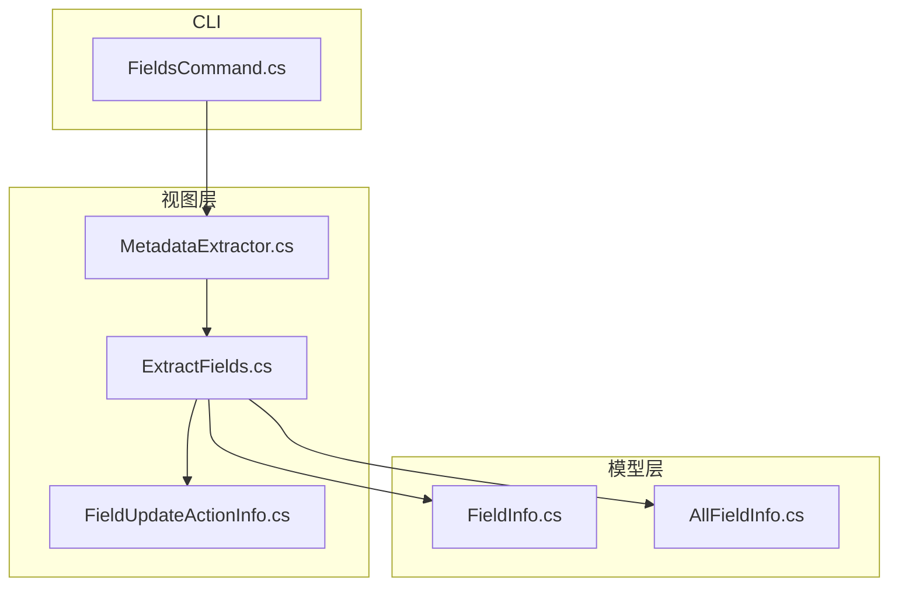
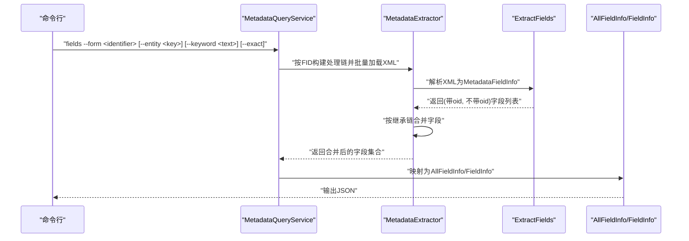
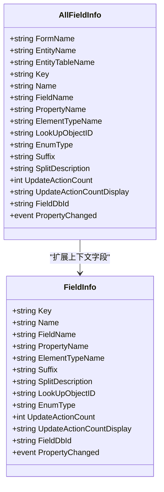
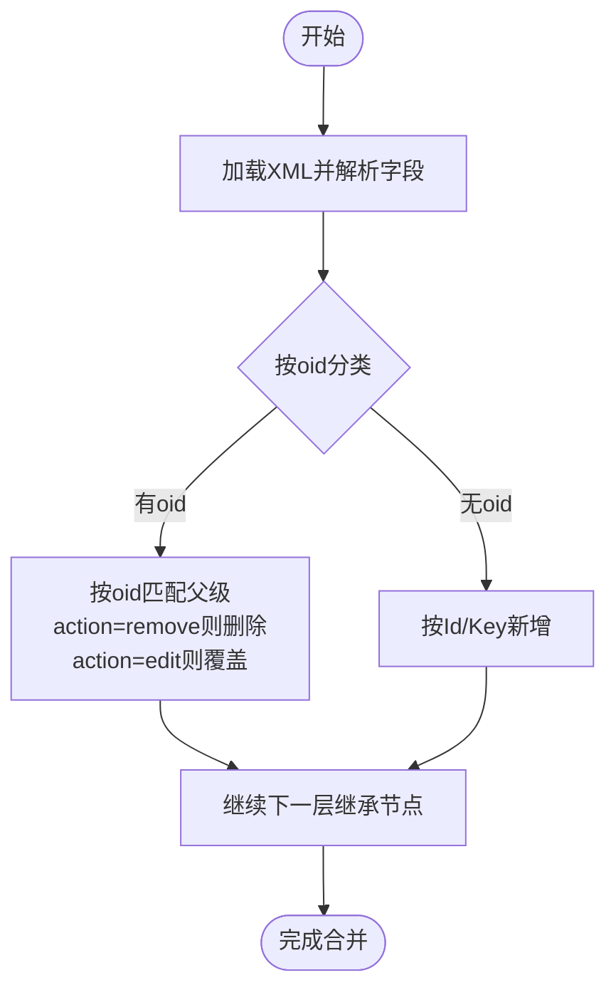
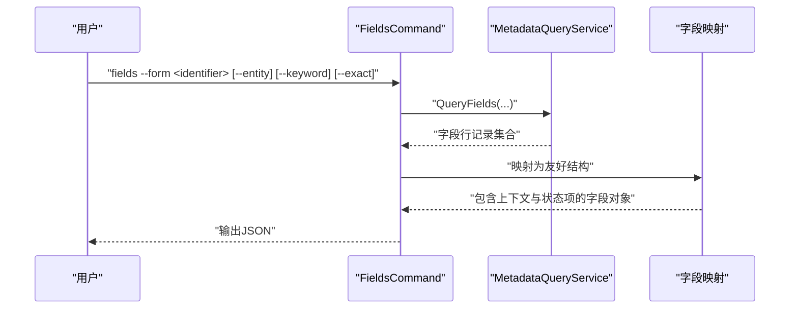
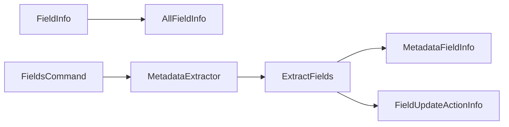

# 字段信息模型

<cite>
**本文引用的文件**
- [FieldInfo.cs](file://Models/FieldInfo.cs)
- [AllFieldInfo.cs](file://Models/AllFieldInfo.cs)
- [MetadataExtractor.cs](file://Views/MetadataExtractor.cs)
- [ExtractFields.cs](file://Views/ExtractFields.cs)
- [FieldsCommand.cs](file://K3CloudDataDictionary.Cli/Commands/FieldsCommand.cs)
- [FieldUpdateActionInfo.cs](file://Views/FieldUpdateActionInfo.cs)
</cite>

## 目录
1. [引言](#引言)
2. [项目结构](#项目结构)
3. [核心组件](#核心组件)
4. [架构总览](#架构总览)
5. [详细组件分析](#详细组件分析)
6. [依赖分析](#依赖分析)
7. [性能考虑](#性能考虑)
8. [故障排查指南](#故障排查指南)
9. [结论](#结论)
10. [附录](#附录)

## 引言
本文件聚焦于字段信息模型的设计与使用，系统性阐述以下内容：
- 字段元数据的数据结构设计：字段标识、名称、类型、长度、是否必填等属性的定义与来源。
- FieldInfo 与 AllFieldInfo 的区别与适用场景：前者面向单个字段，后者面向包含表单/实体上下文的字段集合。
- 字段继承关系、默认值处理、验证规则等复杂属性的设计思路与合并策略。
- 字段查询、过滤、排序的实际使用示例与性能优化建议。

## 项目结构
围绕字段信息模型的关键文件分布如下：
- Models：定义字段模型（FieldInfo、AllFieldInfo）
- Views：负责从元数据XML中抽取字段信息，并进行继承链合并
- K3CloudDataDictionary.Cli/Commands：命令行入口，提供字段查询能力
- Views/FieldUpdateActionInfo.cs：字段更新动作（联动/触发器）的子模型

图表来源
- [FieldInfo.cs:1-110](file://Models/FieldInfo.cs#L1-L110)
- [AllFieldInfo.cs:1-50](file://Models/AllFieldInfo.cs#L1-L50)
- [ExtractFields.cs:1-167](file://Views/ExtractFields.cs#L1-L167)
- [MetadataExtractor.cs:1-880](file://Views/MetadataExtractor.cs#L1-L880)
- [FieldsCommand.cs:1-88](file://K3CloudDataDictionary.Cli/Commands/FieldsCommand.cs#L1-L88)
- [FieldUpdateActionInfo.cs:1-36](file://Views/FieldUpdateActionInfo.cs#L1-L36)

章节来源
- [FieldInfo.cs:1-110](file://Models/FieldInfo.cs#L1-L110)
- [AllFieldInfo.cs:1-50](file://Models/AllFieldInfo.cs#L1-L50)
- [ExtractFields.cs:1-167](file://Views/ExtractFields.cs#L1-L167)
- [MetadataExtractor.cs:1-880](file://Views/MetadataExtractor.cs#L1-L880)
- [FieldsCommand.cs:1-88](file://K3CloudDataDictionary.Cli/Commands/FieldsCommand.cs#L1-L88)
- [FieldUpdateActionInfo.cs:1-36](file://Views/FieldUpdateActionInfo.cs#L1-L36)

## 核心组件
- FieldInfo：单个字段的元数据载体，支持属性变更通知，便于UI绑定与响应式更新。
- AllFieldInfo：在FieldInfo基础上增加FormName、EntityName、EntityTableName等上下文字段，用于展示字段所属表单与实体的完整信息。
- MetadataFieldInfo：从XML解析出的原始字段信息，包含oid、action、UpdateActions、StatusItems等，用于继承链合并与去重。
- FieldUpdateActionInfo：字段更新时触发的动作（联动/业务服务等）的子模型。

章节来源
- [FieldInfo.cs:1-110](file://Models/FieldInfo.cs#L1-L110)
- [AllFieldInfo.cs:1-50](file://Models/AllFieldInfo.cs#L1-L50)
- [ExtractFields.cs:7-51](file://Views/ExtractFields.cs#L7-L51)
- [FieldUpdateActionInfo.cs:1-36](file://Views/FieldUpdateActionInfo.cs#L1-L36)

## 架构总览
字段信息模型贯穿“解析—合并—查询—输出”的流程：
- 解析阶段：从XML中抽取字段信息，生成MetadataFieldInfo列表（含oid/no-oid两类）。
- 合并阶段：依据继承链与扩展链，对实体与字段执行覆盖、删除与新增合并。
- 查询阶段：CLI命令根据表单标识、实体键、关键词等条件筛选字段。
- 输出阶段：将字段信息转换为友好格式输出（JSON）。

图表来源
- [FieldsCommand.cs:13-85](file://K3CloudDataDictionary.Cli/Commands/FieldsCommand.cs#L13-L85)
- [MetadataExtractor.cs:299-360](file://Views/MetadataExtractor.cs#L299-L360)
- [ExtractFields.cs:70-164](file://Views/ExtractFields.cs#L70-L164)

## 详细组件分析

### FieldInfo 与 AllFieldInfo 的差异与用途
- FieldInfo
  - 作用：承载单个字段的核心元数据，支持属性变更通知，适合在UI层逐条展示与编辑。
  - 关键字段：Key、Name、FieldName、PropertyName、ElementTypeName、Suffix、SplitDescription、LookUpObjectID、EnumType、UpdateActionCount、FieldDbId 等。
  - 变更通知：通过 INotifyPropertyChanged 实现，便于WPF/其他MVVM框架绑定。
- AllFieldInfo
  - 作用：在FieldInfo基础上增加FormName、EntityName、EntityTableName等上下文信息，便于在表格或列表中直观显示字段归属。
  - 适用场景：字段清单导出、报表展示、跨实体对比等。

图表来源
- [FieldInfo.cs:6-108](file://Models/FieldInfo.cs#L6-L108)
- [AllFieldInfo.cs:6-48](file://Models/AllFieldInfo.cs#L6-L48)

章节来源
- [FieldInfo.cs:1-110](file://Models/FieldInfo.cs#L1-L110)
- [AllFieldInfo.cs:1-50](file://Models/AllFieldInfo.cs#L1-L50)

### 字段继承关系与合并策略
- 继承链构建：基于对象的继承路径（FInheritPath）与扩展映射（FDevType=2），生成“继承链+扩展链”的完整处理序列。
- 字段合并：
  - 有oid字段：按oid匹配父级，action=remove则删除，action=edit则覆盖属性；若父级不存在则新增。
  - 无oid字段：按Id或Key作为字典键新增。
- 更新动作（UpdateActions）与状态项（StatusItems）：
  - UpdateActions：在字段更新时触发的联动/业务服务，支持按oid粒度合并。
  - StatusItems：当ElementType=40时，字段为单据状态字段，包含Id、StatusName、StatusValue等。

图表来源
- [MetadataExtractor.cs:658-690](file://Views/MetadataExtractor.cs#L658-L690)
- [ExtractFields.cs:83-164](file://Views/ExtractFields.cs#L83-L164)

章节来源
- [MetadataExtractor.cs:158-283](file://Views/MetadataExtractor.cs#L158-L283)
- [MetadataExtractor.cs:658-690](file://Views/MetadataExtractor.cs#L658-L690)
- [ExtractFields.cs:70-164](file://Views/ExtractFields.cs#L70-L164)

### 字段查询、过滤与排序
- 查询入口：CLI命令 fields 支持以下参数：
  - 必填：--form <identifier>
  - 可选：--entity <entityKey>、--keyword <text>、--exact 或 -e
- 查询流程：
  - 解析连接串，构造 MetadataQueryService。
  - 调用 QueryFields 执行查询，返回字段行记录。
  - 将行记录映射为包含 formName、entityName、table、key、name、fieldName、propertyName、elementType、elementTypeName、tagName、lookUpObject、enumType、splitSuffix、splitDescription、updateActionCount 等字段的友好结构。
  - 当字段为状态字段（elementType=40）时，附加 statusItems 子对象。
- 过滤与排序：
  - 可在客户端对输出结果进行二次过滤与排序（例如按表单名、实体名、字段名排序，或按关键字高亮/筛选）。

图表来源
- [FieldsCommand.cs:13-85](file://K3CloudDataDictionary.Cli/Commands/FieldsCommand.cs#L13-L85)

章节来源
- [FieldsCommand.cs:13-85](file://K3CloudDataDictionary.Cli/Commands/FieldsCommand.cs#L13-L85)

### 复杂属性设计：默认值、验证规则与联动
- 默认值处理：字段模型本身不直接存储默认值，但可通过 UpdateActions 与状态项（StatusItems）间接体现字段在不同状态下的行为。
- 验证规则：在元数据合并过程中，验证规则（Validations）按oid/id匹配进行覆盖/新增/删除，确保继承链上规则的正确合并。
- 联动与触发：UpdateActions 记录字段更新时触发的服务类型、参数、前置条件等，支持按oid粒度合并，保证扩展链上的动作一致性。

章节来源
- [MetadataExtractor.cs:513-538](file://Views/MetadataExtractor.cs#L513-L538)
- [MetadataExtractor.cs:549-575](file://Views/MetadataExtractor.cs#L549-L575)
- [ExtractFields.cs:113-151](file://Views/ExtractFields.cs#L113-L151)
- [FieldUpdateActionInfo.cs:1-36](file://Views/FieldUpdateActionInfo.cs#L1-L36)

## 依赖分析
- 模型依赖
  - FieldInfo/AllFieldInfo 依赖于 INotifyPropertyChanged，用于UI绑定。
  - AllFieldInfo 继承自 FieldInfo 的字段集合并扩展上下文字段。
- 视图依赖
  - ExtractFields 负责从XML解析字段并生成 MetadataFieldInfo。
  - MetadataExtractor 负责继承链构建与字段合并。
  - FieldUpdateActionInfo 作为子模型被 ExtractFields 使用。
- CLI 依赖
  - FieldsCommand 依赖 MetadataQueryService 进行查询，并将结果映射为输出对象。

图表来源
- [FieldInfo.cs:6-108](file://Models/FieldInfo.cs#L6-L108)
- [AllFieldInfo.cs:6-48](file://Models/AllFieldInfo.cs#L6-L48)
- [ExtractFields.cs:7-51](file://Views/ExtractFields.cs#L7-L51)
- [FieldUpdateActionInfo.cs:1-36](file://Views/FieldUpdateActionInfo.cs#L1-L36)
- [MetadataExtractor.cs:299-360](file://Views/MetadataExtractor.cs#L299-L360)
- [FieldsCommand.cs:13-85](file://K3CloudDataDictionary.Cli/Commands/FieldsCommand.cs#L13-L85)

章节来源
- [FieldInfo.cs:1-110](file://Models/FieldInfo.cs#L1-L110)
- [AllFieldInfo.cs:1-50](file://Models/AllFieldInfo.cs#L1-L50)
- [ExtractFields.cs:1-167](file://Views/ExtractFields.cs#L1-L167)
- [MetadataExtractor.cs:1-880](file://Views/MetadataExtractor.cs#L1-L880)
- [FieldsCommand.cs:1-88](file://K3CloudDataDictionary.Cli/Commands/FieldsCommand.cs#L1-L88)
- [FieldUpdateActionInfo.cs:1-36](file://Views/FieldUpdateActionInfo.cs#L1-L36)

## 性能考虑
- 批量加载与缓存
  - 在构建继承链时，先收集所需FID集合，再批量加载XML，避免重复IO与多次解析。
- 合并策略优化
  - 使用字典按oid/键快速定位父级，减少查找成本；对无oid字段采用Id/Key作为键，保证新增效率。
- 线程安全
  - 上下文（MetadataContext）为只读结构，避免并发修改带来的锁开销；XML缓存为线程局部变量，降低共享状态风险。
- 输出优化
  - CLI输出前进行一次映射，避免在查询阶段携带冗余字段，减少序列化开销。

章节来源
- [MetadataExtractor.cs:299-311](file://Views/MetadataExtractor.cs#L299-L311)
- [MetadataExtractor.cs:188-199](file://Views/MetadataExtractor.cs#L188-L199)
- [MetadataExtractor.cs:322-360](file://Views/MetadataExtractor.cs#L322-L360)

## 故障排查指南
- 参数缺失
  - 现象：执行 fields 命令时报错提示缺少 --form 参数。
  - 处理：确认传入了有效的表单标识符。
- 查询异常
  - 现象：命令执行抛出异常。
  - 处理：检查连接串是否正确，确认数据库可达；查看错误消息并重试。
- 字段为空或不完整
  - 现象：输出字段信息缺失或上下文字段为空。
  - 处理：确认所选表单/实体存在有效继承链；检查XML是否成功加载；必要时重新执行批量加载步骤。

章节来源
- [FieldsCommand.cs:18-31](file://K3CloudDataDictionary.Cli/Commands/FieldsCommand.cs#L18-L31)
- [FieldsCommand.cs:80-84](file://K3CloudDataDictionary.Cli/Commands/FieldsCommand.cs#L80-L84)

## 结论
- FieldInfo 与 AllFieldInfo 分别承担“单字段”与“字段集合上下文”的职责，配合 CLI 查询命令形成完整的字段信息检索闭环。
- 通过继承链与扩展链的合并机制，系统能够准确反映字段在多层级扩展中的最终形态。
- 建议在实际使用中结合过滤与排序策略，提升字段信息的可读性与可用性；在大规模数据场景下，遵循批量加载与缓存策略以获得最佳性能。

## 附录
- 字段属性速览（来源于模型与解析逻辑）
  - 标识与名称：Key、Name、FieldName、PropertyName、ElementTypeName、TagName
  - 上下文：FormName、EntityName、EntityTableName
  - 显示与描述：Suffix、SplitDescription、LookUpObjectID、EnumType、EnumTypeDisplay
  - 行为与计数：UpdateActionCount、UpdateActionCountDisplay、FieldDbId
  - 继承与动作：Oid、Action、UpdateActions（含 ServiceTypeName、Parameters、PreCondition 等）、StatusItems（Id、StatusName、StatusValue）

章节来源
- [FieldInfo.cs:22-100](file://Models/FieldInfo.cs#L22-L100)
- [AllFieldInfo.cs:25-41](file://Models/AllFieldInfo.cs#L25-L41)
- [ExtractFields.cs:9-23](file://Views/ExtractFields.cs#L9-L23)
- [FieldUpdateActionInfo.cs:5-15](file://Views/FieldUpdateActionInfo.cs#L5-L15)