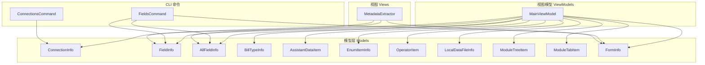
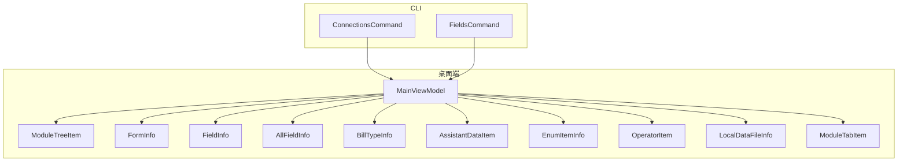
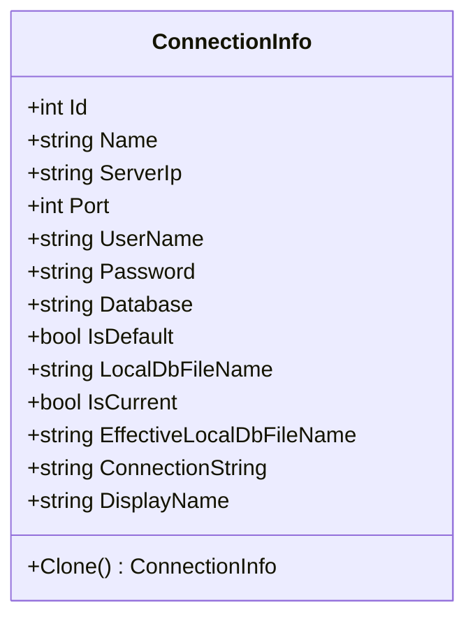
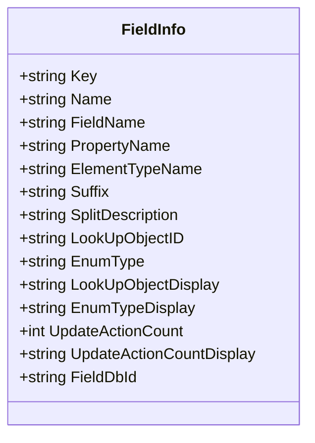
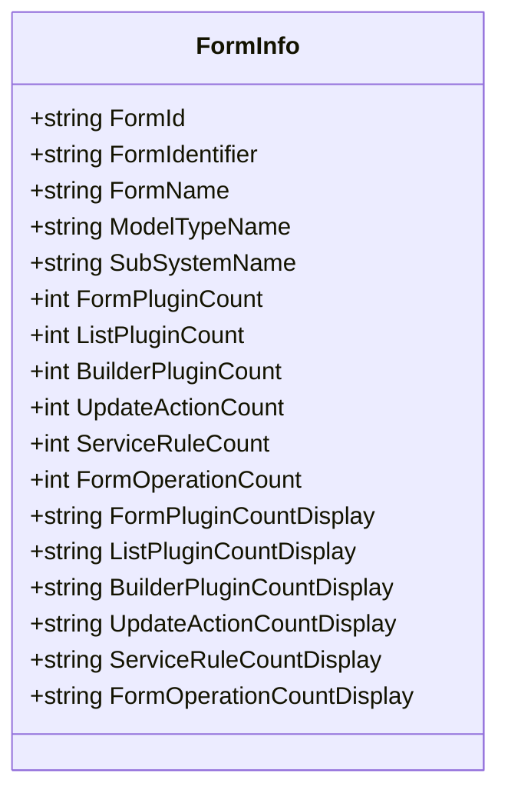
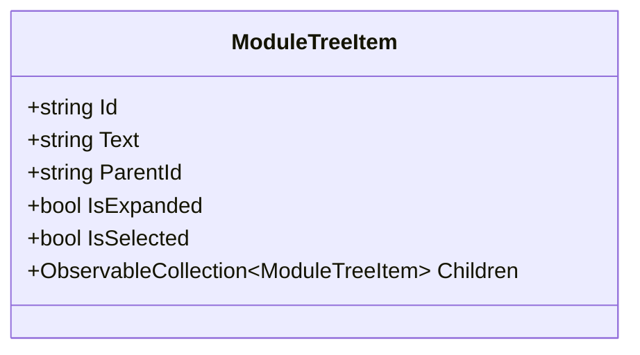
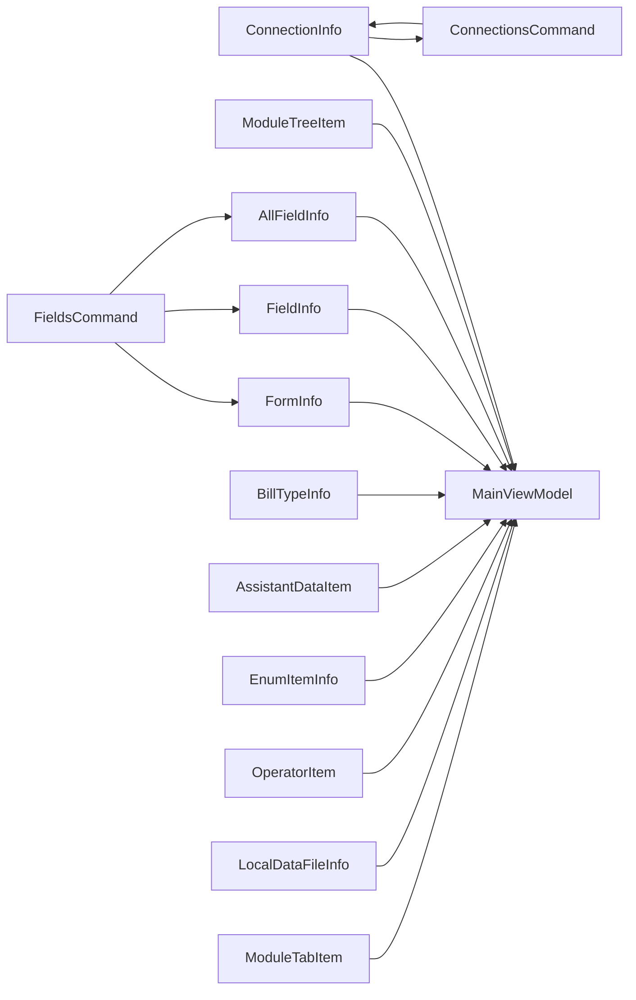

# 数据模型设计

<cite>
**本文档引用的文件**
- [ConnectionInfo.cs](file://Models/ConnectionInfo.cs)
- [FieldInfo.cs](file://Models/FieldInfo.cs)
- [FormInfo.cs](file://Models/FormInfo.cs)
- [ModuleTreeItem.cs](file://Models/ModuleTreeItem.cs)
- [AllFieldInfo.cs](file://Models/AllFieldInfo.cs)
- [BillTypeInfo.cs](file://Models/BillTypeInfo.cs)
- [AssistantDataItem.cs](file://Models/AssistantDataItem.cs)
- [EnumItemInfo.cs](file://Models/EnumItemInfo.cs)
- [OperatorItem.cs](file://Models/OperatorItem.cs)
- [LocalDataFileInfo.cs](file://Models/LocalDataFileInfo.cs)
- [ModuleTabItem.cs](file://Models/ModuleTabItem.cs)
- [MainViewModel.cs](file://ViewModels/MainViewModel.cs)
- [ConnectionsCommand.cs](file://K3CloudDataDictionary.Cli/Commands/ConnectionsCommand.cs)
- [FieldsCommand.cs](file://K3CloudDataDictionary.Cli/Commands/FieldsCommand.cs)
- [MetadataExtractor.cs](file://Views/MetadataExtractor.cs)
</cite>

## 目录
1. [引言](#引言)
2. [项目结构](#项目结构)
3. [核心组件](#核心组件)
4. [架构总览](#架构总览)
5. [详细组件分析](#详细组件分析)
6. [依赖分析](#依赖分析)
7. [性能考虑](#性能考虑)
8. [故障排除指南](#故障排除指南)
9. [结论](#结论)
10. [附录](#附录)

## 引言
本文件面向金蝶K3 Cloud数据字典系统的开发者与使用者，系统性阐述核心数据模型的设计理念、属性定义、数据类型、验证规则与业务含义，并结合实际使用场景（桌面端与CLI）说明模型之间的关系与依赖。重点覆盖以下模型：
- ConnectionInfo：连接信息模型
- FieldInfo：字段信息模型
- FormInfo：表单信息模型
- ModuleTreeItem：模块树形结构模型
- 以及与之密切相关的 AllFieldInfo、BillTypeInfo、AssistantDataItem、EnumItemInfo、OperatorItem、LocalDataFileInfo、ModuleTabItem 等

## 项目结构
项目采用分层与职责分离的组织方式：
- Models：领域模型与UI绑定模型，统一实现INotifyPropertyChanged以便WPF绑定
- ViewModels：MVVM模式下的视图模型，负责业务流程编排与数据加载
- Views：元数据提取与展示相关类（如MetadataExtractor）
- K3CloudDataDictionary.Cli：命令行工具，提供连接管理、字段查询等能力
- Helpers：数据库与密码等辅助工具

图表来源
- [MainViewModel.cs:1-800](file://ViewModels/MainViewModel.cs#L1-L800)
- [ConnectionInfo.cs:1-144](file://Models/ConnectionInfo.cs#L1-L144)
- [FieldInfo.cs:1-110](file://Models/FieldInfo.cs#L1-L110)
- [FormInfo.cs:1-101](file://Models/FormInfo.cs#L1-L101)
- [ModuleTreeItem.cs:1-60](file://Models/ModuleTreeItem.cs#L1-L60)
- [AllFieldInfo.cs:1-50](file://Models/AllFieldInfo.cs#L1-L50)
- [BillTypeInfo.cs:1-45](file://Models/BillTypeInfo.cs#L1-L45)
- [AssistantDataItem.cs:1-58](file://Models/AssistantDataItem.cs#L1-L58)
- [EnumItemInfo.cs:1-31](file://Models/EnumItemInfo.cs#L1-L31)
- [OperatorItem.cs:1-9](file://Models/OperatorItem.cs#L1-L9)
- [LocalDataFileInfo.cs:1-67](file://Models/LocalDataFileInfo.cs#L1-L67)
- [ModuleTabItem.cs:1-196](file://Models/ModuleTabItem.cs#L1-L196)
- [ConnectionsCommand.cs:1-231](file://K3CloudDataDictionary.Cli/Commands/ConnectionsCommand.cs#L1-L231)
- [FieldsCommand.cs:1-88](file://K3CloudDataDictionary.Cli/Commands/FieldsCommand.cs#L1-L88)
- [MetadataExtractor.cs:1-880](file://Views/MetadataExtractor.cs#L1-L880)

章节来源
- [MainViewModel.cs:1-800](file://ViewModels/MainViewModel.cs#L1-L800)
- [ConnectionsCommand.cs:1-231](file://K3CloudDataDictionary.Cli/Commands/ConnectionsCommand.cs#L1-L231)
- [FieldsCommand.cs:1-88](file://K3CloudDataDictionary.Cli/Commands/FieldsCommand.cs#L1-L88)

## 核心组件
本节对四大核心模型进行深入剖析：ConnectionInfo、FieldInfo、FormInfo、ModuleTreeItem。

- ConnectionInfo（连接信息模型）
  - 角色定位：封装数据库连接配置，支持UI绑定与持久化
  - 关键属性与类型
    - Id:int；Name:string；ServerIp:string；Port:int；UserName:string；Password:string；Database:string；IsDefault:boolean；LocalDbFileName:string；IsCurrent:boolean（仅UI显示，不持久化）
  - 行为与特性
    - 计算属性：EffectiveLocalDbFileName（优先使用LocalDbFileName，否则以Database拼接“.db”，默认“metadata.db”）、ConnectionString（构造连接串）、DisplayName（根据Name/Database组合生成显示名）
    - 克隆：Clone()深拷贝当前连接信息
    - 通知：实现INotifyPropertyChanged，支持WPF双向绑定
  - 验证规则与约束
    - 必填校验：ServerIp、Database、UserName通常在CLI添加连接时强制要求
    - 默认连接：IsDefault用于标记默认连接，便于自动连接
    - UI显示：IsCurrent用于界面高亮当前连接
  - 业务含义
    - 作为系统与数据库交互的入口凭证，决定本地元数据文件位置与连接字符串生成

- FieldInfo（字段信息模型）
  - 角色定位：描述表单字段的元信息，支持字段级展示与筛选
  - 关键属性与类型
    - Key、Name、FieldName、PropertyName、ElementTypeName、Suffix、SplitDescription、LookUpObjectID、EnumType、LookUpObjectDisplay、EnumTypeDisplay、UpdateActionCount:int、FieldDbId:string
  - 行为与特性
    - 计算属性：UpdateActionCountDisplay（当UpdateActionCount>0时显示数值，否则为空字符串）
    - 通知：实现INotifyPropertyChanged
  - 验证规则与约束
    - 多数为展示用途，无强约束；部分字段（如LookUpObjectID、EnumType）用于导航到关联数据
  - 业务含义
    - 字段级元数据的最小可用单元，支撑字段详情、枚举、辅助资料、拆分表等多维展示

- FormInfo（表单信息模型）
  - 角色定位：描述表单维度的统计与概览信息
  - 关键属性与类型
    - FormId、FormIdentifier、FormName、ModelTypeName、SubSystemName、FormPluginCount:int、ListPluginCount:int、BuilderPluginCount:int、UpdateActionCount:int、ServiceRuleCount:int、FormOperationCount:int
  - 行为与特性
    - 计算属性：各计数器的Display版本（>0时显示数值，否则为空字符串）
    - 通知：实现INotifyPropertyChanged
  - 验证规则与约束
    - 无强约束；主要用于UI统计展示
  - 业务含义
    - 作为表单级聚合视图，驱动“打开实体/字段/枚举/单据类型/服务规则/插件/值更新/表单操作”等Tab页的数据加载

- ModuleTreeItem（模块树形结构模型）
  - 角色定位：树形菜单的节点模型，支持展开/选择与子节点管理
  - 关键属性与类型
    - Id、Text、ParentId、IsExpanded、IsSelected、Children:ObservableCollection<ModuleTreeItem>
  - 行为与特性
    - 子节点集合初始化；实现INotifyPropertyChanged
  - 验证规则与约束
    - 无强约束；通过ParentId建立父子关系
  - 业务含义
    - 驱动左侧模块树的渲染与交互，点击节点触发相应Tab页打开与数据加载

章节来源
- [ConnectionInfo.cs:1-144](file://Models/ConnectionInfo.cs#L1-L144)
- [FieldInfo.cs:1-110](file://Models/FieldInfo.cs#L1-L110)
- [FormInfo.cs:1-101](file://Models/FormInfo.cs#L1-L101)
- [ModuleTreeItem.cs:1-60](file://Models/ModuleTreeItem.cs#L1-L60)

## 架构总览
下图展示了桌面端与CLI两种使用场景下，核心模型与业务流程的关系：

图表来源
- [MainViewModel.cs:1-800](file://ViewModels/MainViewModel.cs#L1-L800)
- [ConnectionsCommand.cs:1-231](file://K3CloudDataDictionary.Cli/Commands/ConnectionsCommand.cs#L1-L231)
- [FieldsCommand.cs:1-88](file://K3CloudDataDictionary.Cli/Commands/FieldsCommand.cs#L1-L88)

## 详细组件分析

### ConnectionInfo 连接信息模型
- 设计要点
  - 使用私有字段+公共属性+INotifyPropertyChanged，确保UI与数据同步
  - 计算属性EffectiveLocalDbFileName与ConnectionString降低调用方复杂度
  - Clone()提供安全复制，避免意外共享状态
- 使用示例（路径参考）
  - 添加连接：[ConnectionsCommand.cs:76-131](file://K3CloudDataDictionary.Cli/Commands/ConnectionsCommand.cs#L76-L131)
  - 设置默认连接：[ConnectionsCommand.cs:133-171](file://K3CloudDataDictionary.Cli/Commands/ConnectionsCommand.cs#L133-L171)
  - 测试连接：[ConnectionsCommand.cs:173-228](file://K3CloudDataDictionary.Cli/Commands/ConnectionsCommand.cs#L173-L228)
  - 应用连接（桌面端）：[MainViewModel.cs:246-267](file://ViewModels/MainViewModel.cs#L246-L267)
- 最佳实践
  - 优先使用EffectiveLocalDbFileName确定本地数据库文件名
  - 使用ConnectionString进行数据库连接测试
  - 通过IsDefault与UI的IsCurrent配合，清晰标识当前连接

图表来源
- [ConnectionInfo.cs:1-144](file://Models/ConnectionInfo.cs#L1-L144)

章节来源
- [ConnectionInfo.cs:1-144](file://Models/ConnectionInfo.cs#L1-L144)
- [ConnectionsCommand.cs:1-231](file://K3CloudDataDictionary.Cli/Commands/ConnectionsCommand.cs#L1-L231)
- [MainViewModel.cs:246-267](file://ViewModels/MainViewModel.cs#L246-L267)

### FieldInfo 字段信息模型
- 设计要点
  - 聚焦字段级元数据，包含字段名、属性名、元素类型、枚举/辅助资料引用等
  - UpdateActionCountDisplay简化UI显示逻辑
- 使用示例（路径参考）
  - CLI查询字段：[FieldsCommand.cs:38-84](file://K3CloudDataDictionary.Cli/Commands/FieldsCommand.cs#L38-L84)
  - 主视图打开字段详情：[MainViewModel.cs:384-407](file://ViewModels/MainViewModel.cs#L384-L407)
  - 通过LookUpObjectID跳转实体：[MainViewModel.cs:412-451](file://ViewModels/MainViewModel.cs#L412-L451)
  - 通过EnumType跳转枚举：[MainViewModel.cs:456-490](file://ViewModels/MainViewModel.cs#L456-L490)
- 最佳实践
  - 当UpdateActionCount>0时，建议在UI中以醒目标识提示用户关注值更新策略
  - 结合ElementTypeName判断是否为“单据类型”、“单选辅助资料”等，以决定后续导航行为

图表来源
- [FieldInfo.cs:1-110](file://Models/FieldInfo.cs#L1-L110)

章节来源
- [FieldInfo.cs:1-110](file://Models/FieldInfo.cs#L1-L110)
- [FieldsCommand.cs:1-88](file://K3CloudDataDictionary.Cli/Commands/FieldsCommand.cs#L1-L88)
- [MainViewModel.cs:384-490](file://ViewModels/MainViewModel.cs#L384-L490)

### FormInfo 表单信息模型
- 设计要点
  - 以计数器形式提供表单维度的聚合信息，便于快速概览
  - Display版本属性简化UI展示
- 使用示例（路径参考）
  - 主视图打开实体Tab：[MainViewModel.cs:359-382](file://ViewModels/MainViewModel.cs#L359-L382)
  - 主视图打开单据类型Tab：[MainViewModel.cs:523-557](file://ViewModels/MainViewModel.cs#L523-L557)
  - 主视图打开服务规则Tab：[MainViewModel.cs:659-731](file://ViewModels/MainViewModel.cs#L659-L731)
- 最佳实践
  - 通过FormPluginCount、ListPluginCount、BuilderPluginCount判断表单插件丰富度
  - 依据ServiceRuleCount与FormOperationCount评估表单业务复杂度

图表来源
- [FormInfo.cs:1-101](file://Models/FormInfo.cs#L1-L101)

章节来源
- [FormInfo.cs:1-101](file://Models/FormInfo.cs#L1-L101)
- [MainViewModel.cs:359-557](file://ViewModels/MainViewModel.cs#L359-L557)

### ModuleTreeItem 模块树形结构模型
- 设计要点
  - 支持展开/折叠与选择状态，Children为ObservableCollection便于UI绑定
- 使用示例（路径参考）
  - 模块选择事件：[MainViewModel.cs:323-335](file://ViewModels/MainViewModel.cs#L323-L335)
  - 打开表单Tab：[MainViewModel.cs:337-357](file://ViewModels/MainViewModel.cs#L337-L357)
- 最佳实践
  - 通过IsExpanded在用户展开节点时再触发数据加载，减少不必要的网络/数据库访问

图表来源
- [ModuleTreeItem.cs:1-60](file://Models/ModuleTreeItem.cs#L1-L60)

章节来源
- [ModuleTreeItem.cs:1-60](file://Models/ModuleTreeItem.cs#L1-L60)
- [MainViewModel.cs:323-357](file://ViewModels/MainViewModel.cs#L323-L357)

### 相关补充模型
- AllFieldInfo：在某些场景下需要同时展示FormName、EntityName、EntityTableName等上下文信息，便于跨表单/实体的字段对比
- BillTypeInfo：单据类型信息，支持通过FormIdentifier导航查询
- AssistantDataItem：单选辅助资料明细
- EnumItemInfo：枚举项（FValue/FCaption）
- OperatorItem：搜索运算符（等于/LIKE/LIKE_START/LIKE_END）
- LocalDataFileInfo：本地数据文件信息（文件名、大小、最后修改时间、是否自动生成、关联连接等）

章节来源
- [AllFieldInfo.cs:1-50](file://Models/AllFieldInfo.cs#L1-L50)
- [BillTypeInfo.cs:1-45](file://Models/BillTypeInfo.cs#L1-L45)
- [AssistantDataItem.cs:1-58](file://Models/AssistantDataItem.cs#L1-L58)
- [EnumItemInfo.cs:1-31](file://Models/EnumItemInfo.cs#L1-L31)
- [OperatorItem.cs:1-9](file://Models/OperatorItem.cs#L1-L9)
- [LocalDataFileInfo.cs:1-67](file://Models/LocalDataFileInfo.cs#L1-L67)

## 依赖分析
- 模型间依赖
  - ModuleTreeItem 与 MainViewModel：树节点选择驱动Tab页打开与数据加载
  - FormInfo 与 FieldInfo/AllFieldInfo：表单维度与字段维度的双向导航
  - FieldInfo 与 BillTypeInfo/AssistantDataItem/EnumItemInfo：字段元素类型为“单据类型/单选辅助资料/枚举”时的关联导航
  - ConnectionInfo 与 CLI/桌面端：提供连接串与本地数据库文件名
- 外部依赖
  - SQLiteHelper：本地数据库路径解析与默认连接加载
  - DbHelper：连接测试
  - MetadataQueryService：CLI字段查询服务

图表来源
- [MainViewModel.cs:1-800](file://ViewModels/MainViewModel.cs#L1-L800)
- [ConnectionsCommand.cs:1-231](file://K3CloudDataDictionary.Cli/Commands/ConnectionsCommand.cs#L1-L231)
- [FieldsCommand.cs:1-88](file://K3CloudDataDictionary.Cli/Commands/FieldsCommand.cs#L1-L88)

章节来源
- [MainViewModel.cs:1-800](file://ViewModels/MainViewModel.cs#L1-L800)
- [ConnectionsCommand.cs:1-231](file://K3CloudDataDictionary.Cli/Commands/ConnectionsCommand.cs#L1-L231)
- [FieldsCommand.cs:1-88](file://K3CloudDataDictionary.Cli/Commands/FieldsCommand.cs#L1-L88)

## 性能考虑
- 懒加载与按需加载
  - ModuleTreeItem展开时再加载对应数据，避免一次性加载全部节点
  - MainViewModel在打开Tab时才执行SQL查询，减少资源占用
- 计算属性优化
  - EffectiveLocalDbFileName、ConnectionString、DisplayName等计算属性避免重复计算
  - UpdateActionCountDisplay等显示型属性减少UI层判断逻辑
- 批量查询与缓存
  - CLI字段查询返回扁平化结构，便于前端快速渲染
  - 元数据提取器（Views/MetadataExtractor）通过上下文构建继承链与扩展链，减少重复XML解析

## 故障排除指南
- 连接失败
  - 使用ConnectionsCommand的TestConnection子命令进行连通性检查
  - 核查ConnectionInfo.ConnectionString与服务器IP/端口/数据库/凭据
- 本地数据缺失
  - 检查MainViewModel.UpdateLocalDbPath与HasLocalData判定
  - 若无本地数据，需先刷新元数据
- 导航异常
  - 通过FieldInfo.LookUpObjectID/EnumType/ElementTypeName判断是否具备导航能力
  - 若为空，避免触发跳转逻辑

章节来源
- [ConnectionsCommand.cs:173-228](file://K3CloudDataDictionary.Cli/Commands/ConnectionsCommand.cs#L173-L228)
- [MainViewModel.cs:276-290](file://ViewModels/MainViewModel.cs#L276-L290)
- [MainViewModel.cs:412-490](file://ViewModels/MainViewModel.cs#L412-L490)

## 结论
上述模型围绕“连接—表单—实体—字段—关联数据”的层次化关系构建，既满足桌面端的交互体验，又兼容CLI的批量化查询需求。通过计算属性与INotifyPropertyChanged，实现了低耦合、高内聚的数据模型设计。建议在实际开发中遵循“按需加载、懒执行、显示与业务分离”的原则，持续优化用户体验与系统性能。

## 附录
- 使用示例（路径参考）
  - CLI添加连接：[ConnectionsCommand.cs:76-131](file://K3CloudDataDictionary.Cli/Commands/ConnectionsCommand.cs#L76-L131)
  - CLI测试连接：[ConnectionsCommand.cs:173-228](file://K3CloudDataDictionary.Cli/Commands/ConnectionsCommand.cs#L173-L228)
  - CLI查询字段：[FieldsCommand.cs:38-84](file://K3CloudDataDictionary.Cli/Commands/FieldsCommand.cs#L38-L84)
  - 桌面端打开实体/字段/枚举/单据类型/服务规则/插件等Tab：[MainViewModel.cs:359-731](file://ViewModels/MainViewModel.cs#L359-L731)
- 最佳实践清单
  - 优先使用EffectiveLocalDbFileName与ConnectionString
  - 通过Display属性简化UI展示
  - 在ModuleTreeItem展开时触发数据加载
  - 对LookUpObjectID/EnumType/ElementTypeName进行判空与类型判断后再导航