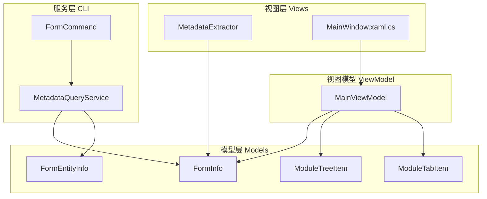
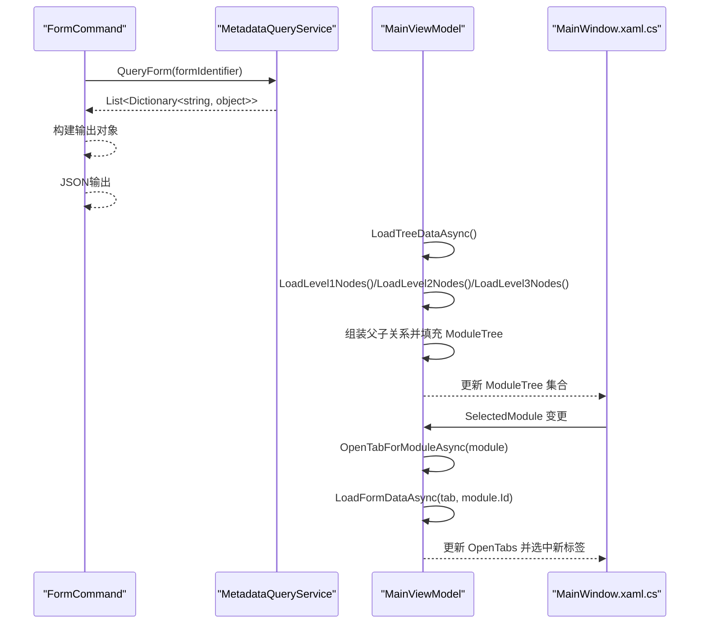
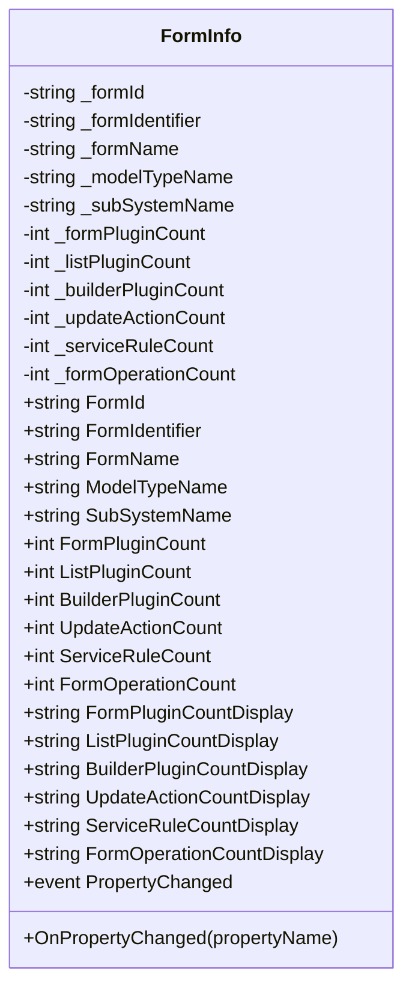
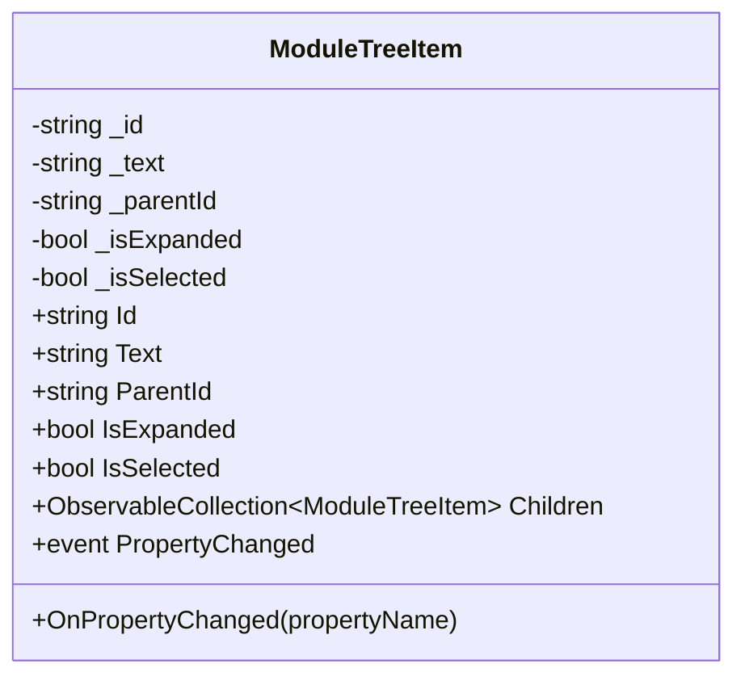
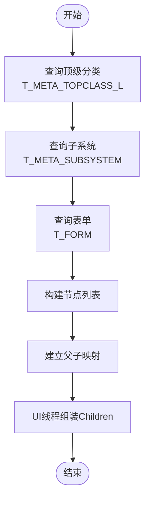
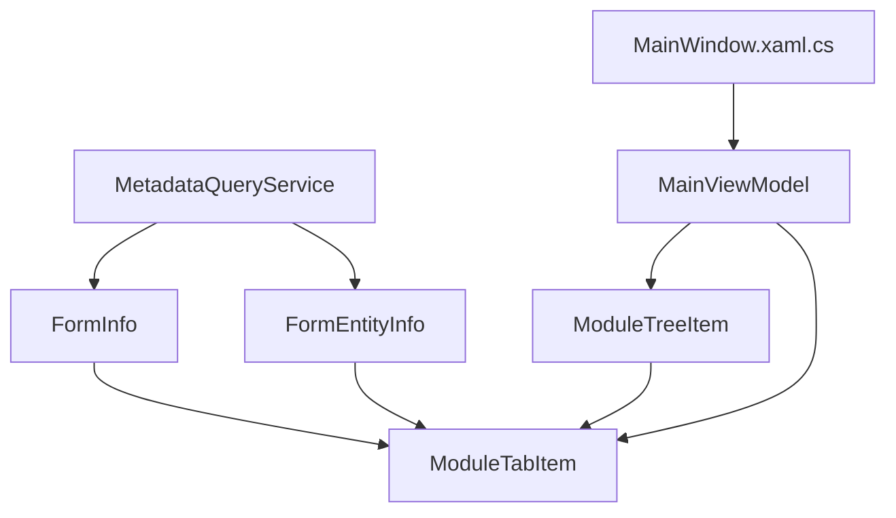

# 表单信息模型

<cite>
**本文档引用的文件**
- [FormInfo.cs](file://Models/FormInfo.cs)
- [ModuleTreeItem.cs](file://Models/ModuleTreeItem.cs)
- [FormEntityInfo.cs](file://Models/FormEntityInfo.cs)
- [ModuleTabItem.cs](file://Models/ModuleTabItem.cs)
- [FormCommand.cs](file://K3CloudDataDictionary.Cli/Commands/FormCommand.cs)
- [MetadataQueryService.cs](file://K3CloudDataDictionary.Cli/Services/MetadataQueryService.cs)
- [MainViewModel.cs](file://ViewModels/MainViewModel.cs)
- [MetadataExtractor.cs](file://Views/MetadataExtractor.cs)
- [MainWindow.xaml.cs](file://MainWindow.xaml.cs)
</cite>

## 目录
1. [简介](#简介)
2. [项目结构](#项目结构)
3. [核心组件](#核心组件)
4. [架构总览](#架构总览)
5. [详细组件分析](#详细组件分析)
6. [依赖关系分析](#依赖关系分析)
7. [性能考虑](#性能考虑)
8. [故障排除指南](#故障排除指南)
9. [结论](#结论)
10. [附录](#附录)

## 简介
本文件聚焦于表单信息模型与模块树形结构模型的设计与实现，涵盖以下关键点：
- 表单信息模型 FormInfo 的数据结构设计，包括表单ID、标识、名称、模型类型、子系统名称以及各类插件、服务规则、操作计数等属性。
- 模块树形结构模型 ModuleTreeItem 的设计理念，包括父子关系、层级结构、展开/折叠状态、选择状态等属性。
- 表单与模块的关联关系、继承链处理、导航结构构建等复杂逻辑。
- 表单查询、树形展示、模块导航的实际使用示例与UI集成方案。

## 项目结构
该项目采用MVVM架构，模型层位于 Models 目录，业务查询与CLI命令位于 K3CloudDataDictionary.Cli，视图模型位于 ViewModels，UI交互位于 Views 和 XAML文件中。表单与模块的核心数据模型集中在 Models 目录下。

图表来源
- [FormInfo.cs:1-101](file://Models/FormInfo.cs#L1-L101)
- [ModuleTreeItem.cs:1-60](file://Models/ModuleTreeItem.cs#L1-L60)
- [FormEntityInfo.cs:1-118](file://Models/FormEntityInfo.cs#L1-L118)
- [ModuleTabItem.cs:1-196](file://Models/ModuleTabItem.cs#L1-L196)
- [FormCommand.cs:1-93](file://K3CloudDataDictionary.Cli/Commands/FormCommand.cs#L1-L93)
- [MetadataQueryService.cs:1-839](file://K3CloudDataDictionary.Cli/Services/MetadataQueryService.cs#L1-L839)
- [MainViewModel.cs:1-1883](file://ViewModels/MainViewModel.cs#L1-L1883)
- [MetadataExtractor.cs:1-880](file://Views/MetadataExtractor.cs#L1-L880)
- [MainWindow.xaml.cs:1-1439](file://MainWindow.xaml.cs#L1-L1439)

章节来源
- [FormInfo.cs:1-101](file://Models/FormInfo.cs#L1-L101)
- [ModuleTreeItem.cs:1-60](file://Models/ModuleTreeItem.cs#L1-L60)
- [FormEntityInfo.cs:1-118](file://Models/FormEntityInfo.cs#L1-L118)
- [ModuleTabItem.cs:1-196](file://Models/ModuleTabItem.cs#L1-L196)
- [FormCommand.cs:1-93](file://K3CloudDataDictionary.Cli/Commands/FormCommand.cs#L1-L93)
- [MetadataQueryService.cs:1-839](file://K3CloudDataDictionary.Cli/Services/MetadataQueryService.cs#L1-L839)
- [MainViewModel.cs:1-1883](file://ViewModels/MainViewModel.cs#L1-L1883)
- [MetadataExtractor.cs:1-880](file://Views/MetadataExtractor.cs#L1-L880)
- [MainWindow.xaml.cs:1-1439](file://MainWindow.xaml.cs#L1-L1439)

## 核心组件
本节对表单信息模型与模块树形结构模型进行深入分析，解释其属性设计、数据流与UI绑定方式。

- 表单信息模型 FormInfo
  - 设计要点：基于 INotifyPropertyChanged 实现属性变更通知，便于UI双向绑定；提供计数显示属性（如 FormPluginCountDisplay），用于UI直观展示。
  - 关键属性：FormId、FormIdentifier、FormName、ModelTypeName、SubSystemName、FormPluginCount、ListPluginCount、BuilderPluginCount、UpdateActionCount、ServiceRuleCount、FormOperationCount 等。
  - 数据来源：CLI命令与服务查询返回的字典映射到 FormInfo 对象，随后填充到 ModuleTabItem 的 Forms 集合中，供UI展示。

- 模块树形结构模型 ModuleTreeItem
  - 设计要点：支持父子关系（Id、ParentId）、层级结构、展开/折叠（IsExpanded）、选择状态（IsSelected），Children 使用 ObservableCollection 支持动态增删。
  - 关键属性：Id、Text、ParentId、IsExpanded、IsSelected、Children。
  - 数据来源：MainViewModel 通过三层SQL查询构建树节点，并在UI线程上组装父子关系，最终填充到 ModuleTree 集合中。

章节来源
- [FormInfo.cs:6-99](file://Models/FormInfo.cs#L6-L99)
- [ModuleTreeItem.cs:7-58](file://Models/ModuleTreeItem.cs#L7-L58)
- [MainViewModel.cs:1421-1530](file://ViewModels/MainViewModel.cs#L1421-L1530)

## 架构总览
下图展示了表单查询、树形构建与UI展示的整体流程，包括CLI命令、服务查询、视图模型与UI之间的交互。

图表来源
- [FormCommand.cs:13-90](file://K3CloudDataDictionary.Cli/Commands/FormCommand.cs#L13-L90)
- [MetadataQueryService.cs:172-230](file://K3CloudDataDictionary.Cli/Services/MetadataQueryService.cs#L172-L230)
- [MainViewModel.cs:1421-1530](file://ViewModels/MainViewModel.cs#L1421-L1530)
- [MainWindow.xaml.cs:353-359](file://MainWindow.xaml.cs#L353-L359)

## 详细组件分析

### 表单信息模型 FormInfo 分析
- 类型与接口
  - 实现 INotifyPropertyChanged，支持属性变更通知。
  - 属性均包含私有字段与公共属性，赋值时触发 OnPropertyChanged，确保UI同步更新。
- 计数显示属性
  - 提供 FormPluginCountDisplay、ListPluginCountDisplay、BuilderPluginCountDisplay、UpdateActionCountDisplay、ServiceRuleCountDisplay、FormOperationCountDisplay 等，当计数值大于0时显示数值，否则为空字符串，便于UI简洁展示。
- 数据来源与映射
  - CLI命令 FormCommand 通过 MetadataQueryService 查询表单信息后，将结果映射到 FormInfo 对象，再填充到 ModuleTabItem 的 Forms 集合中。
- 性能与复杂度
  - 属性赋值为 O(1)，通知机制基于事件，UI绑定开销取决于绑定数量与频率。
- 错误处理
  - CLI命令对查询异常进行捕获并输出错误信息，保证用户反馈。

图表来源
- [FormInfo.cs:6-99](file://Models/FormInfo.cs#L6-L99)

章节来源
- [FormInfo.cs:6-99](file://Models/FormInfo.cs#L6-L99)
- [FormCommand.cs:33-89](file://K3CloudDataDictionary.Cli/Commands/FormCommand.cs#L33-L89)
- [MetadataQueryService.cs:172-230](file://K3CloudDataDictionary.Cli/Services/MetadataQueryService.cs#L172-L230)

### 模块树形结构模型 ModuleTreeItem 分析
- 类型与接口
  - 实现 INotifyPropertyChanged，支持属性变更通知。
  - Children 使用 ObservableCollection<ModuleTreeItem>，支持动态增删子节点。
- 属性设计
  - Id、Text、ParentId 定义节点标识与层级关系。
  - IsExpanded 控制节点展开/折叠状态。
  - IsSelected 控制节点选中状态。
- 树形构建流程
  - MainViewModel 通过三层SQL查询分别构建一级（顶级分类）、二级（子系统）、三级（表单）节点。
  - 使用父子映射列表 parentMapping 记录子→父关系，在UI线程上组装 Children，避免跨线程访问 ObservableCollection。
- 性能与复杂度
  - 三层查询与一次组装，时间复杂度近似 O(N)，其中 N 为节点总数；Children 动态增删基于 ObservableCollection，适合UI绑定。

图表来源
- [ModuleTreeItem.cs:7-58](file://Models/ModuleTreeItem.cs#L7-L58)

章节来源
- [ModuleTreeItem.cs:7-58](file://Models/ModuleTreeItem.cs#L7-L58)
- [MainViewModel.cs:1421-1530](file://ViewModels/MainViewModel.cs#L1421-L1530)

### 表单与模块的关联关系与导航
- 表单与模块的关联
  - 三级树形结构中，表单（三级节点）隶属于子系统（二级节点），子系统又隶属于顶级分类（一级节点）。
  - ModuleTreeItem 的 Id/ParentId 与数据库表 T_META_TOPCLASS、T_META_SUBSYSTEM、T_FORM 的标识保持一致，形成稳定的层级映射。
- 导航结构构建
  - MainViewModel 通过 SQL 查询构建节点列表与父子映射，然后在 UI 线程上设置 Children，确保线程安全。
  - 用户在 UI 中选择模块节点时，触发 SelectedModule 变更，进而打开对应表单数据的标签页。
- 插件与服务规则统计
  - MetadataQueryService 在查询表单信息时，会调用 ExtractMetadata 统计插件、服务规则、更新动作等计数，这些计数最终映射到 FormInfo 的相应属性。

图表来源
- [MainViewModel.cs:1470-1530](file://ViewModels/MainViewModel.cs#L1470-L1530)

章节来源
- [MainViewModel.cs:1421-1530](file://ViewModels/MainViewModel.cs#L1421-L1530)
- [MetadataQueryService.cs:172-230](file://K3CloudDataDictionary.Cli/Services/MetadataQueryService.cs#L172-L230)

### 实际使用示例与UI集成方案
- 表单查询与展示
  - CLI命令 FormCommand 接收 --id 参数，查询指定表单标识的表单信息与实体列表，并输出JSON。
  - 视图模型 MainViewModel 通过 LoadFormDataAsync 从本地SQLite数据库查询表单数据，映射到 FormInfo 并填充到 ModuleTabItem 的 Forms 集合。
- 树形展示与导航
  - MainWindow.xaml.cs 监听 ModuleTreeItem 的 SelectedItemChanged 事件，将新选中的模块设置为 MainViewModel.SelectedModule。
  - MainViewModel.OnModuleSelected 调用 OpenTabForModuleAsync 打开对应表单数据的标签页。
- UI集成要点
  - ModuleTreeItem 的 IsExpanded 与 IsSelected 属性用于控制树节点的展开与选中状态。
  - ModuleTabItem 的 TabType 决定标签页内容模板，不同类型的标签页承载不同的数据集合（如 Forms、FormEntities、Fields 等）。

章节来源
- [FormCommand.cs:13-90](file://K3CloudDataDictionary.Cli/Commands/FormCommand.cs#L13-L90)
- [MainViewModel.cs:323-357](file://ViewModels/MainViewModel.cs#L323-L357)
- [MainWindow.xaml.cs:353-359](file://MainWindow.xaml.cs#L353-L359)

## 依赖关系分析
- 模型层内部依赖
  - FormInfo 与 FormEntityInfo 均实现 INotifyPropertyChanged，用于UI绑定。
  - ModuleTabItem 包含多种数据集合（Forms、FormEntities、Fields 等），用于承载不同类型的查询结果。
- 服务层与模型层
  - MetadataQueryService 查询数据库并返回字典列表，CLI命令与视图模型将其映射到 FormInfo、FormEntityInfo 等模型。
- 视图模型与UI
  - MainViewModel 持有 ModuleTree 与 OpenTabs 集合，负责树形构建与标签页管理。
  - MainWindow.xaml.cs 监听树节点选择变化，驱动视图模型打开对应标签页。

图表来源
- [FormInfo.cs:6-99](file://Models/FormInfo.cs#L6-L99)
- [FormEntityInfo.cs:6-116](file://Models/FormEntityInfo.cs#L6-L116)
- [ModuleTabItem.cs:9-194](file://Models/ModuleTabItem.cs#L9-L194)
- [MetadataQueryService.cs:172-230](file://K3CloudDataDictionary.Cli/Services/MetadataQueryService.cs#L172-L230)
- [MainViewModel.cs:1421-1530](file://ViewModels/MainViewModel.cs#L1421-L1530)
- [MainWindow.xaml.cs:353-359](file://MainWindow.xaml.cs#L353-L359)

章节来源
- [FormInfo.cs:6-99](file://Models/FormInfo.cs#L6-L99)
- [FormEntityInfo.cs:6-116](file://Models/FormEntityInfo.cs#L6-L116)
- [ModuleTabItem.cs:9-194](file://Models/ModuleTabItem.cs#L9-L194)
- [MetadataQueryService.cs:172-230](file://K3CloudDataDictionary.Cli/Services/MetadataQueryService.cs#L172-L230)
- [MainViewModel.cs:1421-1530](file://ViewModels/MainViewModel.cs#L1421-L1530)
- [MainWindow.xaml.cs:353-359](file://MainWindow.xaml.cs#L353-L359)

## 性能考虑
- 属性变更通知
  - FormInfo 与 ModuleTreeItem 均实现 INotifyPropertyChanged，频繁的属性赋值会触发通知，建议在批量赋值时减少中间态更新。
- 集合操作
  - ModuleTreeItem.Children 使用 ObservableCollection，适合UI绑定；大量节点的动态增删可能带来UI刷新开销，建议在构建树时尽量一次性组装。
- 查询与映射
  - MetadataQueryService 在查询表单信息时会调用 ExtractMetadata 进行统计，统计逻辑在服务端执行，客户端仅接收结果，避免了重复计算。
- 线程安全
  - 树形构建在后台线程查询数据，组装 Children 在UI线程执行，避免跨线程访问 ObservableCollection 导致的异常。

## 故障排除指南
- 表单查询失败
  - CLI命令对异常进行捕获并输出错误信息，检查输入参数（如 --id）与数据库连接配置。
- 树形构建失败
  - MainViewModel.LoadTreeDataAsync 捕获异常并更新状态文本，检查本地SQLite数据库是否存在以及表结构是否正确。
- UI无响应或异常
  - 确保在UI线程上进行集合操作（Children 组装），避免跨线程访问导致的异常。

章节来源
- [FormCommand.cs:85-89](file://K3CloudDataDictionary.Cli/Commands/FormCommand.cs#L85-L89)
- [MainViewModel.cs:1452-1455](file://ViewModels/MainViewModel.cs#L1452-L1455)

## 结论
本文档系统性地阐述了表单信息模型 FormInfo 与模块树形结构模型 ModuleTreeItem 的设计与实现，包括数据结构、属性设计、继承链处理、导航结构构建以及实际使用示例与UI集成方案。通过CLI命令与服务查询，结合视图模型与UI的协同工作，实现了从数据库到UI的完整数据流转与展示。

## 附录
- 相关文件路径
  - 表单信息模型：Models/FormInfo.cs
  - 模块树形结构模型：Models/ModuleTreeItem.cs
  - 实体信息模型：Models/FormEntityInfo.cs
  - 模块标签页模型：Models/ModuleTabItem.cs
  - 表单查询命令：K3CloudDataDictionary.Cli/Commands/FormCommand.cs
  - 元数据查询服务：K3CloudDataDictionary.Cli/Services/MetadataQueryService.cs
  - 视图模型：ViewModels/MainViewModel.cs
  - 元数据提取器：Views/MetadataExtractor.cs
  - 主窗口：MainWindow.xaml.cs