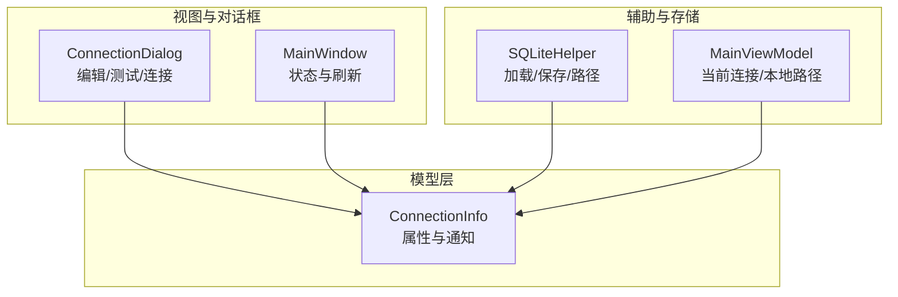
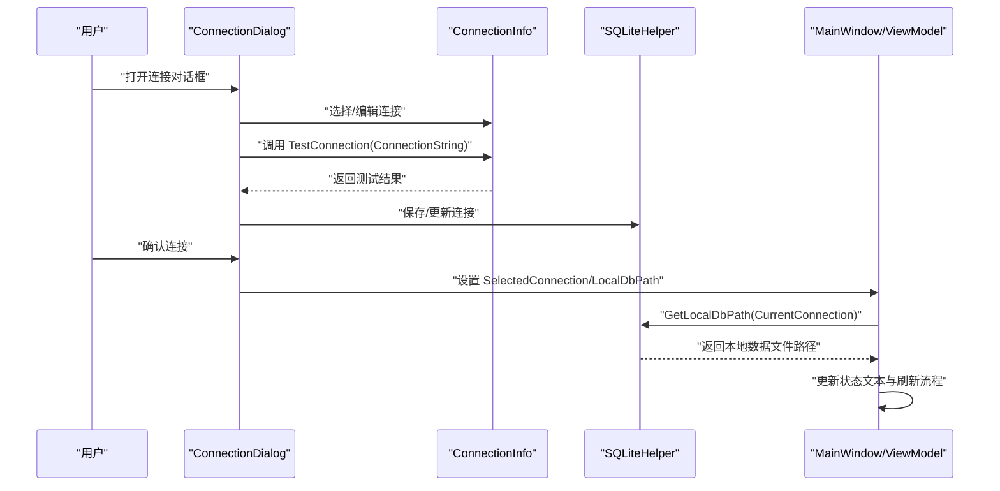
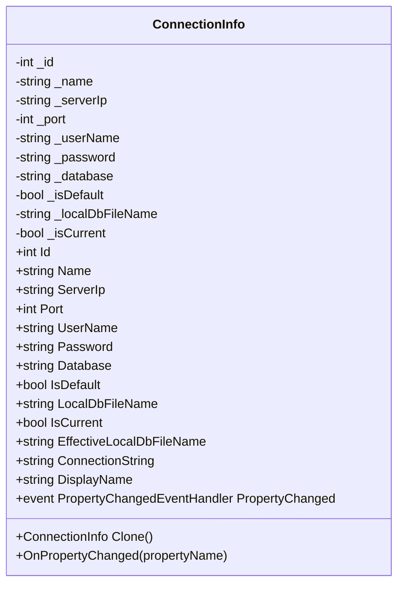
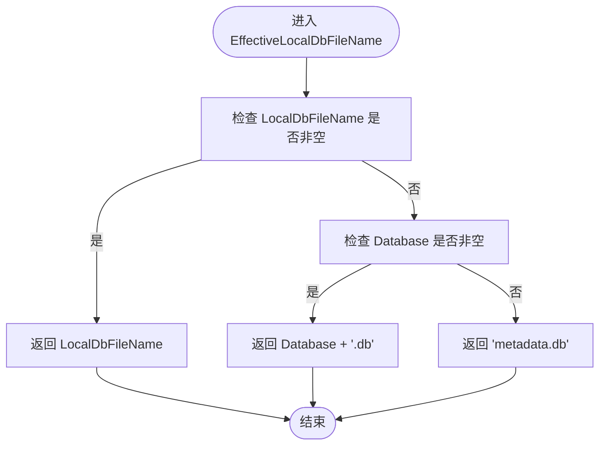
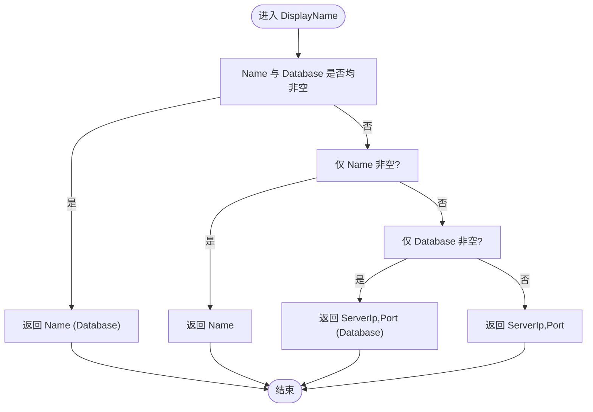
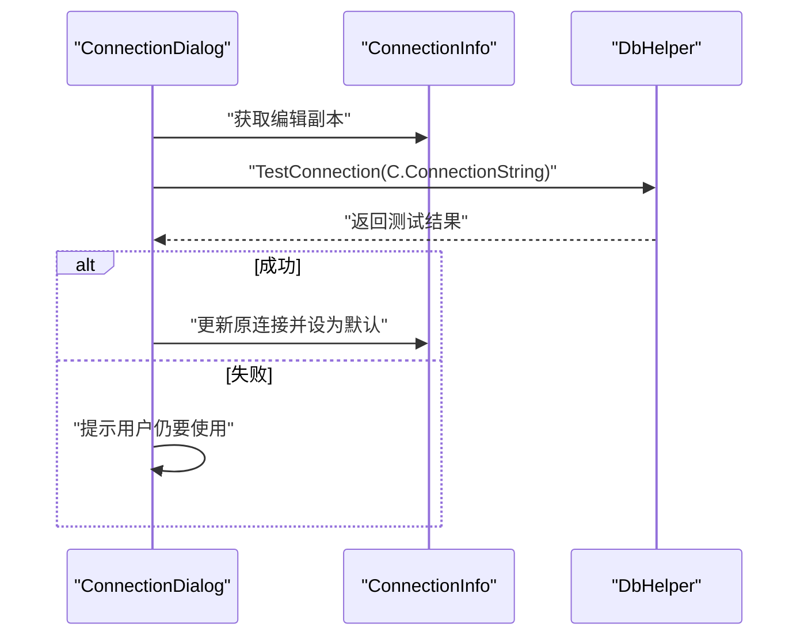
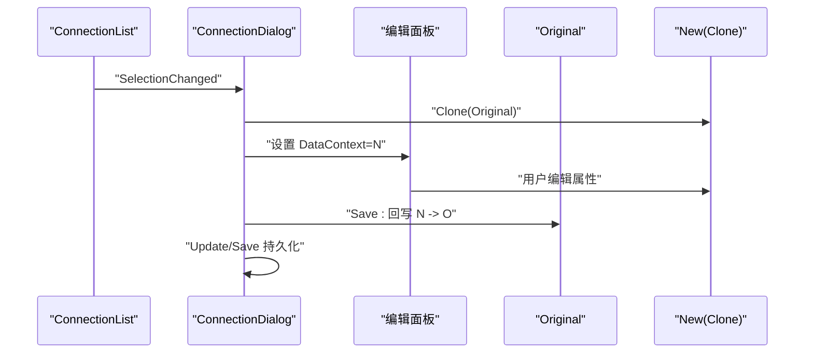
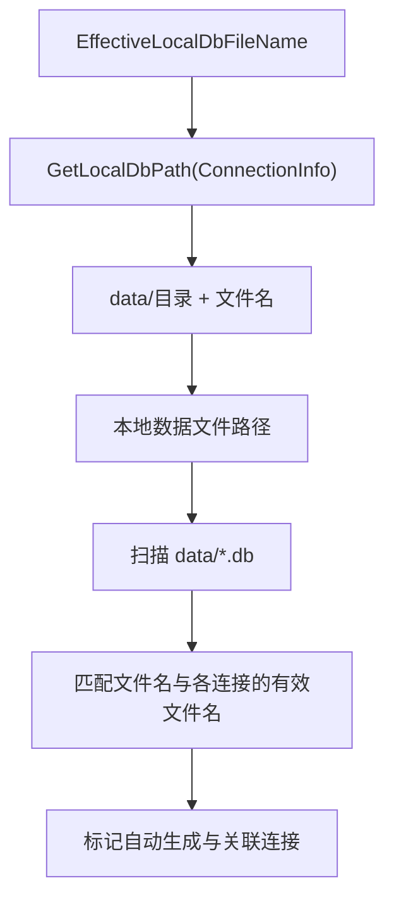
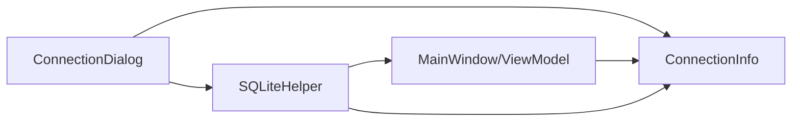

# 连接信息模型

<cite>
**本文档引用的文件**
- [ConnectionInfo.cs](file://Models/ConnectionInfo.cs)
- [ConnectionDialog.xaml.cs](file://ConnectionDialog.xaml.cs)
- [SQLiteHelper.cs](file://Helpers/SQLiteHelper.cs)
- [MainWindow.xaml.cs](file://MainWindow.xaml.cs)
- [MainViewModel.cs](file://ViewModels/MainViewModel.cs)
</cite>

## 目录
1. [简介](#简介)
2. [项目结构](#项目结构)
3. [核心组件](#核心组件)
4. [架构总览](#架构总览)
5. [详细组件分析](#详细组件分析)
6. [依赖关系分析](#依赖关系分析)
7. [性能考虑](#性能考虑)
8. [故障排查指南](#故障排查指南)
9. [结论](#结论)

## 简介
本文件围绕 ConnectionInfo 连接信息模型进行系统化文档化，重点覆盖以下方面：
- 数据结构设计：Id、Name、ServerIp、Port、UserName、Password、Database、IsDefault、LocalDbFileName 等核心属性的定义与用途
- INotifyPropertyChanged 接口实现机制与属性变更通知工作原理
- EffectiveLocalDbFileName 属性的优先级逻辑与 DisplayName 属性的显示规则
- ConnectionString 属性的构建方式与实际使用示例
- Clone() 方法的深拷贝实现与最佳实践建议
- 在应用中的典型使用流程与关键交互点

## 项目结构
ConnectionInfo 位于 Models 命名空间下，作为跨模块共享的领域模型，广泛参与 UI 编辑、SQLite 存储、本地数据文件命名以及主窗口状态展示等场景。

图表来源
- [ConnectionInfo.cs:1-144](file://Models/ConnectionInfo.cs#L1-L144)
- [ConnectionDialog.xaml.cs:1-490](file://ConnectionDialog.xaml.cs#L1-L490)
- [SQLiteHelper.cs:200-370](file://Helpers/SQLiteHelper.cs#L200-L370)
- [MainWindow.xaml.cs:1-800](file://MainWindow.xaml.cs#L1-L800)
- [MainViewModel.cs:1-200](file://ViewModels/MainViewModel.cs#L1-L200)

章节来源
- [ConnectionInfo.cs:1-144](file://Models/ConnectionInfo.cs#L1-L144)
- [ConnectionDialog.xaml.cs:1-490](file://ConnectionDialog.xaml.cs#L1-L490)
- [SQLiteHelper.cs:200-370](file://Helpers/SQLiteHelper.cs#L200-L370)
- [MainWindow.xaml.cs:1-800](file://MainWindow.xaml.cs#L1-L800)
- [MainViewModel.cs:1-200](file://ViewModels/MainViewModel.cs#L1-L200)

## 核心组件
- ConnectionInfo：实现 INotifyPropertyChanged，提供连接参数、UI 显示与本地数据文件命名所需的计算属性
- ConnectionDialog：负责连接的增删改查、测试连接、选择本地数据文件等交互
- SQLiteHelper：负责连接信息的持久化与本地数据文件路径计算
- MainViewModel/MainWindow：负责根据当前连接更新 UI 状态、本地数据路径与元数据刷新

章节来源
- [ConnectionInfo.cs:6-142](file://Models/ConnectionInfo.cs#L6-L142)
- [ConnectionDialog.xaml.cs:35-222](file://ConnectionDialog.xaml.cs#L35-L222)
- [SQLiteHelper.cs:208-213](file://Helpers/SQLiteHelper.cs#L208-L213)
- [MainViewModel.cs:84-88](file://ViewModels/MainViewModel.cs#L84-L88)

## 架构总览
ConnectionInfo 作为数据模型贯穿以下关键流程：
- UI 编辑：ConnectionDialog 将用户输入映射到 ConnectionInfo，并通过 INotifyPropertyChanged 触发 UI 更新
- 测试连接：使用 ConnectionInfo.ConnectionString 进行连通性校验
- 本地数据：通过 EffectiveLocalDbFileName 计算本地 SQLite 文件名，再由 SQLiteHelper 组合完整路径
- 主界面状态：MainWindow/ViewModel 根据 CurrentConnection 更新状态文本与刷新流程

图表来源
- [ConnectionDialog.xaml.cs:135-222](file://ConnectionDialog.xaml.cs#L135-L222)
- [ConnectionInfo.cs:98-104](file://Models/ConnectionInfo.cs#L98-L104)
- [SQLiteHelper.cs:208-213](file://Helpers/SQLiteHelper.cs#L208-L213)
- [MainWindow.xaml.cs:52-85](file://MainWindow.xaml.cs#L52-L85)

## 详细组件分析

### 数据结构与属性定义
- Id：连接标识符，支持排序与默认连接标记
- Name：连接名称，用于 UI 显示与友好区分
- ServerIp：数据库服务器地址
- Port：数据库端口
- UserName/Password：认证凭据
- Database：数据库名称
- IsDefault：是否为默认连接（影响新建连接的初始状态）
- LocalDbFileName：本地数据文件名（可为空，表示使用数据库名推导）

章节来源
- [ConnectionInfo.cs:18-70](file://Models/ConnectionInfo.cs#L18-L70)

### INotifyPropertyChanged 实现机制
- 每个属性均提供 setter，在赋值后调用 OnPropertyChanged()
- OnPropertyChanged 使用 CallerMemberName 特性自动传递属性名
- UI 绑定通过数据上下文与属性变更通知实现双向同步

图表来源
- [ConnectionInfo.cs:6-142](file://Models/ConnectionInfo.cs#L6-L142)

章节来源
- [ConnectionInfo.cs:136-141](file://Models/ConnectionInfo.cs#L136-L141)

### EffectiveLocalDbFileName 优先级逻辑
- 若 LocalDbFileName 非空，直接使用该值
- 否则若 Database 非空，使用 Database + ".db"
- 否则使用默认文件名 "metadata.db"

图表来源
- [ConnectionInfo.cs:83-96](file://Models/ConnectionInfo.cs#L83-L96)

章节来源
- [ConnectionInfo.cs:83-96](file://Models/ConnectionInfo.cs#L83-L96)

### DisplayName 显示规则
- 若 Name 与 Database 均非空，显示 "Name (Database)"
- 否则若仅 Name 非空，显示 Name
- 否则若仅 Database 非空，显示 "ServerIp,Port (Database)"
- 否则显示 "ServerIp,Port"

图表来源
- [ConnectionInfo.cs:106-118](file://Models/ConnectionInfo.cs#L106-L118)

章节来源
- [ConnectionInfo.cs:106-118](file://Models/ConnectionInfo.cs#L106-L118)

### ConnectionString 构建方式与使用示例
- 构建格式：Server=ServerIp,Port;Database=Database;User Id=UserName;Password=Password;
- 使用场景：
  - ConnectionDialog 测试连接：对编辑副本调用测试
  - MainWindow 刷新元数据：基于当前连接的 ConnectionString 创建远程连接上下文
  - SQLiteHelper：组合本地数据文件路径（与 ConnectionString 无关）

图表来源
- [ConnectionDialog.xaml.cs:135-222](file://ConnectionDialog.xaml.cs#L135-L222)
- [ConnectionInfo.cs:98-104](file://Models/ConnectionInfo.cs#L98-L104)

章节来源
- [ConnectionInfo.cs:98-104](file://Models/ConnectionInfo.cs#L98-L104)
- [ConnectionDialog.xaml.cs:135-222](file://ConnectionDialog.xaml.cs#L135-L222)
- [MainWindow.xaml.cs:444-538](file://MainWindow.xaml.cs#L444-L538)

### Clone() 方法的深拷贝实现与最佳实践
- 实现方式：构造新 ConnectionInfo 并逐项复制各属性
- 最佳实践：
  - 编辑前克隆：在 ConnectionDialog 中对选中连接进行 Clone()，避免直接修改原对象
  - 保存时回写：编辑完成后将修改回写到原始连接对象并持久化
  - 密码安全：密码字段在 UI 中单独处理，避免明文暴露

图表来源
- [ConnectionDialog.xaml.cs:54-133](file://ConnectionDialog.xaml.cs#L54-L133)
- [ConnectionInfo.cs:120-134](file://Models/ConnectionInfo.cs#L120-L134)

章节来源
- [ConnectionInfo.cs:120-134](file://Models/ConnectionInfo.cs#L120-L134)
- [ConnectionDialog.xaml.cs:54-133](file://ConnectionDialog.xaml.cs#L54-L133)

### 与本地数据文件的集成
- 本地数据文件命名：由 ConnectionInfo.EffectiveLocalDbFileName 决定
- 路径计算：SQLiteHelper.GetLocalDbPath(connection) 将数据目录与文件名拼接
- 文件扫描与关联：ScanLocalDataFiles() 会将文件名与各连接的 EffectiveLocalDbFileName 匹配，标记自动生成文件及其关联连接

图表来源
- [ConnectionInfo.cs:83-96](file://Models/ConnectionInfo.cs#L83-L96)
- [SQLiteHelper.cs:208-213](file://Helpers/SQLiteHelper.cs#L208-L213)
- [SQLiteHelper.cs:218-254](file://Helpers/SQLiteHelper.cs#L218-L254)

章节来源
- [ConnectionInfo.cs:83-96](file://Models/ConnectionInfo.cs#L83-L96)
- [SQLiteHelper.cs:208-213](file://Helpers/SQLiteHelper.cs#L208-L213)
- [SQLiteHelper.cs:218-254](file://Helpers/SQLiteHelper.cs#L218-L254)

## 依赖关系分析
- ConnectionDialog 依赖 ConnectionInfo 进行编辑与测试；依赖 SQLiteHelper 进行持久化与本地数据文件管理
- MainWindow/ViewModel 依赖 ConnectionInfo 的 DisplayName 与 ConnectionString 更新 UI 状态与刷新流程
- SQLiteHelper 依赖 ConnectionInfo 的 EffectiveLocalDbFileName 进行本地数据文件命名与迁移

图表来源
- [ConnectionDialog.xaml.cs:35-222](file://ConnectionDialog.xaml.cs#L35-L222)
- [MainWindow.xaml.cs:52-85](file://MainWindow.xaml.cs#L52-L85)
- [SQLiteHelper.cs:208-213](file://Helpers/SQLiteHelper.cs#L208-L213)

章节来源
- [ConnectionDialog.xaml.cs:35-222](file://ConnectionDialog.xaml.cs#L35-L222)
- [MainWindow.xaml.cs:52-85](file://MainWindow.xaml.cs#L52-L85)
- [SQLiteHelper.cs:208-213](file://Helpers/SQLiteHelper.cs#L208-L213)

## 性能考虑
- 属性变更通知：INotifyPropertyChanged 仅触发必要的 UI 更新，避免全量刷新
- 本地数据文件命名：EffectiveLocalDbFileName 为纯计算属性，开销极低
- 连接字符串：ConnectionString 为简单字符串拼接，性能开销可忽略
- 建议：在批量更新属性时，尽量合并多次赋值以减少 OnPropertyChanged 调用次数

## 故障排查指南
- 连接测试失败
  - 检查 ServerIp、Port、Database、UserName、Password 是否正确
  - 使用 ConnectionDialog 的“测试连接”功能定位问题
- 本地数据文件缺失
  - 确认 MainWindow/ViewModel 的 LocalDbPath 是否指向有效文件
  - 检查 SQLiteHelper.ScanLocalDataFiles() 是否能正确识别文件
- 默认连接未生效
  - 确认 IsDefault 标记与 SQLiteHelper.SetDefault 的调用顺序
- 显示异常
  - 检查 DisplayName 的优先级逻辑：Name 与 Database 的空值组合会影响最终显示

章节来源
- [ConnectionDialog.xaml.cs:135-222](file://ConnectionDialog.xaml.cs#L135-L222)
- [MainWindow.xaml.cs:428-442](file://MainWindow.xaml.cs#L428-L442)
- [SQLiteHelper.cs:218-254](file://Helpers/SQLiteHelper.cs#L218-L254)

## 结论
ConnectionInfo 作为连接信息的核心模型，通过清晰的属性设计、完善的 INotifyPropertyChanged 支持与明确的本地数据命名策略，实现了从 UI 编辑、连接测试到本地数据管理的完整闭环。遵循 Clone() 深拷贝与密码安全处理的最佳实践，可在保证用户体验的同时提升系统的安全性与稳定性。