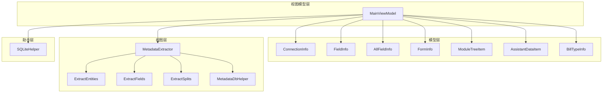
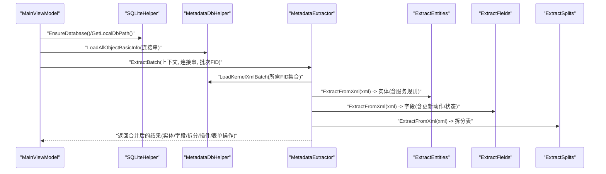
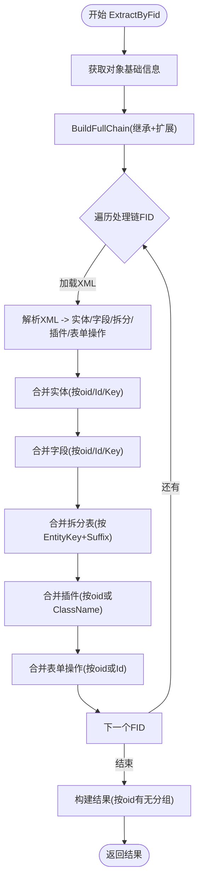
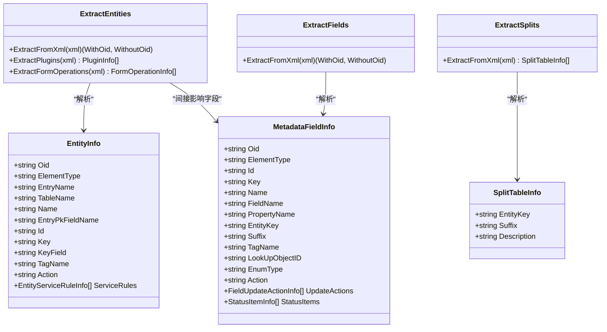
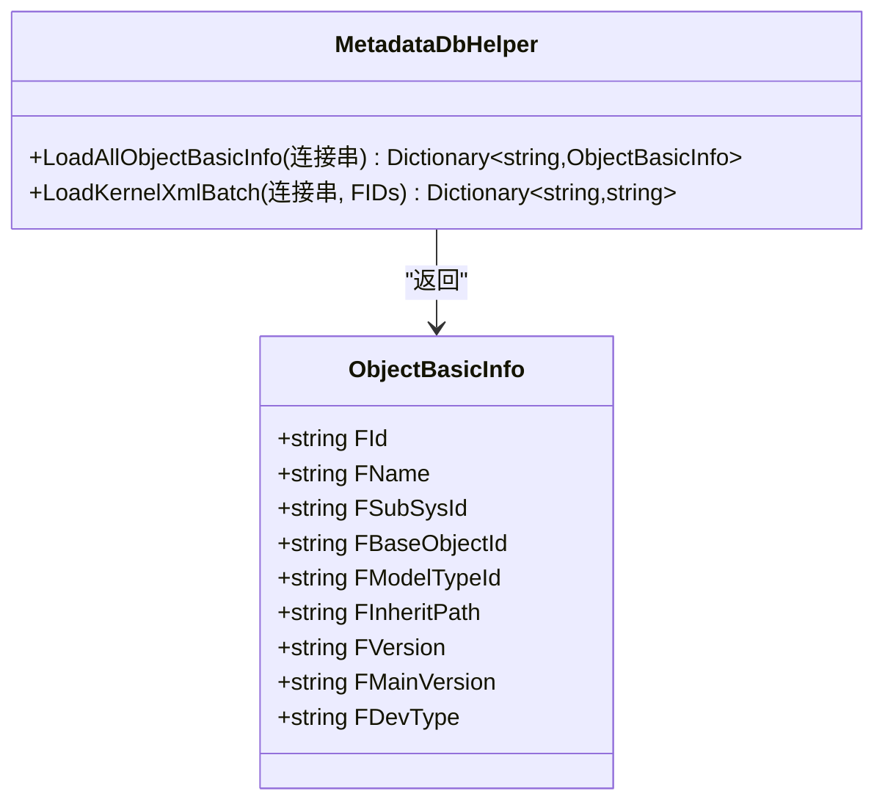
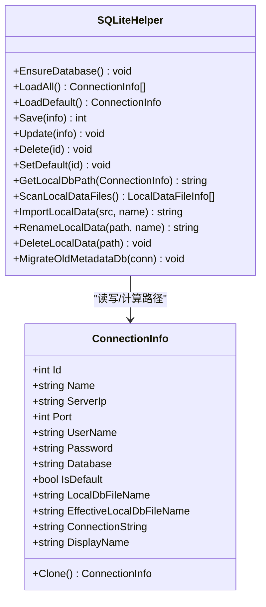
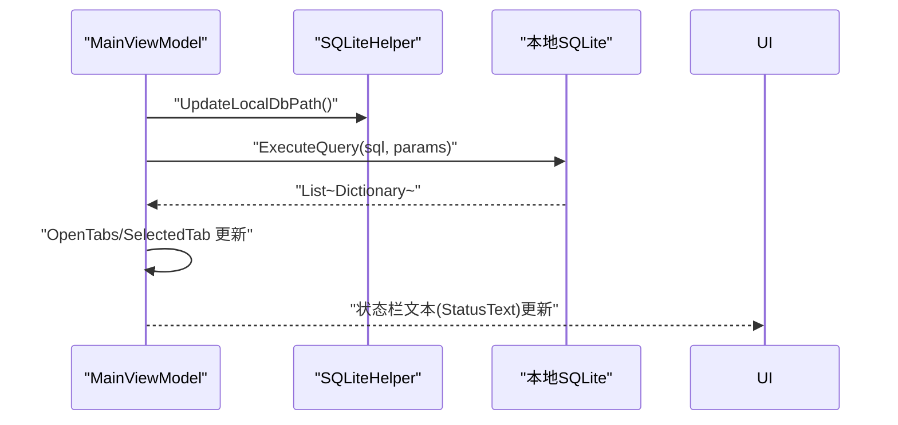
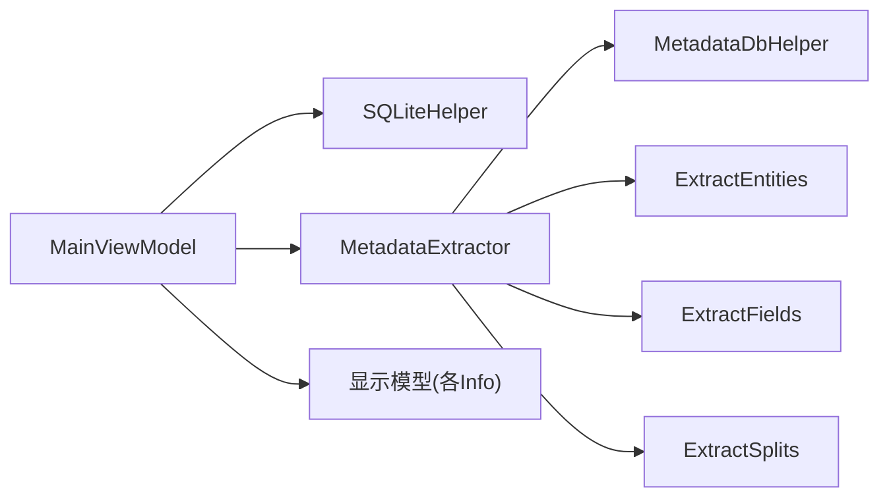

# 核心模块

<cite>
**本文档引用的文件**
- [ConnectionInfo.cs](file://Models/ConnectionInfo.cs)
- [FieldInfo.cs](file://Models/FieldInfo.cs)
- [FormInfo.cs](file://Models/FormInfo.cs)
- [ModuleTreeItem.cs](file://Models/ModuleTreeItem.cs)
- [AllFieldInfo.cs](file://Models/AllFieldInfo.cs)
- [AssistantDataItem.cs](file://Models/AssistantDataItem.cs)
- [BillTypeInfo.cs](file://Models/BillTypeInfo.cs)
- [MetadataExtractor.cs](file://Views/MetadataExtractor.cs)
- [ExtractEntities.cs](file://Views/ExtractEntities.cs)
- [ExtractFields.cs](file://Views/ExtractFields.cs)
- [ExtractSplits.cs](file://Views/ExtractSplits.cs)
- [MetadataDbHelper.cs](file://Views/MetadataDbHelper.cs)
- [SQLiteHelper.cs](file://Helpers/SQLiteHelper.cs)
- [MainViewModel.cs](file://ViewModels/MainViewModel.cs)
</cite>

## 目录
1. [简介](#简介)
2. [项目结构](#项目结构)
3. [核心组件](#核心组件)
4. [架构总览](#架构总览)
5. [详细组件分析](#详细组件分析)
6. [依赖关系分析](#依赖关系分析)
7. [性能考虑](#性能考虑)
8. [故障排查指南](#故障排查指南)
9. [结论](#结论)
10. [附录](#附录)

## 简介
本文件聚焦于金蝶K3 Cloud数据字典系统的核心模块，系统围绕“连接配置”“元数据抽取与合并”“本地数据存储与查询”三大主线展开。本文将深入解析以下关键数据模型与处理流程：
- 连接配置模型：ConnectionInfo
- 字段模型：FieldInfo、AllFieldInfo
- 表单模型：FormInfo
- 模块树模型：ModuleTreeItem
- 元数据抽取与合并：MetadataExtractor、ExtractEntities、ExtractFields、ExtractSplits、MetadataDbHelper
- 本地数据管理：SQLiteHelper
- 视图模型与UI交互：MainViewModel

## 项目结构
项目采用分层与职责分离的设计：
- Models：领域模型与显示模型，承载UI绑定与展示数据
- Views：元数据抽取与解析逻辑，负责XML解析、继承链与扩展链合并
- Helpers：本地SQLite存储与连接管理
- ViewModels：应用状态、命令与业务逻辑协调
- CLI与资源：命令行工具与文档示例（本篇重点聚焦核心模块）

**图表来源**
- [ConnectionInfo.cs:6-142](file://Models/ConnectionInfo.cs#L6-L142)
- [FieldInfo.cs:6-108](file://Models/FieldInfo.cs#L6-L108)
- [AllFieldInfo.cs:6-47](file://Models/AllFieldInfo.cs#L6-L47)
- [FormInfo.cs:6-98](file://Models/FormInfo.cs#L6-L98)
- [ModuleTreeItem.cs:7-57](file://Models/ModuleTreeItem.cs#L7-L57)
- [AssistantDataItem.cs:6-54](file://Models/AssistantDataItem.cs#L6-L54)
- [BillTypeInfo.cs:6-41](file://Models/BillTypeInfo.cs#L6-L41)
- [MetadataExtractor.cs:289-360](file://Views/MetadataExtractor.cs#L289-L360)
- [ExtractEntities.cs:47-291](file://Views/ExtractEntities.cs#L47-L291)
- [ExtractFields.cs:70-165](file://Views/ExtractFields.cs#L70-L165)
- [ExtractSplits.cs:28-58](file://Views/ExtractSplits.cs#L28-L58)
- [MetadataDbHelper.cs:36-127](file://Views/MetadataDbHelper.cs#L36-L127)
- [SQLiteHelper.cs:10-368](file://Helpers/SQLiteHelper.cs#L10-L368)
- [MainViewModel.cs:18-800](file://ViewModels/MainViewModel.cs#L18-L800)

**章节来源**
- [MainViewModel.cs:18-215](file://ViewModels/MainViewModel.cs#L18-L215)
- [SQLiteHelper.cs:17-53](file://Helpers/SQLiteHelper.cs#L17-L53)

## 核心组件
本节对关键数据模型进行定义与用途说明，并给出典型使用场景。

- ConnectionInfo：封装连接参数、显示名、默认标记、本地数据库文件名及连接串生成逻辑，支持克隆与属性变更通知，用于UI绑定与数据库连接。
- FieldInfo：描述字段元数据，包含字段标识、属性名、元素类型、枚举/查找引用、更新动作计数等，支持属性变更通知。
- AllFieldInfo：用于“所有字段”聚合展示，包含表单名、实体名、字段名、属性名、元素类型、查找/枚举引用、拆分描述、更新动作计数等。
- FormInfo：描述表单元数据，包含标识、名称、模型类型、子系统、插件与操作计数等，支持属性变更通知与显示计数。
- ModuleTreeItem：模块树节点，支持展开/选择、子节点集合与属性变更通知，用于导航与筛选。

这些模型均实现INotifyPropertyChanged，确保UI与数据同步。

**章节来源**
- [ConnectionInfo.cs:6-142](file://Models/ConnectionInfo.cs#L6-L142)
- [FieldInfo.cs:6-108](file://Models/FieldInfo.cs#L6-L108)
- [AllFieldInfo.cs:6-47](file://Models/AllFieldInfo.cs#L6-L47)
- [FormInfo.cs:6-98](file://Models/FormInfo.cs#L6-L98)
- [ModuleTreeItem.cs:7-57](file://Models/ModuleTreeItem.cs#L7-L57)

## 架构总览
系统核心流程分为“连接与本地数据准备”“元数据抽取与合并”“本地查询与展示”三个阶段。

**图表来源**
- [MainViewModel.cs:246-275](file://ViewModels/MainViewModel.cs#L246-L275)
- [SQLiteHelper.cs:17-53](file://Helpers/SQLiteHelper.cs#L17-L53)
- [MetadataDbHelper.cs:44-79](file://Views/MetadataDbHelper.cs#L44-L79)
- [MetadataExtractor.cs:299-311](file://Views/MetadataExtractor.cs#L299-L311)
- [ExtractEntities.cs:49-58](file://Views/ExtractEntities.cs#L49-L58)
- [ExtractFields.cs:72-81](file://Views/ExtractFields.cs#L72-L81)
- [ExtractSplits.cs:30-36](file://Views/ExtractSplits.cs#L30-L36)

## 详细组件分析

### 元数据抽取与合并（MetadataExtractor）
该组件负责：
- 构建处理链：基于继承路径与扩展映射，生成“根→继承链→扩展链”的处理顺序
- 批量加载XML：按需收集所需FID，一次性批量查询内核XML
- 分层合并：按实体/字段/拆分表/插件/表单操作分别进行合并，遵循oid优先、action=remove删除、action=edit覆盖的规则

**图表来源**
- [MetadataExtractor.cs:322-360](file://Views/MetadataExtractor.cs#L322-L360)
- [MetadataExtractor.cs:338-354](file://Views/MetadataExtractor.cs#L338-L354)
- [MetadataExtractor.cs:365-397](file://Views/MetadataExtractor.cs#L365-L397)

**章节来源**
- [MetadataExtractor.cs:102-284](file://Views/MetadataExtractor.cs#L102-L284)
- [MetadataExtractor.cs:299-360](file://Views/MetadataExtractor.cs#L299-L360)
- [MetadataExtractor.cs:616-648](file://Views/MetadataExtractor.cs#L616-L648)
- [MetadataExtractor.cs:658-690](file://Views/MetadataExtractor.cs#L658-L690)
- [MetadataExtractor.cs:825-845](file://Views/MetadataExtractor.cs#L825-L845)

### XML解析与实体/字段/拆分抽取（ExtractEntities、ExtractFields、ExtractSplits）
- ExtractEntities：解析实体与实体服务规则，提取FormPlugins/ListPlugins/WebFormBuilderPlugins与FormOperations及其子项
- ExtractFields：解析字段、更新动作（值更新事件）、状态项（ElementType=40）
- ExtractSplits：解析拆分表，记录实体键与后缀描述

**图表来源**
- [ExtractEntities.cs:47-291](file://Views/ExtractEntities.cs#L47-L291)
- [ExtractFields.cs:70-165](file://Views/ExtractFields.cs#L70-L165)
- [ExtractSplits.cs:28-58](file://Views/ExtractSplits.cs#L28-L58)

**章节来源**
- [ExtractEntities.cs:49-139](file://Views/ExtractEntities.cs#L49-L139)
- [ExtractEntities.cs:144-274](file://Views/ExtractEntities.cs#L144-L274)
- [ExtractFields.cs:72-164](file://Views/ExtractFields.cs#L72-L164)
- [ExtractSplits.cs:30-56](file://Views/ExtractSplits.cs#L30-L56)

### 基础信息与XML加载（MetadataDbHelper）
- ObjectBasicInfo：承载对象基础信息（FID、名称、子系统、继承路径、版本、开发类型等），用于构建继承链与扩展链
- LoadAllObjectBasicInfo：一次性查询所有对象基础信息，供内存构建处理链
- LoadKernelXmlBatch：按FID集合批量查询内核XML，返回FID→XML映射

**图表来源**
- [MetadataDbHelper.cs:11-31](file://Views/MetadataDbHelper.cs#L11-L31)
- [MetadataDbHelper.cs:44-79](file://Views/MetadataDbHelper.cs#L44-L79)
- [MetadataDbHelper.cs:87-127](file://Views/MetadataDbHelper.cs#L87-L127)

**章节来源**
- [MetadataDbHelper.cs:44-79](file://Views/MetadataDbHelper.cs#L44-L79)
- [MetadataDbHelper.cs:87-127](file://Views/MetadataDbHelper.cs#L87-L127)

### 连接与本地数据管理（ConnectionInfo、SQLiteHelper）
- ConnectionInfo：封装连接参数、显示名、默认标记、本地数据库文件名与连接串生成逻辑，支持克隆
- SQLiteHelper：负责本地SQLite数据库初始化、连接保存/更新/删除、默认连接设置、本地数据文件扫描/导入/重命名/迁移

**图表来源**
- [ConnectionInfo.cs:6-142](file://Models/ConnectionInfo.cs#L6-L142)
- [SQLiteHelper.cs:17-53](file://Helpers/SQLiteHelper.cs#L17-L53)
- [SQLiteHelper.cs:209-213](file://Helpers/SQLiteHelper.cs#L209-L213)
- [SQLiteHelper.cs:218-254](file://Helpers/SQLiteHelper.cs#L218-L254)
- [SQLiteHelper.cs:260-303](file://Helpers/SQLiteHelper.cs#L260-L303)
- [SQLiteHelper.cs:317-338](file://Helpers/SQLiteHelper.cs#L317-L338)
- [SQLiteHelper.cs:345-367](file://Helpers/SQLiteHelper.cs#L345-L367)

**章节来源**
- [ConnectionInfo.cs:86-118](file://Models/ConnectionInfo.cs#L86-L118)
- [SQLiteHelper.cs:17-53](file://Helpers/SQLiteHelper.cs#L17-L53)
- [SQLiteHelper.cs:209-213](file://Helpers/SQLiteHelper.cs#L209-L213)

### 视图模型与业务规则（MainViewModel）
- 负责连接切换、本地数据路径更新、树形模块加载、各类明细页打开（实体、字段、枚举、单据类型、辅助资料、服务规则等）
- 通过SQLite查询本地数据，动态构建标签页并维护状态栏信息

**图表来源**
- [MainViewModel.cs:280-290](file://ViewModels/MainViewModel.cs#L280-L290)
- [MainViewModel.cs:292-321](file://ViewModels/MainViewModel.cs#L292-L321)
- [MainViewModel.cs:131-172](file://ViewModels/MainViewModel.cs#L131-L172)

**章节来源**
- [MainViewModel.cs:246-275](file://ViewModels/MainViewModel.cs#L246-L275)
- [MainViewModel.cs:323-357](file://ViewModels/MainViewModel.cs#L323-L357)
- [MainViewModel.cs:359-407](file://ViewModels/MainViewModel.cs#L359-L407)
- [MainViewModel.cs:412-451](file://ViewModels/MainViewModel.cs#L412-L451)
- [MainViewModel.cs:456-490](file://ViewModels/MainViewModel.cs#L456-L490)
- [MainViewModel.cs:495-518](file://ViewModels/MainViewModel.cs#L495-L518)
- [MainViewModel.cs:523-557](file://ViewModels/MainViewModel.cs#L523-L557)
- [MainViewModel.cs:562-572](file://ViewModels/MainViewModel.cs#L562-L572)
- [MainViewModel.cs:574-599](file://ViewModels/MainViewModel.cs#L574-L599)
- [MainViewModel.cs:604-654](file://ViewModels/MainViewModel.cs#L604-L654)
- [MainViewModel.cs:659-731](file://ViewModels/MainViewModel.cs#L659-L731)
- [MainViewModel.cs:736-786](file://ViewModels/MainViewModel.cs#L736-L786)
- [MainViewModel.cs:789-800](file://ViewModels/MainViewModel.cs#L789-L800)

## 依赖关系分析
- 视图模型依赖SQLiteHelper进行本地数据路径与连接管理，依赖MetadataExtractor进行元数据抽取
- 元数据抽取依赖MetadataDbHelper进行基础信息与XML加载
- 实体/字段/拆分抽取器独立于上下文，仅负责XML解析
- 显示模型（FieldInfo、AllFieldInfo、FormInfo、ModuleTreeItem等）仅承担UI绑定与展示

**图表来源**
- [MainViewModel.cs:18-215](file://ViewModels/MainViewModel.cs#L18-L215)
- [MetadataExtractor.cs:289-360](file://Views/MetadataExtractor.cs#L289-L360)
- [MetadataDbHelper.cs:36-127](file://Views/MetadataDbHelper.cs#L36-L127)
- [ExtractEntities.cs:47-291](file://Views/ExtractEntities.cs#L47-L291)
- [ExtractFields.cs:70-165](file://Views/ExtractFields.cs#L70-L165)
- [ExtractSplits.cs:28-58](file://Views/ExtractSplits.cs#L28-L58)

**章节来源**
- [MainViewModel.cs:18-215](file://ViewModels/MainViewModel.cs#L18-L215)
- [MetadataExtractor.cs:289-360](file://Views/MetadataExtractor.cs#L289-L360)

## 性能考虑
- 批量加载XML：通过CollectNeededFids收集全链所需FID，再一次性LoadKernelXmlBatch，避免多次往返数据库
- 内存构建处理链：在MetadataContext中构建扩展映射与目标FID集合，减少运行时重复计算
- 字典合并策略：以oid/Id/Key为键的字典合并，时间复杂度近似O(n)，适合大规模实体/字段
- UI绑定优化：所有模型实现INotifyPropertyChanged，避免不必要的UI刷新

[本节为通用指导，不直接分析具体文件]

## 故障排查指南
- 连接失败：检查ConnectionInfo.ConnectionString与服务器可达性；确认数据库凭据正确
- 本地数据缺失：调用SQLiteHelper.EnsureDatabase()确保connections.db存在；确认EffectiveLocalDbFileName与实际文件名一致
- 元数据为空：确认ExtractBatch返回的xmlCache非空；检查FID是否存在于基础信息表
- 合并异常：关注action=remove导致的删除逻辑；确认oid/Id/Key匹配键是否正确

**章节来源**
- [ConnectionInfo.cs:98-118](file://Models/ConnectionInfo.cs#L98-L118)
- [SQLiteHelper.cs:17-53](file://Helpers/SQLiteHelper.cs#L17-L53)
- [MetadataExtractor.cs:322-360](file://Views/MetadataExtractor.cs#L322-L360)

## 结论
本核心模块通过清晰的分层与职责划分，实现了从连接管理、元数据抽取与合并到本地数据查询与展示的完整闭环。关键在于：
- 以MetadataContext构建继承与扩展处理链，保证抽取顺序正确
- 以字典合并策略实现oid优先、action语义的覆盖/删除/新增
- 以SQLiteHelper统一管理本地数据文件与连接配置
- 以MainViewModel协调UI与数据流，提供丰富的明细页与导航能力

[本节为总结性内容，不直接分析具体文件]

## 附录
- 使用模式建议
  - 连接管理：通过SQLiteHelper保存/更新连接，MainViewModel在ApplyConnectionAsync中切换连接并更新本地路径
  - 元数据刷新：先构建MetadataContext，再调用ExtractBatch，最后写入本地SQLite
  - UI打开明细：根据字段/表单/实体等触发相应查询，构建ModuleTabItem并加入OpenTabs

[本节为概念性内容，不直接分析具体文件]