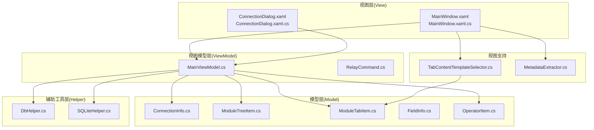
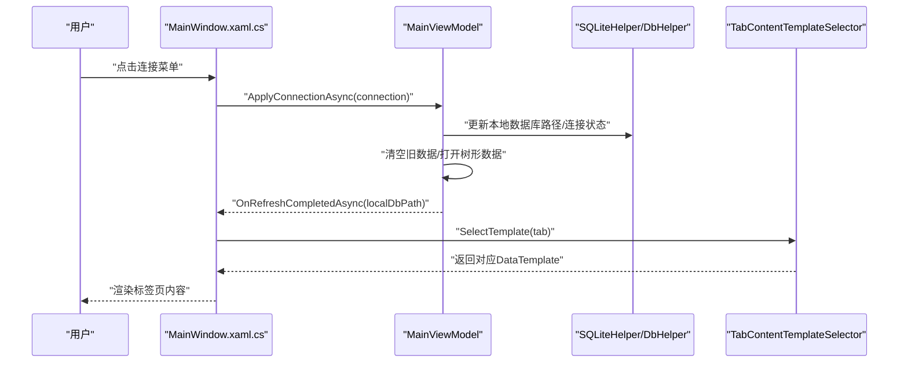
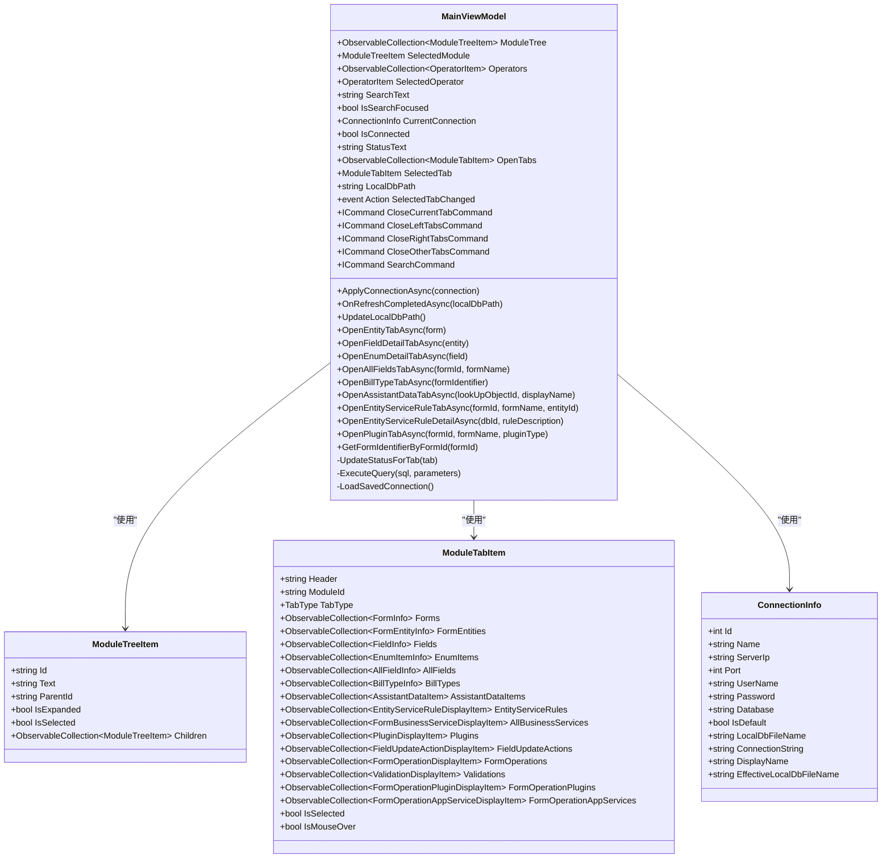
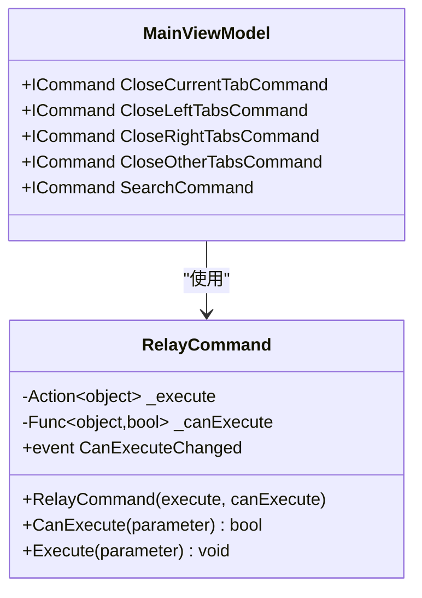
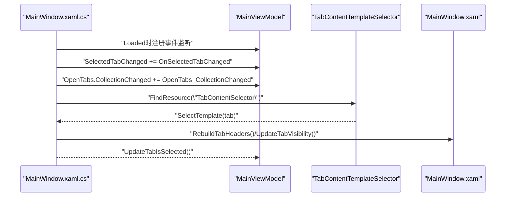
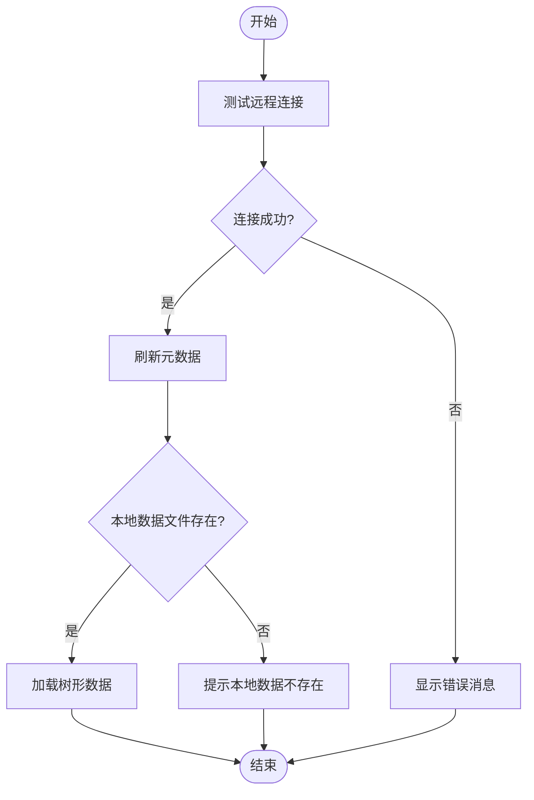
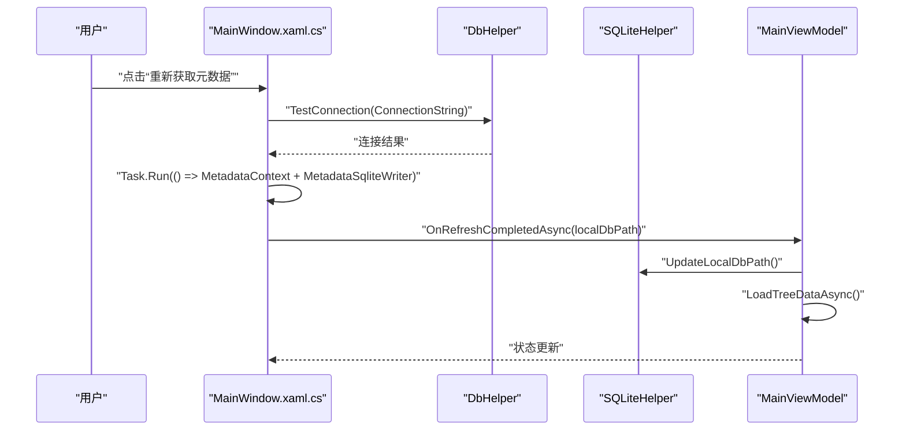
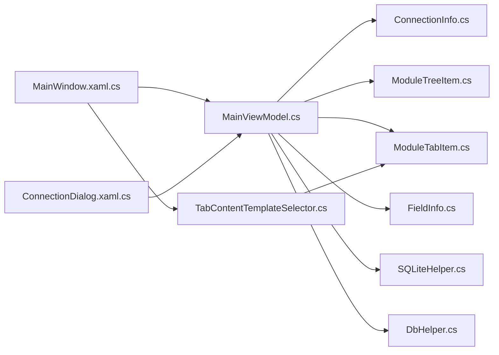

# MVVM架构设计

<cite>
**本文档引用的文件**
- [MainViewModel.cs](file://ViewModels/MainViewModel.cs)
- [RelayCommand.cs](file://ViewModels/RelayCommand.cs)
- [MainWindow.xaml.cs](file://MainWindow.xaml.cs)
- [MainWindow.xaml](file://MainWindow.xaml)
- [ConnectionDialog.xaml](file://ConnectionDialog.xaml)
- [FieldInfo.cs](file://Models/FieldInfo.cs)
- [ModuleTreeItem.cs](file://Models/ModuleTreeItem.cs)
- [ModuleTabItem.cs](file://Models/ModuleTabItem.cs)
- [ConnectionInfo.cs](file://Models/ConnectionInfo.cs)
- [OperatorItem.cs](file://Models/OperatorItem.cs)
- [SQLiteHelper.cs](file://Helpers/SQLiteHelper.cs)
- [DbHelper.cs](file://Helpers/DbHelper.cs)
- [TabContentTemplateSelector.cs](file://TabContentTemplateSelector.cs)
- [App.xaml.cs](file://App.xaml.cs)
- [MetadataExtractor.cs](file://Views/MetadataExtractor.cs)
</cite>

## 目录
1. [引言](#引言)
2. [项目结构](#项目结构)
3. [核心组件](#核心组件)
4. [架构总览](#架构总览)
5. [详细组件分析](#详细组件分析)
6. [依赖关系分析](#依赖关系分析)
7. [性能考虑](#性能考虑)
8. [故障排除指南](#故障排除指南)
9. [结论](#结论)
10. [附录](#附录)

## 引言
本项目基于MVVM（Model-View-ViewModel）模式构建，面向金蝶K3 Cloud数据字典系统，提供元数据浏览、本地SQLite数据管理、远程连接配置与刷新等功能。本文档聚焦于MainViewModel的设计理念与实现细节，深入解析依赖属性绑定、命令模式应用、数据验证机制、以及RelayCommand命令绑定机制的工作原理与使用方法，并结合WPF中的View与ViewModel分离、数据绑定机制、事件处理等实践，给出架构图与代码示例路径，帮助开发者正确使用MVVM进行界面开发。

## 项目结构
项目采用典型的MVVM分层组织方式：
- 视图层（View）：MainWindow.xaml、ConnectionDialog.xaml及其后台代码
- 视图模型层（ViewModel）：MainViewModel.cs、RelayCommand.cs
- 模型层（Model）：各类业务模型（如ConnectionInfo、ModuleTreeItem、ModuleTabItem、FieldInfo等）
- 辅助工具层（Helper）：DbHelper、SQLiteHelper等
- 视图支持：TabContentTemplateSelector.cs、XAML资源模板

**图表来源**
- [MainWindow.xaml.cs:30-86](file://MainWindow.xaml.cs#L30-L86)
- [MainViewModel.cs:18-215](file://ViewModels/MainViewModel.cs#L18-L215)
- [ConnectionDialog.xaml:1-239](file://ConnectionDialog.xaml#L1-L239)
- [SQLiteHelper.cs:10-53](file://Helpers/SQLiteHelper.cs#L10-L53)
- [DbHelper.cs:7-25](file://Helpers/DbHelper.cs#L7-L25)
- [TabContentTemplateSelector.cs:7-49](file://TabContentTemplateSelector.cs#L7-L49)
- [MetadataExtractor.cs:98-284](file://Views/MetadataExtractor.cs#L98-L284)

**章节来源**
- [MainWindow.xaml.cs:30-86](file://MainWindow.xaml.cs#L30-L86)
- [MainWindow.xaml:22-24](file://MainWindow.xaml#L22-L24)
- [MainViewModel.cs:18-215](file://ViewModels/MainViewModel.cs#L18-L215)

## 核心组件
- MainViewModel：应用的核心视图模型，负责树形模块导航、标签页管理、搜索、连接管理、元数据刷新、状态更新等。实现了INotifyPropertyChanged，大量使用依赖属性绑定与命令绑定。
- RelayCommand：轻量级命令实现，满足ICommand接口，支持CanExecute动态判定与CommandManager.RequerySuggested事件驱动的可执行性刷新。
- 模型层：ConnectionInfo、ModuleTreeItem、ModuleTabItem、FieldInfo等均实现INotifyPropertyChanged，确保UI与数据同步。
- 视图层：MainWindow.xaml集中定义了数据模板、命令绑定、输入绑定、上下文菜单等；ConnectionDialog.xaml负责连接与本地数据管理。
- 辅助工具：SQLiteHelper负责连接信息存储与本地数据文件管理；DbHelper负责远程SQL连接测试与查询。

**章节来源**
- [MainViewModel.cs:18-215](file://ViewModels/MainViewModel.cs#L18-L215)
- [RelayCommand.cs:6-26](file://ViewModels/RelayCommand.cs#L6-L26)
- [FieldInfo.cs:6-107](file://Models/FieldInfo.cs#L6-L107)
- [ModuleTreeItem.cs:7-57](file://Models/ModuleTreeItem.cs#L7-L57)
- [ModuleTabItem.cs:9-193](file://Models/ModuleTabItem.cs#L9-L193)
- [ConnectionInfo.cs:6-141](file://Models/ConnectionInfo.cs#L6-L141)
- [OperatorItem.cs:3-7](file://Models/OperatorItem.cs#L3-L7)
- [MainWindow.xaml:16-24](file://MainWindow.xaml#L16-L24)
- [ConnectionDialog.xaml:16-239](file://ConnectionDialog.xaml#L16-L239)
- [SQLiteHelper.cs:10-53](file://Helpers/SQLiteHelper.cs#L10-L53)
- [DbHelper.cs:7-25](file://Helpers/DbHelper.cs#L7-L25)

## 架构总览
MVVM在本项目中的实现要点：
- 视图与视图模型分离：MainWindow.xaml.cs仅处理UI事件与模板选择，业务逻辑集中在MainViewModel。
- 数据绑定：依赖属性（ObservableCollection、普通属性）与XAML双向绑定，配合INotifyPropertyChanged触发UI更新。
- 命令绑定：通过RelayCommand封装命令执行逻辑，支持参数传递与CanExecute判定。
- 事件处理：视图层事件（如菜单点击、双击、键盘事件）委托给MainViewModel执行相应业务流程。
- 模板选择：TabContentTemplateSelector根据ModuleTabItem的TabType动态选择DataTemplate。

**图表来源**
- [MainWindow.xaml.cs:361-423](file://MainWindow.xaml.cs#L361-L423)
- [MainViewModel.cs:246-275](file://ViewModels/MainViewModel.cs#L246-L275)
- [SQLiteHelper.cs:209-213](file://Helpers/SQLiteHelper.cs#L209-L213)
- [TabContentTemplateSelector.cs:25-49](file://TabContentTemplateSelector.cs#L25-L49)

## 详细组件分析

### MainViewModel 设计与实现
设计理念：
- 单一职责：负责UI交互、数据加载、状态管理、命令执行。
- 数据驱动：通过依赖属性与INotifyPropertyChanged实现数据变更通知。
- 命令驱动：使用RelayCommand封装命令，避免在视图层编写业务逻辑。
- 异步处理：大量异步方法（如加载树、打开标签页、刷新元数据）提升响应性。

关键实现点：
- 依赖属性绑定：ModuleTree、Operators、SearchText、IsSearchFocused、CurrentConnection、IsConnected、StatusText、OpenTabs、SelectedTab、LocalDbPath等。
- 事件与状态：SelectedTabChanged事件用于标签页切换；UpdateStatusForTab根据TabType更新状态栏文本。
- 命令绑定：CloseCurrentTabCommand、CloseLeftTabsCommand、CloseRightTabsCommand、CloseOtherTabsCommand、SearchCommand等。
- 数据加载：LoadTreeDataAsync、OpenTabForModuleAsync、OpenEntityTabAsync、OpenFieldDetailTabAsync、OpenEnumDetailTabAsync、OpenAllFieldsTabAsync、OpenBillTypeTabAsync、OpenAssistantDataTabAsync、OpenEntityServiceRuleTabAsync、OpenEntityServiceRuleDetailAsync、OpenPluginTabAsync等。
- 本地数据：UpdateLocalDbPath、HasLocalData、ExecuteQuery（SQLite查询）、CheckLocalDataAvailability（本地数据可用性检查）。
- 连接管理：ApplyConnectionAsync、OnRefreshCompletedAsync、LoadSavedConnection。

**图表来源**
- [MainViewModel.cs:18-215](file://ViewModels/MainViewModel.cs#L18-L215)
- [ModuleTreeItem.cs:7-57](file://Models/ModuleTreeItem.cs#L7-L57)
- [ModuleTabItem.cs:9-193](file://Models/ModuleTabItem.cs#L9-L193)
- [ConnectionInfo.cs:6-141](file://Models/ConnectionInfo.cs#L6-L141)

**章节来源**
- [MainViewModel.cs:18-215](file://ViewModels/MainViewModel.cs#L18-L215)
- [MainViewModel.cs:246-275](file://ViewModels/MainViewModel.cs#L246-L275)
- [MainViewModel.cs:323-335](file://ViewModels/MainViewModel.cs#L323-L335)
- [MainViewModel.cs:359-407](file://ViewModels/MainViewModel.cs#L359-L407)
- [MainViewModel.cs:412-451](file://ViewModels/MainViewModel.cs#L412-L451)
- [MainViewModel.cs:456-490](file://ViewModels/MainViewModel.cs#L456-L490)
- [MainViewModel.cs:495-518](file://ViewModels/MainViewModel.cs#L495-L518)
- [MainViewModel.cs:523-557](file://ViewModels/MainViewModel.cs#L523-L557)
- [MainViewModel.cs:562-572](file://ViewModels/MainViewModel.cs#L562-L572)
- [MainViewModel.cs:574-599](file://ViewModels/MainViewModel.cs#L574-L599)
- [MainViewModel.cs:604-654](file://ViewModels/MainViewModel.cs#L604-L654)
- [MainViewModel.cs:659-731](file://ViewModels/MainViewModel.cs#L659-L731)
- [MainViewModel.cs:736-786](file://ViewModels/MainViewModel.cs#L736-L786)
- [MainViewModel.cs:791-806](file://ViewModels/MainViewModel.cs#L791-L806)

### RelayCommand 命令绑定机制
RelayCommand实现ICommand，提供：
- 构造函数接收执行动作与可执行性判定委托
- CanExecute通过委托判断，若未提供则默认true
- Execute调用执行动作
- CanExecuteChanged订阅CommandManager.RequerySuggested，实现UI可执行性自动刷新

使用方法：
- 在MainViewModel中以延迟初始化方式创建命令属性，如CloseCurrentTabCommand、CloseLeftTabsCommand等
- XAML中通过{Binding CloseCurrentTabCommand}绑定到按钮或快捷键
- 参数可通过CommandParameter传递，例如MainWindow.xaml中将Ctrl+W绑定到CloseCurrentTabCommand并传入SelectedTab

**图表来源**
- [RelayCommand.cs:6-26](file://ViewModels/RelayCommand.cs#L6-L26)
- [MainViewModel.cs:176-194](file://ViewModels/MainViewModel.cs#L176-L194)
- [MainWindow.xaml:16-20](file://MainWindow.xaml#L16-L20)

**章节来源**
- [RelayCommand.cs:6-26](file://ViewModels/RelayCommand.cs#L6-L26)
- [MainViewModel.cs:176-194](file://ViewModels/MainViewModel.cs#L176-L194)
- [MainWindow.xaml:16-20](file://MainWindow.xaml#L16-L20)

### 视图与ViewModel分离、数据绑定与事件处理
- 视图分离：MainWindow.xaml.cs仅处理Loaded、菜单点击、双击、键盘事件等，业务逻辑委托MainViewModel
- 数据绑定：MainWindow.xaml中通过{Binding}绑定到MainViewModel的依赖属性，如StatusText、OpenTabs、SelectedTab等
- 事件处理：TreeView_SelectedItemChanged、MenuConnection_Click、RefreshMetadata_Click、RefreshExtensionMetadata_Click、SearchTextBox_KeyDown等
- 模板选择：TabContentTemplateSelector根据TabType选择不同DataTemplate，实现标签页内容差异化展示

**图表来源**
- [MainWindow.xaml.cs:36-86](file://MainWindow.xaml.cs#L36-L86)
- [MainWindow.xaml.cs:88-106](file://MainWindow.xaml.cs#L88-L106)
- [MainWindow.xaml.cs:108-134](file://MainWindow.xaml.cs#L108-L134)
- [MainWindow.xaml.cs:338-351](file://MainWindow.xaml.cs#L338-L351)
- [TabContentTemplateSelector.cs:25-49](file://TabContentTemplateSelector.cs#L25-L49)

**章节来源**
- [MainWindow.xaml.cs:36-86](file://MainWindow.xaml.cs#L36-L86)
- [MainWindow.xaml.cs:88-106](file://MainWindow.xaml.cs#L88-L106)
- [MainWindow.xaml.cs:108-134](file://MainWindow.xaml.cs#L108-L134)
- [MainWindow.xaml.cs:338-351](file://MainWindow.xaml.cs#L338-L351)
- [MainWindow.xaml:163-800](file://MainWindow.xaml#L163-L800)
- [TabContentTemplateSelector.cs:7-49](file://TabContentTemplateSelector.cs#L7-L49)

### 数据验证机制
- 输入焦点与占位符可见性：通过IsSearchFocused与SearchText组合计算SearchPlaceholderVisible，实现搜索框占位符显示逻辑
- 远程连接测试：DbHelper.TestConnection在刷新元数据前进行连接有效性校验
- 本地数据可用性检查：CheckLocalDataAvailability在对话框关闭后检查本地数据文件是否存在，不存在则清空界面数据并更新状态

**图表来源**
- [MainWindow.xaml.cs:444-457](file://MainWindow.xaml.cs#L444-L457)
- [DbHelper.cs:9-25](file://Helpers/DbHelper.cs#L9-L25)
- [MainWindow.xaml.cs:428-442](file://MainWindow.xaml.cs#L428-L442)

**章节来源**
- [MainWindow.xaml.cs:650-669](file://MainWindow.xaml.cs#L650-L669)
- [DbHelper.cs:9-25](file://Helpers/DbHelper.cs#L9-L25)
- [MainWindow.xaml.cs:428-442](file://MainWindow.xaml.cs#L428-L442)

### 元数据刷新与本地数据管理
- 元数据刷新：MainWindow.xaml.cs中RefreshMetadata_Click与RefreshExtensionMetadata_Click分别触发全量与扩展元数据刷新，使用Task.Run异步执行，通过Dispatcher.Invoke更新UI状态
- 本地数据管理：SQLiteHelper提供连接信息存储、本地数据文件扫描、导入、重命名、删除、迁移等功能，支持按连接命名的本地数据文件

**图表来源**
- [MainWindow.xaml.cs:444-538](file://MainWindow.xaml.cs#L444-L538)
- [DbHelper.cs:9-25](file://Helpers/DbHelper.cs#L9-L25)
- [SQLiteHelper.cs:209-213](file://Helpers/SQLiteHelper.cs#L209-L213)
- [MainViewModel.cs:269-275](file://ViewModels/MainViewModel.cs#L269-L275)

**章节来源**
- [MainWindow.xaml.cs:444-538](file://MainWindow.xaml.cs#L444-L538)
- [SQLiteHelper.cs:209-213](file://Helpers/SQLiteHelper.cs#L209-L213)
- [MainViewModel.cs:269-275](file://ViewModels/MainViewModel.cs#L269-L275)

## 依赖关系分析
- 视图层依赖视图模型：MainWindow.xaml.cs依赖MainViewModel的事件与属性
- 视图模型依赖模型与辅助工具：MainViewModel依赖ConnectionInfo、ModuleTreeItem、ModuleTabItem、FieldInfo等模型，以及SQLiteHelper、DbHelper等工具
- 视图模板依赖模型：TabContentTemplateSelector根据ModuleTabItem的TabType选择DataTemplate
- 视图与视图模型解耦：MainWindow.xaml.cs仅处理UI事件，业务逻辑集中在MainViewModel

**图表来源**
- [MainWindow.xaml.cs:36-86](file://MainWindow.xaml.cs#L36-L86)
- [MainViewModel.cs:18-215](file://ViewModels/MainViewModel.cs#L18-L215)
- [ConnectionDialog.xaml:1-239](file://ConnectionDialog.xaml#L1-L239)
- [SQLiteHelper.cs:10-53](file://Helpers/SQLiteHelper.cs#L10-L53)
- [DbHelper.cs:7-25](file://Helpers/DbHelper.cs#L7-L25)
- [TabContentTemplateSelector.cs:7-49](file://TabContentTemplateSelector.cs#L7-L49)

**章节来源**
- [MainWindow.xaml.cs:36-86](file://MainWindow.xaml.cs#L36-L86)
- [MainViewModel.cs:18-215](file://ViewModels/MainViewModel.cs#L18-L215)
- [TabContentTemplateSelector.cs:25-49](file://TabContentTemplateSelector.cs#L25-L49)

## 性能考虑
- 异步加载：大量使用async/await与Task.Run，避免阻塞UI线程，如元数据刷新、标签页内容加载
- 延迟初始化命令：命令属性采用延迟初始化，减少不必要的对象创建
- 本地数据文件管理：SQLiteHelper提供文件扫描、导入、重命名、删除等操作，避免重复加载相同数据
- UI更新优化：通过INotifyPropertyChanged精确通知属性变化，避免全量刷新
- 模板复用：TabContentTemplateSelector统一管理模板选择，减少重复定义

## 故障排除指南
- 连接失败：使用DbHelper.TestConnection进行连接测试，捕获异常并提示错误信息
- 本地数据丢失：CheckLocalDataAvailability检测本地数据文件是否存在，不存在则清空界面数据并更新状态
- 元数据刷新异常：MainWindow.xaml.cs中通过Dispatcher.Invoke在UI线程更新状态，捕获异常并显示错误消息
- 命令不可执行：RelayCommand的CanExecute默认返回true，若需限制可提供canExecute委托；CommandManager.RequerySuggested会触发CanExecute重新评估

**章节来源**
- [DbHelper.cs:9-25](file://Helpers/DbHelper.cs#L9-L25)
- [MainWindow.xaml.cs:428-442](file://MainWindow.xaml.cs#L428-L442)
- [MainWindow.xaml.cs:520-532](file://MainWindow.xaml.cs#L520-L532)
- [RelayCommand.cs:17-25](file://ViewModels/RelayCommand.cs#L17-L25)

## 结论
本项目通过清晰的MVVM分层与完善的依赖注入（ViewModel依赖模型与工具），实现了视图与逻辑的高内聚低耦合。MainViewModel承担了主要业务逻辑，RelayCommand提供了简洁可靠的命令绑定机制，XAML数据绑定与事件处理保证了良好的用户体验。配合SQLiteHelper与DbHelper，系统具备了连接管理、本地数据管理与元数据刷新的完整能力。遵循本文档的最佳实践与性能建议，可进一步提升系统的稳定性与可维护性。

## 附录
- 使用建议
  - 在ViewModel中集中处理业务逻辑，避免在View中编写复杂逻辑
  - 使用RelayCommand封装命令，必要时提供CanExecute委托
  - 通过INotifyPropertyChanged精确通知属性变化，避免全量刷新
  - 异步处理耗时操作，保持UI响应性
  - 合理使用模板选择器，统一管理标签页内容展示