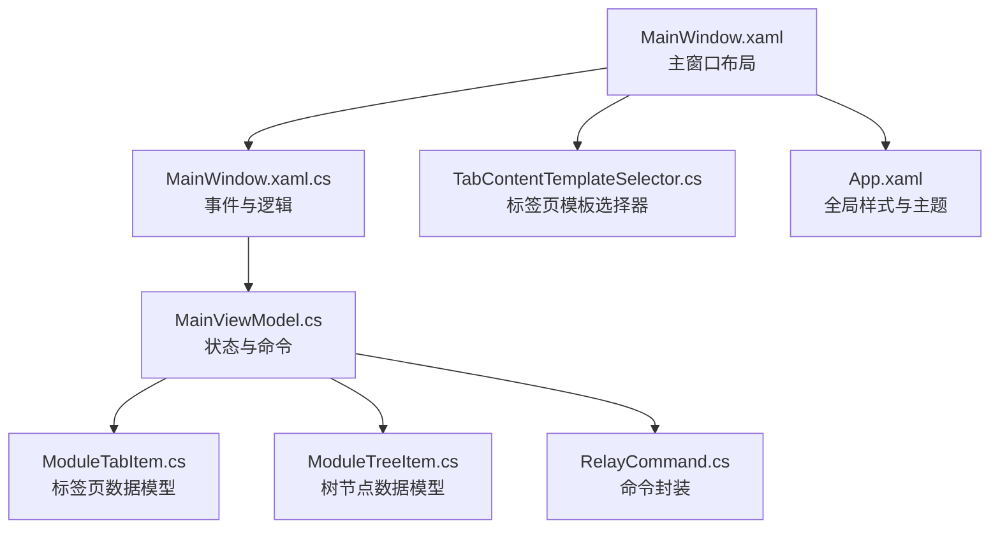
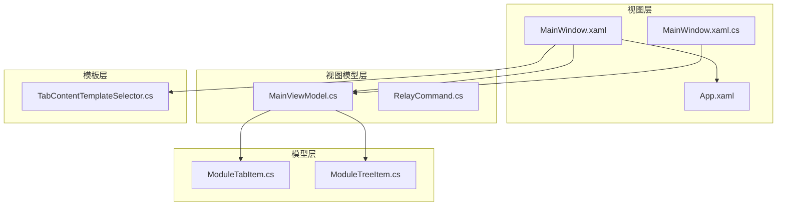
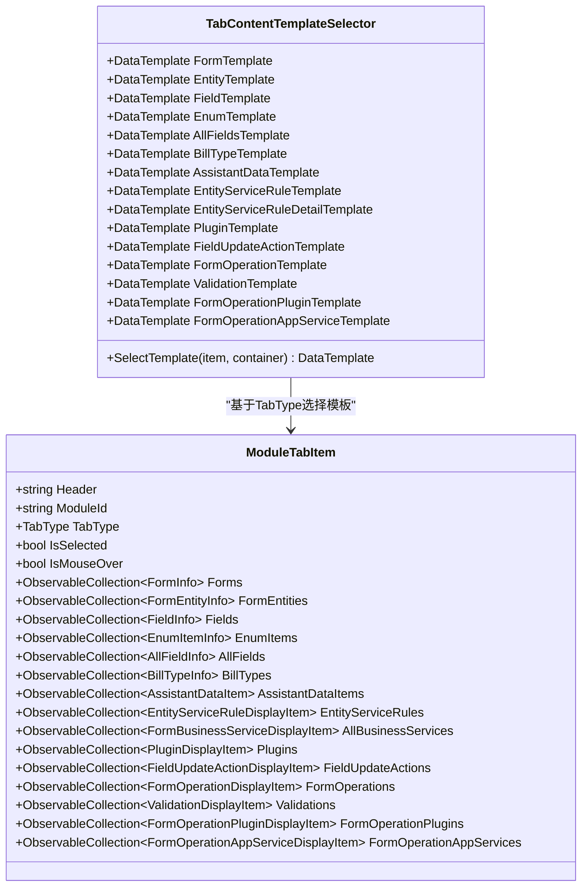
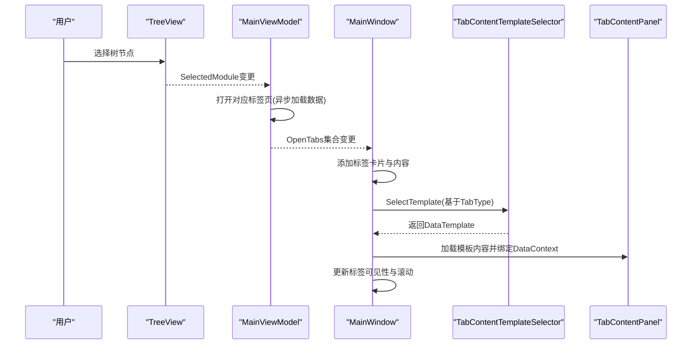
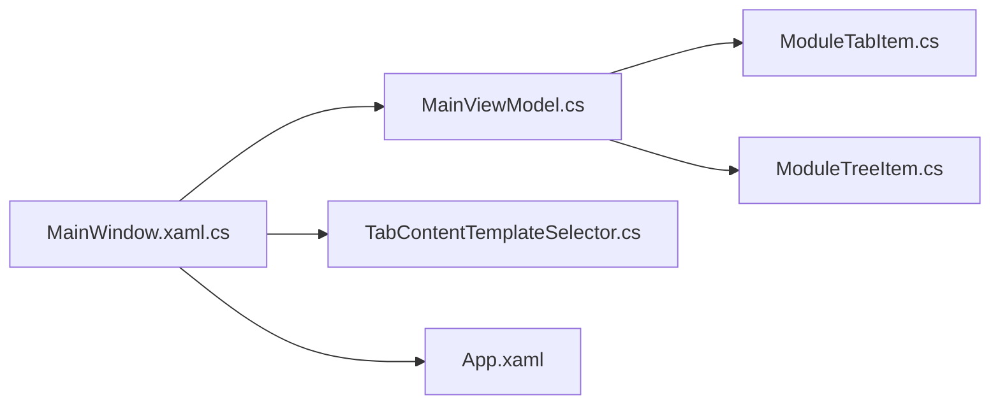

# 主窗口组件

<cite>
**本文档引用的文件**
- [MainWindow.xaml](file://MainWindow.xaml)
- [MainWindow.xaml.cs](file://MainWindow.xaml.cs)
- [TabContentTemplateSelector.cs](file://TabContentTemplateSelector.cs)
- [MainViewModel.cs](file://ViewModels/MainViewModel.cs)
- [ModuleTabItem.cs](file://Models/ModuleTabItem.cs)
- [ModuleTreeItem.cs](file://Models/ModuleTreeItem.cs)
- [RelayCommand.cs](file://ViewModels/RelayCommand.cs)
- [App.xaml](file://App.xaml)
</cite>

## 目录
1. [简介](#简介)
2. [项目结构](#项目结构)
3. [核心组件](#核心组件)
4. [架构总览](#架构总览)
5. [详细组件分析](#详细组件分析)
6. [依赖关系分析](#依赖关系分析)
7. [性能考虑](#性能考虑)
8. [故障排除指南](#故障排除指南)
9. [结论](#结论)
10. [附录](#附录)

## 简介
本文件面向金蝶K3 Cloud数据字典系统的主窗口组件（MainWindow），系统性阐述其布局设计、功能实现与交互机制，重点覆盖：
- 菜单栏、工具栏、状态栏、树形导航等UI组织方式
- 标签页系统的设计与实现，包括TabContentTemplateSelector选择器模式、动态内容加载、标签页切换动画与滚动行为
- 事件处理机制，涵盖用户交互响应、数据更新通知、异步操作处理
- 组件定制与扩展建议，包括样式修改、布局调整
- 实际使用场景与代码示例路径指引

## 项目结构
MainWindow位于应用根目录，采用XAML定义界面，C#代码隐藏负责事件与逻辑；视图模型（MainViewModel）承载状态与命令；模板选择器（TabContentTemplateSelector）驱动多标签页内容渲染；资源字典集中定义样式与控件主题。

图表来源
- [MainWindow.xaml](file://MainWindow.xaml)
- [MainWindow.xaml.cs](file://MainWindow.xaml.cs)
- [TabContentTemplateSelector.cs](file://TabContentTemplateSelector.cs)
- [App.xaml](file://App.xaml)
- [MainViewModel.cs](file://ViewModels/MainViewModel.cs)
- [ModuleTabItem.cs](file://Models/ModuleTabItem.cs)
- [ModuleTreeItem.cs](file://Models/ModuleTreeItem.cs)
- [RelayCommand.cs](file://ViewModels/RelayCommand.cs)

章节来源
- [MainWindow.xaml](file://MainWindow.xaml)
- [MainWindow.xaml.cs](file://MainWindow.xaml.cs)
- [App.xaml](file://App.xaml)

## 核心组件
- 主窗口布局与非客户端区域
  - 使用第三方控件库的Window容器，设置标题、图标、尺寸与最小尺寸
  - 非客户端区域放置“实体映射管理”下拉菜单按钮，支持右键上下文菜单
- 搜索栏与状态栏
  - 搜索栏包含图标、运算符选择、文本输入与查询按钮，支持占位提示与焦点状态
  - 状态栏显示连接状态与进度条，用于刷新元数据过程反馈
- 侧边栏树形导航
  - 业务模块树，支持展开/折叠与选中状态同步至视图模型
- 标签页系统
  - 顶部标签头区域，支持左右滚动与弹出式标签列表
  - 内容区域按模板动态加载对应标签页内容
- 模板选择器
  - 基于标签页类型（TabType）选择不同DataTemplate，实现内容差异化展示

章节来源
- [MainWindow.xaml](file://MainWindow.xaml)
- [MainWindow.xaml.cs](file://MainWindow.xaml.cs)
- [TabContentTemplateSelector.cs](file://TabContentTemplateSelector.cs)
- [MainViewModel.cs](file://ViewModels/MainViewModel.cs)
- [ModuleTabItem.cs](file://Models/ModuleTabItem.cs)
- [ModuleTreeItem.cs](file://Models/ModuleTreeItem.cs)
- [RelayCommand.cs](file://ViewModels/RelayCommand.cs)
- [App.xaml](file://App.xaml)

## 架构总览
MainWindow采用MVVM架构：XAML负责声明式UI与数据绑定，代码隐藏处理事件与复杂交互，视图模型承载业务状态与命令，模板选择器解耦内容渲染。

图表来源
- [MainWindow.xaml](file://MainWindow.xaml)
- [MainWindow.xaml.cs](file://MainWindow.xaml.cs)
- [MainViewModel.cs](file://ViewModels/MainViewModel.cs)
- [RelayCommand.cs](file://ViewModels/RelayCommand.cs)
- [ModuleTabItem.cs](file://Models/ModuleTabItem.cs)
- [ModuleTreeItem.cs](file://Models/ModuleTreeItem.cs)
- [TabContentTemplateSelector.cs](file://TabContentTemplateSelector.cs)
- [App.xaml](file://App.xaml)

## 详细组件分析

### 布局与导航组件
- 非客户端区域与连接菜单
  - 提供“实体映射管理”按钮，点击展开下拉菜单，包含连接管理、刷新元数据、刷新扩展元数据等选项
  - 支持右键菜单触发，便于快速关闭标签页与批量关闭
- 搜索栏
  - 包含运算符选择器、搜索文本框与查询按钮，支持回车触发查询
  - 占位提示在未聚焦且无输入时显示
- 状态栏
  - 左侧指示灯与状态文本，右侧进度条用于刷新元数据时的可视化反馈
- 侧边栏树形导航
  - 绑定ModuleTree集合，支持展开/折叠与选中状态双向绑定
  - 自定义TreeViewItem样式，统一视觉风格

章节来源
- [MainWindow.xaml](file://MainWindow.xaml)
- [MainWindow.xaml.cs](file://MainWindow.xaml.cs)
- [MainViewModel.cs](file://ViewModels/MainViewModel.cs)
- [ModuleTreeItem.cs](file://Models/ModuleTreeItem.cs)

### 标签页系统设计
- 标签头区域
  - 左右滚动按钮与标签列表容器，动态生成标签卡片（TabCard）
  - 标签卡片包含标题文本与关闭按钮，支持悬停与选中样式
  - 弹出式标签列表（Popup）支持快速切换与选择
- 内容面板
  - 使用TabContentTemplateSelector根据TabType选择DataTemplate
  - 每个标签页内容独立加载，初始隐藏，切换时可见性控制
- 模板选择器
  - 定义多种DataTemplate（表单、实体、字段、枚举、单据类型、辅助资料、服务规则、插件、值更新、表单操作、验证、服务插件、应用服务等）
  - SelectTemplate方法依据ModuleTabItem.TabType返回对应模板

图表来源
- [TabContentTemplateSelector.cs](file://TabContentTemplateSelector.cs)
- [ModuleTabItem.cs](file://Models/ModuleTabItem.cs)

章节来源
- [MainWindow.xaml](file://MainWindow.xaml)
- [MainWindow.xaml.cs](file://MainWindow.xaml.cs)
- [TabContentTemplateSelector.cs](file://TabContentTemplateSelector.cs)
- [ModuleTabItem.cs](file://Models/ModuleTabItem.cs)

### 动态内容加载与切换流程
- 标签页打开流程
  - 视图模型根据ModuleTreeItem选择结果创建ModuleTabItem并加载数据
  - MainWindow监听OpenTabs集合变化，动态创建标签卡片与内容面板
- 内容模板加载
  - 通过TabContentTemplateSelector.SelectTemplate获取模板，LoadContent加载FrameworkElement
  - 将ModuleTabItem作为DataContext绑定到内容，初始隐藏
- 切换与滚动
  - 选中标签改变时更新内容可见性与标签卡片选中状态
  - 滚动查看器根据选中标签位置自动滚动至可视区域

图表来源
- [MainWindow.xaml.cs](file://MainWindow.xaml.cs)
- [MainViewModel.cs](file://ViewModels/MainViewModel.cs)
- [TabContentTemplateSelector.cs](file://TabContentTemplateSelector.cs)

章节来源
- [MainWindow.xaml.cs](file://MainWindow.xaml.cs)
- [MainViewModel.cs](file://ViewModels/MainViewModel.cs)

### 事件处理机制
- 用户交互
  - 树节点选择：SelectedItemChanged事件同步到SelectedModule
  - 标签卡片点击：切换SelectedTab
  - 标签关闭：右键菜单或卡片关闭按钮触发
  - 搜索：文本框回车或按钮点击触发SearchCommand
- 数据更新通知
  - 视图模型实现INotifyPropertyChanged，属性变更通知UI
  - OpenTabs集合变更触发MainWindow重建标签头与内容
- 异步操作
  - 刷新元数据：后台线程执行，进度条与状态文本实时反馈
  - 查询与数据加载：Task.Run与Dispatcher.Invoke确保UI线程安全更新

章节来源
- [MainWindow.xaml.cs](file://MainWindow.xaml.cs)
- [MainViewModel.cs](file://ViewModels/MainViewModel.cs)
- [RelayCommand.cs](file://ViewModels/RelayCommand.cs)

### 样式与主题定制
- 全局样式
  - App.xaml集中定义颜色、画刷与DataGrid样式（单元格、列头、行头）
  - 通过静态资源统一应用到各DataGrid控件
- 标签页样式
  - 标签卡片使用多触发器实现悬停与选中效果
  - 关闭按钮模板与样式分离，支持悬停高亮
- 下拉菜单与上下文菜单
  - 自定义ControlTemplate与样式，统一视觉风格与阴影效果

章节来源
- [App.xaml](file://App.xaml)
- [MainWindow.xaml](file://MainWindow.xaml)

### 实际使用场景与示例路径
- 打开表单标签页
  - 触发路径：TreeView选择 -> MainViewModel.OpenTabForModuleAsync -> MainWindow.OpenTabs_CollectionChanged -> AddTabContent
  - 示例路径：[打开表单标签页流程](file://MainWindow.xaml.cs)
- 刷新元数据
  - 触发路径：连接菜单 -> RefreshMetadata_Click -> 后台任务 -> OnRefreshCompletedAsync
  - 示例路径：[刷新元数据流程](file://MainWindow.xaml.cs)
- 切换标签页
  - 触发路径：标签卡片点击 -> SelectedTab变更 -> UpdateTabVisibility
  - 示例路径：[标签切换逻辑](file://MainWindow.xaml.cs)
- 模板选择
  - 触发路径：AddTabContent -> SelectTemplate -> LoadContent
  - 示例路径：[模板选择器](file://TabContentTemplateSelector.cs)

章节来源
- [MainWindow.xaml.cs](file://MainWindow.xaml.cs)
- [TabContentTemplateSelector.cs](file://TabContentTemplateSelector.cs)

## 依赖关系分析
- 组件耦合
  - MainWindow与MainViewModel通过数据绑定强耦合，事件通过委托与命令弱耦合
  - TabContentTemplateSelector与ModuleTabItem通过TabType解耦
- 外部依赖
  - 第三方控件库（HandyControl）用于窗口、控件与Growl提示
  - SQLite用于本地元数据存储与查询
- 潜在循环依赖
  - 未见直接循环依赖；模板选择器与视图模型通过接口约定解耦

图表来源
- [MainWindow.xaml.cs](file://MainWindow.xaml.cs)
- [MainViewModel.cs](file://ViewModels/MainViewModel.cs)
- [TabContentTemplateSelector.cs](file://TabContentTemplateSelector.cs)
- [ModuleTabItem.cs](file://Models/ModuleTabItem.cs)
- [ModuleTreeItem.cs](file://Models/ModuleTreeItem.cs)
- [App.xaml](file://App.xaml)

章节来源
- [MainWindow.xaml.cs](file://MainWindow.xaml.cs)
- [MainViewModel.cs](file://ViewModels/MainViewModel.cs)
- [TabContentTemplateSelector.cs](file://TabContentTemplateSelector.cs)
- [ModuleTabItem.cs](file://Models/ModuleTabItem.cs)
- [ModuleTreeItem.cs](file://Models/ModuleTreeItem.cs)
- [App.xaml](file://App.xaml)

## 性能考虑
- 数据网格
  - 启用只读与行头样式复用，减少绘制开销
  - 列宽可调整但避免过度频繁重排
- 异步加载
  - 元数据刷新与查询使用后台线程，避免阻塞UI
  - 使用Dispatcher.Invoke确保线程安全更新UI
- 标签页渲染
  - 内容懒加载（首次显示才创建），减少启动时间
  - 标签卡片样式使用触发器，避免复杂模板导致的重绘

## 故障排除指南
- 连接失败
  - 刷新元数据前先测试远程数据库连接，失败时提示错误信息
  - 检查本地数据文件是否存在，不存在则清空主界面数据并提示
- 刷新冲突
  - 使用原子操作防止重复刷新，避免并发问题
- UI卡顿
  - 确保长耗时操作在后台线程执行，必要时增加进度反馈
- 样式不生效
  - 检查App.xaml资源是否正确合并，控件样式是否引用了正确的静态资源

章节来源
- [MainWindow.xaml.cs](file://MainWindow.xaml.cs)

## 结论
MainWindow通过清晰的MVVM分层与模板化标签页系统，实现了高效的数据字典浏览与管理体验。其事件驱动与异步处理机制保证了良好的交互流畅度；统一的样式体系提升了视觉一致性。通过模板选择器与动态内容加载，系统具备良好的扩展性，便于新增标签页类型与业务模块。

## 附录
- 扩展建议
  - 新增标签页类型：在TabType枚举与TabContentTemplateSelector中注册新模板
  - 自定义样式：在App.xaml中扩展对应样式资源，保持全局一致
  - 布局调整：通过Grid列宽与最小最大值约束，适配不同分辨率与窗口大小
- 常用命令
  - 关闭当前标签：CloseCurrentTabCommand
  - 关闭左侧/右侧/其他标签：CloseLeftTabsCommand/CloseRightTabsCommand/CloseOtherTabsCommand
  - 搜索：SearchCommand

章节来源
- [MainWindow.xaml](file://MainWindow.xaml)
- [RelayCommand.cs](file://ViewModels/RelayCommand.cs)
- [MainViewModel.cs](file://ViewModels/MainViewModel.cs)