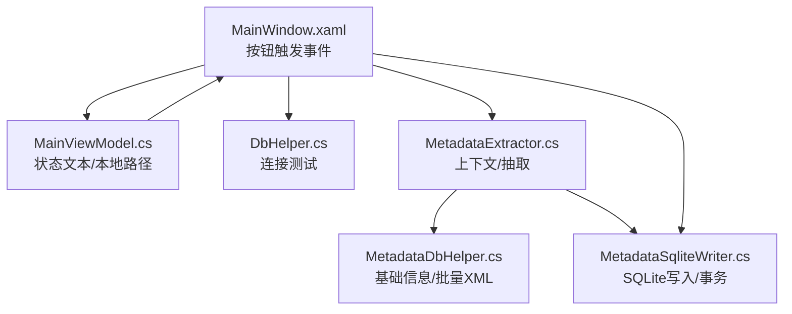
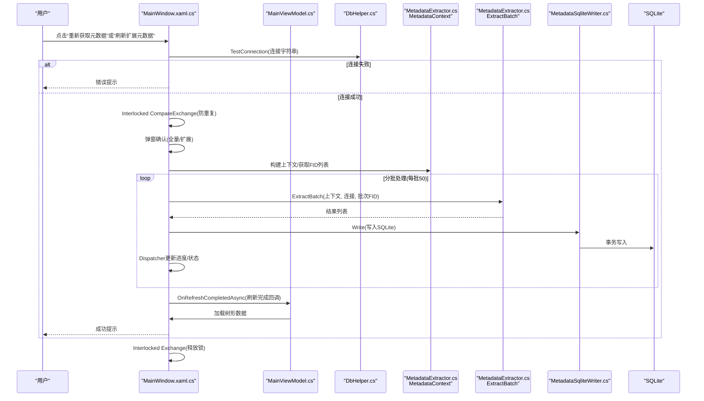
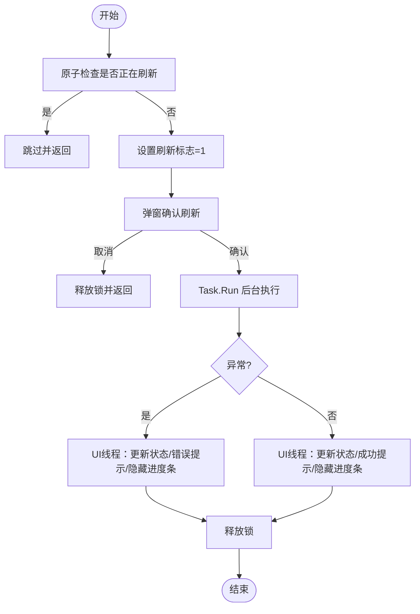
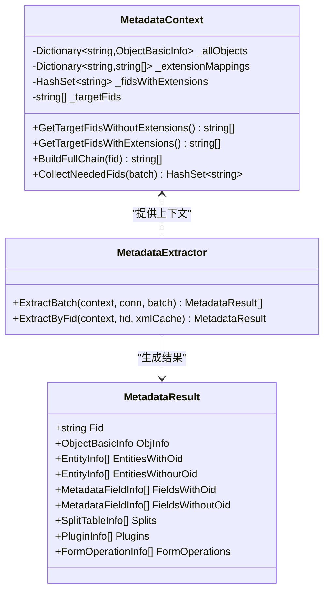
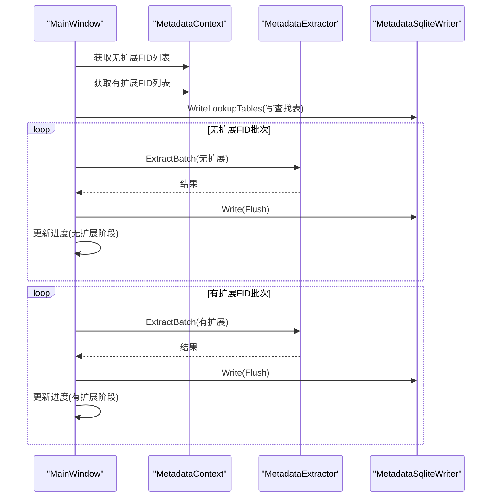
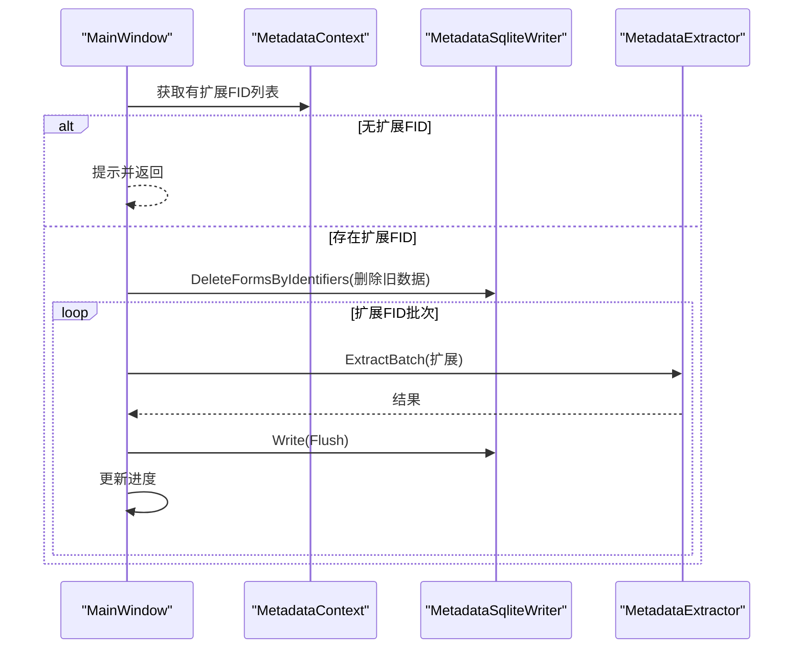
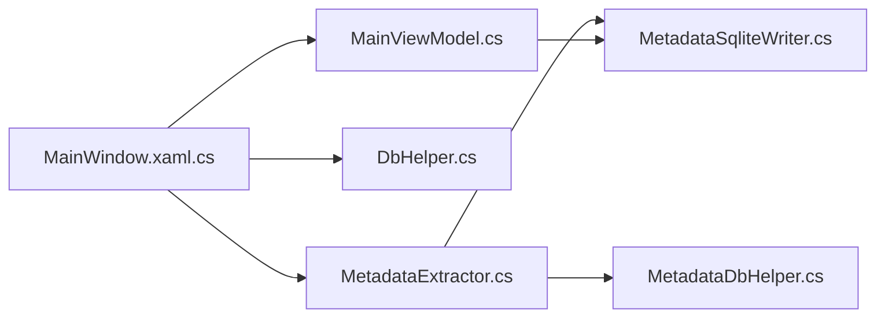

# 元数据刷新组件

<cite>
**本文档引用的文件**
- [MainWindow.xaml.cs](file://MainWindow.xaml.cs)
- [MainWindow.xaml](file://MainWindow.xaml)
- [MetadataExtractor.cs](file://Views/MetadataExtractor.cs)
- [MetadataSqliteWriter.cs](file://Views/MetadataSqliteWriter.cs)
- [MetadataDbHelper.cs](file://Views/MetadataDbHelper.cs)
- [MainViewModel.cs](file://ViewModels/MainViewModel.cs)
- [DbHelper.cs](file://Helpers/DbHelper.cs)
</cite>

## 目录
1. [简介](#简介)
2. [项目结构](#项目结构)
3. [核心组件](#核心组件)
4. [架构总览](#架构总览)
5. [详细组件分析](#详细组件分析)
6. [依赖关系分析](#依赖关系分析)
7. [性能考虑](#性能考虑)
8. [故障排除指南](#故障排除指南)
9. [结论](#结论)

## 简介
本文件面向金蝶K3 Cloud数据字典系统的“元数据刷新组件”，重点阐述两个刷新入口的区别与实现差异：  
- 全量刷新：RefreshMetadata_Click（重建表并刷新全部对象）
- 扩展刷新：RefreshExtensionMetadata_Click（仅针对存在扩展的对象进行增量更新）

文档将深入解析异步刷新机制（后台任务、Dispatcher更新UI）、进度条与状态文本联动、防重复刷新的原子操作、两阶段处理策略（无扩展FID与有扩展FID）、错误处理与用户反馈、以及性能优化建议与最佳实践。

## 项目结构
围绕元数据刷新的核心代码主要分布在以下模块：
- 视图层（UI）：MainWindow.xaml、MainWindow.xaml.cs
- 视图模型：MainViewModel.cs
- 辅助工具：DbHelper.cs
- 元数据抽取与写入：Views/MetadataExtractor.cs、Views/MetadataSqliteWriter.cs、Views/MetadataDbHelper.cs

图表来源
- [MainWindow.xaml.cs:444-648](file://MainWindow.xaml.cs#L444-L648)
- [MainViewModel.cs:269-275](file://ViewModels/MainViewModel.cs#L269-L275)
- [DbHelper.cs:9-25](file://Helpers/DbHelper.cs#L9-L25)
- [MetadataExtractor.cs:102-284](file://Views/MetadataExtractor.cs#L102-L284)
- [MetadataDbHelper.cs:36-129](file://Views/MetadataDbHelper.cs#L36-L129)
- [MetadataSqliteWriter.cs:9-50](file://Views/MetadataSqliteWriter.cs#L9-L50)

章节来源
- [MainWindow.xaml.cs:444-648](file://MainWindow.xaml.cs#L444-L648)
- [MainWindow.xaml:147-156](file://MainWindow.xaml#L147-L156)
- [MainViewModel.cs:269-275](file://ViewModels/MainViewModel.cs#L269-L275)

## 核心组件
- 刷新入口与UI交互
  - 全量刷新：MainWindow.xaml.cs 中的 RefreshMetadata_Click
  - 扩展刷新：MainWindow.xaml.cs 中的 RefreshExtensionMetadata_Click
- 异步执行与UI更新
  - 使用 Task.Run 在后台线程执行刷新流程
  - 使用 Dispatcher.Invoke 更新进度条与状态文本
  - 使用 Interlocked 原子操作防止重复刷新
- 元数据抽取与写入
  - MetadataExtractor：构建上下文、收集FID链、批量抽取XML并合并
  - MetadataSqliteWriter：创建/重建表、写入数据、事务提交、增量删除
  - MetadataDbHelper：一次性加载基础信息、批量查询XML
- 连接与验证
  - DbHelper：连接测试、SQL执行

章节来源
- [MainWindow.xaml.cs:444-648](file://MainWindow.xaml.cs#L444-L648)
- [MetadataExtractor.cs:102-360](file://Views/MetadataExtractor.cs#L102-L360)
- [MetadataSqliteWriter.cs:27-353](file://Views/MetadataSqliteWriter.cs#L27-L353)
- [MetadataDbHelper.cs:36-129](file://Views/MetadataDbHelper.cs#L36-L129)
- [DbHelper.cs:9-25](file://Helpers/DbHelper.cs#L9-L25)

## 架构总览
下图展示从UI到数据层的刷新调用链路，包括两阶段处理与错误处理路径：

图表来源
- [MainWindow.xaml.cs:444-648](file://MainWindow.xaml.cs#L444-L648)
- [DbHelper.cs:9-25](file://Helpers/DbHelper.cs#L9-L25)
- [MetadataExtractor.cs:299-311](file://Views/MetadataExtractor.cs#L299-L311)
- [MetadataSqliteWriter.cs:560-800](file://Views/MetadataSqliteWriter.cs#L560-L800)
- [MainViewModel.cs:269-275](file://ViewModels/MainViewModel.cs#L269-L275)

## 详细组件分析

### 1) 刷新入口对比：RefreshMetadata_Click vs RefreshExtensionMetadata_Click

- 共同点
  - 均进行远程连接有效性检测
  - 均使用 Interlocked 原子操作防止并发刷新
  - 均在后台线程执行，避免UI阻塞
  - 均通过 Dispatcher 更新进度条与状态文本
  - 均在完成后调用 OnRefreshCompletedAsync 并弹出成功提示

- 差异点
  - 触发范围
    - 全量刷新：重建 T_FORM、T_ENTITY、T_ENTITYSPLIT、T_FIELD 等核心表，写入查找表，随后处理两类FID（无扩展与有扩展）
    - 扩展刷新：仅针对存在扩展的FID，先删除这些对象在本地数据库中的旧数据，再重新写入
  - 前置条件
    - 全量刷新：不需要本地数据存在
    - 扩展刷新：要求已存在本地数据（HasLocalData）
  - 处理策略
    - 全量刷新：两阶段处理（无扩展→有扩展），分别统计总数并更新进度
    - 扩展刷新：仅处理有扩展的FID，若无扩展对象则提示“未发现存在扩展的元数据”

- 用户交互
  - 全量刷新：进度条最大值为“无扩展FID数 + 有扩展FID数”
  - 扩展刷新：进度条最大值为“有扩展FID数”，若为空则直接提示

章节来源
- [MainWindow.xaml.cs:444-538](file://MainWindow.xaml.cs#L444-L538)
- [MainWindow.xaml.cs:540-648](file://MainWindow.xaml.cs#L540-L648)
- [MainWindow.xaml:147-156](file://MainWindow.xaml#L147-L156)
- [MainViewModel.cs:129](file://ViewModels/MainViewModel.cs#L129)

### 2) 异步处理机制与UI联动

- 后台执行
  - 使用 Task.Run 包裹刷新流程，避免阻塞UI线程
- UI更新
  - 使用 Dispatcher.Invoke 在UI线程更新进度条与状态文本
  - 进度条可见性与最大值在开始时设置，结束时隐藏
- 防重复刷新
  - 使用 Interlocked.CompareExchange(ref _isRefreshing, 1, 0) 判断是否已有刷新任务
  - 成功进入后设置为1，异常或完成均通过 Interlocked.Exchange 归零

图表来源
- [MainWindow.xaml.cs:459-471](file://MainWindow.xaml.cs#L459-L471)
- [MainWindow.xaml.cs:533-537](file://MainWindow.xaml.cs#L533-L537)
- [MainWindow.xaml.cs:643-647](file://MainWindow.xaml.cs#L643-L647)

章节来源
- [MainWindow.xaml.cs:459-471](file://MainWindow.xaml.cs#L459-L471)
- [MainWindow.xaml.cs:533-537](file://MainWindow.xaml.cs#L533-L537)
- [MainWindow.xaml.cs:643-647](file://MainWindow.xaml.cs#L643-L647)

### 3) 两阶段处理策略：无扩展FID与有扩展FID

- 上下文构建
  - MetadataContext 一次性加载所有基础对象信息，构建扩展映射与存在扩展的FID集合
  - 提供 GetTargetFidsWithoutExtensions 与 GetTargetFidsWithExtensions 两类FID列表
- 批量抽取与合并
  - ExtractBatch 收集完整处理链（继承链+扩展链）→ 批量加载XML → 逐个提取并合并
  - 合并规则：实体/字段按oid匹配覆盖，拆分表按实体键+后缀合并，插件/表单操作等按oid或Id匹配
- 写入策略
  - 全量刷新：先写查找表，再分阶段写入（无扩展→有扩展），每批写入后 Flush 提交
  - 扩展刷新：DeleteFormsByIdentifiers 删除旧数据后，仅写入新数据

图表来源
- [MetadataExtractor.cs:102-284](file://Views/MetadataExtractor.cs#L102-L284)
- [MetadataExtractor.cs:299-360](file://Views/MetadataExtractor.cs#L299-L360)
- [MetadataExtractor.cs:11-96](file://Views/MetadataExtractor.cs#L11-L96)

章节来源
- [MetadataExtractor.cs:102-284](file://Views/MetadataExtractor.cs#L102-L284)
- [MetadataExtractor.cs:299-360](file://Views/MetadataExtractor.cs#L299-L360)
- [MetadataExtractor.cs:11-96](file://Views/MetadataExtractor.cs#L11-L96)

### 4) 错误处理与用户反馈

- 连接失败
  - DbHelper.TestConnection 返回 false 时，弹出错误提示并终止刷新
- 刷新过程中异常
  - 使用 try/catch 包裹后台任务
  - Dispatcher.Invoke 更新状态文本与错误提示（Growl）
  - 无论成功与否，finally 中释放刷新锁
- 特殊情况
  - 扩展刷新无扩展对象：提示“未发现存在扩展的元数据”
  - 全量刷新无扩展对象：仍会继续处理有扩展对象

章节来源
- [DbHelper.cs:9-25](file://Helpers/DbHelper.cs#L9-L25)
- [MainWindow.xaml.cs:453-457](file://MainWindow.xaml.cs#L453-L457)
- [MainWindow.xaml.cs:520-532](file://MainWindow.xaml.cs#L520-L532)
- [MainWindow.xaml.cs:589-601](file://MainWindow.xaml.cs#L589-L601)

### 5) 刷新流程序列图（全量与扩展）

- 全量刷新（两阶段）

图表来源
- [MainWindow.xaml.cs:480-507](file://MainWindow.xaml.cs#L480-L507)
- [MainWindow.xaml.cs:859-902](file://MainWindow.xaml.cs#L859-L902)
- [MetadataExtractor.cs:299-311](file://Views/MetadataExtractor.cs#L299-L311)
- [MetadataSqliteWriter.cs:560-800](file://Views/MetadataSqliteWriter.cs#L560-L800)

- 扩展刷新（增量）

图表来源
- [MainWindow.xaml.cs:582-617](file://MainWindow.xaml.cs#L582-L617)
- [MetadataSqliteWriter.cs:306-353](file://Views/MetadataSqliteWriter.cs#L306-L353)
- [MetadataExtractor.cs:299-311](file://Views/MetadataExtractor.cs#L299-L311)

## 依赖关系分析

图表来源
- [MainWindow.xaml.cs:444-648](file://MainWindow.xaml.cs#L444-L648)
- [MainViewModel.cs:269-275](file://ViewModels/MainViewModel.cs#L269-L275)
- [DbHelper.cs:9-25](file://Helpers/DbHelper.cs#L9-L25)
- [MetadataExtractor.cs:102-284](file://Views/MetadataExtractor.cs#L102-L284)
- [MetadataDbHelper.cs:36-129](file://Views/MetadataDbHelper.cs#L36-L129)
- [MetadataSqliteWriter.cs:27-353](file://Views/MetadataSqliteWriter.cs#L27-L353)

章节来源
- [MainWindow.xaml.cs:444-648](file://MainWindow.xaml.cs#L444-L648)
- [MainViewModel.cs:269-275](file://ViewModels/MainViewModel.cs#L269-L275)
- [DbHelper.cs:9-25](file://Helpers/DbHelper.cs#L9-L25)
- [MetadataExtractor.cs:102-284](file://Views/MetadataExtractor.cs#L102-L284)
- [MetadataDbHelper.cs:36-129](file://Views/MetadataDbHelper.cs#L36-L129)
- [MetadataSqliteWriter.cs:27-353](file://Views/MetadataSqliteWriter.cs#L27-L353)

## 性能考虑
- 批处理大小
  - 默认批次大小为50，平衡吞吐与内存占用；可根据环境调整
- 数据库访问
  - MetadataDbHelper.LoadKernelXmlBatch 一次性批量查询XML，减少往返
  - MetadataContext.BuildFullChain 与 CollectNeededFids 预先计算需要加载的FID集合，避免重复加载
- 写入策略
  - MetadataSqliteWriter 使用事务批量写入，每批写入后 Flush 提交，降低磁盘压力
  - 全量刷新时先重建表，扩展刷新时先删除旧数据再写入，避免脏数据累积
- UI响应
  - 通过 Dispatcher.Invoke 定期更新进度与状态，保持UI流畅
- 建议
  - 在网络较慢或对象较多时，适当增大批次大小
  - 若本地SQLite文件较大，建议定期清理历史数据或拆分连接
  - 对于频繁刷新场景，可考虑启用连接池或优化XML加载策略

## 故障排除指南
- 连接失败
  - 现象：弹出“远程数据库连接失败”的错误提示
  - 排查：检查连接字符串、网络连通性、SQL Server实例状态
  - 参考：DbHelper.TestConnection 的错误消息
- 刷新卡住或无进度
  - 现象：进度条不动、状态文本长时间不变
  - 排查：确认未重复触发刷新（Interlocked 锁），检查后台线程是否抛出异常
  - 处理：等待当前任务完成或重启应用
- 扩展刷新无数据
  - 现象：提示“未发现存在扩展的元数据”
  - 排查：确认当前连接下确实存在扩展对象
- 刷新完成后数据不更新
  - 现象：界面未刷新树形数据
  - 排查：确认 OnRefreshCompletedAsync 是否被调用，MainViewModel 是否正确加载树数据

章节来源
- [DbHelper.cs:9-25](file://Helpers/DbHelper.cs#L9-L25)
- [MainWindow.xaml.cs:589-601](file://MainWindow.xaml.cs#L589-L601)
- [MainWindow.xaml.cs:520-532](file://MainWindow.xaml.cs#L520-L532)
- [MainViewModel.cs:269-275](file://ViewModels/MainViewModel.cs#L269-L275)

## 结论
- 全量刷新与扩展刷新在触发范围、前置条件与处理策略上存在明确差异，满足不同场景需求
- 通过原子锁、后台任务与Dispatcher更新，实现了可靠的异步刷新与良好的用户体验
- 两阶段处理与批量化写入有效提升了大规模元数据刷新的性能与稳定性
- 建议在生产环境中结合网络与数据规模，合理配置批次大小与刷新频率，并持续监控连接与写入性能