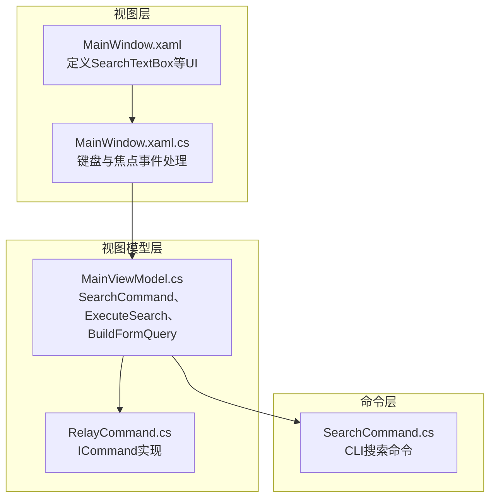
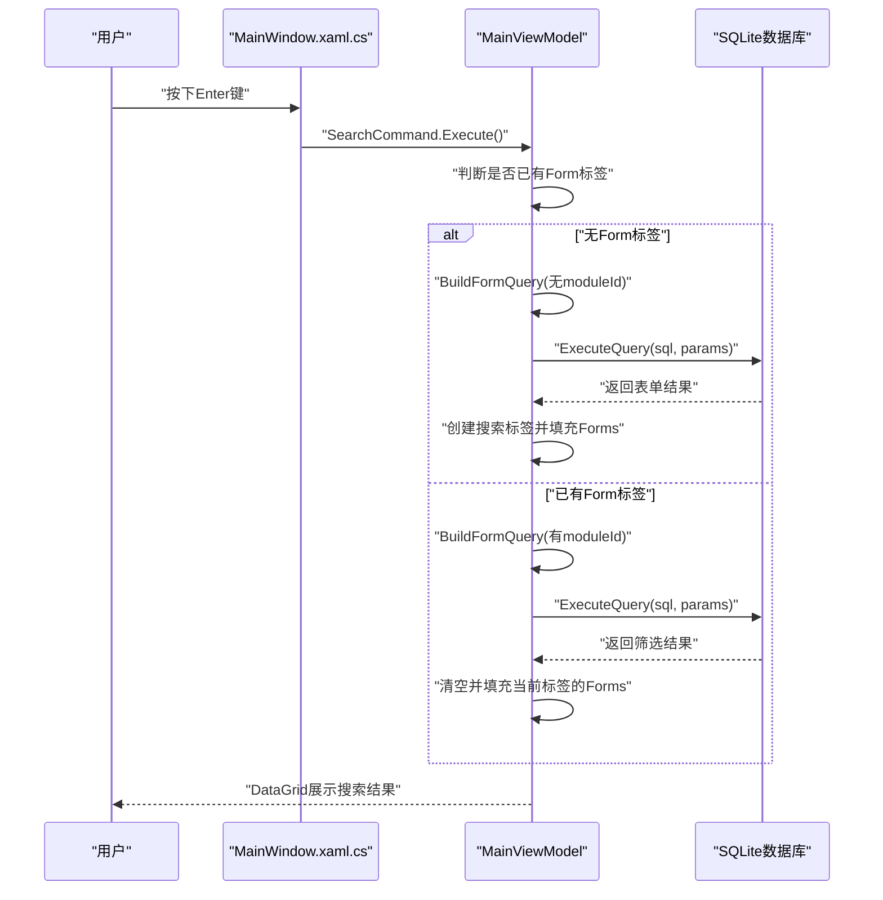
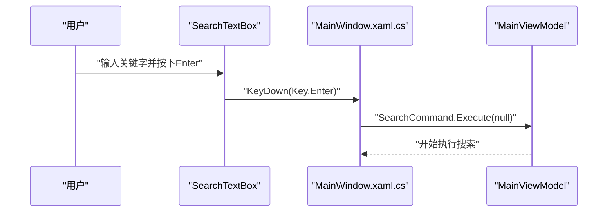
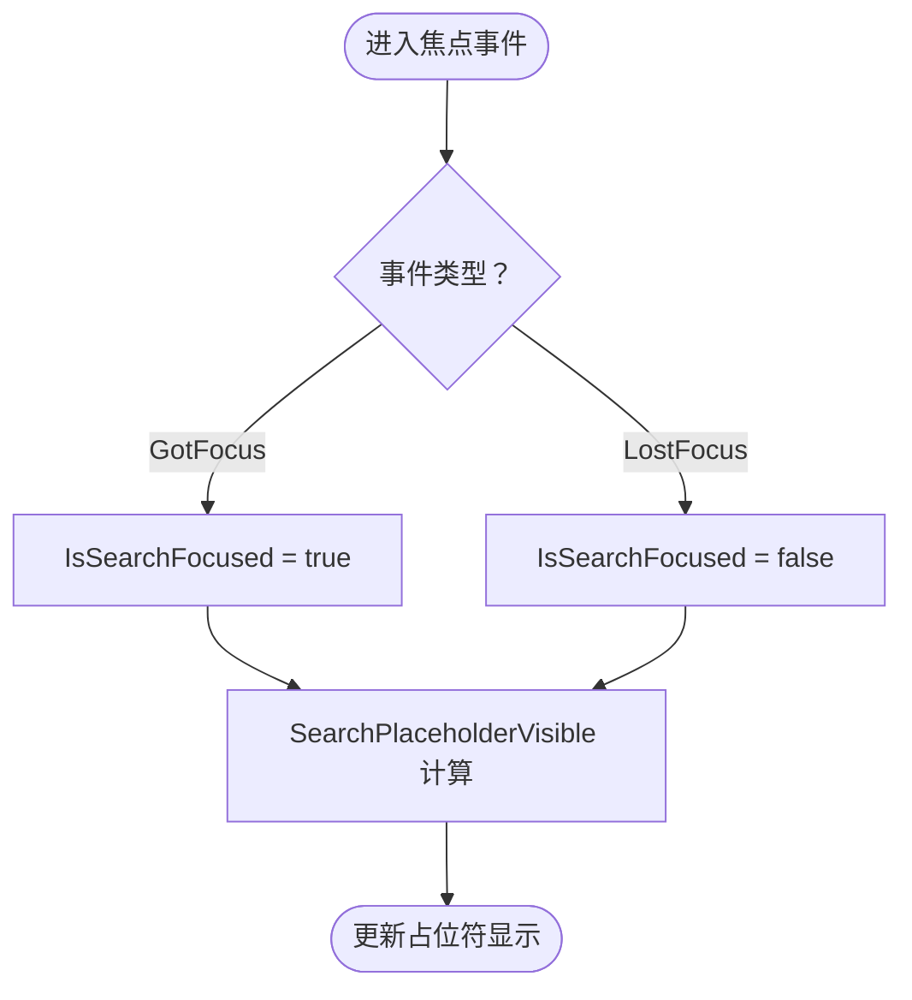
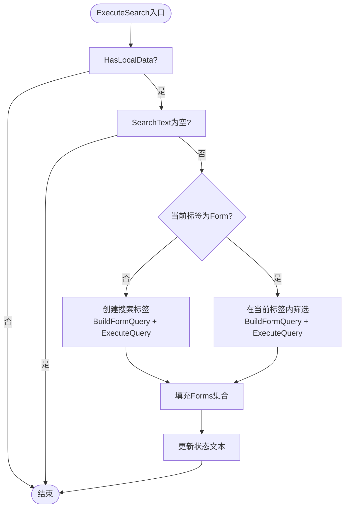
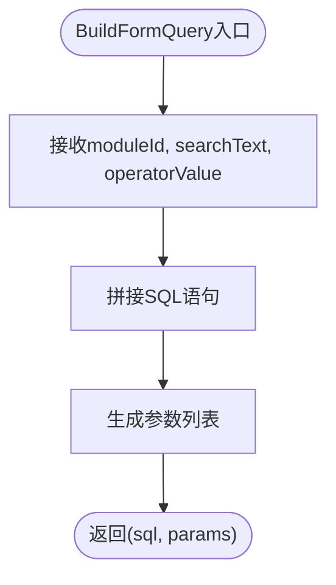
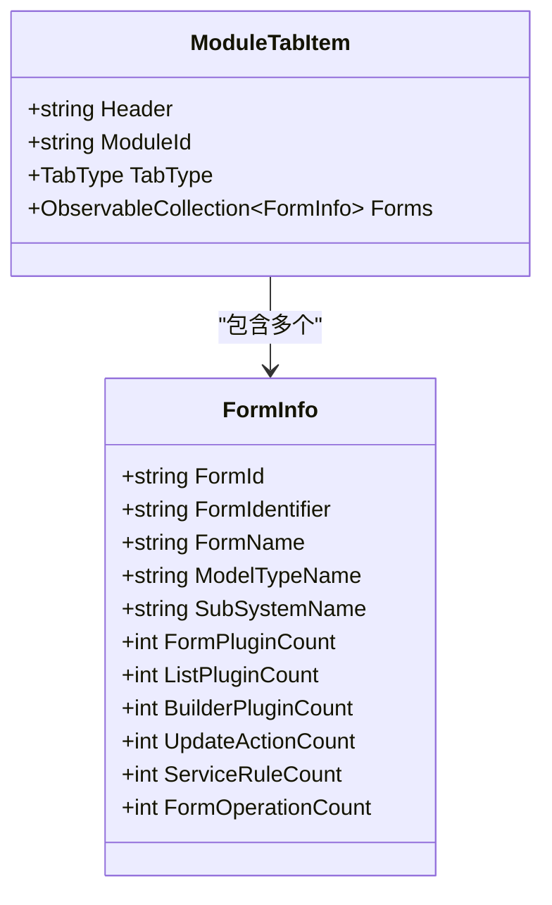
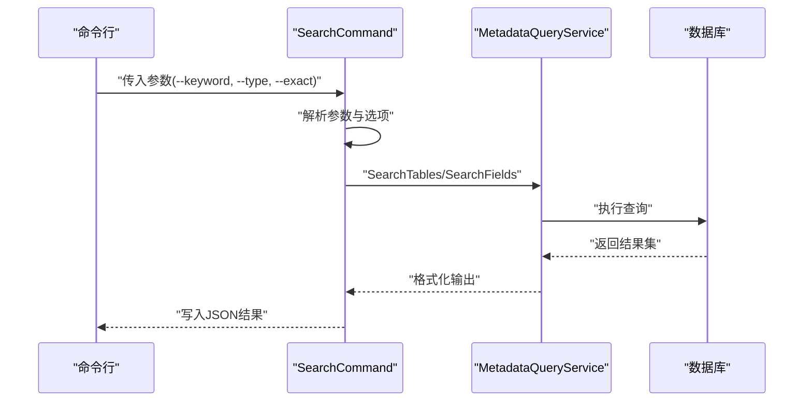
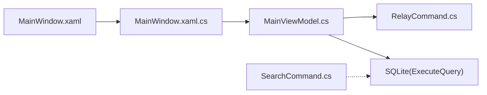

# 搜索功能组件

<cite>
**本文档引用的文件**
- [MainWindow.xaml.cs](file://MainWindow.xaml.cs)
- [MainWindow.xaml](file://MainWindow.xaml)
- [MainViewModel.cs](file://ViewModels/MainViewModel.cs)
- [RelayCommand.cs](file://ViewModels/RelayCommand.cs)
- [SearchCommand.cs](file://K3CloudDataDictionary.Cli/Commands/SearchCommand.cs)
</cite>

## 目录
1. [简介](#简介)
2. [项目结构](#项目结构)
3. [核心组件](#核心组件)
4. [架构总览](#架构总览)
5. [详细组件分析](#详细组件分析)
6. [依赖关系分析](#依赖关系分析)
7. [性能考虑](#性能考虑)
8. [故障排除指南](#故障排除指南)
9. [结论](#结论)
10. [附录](#附录)

## 简介
本文件面向金蝶K3 Cloud数据字典系统的搜索功能组件，重点围绕SearchTextBox的键盘事件处理、搜索焦点状态管理、搜索命令执行流程、搜索结果展示与高亮机制进行深入解析。同时提供搜索功能的扩展与自定义方法，包括搜索条件的增加与搜索范围的限定，并给出实际的代码示例与使用场景。

## 项目结构
搜索功能涉及以下关键文件：
- 视图层：MainWindow.xaml（XAML布局与控件绑定）
- 事件处理：MainWindow.xaml.cs（键盘事件与焦点事件处理）
- VM层：MainViewModel.cs（搜索命令、查询构建与结果承载）
- 命令层：SearchCommand.cs（CLI搜索命令实现）
- 命令适配：RelayCommand.cs（ICommand接口实现）

**图表来源**
- [MainWindow.xaml](file://MainWindow.xaml)
- [MainWindow.xaml.cs](file://MainWindow.xaml.cs)
- [MainViewModel.cs](file://ViewModels/MainViewModel.cs)
- [RelayCommand.cs](file://ViewModels/RelayCommand.cs)
- [SearchCommand.cs](file://K3CloudDataDictionary.Cli/Commands/SearchCommand.cs)

**章节来源**
- [MainWindow.xaml](file://MainWindow.xaml)
- [MainWindow.xaml.cs](file://MainWindow.xaml.cs)
- [MainViewModel.cs](file://ViewModels/MainViewModel.cs)
- [RelayCommand.cs](file://ViewModels/RelayCommand.cs)
- [SearchCommand.cs](file://K3CloudDataDictionary.Cli/Commands/SearchCommand.cs)

## 核心组件
- SearchTextBox键盘事件处理：在MainWindow.xaml.cs中捕获Enter键，触发VM的SearchCommand。
- 搜索焦点状态管理：GotFocus/LostFocus事件设置IsSearchFocused，影响占位符显示逻辑。
- 搜索命令执行：MainViewModel中通过RelayCommand注册SearchCommand，内部根据上下文决定新建搜索标签或在现有标签内筛选。
- 查询构建与执行：BuildFormQuery生成SQL与参数；ExecuteQuery执行SQLite查询。
- 结果承载与展示：ModuleTabItem的Forms集合承载查询结果，DataGrid绑定展示。
- CLI搜索命令：SearchCommand.cs支持命令行搜索表或字段，输出JSON格式结果。

**章节来源**
- [MainWindow.xaml.cs:650-669](file://MainWindow.xaml.cs#L650-L669)
- [MainViewModel.cs:196-215](file://ViewModels/MainViewModel.cs#L196-L215)
- [MainViewModel.cs:1782-1833](file://ViewModels/MainViewModel.cs#L1782-L1833)
- [MainViewModel.cs:1835-1873](file://ViewModels/MainViewModel.cs#L1835-L1873)
- [SearchCommand.cs:13-107](file://K3CloudDataDictionary.Cli/Commands/SearchCommand.cs#L13-L107)

## 架构总览
搜索功能采用MVVM架构，键盘事件由视图层捕获，转发至视图模型层执行业务逻辑，最终通过DataGrid展示结果。CLI层提供独立的搜索命令，便于批量或自动化场景使用。

**图表来源**
- [MainWindow.xaml.cs:650-657](file://MainWindow.xaml.cs#L650-L657)
- [MainViewModel.cs:1782-1833](file://ViewModels/MainViewModel.cs#L1782-L1833)
- [MainViewModel.cs:1835-1873](file://ViewModels/MainViewModel.cs#L1835-L1873)

## 详细组件分析

### 键盘事件处理（Enter触发搜索）
- 事件绑定：MainWindow.xaml.cs中SearchTextBox_KeyDown捕获Key.Enter。
- 触发逻辑：将事件转换为MainViewModel.SearchCommand.Execute(null)，从而统一走VM的搜索流程。
- 适用场景：快速搜索、无障碍访问、快捷键操作。

**图表来源**
- [MainWindow.xaml.cs:650-657](file://MainWindow.xaml.cs#L650-L657)
- [MainViewModel.cs:196-215](file://ViewModels/MainViewModel.cs#L196-L215)

**章节来源**
- [MainWindow.xaml.cs:650-657](file://MainWindow.xaml.cs#L650-L657)
- [MainViewModel.cs:196-215](file://ViewModels/MainViewModel.cs#L196-L215)

### 搜索焦点状态管理（GotFocus/LostFocus）
- GotFocus：设置IsSearchFocused为true，用于控制占位符文本的可见性。
- LostFocus：设置IsSearchFocused为false，恢复占位符显示。
- 绑定关系：SearchPlaceholderVisible依赖SearchText与IsSearchFocused，确保“空文本且未聚焦”时显示占位符。

**图表来源**
- [MainWindow.xaml.cs:659-669](file://MainWindow.xaml.cs#L659-L669)
- [MainViewModel.cs:76-82](file://ViewModels/MainViewModel.cs#L76-L82)

**章节来源**
- [MainWindow.xaml.cs:659-669](file://MainWindow.xaml.cs#L659-L669)
- [MainViewModel.cs:76-82](file://ViewModels/MainViewModel.cs#L76-L82)

### 搜索命令执行流程（SearchCommand）
- 命令注册：MainViewModel构造函数中通过RelayCommand创建SearchCommand。
- 执行入口：ExecuteSearch接收参数，校验本地数据可用性与关键字非空。
- 新建搜索标签：当当前无Form标签或非Form标签时，创建新的搜索标签，构建SQL并查询，填充Forms集合。
- 现有标签内筛选：当当前为Form标签时，直接在当前标签内更新筛选结果。
- 异常处理：捕获异常并更新状态文本，保证UI反馈一致。

**图表来源**
- [MainViewModel.cs:1782-1833](file://ViewModels/MainViewModel.cs#L1782-L1833)
- [MainViewModel.cs:1835-1873](file://ViewModels/MainViewModel.cs#L1835-L1873)

**章节来源**
- [MainViewModel.cs:196-215](file://ViewModels/MainViewModel.cs#L196-L215)
- [MainViewModel.cs:1782-1833](file://ViewModels/MainViewModel.cs#L1782-L1833)
- [MainViewModel.cs:1835-1873](file://ViewModels/MainViewModel.cs#L1835-L1873)

### 查询构建与执行（BuildFormQuery/ExecuteQuery）
- BuildFormQuery：根据moduleId（是否在现有标签内）、SearchText与SelectedOperator（运算符）生成SQL与参数元组。
- ExecuteQuery：封装SQLite连接、命令与参数，读取结果集为字典列表，供上层使用。
- 使用场景：在ExecuteSearch与SearchInTabAsync中分别用于新建标签与筛选。

**图表来源**
- [MainViewModel.cs:1642-1660](file://ViewModels/MainViewModel.cs#L1642-L1660)
- [MainViewModel.cs:292-321](file://ViewModels/MainViewModel.cs#L292-L321)

**章节来源**
- [MainViewModel.cs:1642-1660](file://ViewModels/MainViewModel.cs#L1642-L1660)
- [MainViewModel.cs:292-321](file://ViewModels/MainViewModel.cs#L292-L321)

### 搜索结果展示与高亮机制
- 数据承载：ModuleTabItem的Forms集合承载查询结果，每个结果映射为FormInfo对象。
- 展示方式：MainWindow.xaml中FormTabTemplate绑定DataGrid，各列对应FormInfo属性。
- 高亮机制：当前代码未实现字段级高亮显示。可在DataGrid列模板中结合TextBlock或RichTextBox实现关键字高亮，或通过自定义单元格模板与样式实现视觉高亮。

**图表来源**
- [MainViewModel.cs:1791-1822](file://ViewModels/MainViewModel.cs#L1791-L1822)
- [MainViewModel.cs:1841-1867](file://ViewModels/MainViewModel.cs#L1841-L1867)

**章节来源**
- [MainViewModel.cs:1791-1822](file://ViewModels/MainViewModel.cs#L1791-L1822)
- [MainViewModel.cs:1841-1867](file://ViewModels/MainViewModel.cs#L1841-L1867)
- [MainWindow.xaml:175-253](file://MainWindow.xaml#L175-L253)

### CLI搜索命令（SearchCommand）
- 参数解析：支持--keyword、--type（默认table）、--exact/-e等选项。
- 执行逻辑：根据type选择SearchTables或SearchFields，调用MetadataQueryService执行查询，输出JSON。
- 使用场景：命令行批量搜索、脚本集成、CI/CD流水线。

**图表来源**
- [SearchCommand.cs:13-107](file://K3CloudDataDictionary.Cli/Commands/SearchCommand.cs#L13-L107)

**章节来源**
- [SearchCommand.cs:13-107](file://K3CloudDataDictionary.Cli/Commands/SearchCommand.cs#L13-L107)

## 依赖关系分析
- 视图层依赖视图模型层：MainWindow.xaml.cs依赖MainViewModel的SearchCommand与IsSearchFocused。
- 视图模型层依赖命令适配器：MainViewModel通过RelayCommand实现ICommand。
- 视图模型层依赖数据访问：MainViewModel封装ExecuteQuery与BuildFormQuery。
- CLI层独立于GUI：SearchCommand不依赖WPF，可单独运行。

**图表来源**
- [MainWindow.xaml.cs](file://MainWindow.xaml.cs)
- [MainViewModel.cs](file://ViewModels/MainViewModel.cs)
- [RelayCommand.cs](file://ViewModels/RelayCommand.cs)
- [SearchCommand.cs](file://K3CloudDataDictionary.Cli/Commands/SearchCommand.cs)

**章节来源**
- [MainWindow.xaml.cs](file://MainWindow.xaml.cs)
- [MainViewModel.cs](file://ViewModels/MainViewModel.cs)
- [RelayCommand.cs](file://ViewModels/RelayCommand.cs)
- [SearchCommand.cs](file://K3CloudDataDictionary.Cli/Commands/SearchCommand.cs)

## 性能考虑
- 查询优化：BuildFormQuery应尽量使用索引列与合适的LIKE模式（如“前缀%”），避免全表扫描。
- 分页与限制：对于大结果集，建议在ExecuteQuery或上层增加分页与最大返回条数限制。
- 异步执行：当前查询已在Task.Run中执行，注意避免阻塞UI线程。
- 缓存策略：对常用搜索词或频繁访问的表单/实体结果进行缓存，减少重复查询。

## 故障排除指南
- 无本地数据：当HasLocalData为false时，ExecuteSearch直接返回。请先连接并刷新元数据。
- 关键字为空：SearchText为空时直接返回。请确保输入有效关键字。
- 异常处理：ExecuteSearch与SearchInTabAsync均捕获异常并更新状态文本，便于定位问题。
- CLI参数缺失：SearchCommand在缺少必要参数时会输出错误信息与帮助。

**章节来源**
- [MainViewModel.cs:1784-1785](file://ViewModels/MainViewModel.cs#L1784-L1785)
- [MainViewModel.cs:1789-1790](file://ViewModels/MainViewModel.cs#L1789-L1790)
- [MainViewModel.cs:1829-1832](file://ViewModels/MainViewModel.cs#L1829-L1832)
- [SearchCommand.cs:24-31](file://K3CloudDataDictionary.Cli/Commands/SearchCommand.cs#L24-L31)

## 结论
SearchTextBox的搜索功能通过键盘事件与视图模型层紧密协作，实现了从输入到结果展示的完整闭环。GUI与CLI双通道满足不同使用场景的需求。为进一步提升体验，建议在结果展示层面增加高亮与分页能力，并持续优化查询性能与缓存策略。

## 附录

### 搜索功能扩展与自定义方法
- 增加搜索条件
  - 在MainViewModel中新增属性（如SearchCategory、SearchStatus），并在BuildFormQuery中纳入SQL拼接与参数绑定。
  - 在XAML中为相应列添加过滤TextBox（参考现有FilterTextBox_TextChanged模式），实现多维筛选。
- 限定搜索范围
  - 通过SelectedTab判断当前标签类型，在ExecuteSearch中针对不同TabType（Form/Entity/Field等）构建不同的SQL与参数。
  - CLI层可通过--type细化搜索范围（当前默认table，可扩展为field）。
- 高亮机制
  - 在DataGrid列模板中，将TextBlock绑定到字段值，并通过正则匹配与Run/Inline构建实现关键字高亮。
  - 或者在后台为每个单元格内容生成富文本片段，再绑定到DataGrid单元格模板。

**章节来源**
- [MainViewModel.cs:1791-1822](file://ViewModels/MainViewModel.cs#L1791-L1822)
- [MainViewModel.cs:1841-1867](file://ViewModels/MainViewModel.cs#L1841-L1867)
- [MainWindow.xaml:175-253](file://MainWindow.xaml#L175-L253)
- [SearchCommand.cs:34-38](file://K3CloudDataDictionary.Cli/Commands/SearchCommand.cs#L34-L38)