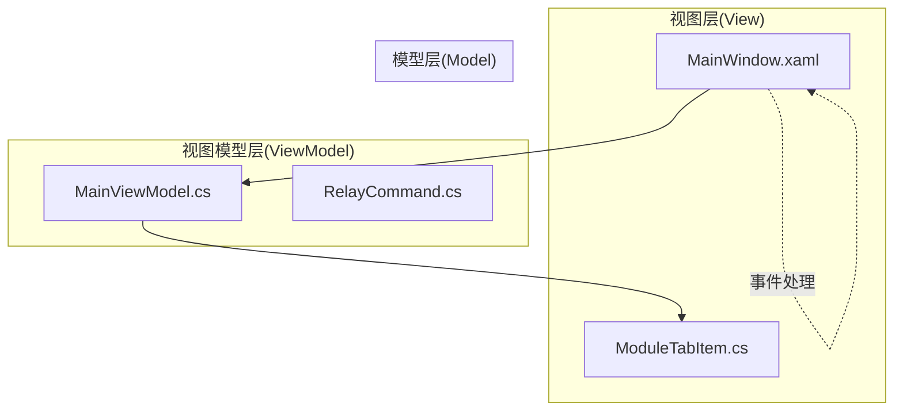
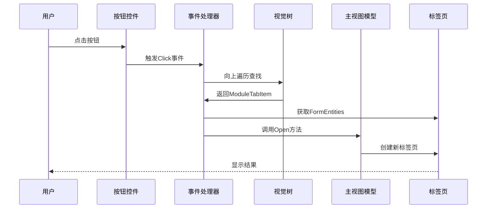
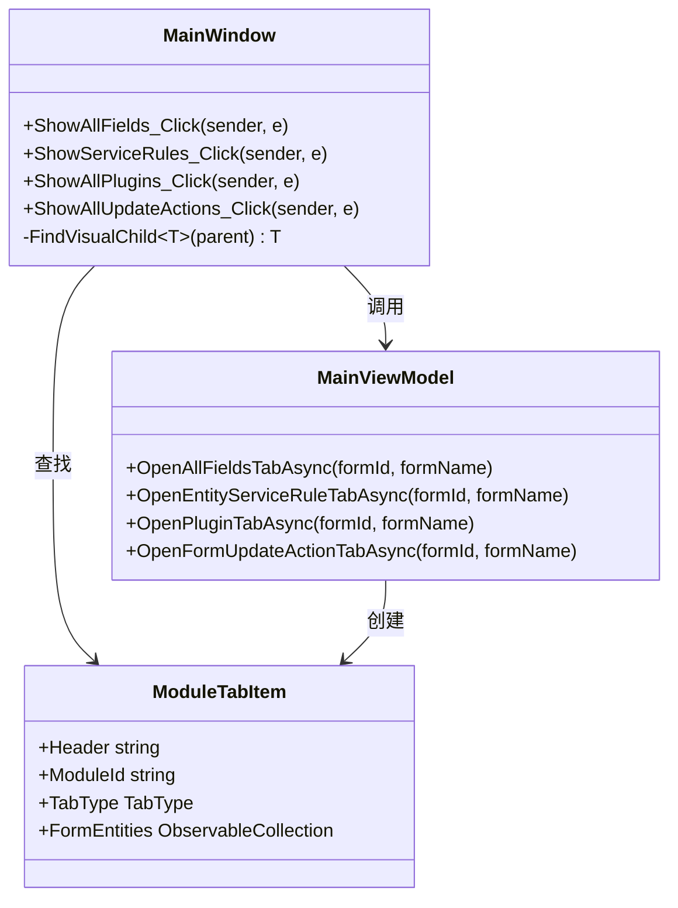
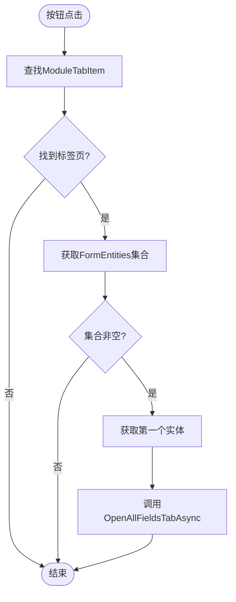
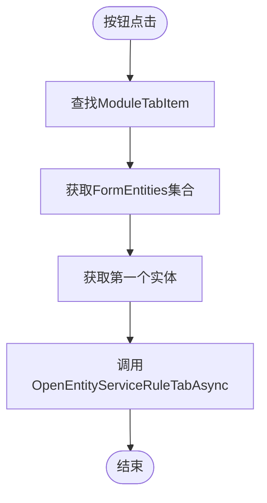
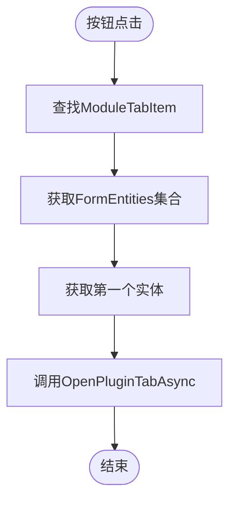
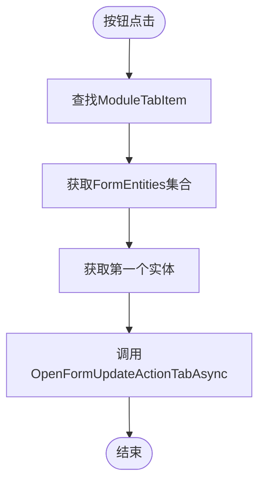
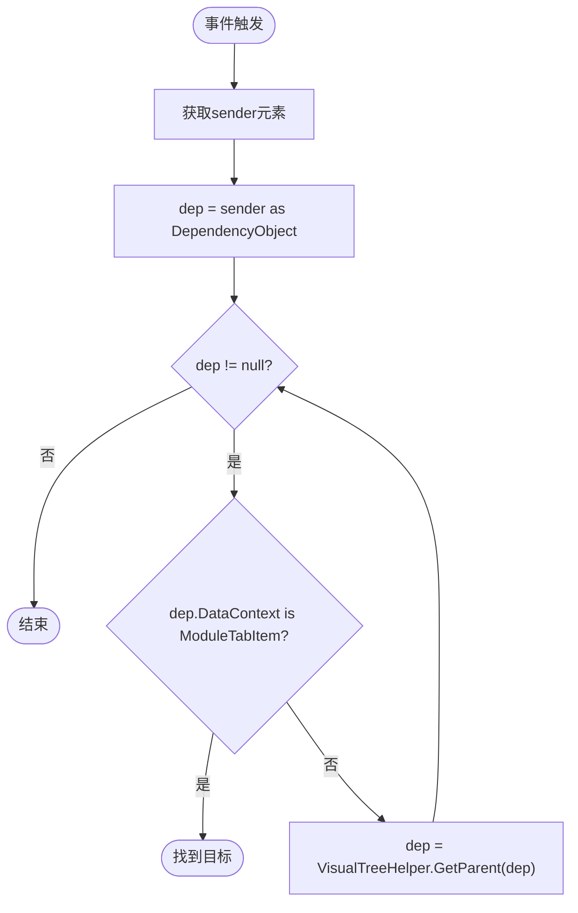
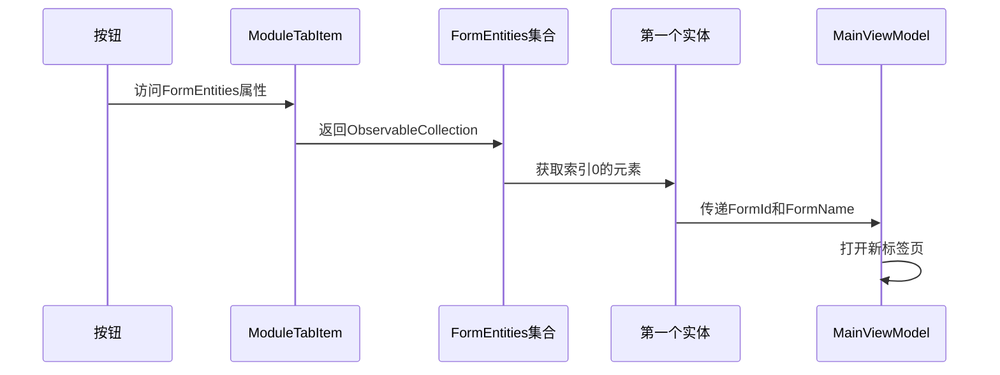
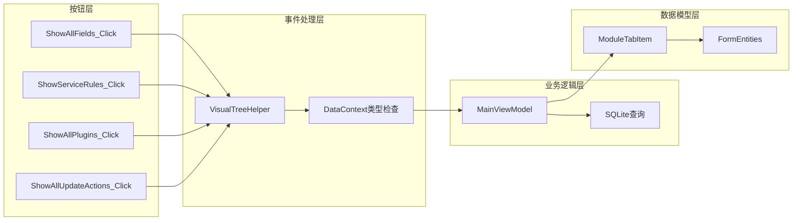

# 操作按钮组件

<cite>
**本文档引用的文件**
- [MainWindow.xaml.cs](file://MainWindow.xaml.cs)
- [MainWindow.xaml](file://MainWindow.xaml)
- [ModuleTabItem.cs](file://Models/ModuleTabItem.cs)
- [MainViewModel.cs](file://ViewModels/MainViewModel.cs)
- [RelayCommand.cs](file://ViewModels/RelayCommand.cs)
</cite>

## 目录
1. [简介](#简介)
2. [项目结构](#项目结构)
3. [核心组件](#核心组件)
4. [架构概览](#架构概览)
5. [详细组件分析](#详细组件分析)
6. [依赖关系分析](#依赖关系分析)
7. [性能考虑](#性能考虑)
8. [故障排除指南](#故障排除指南)
9. [结论](#结论)

## 简介

本文档详细介绍了金蝶K3 Cloud数据字典系统中的操作按钮组件，重点分析以下四个核心按钮的功能和实现：

- ShowAllFields_Click - 显示所有字段按钮
- ShowServiceRules_Click - 显示服务规则按钮  
- ShowAllPlugins_Click - 显示所有插件按钮
- ShowAllUpdateActions_Click - 显示所有值更新按钮

这些按钮位于实体标签页的工具栏中，通过向上遍历VisualTree查找DataContext为ModuleTabItem的元素来确定操作目标，然后调用MainViewModel中的相应方法打开新的标签页。

## 项目结构

系统采用MVVM架构模式，主要由以下层次组成：

**图表来源**
- [MainWindow.xaml.cs:671-764](file://MainWindow.xaml.cs#L671-L764)
- [MainWindow.xaml:272-283](file://MainWindow.xaml#L272-L283)

**章节来源**
- [MainWindow.xaml.cs:1-1439](file://MainWindow.xaml.cs#L1-L1439)
- [MainWindow.xaml:1-1917](file://MainWindow.xaml#L1-L1917)

## 核心组件

### 按钮事件处理器

四个操作按钮都实现了相似的事件处理模式：

**图表来源**
- [MainWindow.xaml.cs:671-764](file://MainWindow.xaml.cs#L671-L764)

### ModuleTabItem 数据模型

ModuleTabItem作为标签页的数据上下文，包含以下关键属性：

- **Header**: 标签页标题
- **ModuleId**: 模块标识符
- **TabType**: 标签页类型枚举
- **FormEntities**: 表单实体集合
- **Forms**: 表单集合
- **Fields**: 字段集合

**章节来源**
- [ModuleTabItem.cs:1-196](file://Models/ModuleTabItem.cs#L1-L196)

## 架构概览

系统采用标准的MVVM架构，按钮事件通过事件处理器捕获，然后委托给MainViewModel执行业务逻辑：

**图表来源**
- [MainWindow.xaml.cs:671-764](file://MainWindow.xaml.cs#L671-L764)
- [MainViewModel.cs:495-966](file://ViewModels/MainViewModel.cs#L495-L966)
- [ModuleTabItem.cs:9-196](file://Models/ModuleTabItem.cs#L9-L196)

## 详细组件分析

### ShowAllFields_Click 按钮

#### 功能概述
显示当前表单的所有字段信息，包括字段标识、名称、元素类型等详细信息。

#### 实现流程

**图表来源**
- [MainWindow.xaml.cs:671-694](file://MainWindow.xaml.cs#L671-L694)

#### 关键实现细节
- 使用`VisualTreeHelper.GetParent(dep)`向上遍历视觉树
- 从`tab.FormEntities[0]`获取FormId和FormName
- 调用`vm.OpenAllFieldsTabAsync(formId, formName)`

**章节来源**
- [MainWindow.xaml.cs:671-694](file://MainWindow.xaml.cs#L671-L694)
- [MainViewModel.cs:495-518](file://ViewModels/MainViewModel.cs#L495-L518)

### ShowServiceRules_Click 按钮

#### 功能概述
显示实体的服务规则信息，包括前置条件、服务类型等详细配置。

#### 实现流程

**图表来源**
- [MainWindow.xaml.cs:696-718](file://MainWindow.xaml.cs#L696-L718)

#### 关键实现细节
- 支持两种调用方式：表单级服务规则和实体级服务规则
- 通过entityId参数区分不同查询范围

**章节来源**
- [MainWindow.xaml.cs:696-718](file://MainWindow.xaml.cs#L696-L718)
- [MainViewModel.cs:659-731](file://ViewModels/MainViewModel.cs#L659-L731)

### ShowAllPlugins_Click 按钮

#### 功能概述
显示表单相关的所有插件信息，包括表单插件、列表插件、构建插件等。

#### 实现流程

**图表来源**
- [MainWindow.xaml.cs:720-741](file://MainWindow.xaml.cs#L720-L741)

#### 关键实现细节
- 支持按插件类型筛选（FormPlugins、ListPlugins、WebFormBuilderPlugins）
- 通过pluginType参数控制查询范围

**章节来源**
- [MainWindow.xaml.cs:720-741](file://MainWindow.xaml.cs#L720-L741)
- [MainViewModel.cs:791-851](file://ViewModels/MainViewModel.cs#L791-L851)

### ShowAllUpdateActions_Click 按钮

#### 功能概述
显示表单的值更新动作信息，包括触发条件、执行参数等详细配置。

#### 实现流程

**图表来源**
- [MainWindow.xaml.cs:743-764](file://MainWindow.xaml.cs#L743-L764)

#### 关键实现细节
- 查询范围覆盖整个表单的所有字段
- 包含字段级别的值更新动作信息

**章节来源**
- [MainWindow.xaml.cs:743-764](file://MainWindow.xaml.cs#L743-L764)
- [MainViewModel.cs:911-966](file://ViewModels/MainViewModel.cs#L911-L966)

### 按钮事件查找机制

#### VisualTree 遍历算法

**图表来源**
- [MainWindow.xaml.cs:676-679](file://MainWindow.xaml.cs#L676-L679)

#### 查找策略说明
- 从触发事件的按钮开始向上遍历
- 检查每个元素的DataContext属性
- 直到找到ModuleTabItem类型的DataContext
- 如果遍历完整个树仍未找到，则忽略事件

**章节来源**
- [MainWindow.xaml.cs:671-764](file://MainWindow.xaml.cs#L671-L764)

### 标签页内容交互关系

#### FormEntities 获取过程

**图表来源**
- [MainWindow.xaml.cs:683-690](file://MainWindow.xaml.cs#L683-L690)

#### 数据绑定机制
- 按钮的DataContext继承自ModuleTabItem
- 通过FormEntities属性访问表单实体信息
- 自动获取第一个实体的FormId和FormName

**章节来源**
- [MainWindow.xaml.cs:683-690](file://MainWindow.xaml.cs#L683-L690)
- [ModuleTabItem.cs:54-58](file://Models/ModuleTabItem.cs#L54-L58)

## 依赖关系分析

### 组件耦合度分析

**图表来源**
- [MainWindow.xaml.cs:671-764](file://MainWindow.xaml.cs#L671-L764)
- [MainViewModel.cs:495-966](file://ViewModels/MainViewModel.cs#L495-L966)

### 错误处理机制

#### 异常处理策略
- **空引用检查**: 所有按钮事件都检查sender和dep是否为null
- **集合验证**: 确保FormEntities.Count > 0
- **类型安全**: 严格检查DataContext类型
- **UI线程切换**: 使用Dispatcher.Invoke确保UI更新在正确线程执行

#### 错误恢复机制
- 发生异常时通过MessageBox显示错误信息
- 清理进度条状态
- 恢复按钮可用性状态

**章节来源**
- [MainWindow.xaml.cs:671-764](file://MainWindow.xaml.cs#L671-L764)

## 性能考虑

### 异步操作优化

#### 并发处理
- 所有数据库查询使用Task.Run异步执行
- UI更新通过Dispatcher.Invoke回到主线程
- 避免阻塞用户界面响应

#### 内存管理
- 使用ObservableCollection自动通知UI更新
- 及时清理不再使用的标签页内容
- 合理使用弱引用避免内存泄漏

### 扩展性设计

#### 模式识别
- 采用统一的事件处理模式
- 可重用的VisualTree遍历逻辑
- 标准化的错误处理机制

## 故障排除指南

### 常见问题诊断

#### 按钮无响应
1. **检查DataContext**: 确保按钮的DataContext是ModuleTabItem
2. **验证FormEntities**: 确认集合中有至少一个元素
3. **检查权限**: 确认HasLocalData为true

#### 标签页不显示
1. **检查FormId格式**: 确保FormId格式正确
2. **验证数据库连接**: 确认SQLite数据库可访问
3. **查看日志**: 检查StatusText属性获取详细错误信息

#### 性能问题
1. **监控UI线程**: 确保长时间操作在后台线程执行
2. **检查批量操作**: 验证SQLite写入是否使用事务
3. **内存使用**: 监控ObservableCollection大小

**章节来源**
- [MainWindow.xaml.cs:671-764](file://MainWindow.xaml.cs#L671-L764)
- [MainViewModel.cs:131-172](file://ViewModels/MainViewModel.cs#L131-L172)

## 结论

操作按钮组件展现了良好的软件工程实践：

1. **清晰的职责分离**: 事件处理、业务逻辑、数据访问各司其职
2. **一致的设计模式**: 四个按钮采用相同的实现模式，易于维护
3. **健壮的错误处理**: 完善的异常处理和恢复机制
4. **优秀的用户体验**: 异步操作保证界面响应性
5. **可扩展的架构**: 易于添加新的按钮功能和标签页类型

该组件为金蝶K3 Cloud数据字典系统提供了直观、高效的元数据浏览体验，通过标准化的事件处理和数据绑定机制，实现了复杂业务逻辑的简洁表达。