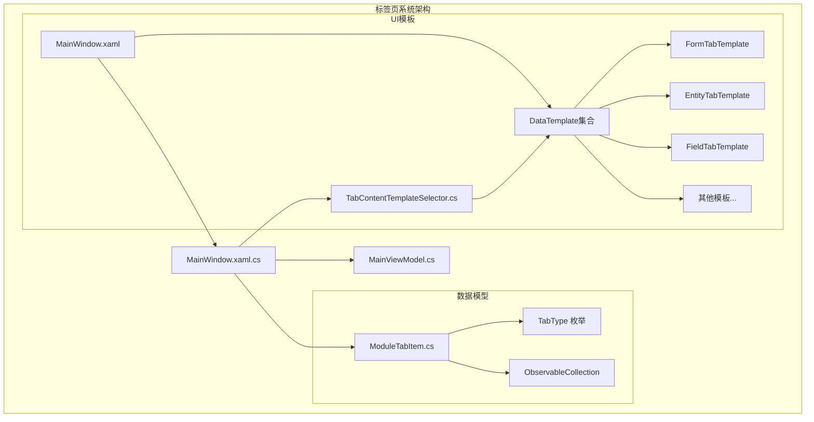
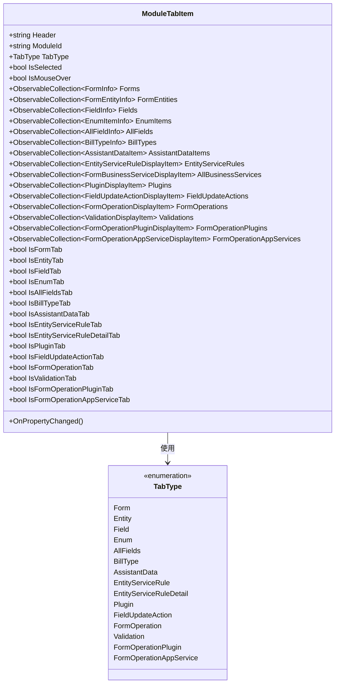
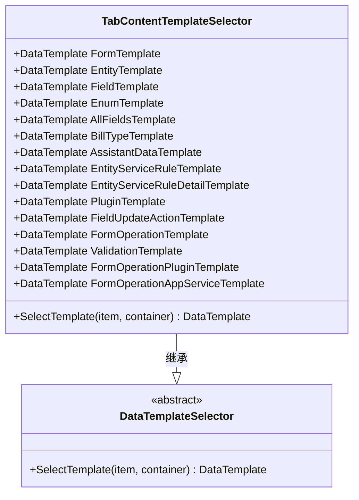
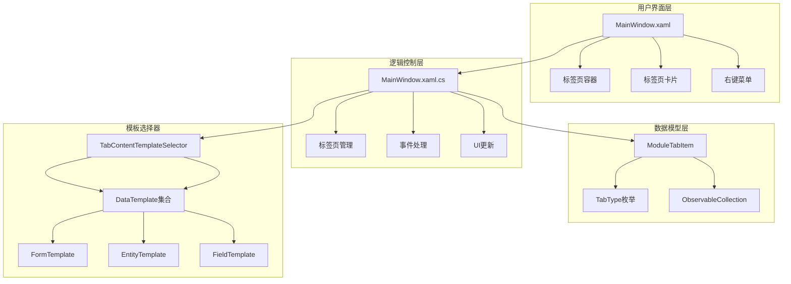
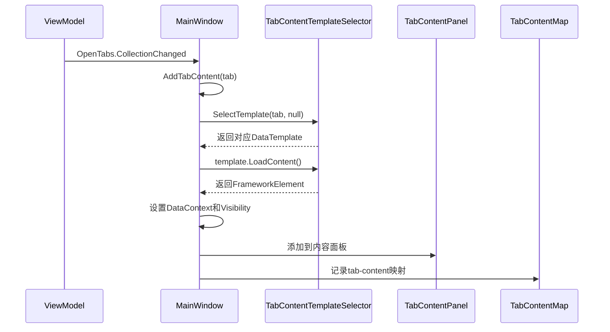
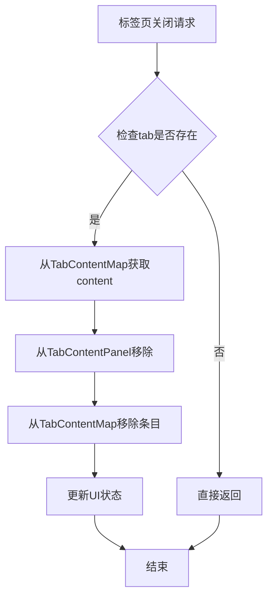
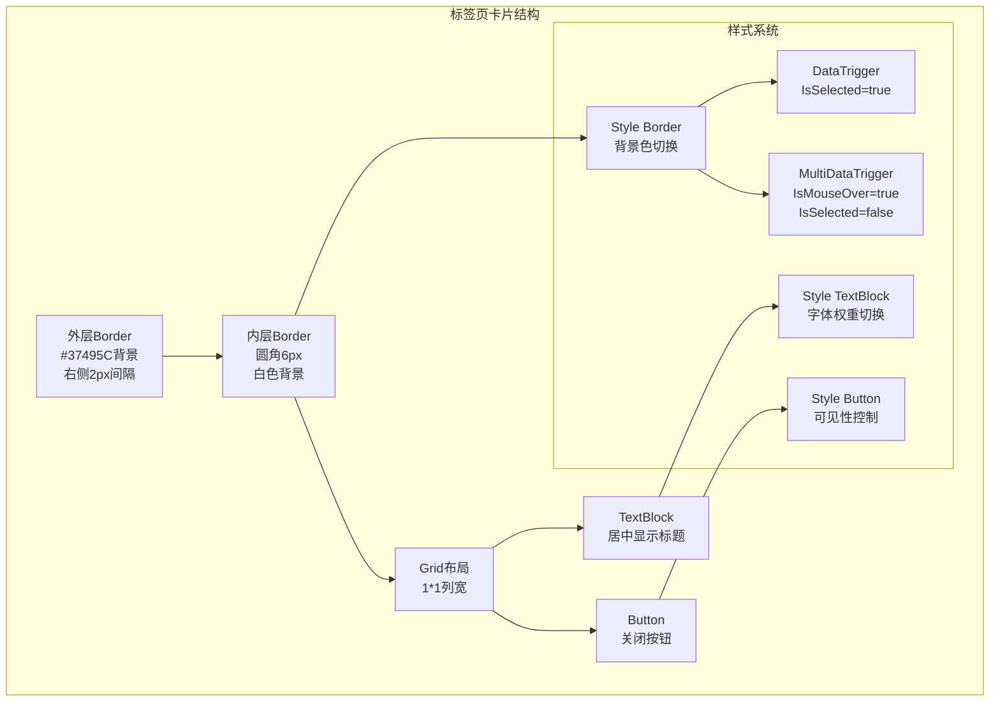
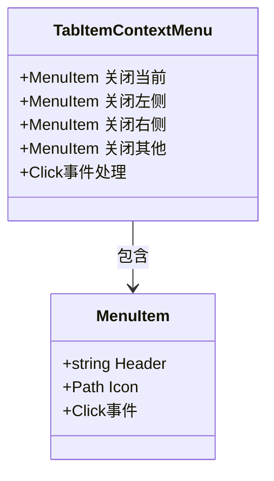
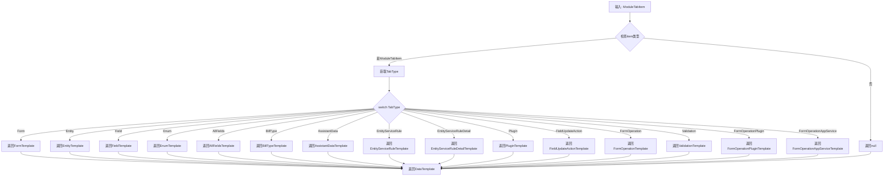
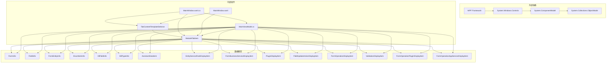

# 标签页系统设计

<cite>
**本文档引用的文件**
- [TabContentTemplateSelector.cs](file://TabContentTemplateSelector.cs)
- [ModuleTabItem.cs](file://Models/ModuleTabItem.cs)
- [MainWindow.xaml.cs](file://MainWindow.xaml.cs)
- [MainWindow.xaml](file://MainWindow.xaml)
- [MainViewModel.cs](file://ViewModels/MainViewModel.cs)
</cite>

## 目录
1. [简介](#简介)
2. [项目结构](#项目结构)
3. [核心组件](#核心组件)
4. [架构概览](#架构概览)
5. [详细组件分析](#详细组件分析)
6. [依赖关系分析](#依赖关系分析)
7. [性能考虑](#性能考虑)
8. [故障排除指南](#故障排除指南)
9. [结论](#结论)

## 简介

金蝶K3 Cloud数据字典系统的标签页系统是一个高度模块化的UI组件，支持动态创建和销毁多种类型的标签页内容。该系统采用选择器模式设计，能够根据不同的数据模型类型动态选择合适的UI模板，实现了良好的可扩展性和维护性。

系统主要包含以下核心功能：
- 动态标签页创建和销毁机制
- 基于类型的选择器模式设计
- 自定义标签页卡片UI设计
- 右键菜单和快捷操作支持
- 数据绑定和状态管理

## 项目结构

标签页系统位于项目的UI层，主要涉及以下文件：

**图表来源**
- [MainWindow.xaml](file://MainWindow.xaml)
- [MainWindow.xaml.cs](file://MainWindow.xaml.cs)
- [TabContentTemplateSelector.cs](file://TabContentTemplateSelector.cs)
- [ModuleTabItem.cs](file://Models/ModuleTabItem.cs)

**章节来源**
- [MainWindow.xaml](file://MainWindow.xaml)
- [MainWindow.xaml.cs](file://MainWindow.xaml.cs)
- [TabContentTemplateSelector.cs](file://TabContentTemplateSelector.cs)
- [ModuleTabItem.cs](file://Models/ModuleTabItem.cs)

## 核心组件

### 模型层组件

**ModuleTabItem 类** 是标签页系统的核心数据模型，负责存储标签页的状态和数据：

**图表来源**
- [ModuleTabItem.cs](file://Models/ModuleTabItem.cs)

**章节来源**
- [ModuleTabItem.cs](file://Models/ModuleTabItem.cs)

### 选择器组件

**TabContentTemplateSelector 类** 实现了选择器模式，根据标签页类型动态选择合适的UI模板：

**图表来源**
- [TabContentTemplateSelector.cs](file://TabContentTemplateSelector.cs)

**章节来源**
- [TabContentTemplateSelector.cs](file://TabContentTemplateSelector.cs)

## 架构概览

标签页系统采用MVVM架构模式，实现了清晰的关注点分离：

**图表来源**
- [MainWindow.xaml](file://MainWindow.xaml)
- [MainWindow.xaml.cs](file://MainWindow.xaml.cs)
- [TabContentTemplateSelector.cs](file://TabContentTemplateSelector.cs)
- [ModuleTabItem.cs](file://Models/ModuleTabItem.cs)

## 详细组件分析

### 动态标签页创建机制

标签页的动态创建通过 `AddTabContent` 方法实现，该方法在标签页集合发生变化时被调用：

**图表来源**
- [MainWindow.xaml.cs](file://MainWindow.xaml.cs)
- [TabContentTemplateSelector.cs](file://TabContentTemplateSelector.cs)

**章节来源**
- [MainWindow.xaml.cs](file://MainWindow.xaml.cs)

### 标签页销毁机制

标签页的销毁通过 `RemoveTabContent` 方法实现，确保资源的有效释放：

**图表来源**
- [MainWindow.xaml.cs](file://MainWindow.xaml.cs)

**章节来源**
- [MainWindow.xaml.cs](file://MainWindow.xaml.cs)

### 标签页卡片UI设计

标签页卡片采用了精心设计的UI结构，包含多个层次的视觉效果：

**图表来源**
- [MainWindow.xaml.cs](file://MainWindow.xaml.cs)

**章节来源**
- [MainWindow.xaml.cs](file://MainWindow.xaml.cs)

### 右键菜单功能

系统提供了完整的右键菜单支持，包含多种操作选项：

**图表来源**
- [MainWindow.xaml](file://MainWindow.xaml)

**章节来源**
- [MainWindow.xaml](file://MainWindow.xaml)

### 选择器模式实现

选择器模式通过 `TabContentTemplateSelector` 类实现，根据 `TabType` 枚举值返回相应的 `DataTemplate`：

**图表来源**
- [TabContentTemplateSelector.cs](file://TabContentTemplateSelector.cs)

**章节来源**
- [TabContentTemplateSelector.cs](file://TabContentTemplateSelector.cs)

## 依赖关系分析

标签页系统各组件之间的依赖关系如下：

**图表来源**
- [MainWindow.xaml.cs](file://MainWindow.xaml.cs)
- [TabContentTemplateSelector.cs](file://TabContentTemplateSelector.cs)
- [ModuleTabItem.cs](file://Models/ModuleTabItem.cs)
- [MainViewModel.cs](file://ViewModels/MainViewModel.cs)

**章节来源**
- [MainWindow.xaml.cs](file://MainWindow.xaml.cs)
- [TabContentTemplateSelector.cs](file://TabContentTemplateSelector.cs)
- [ModuleTabItem.cs](file://Models/ModuleTabItem.cs)
- [MainViewModel.cs](file://ViewModels/MainViewModel.cs)

## 性能考虑

标签页系统的性能优化主要体现在以下几个方面：

1. **延迟加载**: 标签页内容采用延迟加载策略，在标签页创建时只创建UI结构，实际数据加载在需要时进行

2. **内存管理**: 通过 `TabContentMap` 字典管理标签页内容的引用，确保及时释放不再使用的资源

3. **UI更新优化**: 使用 `Dispatcher` 机制确保UI更新在正确的线程上下文中执行

4. **数据绑定**: 采用 `ObservableCollection<T>` 实现数据的响应式更新，减少不必要的UI重绘

5. **模板缓存**: `DataTemplate` 对象在应用启动时创建并缓存，避免重复实例化

## 故障排除指南

### 常见问题及解决方案

**问题1: 标签页无法正常显示**
- 检查 `TabContentTemplateSelector` 是否正确配置
- 确认 `TabType` 枚举值与模板键匹配
- 验证 `DataTemplate` 是否在资源字典中正确定义

**问题2: 标签页切换异常**
- 检查 `SelectedTabChanged` 事件处理逻辑
- 确认 `UpdateTabVisibility` 方法正确更新可见性
- 验证 `UpdateTabIsSelected` 方法的状态同步

**问题3: 内存泄漏问题**
- 确保 `RemoveTabContent` 方法正确清理资源
- 检查 `TabContentMap` 字典的清理逻辑
- 验证事件订阅和取消订阅的平衡

**章节来源**
- [MainWindow.xaml.cs](file://MainWindow.xaml.cs)
- [TabContentTemplateSelector.cs](file://TabContentTemplateSelector.cs)

## 结论

金蝶K3 Cloud数据字典系统的标签页系统通过精心设计的架构实现了高度的模块化和可扩展性。选择器模式的应用使得系统能够灵活地支持多种标签页类型，而MVVM架构确保了良好的代码组织和测试性。

系统的主要优势包括：
- 清晰的职责分离和模块化设计
- 灵活的模板选择机制
- 完善的生命周期管理
- 丰富的UI交互功能
- 良好的性能表现

通过本文档的详细分析，开发者可以更好地理解和扩展这个标签页系统，为金蝶K3 Cloud数据字典应用提供更加丰富和高效的用户体验。