# 树形导航组件

<cite>
**本文档引用的文件**
- [ModuleTreeItem.cs](file://Models/ModuleTreeItem.cs)
- [ModuleTabItem.cs](file://Models/ModuleTabItem.cs)
- [MainWindow.xaml](file://MainWindow.xaml)
- [MainWindow.xaml.cs](file://MainWindow.xaml.cs)
- [MainViewModel.cs](file://ViewModels/MainViewModel.cs)
- [SQLiteHelper.cs](file://Helpers/SQLiteHelper.cs)
- [RelayCommand.cs](file://ViewModels/RelayCommand.cs)
</cite>

## 目录
1. [简介](#简介)
2. [项目结构](#项目结构)
3. [核心组件](#核心组件)
4. [架构概览](#架构概览)
5. [详细组件分析](#详细组件分析)
6. [依赖关系分析](#依赖关系分析)
7. [性能考虑](#性能考虑)
8. [故障排除指南](#故障排除指南)
9. [结论](#结论)

## 简介

金蝶K3 Cloud数据字典系统的树形导航组件是一个基于WPF技术栈构建的高性能UI组件，专门用于展示和管理金蝶K3 Cloud系统的元数据结构。该组件采用MVVM设计模式，实现了完整的数据绑定机制，支持动态树形结构的展开/折叠操作，并提供了丰富的交互功能。

该树形导航组件的核心价值在于：
- **模块化设计**：清晰的层次结构，便于维护和扩展
- **响应式交互**：实时的数据绑定和状态同步
- **高性能渲染**：优化的树形控件渲染机制
- **丰富的扩展性**：支持自定义节点图标、右键菜单等高级功能

## 项目结构

项目采用标准的WPF MVVM架构，主要目录结构如下：

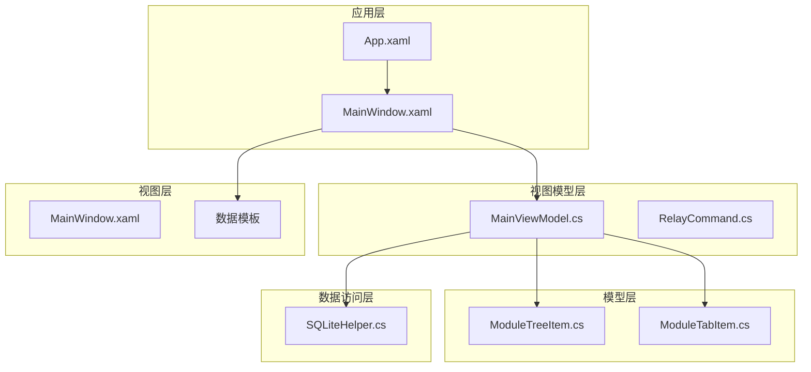

**图表来源**
- [MainWindow.xaml:1-150](file://MainWindow.xaml#L1-L150)
- [MainViewModel.cs:1-100](file://ViewModels/MainViewModel.cs#L1-L100)
- [ModuleTreeItem.cs:1-60](file://Models/ModuleTreeItem.cs#L1-L60)

**章节来源**
- [MainWindow.xaml:1-200](file://MainWindow.xaml#L1-L200)
- [MainViewModel.cs:1-200](file://ViewModels/MainViewModel.cs#L1-L200)

## 核心组件

### ModuleTreeItem 数据模型

ModuleTreeItem是树形导航的核心数据模型，实现了INotifyPropertyChanged接口以支持数据绑定。

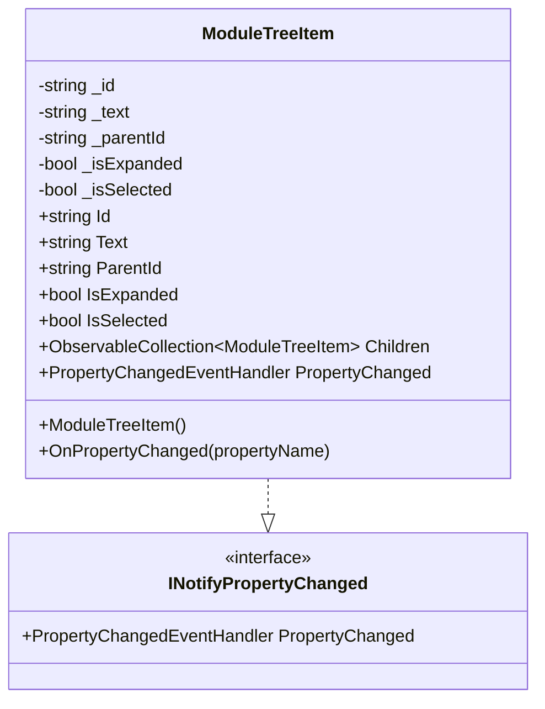

**图表来源**
- [ModuleTreeItem.cs:7-58](file://Models/ModuleTreeItem.cs#L7-L58)

### ModuleTabItem 标签页模型

ModuleTabItem负责管理不同类型的标签页数据，支持多种数据展示模式。

```mermaid
classDiagram
class ModuleTabItem {
-string _header
-string _moduleId
-TabType _tabType
-bool _isSelected
-bool _isMouseOver
+string Header
+string ModuleId
+TabType TabType
+ObservableCollection~FormInfo~ Forms
+ObservableCollection~FormEntityInfo~ FormEntities
+ObservableCollection~FieldInfo~ Fields
+ObservableCollection~EnumItemInfo~ EnumItems
+bool IsSelected
+bool IsMouseOver
+ModuleTabItem()
+OnPropertyChanged(propertyName)
}
enum TabType {
Form,
Entity,
Field,
Enum,
AllFields,
BillType,
AssistantData,
EntityServiceRule,
EntityServiceRuleDetail,
Plugin,
FieldUpdateAction,
FormOperation,
Validation,
FormOperationPlugin,
FormOperationAppService
}
ModuleTabItem --> TabType
```

**图表来源**
- [ModuleTabItem.cs:9-195](file://Models/ModuleTabItem.cs#L9-L195)

**章节来源**
- [ModuleTreeItem.cs:1-60](file://Models/ModuleTreeItem.cs#L1-L60)
- [ModuleTabItem.cs:1-196](file://Models/ModuleTabItem.cs#L1-L196)

## 架构概览

树形导航组件采用MVVM架构模式，实现了清晰的关注点分离：

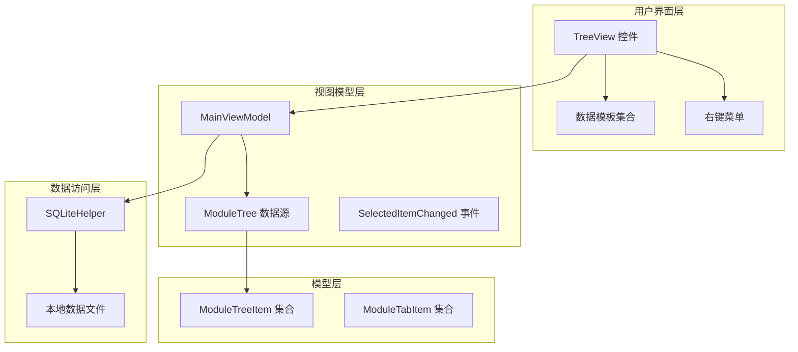

**图表来源**
- [MainWindow.xaml:163-171](file://MainWindow.xaml#L163-L171)
- [MainViewModel.cs:38-56](file://ViewModels/MainViewModel.cs#L38-L56)

## 详细组件分析

### 树形数据绑定机制

树形导航组件使用HierarchicalDataTemplate实现复杂的数据绑定：

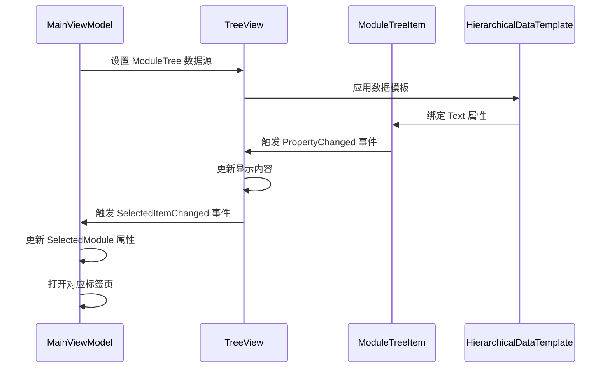

**图表来源**
- [MainWindow.xaml:163-171](file://MainWindow.xaml#L163-L171)
- [MainWindow.xaml.cs:353-359](file://MainWindow.xaml.cs#L353-L359)

### 树形节点展开/折叠逻辑

树形节点的展开和折叠操作通过IsExpanded属性控制：

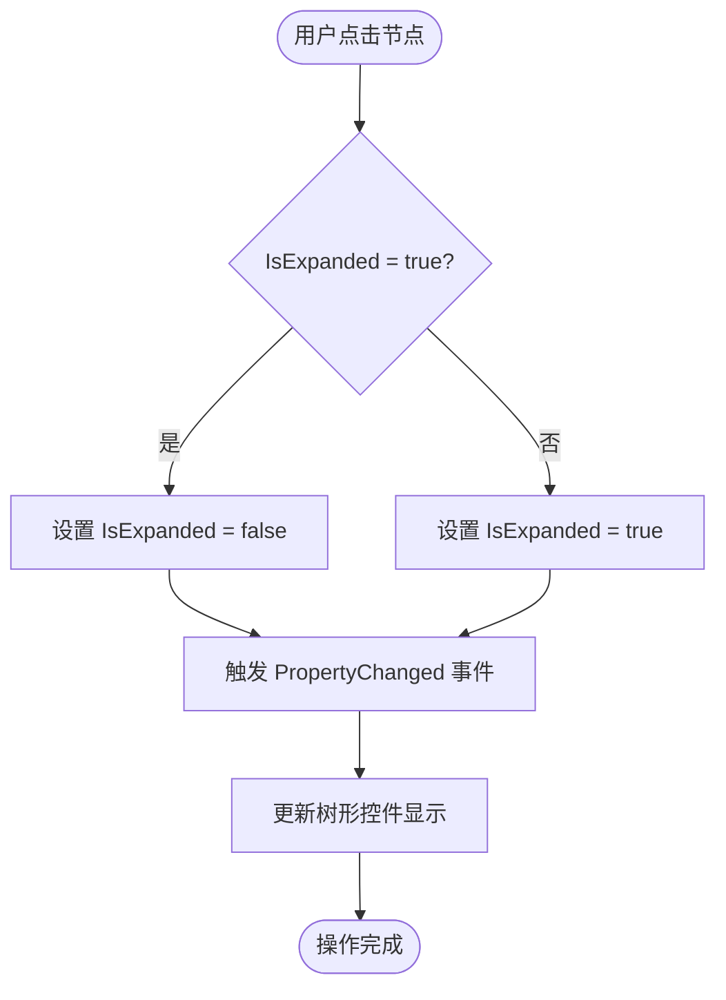

**图表来源**
- [ModuleTreeItem.cs:33-43](file://Models/ModuleTreeItem.cs#L33-L43)

### SelectedItemChanged 事件处理流程

SelectedItemChanged事件是树形导航的核心交互事件：

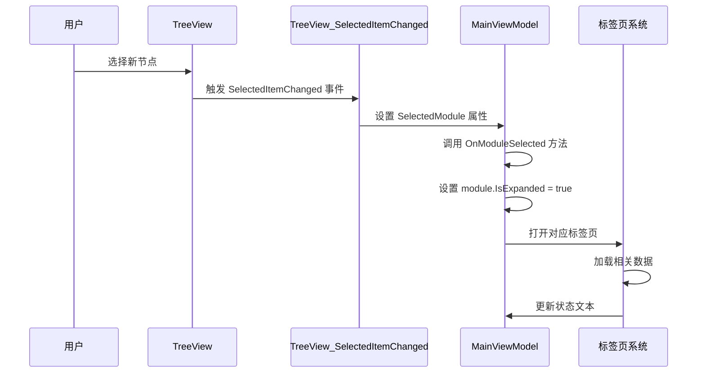

**图表来源**
- [MainWindow.xaml.cs:353-359](file://MainWindow.xaml.cs#L353-L359)
- [MainViewModel.cs:323-335](file://ViewModels/MainViewModel.cs#L323-L335)

**章节来源**
- [MainWindow.xaml.cs:353-359](file://MainWindow.xaml.cs#L353-L359)
- [MainViewModel.cs:323-335](file://ViewModels/MainViewModel.cs#L323-L335)

### 树形导航与主界面交互关系

树形导航组件与主界面其他组件的交互关系：

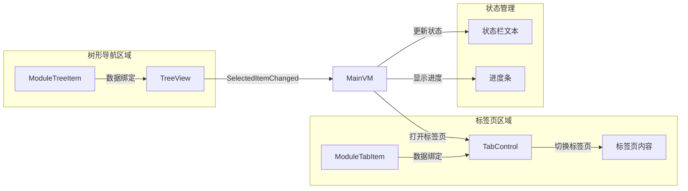

**图表来源**
- [MainWindow.xaml:1680-1685](file://MainWindow.xaml#L1680-L1685)
- [MainViewModel.cs:108-121](file://ViewModels/MainViewModel.cs#L108-L121)

### 树形节点自定义和扩展

#### 节点图标自定义

树形节点的图标可以通过DataTemplate进行自定义：

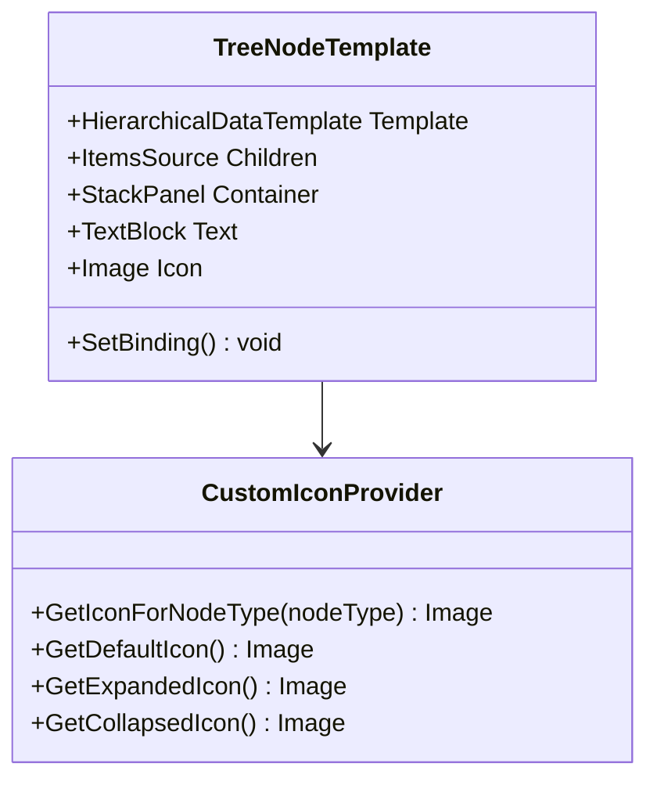

#### 右键菜单功能实现

右键菜单通过ContextMenu控件实现：

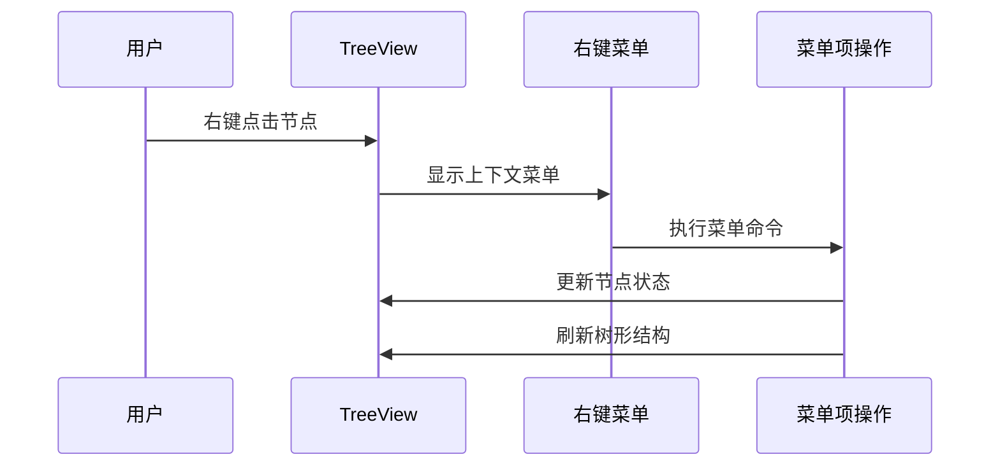

**章节来源**
- [MainWindow.xaml:163-171](file://MainWindow.xaml#L163-L171)
- [MainWindow.xaml.cs:361-371](file://MainWindow.xaml.cs#L361-L371)

## 依赖关系分析

树形导航组件的依赖关系图：

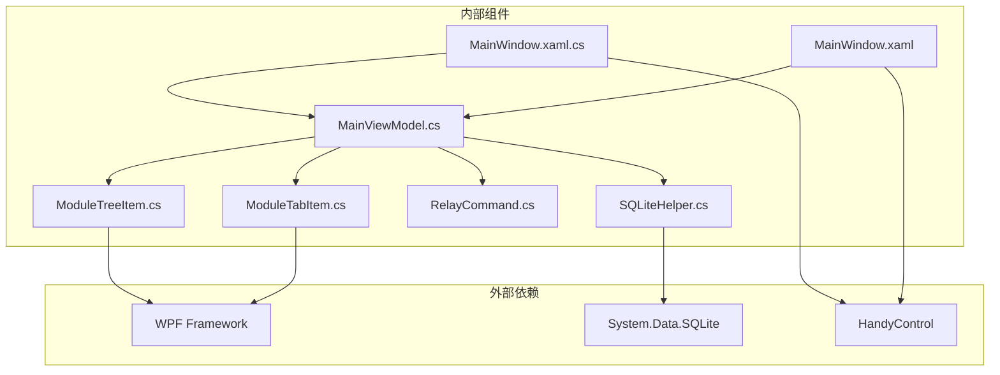

**图表来源**
- [MainWindow.xaml.cs:1-30](file://MainWindow.xaml.cs#L1-L30)
- [MainViewModel.cs:1-20](file://ViewModels/MainViewModel.cs#L1-L20)

**章节来源**
- [MainWindow.xaml.cs:1-50](file://MainWindow.xaml.cs#L1-L50)
- [MainViewModel.cs:1-50](file://ViewModels/MainViewModel.cs#L1-L50)

## 性能考虑

### 数据绑定优化

树形导航组件在性能方面采用了多项优化策略：

1. **延迟加载**：树节点采用延迟加载机制，只有在展开时才加载子节点数据
2. **虚拟化支持**：TreeView控件支持虚拟化，减少大量节点时的内存占用
3. **增量更新**：使用ObservableCollection实现增量更新，避免全量刷新

### 内存管理

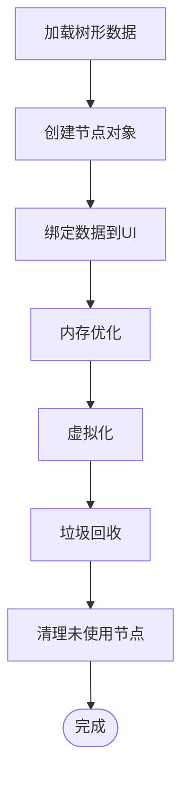

### 并发处理

树形导航组件支持异步数据加载，避免UI阻塞：

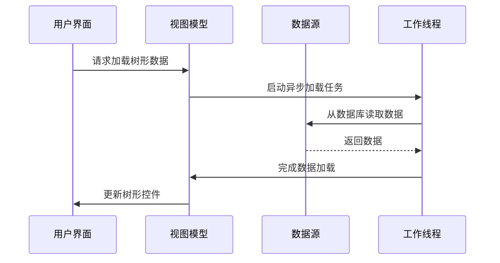

## 故障排除指南

### 常见问题及解决方案

#### 树形节点无法展开

**问题症状**：用户点击节点时无响应

**可能原因**：
1. Children集合为空或未初始化
2. 数据绑定配置错误
3. PropertyChanged事件未正确触发

**解决步骤**：
1. 检查ModuleTreeItem构造函数中的Children初始化
2. 验证HierarchicalDataTemplate配置
3. 确认OnPropertyChanged方法调用

#### SelectedItemChanged事件不触发

**问题症状**：选择节点后SelectedModule属性不更新

**可能原因**：
1. TreeView的SelectedItemChanged事件绑定错误
2. DataContext未正确设置
3. 事件处理器实现问题

**解决步骤**：
1. 检查MainWindow.xaml中的事件绑定
2. 验证MainViewModel的DataContext设置
3. 确认事件处理器方法签名

#### 标签页不显示数据

**问题症状**：打开标签页后显示空白

**可能原因**：
1. 数据加载异步操作未完成
2. 数据绑定路径错误
3. 标签页模板配置问题

**解决步骤**：
1. 检查异步数据加载逻辑
2. 验证数据绑定表达式
3. 确认DataTemplate配置

**章节来源**
- [MainWindow.xaml.cs:353-359](file://MainWindow.xaml.cs#L353-L359)
- [MainViewModel.cs:323-335](file://ViewModels/MainViewModel.cs#L323-L335)

## 结论

金蝶K3 Cloud数据字典系统的树形导航组件是一个设计精良、功能完备的UI组件。通过采用MVVM架构模式，该组件实现了良好的关注点分离，提供了优秀的用户体验和扩展性。

### 主要优势

1. **架构清晰**：MVVM模式确保了代码的可维护性和可测试性
2. **性能优秀**：通过数据绑定和虚拟化技术实现了高效的渲染
3. **扩展性强**：支持自定义节点图标、右键菜单等高级功能
4. **交互友好**：提供了丰富的用户交互体验

### 技术亮点

- **响应式数据绑定**：实现了双向数据绑定，确保UI与数据的实时同步
- **异步数据加载**：避免了UI阻塞，提升了应用响应速度
- **模板化设计**：通过DataTemplate实现了高度可定制的UI外观
- **事件驱动架构**：通过事件机制实现了松耦合的组件交互

该树形导航组件为金蝶K3 Cloud数据字典系统提供了强大的数据浏览和管理能力，是整个系统的重要组成部分。