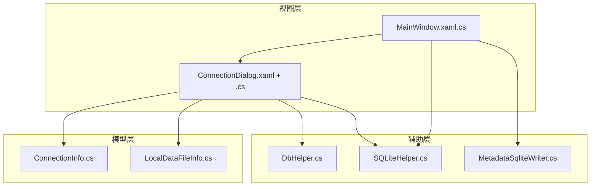
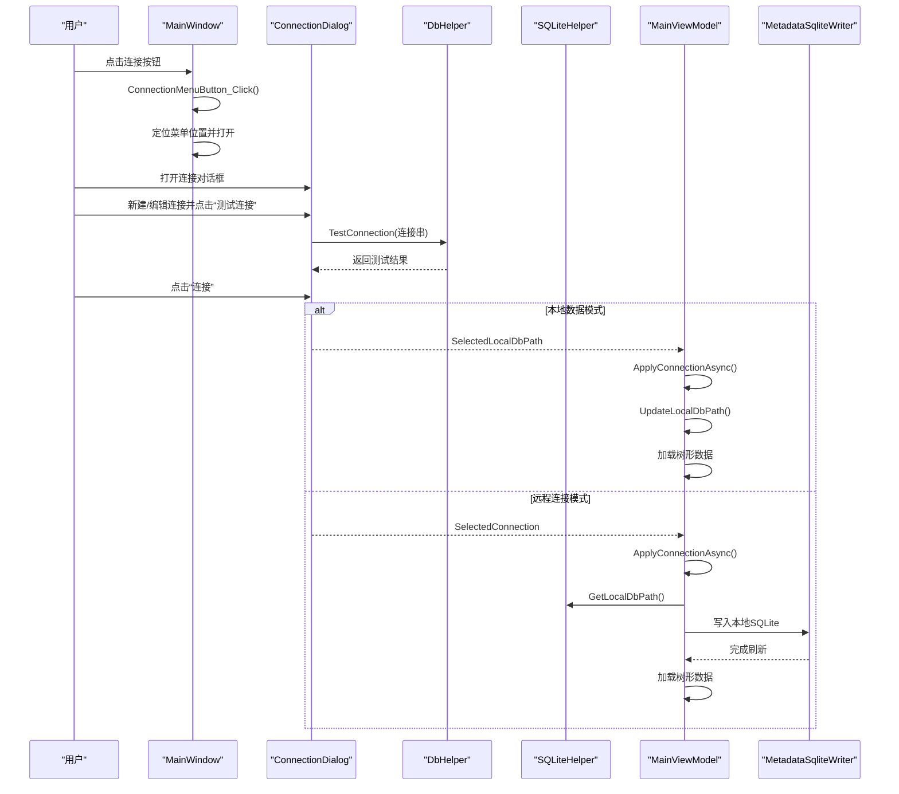
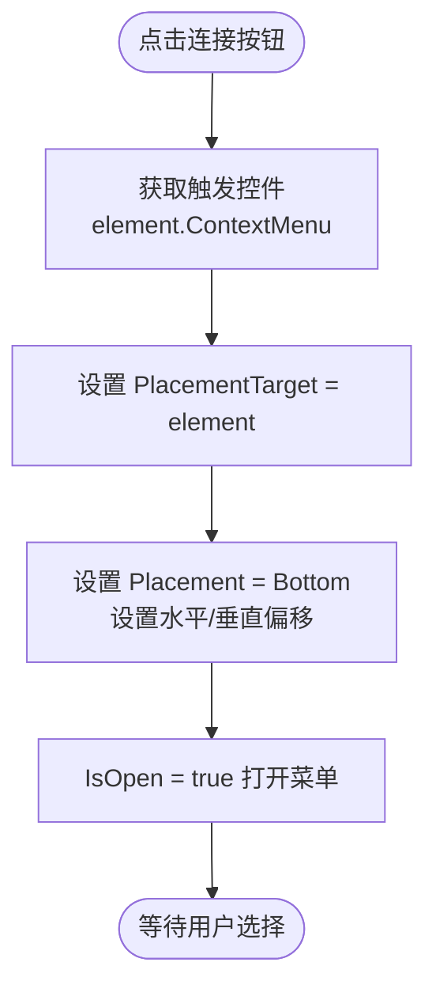
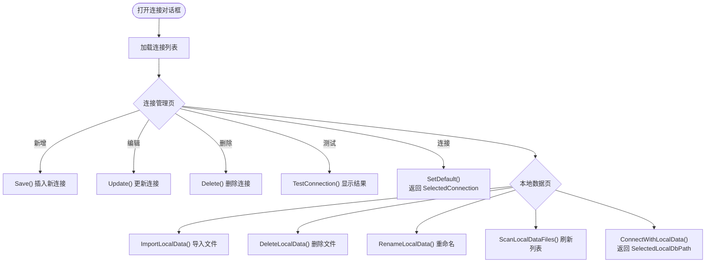
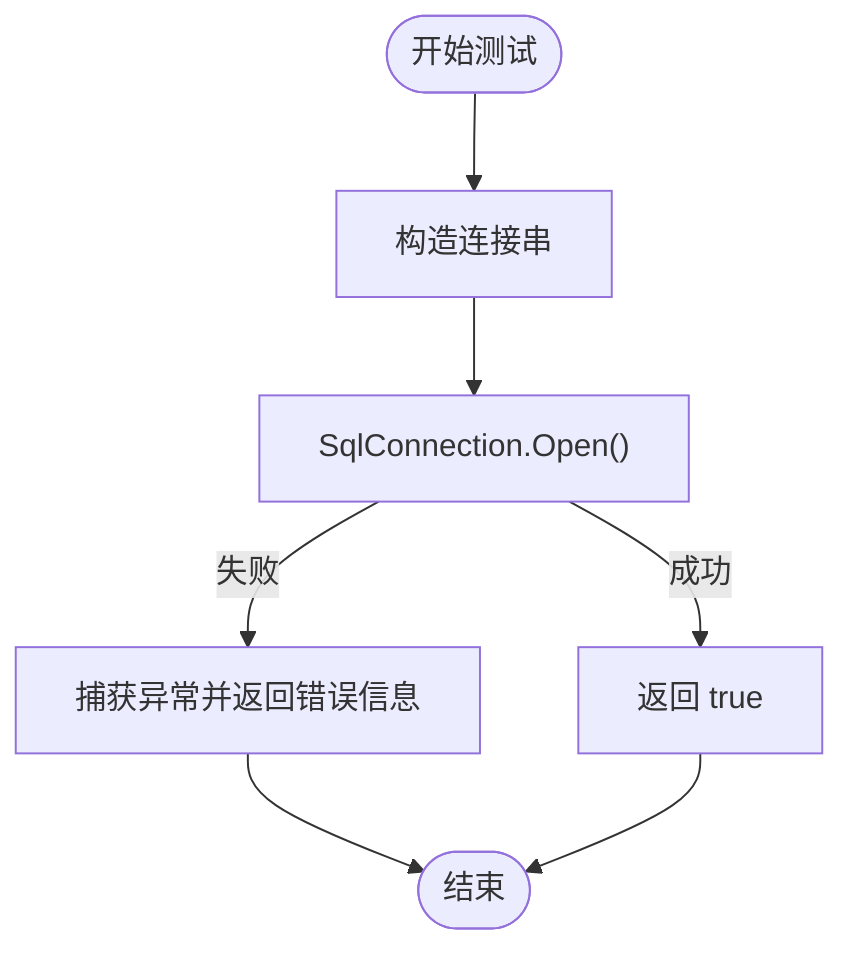
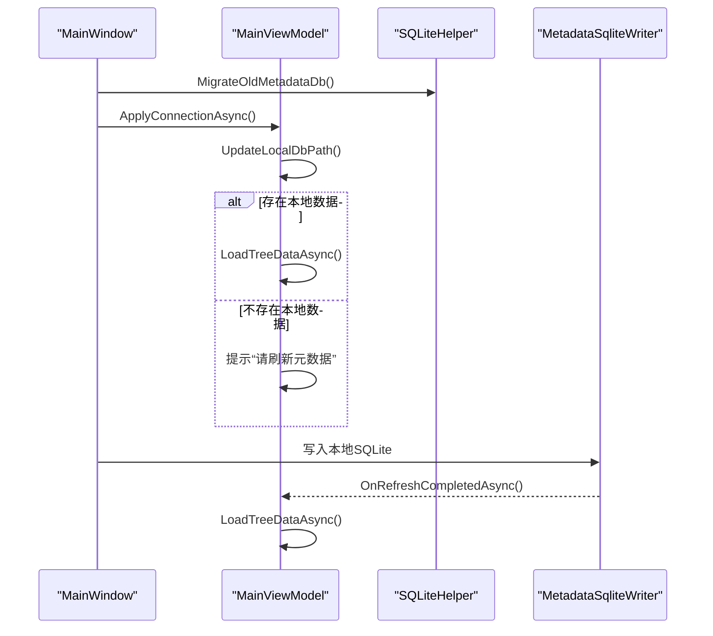
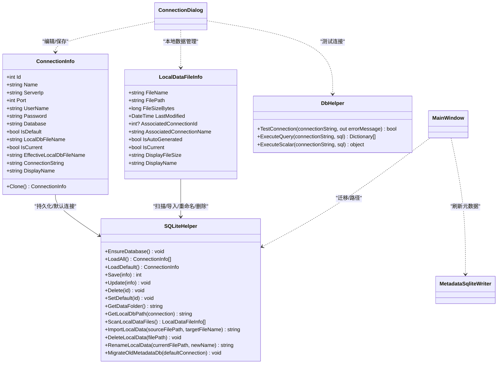
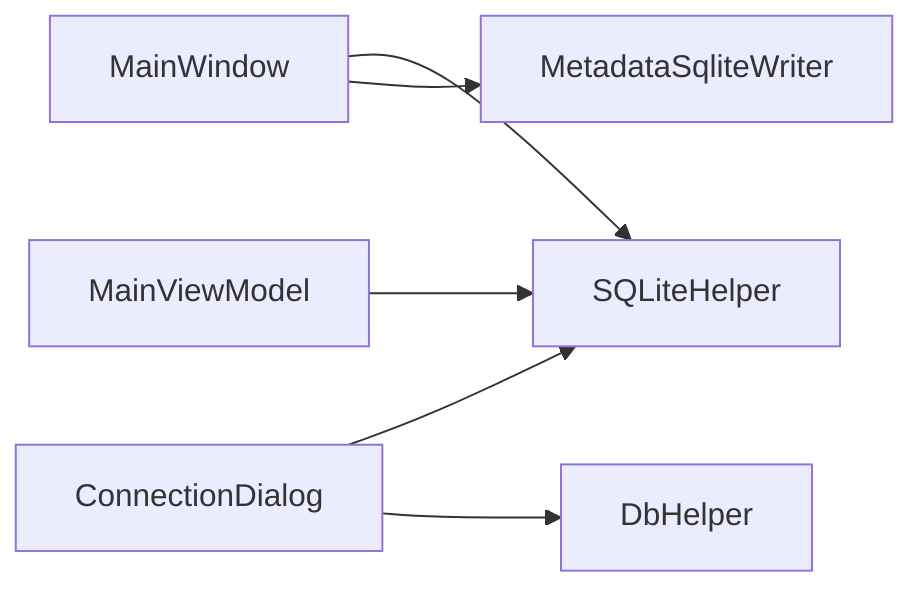

# 连接管理组件

<cite>
**本文档引用的文件**
- [ConnectionDialog.xaml.cs](file://ConnectionDialog.xaml.cs)
- [ConnectionDialog.xaml](file://ConnectionDialog.xaml)
- [MainWindow.xaml.cs](file://MainWindow.xaml.cs)
- [ConnectionInfo.cs](file://Models/ConnectionInfo.cs)
- [LocalDataFileInfo.cs](file://Models/LocalDataFileInfo.cs)
- [SQLiteHelper.cs](file://Helpers/SQLiteHelper.cs)
- [DbHelper.cs](file://Helpers/DbHelper.cs)
- [MetadataSqliteWriter.cs](file://Views/MetadataSqliteWriter.cs)
</cite>

## 目录
1. [简介](#简介)
2. [项目结构](#项目结构)
3. [核心组件](#核心组件)
4. [架构总览](#架构总览)
5. [详细组件分析](#详细组件分析)
6. [依赖关系分析](#依赖关系分析)
7. [性能考虑](#性能考虑)
8. [故障排除指南](#故障排除指南)
9. [结论](#结论)

## 简介
本文件面向金蝶K3 Cloud数据字典系统的“连接管理组件”，围绕以下目标展开：
- 详细说明连接按钮的上下文菜单实现，包括ConnectionMenuButton_Click事件处理与菜单定位逻辑
- 解释ConnectionDialog对话框的功能，涵盖连接配置的添加、编辑、删除与测试
- 说明连接状态的验证与测试机制，特别是远程数据库连接的连通性检查
- 描述连接变更的处理流程，包括本地数据文件的迁移与状态更新
- 提供最佳实践与故障排除建议，并给出实际使用场景与代码示例路径

## 项目结构
连接管理组件主要涉及以下模块：
- 视图层：MainWindow.xaml.cs（主窗口）、ConnectionDialog.xaml（对话框）
- 模型层：ConnectionInfo.cs（连接信息）、LocalDataFileInfo.cs（本地数据文件信息）
- 辅助层：DbHelper.cs（数据库连接测试）、SQLiteHelper.cs（本地连接与本地数据文件管理）
- 视图辅助：MetadataSqliteWriter.cs（本地SQLite写入）

图表来源
- [MainWindow.xaml.cs:361-423](file://MainWindow.xaml.cs#L361-L423)
- [ConnectionDialog.xaml.cs:35-222](file://ConnectionDialog.xaml.cs#L35-L222)
- [ConnectionInfo.cs:6-144](file://Models/ConnectionInfo.cs#L6-L144)
- [LocalDataFileInfo.cs:7-67](file://Models/LocalDataFileInfo.cs#L7-L67)
- [DbHelper.cs:7-70](file://Helpers/DbHelper.cs#L7-L70)
- [SQLiteHelper.cs:10-370](file://Helpers/SQLiteHelper.cs#L10-L370)
- [MetadataSqliteWriter.cs:9-846](file://Views/MetadataSqliteWriter.cs#L9-L846)

章节来源
- [MainWindow.xaml.cs:361-423](file://MainWindow.xaml.cs#L361-L423)
- [ConnectionDialog.xaml.cs:35-222](file://ConnectionDialog.xaml.cs#L35-L222)

## 核心组件
- 连接按钮上下文菜单：MainWindow中ConnectionMenuButton_Click负责定位并打开上下文菜单
- 连接对话框：ConnectionDialog负责连接配置的增删改查、测试与应用
- 连接信息模型：ConnectionInfo承载连接参数与显示名、连接串等
- 本地数据文件模型：LocalDataFileInfo描述本地SQLite文件及其关联关系
- 数据库连接测试：DbHelper.TestConnection提供远程SQL Server连通性检测
- 本地存储与迁移：SQLiteHelper负责连接配置持久化、本地数据扫描与迁移

章节来源
- [ConnectionDialog.xaml.cs:35-222](file://ConnectionDialog.xaml.cs#L35-L222)
- [ConnectionInfo.cs:6-144](file://Models/ConnectionInfo.cs#L6-L144)
- [LocalDataFileInfo.cs:7-67](file://Models/LocalDataFileInfo.cs#L7-L67)
- [DbHelper.cs:7-70](file://Helpers/DbHelper.cs#L7-L70)
- [SQLiteHelper.cs:10-370](file://Helpers/SQLiteHelper.cs#L10-L370)

## 架构总览
连接管理组件的交互流程如下：
- 用户点击主窗口的连接按钮，触发上下文菜单显示
- 用户在对话框中选择或新建连接，进行测试与保存
- 应用连接后，根据连接类型切换到本地数据或远程拉取元数据
- 若为远程连接，支持刷新元数据并将结果写入本地SQLite

图表来源
- [MainWindow.xaml.cs:361-423](file://MainWindow.xaml.cs#L361-L423)
- [ConnectionDialog.xaml.cs:135-222](file://ConnectionDialog.xaml.cs#L135-L222)
- [DbHelper.cs:9-25](file://Helpers/DbHelper.cs#L9-L25)
- [SQLiteHelper.cs:209-213](file://Helpers/SQLiteHelper.cs#L209-L213)
- [MetadataSqliteWriter.cs:27-50](file://Views/MetadataSqliteWriter.cs#L27-L50)

## 详细组件分析

### 上下文菜单实现（ConnectionMenuButton_Click）
- 功能概述：点击连接按钮时，设置菜单的PlacementTarget、Placement、偏移量，并打开菜单
- 关键点：
  - PlacementTarget设为触发控件，确保菜单出现在正确位置
  - Placement为Bottom，水平/垂直偏移控制菜单与按钮的间距
  - 打开后由资源中的ContextMenu响应用户操作

图表来源
- [MainWindow.xaml.cs:361-371](file://MainWindow.xaml.cs#L361-L371)

章节来源
- [MainWindow.xaml.cs:361-371](file://MainWindow.xaml.cs#L361-L371)

### ConnectionDialog 对话框功能
- 连接管理页
  - 加载连接列表：SQLiteHelper.LoadAll()，标记当前连接
  - 新增连接：默认字段，调用SQLiteHelper.Save()插入并刷新列表
  - 编辑连接：双向绑定到EditPanel，点击保存调用SQLiteHelper.Update()
  - 删除连接：确认后SQLiteHelper.Delete()
  - 测试连接：DbHelper.TestConnection()返回成功/失败消息
  - 连接按钮：校验输入，若测试失败允许强制使用；保存默认连接并返回SelectedConnection
- 本地数据页
  - 扫描data目录中的.db文件，区分自动生成与导入文件
  - 支持导入、删除、重命名、刷新列表
  - 本地数据详情展示文件大小、修改时间、关联连接等
  - 使用本地数据：直接返回SelectedLocalDbPath，无需关联连接

图表来源
- [ConnectionDialog.xaml.cs:35-222](file://ConnectionDialog.xaml.cs#L35-L222)
- [ConnectionDialog.xaml.cs:237-487](file://ConnectionDialog.xaml.cs#L237-L487)
- [SQLiteHelper.cs:55-188](file://Helpers/SQLiteHelper.cs#L55-L188)
- [DbHelper.cs:9-25](file://Helpers/DbHelper.cs#L9-L25)

章节来源
- [ConnectionDialog.xaml.cs:35-222](file://ConnectionDialog.xaml.cs#L35-L222)
- [ConnectionDialog.xaml.cs:237-487](file://ConnectionDialog.xaml.cs#L237-L487)

### 连接状态验证与测试机制
- 远程数据库连接测试：DbHelper.TestConnection()使用SqlConnection.Open()尝试连接，捕获异常并返回错误信息
- 本地数据可用性检查：MainWindow.CheckLocalDataAvailability()在对话框关闭后检查本地.db文件是否存在，不存在则清空界面数据并提示

图表来源
- [DbHelper.cs:9-25](file://Helpers/DbHelper.cs#L9-L25)
- [MainWindow.xaml.cs:428-442](file://MainWindow.xaml.cs#L428-L442)

章节来源
- [DbHelper.cs:9-25](file://Helpers/DbHelper.cs#L9-L25)
- [MainWindow.xaml.cs:428-442](file://MainWindow.xaml.cs#L428-L442)

### 连接变更处理流程（本地数据迁移与状态更新）
- 主窗口加载时：若存在CurrentConnection，调用SQLiteHelper.MigrateOldMetadataDb()将旧的metadata.db迁移到按连接命名的新文件
- 应用连接：MainViewModel.ApplyConnectionAsync()更新LocalDbPath，若存在本地数据则加载树形数据，否则提示刷新元数据
- 刷新元数据：MainWindow.RefreshMetadata_Click()先测试远程连接，再通过MetadataSqliteWriter写入本地SQLite并回调OnRefreshCompletedAsync()

图表来源
- [MainWindow.xaml.cs:52-85](file://MainWindow.xaml.cs#L52-L85)
- [MainWindow.xaml.cs:444-538](file://MainWindow.xaml.cs#L444-L538)
- [MainViewModel.cs:246-275](file://ViewModels/MainViewModel.cs#L246-L275)
- [SQLiteHelper.cs:345-367](file://Helpers/SQLiteHelper.cs#L345-L367)
- [MetadataSqliteWriter.cs:27-50](file://Views/MetadataSqliteWriter.cs#L27-L50)

章节来源
- [MainWindow.xaml.cs:52-85](file://MainWindow.xaml.cs#L52-L85)
- [MainWindow.xaml.cs:444-538](file://MainWindow.xaml.cs#L444-L538)
- [MainViewModel.cs:246-275](file://ViewModels/MainViewModel.cs#L246-L275)
- [SQLiteHelper.cs:345-367](file://Helpers/SQLiteHelper.cs#L345-L367)
- [MetadataSqliteWriter.cs:27-50](file://Views/MetadataSqliteWriter.cs#L27-L50)

### 类关系图（代码级）

图表来源
- [ConnectionInfo.cs:6-144](file://Models/ConnectionInfo.cs#L6-L144)
- [LocalDataFileInfo.cs:7-67](file://Models/LocalDataFileInfo.cs#L7-L67)
- [DbHelper.cs:7-70](file://Helpers/DbHelper.cs#L7-L70)
- [SQLiteHelper.cs:10-370](file://Helpers/SQLiteHelper.cs#L10-L370)
- [ConnectionDialog.xaml.cs:35-222](file://ConnectionDialog.xaml.cs#L35-L222)
- [MainWindow.xaml.cs:52-85](file://MainWindow.xaml.cs#L52-L85)
- [MetadataSqliteWriter.cs:27-50](file://Views/MetadataSqliteWriter.cs#L27-L50)

## 依赖关系分析
- 组件耦合
  - MainWindow依赖SQLiteHelper进行连接迁移与路径计算
  - ConnectionDialog依赖SQLiteHelper进行连接与本地数据管理，依赖DbHelper进行连接测试
  - MainViewModel依赖SQLiteHelper进行默认连接加载与本地路径更新
- 外部依赖
  - System.Data.SqlClient用于远程连接测试
  - System.Data.SQLite用于本地数据文件管理与写入

图表来源
- [MainWindow.xaml.cs:52-85](file://MainWindow.xaml.cs#L52-L85)
- [ConnectionDialog.xaml.cs:35-222](file://ConnectionDialog.xaml.cs#L35-L222)
- [DbHelper.cs:7-70](file://Helpers/DbHelper.cs#L7-L70)
- [SQLiteHelper.cs:10-370](file://Helpers/SQLiteHelper.cs#L10-L370)
- [MetadataSqliteWriter.cs:27-50](file://Views/MetadataSqliteWriter.cs#L27-L50)

章节来源
- [MainWindow.xaml.cs:52-85](file://MainWindow.xaml.cs#L52-L85)
- [ConnectionDialog.xaml.cs:35-222](file://ConnectionDialog.xaml.cs#L35-L222)
- [DbHelper.cs:7-70](file://Helpers/DbHelper.cs#L7-L70)
- [SQLiteHelper.cs:10-370](file://Helpers/SQLiteHelper.cs#L10-L370)
- [MetadataSqliteWriter.cs:27-50](file://Views/MetadataSqliteWriter.cs#L27-L50)

## 性能考虑
- 连接测试：DbHelper.TestConnection()使用短生命周期连接，避免长时间占用
- 本地数据扫描：SQLiteHelper.ScanLocalDataFiles()遍历data目录，注意文件数量较多时的I/O开销
- 刷新元数据：MetadataSqliteWriter批量写入，事务包裹减少磁盘写入次数
- UI响应：MainWindow在刷新过程中使用进度条与异步任务，避免阻塞主线程

## 故障排除指南
- 连接测试失败
  - 检查服务器IP、端口、用户名、密码、数据库名是否正确
  - 确认网络连通性与SQL Server实例监听端口
  - 参考DbHelper.TestConnection()返回的错误信息
- 本地数据文件丢失
  - MainWindow.CheckLocalDataAvailability()会在文件不存在时清空界面数据并提示
  - 重新导入或刷新元数据以恢复本地数据
- 本地数据文件重名冲突
  - SQLiteHelper.ImportLocalData()会避免与连接预期文件名冲突，必要时自动加序号
- 旧版metadata.db迁移
  - SQLiteHelper.MigrateOldMetadataDb()仅在无其他数据文件时迁移，避免覆盖用户导入的文件

章节来源
- [DbHelper.cs:9-25](file://Helpers/DbHelper.cs#L9-L25)
- [MainWindow.xaml.cs:428-442](file://MainWindow.xaml.cs#L428-L442)
- [SQLiteHelper.cs:260-303](file://Helpers/SQLiteHelper.cs#L260-L303)
- [SQLiteHelper.cs:345-367](file://Helpers/SQLiteHelper.cs#L345-L367)

## 结论
连接管理组件通过清晰的职责划分与稳健的错误处理，实现了从连接配置、测试、应用到本地数据迁移与刷新的完整闭环。结合上下文菜单与对话框的直观交互，用户可以高效地管理多个连接与本地数据文件，并在远程连接失败时获得明确的反馈与替代方案。