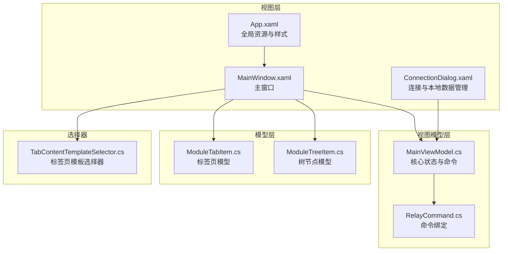
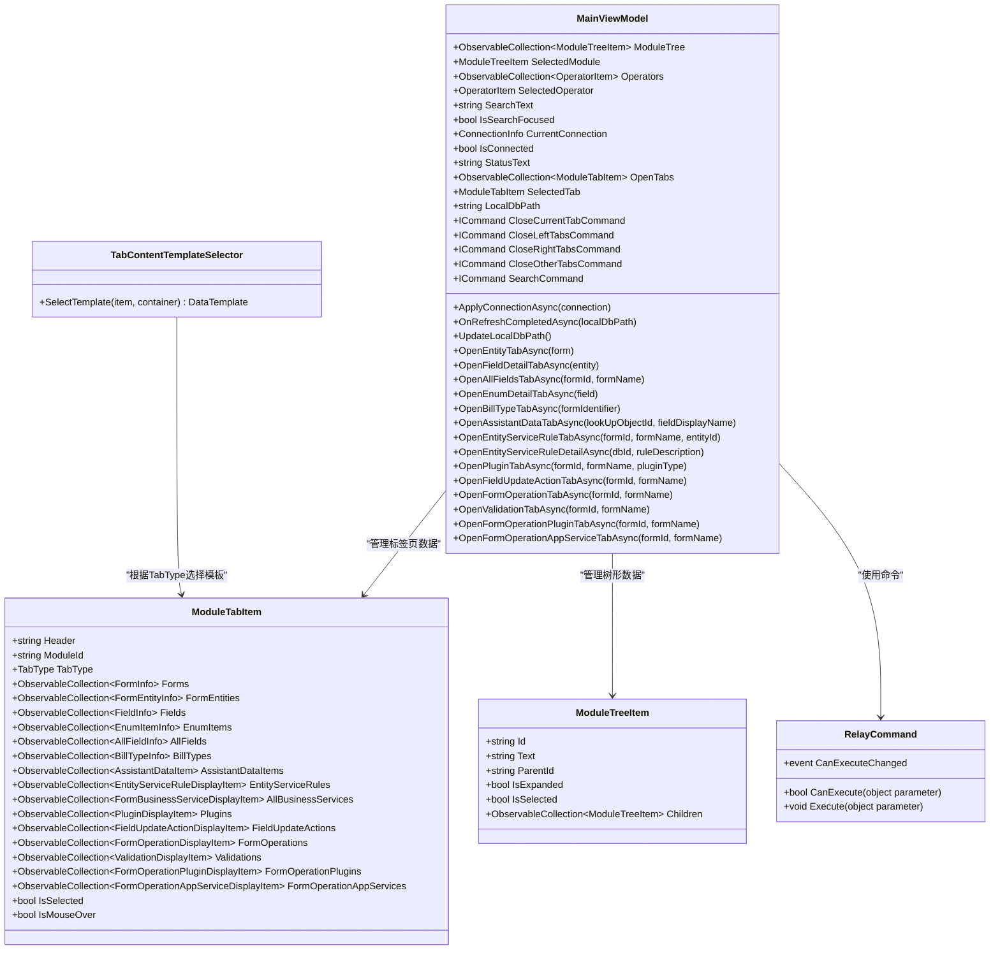
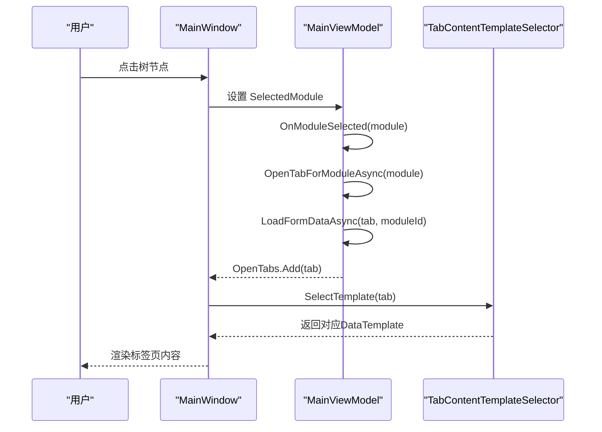
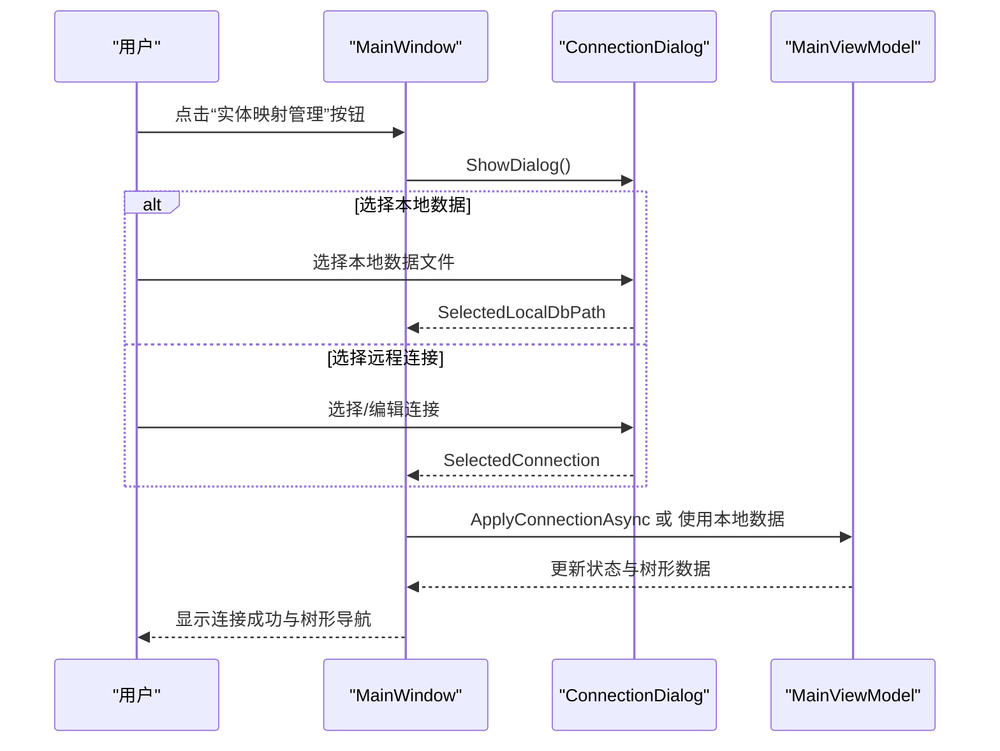
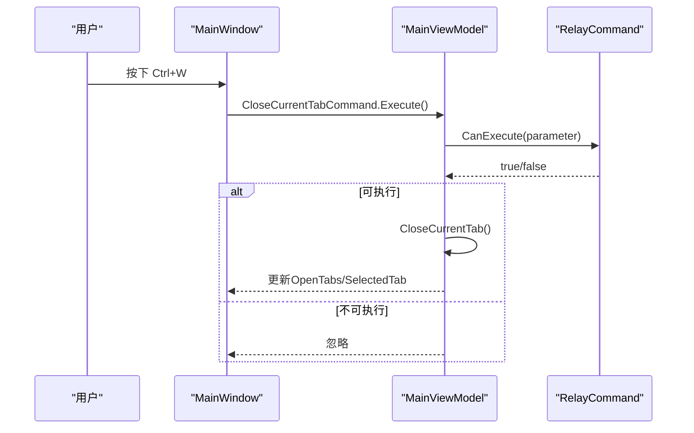
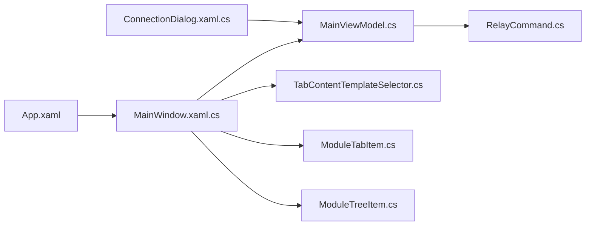

# 用户界面

<cite>
**本文档引用的文件**
- [MainWindow.xaml](file://MainWindow.xaml)
- [MainWindow.xaml.cs](file://MainWindow.xaml.cs)
- [App.xaml](file://App.xaml)
- [App.xaml.cs](file://App.xaml.cs)
- [ConnectionDialog.xaml](file://ConnectionDialog.xaml)
- [ConnectionDialog.xaml.cs](file://ConnectionDialog.xaml.cs)
- [MainViewModel.cs](file://ViewModels/MainViewModel.cs)
- [RelayCommand.cs](file://ViewModels/RelayCommand.cs)
- [TabContentTemplateSelector.cs](file://TabContentTemplateSelector.cs)
- [ModuleTabItem.cs](file://Models/ModuleTabItem.cs)
- [ModuleTreeItem.cs](file://Models/ModuleTreeItem.cs)
</cite>

## 目录
1. [简介](#简介)
2. [项目结构](#项目结构)
3. [核心组件](#核心组件)
4. [架构总览](#架构总览)
5. [详细组件分析](#详细组件分析)
6. [依赖关系分析](#依赖关系分析)
7. [性能考虑](#性能考虑)
8. [故障排除指南](#故障排除指南)
9. [结论](#结论)
10. [附录](#附录)

## 简介
本文件面向金蝶K3 Cloud数据字典系统的WPF用户界面，系统采用MVVM架构，结合HandyControl主题与资源样式，提供连接管理、元数据刷新、树形模块导航与多标签页展示等功能。界面以MainWindow为核心容器，通过MainViewModel承载业务状态与命令，使用RelayCommand实现命令绑定；TabContentTemplateSelector根据标签类型动态选择DataTemplate，实现不同数据视图的统一渲染。

## 项目结构
- 视图层（Views/XAML）
  - MainWindow：主窗口，包含非客户区按钮、树形导航、搜索栏、进度条、标签页容器与上下文菜单等。
  - ConnectionDialog：连接与本地数据管理对话框，支持远程连接增删改查、本地数据导入/删除/重命名/刷新。
  - App.xaml：全局资源与样式定义，包括DataGrid样式、颜色主题与控件样式。
- 视图模型（ViewModels）
  - MainViewModel：应用核心状态与命令，负责树形数据加载、标签页打开与切换、元数据刷新、搜索等。
  - RelayCommand：轻量级ICommand实现，用于绑定UI事件到视图模型方法。
- 模型（Models）
  - ModuleTabItem：标签页数据模型，包含多种TabType及对应集合。
  - ModuleTreeItem：树节点数据模型，支持展开/选择/父子关系。
- 控制器（Code-behind）
  - MainWindow.xaml.cs：窗口生命周期、标签卡渲染、过滤与排序、右键上下文菜单、连接管理对话框交互。
  - ConnectionDialog.xaml.cs：连接列表与编辑、本地数据文件管理、测试连接、导入导出等。
- 选择器（Selectors）
  - TabContentTemplateSelector：根据ModuleTabItem.TabType选择对应DataTemplate。

图表来源
- [MainWindow.xaml](file://MainWindow.xaml)
- [MainWindow.xaml.cs](file://MainWindow.xaml.cs)
- [ConnectionDialog.xaml](file://ConnectionDialog.xaml)
- [ConnectionDialog.xaml.cs](file://ConnectionDialog.xaml.cs)
- [App.xaml](file://App.xaml)
- [MainViewModel.cs](file://ViewModels/MainViewModel.cs)
- [RelayCommand.cs](file://ViewModels/RelayCommand.cs)
- [TabContentTemplateSelector.cs](file://TabContentTemplateSelector.cs)
- [ModuleTabItem.cs](file://Models/ModuleTabItem.cs)
- [ModuleTreeItem.cs](file://Models/ModuleTreeItem.cs)

章节来源
- [MainWindow.xaml](file://MainWindow.xaml)
- [MainWindow.xaml.cs](file://MainWindow.xaml.cs)
- [ConnectionDialog.xaml](file://ConnectionDialog.xaml)
- [ConnectionDialog.xaml.cs](file://ConnectionDialog.xaml.cs)
- [App.xaml](file://App.xaml)
- [MainViewModel.cs](file://ViewModels/MainViewModel.cs)
- [RelayCommand.cs](file://ViewModels/RelayCommand.cs)
- [TabContentTemplateSelector.cs](file://TabContentTemplateSelector.cs)
- [ModuleTabItem.cs](file://Models/ModuleTabItem.cs)
- [ModuleTreeItem.cs](file://Models/ModuleTreeItem.cs)

## 核心组件
- 主窗口（MainWindow）
  - 非客户区区域：实体映射管理按钮，触发连接管理上下文菜单。
  - 树形导航：ModuleTree绑定ModuleTreeItem集合，支持展开/选择事件。
  - 搜索栏：绑定SearchCommand，支持回车触发搜索。
  - 标签页容器：通过TabContentTemplateSelector与多个DataTemplate组合，实现不同TabType的视图渲染。
  - 进度条：元数据刷新过程中的可视化反馈。
- 视图模型（MainViewModel）
  - 状态属性：ModuleTree、SelectedModule、Operators、SelectedOperator、SearchText、IsSearchFocused、CurrentConnection、IsConnected、StatusText、OpenTabs、SelectedTab、LocalDbPath等。
  - 命令：CloseCurrentTabCommand、CloseLeftTabsCommand、CloseRightTabsCommand、CloseOtherTabsCommand、SearchCommand。
  - 方法：ApplyConnectionAsync、OnRefreshCompletedAsync、UpdateLocalDbPath、OpenEntityTabAsync、OpenFieldDetailTabAsync、OpenAllFieldsTabAsync、OpenEnumDetailTabAsync、OpenBillTypeTabAsync、OpenAssistantDataTabAsync、OpenEntityServiceRuleTabAsync、OpenEntityServiceRuleDetailAsync、OpenPluginTabAsync、OpenFieldUpdateActionTabAsync、OpenFormOperationTabAsync、OpenValidationTabAsync、OpenFormOperationPluginTabAsync、OpenFormOperationAppServiceTabAsync等。
- 命令绑定（RelayCommand）
  - 将UI事件（如按钮点击、键盘快捷键）绑定到MainViewModel的方法，支持CanExecute与CommandManager.RequerySuggested。
- 标签页模板选择器（TabContentTemplateSelector）
  - 根据ModuleTabItem.TabType返回对应DataTemplate，覆盖Form、Entity、Field、Enum、AllFields、BillType、AssistantData、EntityServiceRule、EntityServiceRuleDetail、Plugin、FieldUpdateAction、FormOperation、Validation、FormOperationPlugin、FormOperationAppService等类型。
- 模型（ModuleTabItem、ModuleTreeItem）
  - ModuleTabItem：封装各TabType的数据集合与头部标题、模块ID、选中状态等。
  - ModuleTreeItem：封装树节点的Id、Text、ParentId、IsExpanded、IsSelected与Children集合。

章节来源
- [MainWindow.xaml](file://MainWindow.xaml)
- [MainWindow.xaml.cs](file://MainWindow.xaml.cs)
- [MainViewModel.cs](file://ViewModels/MainViewModel.cs)
- [RelayCommand.cs](file://ViewModels/RelayCommand.cs)
- [TabContentTemplateSelector.cs](file://TabContentTemplateSelector.cs)
- [ModuleTabItem.cs](file://Models/ModuleTabItem.cs)
- [ModuleTreeItem.cs](file://Models/ModuleTreeItem.cs)

## 架构总览
系统遵循MVVM模式：
- View（MainWindow/ConnectionDialog）：负责UI呈现与用户交互。
- ViewModel（MainViewModel）：持有业务状态与命令，协调数据加载与页面切换。
- Model（ModuleTabItem/ModuleTreeItem）：承载数据结构。
- Command（RelayCommand）：桥接View与ViewModel的事件绑定。
- Selector（TabContentTemplateSelector）：根据数据类型动态选择视图模板。

图表来源
- [MainViewModel.cs](file://ViewModels/MainViewModel.cs)
- [RelayCommand.cs](file://ViewModels/RelayCommand.cs)
- [ModuleTabItem.cs](file://Models/ModuleTabItem.cs)
- [ModuleTreeItem.cs](file://Models/ModuleTreeItem.cs)
- [TabContentTemplateSelector.cs](file://TabContentTemplateSelector.cs)

章节来源
- [MainViewModel.cs](file://ViewModels/MainViewModel.cs)
- [RelayCommand.cs](file://ViewModels/RelayCommand.cs)
- [ModuleTabItem.cs](file://Models/ModuleTabItem.cs)
- [ModuleTreeItem.cs](file://Models/ModuleTreeItem.cs)
- [TabContentTemplateSelector.cs](file://TabContentTemplateSelector.cs)

## 详细组件分析

### 主窗口（MainWindow）与布局
- 非客户区按钮“实体映射管理”：绑定上下文菜单，提供连接管理、刷新元数据、刷新扩展元数据等入口。
- 树形导航：TreeView绑定ModuleTree，SelectedItemChanged事件驱动MainViewModel.SelectedModule变更，触发标签页打开逻辑。
- 搜索栏：绑定SearchCommand，回车键触发搜索。
- 标签页容器：通过TabContentTemplateSelector与多个DataTemplate组合，实现不同TabType的视图渲染。
- 进度条：元数据刷新过程中显示进度。
- 标签卡渲染：MainWindow.xaml.cs动态生成每个标签卡的卡片式外观，支持鼠标悬停、选中态与右键上下文菜单。

图表来源
- [MainWindow.xaml](file://MainWindow.xaml)
- [MainWindow.xaml.cs](file://MainWindow.xaml.cs)
- [MainViewModel.cs](file://ViewModels/MainViewModel.cs)
- [TabContentTemplateSelector.cs](file://TabContentTemplateSelector.cs)

章节来源
- [MainWindow.xaml](file://MainWindow.xaml)
- [MainWindow.xaml.cs](file://MainWindow.xaml.cs)
- [MainViewModel.cs](file://ViewModels/MainViewModel.cs)
- [TabContentTemplateSelector.cs](file://TabContentTemplateSelector.cs)

### 连接管理对话框（ConnectionDialog）
- 连接管理页签：支持新增、删除、编辑连接，测试连接，保存默认连接。
- 本地数据页签：扫描本地SQLite数据文件，支持导入、删除、重命名、刷新列表，显示文件大小、修改时间、关联连接与数据概览。
- 交互流程：用户在主窗口点击“实体映射管理”按钮打开上下文菜单，选择“连接管理”，弹出ConnectionDialog；用户可在对话框中选择连接或本地数据文件，点击“连接”后返回主窗口并应用连接或本地数据。

图表来源
- [MainWindow.xaml.cs](file://MainWindow.xaml.cs)
- [ConnectionDialog.xaml](file://ConnectionDialog.xaml)
- [ConnectionDialog.xaml.cs](file://ConnectionDialog.xaml.cs)
- [MainViewModel.cs](file://ViewModels/MainViewModel.cs)

章节来源
- [ConnectionDialog.xaml](file://ConnectionDialog.xaml)
- [ConnectionDialog.xaml.cs](file://ConnectionDialog.xaml.cs)
- [MainWindow.xaml.cs](file://MainWindow.xaml.cs)
- [MainViewModel.cs](file://ViewModels/MainViewModel.cs)

### 标签页内容模板选择器（TabContentTemplateSelector）
- 功能：根据ModuleTabItem.TabType返回对应DataTemplate，覆盖多种TabType（Form、Entity、Field、Enum、AllFields、BillType、AssistantData、EntityServiceRule、EntityServiceRuleDetail、Plugin、FieldUpdateAction、FormOperation、Validation、FormOperationPlugin、FormOperationAppService）。
- 作用：实现同一容器内不同数据类型的差异化展示，保持界面一致性与可扩展性。

```mermaid
flowchart TD
Start(["选择模板"]) --> CheckType["检查 TabType"]
CheckType --> |Form| UseForm["返回 FormTabTemplate"]
CheckType --> |Entity| UseEntity["返回 EntityTabTemplate"]
CheckType --> |Field| UseField["返回 FieldTabTemplate"]
CheckType --> |Enum| UseEnum["返回 EnumTabTemplate"]
CheckType --> |AllFields| UseAllFields["返回 AllFieldsTabTemplate"]
CheckType --> |BillType| UseBillType["返回 BillTypeTabTemplate"]
CheckType --> |AssistantData| UseAD["返回 AssistantDataTabTemplate"]
CheckType --> |EntityServiceRule| UseESR["返回 EntityServiceRuleTabTemplate"]
CheckType --> |EntityServiceRuleDetail| UseESRD["返回 EntityServiceRuleDetailTabTemplate"]
CheckType --> |Plugin| UsePlugin["返回 PluginTabTemplate"]
CheckType --> |FieldUpdateAction| UseFUA["返回 FieldUpdateActionTabTemplate"]
CheckType --> |FormOperation| UseFO["返回 FormOperationTabTemplate"]
CheckType --> |Validation| UseVal["返回 ValidationTabTemplate"]
CheckType --> |FormOperationPlugin| UseFOP["返回 FormOperationPluginTabTemplate"]
CheckType --> |FormOperationAppService| UseFOAS["返回 FormOperationAppServiceTabTemplate"]
UseForm --> End(["返回模板"])
UseEntity --> End
UseField --> End
UseEnum --> End
UseAllFields --> End
UseBillType --> End
UseAD --> End
UseESR --> End
UseESRD --> End
UsePlugin --> End
UseFUA --> End
UseFO --> End
UseVal --> End
UseFOP --> End
UseFOAS --> End
```

图表来源
- [TabContentTemplateSelector.cs](file://TabContentTemplateSelector.cs)
- [MainWindow.xaml](file://MainWindow.xaml)

章节来源
- [TabContentTemplateSelector.cs](file://TabContentTemplateSelector.cs)
- [MainWindow.xaml](file://MainWindow.xaml)

### MVVM与命令绑定（RelayCommand）
- MainViewModel内部通过RelayCommand封装ICommand，暴露CloseCurrentTabCommand、CloseLeftTabsCommand、CloseRightTabsCommand、CloseOtherTabsCommand、SearchCommand等命令。
- MainWindow.xaml中通过Command绑定到相应命令，例如Ctrl+W关闭当前标签页。
- RelayCommand支持CanExecute与CommandManager.RequerySuggested，确保UI状态变化时命令可用性正确更新。

图表来源
- [MainWindow.xaml](file://MainWindow.xaml)
- [MainViewModel.cs](file://ViewModels/MainViewModel.cs)
- [RelayCommand.cs](file://ViewModels/RelayCommand.cs)

章节来源
- [MainWindow.xaml](file://MainWindow.xaml)
- [MainViewModel.cs](file://ViewModels/MainViewModel.cs)
- [RelayCommand.cs](file://ViewModels/RelayCommand.cs)

### 数据网格与过滤/排序交互
- MainWindow.xaml中各DataGrid均配置了LoadingRow、PreviewMouseRightButtonDown、MouseDoubleClick、Sorting等事件处理。
- 每个列头包含过滤输入框（TextBox），Tag标记列名，TextChanged事件触发过滤逻辑。
- MainWindow.xaml.cs中实现FilterTextBox_TextChanged，结合防抖计时器与属性缓存，提升过滤性能与响应性。

章节来源
- [MainWindow.xaml](file://MainWindow.xaml)
- [MainWindow.xaml.cs](file://MainWindow.xaml.cs)

## 依赖关系分析
- 组件耦合
  - MainWindow与MainViewModel强绑定（DataContext），通过事件与命令进行交互。
  - TabContentTemplateSelector依赖ModuleTabItem.TabType，实现视图与数据的解耦。
  - RelayCommand作为通用命令基础设施，被MainViewModel广泛使用。
- 外部依赖
  - HandyControl主题与控件样式由App.xaml集中管理。
  - SQLiteHelper用于本地数据文件扫描、导入、重命名、删除等操作。
- 循环依赖
  - 未见明显循环依赖；各层职责清晰，ViewModel不直接依赖View。

图表来源
- [MainWindow.xaml.cs](file://MainWindow.xaml.cs)
- [MainViewModel.cs](file://ViewModels/MainViewModel.cs)
- [RelayCommand.cs](file://ViewModels/RelayCommand.cs)
- [TabContentTemplateSelector.cs](file://TabContentTemplateSelector.cs)
- [ModuleTabItem.cs](file://Models/ModuleTabItem.cs)
- [ModuleTreeItem.cs](file://Models/ModuleTreeItem.cs)
- [ConnectionDialog.xaml.cs](file://ConnectionDialog.xaml.cs)
- [App.xaml](file://App.xaml)

章节来源
- [MainWindow.xaml.cs](file://MainWindow.xaml.cs)
- [MainViewModel.cs](file://ViewModels/MainViewModel.cs)
- [RelayCommand.cs](file://ViewModels/RelayCommand.cs)
- [TabContentTemplateSelector.cs](file://TabContentTemplateSelector.cs)
- [ModuleTabItem.cs](file://Models/ModuleTabItem.cs)
- [ModuleTreeItem.cs](file://Models/ModuleTreeItem.cs)
- [ConnectionDialog.xaml.cs](file://ConnectionDialog.xaml.cs)
- [App.xaml](file://App.xaml)

## 性能考虑
- 数据网格过滤
  - 使用防抖计时器减少频繁查询，避免输入过程中的过度刷新。
  - 属性缓存Dictionary<类型, 字段属性>降低反射开销。
- 异步加载
  - 元数据刷新与数据查询均使用Task.Run与Dispatcher.Invoke，避免UI阻塞。
- 样式与资源
  - App.xaml集中定义样式与颜色，减少重复资源，提高渲染效率。
- 标签页渲染
  - 通过模板选择器与延迟加载内容，仅在选中时显示对应面板，降低内存占用。

## 故障排除指南
- 连接失败
  - 在ConnectionDialog中测试连接，若失败需检查服务器IP、端口、用户名、密码与数据库名称。
  - 主窗口刷新元数据前会检测连接有效性，失败时提示错误信息。
- 本地数据文件丢失
  - 主窗口关闭对话框后检查当前本地数据文件是否存在，不存在则清空主界面数据并提示重新连接或导入数据。
- 元数据刷新异常
  - 刷新过程中避免重复触发；使用Interlocked保证并发安全。
  - 刷新完成后通过OnRefreshCompletedAsync更新状态与树形数据。
- 标签页关闭异常
  - 通过CloseCurrentTab/CloseLeftTabs/CloseRightTabs/CloseOtherTabs命令控制标签页集合，注意SelectedTab的自动切换逻辑。

章节来源
- [MainWindow.xaml.cs](file://MainWindow.xaml.cs)
- [ConnectionDialog.xaml.cs](file://ConnectionDialog.xaml.cs)
- [MainViewModel.cs](file://ViewModels/MainViewModel.cs)

## 结论
本系统通过MVVM架构实现了清晰的职责分离：视图负责交互与展示，视图模型承载业务逻辑与状态，模型提供数据结构，命令与选择器增强可扩展性。MainWindow与MainViewModel配合，结合TabContentTemplateSelector与丰富的DataTemplate，提供了灵活且一致的多标签页体验；ConnectionDialog则完善了连接与本地数据管理能力。整体设计具备良好的可维护性与扩展性，适合后续功能迭代与界面定制。

## 附录
- 界面截图与交互示例
  - 主窗口布局：非客户区按钮、树形导航、搜索栏、进度条、标签页容器与上下文菜单。
  - 连接管理对话框：连接列表与编辑、本地数据文件列表与详情、导入/删除/重命名/刷新操作。
  - 标签页内容：不同TabType对应的不同DataTemplate，包含过滤输入框与双击行为。
- 定制与扩展建议
  - 样式修改：通过App.xaml中的颜色与样式键值进行统一调整。
  - 控件替换：在TabContentTemplateSelector中增加新的TabType与DataTemplate映射，扩展新视图。
  - 命令扩展：在MainViewModel中新增RelayCommand与对应方法，绑定到新的UI事件。
  - 数据模型扩展：在ModuleTabItem中新增集合与属性，配合DataTemplate展示新字段。