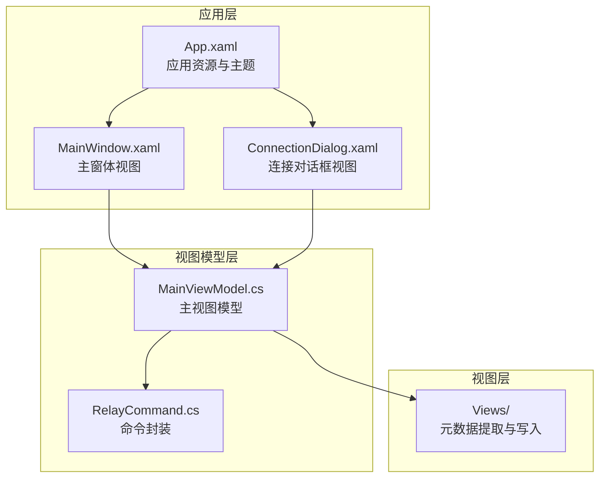
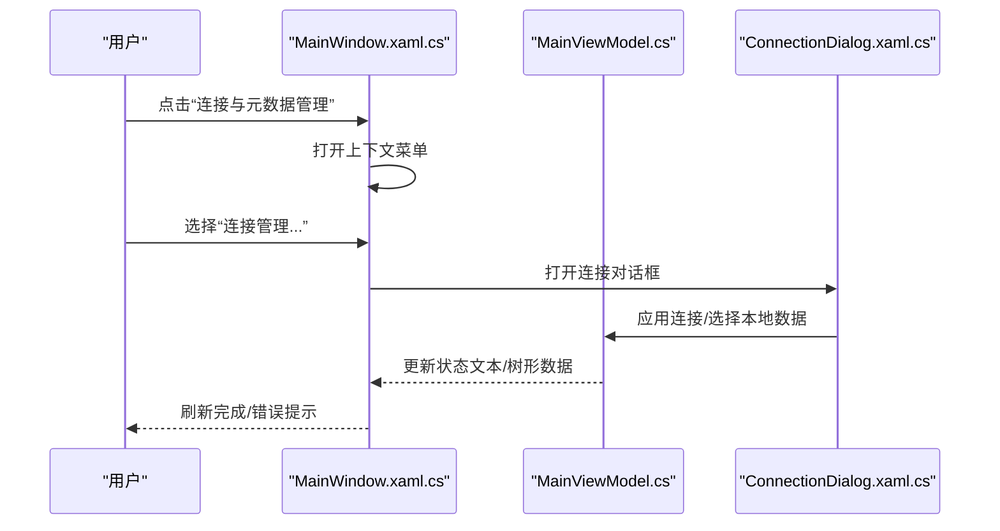
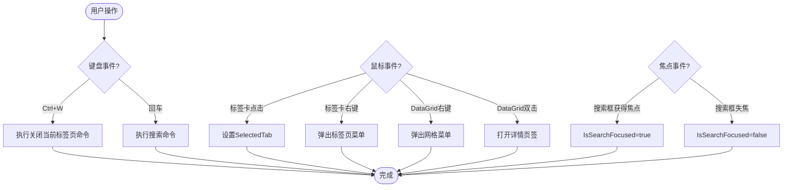
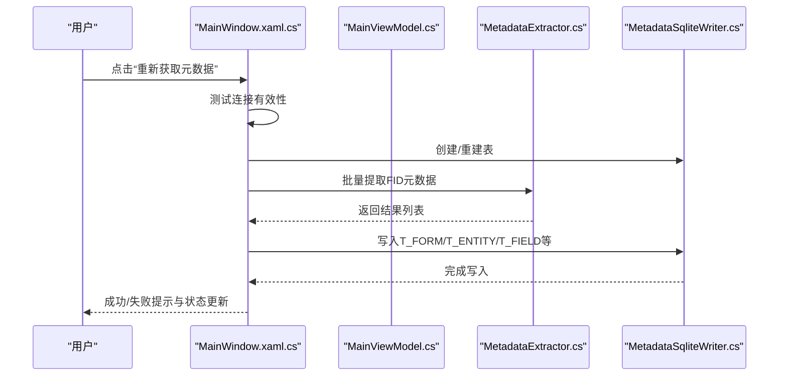
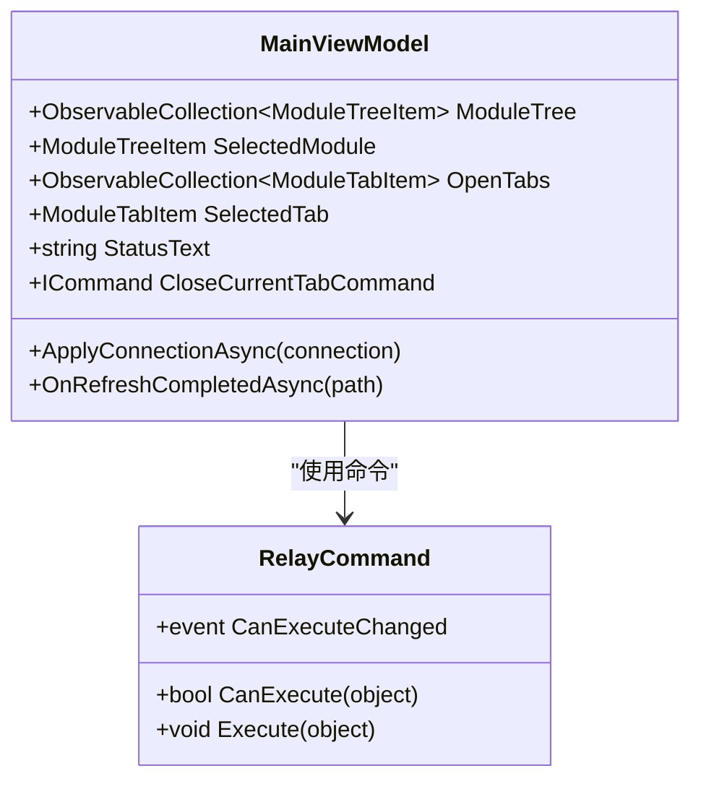
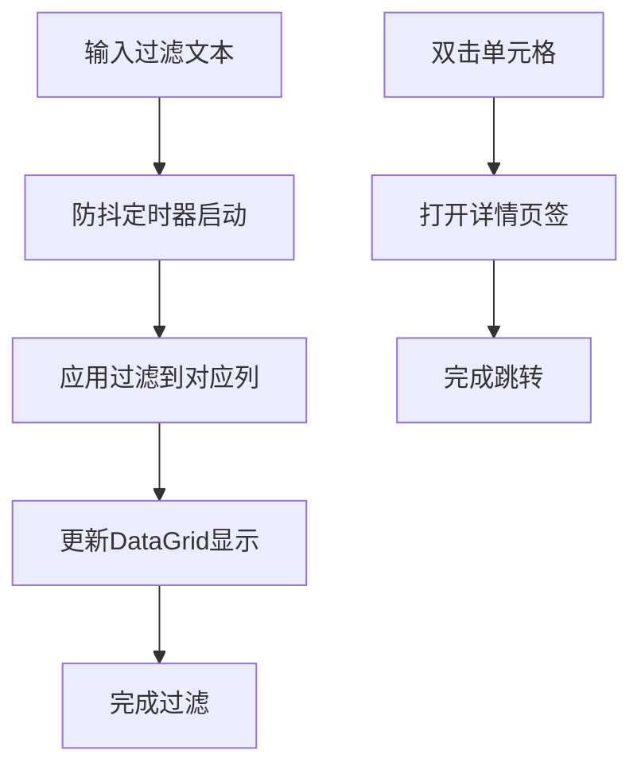
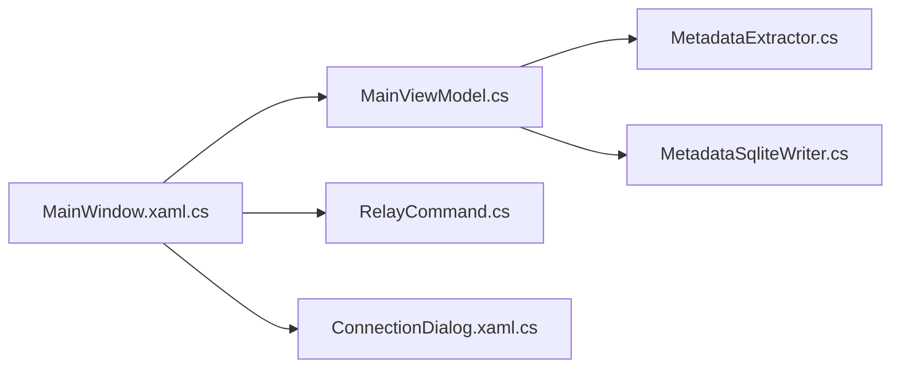
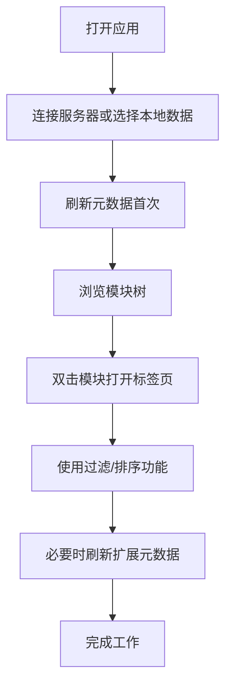

# 界面交互设计

<cite>
**本文档引用的文件**
- [MainWindow.xaml](file://MainWindow.xaml)
- [MainWindow.xaml.cs](file://MainWindow.xaml.cs)
- [App.xaml](file://App.xaml)
- [ConnectionDialog.xaml](file://ConnectionDialog.xaml)
- [ConnectionDialog.xaml.cs](file://ConnectionDialog.xaml.cs)
- [MainViewModel.cs](file://ViewModels/MainViewModel.cs)
- [RelayCommand.cs](file://ViewModels/RelayCommand.cs)
- [MetadataExtractor.cs](file://Views/MetadataExtractor.cs)
- [MetadataSqliteWriter.cs](file://Views/MetadataSqliteWriter.cs)
</cite>

## 目录
1. [简介](#简介)
2. [项目结构](#项目结构)
3. [核心组件](#核心组件)
4. [架构总览](#架构总览)
5. [详细组件分析](#详细组件分析)
6. [依赖关系分析](#依赖关系分析)
7. [性能考虑](#性能考虑)
8. [故障排除指南](#故障排除指南)
9. [结论](#结论)
10. [附录](#附录)

## 简介
本文件面向金蝶K3 Cloud数据字典系统的界面交互设计，围绕用户界面的交互模式、事件处理机制、状态管理、响应式布局以及可用性实践进行系统化阐述。文档基于实际代码实现，结合XAML视图与C#后台逻辑，提供可操作的交互设计指导与最佳实践。

## 项目结构
系统采用经典的MVVM架构，XAML负责声明式UI与样式资源，C#后台处理事件与业务逻辑，ViewModel承载状态与命令，View负责展示与交互。

**图表来源**
- [App.xaml:1-175](file://App.xaml#L1-L175)
- [MainWindow.xaml:1-120](file://MainWindow.xaml#L1-L120)
- [ConnectionDialog.xaml:1-120](file://ConnectionDialog.xaml#L1-L120)
- [MainViewModel.cs:1-120](file://ViewModels/MainViewModel.cs#L1-L120)
- [RelayCommand.cs:1-28](file://ViewModels/RelayCommand.cs#L1-L28)

**章节来源**
- [App.xaml:1-175](file://App.xaml#L1-L175)
- [MainWindow.xaml:1-120](file://MainWindow.xaml#L1-L120)
- [ConnectionDialog.xaml:1-120](file://ConnectionDialog.xaml#L1-L120)

## 核心组件
- 主窗体与非客户区菜单：提供连接管理、元数据刷新、标签页导航等入口。
- 连接对话框：集中管理连接配置与本地数据文件。
- 视图模型：承载树形模块、搜索、状态文本、打开标签页集合与当前选中标签等状态。
- 命令系统：统一的ICommand实现，支持键盘快捷键与按钮触发。
- 数据网格模板：针对不同模块类型（表单、实体、字段、枚举、单据类型等）提供差异化展示与过滤能力。

**章节来源**
- [MainWindow.xaml:16-160](file://MainWindow.xaml#L16-L160)
- [MainWindow.xaml.cs:30-106](file://MainWindow.xaml.cs#L30-L106)
- [MainViewModel.cs:18-120](file://ViewModels/MainViewModel.cs#L18-L120)
- [RelayCommand.cs:1-28](file://ViewModels/RelayCommand.cs#L1-L28)

## 架构总览
系统采用MVVM模式，XAML定义UI结构与样式，后台代码处理事件与异步任务，ViewModel通过INotifyPropertyChanged驱动UI更新。

**图表来源**
- [MainWindow.xaml.cs:361-423](file://MainWindow.xaml.cs#L361-L423)
- [ConnectionDialog.xaml.cs:155-222](file://ConnectionDialog.xaml.cs#L155-L222)
- [MainViewModel.cs:246-275](file://ViewModels/MainViewModel.cs#L246-L275)

## 详细组件分析

### 1) 主窗体交互与事件处理
- 键盘事件
  - Ctrl+W 关闭当前标签页：通过Window.InputBindings绑定KeyBinding到CloseCurrentTabCommand。
  - 搜索框回车触发搜索：SearchTextBox_KeyDown监听Enter键，调用SearchCommand。
- 鼠标事件
  - 标签卡容器滚动与定位：根据SelectedTab在TabScrollViewer中计算偏移并滚动至可见区域。
  - 标签卡左右键事件：外层Border绑定MouseLeftButtonUp切换SelectedTab，MouseRightButtonUp弹出上下文菜单。
  - DataGrid事件：LoadingRow、PreviewMouseRightButtonDown、MouseDoubleClick、Sorting等，支持过滤、排序与双击查看详情。
- 焦点管理
  - 搜索框获得/失去焦点时设置IsSearchFocused，影响占位符显示与交互状态。
- 上下文菜单
  - 连接菜单：连接管理、重新获取元数据、刷新扩展元数据。
  - 标签页菜单：关闭当前、左侧、右侧、其他标签页等。

**图表来源**
- [MainWindow.xaml:16-20](file://MainWindow.xaml#L16-L20)
- [MainWindow.xaml.cs:650-669](file://MainWindow.xaml.cs#L650-L669)
- [MainWindow.xaml.cs:136-162](file://MainWindow.xaml.cs#L136-L162)
- [MainWindow.xaml.cs:280-296](file://MainWindow.xaml.cs#L280-L296)

**章节来源**
- [MainWindow.xaml:16-20](file://MainWindow.xaml#L16-L20)
- [MainWindow.xaml.cs:361-423](file://MainWindow.xaml.cs#L361-L423)
- [MainWindow.xaml.cs:650-669](file://MainWindow.xaml.cs#L650-L669)
- [MainWindow.xaml.cs:136-162](file://MainWindow.xaml.cs#L136-L162)

### 2) 连接与元数据刷新流程
- 连接管理
  - 支持新增、删除、保存连接，测试连接，设置默认连接。
  - 本地数据页签支持导入、删除、重命名、刷新列表，显示文件信息与数据概览。
- 元数据刷新
  - 全量刷新：重建多张核心表，写入查找表与提取结果。
  - 扩展刷新：仅删除存在扩展的旧数据并重新获取。
  - 使用原子标志防止重复刷新，进度条实时反馈。

**图表来源**
- [MainWindow.xaml.cs:444-538](file://MainWindow.xaml.cs#L444-L538)
- [MainWindow.xaml.cs:540-648](file://MainWindow.xaml.cs#L540-L648)
- [MetadataExtractor.cs:299-311](file://Views/MetadataExtractor.cs#L299-L311)
- [MetadataSqliteWriter.cs:27-50](file://Views/MetadataSqliteWriter.cs#L27-L50)

**章节来源**
- [ConnectionDialog.xaml.cs:155-222](file://ConnectionDialog.xaml.cs#L155-L222)
- [MainWindow.xaml.cs:444-538](file://MainWindow.xaml.cs#L444-L538)
- [MainWindow.xaml.cs:540-648](file://MainWindow.xaml.cs#L540-L648)
- [MetadataExtractor.cs:102-138](file://Views/MetadataExtractor.cs#L102-L138)
- [MetadataSqliteWriter.cs:79-283](file://Views/MetadataSqliteWriter.cs#L79-L283)

### 3) 标签页系统与状态管理
- 标签页卡片
  - 动态创建卡片，绑定选中/悬停样式，支持关闭按钮显隐。
  - 滚动至选中标签，确保用户焦点始终可见。
- 状态文本
  - 根据当前标签类型与数据量动态更新状态栏文本，提供加载、成功、错误等状态反馈。
- 事件与命令
  - CloseCurrentTabCommand等命令通过RelayCommand实现，支持CanExecute变更通知。

**图表来源**
- [MainViewModel.cs:18-120](file://ViewModels/MainViewModel.cs#L18-L120)
- [RelayCommand.cs:1-28](file://ViewModels/RelayCommand.cs#L1-L28)

**章节来源**
- [MainWindow.xaml.cs:108-162](file://MainWindow.xaml.cs#L108-L162)
- [MainViewModel.cs:129-172](file://ViewModels/MainViewModel.cs#L129-L172)
- [RelayCommand.cs:1-28](file://ViewModels/RelayCommand.cs#L1-L28)

### 4) 数据网格与过滤交互
- 过滤机制
  - 每列HeaderTemplate内嵌TextBox，Tag标记列名，TextChanged事件触发过滤逻辑（防抖定时器）。
- 排序与右键菜单
  - 支持列头排序，右键弹出网格上下文菜单（复制、导出等）。
- 双击行为
  - 表单/实体/字段等双击打开详情页签，支持跨模块跳转（如枚举、辅助资料、单据类型）。

**图表来源**
- [MainWindow.xaml:202-250](file://MainWindow.xaml#L202-L250)
- [MainWindow.xaml.cs:671-694](file://MainWindow.xaml.cs#L671-L694)

**章节来源**
- [MainWindow.xaml:202-250](file://MainWindow.xaml#L202-L250)
- [MainWindow.xaml:385-506](file://MainWindow.xaml#L385-L506)
- [MainWindow.xaml:508-710](file://MainWindow.xaml#L508-L710)
- [MainWindow.xaml:712-781](file://MainWindow.xaml#L712-L781)
- [MainWindow.xaml:783-880](file://MainWindow.xaml#L783-L880)
- [MainWindow.xaml.cs:671-694](file://MainWindow.xaml.cs#L671-L694)

### 5) 响应式设计与布局适配
- 最小尺寸约束：窗口最小宽高限制，避免过小导致布局错乱。
- 标签页容器：固定卡片宽度，横向滚动，选中项自动居中对齐。
- 数据网格：列宽自适应，支持拖拽调整与排序指示箭头。
- 资源样式：统一颜色体系与控件风格，保证在不同分辨率下的一致性。

**章节来源**
- [MainWindow.xaml:10-14](file://MainWindow.xaml#L10-L14)
- [MainWindow.xaml.cs:108-134](file://MainWindow.xaml.cs#L108-L134)
- [App.xaml:12-35](file://App.xaml#L12-L35)
- [App.xaml:139-171](file://App.xaml#L139-L171)

## 依赖关系分析
- 视图与视图模型
  - MainWindow与MainViewModel通过DataContext绑定，事件回调在MainWindow中处理，状态变化通过INotifyPropertyChanged驱动UI。
- 命令与事件
  - RelayCommand封装ICommand，配合KeyBinding与按钮Click事件，形成统一的交互入口。
- 异步与线程
  - 元数据刷新在后台线程执行，使用Dispatcher.Invoke回到UI线程更新状态与进度条，避免阻塞主线程。

**图表来源**
- [MainWindow.xaml.cs:30-86](file://MainWindow.xaml.cs#L30-L86)
- [MainViewModel.cs:18-120](file://ViewModels/MainViewModel.cs#L18-L120)
- [RelayCommand.cs:1-28](file://ViewModels/RelayCommand.cs#L1-L28)
- [ConnectionDialog.xaml.cs:25-52](file://ConnectionDialog.xaml.cs#L25-L52)
- [MetadataExtractor.cs:102-138](file://Views/MetadataExtractor.cs#L102-L138)
- [MetadataSqliteWriter.cs:27-50](file://Views/MetadataSqliteWriter.cs#L27-L50)

**章节来源**
- [MainWindow.xaml.cs:30-86](file://MainWindow.xaml.cs#L30-L86)
- [MainViewModel.cs:18-120](file://ViewModels/MainViewModel.cs#L18-L120)

## 性能考虑
- 防抖过滤：对文本框输入使用防抖定时器，减少频繁查询与UI刷新。
- 分批写入：元数据提取与写入采用分批策略，降低内存峰值与IO压力。
- 原子刷新：使用Interlocked保护刷新状态，避免重复触发。
- 异步更新：后台线程执行耗时任务，UI线程仅做轻量更新与提示。

[本节为通用建议，无需特定文件引用]

## 故障排除指南
- 连接失败
  - 检查服务器IP、端口、用户名与密码；使用“测试连接”验证。
  - 若连接成功但刷新失败，查看状态文本中的错误消息。
- 本地数据异常
  - 若本地数据文件被删除，系统会清空数据并提示重新连接或导入数据。
  - 本地数据页签支持刷新列表，确保文件路径有效。
- 刷新卡顿
  - 全量刷新涉及大量表重建与写入，建议在空闲时段执行；扩展刷新仅处理存在扩展的对象，速度更快。

**章节来源**
- [ConnectionDialog.xaml.cs:135-153](file://ConnectionDialog.xaml.cs#L135-L153)
- [MainWindow.xaml.cs:444-538](file://MainWindow.xaml.cs#L444-L538)
- [MainWindow.xaml.cs:425-442](file://MainWindow.xaml.cs#L425-L442)

## 结论
本系统通过清晰的MVVM分层、完善的事件与命令机制、以及针对大数据量的异步与分批处理策略，实现了稳定高效的界面交互体验。标签页系统、数据网格过滤与排序、连接与刷新流程均体现了良好的可用性与可维护性。建议在后续迭代中进一步增强错误提示的可读性与可操作性，并优化大表格的虚拟化渲染以提升性能。

## 附录
- 交互示例
  - 快捷键：Ctrl+W 关闭当前标签页。
  - 搜索：在搜索框输入关键字后按回车执行搜索。
  - 过滤：在各列标题下的输入框输入关键词进行过滤。
  - 刷新：点击“重新获取元数据”或“刷新扩展元数据”，等待进度条完成。
- 用户操作流程图（概念）

[本图为概念性流程，无需图表来源]