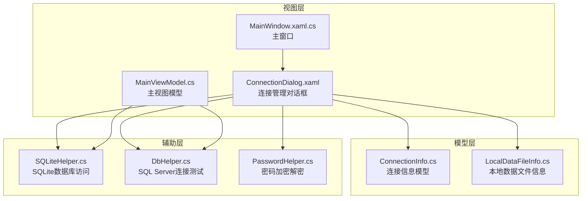
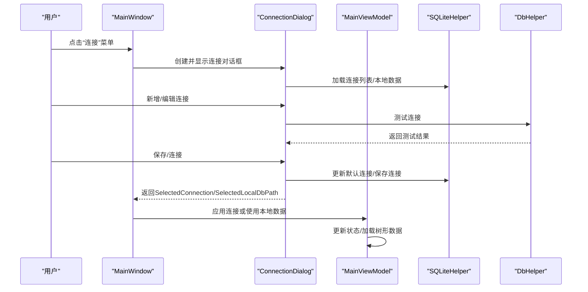
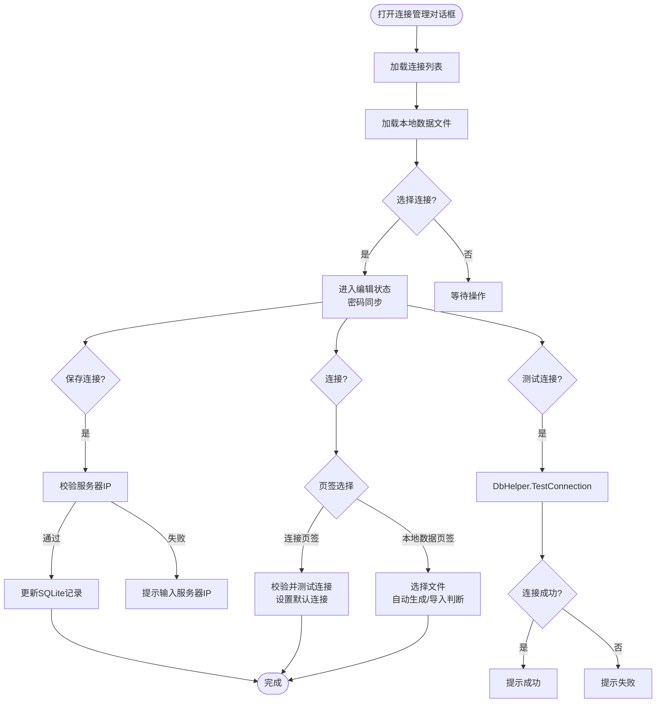
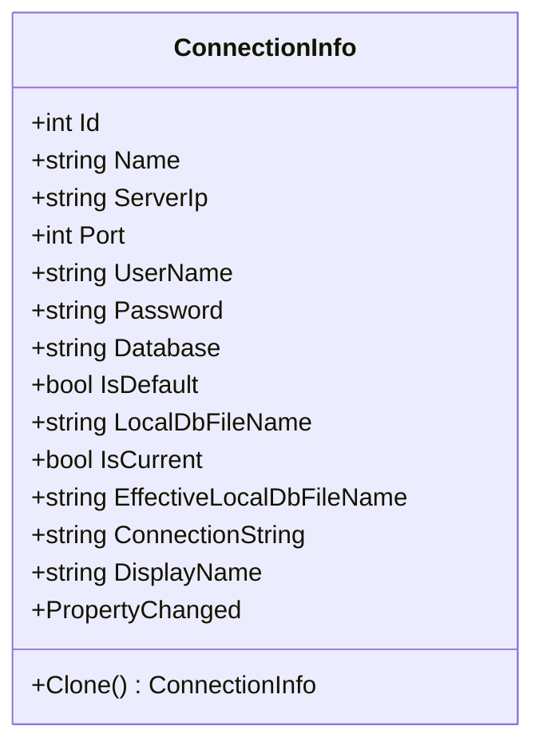
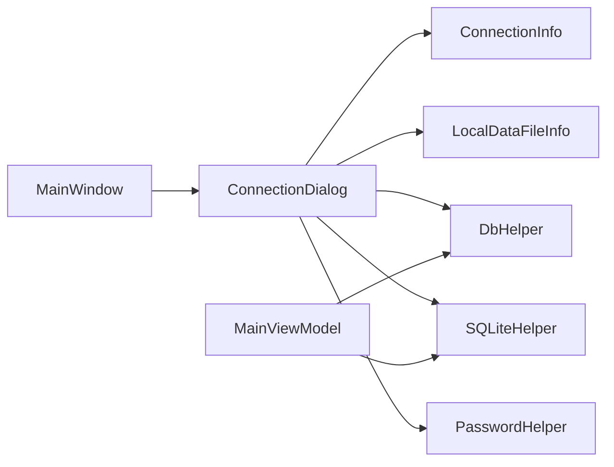

# 连接管理对话框

<cite>
**本文档引用的文件**
- [ConnectionDialog.xaml](file://ConnectionDialog.xaml)
- [ConnectionDialog.xaml.cs](file://ConnectionDialog.xaml.cs)
- [ConnectionInfo.cs](file://Models/ConnectionInfo.cs)
- [LocalDataFileInfo.cs](file://Models/LocalDataFileInfo.cs)
- [DbHelper.cs](file://Helpers/DbHelper.cs)
- [SQLiteHelper.cs](file://Helpers/SQLiteHelper.cs)
- [PasswordHelper.cs](file://Helpers/PasswordHelper.cs)
- [MainWindow.xaml.cs](file://MainWindow.xaml.cs)
- [MainViewModel.cs](file://ViewModels/MainViewModel.cs)
</cite>

## 目录
1. [简介](#简介)
2. [项目结构](#项目结构)
3. [核心组件](#核心组件)
4. [架构总览](#架构总览)
5. [详细组件分析](#详细组件分析)
6. [依赖关系分析](#依赖关系分析)
7. [性能考虑](#性能考虑)
8. [故障排除指南](#故障排除指南)
9. [结论](#结论)
10. [附录](#附录)

## 简介
本文件面向金蝶K3 Cloud数据字典系统的连接管理对话框，提供从界面设计到业务逻辑的全面文档。重点涵盖：
- 连接管理对话框的界面布局与交互流程
- 数据库连接配置界面、连接测试功能、连接信息验证
- 连接信息的数据模型设计（ConnectionInfo类）
- 连接管理的业务逻辑（连接列表维护、默认连接设置、连接状态监控）
- 本地数据文件管理（导入、删除、重命名、自动关联）
- 最佳实践与故障排除指南
- 配置示例与界面截图说明

## 项目结构
连接管理对话框位于WPF应用的视图层，配合模型层的ConnectionInfo与LocalDataFileInfo，以及辅助层的SQLiteHelper、DbHelper、PasswordHelper共同实现完整的连接管理能力。

**图表来源**
- [ConnectionDialog.xaml:1-239](file://ConnectionDialog.xaml#L1-L239)
- [ConnectionDialog.xaml.cs:1-490](file://ConnectionDialog.xaml.cs#L1-L490)
- [ConnectionInfo.cs:1-144](file://Models/ConnectionInfo.cs#L1-L144)
- [LocalDataFileInfo.cs:1-67](file://Models/LocalDataFileInfo.cs#L1-L67)
- [SQLiteHelper.cs:1-370](file://Helpers/SQLiteHelper.cs#L1-L370)
- [DbHelper.cs:1-70](file://Helpers/DbHelper.cs#L1-L70)
- [PasswordHelper.cs:1-46](file://Helpers/PasswordHelper.cs#L1-L46)
- [MainWindow.xaml.cs:1-800](file://MainWindow.xaml.cs#L1-L800)
- [MainViewModel.cs:1-800](file://ViewModels/MainViewModel.cs#L1-L800)

**章节来源**
- [ConnectionDialog.xaml:1-239](file://ConnectionDialog.xaml#L1-L239)
- [ConnectionDialog.xaml.cs:1-490](file://ConnectionDialog.xaml.cs#L1-L490)

## 核心组件
- 连接管理对话框（ConnectionDialog）：负责连接配置、测试、保存；以及本地数据文件的导入、删除、重命名与使用。
- 连接信息模型（ConnectionInfo）：封装连接参数、显示名、连接串、克隆与通知机制。
- 本地数据文件信息（LocalDataFileInfo）：封装本地数据文件的元信息与显示格式。
- 数据库助手（DbHelper）：提供连接测试与SQL查询执行。
- SQLite助手（SQLiteHelper）：提供连接信息的持久化、默认连接设置、本地数据文件扫描与管理。
- 密码助手（PasswordHelper）：提供基于DPAPI的密码加解密。
- 主窗口（MainWindow）与主视图模型（MainViewModel）：负责调用对话框、应用连接、刷新元数据、状态展示。

**章节来源**
- [ConnectionDialog.xaml.cs:1-490](file://ConnectionDialog.xaml.cs#L1-L490)
- [ConnectionInfo.cs:1-144](file://Models/ConnectionInfo.cs#L1-L144)
- [LocalDataFileInfo.cs:1-67](file://Models/LocalDataFileInfo.cs#L1-L67)
- [DbHelper.cs:1-70](file://Helpers/DbHelper.cs#L1-L70)
- [SQLiteHelper.cs:1-370](file://Helpers/SQLiteHelper.cs#L1-L370)
- [PasswordHelper.cs:1-46](file://Helpers/PasswordHelper.cs#L1-L46)
- [MainWindow.xaml.cs:1-800](file://MainWindow.xaml.cs#L1-L800)
- [MainViewModel.cs:1-800](file://ViewModels/MainViewModel.cs#L1-L800)

## 架构总览
连接管理对话框采用MVVM模式，界面通过XAML绑定到ViewModel中的集合与命令，业务逻辑集中在代码隐藏与辅助类中。连接信息存储于SQLite数据库，本地数据文件存放在应用目录的data文件夹中。

**图表来源**
- [MainWindow.xaml.cs:373-423](file://MainWindow.xaml.cs#L373-L423)
- [ConnectionDialog.xaml.cs:155-222](file://ConnectionDialog.xaml.cs#L155-L222)
- [SQLiteHelper.cs:55-188](file://Helpers/SQLiteHelper.cs#L55-L188)
- [DbHelper.cs:9-25](file://Helpers/DbHelper.cs#L9-L25)

## 详细组件分析

### 连接管理对话框（ConnectionDialog）
- 界面布局
  - 顶部标题栏与任务栏禁用
  - 左侧连接列表、中间编辑面板、右侧本地数据页签
  - 编辑面板支持名称、服务器、端口、用户名、密码、数据库、测试连接、保存
  - 本地数据页签支持导入、删除、刷新、重命名、使用此数据
- 交互逻辑
  - 选择连接后进入编辑状态，密码框实时同步
  - 新增连接时自动标记为默认连接（若列表为空）
  - 保存连接时进行基本校验（服务器IP必填）
  - 测试连接时调用DbHelper.TestConnection，弹窗提示结果
  - 连接按钮支持两种模式：从连接页签选择连接并测试，或从本地数据页签选择文件直接使用
  - 本地数据文件详情根据是否自动生成显示不同UI控件与信息
- 数据绑定
  - 使用ObservableCollection维护连接与本地数据列表
  - PasswordBox通过PasswordChanged事件同步到编辑副本
  - 本地数据文件列表支持当前使用标记与自动关联显示

**图表来源**
- [ConnectionDialog.xaml.cs:35-133](file://ConnectionDialog.xaml.cs#L35-L133)
- [ConnectionDialog.xaml.cs:135-222](file://ConnectionDialog.xaml.cs#L135-L222)
- [DbHelper.cs:9-25](file://Helpers/DbHelper.cs#L9-L25)

**章节来源**
- [ConnectionDialog.xaml:1-239](file://ConnectionDialog.xaml#L1-L239)
- [ConnectionDialog.xaml.cs:1-490](file://ConnectionDialog.xaml.cs#L1-L490)

### 连接信息数据模型（ConnectionInfo）
- 属性定义
  - Id、Name、ServerIp、Port、UserName、Password、Database、IsDefault、LocalDbFileName
  - IsCurrent：仅用于UI显示，不持久化
  - EffectiveLocalDbFileName：优先使用LocalDbFileName，否则用数据库名生成，否则默认文件名
  - ConnectionString：拼接SQL Server连接串
  - DisplayName：综合显示名称（名称+数据库、仅名称、仅服务器端口+数据库、仅服务器端口）
  - Clone：深拷贝用于编辑副本
- 通知机制
  - 实现INotifyPropertyChanged，属性变更触发UI更新
- 数据验证
  - 保存时对服务器IP进行非空校验
  - 测试时同样校验服务器IP

**图表来源**
- [ConnectionInfo.cs:6-142](file://Models/ConnectionInfo.cs#L6-L142)

**章节来源**
- [ConnectionInfo.cs:1-144](file://Models/ConnectionInfo.cs#L1-L144)

### 本地数据文件管理（LocalDataFileInfo）
- 字段
  - FileName、FilePath、FileSizeBytes、LastModified
  - AssociatedConnectionId、AssociatedConnectionName：自动生成文件时关联的连接
  - IsAutoGenerated：是否自动生成
  - IsCurrent：当前使用标记（仅UI）
  - DisplayFileSize：人性化显示文件大小
  - DisplayName：自动生成文件显示关联连接名，否则显示文件名
- 用途
  - 作为本地数据列表的项，承载文件元信息与显示格式
  - 支持区分自动生成与导入两类文件的不同UI行为

**章节来源**
- [LocalDataFileInfo.cs:1-67](file://Models/LocalDataFileInfo.cs#L1-L67)

### 数据库连接测试（DbHelper）
- TestConnection
  - 接收连接串，尝试打开SqlConnection
  - 成功返回true，失败捕获异常并返回错误消息
- ExecuteQuery/ExecuteScalar
  - 提供通用查询与标量子查询能力，设置CommandTimeout为60秒

**章节来源**
- [DbHelper.cs:1-70](file://Helpers/DbHelper.cs#L1-L70)

### SQLite连接与本地数据管理（SQLiteHelper）
- 连接信息持久化
  - EnsureDatabase：确保data目录与connections.db存在
  - LoadAll/LoadDefault：读取连接列表与默认连接
  - Save/Update/Delete/SetDefault：CRUD与默认标记管理
  - ClearDefaultFlag：统一清除默认标记后再设置新的默认连接
- 本地数据文件管理
  - GetDataFolder：data目录
  - GetLocalDbPath：根据连接EffectiveLocalDbFileName生成本地文件路径
  - ScanLocalDataFiles：扫描data目录下所有.db文件，识别自动生成文件并关联连接
  - ImportLocalData/RenameLocalData/DeleteLocalData：导入、重命名、删除本地数据文件
  - MigrateOldMetadataDb：旧版升级迁移逻辑

**章节来源**
- [SQLiteHelper.cs:1-370](file://Helpers/SQLiteHelper.cs#L1-L370)

### 密码安全（PasswordHelper）
- Encrypt/Decrypt：使用DPAPI对密码进行加密与解密，作用域为CurrentUser
- 存储策略：数据库中存储加密后的密码，读取时解密

**章节来源**
- [PasswordHelper.cs:1-46](file://Helpers/PasswordHelper.cs#L1-L46)

### 主窗口与视图模型集成
- MainWindow.MenuConnection_Click：创建并显示ConnectionDialog，根据返回值应用连接或使用本地数据
- MainViewModel.ApplyConnectionAsync：应用连接、切换本地数据路径、加载树形数据
- MainViewModel.UpdateLocalDbPath：根据当前连接更新本地数据文件路径
- MainWindow.CheckLocalDataAvailability：检测本地数据文件是否存在，不存在则清空界面数据并提示

**章节来源**
- [MainWindow.xaml.cs:373-423](file://MainWindow.xaml.cs#L373-L423)
- [MainWindow.xaml.cs:428-442](file://MainWindow.xaml.cs#L428-L442)
- [MainViewModel.cs:246-290](file://ViewModels/MainViewModel.cs#L246-L290)

## 依赖关系分析
- ConnectionDialog依赖
  - Models：ConnectionInfo、LocalDataFileInfo
  - Helpers：DbHelper（连接测试）、SQLiteHelper（持久化与本地数据）、PasswordHelper（密码加解密）
  - WPF：XAML绑定、事件处理
- 业务耦合
  - 连接列表与默认连接设置强依赖SQLiteHelper
  - 本地数据文件与连接的关联通过SQLiteHelper.ScanLocalDataFiles与ConnectionInfo.EffectiveLocalDbFileName实现
  - 连接测试依赖DbHelper.TestConnection
- 外部依赖
  - System.Data.SqlClient：SQL Server连接
  - System.Data.SQLite：本地数据文件存储
  - DPAPI：密码保护

**图表来源**
- [ConnectionDialog.xaml.cs:1-490](file://ConnectionDialog.xaml.cs#L1-L490)
- [SQLiteHelper.cs:1-370](file://Helpers/SQLiteHelper.cs#L1-L370)
- [DbHelper.cs:1-70](file://Helpers/DbHelper.cs#L1-L70)
- [PasswordHelper.cs:1-46](file://Helpers/PasswordHelper.cs#L1-L46)
- [MainWindow.xaml.cs:1-800](file://MainWindow.xaml.cs#L1-L800)
- [MainViewModel.cs:1-800](file://ViewModels/MainViewModel.cs#L1-L800)

**章节来源**
- [ConnectionDialog.xaml.cs:1-490](file://ConnectionDialog.xaml.cs#L1-L490)
- [SQLiteHelper.cs:1-370](file://Helpers/SQLiteHelper.cs#L1-L370)
- [DbHelper.cs:1-70](file://Helpers/DbHelper.cs#L1-L70)
- [PasswordHelper.cs:1-46](file://Helpers/PasswordHelper.cs#L1-L46)
- [MainWindow.xaml.cs:1-800](file://MainWindow.xaml.cs#L1-L800)
- [MainViewModel.cs:1-800](file://ViewModels/MainViewModel.cs#L1-L800)

## 性能考虑
- 连接测试
  - DbHelper.TestConnection使用短生命周期的SqlConnection，避免长时间占用
  - 建议在用户操作后异步执行测试，避免阻塞UI线程
- 本地数据文件扫描
  - ScanLocalDataFiles遍历data目录，建议限制文件数量或增加缓存
- 默认连接设置
  - SetDefault前先ClearDefaultFlag，避免重复默认标记导致的查询异常
- 密码处理
  - PasswordHelper使用DPAPI，性能开销较小，但需注意跨用户环境不可用

[本节为一般性指导，无需特定文件来源]

## 故障排除指南
- 连接测试失败
  - 检查服务器IP、端口、用户名、密码是否正确
  - 确认网络连通性与SQL Server实例监听端口
  - 查看错误消息并根据提示修正
- 无法保存连接
  - 确保服务器IP非空
  - 检查SQLite数据库写权限
- 本地数据文件无法使用
  - 确认文件存在且未被删除
  - 若为自动生成文件，确认其关联的连接仍存在
- 密码显示异常
  - 确认当前用户上下文一致（DPAPI作用域）
- 默认连接未生效
  - 检查SetDefault是否成功执行，确认ClearDefaultFlag逻辑

**章节来源**
- [ConnectionDialog.xaml.cs:135-222](file://ConnectionDialog.xaml.cs#L135-L222)
- [DbHelper.cs:9-25](file://Helpers/DbHelper.cs#L9-L25)
- [SQLiteHelper.cs:176-196](file://Helpers/SQLiteHelper.cs#L176-L196)
- [PasswordHelper.cs:1-46](file://Helpers/PasswordHelper.cs#L1-L46)
- [MainWindow.xaml.cs:428-442](file://MainWindow.xaml.cs#L428-L442)

## 结论
连接管理对话框通过清晰的界面与完善的业务逻辑，实现了连接配置、测试、保存与本地数据管理的闭环。结合SQLite与DPAPI的安全策略，既保证了易用性也兼顾了安全性。建议在生产环境中遵循最佳实践，定期备份连接信息与本地数据文件，并保持网络与数据库实例的稳定运行。

[本节为总结性内容，无需特定文件来源]

## 附录

### 界面截图与配置示例
- 连接管理页签
  - 左侧连接列表：支持新增、删除、选择
  - 右侧编辑面板：名称、服务器、端口、用户名、密码、数据库、测试连接、保存
  - 示例配置：服务器IP为192.168.1.100，端口1433，数据库名称为K3Cloud，用户名/密码正确
- 本地数据页签
  - 左侧本地数据文件列表：支持导入、删除、刷新、重命名（导入文件）
  - 右侧详情：显示文件大小、修改时间、关联连接（自动生成文件）、数据概览（表单/实体/字段计数）
  - 示例：导入一个.db文件，重命名为MyData.db，然后使用该文件进行本地数据浏览

[本节为概念性说明，无需特定文件来源]

### 最佳实践
- 连接配置
  - 为每个数据库实例配置独立连接，便于区分与管理
  - 设置默认连接，减少每次启动选择连接的时间
  - 定期测试连接，确保网络与数据库可用
- 本地数据管理
  - 优先使用自动生成的本地数据文件，避免与导入文件命名冲突
  - 导入文件时注意命名规范，避免非法字符
  - 定期清理不再使用的本地数据文件，释放磁盘空间
- 安全与备份
  - 密码使用DPAPI加密存储，注意跨用户环境差异
  - 定期备份connections.db与重要的本地数据文件
  - 在团队环境中统一连接命名与默认连接策略

[本节为一般性指导，无需特定文件来源]