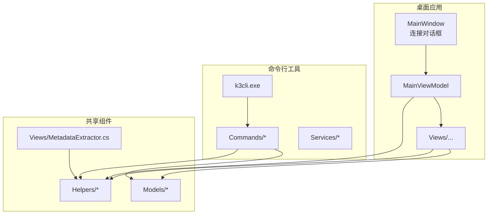
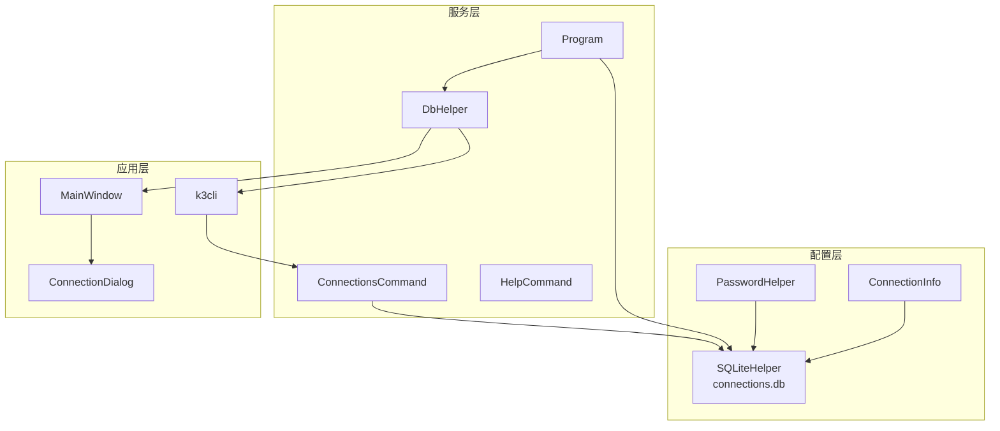
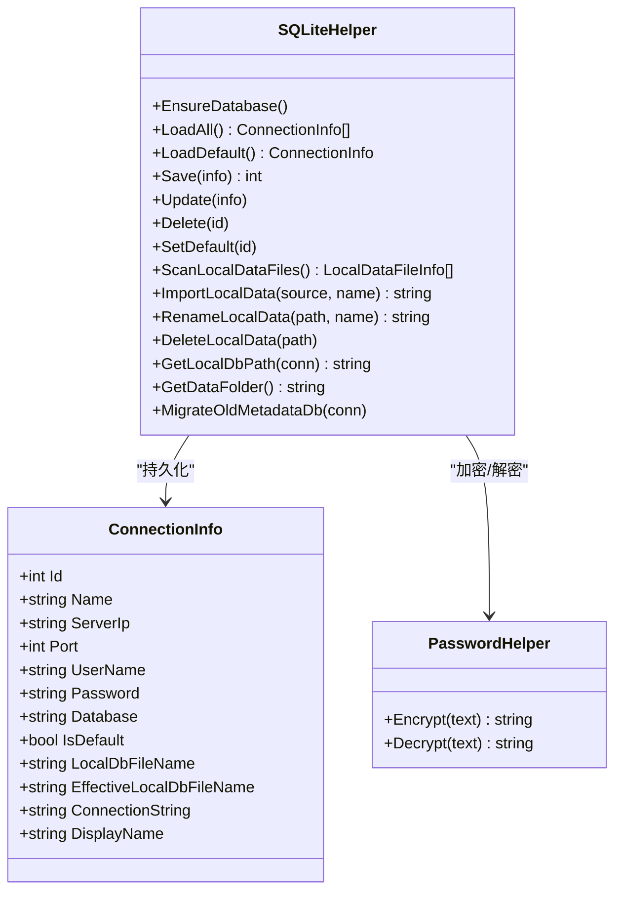
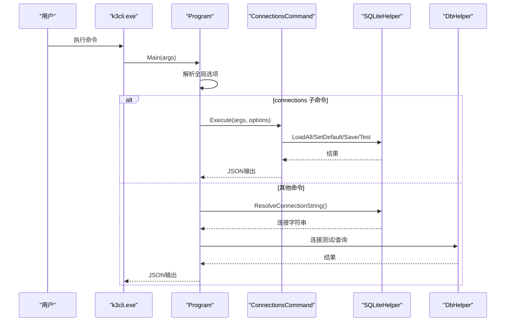
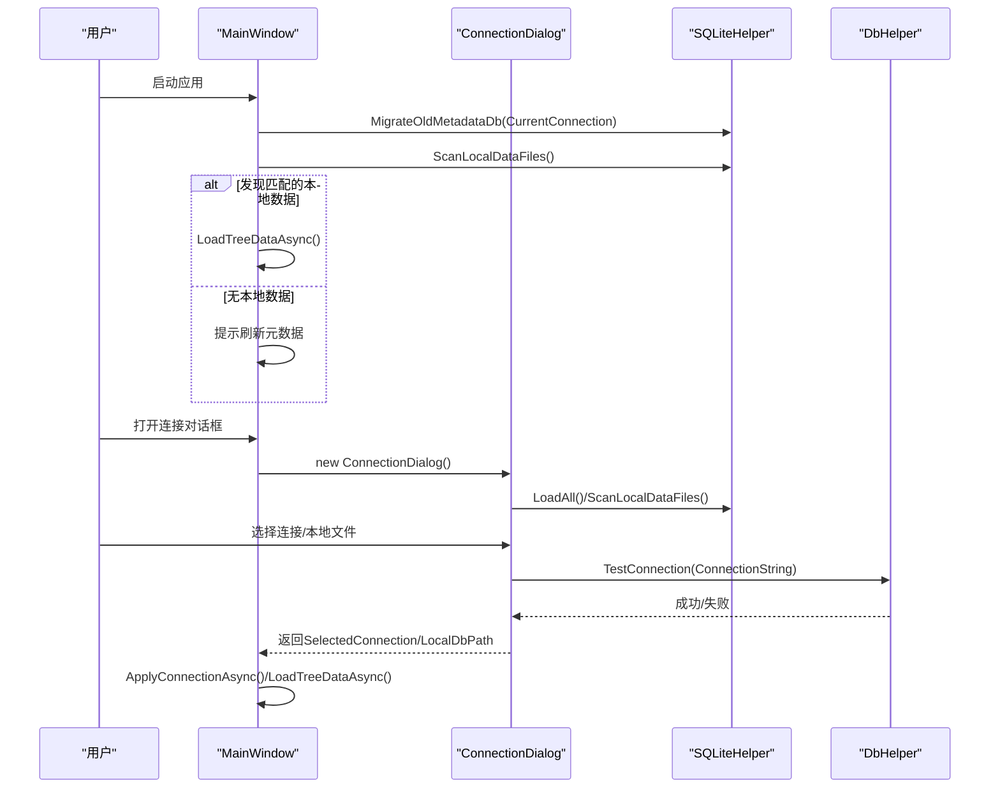
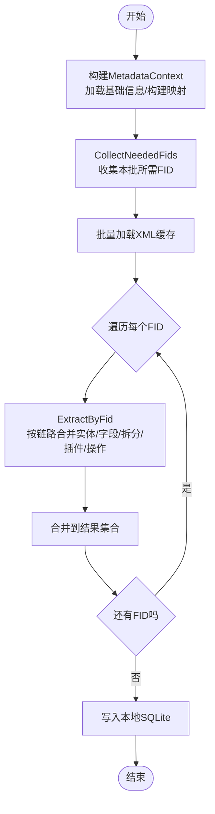
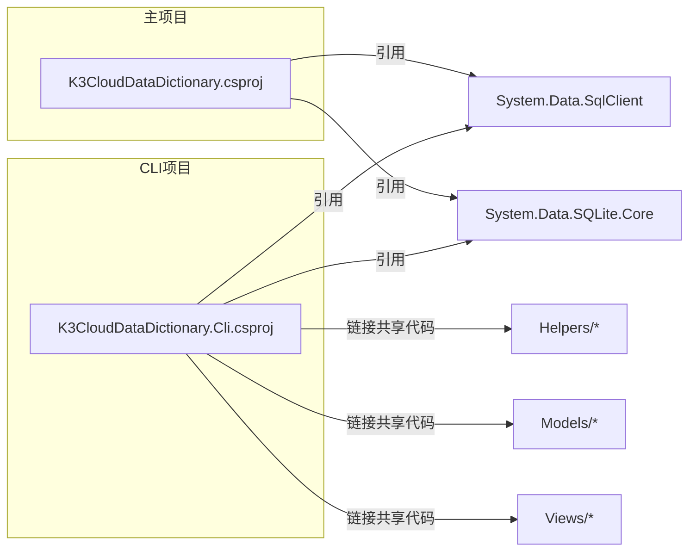

# 配置与部署

<cite>
**本文档引用的文件**
- [K3CloudDataDictionary.csproj](file://K3CloudDataDictionary.csproj)
- [K3CloudDataDictionary.Cli.csproj](file://K3CloudDataDictionary.Cli.csproj)
- [README.md](file://README.md)
- [usage-examples.md](file://docs/usage-examples.md)
- [Program.cs](file://K3CloudDataDictionary.Cli/Program.cs)
- [ConnectionsCommand.cs](file://K3CloudDataDictionary.Cli/Commands/ConnectionsCommand.cs)
- [HelpCommand.cs](file://K3CloudDataDictionary.Cli/Commands/HelpCommand.cs)
- [SQLiteHelper.cs](file://Helpers/SQLiteHelper.cs)
- [DbHelper.cs](file://Helpers/DbHelper.cs)
- [PasswordHelper.cs](file://Helpers/PasswordHelper.cs)
- [ConnectionInfo.cs](file://Models/ConnectionInfo.cs)
- [ConnectionDialog.xaml.cs](file://ConnectionDialog.xaml.cs)
- [MainWindow.xaml.cs](file://MainWindow.xaml.cs)
- [MetadataExtractor.cs](file://Views/MetadataExtractor.cs)
</cite>

## 目录
1. [简介](#简介)
2. [项目结构](#项目结构)
3. [核心组件](#核心组件)
4. [架构总览](#架构总览)
5. [详细组件分析](#详细组件分析)
6. [依赖分析](#依赖分析)
7. [性能考虑](#性能考虑)
8. [故障排查指南](#故障排查指南)
9. [结论](#结论)
10. [附录](#附录)

## 简介
本指南面向金蝶K3 Cloud数据字典系统的配置与部署，涵盖应用程序配置管理（连接配置、默认设置、配置文件处理）、部署与安装步骤（环境要求、依赖包管理、安装流程）、不同部署场景的配置差异（开发/测试/生产）、升级指南与版本兼容性说明，以及常见部署问题的排查与解决方法。文档同时提供面向开发者的架构与实现细节，帮助读者快速理解系统如何加载与使用配置。

## 项目结构
项目采用多项目解决方案，包含桌面应用与命令行工具两套可执行程序，共享核心模型与辅助工具。主要目录与职责如下：
- Helpers：数据库连接与本地SQLite配置、密码加密等通用能力
- Models：连接信息与数据模型定义
- Views：元数据提取与本地SQLite写入
- K3CloudDataDictionary.Cli：命令行工具，提供JSON输出与连接管理
- Views/ViewModels/Views：WPF桌面应用UI与交互
- docs：使用示例与命令参考

图表来源
- [K3CloudDataDictionary.csproj:1-21](file://K3CloudDataDictionary.csproj#L1-L21)
- [K3CloudDataDictionary.Cli.csproj:1-49](file://K3CloudDataDictionary.Cli.csproj#L1-L49)

章节来源
- [README.md:36-83](file://README.md#L36-L83)
- [K3CloudDataDictionary.csproj:1-21](file://K3CloudDataDictionary.csproj#L1-L21)
- [K3CloudDataDictionary.Cli.csproj:1-49](file://K3CloudDataDictionary.Cli.csproj#L1-L49)

## 核心组件
- 连接配置与本地存储
  - 连接信息模型：ConnectionInfo，负责连接参数与显示名计算、连接字符串生成
  - 本地SQLite存储：SQLiteHelper，负责连接信息表的创建、增删改查、默认连接标记、本地数据文件扫描与导入
  - 密码保护：PasswordHelper，基于DPAPI对密码进行加密存储
- 远程连接与查询
  - DbHelper，封装SQL Server连接测试与查询执行
- 命令行工具
  - Program，统一入口，解析全局选项与连接解析
  - ConnectionsCommand，连接管理命令（列出、添加、测试、设为默认）
  - HelpCommand，命令帮助输出
- 元数据处理
  - MetadataExtractor，继承链与扩展链合并的核心算法
  - Views/MetadataSqliteWriter，批量写入本地SQLite

章节来源
- [ConnectionInfo.cs:1-144](file://Models/ConnectionInfo.cs#L1-L144)
- [SQLiteHelper.cs:1-370](file://Helpers/SQLiteHelper.cs#L1-L370)
- [PasswordHelper.cs:1-46](file://Helpers/PasswordHelper.cs#L1-L46)
- [DbHelper.cs:1-70](file://Helpers/DbHelper.cs#L1-L70)
- [Program.cs:1-166](file://K3CloudDataDictionary.Cli/Program.cs#L1-L166)
- [ConnectionsCommand.cs:1-231](file://K3CloudDataDictionary.Cli/Commands/ConnectionsCommand.cs#L1-L231)
- [HelpCommand.cs:1-287](file://K3CloudDataDictionary.Cli/Commands/HelpCommand.cs#L1-L287)
- [MetadataExtractor.cs:1-880](file://Views/MetadataExtractor.cs#L1-L880)

## 架构总览
系统分为三层：
- 配置层：本地SQLite存储连接信息与默认连接标记，密码经DPAPI加密
- 服务层：DbHelper提供远程连接测试与查询；Program解析连接参数；ConnectionsCommand提供连接管理
- 应用层：桌面应用MainWindow与ConnectionDialog负责UI交互；CLI工具提供命令行接口

图表来源
- [ConnectionInfo.cs:1-144](file://Models/ConnectionInfo.cs#L1-L144)
- [SQLiteHelper.cs:1-370](file://Helpers/SQLiteHelper.cs#L1-L370)
- [PasswordHelper.cs:1-46](file://Helpers/PasswordHelper.cs#L1-L46)
- [DbHelper.cs:1-70](file://Helpers/DbHelper.cs#L1-L70)
- [Program.cs:1-166](file://K3CloudDataDictionary.Cli/Program.cs#L1-L166)
- [ConnectionsCommand.cs:1-231](file://K3CloudDataDictionary.Cli/Commands/ConnectionsCommand.cs#L1-L231)
- [HelpCommand.cs:1-287](file://K3CloudDataDictionary.Cli/Commands/HelpCommand.cs#L1-L287)
- [MainWindow.xaml.cs:1-800](file://MainWindow.xaml.cs#L1-L800)
- [ConnectionDialog.xaml.cs:1-490](file://ConnectionDialog.xaml.cs#L1-L490)

## 详细组件分析

### 组件A：连接配置与本地存储（SQLiteHelper）
- 功能要点
  - 初始化：EnsureDatabase确保data/connections.db存在并创建表结构
  - 连接管理：LoadAll、LoadDefault、Save、Update、Delete、SetDefault
  - 本地数据文件：ScanLocalDataFiles、ImportLocalData、RenameLocalData、DeleteLocalData
  - 迁移：MigrateOldMetadataDb将旧版metadata.db迁移到按连接命名的新文件
- 关键行为
  - 默认连接：通过IsDefault字段标记，SetDefault会清除其他默认标记
  - 本地文件命名：EffectiveLocalDbFileName优先使用LocalDbFileName，否则以数据库名为基础生成
  - 密码存储：PasswordHelper加密后入库，读取时解密

图表来源
- [ConnectionInfo.cs:1-144](file://Models/ConnectionInfo.cs#L1-L144)
- [SQLiteHelper.cs:1-370](file://Helpers/SQLiteHelper.cs#L1-L370)
- [PasswordHelper.cs:1-46](file://Helpers/PasswordHelper.cs#L1-L46)

章节来源
- [SQLiteHelper.cs:17-367](file://Helpers/SQLiteHelper.cs#L17-L367)
- [ConnectionInfo.cs:86-118](file://Models/ConnectionInfo.cs#L86-L118)

### 组件B：命令行工具（Program 与 ConnectionsCommand）
- 功能要点
  - Program：统一入口，解析全局选项（--connection/-c、--pretty），解析连接字符串（优先指定ID，否则默认连接）
  - ConnectionsCommand：list/add/test/set-default，配合JsonOutputWriter输出标准化JSON
  - HelpCommand：提供各命令的帮助信息与示例
- 关键流程
  - 连接解析：ResolveConnectionString优先按ID查找，否则使用默认连接
  - 错误处理：异常捕获后以JSON错误格式输出

图表来源
- [Program.cs:14-151](file://K3CloudDataDictionary.Cli/Program.cs#L14-L151)
- [ConnectionsCommand.cs:15-228](file://K3CloudDataDictionary.Cli/Commands/ConnectionsCommand.cs#L15-L228)
- [HelpCommand.cs:10-72](file://K3CloudDataDictionary.Cli/Commands/HelpCommand.cs#L10-L72)
- [SQLiteHelper.cs:55-161](file://Helpers/SQLiteHelper.cs#L55-L161)
- [DbHelper.cs:9-25](file://Helpers/DbHelper.cs#L9-L25)

章节来源
- [Program.cs:74-151](file://K3CloudDataDictionary.Cli/Program.cs#L74-L151)
- [ConnectionsCommand.cs:45-228](file://K3CloudDataDictionary.Cli/Commands/ConnectionsCommand.cs#L45-L228)
- [HelpCommand.cs:259-284](file://K3CloudDataDictionary.Cli/Commands/HelpCommand.cs#L259-L284)

### 组件C：桌面应用（MainWindow 与 ConnectionDialog）
- 功能要点
  - MainWindow：启动时迁移旧版元数据文件、根据当前连接计算本地数据路径、检测本地数据可用性
  - ConnectionDialog：连接列表管理、本地数据文件管理（导入/重命名/删除/概览）、连接测试
- 关键流程
  - 本地数据优先：若存在自动生成且匹配的本地数据文件，则以“本地数据模式”打开
  - 连接测试：DbHelper.TestConnection用于验证SQL Server连通性

图表来源
- [MainWindow.xaml.cs:36-86](file://MainWindow.xaml.cs#L36-L86)
- [MainWindow.xaml.cs:444-648](file://MainWindow.xaml.cs#L444-L648)
- [ConnectionDialog.xaml.cs:35-222](file://ConnectionDialog.xaml.cs#L35-L222)
- [SQLiteHelper.cs:218-367](file://Helpers/SQLiteHelper.cs#L218-L367)
- [DbHelper.cs:9-25](file://Helpers/DbHelper.cs#L9-L25)

章节来源
- [MainWindow.xaml.cs:36-86](file://MainWindow.xaml.cs#L36-L86)
- [MainWindow.xaml.cs:444-648](file://MainWindow.xaml.cs#L444-L648)
- [ConnectionDialog.xaml.cs:35-222](file://ConnectionDialog.xaml.cs#L35-L222)

### 组件D：元数据提取与合并（MetadataExtractor）
- 功能要点
  - MetadataContext：一次性加载基础信息，构建继承链与扩展链映射，收集目标FID
  - MetadataExtractor：按继承链+扩展链顺序合并实体、字段、拆分表、插件、操作事件等
- 关键流程
  - 批量加载XML -> 逐个FID提取 -> 合并 -> 写入本地SQLite

图表来源
- [MetadataExtractor.cs:102-284](file://Views/MetadataExtractor.cs#L102-L284)
- [MetadataExtractor.cs:299-360](file://Views/MetadataExtractor.cs#L299-L360)
- [MetadataExtractor.cs:399-690](file://Views/MetadataExtractor.cs#L399-L690)

章节来源
- [MetadataExtractor.cs:102-284](file://Views/MetadataExtractor.cs#L102-L284)
- [MetadataExtractor.cs:299-360](file://Views/MetadataExtractor.cs#L299-L360)
- [MetadataExtractor.cs:399-690](file://Views/MetadataExtractor.cs#L399-L690)

## 依赖分析
- 项目依赖
  - .NET Framework 4.7.2 + WPF
  - HandyControl 3.5.1（UI主题）
  - System.Data.SqlClient（SQL Server连接）
  - System.Data.SQLite.Core（本地SQLite）
- 包引用与共享
  - CLI项目与主项目共享Helpers与Models/Views代码，避免重复

图表来源
- [K3CloudDataDictionary.csproj:9-19](file://K3CloudDataDictionary.csproj#L9-L19)
- [K3CloudDataDictionary.Cli.csproj:8-15](file://K3CloudDataDictionary.Cli.csproj#L8-L15)

章节来源
- [K3CloudDataDictionary.csproj:1-21](file://K3CloudDataDictionary.csproj#L1-L21)
- [K3CloudDataDictionary.Cli.csproj:1-49](file://K3CloudDataDictionary.Cli.csproj#L1-L49)

## 性能考虑
- 连接池与超时
  - DbHelper执行查询时设置CommandTimeout，避免长时间阻塞
- 批量处理
  - CLI与桌面应用均采用分批处理元数据，减少内存峰值
- 本地化
  - 元数据刷新后本地SQLite承载浏览，降低远程访问频率
- I/O优化
  - SQLiteHelper对本地数据文件进行扫描与导入时，避免与连接信息表冲突命名

章节来源
- [DbHelper.cs:36-67](file://Helpers/DbHelper.cs#L36-L67)
- [MainWindow.xaml.cs:480-537](file://MainWindow.xaml.cs#L480-L537)
- [SQLiteHelper.cs:218-303](file://Helpers/SQLiteHelper.cs#L218-L303)

## 故障排查指南
- 连接失败
  - 现象：连接测试失败或刷新元数据时报错
  - 排查：使用connections test验证指定ID连接；确认ServerIp/Port/Database/User/Password正确；检查SQL Server可达性
  - 参考：Program.ResolveConnectionString与DbHelper.TestConnection
- 默认连接缺失
  - 现象：运行命令时报“没有默认连接”
  - 排查：使用connections list查看；使用connections set-default设置；或在命令中使用--connection指定ID
- 本地数据文件丢失
  - 现象：本地数据文件被删除后界面提示“本地数据已删除”
  - 排查：MainWindow.CheckLocalDataAvailability会清理界面数据；重新连接或导入数据文件
- 密码解密失败
  - 现象：读取连接信息时密码显示异常
  - 排查：PasswordHelper基于DPAPI加密，需在同一用户作用域内；更换用户或系统可能导致解密失败
- 元数据刷新中断
  - 现象：刷新过程中被中断或失败
  - 排查：确认远程连接稳定；避免并发刷新；必要时重试或清理本地数据后重新刷新

章节来源
- [Program.cs:129-151](file://K3CloudDataDictionary.Cli/Program.cs#L129-L151)
- [DbHelper.cs:9-25](file://Helpers/DbHelper.cs#L9-L25)
- [ConnectionsCommand.cs:173-228](file://K3CloudDataDictionary.Cli/Commands/ConnectionsCommand.cs#L173-L228)
- [MainWindow.xaml.cs:428-442](file://MainWindow.xaml.cs#L428-L442)
- [PasswordHelper.cs:28-43](file://Helpers/PasswordHelper.cs#L28-L43)

## 结论
本指南提供了金蝶K3 Cloud数据字典系统从配置到部署的完整路径：通过本地SQLite存储连接信息与默认连接、DPAPI加密密码、命令行工具统一解析连接参数、桌面应用与CLI共享核心模型与工具，实现跨平台、可维护的配置管理与部署方案。建议在不同环境中遵循“最小权限、最小暴露”的原则，结合本文档的部署与排障建议，确保系统稳定运行。

## 附录

### 环境要求与安装步骤
- 环境要求
  - Windows 7及以上
  - .NET Framework 4.7.2及以上
  - 金蝶K3 Cloud数据库访问权限（仅刷新元数据时需要）
- 依赖包管理
  - 主项目：System.Data.SqlClient、System.Data.SQLite.Core、HandyControl
  - CLI项目：Newtonsoft.Json、System.Data.SqlClient、System.Data.SQLite.Core
- 安装流程
  - 构建：dotnet build 或使用Visual Studio打开.sln直接构建
  - 运行：桌面应用为WinExe，CLI为Exe（k3cli）

章节来源
- [README.md:185-198](file://README.md#L185-L198)
- [K3CloudDataDictionary.csproj:9-19](file://K3CloudDataDictionary.csproj#L9-L19)
- [K3CloudDataDictionary.Cli.csproj:8-15](file://K3CloudDataDictionary.Cli.csproj#L8-L15)

### 不同部署场景的配置差异
- 开发环境
  - 使用本地开发数据库实例，连接参数指向本机或内网开发服务器
  - 默认连接可设为开发库，便于自动化脚本与本地调试
- 测试环境
  - 使用测试库连接，建议启用连接测试命令定期巡检
  - 本地数据文件可导入测试快照，提升测试效率
- 生产环境
  - 严格限制访问权限，使用专用账户与最小权限策略
  - 通过CLI进行非交互式查询与导出，避免直接暴露桌面应用

章节来源
- [ConnectionsCommand.cs:76-131](file://K3CloudDataDictionary.Cli/Commands/ConnectionsCommand.cs#L76-L131)
- [usage-examples.md:515-542](file://docs/usage-examples.md#L515-L542)

### 升级指南与版本兼容性
- 本地数据文件迁移
  - 旧版metadata.db在首次加载时自动迁移到按连接命名的新文件（仅当无其他数据文件时）
- 本地SQLite表结构演进
  - SQLiteHelper在创建表时尝试添加新列（如LocalDbFileName），兼容旧版本
- CLI输出格式
  - 统一使用JsonOutputWriter输出，保持跨版本一致性

章节来源
- [SQLiteHelper.cs:345-367](file://Helpers/SQLiteHelper.cs#L345-L367)
- [SQLiteHelper.cs:43-52](file://Helpers/SQLiteHelper.cs#L43-L52)
- [HelpCommand.cs:10-72](file://K3CloudDataDictionary.Cli/Commands/HelpCommand.cs#L10-L72)