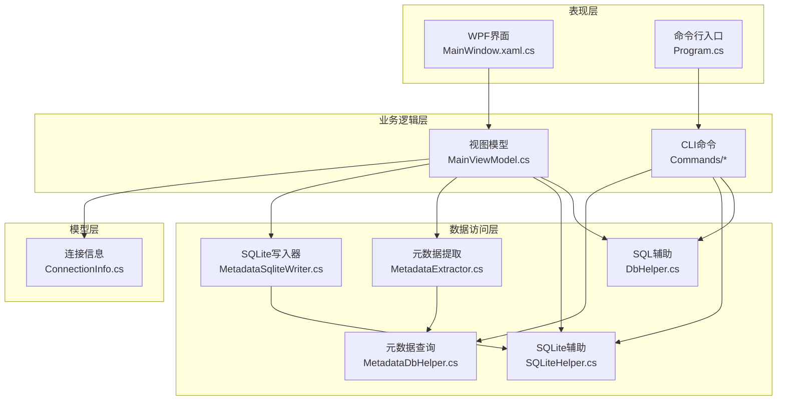
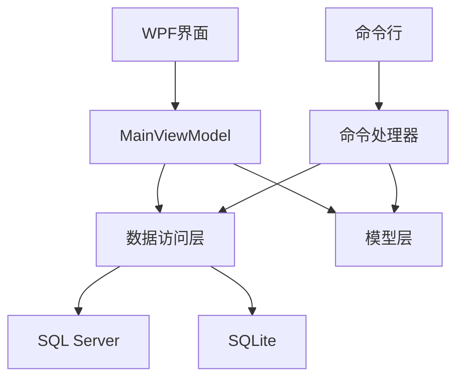
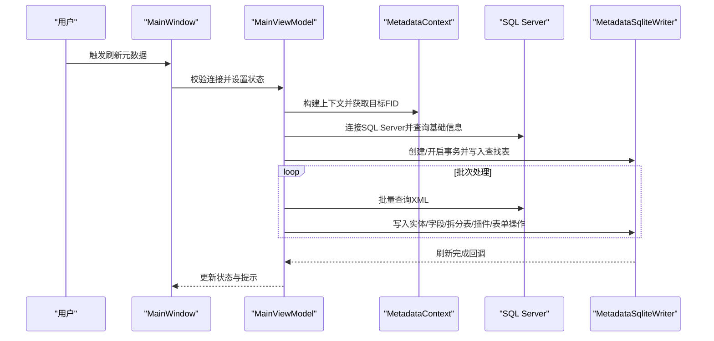
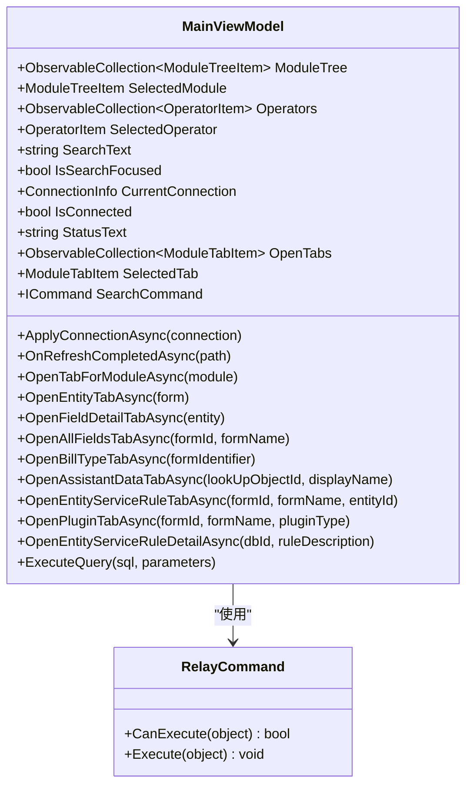
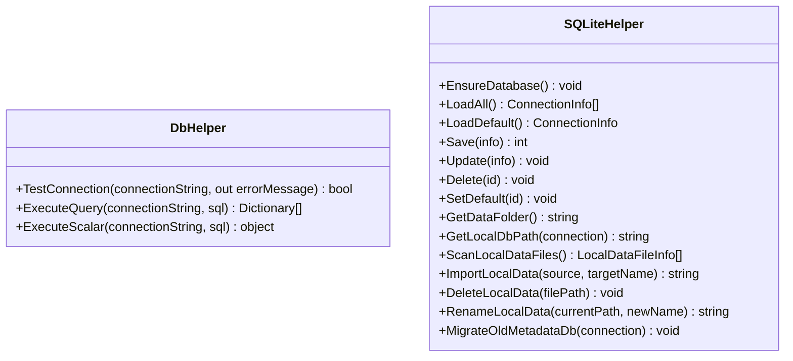
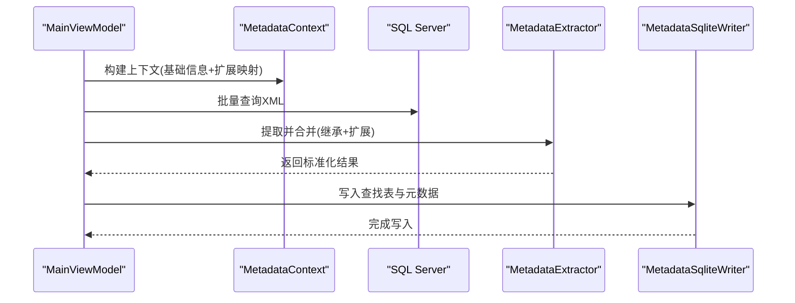
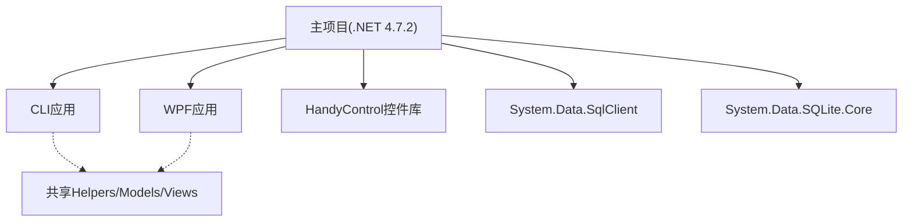

# 技术架构概览

<cite>
**本文档引用的文件**
- [K3CloudDataDictionary.csproj](file://K3CloudDataDictionary.csproj)
- [K3CloudDataDictionary.Cli.csproj](file://K3CloudDataDictionary.Cli.csproj)
- [Program.cs](file://K3CloudDataDictionary.Cli/Program.cs)
- [App.xaml.cs](file://App.xaml.cs)
- [MainWindow.xaml.cs](file://MainWindow.xaml.cs)
- [MainViewModel.cs](file://ViewModels/MainViewModel.cs)
- [RelayCommand.cs](file://ViewModels/RelayCommand.cs)
- [DbHelper.cs](file://Helpers/DbHelper.cs)
- [SQLiteHelper.cs](file://Helpers/SQLiteHelper.cs)
- [MetadataExtractor.cs](file://Views/MetadataExtractor.cs)
- [MetadataDbHelper.cs](file://Views/MetadataDbHelper.cs)
- [MetadataSqliteWriter.cs](file://Views/MetadataSqliteWriter.cs)
- [ConnectionInfo.cs](file://Models/ConnectionInfo.cs)
</cite>

## 目录
1. [引言](#引言)
2. [项目结构](#项目结构)
3. [核心组件](#核心组件)
4. [架构总览](#架构总览)
5. [详细组件分析](#详细组件分析)
6. [依赖关系分析](#依赖关系分析)
7. [性能考虑](#性能考虑)
8. [故障排除指南](#故障排除指南)
9. [结论](#结论)

## 引言
本项目为金蝶K3 Cloud数据字典系统，采用双模式架构设计：  
- **图形界面模式（WPF）**：提供可视化交互体验，支持树形导航、标签页浏览、搜索与连接管理。  
- **命令行工具模式（CLI）**：提供轻量、可脚本化的元数据查询与导出能力，适合自动化集成与批处理。

两种模式共享相同的核心数据模型与数据访问层，确保数据一致性与复用性。

## 项目结构
项目采用分层与模块化组织方式：  
- **表现层（WPF + CLI）**：MainWindow负责WPF界面交互；CLI入口解析命令并路由到各功能命令。  
- **业务逻辑层（ViewModels + 视图模型）**：MainViewModel协调UI状态、连接管理、数据加载与标签页打开。  
- **数据访问层（Helpers + Views）**：DbHelper/SQLiteHelper封装数据库连接与本地SQLite管理；MetadataExtractor/MetadataDbHelper负责元数据提取与数据库查询；MetadataSqliteWriter负责将提取结果写入本地SQLite。  
- **模型层（Models）**：ConnectionInfo等模型承载连接信息与查询结果数据结构。  

**图表来源**
- [MainWindow.xaml.cs:1-1439](file://MainWindow.xaml.cs#L1-L1439)
- [Program.cs:1-166](file://K3CloudDataDictionary.Cli/Program.cs#L1-L166)
- [MainViewModel.cs:1-1883](file://ViewModels/MainViewModel.cs#L1-L1883)
- [DbHelper.cs:1-70](file://Helpers/DbHelper.cs#L1-L70)
- [SQLiteHelper.cs:1-370](file://Helpers/SQLiteHelper.cs#L1-L370)
- [MetadataExtractor.cs:1-880](file://Views/MetadataExtractor.cs#L1-L880)
- [MetadataDbHelper.cs:1-131](file://Views/MetadataDbHelper.cs#L1-L131)
- [MetadataSqliteWriter.cs:1-846](file://Views/MetadataSqliteWriter.cs#L1-L846)
- [ConnectionInfo.cs:1-144](file://Models/ConnectionInfo.cs#L1-L144)

**章节来源**
- [K3CloudDataDictionary.csproj:1-21](file://K3CloudDataDictionary.csproj#L1-L21)
- [K3CloudDataDictionary.Cli.csproj:1-49](file://K3CloudDataDictionary.Cli.csproj#L1-L49)

## 核心组件
- **WPF图形界面**：MainWindow负责窗口生命周期、标签页管理、连接对话框、元数据刷新流程与状态反馈。  
- **CLI命令行工具**：Program解析命令与全局选项，路由到具体命令实现，统一错误输出与连接解析。  
- **MVVM视图模型**：MainViewModel封装业务状态、命令绑定、异步数据加载、标签页打开与状态更新。  
- **数据访问与模型**：DbHelper/SQLiteHelper提供SQL Server与SQLite访问；ConnectionInfo定义连接模型；MetadataExtractor/MetadataDbHelper/MetadataSqliteWriter构成元数据处理流水线。

**章节来源**
- [MainWindow.xaml.cs:1-1439](file://MainWindow.xaml.cs#L1-L1439)
- [Program.cs:1-166](file://K3CloudDataDictionary.Cli/Program.cs#L1-L166)
- [MainViewModel.cs:1-1883](file://ViewModels/MainViewModel.cs#L1-L1883)
- [DbHelper.cs:1-70](file://Helpers/DbHelper.cs#L1-L70)
- [SQLiteHelper.cs:1-370](file://Helpers/SQLiteHelper.cs#L1-L370)
- [ConnectionInfo.cs:1-144](file://Models/ConnectionInfo.cs#L1-L144)

## 架构总览
系统采用“双模式 + 分层”的混合架构：  
- **双模式设计**：WPF提供交互式体验，CLI提供自动化能力；两者共享数据模型与数据访问层，保证一致性。  
- **分层架构**：表现层（UI/CLI）、业务逻辑层（ViewModels/Commands）、数据访问层（Helpers/Views）、模型层（Models）。  
- **MVVM模式**：MainWindow绑定MainViewModel，MainViewModel通过命令与数据访问层协作，实现关注点分离与可测试性。  
- **数据流**：WPF/CLI → ViewModel → 数据访问层 → SQL Server/SQLite；本地SQLite作为离线缓存，加速查询与展示。

**图表来源**
- [MainWindow.xaml.cs:1-1439](file://MainWindow.xaml.cs#L1-L1439)
- [Program.cs:1-166](file://K3CloudDataDictionary.Cli/Program.cs#L1-L166)
- [MainViewModel.cs:1-1883](file://ViewModels/MainViewModel.cs#L1-L1883)
- [DbHelper.cs:1-70](file://Helpers/DbHelper.cs#L1-L70)
- [SQLiteHelper.cs:1-370](file://Helpers/SQLiteHelper.cs#L1-L370)

## 详细组件分析

### WPF图形界面（MainWindow）
- 负责窗口初始化、标签页容器与模板选择、连接状态管理、元数据刷新流程（含进度条与消息提示）。  
- 支持根据连接信息扫描本地数据文件、迁移旧版metadata.db、切换连接与自动连接恢复。  
- 刷新流程分为“全量刷新”和“扩展刷新”，分别处理无扩展与存在扩展的对象，写入本地SQLite并回调状态更新。

**图表来源**
- [MainWindow.xaml.cs:444-538](file://MainWindow.xaml.cs#L444-L538)
- [MainViewModel.cs:269-275](file://ViewModels/MainViewModel.cs#L269-L275)
- [MetadataExtractor.cs:299-311](file://Views/MetadataExtractor.cs#L299-L311)
- [MetadataSqliteWriter.cs:285-301](file://Views/MetadataSqliteWriter.cs#L285-L301)

**章节来源**
- [MainWindow.xaml.cs:1-1439](file://MainWindow.xaml.cs#L1-L1439)

### CLI命令行工具（Program）
- 入口程序解析命令与全局选项（连接ID、Pretty打印），路由到具体命令（fields/search/form/billtype/billstatus/assistantdata/enum/resolve/connections/help）。  
- 统一错误输出（JsonOutputWriter），支持从SQLite读取连接配置并解析默认连接。

```mermaid
flowchart TD
Start(["启动 k3cli"]) --> Parse["解析命令与选项"]
Parse --> Route{"路由到具体命令"}
Route --> |fields| Fields["字段查询命令"]
Route --> |search| Search["搜索命令"]
Route --> |form| Form["表单查询命令"]
Route --> |billtype| BillType["单据类型命令"]
Route --> |billstatus| BillStatus["单据状态命令"]
Route --> |assistantdata| Assistant["辅助资料命令"]
Route --> |enum| EnumCmd["枚举命令"]
Route --> |resolve| Resolve["解析命令"]
Route --> |connections| Conn["连接管理命令"]
Route --> |help| Help["帮助命令"]
Fields --> Exec["执行并输出"]
Search --> Exec
Form --> Exec
BillType --> Exec
BillStatus --> Exec
Assistant --> Exec
EnumCmd --> Exec
Resolve --> Exec
Conn --> Exec
Help --> Exec
Exec --> End(["结束"])
```

**图表来源**
- [Program.cs:14-69](file://K3CloudDataDictionary.Cli/Program.cs#L14-L69)

**章节来源**
- [Program.cs:1-166](file://K3CloudDataDictionary.Cli/Program.cs#L1-L166)

### MVVM模式与MainViewModel
- 通过INotifyPropertyChanged与RelayCommand实现命令绑定与UI状态更新。  
- 负责连接管理（ApplyConnectionAsync/OnRefreshCompletedAsync）、标签页打开（Open*TabAsync系列）、数据查询（ExecuteQuery）与状态文本更新。  
- 与SQLiteHelper协作维护本地数据文件路径与连接配置。

**图表来源**
- [MainViewModel.cs:18-800](file://ViewModels/MainViewModel.cs#L18-L800)
- [RelayCommand.cs:1-28](file://ViewModels/RelayCommand.cs#L1-L28)

**章节来源**
- [MainViewModel.cs:1-1883](file://ViewModels/MainViewModel.cs#L1-L1883)
- [RelayCommand.cs:1-28](file://ViewModels/RelayCommand.cs#L1-L28)

### 数据访问层（DbHelper/SQLiteHelper）
- DbHelper：封装SQL Server连接测试、查询与标量执行，统一超时设置。  
- SQLiteHelper：维护连接配置表（connections.db），提供连接增删改查、默认连接设置、本地数据文件扫描/导入/重命名/删除、旧版迁移等。

**图表来源**
- [DbHelper.cs:1-70](file://Helpers/DbHelper.cs#L1-L70)
- [SQLiteHelper.cs:1-370](file://Helpers/SQLiteHelper.cs#L1-L370)

**章节来源**
- [DbHelper.cs:1-70](file://Helpers/DbHelper.cs#L1-L70)
- [SQLiteHelper.cs:1-370](file://Helpers/SQLiteHelper.cs#L1-L370)

### 元数据处理流水线（MetadataExtractor/MetadataDbHelper/MetadataSqliteWriter）
- MetadataDbHelper：从SQL Server查询对象基础信息与内核XML，构建上下文。  
- MetadataExtractor：基于上下文构建继承/扩展处理链，合并实体、字段、拆分表、插件、表单操作等，输出标准化结果。  
- MetadataSqliteWriter：创建/重建SQLite表结构，写入查找表与元数据，支持增量删除与重置ID计数器。

**图表来源**
- [MetadataDbHelper.cs:44-127](file://Views/MetadataDbHelper.cs#L44-L127)
- [MetadataExtractor.cs:299-360](file://Views/MetadataExtractor.cs#L299-L360)
- [MetadataSqliteWriter.cs:285-301](file://Views/MetadataSqliteWriter.cs#L285-L301)

**章节来源**
- [MetadataDbHelper.cs:1-131](file://Views/MetadataDbHelper.cs#L1-L131)
- [MetadataExtractor.cs:1-880](file://Views/MetadataExtractor.cs#L1-L880)
- [MetadataSqliteWriter.cs:1-846](file://Views/MetadataSqliteWriter.cs#L1-L846)

## 依赖关系分析
- 项目采用.NET Framework 4.7.2，WPF启用，使用HandyControl控件库提升UI体验。  
- CLI与主项目共享Helpers与Views中的模型与工具类，减少重复代码。  
- 数据访问依赖System.Data.SqlClient与System.Data.SQLite.Core，分别用于SQL Server与SQLite。  
- 项目通过SQLiteHelper集中管理连接配置与本地数据文件，避免分散配置。

**图表来源**
- [K3CloudDataDictionary.csproj:1-21](file://K3CloudDataDictionary.csproj#L1-L21)
- [K3CloudDataDictionary.Cli.csproj:1-49](file://K3CloudDataDictionary.Cli.csproj#L1-L49)

**章节来源**
- [K3CloudDataDictionary.csproj:1-21](file://K3CloudDataDictionary.csproj#L1-L21)
- [K3CloudDataDictionary.Cli.csproj:1-49](file://K3CloudDataDictionary.Cli.csproj#L1-L49)

## 性能考虑
- 元数据提取采用“上下文构建 + 批量XML加载 + 逐FID合并”的策略，减少数据库往返次数，提高吞吐量。  
- SQLite写入使用事务批量提交，显著降低磁盘IO开销。  
- 本地SQLite作为缓存，避免频繁访问SQL Server，提升查询响应速度。  
- UI侧通过异步任务与Dispatcher更新状态，保持界面流畅。

## 故障排除指南
- 远程连接失败：检查连接字符串与网络连通性，使用DbHelper.TestConnection验证。  
- 本地数据文件缺失：通过SQLiteHelper.ScanLocalDataFiles定位文件，必要时重新刷新或导入。  
- 刷新中断或异常：查看状态栏错误提示与日志，确认SQL Server可用性与SQLite写入权限。  
- CLI命令错误：使用help命令查看帮助，确认命令拼写与全局选项格式。

**章节来源**
- [DbHelper.cs:9-25](file://Helpers/DbHelper.cs#L9-L25)
- [MainWindow.xaml.cs:444-538](file://MainWindow.xaml.cs#L444-L538)
- [Program.cs:53-69](file://K3CloudDataDictionary.Cli/Program.cs#L53-L69)

## 结论
本项目通过双模式架构实现了“可视化交互 + 自动化脚本”的双重能力，结合MVVM与分层设计，确保了良好的可维护性与扩展性。共享的数据访问层与模型层保证了数据一致性，SQLite缓存提升了查询性能。未来可在命令行工具中引入更多导出格式与并发优化，进一步增强自动化能力与吞吐量。