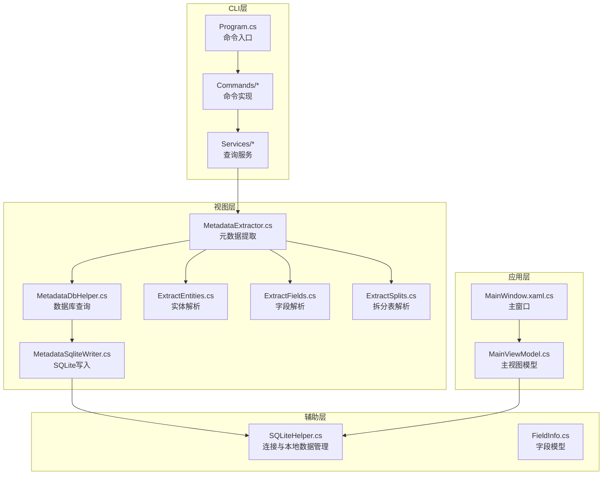
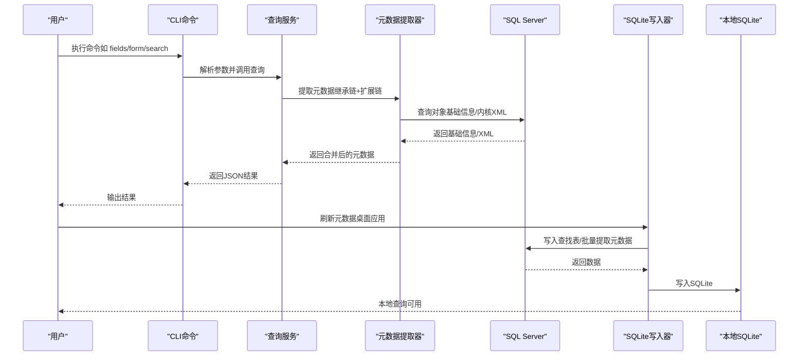
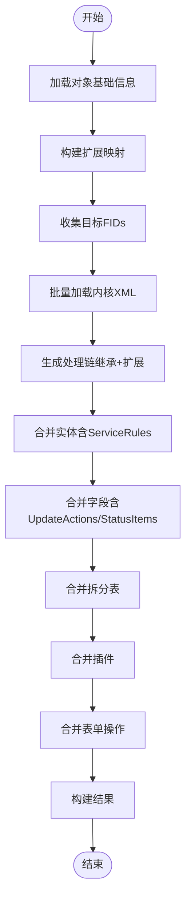
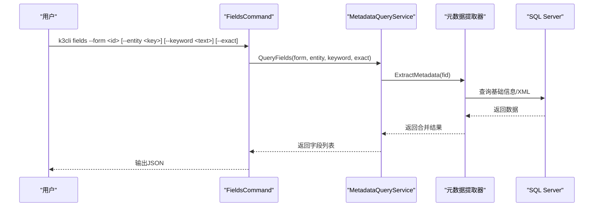
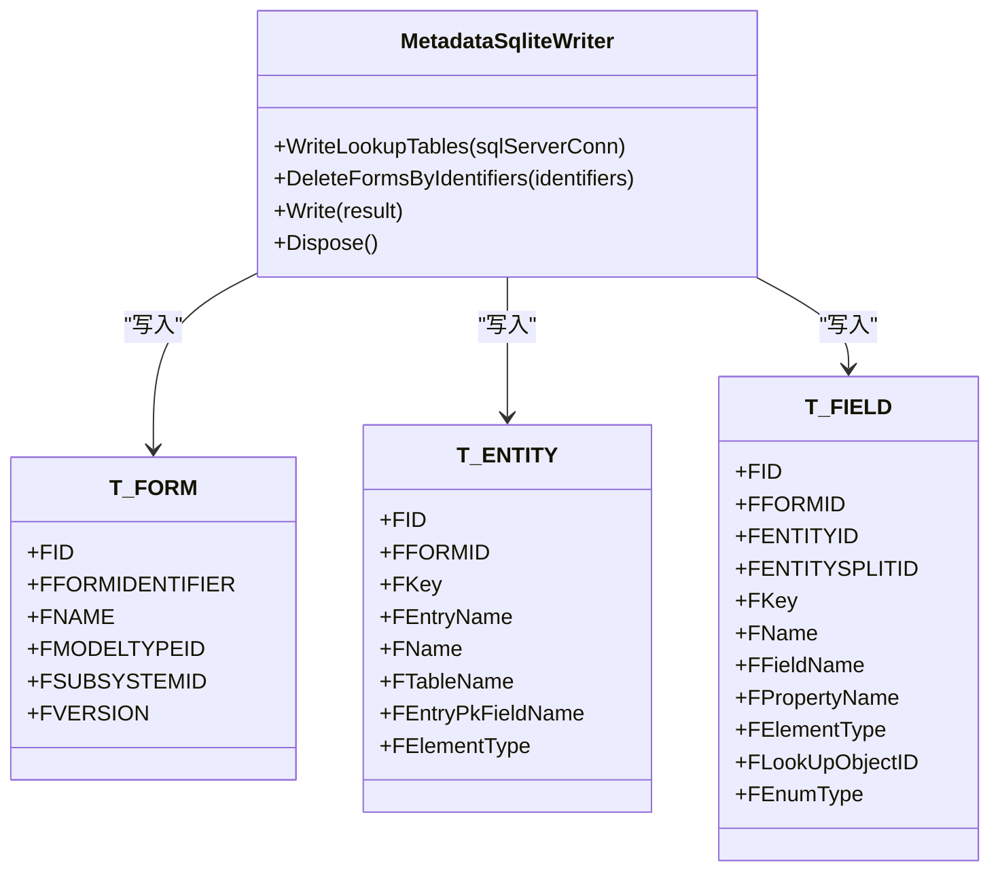
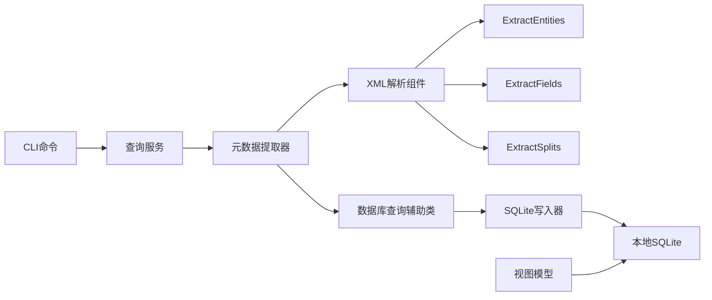

# 核心功能特性

<cite>
**本文档引用的文件**
- [Program.cs](file://K3CloudDataDictionary.Cli/Program.cs)
- [MetadataExtractor.cs](file://Views/MetadataExtractor.cs)
- [MetadataDbHelper.cs](file://Views/MetadataDbHelper.cs)
- [MetadataSqliteWriter.cs](file://Views/MetadataSqliteWriter.cs)
- [MainViewModel.cs](file://ViewModels/MainViewModel.cs)
- [FieldsCommand.cs](file://K3CloudDataDictionary.Cli/Commands/FieldsCommand.cs)
- [SearchCommand.cs](file://K3CloudDataDictionary.Cli/Commands/SearchCommand.cs)
- [FormCommand.cs](file://K3CloudDataDictionary.Cli/Commands/FormCommand.cs)
- [SQLiteHelper.cs](file://Helpers/SQLiteHelper.cs)
- [FieldInfo.cs](file://Models/FieldInfo.cs)
- [MetadataQueryService.cs](file://K3CloudDataDictionary.Cli/Services/MetadataQueryService.cs)
- [ExtractEntities.cs](file://Views/ExtractEntities.cs)
- [ExtractFields.cs](file://Views/ExtractFields.cs)
- [ExtractSplits.cs](file://Views/ExtractSplits.cs)
- [MainWindow.xaml.cs](file://MainWindow.xaml.cs)
</cite>

## 目录
1. [简介](#简介)
2. [项目结构](#项目结构)
3. [核心组件](#核心组件)
4. [架构总览](#架构总览)
5. [详细组件分析](#详细组件分析)
6. [依赖关系分析](#依赖关系分析)
7. [性能考虑](#性能考虑)
8. [故障排除指南](#故障排除指南)
9. [结论](#结论)

## 简介
本文件面向金蝶K3 Cloud数据字典系统的核心功能特性，提供全面的功能全景图与技术实现概览。系统围绕“元数据提取、数据字典查询、关联表单解析、本地缓存管理”四大核心能力展开，既支持CLI命令行工具，也提供WPF桌面应用界面，满足不同用户的使用场景与性能需求。

## 项目结构
系统采用分层架构设计：
- CLI层：命令解析与执行，面向自动化与批处理场景
- 视图层：XML解析与元数据合并，负责继承链与扩展链的处理
- 数据访问层：SQL Server查询与SQLite写入，负责数据持久化与缓存
- 应用层：WPF界面与视图模型，提供交互式查询与浏览体验
- 辅助层：连接管理、密码加密、输出格式化等

**图表来源**
- [Program.cs:14-69](file://K3CloudDataDictionary.Cli/Program.cs#L14-L69)
- [MetadataExtractor.cs:289-360](file://Views/MetadataExtractor.cs#L289-L360)
- [MetadataDbHelper.cs:36-127](file://Views/MetadataDbHelper.cs#L36-L127)
- [MetadataSqliteWriter.cs:9-50](file://Views/MetadataSqliteWriter.cs#L9-L50)
- [MainViewModel.cs:18-37](file://ViewModels/MainViewModel.cs#L18-L37)
- [SQLiteHelper.cs:10-53](file://Helpers/SQLiteHelper.cs#L10-L53)

**章节来源**
- [Program.cs:14-69](file://K3CloudDataDictionary.Cli/Program.cs#L14-L69)
- [MetadataExtractor.cs:102-284](file://Views/MetadataExtractor.cs#L102-L284)
- [MetadataDbHelper.cs:36-127](file://Views/MetadataDbHelper.cs#L36-L127)
- [MetadataSqliteWriter.cs:79-283](file://Views/MetadataSqliteWriter.cs#L79-L283)
- [MainViewModel.cs:18-37](file://ViewModels/MainViewModel.cs#L18-L37)
- [SQLiteHelper.cs:10-53](file://Helpers/SQLiteHelper.cs#L10-L53)

## 核心组件
- 元数据提取器：基于继承链与扩展链，合并XML中的实体、字段、拆分表、插件与表单操作等信息，生成统一的元数据结果
- 查询服务：提供表单、实体、字段、表、单据类型、辅助资料、枚举等查询接口，支持模糊/精确匹配与嵌套子对象
- 本地缓存管理：将SQL Server中的元数据与查找表写入SQLite，支持全量刷新与增量更新，提供便捷的本地查询体验
- 连接与本地数据管理：集中管理连接配置，扫描/导入/重命名/删除本地数据文件，支持按连接命名的本地数据库文件

**章节来源**
- [MetadataExtractor.cs:289-360](file://Views/MetadataExtractor.cs#L289-L360)
- [MetadataQueryService.cs:12-22](file://K3CloudDataDictionary.Cli/Services/MetadataQueryService.cs#L12-L22)
- [MetadataSqliteWriter.cs:79-283](file://Views/MetadataSqliteWriter.cs#L79-L283)
- [SQLiteHelper.cs:10-53](file://Helpers/SQLiteHelper.cs#L10-L53)

## 架构总览
系统采用“CLI + 视图 + 缓存”的组合架构：
- CLI通过命令解析调用查询服务，实时连接SQL Server获取元数据并输出JSON
- 桌面应用通过视图模型加载本地SQLite数据，提供树形导航与多标签页浏览
- 元数据提取器负责XML解析与合并，数据库查询辅助类负责SQL查询，SQLite写入器负责结构化落库

**图表来源**
- [Program.cs:34-52](file://K3CloudDataDictionary.Cli/Program.cs#L34-L52)
- [MetadataQueryService.cs:12-22](file://K3CloudDataDictionary.Cli/Services/MetadataQueryService.cs#L12-L22)
- [MetadataExtractor.cs:299-311](file://Views/MetadataExtractor.cs#L299-L311)
- [MetadataDbHelper.cs:87-127](file://Views/MetadataDbHelper.cs#L87-L127)
- [MetadataSqliteWriter.cs:560-800](file://Views/MetadataSqliteWriter.cs#L560-L800)

## 详细组件分析

### 元数据提取与合并（继承链+扩展链）
- 上下文构建：一次性加载所有对象基础信息，构建扩展映射与目标FID集合，支持无扩展与有扩展两类处理路径
- 处理链生成：从继承路径解析根FID，反转后追加每层扩展FID，形成完整处理序列
- XML批量加载：根据处理链收集所需FID，一次性查询内核XML，减少数据库往返
- 合并策略：实体/字段按oid匹配父级，action=remove删除，action=edit覆盖属性；拆分表按EntityKey+Suffix合并；插件/表单操作按oid或Id匹配合并

**图表来源**
- [MetadataExtractor.cs:102-284](file://Views/MetadataExtractor.cs#L102-L284)
- [MetadataExtractor.cs:299-360](file://Views/MetadataExtractor.cs#L299-L360)
- [ExtractEntities.cs:47-177](file://Views/ExtractEntities.cs#L47-L177)
- [ExtractFields.cs:70-164](file://Views/ExtractFields.cs#L70-L164)
- [ExtractSplits.cs:28-57](file://Views/ExtractSplits.cs#L28-L57)

**章节来源**
- [MetadataExtractor.cs:102-284](file://Views/MetadataExtractor.cs#L102-L284)
- [MetadataExtractor.cs:299-360](file://Views/MetadataExtractor.cs#L299-L360)
- [ExtractEntities.cs:47-177](file://Views/ExtractEntities.cs#L47-L177)
- [ExtractFields.cs:70-164](file://Views/ExtractFields.cs#L70-L164)
- [ExtractSplits.cs:28-57](file://Views/ExtractSplits.cs#L28-L57)

### 数据字典查询（CLI）
- 字段查询：支持按表单标识、实体Key、关键词与精确匹配查询，输出字段明细与嵌套状态项
- 模糊搜索：支持按表或字段进行模糊/精确搜索，返回表单、实体、字段等聚合信息
- 表单查询：返回表单基本信息、插件数量、服务规则数量、更新动作数量与表单操作数量

**图表来源**
- [FieldsCommand.cs:13-85](file://K3CloudDataDictionary.Cli/Commands/FieldsCommand.cs#L13-L85)
- [MetadataQueryService.cs:286-388](file://K3CloudDataDictionary.Cli/Services/MetadataQueryService.cs#L286-L388)

**章节来源**
- [FieldsCommand.cs:13-85](file://K3CloudDataDictionary.Cli/Commands/FieldsCommand.cs#L13-L85)
- [SearchCommand.cs:13-107](file://K3CloudDataDictionary.Cli/Commands/SearchCommand.cs#L13-L107)
- [FormCommand.cs:13-90](file://K3CloudDataDictionary.Cli/Commands/FormCommand.cs#L13-L90)
- [MetadataQueryService.cs:172-388](file://K3CloudDataDictionary.Cli/Services/MetadataQueryService.cs#L172-L388)

### 关联表单解析与本地缓存管理
- 本地SQLite结构：包含表单、实体、实体拆分、字段、查找表、单据类型、辅助资料、插件、字段更新动作、表单操作、业务服务等表
- 写入流程：先写入查找表，再按无扩展/有扩展两阶段批量写入元数据，支持全量重建与增量更新
- 本地查询：桌面应用通过SQLite连接本地数据库，提供树形导航、多标签页、双击跳转等功能

**图表来源**
- [MetadataSqliteWriter.cs:79-283](file://Views/MetadataSqliteWriter.cs#L79-L283)
- [MetadataSqliteWriter.cs:560-800](file://Views/MetadataSqliteWriter.cs#L560-L800)

**章节来源**
- [MetadataSqliteWriter.cs:79-283](file://Views/MetadataSqliteWriter.cs#L79-L283)
- [MetadataSqliteWriter.cs:560-800](file://Views/MetadataSqliteWriter.cs#L560-L800)
- [MainWindow.xaml.cs:444-648](file://MainWindow.xaml.cs#L444-L648)

### 连接与本地数据管理
- 连接配置：集中管理连接信息，支持设置默认连接、增删改查
- 本地数据：扫描data目录中的.db文件，支持导入、重命名、删除；迁移旧版metadata.db至按连接命名的新文件
- 安全性：密码加密存储，避免明文泄露

**章节来源**
- [SQLiteHelper.cs:10-53](file://Helpers/SQLiteHelper.cs#L10-L53)
- [SQLiteHelper.cs:218-367](file://Helpers/SQLiteHelper.cs#L218-L367)

### 字段模型与显示
- 字段模型：封装字段Key、名称、物理字段名、属性名、元素类型、拆分后缀、枚举类型、更新动作计数等属性
- 通知机制：实现INotifyPropertyChanged，支持UI双向绑定与动态更新

**章节来源**
- [FieldInfo.cs:6-109](file://Models/FieldInfo.cs#L6-L109)

## 依赖关系分析
- CLI命令依赖查询服务，查询服务依赖元数据提取器与数据库查询辅助类
- 视图模型依赖SQLiteHelper与本地SQLite数据库，提供树形导航与标签页切换
- 元数据提取器依赖XML解析组件（实体、字段、拆分表）与数据库查询辅助类
- SQLite写入器依赖数据库查询辅助类写入查找表

**图表来源**
- [Program.cs:34-52](file://K3CloudDataDictionary.Cli/Program.cs#L34-L52)
- [MetadataQueryService.cs:12-22](file://K3CloudDataDictionary.Cli/Services/MetadataQueryService.cs#L12-L22)
- [MetadataExtractor.cs:289-360](file://Views/MetadataExtractor.cs#L289-L360)
- [MetadataDbHelper.cs:36-127](file://Views/MetadataDbHelper.cs#L36-L127)
- [ExtractEntities.cs:47-177](file://Views/ExtractEntities.cs#L47-L177)
- [ExtractFields.cs:70-164](file://Views/ExtractFields.cs#L70-L164)
- [ExtractSplits.cs:28-57](file://Views/ExtractSplits.cs#L28-L57)
- [MetadataSqliteWriter.cs:79-283](file://Views/MetadataSqliteWriter.cs#L79-L283)

**章节来源**
- [Program.cs:34-52](file://K3CloudDataDictionary.Cli/Program.cs#L34-L52)
- [MetadataQueryService.cs:12-22](file://K3CloudDataDictionary.Cli/Services/MetadataQueryService.cs#L12-L22)
- [MetadataExtractor.cs:289-360](file://Views/MetadataExtractor.cs#L289-L360)
- [MetadataDbHelper.cs:36-127](file://Views/MetadataDbHelper.cs#L36-L127)
- [ExtractEntities.cs:47-177](file://Views/ExtractEntities.cs#L47-L177)
- [ExtractFields.cs:70-164](file://Views/ExtractFields.cs#L70-L164)
- [ExtractSplits.cs:28-57](file://Views/ExtractSplits.cs#L28-L57)
- [MetadataSqliteWriter.cs:79-283](file://Views/MetadataSqliteWriter.cs#L79-L283)

## 性能考虑
- 批量XML加载：通过收集完整处理链后一次性查询XML，降低数据库往返次数
- 线程安全：上下文为只读，XML在方法返回后自动GC回收，避免共享状态引发的并发问题
- 分阶段刷新：无扩展与有扩展对象分别处理，减少单次写入压力
- 本地查询：SQLite索引优化（表单、实体、字段、拆分表等均有索引），提升查询效率
- 命令行输出：支持JSON美化输出，便于日志与自动化集成

[本节为通用性能讨论，不直接分析具体文件]

## 故障排除指南
- 连接失败：检查连接配置与SQL Server可达性，桌面应用会弹窗提示错误
- 本地数据缺失：若本地.db文件被删除，界面会提示重新连接或导入数据
- 刷新失败：查看进度条与状态栏提示，确认数据库权限与网络状况
- CLI错误：命令行会输出错误信息，建议使用help查看参数说明

**章节来源**
- [MainWindow.xaml.cs:444-648](file://MainWindow.xaml.cs#L444-L648)
- [Program.cs:64-69](file://K3CloudDataDictionary.Cli/Program.cs#L64-L69)
- [SQLiteHelper.cs:218-367](file://Helpers/SQLiteHelper.cs#L218-L367)

## 结论
金蝶K3 Cloud数据字典系统通过“元数据提取—查询服务—本地缓存—交互界面”的完整链路，实现了对金蝶K3 Cloud元数据的高效提取、统一查询与便捷浏览。系统具备良好的扩展性与性能表现，既能满足CLI自动化场景，也能提供桌面应用的交互式体验。结合本地SQLite缓存，用户可在离线环境下快速检索表单、实体、字段、单据类型、辅助资料与枚举等关键数据，显著提升研发与运维效率。