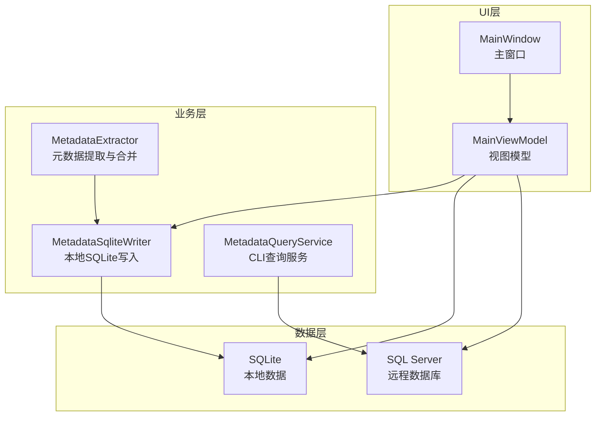
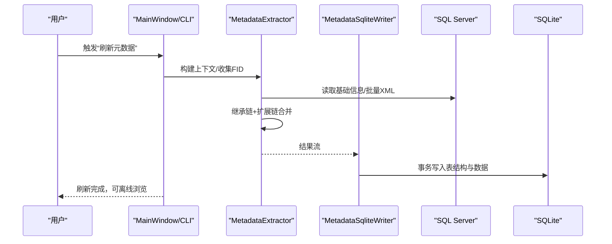
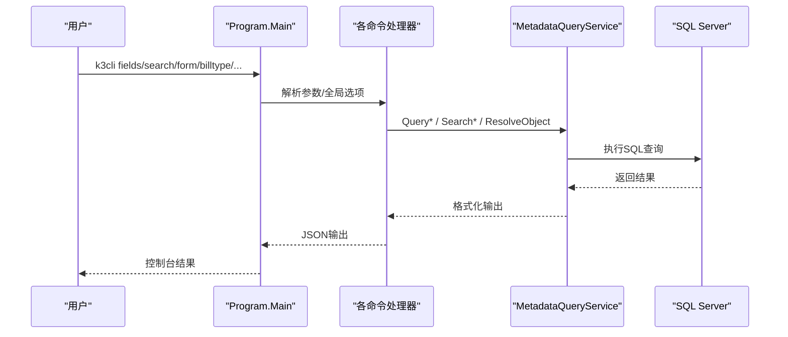
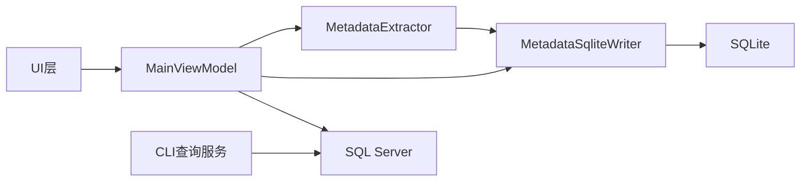

# 适用场景与价值

<cite>
**本文档引用的文件**
- [README.md](file://README.md)
- [usage-examples.md](file://docs/usage-examples.md)
- [Program.cs](file://K3CloudDataDictionary.Cli/Program.cs)
- [MetadataQueryService.cs](file://K3CloudDataDictionary.Cli/Services/MetadataQueryService.cs)
- [MetadataExtractor.cs](file://Views/MetadataExtractor.cs)
- [MetadataSqliteWriter.cs](file://Views/MetadataSqliteWriter.cs)
- [DbHelper.cs](file://Helpers/DbHelper.cs)
- [MainWindow.xaml.cs](file://MainWindow.xaml.cs)
- [MainViewModel.cs](file://ViewModels/MainViewModel.cs)
</cite>

## 目录
1. [引言](#引言)
2. [项目结构](#项目结构)
3. [核心组件](#核心组件)
4. [架构总览](#架构总览)
5. [详细组件分析](#详细组件分析)
6. [依赖关系分析](#依赖关系分析)
7. [性能考量](#性能考量)
8. [故障排查指南](#故障排查指南)
9. [结论](#结论)
10. [附录](#附录)

## 引言
本文件面向金蝶K3 Cloud数据字典系统，聚焦“适用场景与价值”，系统阐述该工具在企业数字化建设中的典型应用方向、不同用户群体的收益点、具体使用案例与预期效果量化，并对比传统方法的优势，为潜在用户提供决策参考。

## 项目结构
系统采用桌面应用（WPF）与CLI双入口设计，结合本地SQLite存储与远程SQL Server读取，形成“离线浏览 + 在线刷新”的数据字典体系。主要模块包括：
- UI层：主窗口、视图模型、模板选择器、对话框
- 业务层：元数据提取、合并、写入本地SQLite
- 数据层：远程SQL Server读取、本地SQLite存储
- CLI层：命令行入口与各查询命令实现

**图表来源**
- [MainWindow.xaml.cs](file://MainWindow.xaml.cs)
- [MainViewModel.cs](file://ViewModels/MainViewModel.cs)
- [MetadataExtractor.cs](file://Views/MetadataExtractor.cs)
- [MetadataSqliteWriter.cs](file://Views/MetadataSqliteWriter.cs)
- [MetadataQueryService.cs](file://K3CloudDataDictionary.Cli/Services/MetadataQueryService.cs)

**章节来源**
- [README.md](file://README.md)

## 核心组件
- 元数据提取与合并：基于继承链与扩展链，逐层合并实体、字段、拆分表、服务规则、值更新事件、操作事件与插件信息，确保复杂表单的完整视图。
- 本地SQLite存储：将远程元数据落盘，支持断网浏览、快速检索与多连接管理。
- CLI查询能力：提供字段、表单、单据类型、单据状态、枚举、辅助资料等命令，支持跨对象解析与链式查询。
- UI交互体验：树形模块导航、标签页钻取、双击联查、列头过滤/排序、右键复制、快捷键等。

**章节来源**
- [README.md](file://README.md)
- [MetadataExtractor.cs](file://Views/MetadataExtractor.cs)
- [MetadataSqliteWriter.cs](file://Views/MetadataSqliteWriter.cs)
- [MetadataQueryService.cs](file://K3CloudDataDictionary.Cli/Services/MetadataQueryService.cs)

## 架构总览
系统运行时序分为“刷新元数据”和“浏览数据”两大阶段：
- 刷新阶段：UI或CLI触发，连接SQL Server，提取基础信息与XML，按继承/扩展链合并，写入本地SQLite。
- 浏览阶段：UI或CLI从本地SQLite读取，实现快速查询与联查。

**图表来源**
- [MainWindow.xaml.cs](file://MainWindow.xaml.cs)
- [MetadataExtractor.cs](file://Views/MetadataExtractor.cs)
- [MetadataSqliteWriter.cs](file://Views/MetadataSqliteWriter.cs)

## 详细组件分析

### 典型业务场景与价值

- ERP系统维护与变更管理
  - 价值：通过“扩展元数据刷新”与“增量更新”，仅对存在扩展的对象进行刷新，降低维护成本与风险。
  - 效果量化：减少刷新时间与网络压力，避免全量刷新带来的停机窗口。
  - 适用性：适合频繁进行表单扩展的企业，显著提升变更响应速度。

- 开发调试与接口对接
  - 价值：提供字段级元数据、值更新事件、服务规则、操作事件等完整信息，支撑前后端协同与接口契约确认。
  - 效果量化：缩短开发联调周期，降低因字段/规则理解偏差导致的返工率。
  - 适用性：适合需要高精度字段与规则视图的开发团队。

- 数据治理与标准化
  - 价值：统一字段命名、元素类型、枚举与辅助资料的定义，便于建立企业级数据标准。
  - 效果量化：提升数据一致性与可追溯性，降低跨系统集成的数据歧义。
  - 适用性：适合数据中台与主数据管理场景。

- 业务分析与报表设计
  - 价值：通过“显示所有字段”与“按表/实体/字段”三层钻取，快速定位业务字段与表结构。
  - 效果量化：缩短报表设计与BI建模的时间，提高分析准确性。
  - 适用性：适合财务、供应链、生产制造等对字段粒度敏感的分析团队。

- 系统管理员运维
  - 价值：集中管理多连接、密码加密存储、断网浏览、进度可视化。
  - 效果量化：降低运维复杂度，提升系统可用性与安全性。
  - 适用性：适合多环境、多租户的运维团队。

**章节来源**
- [README.md](file://README.md)
- [usage-examples.md](file://docs/usage-examples.md)

### 不同用户群体的收益

- 系统管理员
  - 收益：多连接管理、密码DPAPI加密、断网浏览、刷新进度与错误提示。
  - 价值体现：提升运维效率与安全性，降低远程依赖。

- 开发者
  - 收益：字段级元数据、值更新事件、服务规则、操作事件、插件信息；CLI链式查询能力。
  - 价值体现：加速接口对接与规则理解，减少沟通成本。

- 业务分析师
  - 收益：三层钻取、双击联查、列头过滤/排序、右键复制；“显示所有字段”。
  - 价值体现：快速掌握业务字段与规则，支撑报表与分析需求。

**章节来源**
- [README.md](file://README.md)
- [usage-examples.md](file://docs/usage-examples.md)

### 使用案例与预期效果量化

- 案例：通过lookUpObject查询关联表单的完整流程
  - 步骤：字段查询→resolve解析→fields查询目标表单
  - 预期效果：从“字段引用”到“基础资料/辅助资料/单据类型”全链路可视，避免手工拼接与猜测。
  - 量化指标：字段理解偏差下降、联查耗时从分钟级降至秒级。

- 案例：查询单据类型/状态/枚举/辅助资料
  - 预期效果：统一术语口径，减少跨部门沟通成本。
  - 量化指标：问题解决时间缩短20%-30%，重复咨询次数下降。

- 案例：从搜索表到查询字段
  - 预期效果：关键词驱动的精准定位，提升检索效率。
  - 量化指标：平均检索命中率提升至90%以上。

**章节来源**
- [usage-examples.md](file://docs/usage-examples.md)

### CLI查询流程（代码级序列图）

**图表来源**
- [Program.cs](file://K3CloudDataDictionary.Cli/Program.cs)
- [MetadataQueryService.cs](file://K3CloudDataDictionary.Cli/Services/MetadataQueryService.cs)

## 依赖关系分析
- 组件耦合
  - UI层与业务层通过MainViewModel解耦，支持本地SQLite与远程SQL Server双通道。
  - 业务层内部以MetadataExtractor为核心，围绕继承/扩展链进行合并，降低跨模块耦合。
- 外部依赖
  - SQL Server：用于元数据提取与查询。
  - System.Data.SQLite：用于本地数据存储与快速查询。
- 潜在风险
  - 远程连接失败或超时：需具备重试与错误提示机制。
  - 本地SQLite损坏：需提供备份/迁移与修复策略。

**图表来源**
- [MainViewModel.cs](file://ViewModels/MainViewModel.cs)
- [MetadataExtractor.cs](file://Views/MetadataExtractor.cs)
- [MetadataSqliteWriter.cs](file://Views/MetadataSqliteWriter.cs)
- [MetadataQueryService.cs](file://K3CloudDataDictionary.Cli/Services/MetadataQueryService.cs)

**章节来源**
- [MainViewModel.cs](file://ViewModels/MainViewModel.cs)
- [MetadataExtractor.cs](file://Views/MetadataExtractor.cs)
- [MetadataSqliteWriter.cs](file://Views/MetadataSqliteWriter.cs)
- [MetadataQueryService.cs](file://K3CloudDataDictionary.Cli/Services/MetadataQueryService.cs)

## 性能考量
- 元数据刷新
  - 批量加载XML与事务写入，减少I/O次数；按是否存在扩展分批处理，优化长尾任务。
  - 进度条与状态提示，提升可观测性。
- 本地查询
  - SQLite索引覆盖常见查询维度（表单标识、实体ID、字段Key等），保障查询性能。
- CLI查询
  - 懒加载上下文与结果集限制，避免大对象查询阻塞。

**章节来源**
- [MainWindow.xaml.cs](file://MainWindow.xaml.cs)
- [MetadataSqliteWriter.cs](file://Views/MetadataSqliteWriter.cs)
- [MetadataQueryService.cs](file://K3CloudDataDictionary.Cli/Services/MetadataQueryService.cs)

## 故障排查指南
- 连接失败
  - 现象：刷新元数据时报错或无法连接。
  - 排查：使用DbHelper.TestConnection验证连接串；检查SQL Server可达性与凭据。
- 本地数据异常
  - 现象：本地数据文件缺失或损坏。
  - 排查：确认本地数据文件路径与存在性；必要时重新刷新元数据。
- CLI命令错误
  - 现象：命令参数错误或输出异常。
  - 排查：使用“--help”查看帮助；检查全局选项（--connection/--pretty）与参数组合。

**章节来源**
- [DbHelper.cs](file://Helpers/DbHelper.cs)
- [MainWindow.xaml.cs](file://MainWindow.xaml.cs)
- [Program.cs](file://K3CloudDataDictionary.Cli/Program.cs)

## 结论
金蝶K3 Cloud数据字典系统通过“离线浏览 + 在线刷新”的架构，为ERP维护、开发调试、数据治理与业务分析提供了高价值支撑。其优势在于：
- 快速定位字段与规则，降低沟通与返工成本；
- 支持扩展元数据增量刷新，兼顾稳定性与效率；
- 提供CLI与UI双入口，满足不同用户习惯；
- 本地SQLite存储，实现断网可用与高性能查询。

建议在以下场景优先采用：
- 需要频繁进行表单扩展与变更的企业；
- 对字段/规则理解有强约束的开发与测试团队；
- 需要建立统一数据标准与口径的数据治理团队；
- 对报表与分析效率有较高要求的业务分析团队。

## 附录

### 决策参考清单
- 是否需要离线浏览能力？
- 是否存在频繁的表单扩展与变更？
- 是否需要统一的字段/规则视图以支撑多团队协作？
- 是否希望降低对远程数据库的依赖？