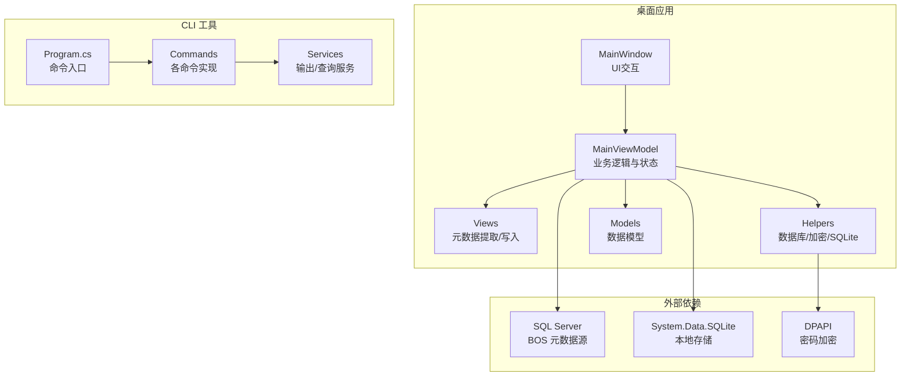
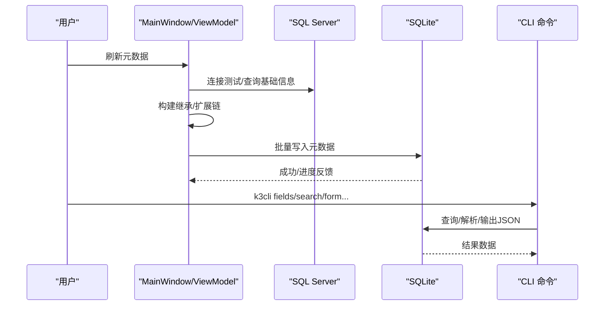
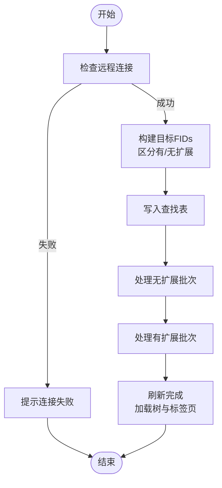
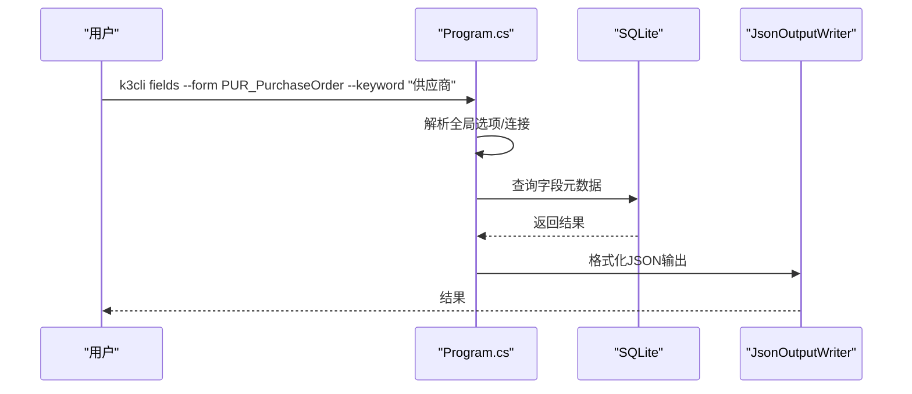
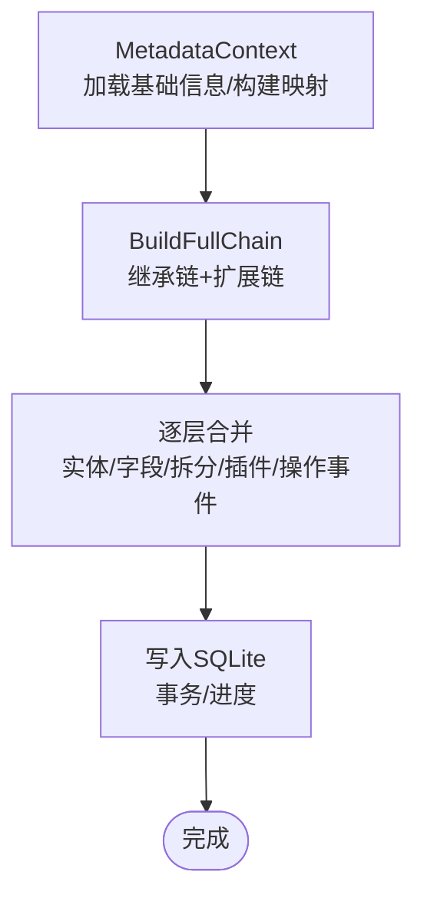
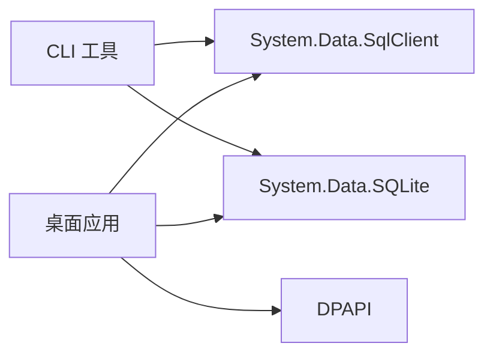

# 项目介绍

<cite>
**本文档引用的文件**
- [README.md](file://README.md)
- [K3CloudDataDictionary.csproj](file://K3CloudDataDictionary.csproj)
- [K3CloudDataDictionary.Cli/Program.cs](file://K3CloudDataDictionary.Cli/Program.cs)
- [Program.cs](file://Program.cs)
- [MainWindow.xaml.cs](file://MainWindow.xaml.cs)
- [ViewModels/MainViewModel.cs](file://ViewModels/MainViewModel.cs)
- [Views/MetadataExtractor.cs](file://Views/MetadataExtractor.cs)
- [Helpers/DbHelper.cs](file://Helpers/DbHelper.cs)
- [docs/usage-examples.md](file://docs/usage-examples.md)
- [Models/ConnectionInfo.cs](file://Models/ConnectionInfo.cs)
- [Models/FormInfo.cs](file://Models/FormInfo.cs)
- [Models/FieldInfo.cs](file://Models/FieldInfo.cs)
</cite>

## 目录
1. [引言](#引言)
2. [项目结构](#项目结构)
3. [核心组件](#核心组件)
4. [架构总览](#架构总览)
5. [详细组件分析](#详细组件分析)
6. [依赖分析](#依赖分析)
7. [性能考虑](#性能考虑)
8. [故障排查指南](#故障排查指南)
9. [结论](#结论)
10. [附录](#附录)

## 引言
本项目是面向金蝶 K3 Cloud BOS 平台的企业级数据字典工具，旨在帮助用户高效地浏览、查询与管理 K3 Cloud 的实体映射元数据。通过“本地 SQLite 存储 + 远程 SQL Server 提取”的架构设计，系统实现了：
- 企业内部统一的数据字典管理与共享
- 系统维护与升级过程中的元数据一致性保障
- 开发支持与二次开发的可视化辅助
- 快速定位字段、实体、服务规则、值更新事件、操作事件、插件等关键元数据

本工具的核心价值在于：将复杂、分散、易变的 BOS 元数据转化为结构化、可检索、可钻取的本地知识库，显著降低业务与技术人员的学习成本与沟通成本，提升研发与运维效率。

## 项目结构
项目采用分层清晰的目录组织，结合 WPF MVVM 架构与 CLI 工具，形成桌面应用与命令行工具双入口的完整体系。

图表来源
- [MainWindow.xaml.cs:36-86](file://MainWindow.xaml.cs#L36-L86)
- [ViewModels/MainViewModel.cs:198-215](file://ViewModels/MainViewModel.cs#L198-L215)
- [Views/MetadataExtractor.cs:102-122](file://Views/MetadataExtractor.cs#L102-L122)
- [K3CloudDataDictionary.Cli/Program.cs:14-62](file://K3CloudDataDictionary.Cli/Program.cs#L14-L62)

章节来源
- [README.md:36-83](file://README.md#L36-L83)
- [K3CloudDataDictionary.csproj:1-21](file://K3CloudDataDictionary.csproj#L1-L21)

## 核心组件
- 桌面应用（WPF）
  - 主窗口与导航：模块树、标签页、搜索与过滤、双击联查
  - 本地数据浏览：表单、实体、字段、服务规则、值更新事件、操作事件、插件
  - 连接管理与元数据刷新：支持多连接、密码加密、增量刷新
- CLI 工具
  - 命令式接口：fields/search/form/billtype/billstatus/assistantdata/enum/resolve/connections/help
  - JSON 输出与全局选项：pretty、--connection
- 元数据提取与合并
  - 继承链与扩展链构建与合并，确保复杂对象的元数据完整性
  - 批量写入本地 SQLite，支持事务与进度反馈
- 数据模型与服务
  - ConnectionInfo、FormInfo、FieldInfo 等模型支撑 UI 与查询
  - DbHelper 提供 SQL Server 连接测试与查询能力

章节来源
- [README.md:5-24](file://README.md#L5-L24)
- [ViewModels/MainViewModel.cs:18-121](file://ViewModels/MainViewModel.cs#L18-L121)
- [Views/MetadataExtractor.cs:102-138](file://Views/MetadataExtractor.cs#L102-L138)
- [K3CloudDataDictionary.Cli/Program.cs:14-62](file://K3CloudDataDictionary.Cli/Program.cs#L14-L62)

## 架构总览
系统采用“本地 SQLite + 远程 SQL Server”的双层架构：
- 远程层：通过 SQL Server 连接读取 BOS 元数据（对象基础信息、XML 等）
- 本地层：将元数据写入 SQLite，提供离线浏览与高性能查询
- UI 层：WPF MVVM，支持多标签页、列头过滤、排序、右键复制、快捷键等
- CLI 层：命令行工具，便于自动化脚本与批量查询

图表来源
- [MainWindow.xaml.cs:444-538](file://MainWindow.xaml.cs#L444-L538)
- [ViewModels/MainViewModel.cs:269-275](file://ViewModels/MainViewModel.cs#L269-L275)
- [Views/MetadataExtractor.cs:299-311](file://Views/MetadataExtractor.cs#L299-L311)
- [K3CloudDataDictionary.Cli/Program.cs:14-62](file://K3CloudDataDictionary.Cli/Program.cs#L14-L62)

## 详细组件分析

### 桌面应用（WPF MVVM）
- 主窗口与生命周期
  - 自动迁移旧版本地数据文件、根据连接计算本地路径、检测本地数据可用性
  - 支持多标签页管理、滚动与右键菜单、状态栏显示
- 元数据刷新流程
  - 支持全量刷新与仅扩展刷新，带进度条与防重复触发
  - 刷新成功后自动加载树形模块与标签页
- 双击联查与钻取
  - 引用对象 → 实体详情
  - 枚举类型 → 枚举项
  - 单据类型 → 单据类型列表
  - 显示所有字段、服务规则、值更新事件、插件等
- 搜索与过滤
  - 支持等于/包含/左包含/右包含四种运算符
  - 列头过滤、排序、右键复制、快捷键 Ctrl+W

图表来源
- [MainWindow.xaml.cs:444-538](file://MainWindow.xaml.cs#L444-L538)
- [ViewModels/MainViewModel.cs:269-275](file://ViewModels/MainViewModel.cs#L269-L275)

章节来源
- [MainWindow.xaml.cs:36-86](file://MainWindow.xaml.cs#L36-L86)
- [MainWindow.xaml.cs:444-648](file://MainWindow.xaml.cs#L444-L648)
- [ViewModels/MainViewModel.cs:198-215](file://ViewModels/MainViewModel.cs#L198-L215)

### CLI 工具（命令行）
- 命令入口与路由
  - fields/search/form/billtype/billstatus/assistantdata/enum/resolve/connections/help
  - 全局选项：--connection/-c、--pretty
- 连接解析与错误处理
  - 优先使用指定连接，否则使用默认连接；未配置时报错
  - 统一 JSON 错误输出
- 使用示例
  - 字段查询、lookUpObject 解析、单据类型/状态/枚举/辅助资料查询、搜索表单与实体

图表来源
- [K3CloudDataDictionary.Cli/Program.cs:14-62](file://K3CloudDataDictionary.Cli/Program.cs#L14-L62)
- [K3CloudDataDictionary.Cli/Program.cs:129-151](file://K3CloudDataDictionary.Cli/Program.cs#L129-L151)
- [docs/usage-examples.md:1-150](file://docs/usage-examples.md#L1-L150)

章节来源
- [K3CloudDataDictionary.Cli/Program.cs:14-62](file://K3CloudDataDictionary.Cli/Program.cs#L14-L62)
- [docs/usage-examples.md:1-150](file://docs/usage-examples.md#L1-L150)

### 元数据提取与合并（继承链+扩展链）
- 上下文构建
  - 一次性加载所有对象基础信息（不含 XML）
  - 构建扩展映射与目标 FIDs 集合
- 处理链构建
  - 从 FINHERITPATH 解析继承链并反转（根→当前）
  - 每层继承节点后追加其扩展 FIDs
- 合并策略
  - 实体/字段：按 OID 匹配父级，action=remove 删除，edit 覆盖属性
  - 拆分表：按 EntityKey+Suffix 匹配，覆盖描述
  - 插件/操作事件/校验规则：按 OID 或 Id 匹配，支持 remove/覆盖/新增
- 批量写入
  - 支持事务与进度回调，写入 SQLite

图表来源
- [Views/MetadataExtractor.cs:102-138](file://Views/MetadataExtractor.cs#L102-L138)
- [Views/MetadataExtractor.cs:299-311](file://Views/MetadataExtractor.cs#L299-L311)
- [Views/MetadataExtractor.cs:322-360](file://Views/MetadataExtractor.cs#L322-L360)

章节来源
- [Views/MetadataExtractor.cs:102-138](file://Views/MetadataExtractor.cs#L102-L138)
- [Views/MetadataExtractor.cs:299-311](file://Views/MetadataExtractor.cs#L299-L311)

### 数据模型与服务
- 连接信息模型
  - 支持多连接、默认连接、DPAPI 加密存储、本地文件名生成
- 表单/字段模型
  - 支持属性变更通知、显示计数（插件/服务规则/值更新等）
- 数据库助手
  - 连接测试、查询执行、标量执行

章节来源
- [Models/ConnectionInfo.cs:86-118](file://Models/ConnectionInfo.cs#L86-L118)
- [Models/FormInfo.cs:50-91](file://Models/FormInfo.cs#L50-L91)
- [Models/FieldInfo.cs:88-94](file://Models/FieldInfo.cs#L88-L94)
- [Helpers/DbHelper.cs:9-25](file://Helpers/DbHelper.cs#L9-L25)

## 依赖分析
- 技术栈
  - 框架：.NET Framework 4.7.2 + WPF
  - UI 库：HandyControl 3.5.1
  - 本地存储：System.Data.SQLite
  - 远程访问：System.Data.SqlClient
  - 密码保护：DPAPI（CurrentUser）
  - 架构模式：MVVM
- 外部依赖
  - SQL Server：BOS 元数据源
  - SQLite：本地元数据存储
  - DPAPI：连接密码加密

图表来源
- [K3CloudDataDictionary.csproj:13-16](file://K3CloudDataDictionary.csproj#L13-L16)

章节来源
- [K3CloudDataDictionary.csproj:1-21](file://K3CloudDataDictionary.csproj#L1-L21)

## 性能考虑
- 批量处理与进度反馈
  - 元数据刷新采用分批处理（无扩展/有扩展两阶段），并提供进度条与状态提示
- 本地查询优化
  - 元数据刷新完成后，所有浏览均基于本地 SQLite，避免远程往返
- 连接复用与超时
  - 查询命令超时设置为 60 秒，防止长时间阻塞
- UI 响应性
  - 刷新与查询在后台线程执行，UI 通过 Dispatcher 更新状态与提示

章节来源
- [MainWindow.xaml.cs:480-538](file://MainWindow.xaml.cs#L480-L538)
- [Helpers/DbHelper.cs:36-67](file://Helpers/DbHelper.cs#L36-L67)

## 故障排查指南
- 连接失败
  - 使用连接管理对话框测试连接，确认服务器 IP、端口、数据库、用户名、密码正确
  - 若提示连接失败，检查网络连通性与 SQL Server 配置
- 本地数据异常
  - 若本地数据文件被删除，会清空主界面数据并提示重新连接或导入数据
  - 刷新完成后，若状态仍提示“请刷新元数据”，检查远程连接有效性
- CLI 使用
  - 未配置默认连接时，需使用 --connection 指定连接 ID 或先设置默认连接
  - 出错时查看 JSON 错误输出，定位具体命令与参数

章节来源
- [MainWindow.xaml.cs:453-457](file://MainWindow.xaml.cs#L453-L457)
- [MainWindow.xaml.cs:430-442](file://MainWindow.xaml.cs#L430-L442)
- [K3CloudDataDictionary.Cli/Program.cs:129-151](file://K3CloudDataDictionary.Cli/Program.cs#L129-L151)

## 结论
本项目通过“本地 SQLite + 远程 SQL Server”的架构，将 K3 Cloud 的复杂元数据转化为易于浏览与查询的知识库，显著提升了企业内部数据字典管理的效率与准确性。其双入口设计（桌面应用 + CLI）满足了不同场景下的使用需求，既适合日常浏览与联查，也适合自动化脚本与批量查询。对于系统维护、开发支持与二次开发而言，该项目提供了稳定、可靠、可视化的元数据支撑平台。

## 附录
- 主要应用场景
  - 企业内部数据字典管理与共享
  - 系统维护与升级过程中的元数据一致性保障
  - 开发支持与二次开发的可视化辅助
- 创新点与竞争优势
  - 继承链+扩展链合并，确保复杂对象元数据完整性
  - 本地 SQLite 存储，离线浏览与高性能查询
  - 双击联查与多标签页管理，提升用户体验
  - CLI 命令行工具，支持自动化与批量查询
- 不同角色的价值认知
  - 业务人员：快速理解字段含义、引用关系与状态枚举
  - 开发人员：定位实体、服务规则、值更新事件与插件，加速二次开发
  - 运维人员：维护连接、刷新元数据、监控状态与异常

章节来源
- [README.md:5-24](file://README.md#L5-L24)
- [docs/usage-examples.md:515-542](file://docs/usage-examples.md#L515-L542)