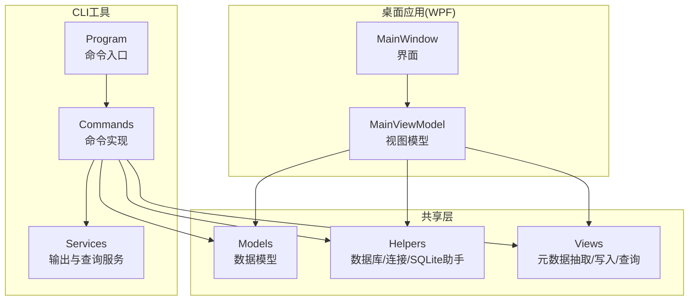
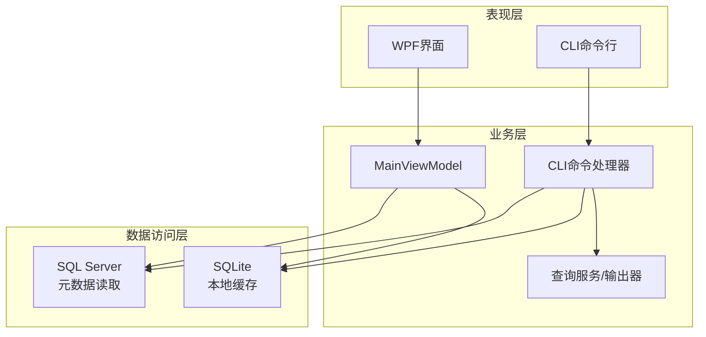
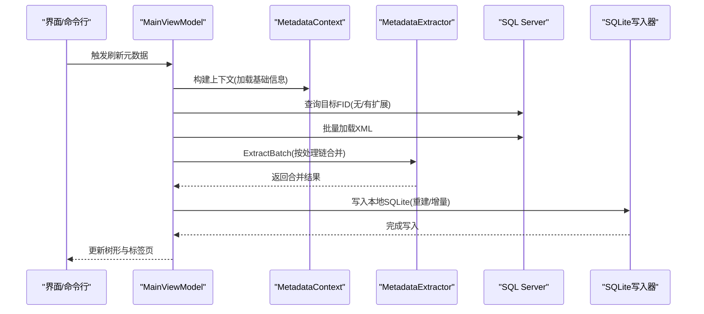
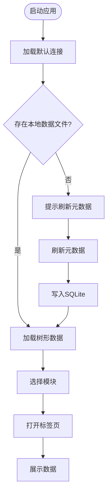
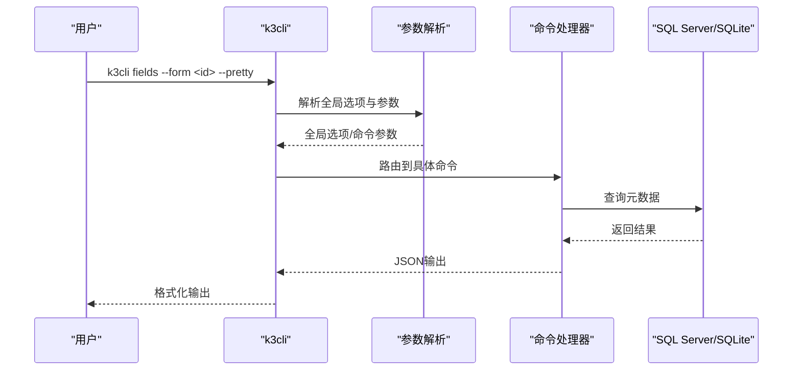
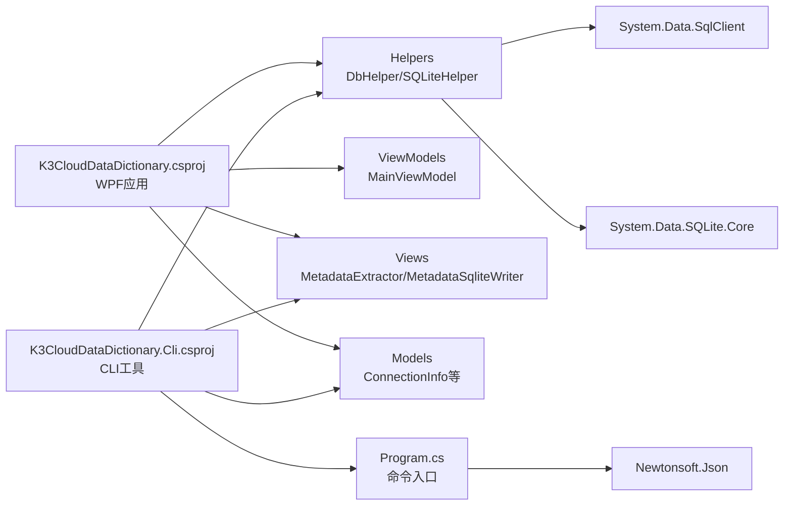

# 项目概述

<cite>
**本文档引用的文件**
- [K3CloudDataDictionary.csproj](file://K3CloudDataDictionary.csproj)
- [K3CloudDataDictionary.Cli.csproj](file://K3CloudDataDictionary.Cli.csproj)
- [Program.cs](file://K3CloudDataDictionary.Cli/Program.cs)
- [MainWindow.xaml.cs](file://MainWindow.xaml.cs)
- [MainViewModel.cs](file://ViewModels/MainViewModel.cs)
- [DbHelper.cs](file://Helpers/DbHelper.cs)
- [SQLiteHelper.cs](file://Helpers/SQLiteHelper.cs)
- [MetadataExtractor.cs](file://Views/MetadataExtractor.cs)
- [MetadataDbHelper.cs](file://Views/MetadataDbHelper.cs)
- [MetadataSqliteWriter.cs](file://Views/MetadataSqliteWriter.cs)
- [ConnectionInfo.cs](file://Models/ConnectionInfo.cs)
- [usage-examples.md](file://docs/usage-examples.md)
</cite>

## 目录
1. [引言](#引言)
2. [项目结构](#项目结构)
3. [核心组件](#核心组件)
4. [架构总览](#架构总览)
5. [详细组件分析](#详细组件分析)
6. [依赖关系分析](#依赖关系分析)
7. [性能考虑](#性能考虑)
8. [故障排查指南](#故障排查指南)
9. [结论](#结论)
10. [附录](#附录)

## 引言
本项目面向金蝶K3 Cloud ERP系统，提供一套“数据字典”管理与查询工具，帮助用户高效理解与检索系统元数据。系统支持两种使用模式：
- 图形界面模式（WPF）：提供可视化树形导航、标签页浏览、连接管理与元数据刷新等交互能力。
- 命令行模式（CLI）：提供丰富的查询命令，便于脚本化集成与自动化运维。

系统通过本地SQLite缓存机制，将SQL Server中的元数据对象（表单、实体、字段、拆分表、插件、业务服务、单据类型、辅助资料、枚举等）抽取并落盘，实现离线查询与快速检索。项目还内置“连接配置”SQLite数据库，统一管理多个K3 Cloud实例的连接信息与本地数据文件映射。

## 项目结构
项目采用“主应用 + CLI工具 + 共享模型与视图”的组织方式，核心目录与职责如下：
- Helpers：通用辅助模块（数据库连接测试、密码加密、SQLite连接配置与扫描）
- Models：跨模块共享的数据模型（连接信息、元数据查询结果等）
- Views：元数据抽取、写入与查询相关的视图层（含SQLite写入器、SQL Server读取器、上下文构建器）
- ViewModels：WPF界面的视图模型（负责树形数据、标签页、查询与状态管理）
- K3CloudDataDictionary.Cli：命令行工具，提供字段查询、表单搜索、单据类型/状态/枚举/辅助资料解析等命令
- docs：使用示例与命令速查

图表来源
- [MainWindow.xaml.cs:1-120](file://MainWindow.xaml.cs#L1-L120)
- [MainViewModel.cs:1-120](file://ViewModels/MainViewModel.cs#L1-L120)
- [Program.cs:1-80](file://K3CloudDataDictionary.Cli/Program.cs#L1-L80)
- [DbHelper.cs:1-40](file://Helpers/DbHelper.cs#L1-L40)
- [SQLiteHelper.cs:1-60](file://Helpers/SQLiteHelper.cs#L1-L60)
- [MetadataExtractor.cs:1-60](file://Views/MetadataExtractor.cs#L1-L60)
- [MetadataSqliteWriter.cs:1-60](file://Views/MetadataSqliteWriter.cs#L1-L60)

章节来源
- [K3CloudDataDictionary.csproj:1-21](file://K3CloudDataDictionary.csproj#L1-L21)
- [K3CloudDataDictionary.Cli.csproj:1-49](file://K3CloudDataDictionary.Cli.csproj#L1-L49)

## 核心组件
- 连接与本地数据管理
  - 连接配置：通过SQLite存储连接信息，支持默认连接、多连接切换与本地数据文件名映射。
  - 本地数据：按连接生成独立的SQLite文件，支持扫描、导入、重命名与迁移。
- 元数据抽取与合并
  - 上下文构建：基于SQL Server元数据表一次性加载基础信息，构建继承链与扩展链。
  - 批量抽取：按目标FID收集所需XML，逐个合并实体、字段、拆分表、插件、表单操作等。
- SQLite写入与索引
  - 全量/增量写入：重建表或复用现有表，写入多类元数据表并建立必要索引。
  - 级联删除：按表单标识删除相关联的插件、业务服务、实体服务规则、字段更新动作、表单操作及其子表。
- 查询与展示
  - WPF界面：树形导航、标签页、状态栏提示、搜索与快捷操作。
  - CLI命令：fields/search/form/billtype/billstatus/enum/assistantdata/resolve/connections等。

章节来源
- [ConnectionInfo.cs:1-120](file://Models/ConnectionInfo.cs#L1-L120)
- [SQLiteHelper.cs:17-120](file://Helpers/SQLiteHelper.cs#L17-L120)
- [MetadataExtractor.cs:102-284](file://Views/MetadataExtractor.cs#L102-L284)
- [MetadataSqliteWriter.cs:79-283](file://Views/MetadataSqliteWriter.cs#L79-L283)
- [MainViewModel.cs:280-321](file://ViewModels/MainViewModel.cs#L280-L321)

## 架构总览
系统整体分为三层：
- 表现层：WPF界面与CLI命令行，分别提供交互式体验与批量化查询能力。
- 业务层：视图模型与命令实现，负责UI状态、查询调度、进度反馈与错误处理。
- 数据访问层：SQL Server读取器与SQLite写入器，负责元数据抽取、合并与本地持久化。

图表来源
- [MainWindow.xaml.cs:444-538](file://MainWindow.xaml.cs#L444-L538)
- [MainViewModel.cs:269-275](file://ViewModels/MainViewModel.cs#L269-L275)
- [Program.cs:14-69](file://K3CloudDataDictionary.Cli/Program.cs#L14-L69)
- [MetadataDbHelper.cs:44-79](file://Views/MetadataDbHelper.cs#L44-L79)
- [MetadataSqliteWriter.cs:285-301](file://Views/MetadataSqliteWriter.cs#L285-L301)

## 详细组件分析

### 组件A：元数据上下文与抽取流程
- 元数据上下文（MetadataContext）
  - 加载所有对象基础信息（不含XML），构建扩展映射与目标FID集合。
  - 支持继承链与扩展链的完整处理链构建，确保合并时的父子关系正确。
- 元数据抽取（MetadataExtractor）
  - 批量收集所需FID → 一次性加载XML → 逐个提取并合并实体/字段/拆分表/插件/表单操作。
  - 合并策略：按oid匹配父级，action=remove删除，action=edit覆盖属性；无oid按Id/Key新增。
- 写入器（MetadataSqliteWriter）
  - 全量/增量模式：重建表或复用现有表，写入多类元数据表并建立索引。
  - 级联删除：按表单标识删除相关联的插件、业务服务、实体服务规则、字段更新动作、表单操作及其子表。

图表来源
- [MainWindow.xaml.cs:480-538](file://MainWindow.xaml.cs#L480-L538)
- [MetadataExtractor.cs:299-360](file://Views/MetadataExtractor.cs#L299-L360)
- [MetadataSqliteWriter.cs:285-301](file://Views/MetadataSqliteWriter.cs#L285-L301)

章节来源
- [MetadataExtractor.cs:102-284](file://Views/MetadataExtractor.cs#L102-L284)
- [MetadataExtractor.cs:299-360](file://Views/MetadataExtractor.cs#L299-L360)
- [MetadataSqliteWriter.cs:79-283](file://Views/MetadataSqliteWriter.cs#L79-L283)

### 组件B：WPF界面与标签页管理
- 树形导航与标签页
  - 根据本地SQLite数据动态生成模块树，支持展开/折叠与选择事件。
  - 标签页按模块类型区分（表单、实体、字段、枚举、单据类型、服务规则、插件、值更新等），支持多标签页并排与关闭。
- 连接与刷新
  - 支持连接对话框添加/切换连接，自动检测本地数据文件是否存在与有效性。
  - 提供“刷新元数据”与“刷新扩展元数据”两种模式，带防重复点击与进度反馈。
- 快捷操作
  - 双击字段可跳转到关联表单实体、枚举项、单据类型、辅助资料等。
  - 支持搜索框与快捷键触发查询。

图表来源
- [MainWindow.xaml.cs:36-86](file://MainWindow.xaml.cs#L36-L86)
- [MainViewModel.cs:323-357](file://ViewModels/MainViewModel.cs#L323-L357)

章节来源
- [MainWindow.xaml.cs:36-120](file://MainWindow.xaml.cs#L36-L120)
- [MainViewModel.cs:323-357](file://ViewModels/MainViewModel.cs#L323-L357)

### 组件C：CLI命令与查询服务
- 命令入口
  - 解析全局选项（连接ID、Pretty打印），路由到具体命令实现。
- 命令类型
  - fields/search/form/billtype/billstatus/enum/assistantdata/resolve/connections/help等。
- 查询服务
  - JSON输出器：统一错误处理与格式化输出。
  - 连接解析：优先使用指定连接ID，否则使用默认连接。

图表来源
- [Program.cs:14-69](file://K3CloudDataDictionary.Cli/Program.cs#L14-L69)
- [usage-examples.md:1-160](file://docs/usage-examples.md#L1-L160)

章节来源
- [Program.cs:14-165](file://K3CloudDataDictionary.Cli/Program.cs#L14-L165)
- [usage-examples.md:1-160](file://docs/usage-examples.md#L1-L160)

## 依赖关系分析
- 技术栈
  - 桌面端：.NET Framework 4.7.2 + WPF + HandyControl UI框架
  - 命令行：.NET Framework 4.7.2 + 控制台应用
  - 数据库：System.Data.SqlClient（SQL Server）、System.Data.SQLite.Core（SQLite）
  - 序列化：Newtonsoft.Json（CLI输出）
- 项目间依赖
  - CLI项目通过链接共享源码的方式复用主项目的模型与视图层，减少重复维护成本。
- 外部依赖
  - 远程SQL Server：读取元数据对象基础信息与XML内核。
  - 本地SQLite：存储元数据与连接配置，支持多连接隔离与快速查询。

图表来源
- [K3CloudDataDictionary.csproj:9-16](file://K3CloudDataDictionary.csproj#L9-L16)
- [K3CloudDataDictionary.Cli.csproj:8-15](file://K3CloudDataDictionary.Cli.csproj#L8-L15)
- [Program.cs:1-10](file://K3CloudDataDictionary.Cli/Program.cs#L1-L10)

章节来源
- [K3CloudDataDictionary.csproj:1-21](file://K3CloudDataDictionary.csproj#L1-L21)
- [K3CloudDataDictionary.Cli.csproj:1-49](file://K3CloudDataDictionary.Cli.csproj#L1-L49)

## 性能考虑
- 批量加载与合并
  - 元数据抽取阶段一次性批量加载XML，避免多次往返数据库，显著降低网络开销。
  - 合并过程在内存中进行，利用字典与集合的快速查找，提升处理效率。
- 本地SQLite优化
  - 写入阶段使用事务包裹，减少磁盘I/O次数。
  - 建立必要的索引（如表单标识、实体主键、字段键等），加速查询。
- 并发与防抖
  - 刷新按钮通过原子标志位防止重复点击；搜索输入支持防抖延迟，减少无效查询。
- 连接与缓存
  - 本地数据文件按连接命名，避免多实例互相影响；支持导入/重命名/扫描，便于运维管理。

## 故障排查指南
- 连接失败
  - 使用连接测试函数验证SQL Server连接字符串是否有效。
  - 检查默认连接是否正确设置，或通过CLI指定连接ID。
- 本地数据异常
  - 若本地数据文件被删除，界面会清空数据并提示重新连接或导入数据。
  - 使用SQLiteHelper扫描data目录，确认文件是否存在且与连接映射正确。
- 刷新失败
  - 检查远程连接有效性与权限；确认SQL Server元数据表可访问。
  - 分别尝试“刷新元数据”与“刷新扩展元数据”，定位问题范围。
- CLI输出异常
  - 使用--pretty美化JSON输出，便于阅读。
  - 通过connections命令管理连接，确保默认连接或指定连接ID有效。

章节来源
- [DbHelper.cs:9-25](file://Helpers/DbHelper.cs#L9-L25)
- [SQLiteHelper.cs:218-254](file://Helpers/SQLiteHelper.cs#L218-L254)
- [MainWindow.xaml.cs:428-442](file://MainWindow.xaml.cs#L428-L442)
- [Program.cs:129-151](file://K3CloudDataDictionary.Cli/Program.cs#L129-L151)

## 结论
本项目通过“图形界面 + 命令行 + 本地SQLite缓存”的组合，为金蝶K3 Cloud用户提供了一套高效、稳定、可扩展的元数据管理方案。它不仅满足了日常查询与浏览需求，也为自动化运维与二次开发提供了坚实基础。双模式设计兼顾易用性与可编程性，本地缓存机制确保了查询性能与离线可用性。

## 附录
- 适用场景
  - ERP元数据探索与学习：快速了解表单、实体、字段、拆分表、插件与业务服务的关系。
  - 开发与测试支撑：定位字段来源（基础资料/辅助资料/枚举/单据类型）、查询单据状态值、解析lookUpObject。
  - 运维与审计：集中管理多个K3 Cloud实例的连接与本地数据文件，支持导入/导出与重命名。
- 价值主张
  - 一体化：统一入口，覆盖多种查询与管理模式。
  - 高效：本地SQLite缓存，秒级查询响应。
  - 可靠：完善的错误处理、连接测试与数据校验。
  - 开放：CLI命令与JSON输出，便于集成到CI/CD与监控体系。